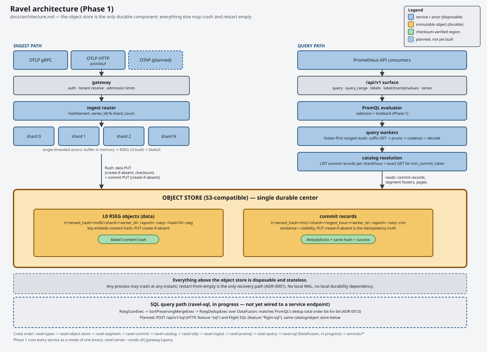
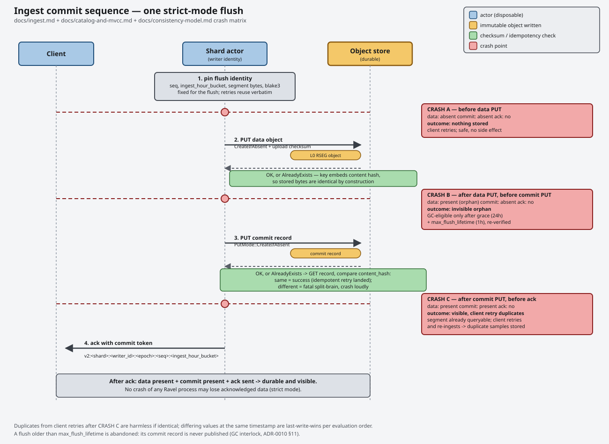
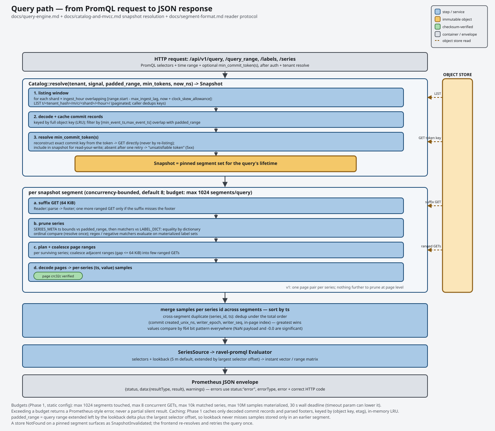
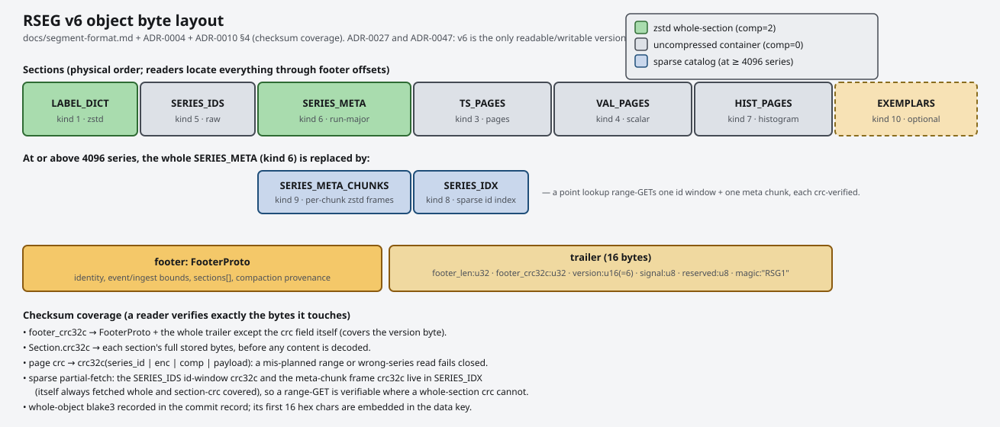

# Ravel

[](https://github.com/NOFireAI/ravel/actions/workflows/ci.yml)
[](https://github.com/NOFireAI/ravel/actions/workflows/ci.yml)
[](LICENSE)
[](rust-toolchain.toml)

Ravel is an OpenTelemetry-native observability database. Object storage is
its only durable backend: metrics, logs, and traces land as immutable
segments and commit records on S3 or MinIO, and every Ravel process
(gateway, ingest shard, query frontend) is disposable. If Ravel
acknowledges a write in strict mode, that data survives the crash,
restart, or redeployment of any Ravel process, because it survives on the
object store, not in any process's memory or local disk.

Ravel is a research prototype. Metrics and logs run end to end today, from
OTLP or Remote Write ingest through PromQL, SQL, and Flight SQL query,
against real S3/MinIO. Traces ingest, compact, and retain end to end too
(the span segment format, RSPAN, ADR-0041); there is no query surface over
them yet.

## See it run

```sh
make minio   # starts MinIO + bucket creation via docker compose
make demo    # builds ravel-server/ravel-cli, ingests one OTLP export, queries it back
```

`make demo` runs [scripts/demo.sh](scripts/demo.sh): it starts `ravel-server`
against MinIO, sends a generated OTLP metrics export over HTTP, prints the
commit token it receives, and queries that metric back by
`min_commit_token`. For the full walkthrough with expected output, see
[docs/guides/getting-started.md](docs/guides/getting-started.md).

The same round trip against a real local Kubernetes cluster, driven by the
Ravel operator instead of a bare process:

```sh
scripts/kind-up.sh     # kind cluster, both images, fake S3, operator, RavelCluster
scripts/kind-demo.sh   # OTLP ingest via the gateway, query back via the query tier
scripts/kind-down.sh   # delete the cluster
```

This needs `docker`, `kind`, and `kubectl`. For the `RavelCluster` field
reference and probe semantics, see
[docs/guides/kubernetes.md](docs/guides/kubernetes.md).

## How data moves



OTLP or Remote Write arrives at the gateway, which authenticates the
request, resolves a tenant, and checks admission limits before it buffers
anything. Points route to a shard actor by `hash(tenant, series_id)`. Each
shard actor is a single task with no locks; it buffers points until a size
or age trigger fires a flush.

A flush serializes a segment, PUTs it to the object store, mints an
immutable commit record, and PUTs that too. Only then does Ravel
acknowledge the waiting request with a commit token:



On the query side, `/api/v1/*` resolves a snapshot of segments from the
catalog by listing commit records in the relevant shard and hour buckets,
fetches each segment's footer, prunes series by label matchers, fetches
only the needed pages, and hands the merged samples to the PromQL
evaluator:



Everything after "PUT succeeded" is derived, replaceable, and disposable.
Segments themselves are packed for partial reads: a suffix GET for the
footer, ranged GETs for only the pages a query touches, every section
checksummed on its own.



For the full crate dependency graph, see
[docs/architecture.md](docs/architecture.md). For the reasoning behind each
piece, see [docs/adrs/](docs/adrs/).

## What's built

- **OTLP ingest**, HTTP and gRPC, for metrics (gauges and cumulative sums),
  logs, and traces, with admission limits, event-time skew bounds, and
  strict or buffered acknowledgement. Trace ingest (`POST /v1/traces`,
  `trace.v1.TraceService/Export`) routes and sorts spans by `trace_id`
  ([ADR-0041](docs/adrs/0041-rspan-v1-span-segment-format.md)) into
  immutable RSPAN objects; there is no query surface over spans yet (see
  What's next).
- **Prometheus Remote Write** ingest, `POST /api/v1/write`, both Remote
  Write 1.0 and 2.0, through the same admission and routing path as OTLP.
- **PromQL**: vector and matrix selectors, `offset`/`@`, binary operators,
  the aggregation operators (`sum`, `avg`, `min`, `max`, `count`, `group`,
  `stddev`, `stdvar`, `topk`, `bottomk`, `quantile`, `count_values`, with
  `by`/`without`), subqueries, and most of the function library (`rate`,
  `histogram_quantile`, the `*_over_time` family, label and math
  functions), over `/api/v1/query` and `/api/v1/query_range`. Native
  (exponential) histograms are ingested, stored, and queryable with the
  full set of native-histogram functions.
- **SQL**, through Apache DataFusion (`ravel-sql`): `POST /api/v1/sql`
  against a `samples` table (metrics) or a `logs` table, read-only, with
  the same duplicate-sample resolution as PromQL so the two agree on
  results. **Flight SQL** exposes the same query path over Arrow Flight's
  gRPC surface.
- **Analytics**: `POST /api/v1/analytics` runs a range query, then applies
  change point detection (PELT) or exact summary statistics (median, MAD,
  percentiles, standard deviation, variance) to each series.
- **Alerting and detection rules** (`ravel-alerting`, [ADR-0043](docs/adrs/0043-unified-alerting-engine.md)):
  one generic rule shape covers both a PromQL query with a threshold and a
  SQL query with a nonempty-result condition, so observability alerts and
  security detections share one engine. `ravel-server --mode all` (or
  `query`) evaluates every tenant's rules on `--alert-eval-interval-secs`
  and writes each state transition -- pending, firing, resolved -- as an
  immutable `Signal::Alerts` record, so alert history is queryable data
  rather than process memory. Rules are loaded at startup from
  `--alert-rules-file`; transitions notify `--alert-webhook-url` and
  `--alertmanager-url` sinks after the record is durable. See
  [Alerting](#alerting) below.
- **Compaction, retention, and garbage collection** (`ravel-maintain`):
  L0-to-L1 compaction, age-based retention, and a sweeper that removes
  orphaned objects, superseded inputs, and unreferenced parts. Signal-
  generic across metrics, logs, and traces, runs continuously under
  `ravel-server --mode maintain` or one-shot via `ravel-cli maintain`.
- **Grafana and Prometheus compatibility routes**: `/api/v1/labels`,
  `/api/v1/label/{name}/values`, `/api/v1/series`,
  `/api/v1/status/buildinfo`, `/api/v1/metadata`, `/-/healthy`, `/-/ready`.
- **A Kubernetes operator** (`ravel-operator`): a `RavelCluster` CRD that
  reconciles the gateway, ingest, query, and maintain roles as separate
  deployments. See [docs/guides/kubernetes.md](docs/guides/kubernetes.md).
- **Published container images**: `ravel-server` and `ravel-operator`,
  built in CI and pushed to GHCR on tag.

Two gaps worth knowing about: PromQL subqueries over native histograms
return a typed error rather than a wrong answer (issue #220), and native
`histogram_quantile`/`histogram_fraction` interpolate linearly within a
bucket where Prometheus 3.x interpolates exponentially, so interior
quantiles can differ.

## What's next

- A query surface for traces: a `spans` SQL table (built, not yet wired
  into `POST /api/v1/sql`) and trace-by-id lookup. Ingest, compaction, and
  retention for spans already run end to end (see What's built); nothing
  reads them back yet.
- Profiles and exemplars.
- Catalog snapshots: an index object in place of per-query listing, needed
  before listing-based discovery runs out of headroom.
- OTAP (OpenTelemetry Arrow) ingest: the codec is written but not wired
  into the gateway.

## Try a query

After ingest (see above), query the same data as PromQL or SQL. Both read
the same catalog and segments and apply the same duplicate-sample
resolution, so they agree.

```sh
# PromQL, instant
curl -G http://127.0.0.1:4318/api/v1/query \
  -H "Authorization: Bearer devtoken" \
  --data-urlencode "query=rate(http_requests_total[5m]) > 0" \
  --data-urlencode "time=<unix seconds>"

# PromQL, range
curl -G http://127.0.0.1:4318/api/v1/query_range \
  -H "Authorization: Bearer devtoken" \
  --data-urlencode "query=rate(http_requests_total[5m])" \
  --data-urlencode "start=<unix seconds>" \
  --data-urlencode "end=<unix seconds>" \
  --data-urlencode "step=15s"

# SQL over metrics (needs ravel-server built/run with --features sql)
curl -X POST http://127.0.0.1:4318/api/v1/sql \
  -H "Authorization: Bearer devtoken" -H "Content-Type: application/json" \
  -d '{"query": "SELECT ts, value FROM samples ORDER BY ts", "start": 0, "end": 1893456000}'

# SQL over logs
curl -X POST http://127.0.0.1:4318/api/v1/sql \
  -H "Authorization: Bearer devtoken" -H "Content-Type: application/json" \
  -d '{"query": "SELECT ts, body FROM logs WHERE has_word(body, '\''timeout'\'') ORDER BY ts", "start": 0, "end": 1893456000}'

# Analytics: change point detection over a range query
curl -X POST http://127.0.0.1:4318/api/v1/analytics \
  -H "Authorization: Bearer devtoken" -H "Content-Type: application/json" \
  -d '{"query": "http_requests_total", "start": 0, "end": 1893456000, "step": "30s",
       "op": {"type": "change_point", "downsample": false}}'
```

The SQL endpoint is off by default; build or run `ravel-server` with the
`sql` cargo feature (`flight-sql` implies `sql`). It accepts only `SELECT`
statements, and rejected statements or execution errors return a redacted
error body, never raw backend or DataFusion plan text. For the full `logs`
table reference and every analytics op's request/response schema, see
[docs/guides/query.md](docs/guides/query.md) and
[docs/analytics.md](docs/analytics.md).

## Alerting

Rules are a JSON file, loaded at startup. Each rule names a tenant, one query
(`promql` or `sql`), and the condition that makes it fire:

```json
{
  "rules": [
    {
      "tenant": "acme",
      "rule_id": "high-error-rate",
      "promql": "sum by (job) (rate(http_errors_total[5m]))",
      "condition": {"type": "threshold", "op": "gt", "value": 10},
      "labels": {"severity": "page"},
      "annotations": {"summary": "error rate is high"},
      "for": "5m"
    },
    {
      "tenant": "acme",
      "rule_id": "root-login",
      "sql": "select * from logs where has_word(body, 'root') and severity_num >= 17",
      "condition": {"type": "non_empty_result"}
    }
  ]
}
```

A PromQL rule takes a `threshold` condition (`op` is one of `gt`, `ge`, `lt`,
`le`, `eq`, `ne`) and fires when any series in the instant vector satisfies it.
A SQL rule takes `non_empty_result` and fires when the query returns any row;
SQL rules need the `sql` cargo feature. `for` is optional and delays firing
until the condition has held that long, exactly as in Prometheus alerting.

```sh
ravel-server --mode all \
  --tenant-token devtoken=acme \
  --alert-rules-file rules.json \
  --alert-eval-interval-secs 60 \
  --alert-webhook-url https://example.invalid/ravel-alerts \
  --alertmanager-url http://alertmanager:9093
```

Every transition is written as an immutable record before any sink is
contacted, so a sink that is down loses notifications, never alert history;
delivery is at-least-once and retried on later ticks, including across a
process restart (the evaluator re-queues every still-open alert for one
delivery attempt the first tick after it starts). Sinks are optional: with
none configured, transitions are still recorded durably.

## Container images

```sh
docker pull ghcr.io/nofireai/ravel-server:latest
docker pull ghcr.io/nofireai/ravel-operator:latest
```

Tags: `X.Y.Z`, `X.Y`, `X`, and `latest` on a `vX.Y.Z` git tag push;
`manual-<short-sha>` from a manual `workflow_dispatch` run of
[publish-images.yml](.github/workflows/publish-images.yml). GHCR creates a
package private on its first push; until it's flipped to public in the
package settings, pulling needs `docker login ghcr.io` with a PAT that has
`read:packages`. Building an
amd64 image on Apple Silicon via `docker build --platform linux/amd64` is
not supported; `rustc` segfaults under Docker Desktop's QEMU emulation.
Pull the published image, or build natively on an amd64 host, instead.

## Repository layout

- `crates/`: libraries: types, object store, segment formats (RSEG for
  metrics, RLOG for logs, RSPAN for spans), commit protocol, catalog,
  OTLP/OTAP/Remote Write decode, ingest actors, PromQL, query engine, and
  `ravel-sql` (DataFusion-backed SQL and Flight SQL)
- `services/`: `ravel-server` (gateway, ingest, query, and maintain modes
  in one binary) and `ravel-cli` (segment, commit, and catalog inspector)
- `docs/`: specs, ADRs, diagrams, and the user guides in `docs/guides/`
- `proto/`: protobuf schemas, vendored OTAP protos
- `deploy/docker-compose/`: local MinIO stack
- `deploy/k8s/`: operator manifests (CRD, RBAC, Deployment), an example
  `RavelCluster`, and the fake-S3 backends used by the kind environment
- `scripts/`: `demo.sh` and the `kind-*.sh` scripts above

## Documentation

- [docs/README.md](docs/README.md): index of every guide and spec
- [docs/segment-format.md](docs/segment-format.md): the RSEG v5
  specification (columnar catalog, native histograms, multi-run
  compaction layout, sparse catalog), the only version Ravel reads or
  writes pre-release (ADR-0027)
- [docs/log-segment-format.md](docs/log-segment-format.md): the RLOG v1
  specification (ADR-0029)
- [docs/span-segment-format.md](docs/span-segment-format.md): the RSPAN
  v1 specification (ADR-0041)
- [docs/guides/](docs/guides/): getting started, ingest, query,
  operations, inspecting data, Kubernetes
- [docs/adrs/](docs/adrs/): one decision record per architectural choice
- [docs/sql-conformance.md](docs/sql-conformance.md): the SQL surface
  conformance table, classifying every construct as supported,
  intentionally rejected, or unclassified (ADR-0035)
- [BENCHMARKS.md](BENCHMARKS.md): measured numbers, with the exact
  commands and environment that produced them
- [PROGRESS.md](PROGRESS.md): a living log of what shipped, what broke,
  and what's next
