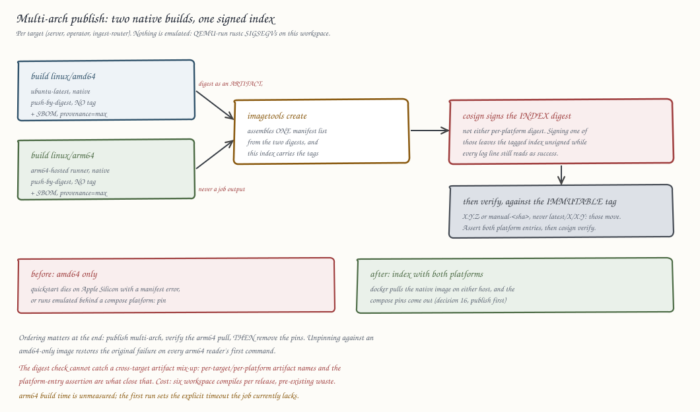

# ADR-0037: CI-built container images published to GHCR

Status: Accepted

## Context

The root `Dockerfile` (ADR-0034 decision 5) and its CI companion
`Dockerfile.prebuilt` (decision 7) already produce `server` and
`operator` images. `.github/workflows/ci.yml`'s `docker-build` job
(ci.yml:665-710) builds both targets from the root `Dockerfile` on every
push that touches it, and `k8s-integration` (ci.yml:527-636) assembles
both from prebuilt binaries for the kind lane. Both are build-only: no
job tags or pushes an image anywhere, no registry is referenced anywhere
in the repo (`deploy/k8s/operator/operator.yaml:41` hardcodes
`image: ravel-operator:latest` as a placeholder the kind scripts
override), and no publish workflow exists.

A developer on Apple Silicon trying to build a shipping amd64 image
locally hits this:

```
1.478 info: syncing channel updates for 1.97.1-x86_64-unknown-linux-gnu
6.963 error: process didn't exit successfully: `rustc -vV` (signal: 11, SIGSEGV)
6.963 qemu: uncaught target signal 11 (Segmentation fault) - core dumped
```

This is Docker Desktop cross-emulating `linux/amd64` through QEMU on an
arm64 host; `rustc` reliably segfaults under QEMU's user-mode emulation.
It is not a bug in the Dockerfile, the Rust toolchain pin, or the
workspace: `docker-build` and `k8s-integration` both already build the
identical `Dockerfile` successfully today, because GitHub-hosted
`ubuntu-latest` runners are native amd64 and never invoke QEMU. The
actual gap is that nothing ever pushes what CI already proves it can
build, and there is no registry for a developer or a cluster to pull
from instead of building locally at all.

The repo has no existing cloud registry account, secret, or credential
of any kind (no AWS, no ECR references outside the failing local
command's `$ECR` env var, which is a developer-local convention, not
repo config).

## Decision

1. **Registry: GitHub Container Registry (GHCR), not ECR.** Images
   publish to `ghcr.io/nofireai/ravel-server` and
   `ghcr.io/nofireai/ravel-operator`. GHCR needs no new credential:
   Actions' ambient `GITHUB_TOKEN` authenticates with `packages: write`
   permission, scoped to this repo. ECR would require provisioning an
   AWS account/role, OIDC federation or long-lived keys, and ongoing
   IAM maintenance for a repo that otherwise has zero AWS footprint
   (object storage is generic S3-compatible, exercised against MinIO
   and floci in CI, never AWS). GHCR also makes `docker pull` from a
   laptop or a cluster a one-line, token-scoped operation instead of an
   AWS credential exchange.

2. **Build source: the root `Dockerfile`, not `Dockerfile.prebuilt`.**
   The published image is the same artifact `docker-build` already
   verifies compiles: correct shipping glibc (Debian 12, matching the
   `rust:1.97.1-bookworm` builder), includes `ravel-cli` in the server
   image, and has no cache-freshness assumptions about a runner's local
   `target/`. `Dockerfile.prebuilt` exists specifically to reuse
   `k8s-integration`'s warm sccache/rust-cache for a fast kind loop
   (Dockerfile.prebuilt:5-16) and ships a deliberately different glibc
   (Debian 13) and binary set (no `ravel-cli`) documented as CI-lane-only
   in its own header. Publishing from it would ship an image that
   diverges from what `docker-build` gates and would need its own glibc
   compatibility story for arbitrary pull targets.

3. **Runner: `ubuntu-latest`, matching `docker-build`.** Native amd64,
   no QEMU, so the SIGSEGV above cannot occur in CI. `linux/amd64` is
   the only platform published; see Rejected alternatives for why
   arm64 is deferred rather than added now.

4. **Trigger and tag scheme**, new workflow
   `.github/workflows/publish-images.yml`, a separate workflow file from
   `ci.yml` (not a shared job), since this one needs registry credentials
   the build-verification job should never hold. Triggers only on
   **release tags and manual dispatch, never on a plain push to
   `main`**:
   - Push of a tag matching `v[0-9]+.[0-9]+.[0-9]+`: tags `X.Y.Z`, `X.Y`,
     `X`, and `latest`.
   - `workflow_dispatch`: tag `manual-<short-sha>`, for an on-demand
     publish without cutting a release tag.
   A `main`-push trigger was considered and dropped: the root
   Dockerfile's builder stage is one `COPY . .` layer followed by a
   single `RUN cargo build` (Dockerfile:29,46), so any source change
   invalidates that layer and `cache-from: type=gha` cannot hit it on a
   main push — this is structural, not a cache-tuning gap. Running the
   ~57-minute (Dockerfile.prebuilt:8), OOM-prone-at-high-parallelism
   build on every push to `main` would make this the most expensive job
   in the repo, on exactly the path `docker-build` already avoids for
   that reason (ci.yml:651-655), and would thrash the 10 GB per-repo
   GHA cache shared with `sccache`-gha and `Swatinem/rust-cache` across
   `check`/`coverage`/`k8s-integration`. Tag pushes and manual dispatch
   are infrequent enough that the same cache-miss cost is acceptable.
   Per-main-commit images are deferred to the same arm64/prebuilt
   follow-up as multi-arch, not solved here. No tag scheme exists yet in
   the repo (workspace version is `0.1.0` pre-release, no git tags cut);
   this ADR establishes the first one.
   The job declares `permissions: {contents: read, packages: write}`
   explicitly rather than relying on the org default (which may be
   read-only), and the image path is the hardcoded, already-lowercase
   `ghcr.io/nofireai/...` rather than an interpolated
   `${{ github.repository_owner }}` (which is mixed case — Docker
   rejects non-lowercase repository names).

5. **Visibility: public packages, flipped after first publish.** A
   private GHCR package would need every puller (a developer's laptop,
   a real k8s cluster, this repo's own `k8s-integration` job if it ever
   switched from local kind-load to a registry pull) to hold a PAT with
   `read:packages` and an `imagePullSecret` for cluster use. Nothing in
   this codebase is currently secret-gated at the image layer, and
   public GHCR packages still require write auth to push, so build
   integrity is unaffected. Access is then
   `docker pull ghcr.io/nofireai/ravel-server:<tag>`, no login step.
   GHCR creates a package **private** on its first push regardless of
   this decision — visibility is a package setting, not something the
   publish workflow itself can set — so making it public is an explicit
   one-time step after the first successful publish (`gh api` or the
   package settings page for both `ravel-server` and `ravel-operator`),
   done and verified (anonymous `docker pull` succeeds) before the
   README documents a login-free pull. Flipping back to private later
   is the same kind of setting change, not an architecture change.

6. **Documentation**: a new "Container images" section in README.md
   (pull commands, tag scheme, which Dockerfile produces the published
   image) and an update to `deploy/k8s/operator/operator.yaml`'s
   placeholder-tag comment pointing at the published `ravel-operator`
   tags as the real-cluster alternative to a kind-loaded local image.
   This section is written to describe the end state and is only fully
   true once decision 5's visibility flip has happened and been
   verified.

## Rejected alternatives

- **ECR.** Rejected in decision 1: no existing AWS account or IAM
  presence in this repo to build on, and OIDC federation setup is pure
  overhead next to GHCR's zero-config `GITHUB_TOKEN` path for a
  GitHub-hosted project.
- **Multi-arch (amd64 + arm64) images now.** Deferred, not rejected
  outright: cross-building arm64 on an amd64 runner re-introduces the
  same QEMU-vs-rustc SIGSEGV this ADR exists to route around, so it
  needs GitHub's native arm64-hosted runners assembled into a manifest
  list, which is a larger, independently reviewable change. Nothing in
  the current deploy targets (kind on the CI host, `deploy/k8s/`
  examples) requires arm64 images today. Tracked as a follow-up, not
  blocking amd64 publishing.
- **Publishing from `Dockerfile.prebuilt`.** Rejected in decision 2: its
  glibc and binary-set differences from the shipping image are
  deliberate CI-lane optimizations, not properties a published,
  externally-pulled image should inherit.
- **Reusing the `docker-build` job for push.** Rejected in decision 4:
  that job's whole purpose (per its own comments, ci.yml:638-664) is a
  cheap, path-gated build-only proof that the shipping Dockerfile still
  works; giving it `packages: write` and registry credentials widens its
  blast radius for no benefit, since the publish workflow's own build
  step fails closed the same way and simply does not push on failure.
  It runs no separate `--help` smoke test the way `docker-build` does;
  that gap is acceptable because a broken build never reaches `push:
  true` in the first place.
- **Publishing on every push to `main`.** Rejected in decision 4: the
  root Dockerfile's single `COPY . .` plus one `RUN cargo build` layer
  means `type=gha` caching structurally cannot hit on a source change,
  so this would run the full ~57-minute OOM-prone build on every main
  push, the exact cost `docker-build`'s path gate exists to avoid, while
  also contending the shared 10 GB GHA cache with `check`/`coverage`/
  `k8s-integration`. Tag pushes and manual dispatch are infrequent
  enough to absorb that cost; per-main-commit images are deferred to
  the arm64/prebuilt-image follow-up.

## Consequences

- First registry and first tag scheme in the repo; both are visible,
  reviewable config, not implicit convention.
- `docker-build` stays cheap and credential-free; only the new publish
  workflow can push.
- A real (non-kind) Kubernetes deployment gets a documented image
  source for the first time; `deploy/k8s/operator/operator.yaml`'s
  placeholder tag now has a stated real-world replacement.
- arm64 images remain a known gap, explicitly deferred rather than
  silently absent.
- No image is published on an ordinary main-branch push; a release
  requires cutting a `vX.Y.Z` tag or running `workflow_dispatch`.
- The published packages are private until someone completes the
  decision-5 visibility flip; the README's "no login pull" claim is
  only true after that step is done and verified.

## Amendment: verifiable release artifacts

An independent due-diligence review (findings K-1 and K-2) rated the
release artifact itself as the weak half of an otherwise strong
build-and-test story: images publish under mutable tags, unsigned, with
no SBOM, and nothing gates the release tag on CI. This amendment adds
signing, SBOM and provenance attestation, an explicit CI gate on tag
publishes, and a tag-mutability and version policy. It amends decisions
3 and 4 rather than merely extending them: what a tag names and what a
tag push does both change from what those decisions state.

Facts this amendment is built on, verified against the live registry and
current `main` rather than assumed:

- The published object is already an OCI image index, not a bare image
  manifest. `docker/build-push-action@v6` attaches a min-mode provenance
  attestation by default, so `ghcr.io/nofireai/ravel-server:latest` (the
  v0.9.0 publish) is an index with two entries: the `linux/amd64` image
  manifest and an attestation manifest. The index-vs-manifest shape
  change some of this amendment's mechanisms imply has therefore already
  shipped; what is missing is content (no SBOM, min rather than max
  provenance) and any signature over it.
- Release tags live on the public mirror (`NOFireAI/ravel`), not on this
  repository: `v0.9.0` exists only there, and its commit
  (`fb0fecbb`) is not in this repository's history because the mirror's
  history is rewritten. The publish that produced the `0.9.0` image ran
  from the mirror's copy of `publish-images.yml`.
- `ci.yml` has no tag trigger (its `on:` block is `push: branches:
  [main]`, `pull_request`, `merge_group`), and GitHub Actions has no
  cross-workflow `needs:`. Nothing machine-checks that the commit a
  `v*` tag points at ever passed CI. The evidence a gate needs does
  exist, though: the mirror's own `ci.yml` ran on the v0.9.0 commit
  (`c3224840`, via its main-push trigger) and passed. What is missing
  is the requirement, not the data.
- `v0.9.0` is an annotated tag: the ref points at a tag object, which
  points at the commit. Any gate that resolves "the tagged commit" must
  peel the tag object rather than use the ref target directly, or it
  will look up CI runs for a SHA no workflow ever ran on.
- Nothing in this repository pulls these images by digest or depends on
  manifest shape: `deploy/k8s/` has no `@sha256` references, there is no
  Helm chart, the operator passes `image` strings opaquely into pod
  specs, and the kind lanes load locally built images rather than pull
  from GHCR.
- `[workspace.package] version` is still `0.1.0` on `main` while the
  mirror has already shipped `v0.9.0`; the Prometheus-compat buildinfo
  endpoint reports `env!("CARGO_PKG_VERSION")`
  (crates/ravel-query/src/http/compat.rs:67), so the `0.9.0` release
  reported itself as `0.1.0`. Contrary to the review's text, the change
  that landed fixed only the committed symlink; the version mismatch is
  still live and is addressed by decision 11.

### Decision 7: signing is cosign keyless (Sigstore), not a managed key

Every published index digest is signed with cosign keyless: the publish
job requests an OIDC token (`id-token: write`), Fulcio issues a
short-lived certificate binding the signature to the exact workflow
identity that ran, and the signature plus certificate land in GHCR next
to the image with the entry recorded in Rekor's public transparency log.

Keyless is the right fit here and a managed key pair is rejected, for a
reason stronger than convenience: the claim an adopter needs verified is
"this image was built by that public repository's release workflow at
that tag", and a Fulcio certificate states exactly that
(`https://github.com/NOFireAI/ravel/.github/workflows/publish-images.yml`
at `refs/tags/vX.Y.Z`), while a key signature only proves possession of
a key whose custody a stranger cannot audit. A managed key would also
add a secret to protect and rotate in a repo that deliberately has no
long-lived credentials (decision 1 chose GHCR precisely to avoid one),
and key compromise would be silent, where keyless leaves every issuance
in a public log. Nothing in GHCR or the existing workflow pushes the
other way: GHCR stores cosign signatures as ordinary OCI artifacts under
the same package, and the only workflow change is the added permission
and signing step.

Because releases publish from the mirror, the certificate identity
consumers verify is the mirror's workflow path. That is a feature: the
mirror is the repository strangers can actually read, so the identity in
the certificate is auditable by the people the signature is for.
`workflow_dispatch` `manual-<short-sha>` images are signed too; their
certificate carries the branch ref instead of a tag ref, which is
exactly the distinction a verifier should see.

### Decision 8: SBOM and max-mode provenance (amends decision 3)

The publish step sets `sbom: true` and `provenance: mode=max` on
`docker/build-push-action`. This upgrades the attestation manifest the
index already carries: max-mode provenance records the full build
definition (materials, args, invocation), and the SBOM documents what
the image contains. Both are then covered by the decision-7 signature
over the index digest.

Decision 3's "only `linux/amd64` is published" survives in substance but
its object changes: what a tag names is an OCI index whose only runnable
platform is `linux/amd64`, not a bare amd64 image manifest. As verified
above this is already the published reality, so no in-repo consumer
breaks; the honest external consequence is that any consumer who pinned
a pre-existing digest sees a new digest on the next publish (true of any
rebuild) and any tooling that assumes `manifest inspect` returns a
single image manifest must handle an index (true since v0.9.0). The
multi-arch deferral in Rejected alternatives is unchanged; when arm64
arrives it slots into the same index.

### Decision 9: CI gates the tag, explicitly (amends decision 4)

A tag push no longer publishes unconditionally. `publish-images.yml`
gains a first job that resolves the tagged commit and requires a
successful `ci.yml` run for that exact SHA before the publish jobs
(`needs:` the gate) may start, polling with a bounded wait and failing
closed on failure, absence, or timeout.

The implicit gate argument ("tags are only ever cut from commits that
already passed PR CI on protected `main`") was considered and rejected,
because for this repository it is factually hollow: the tagged commit
lives on the mirror's rewritten history, so its SHA never went through
the private repo's protected-main PR CI at all. The only CI evidence
that can exist for the exact tagged commit is the mirror's own
push-to-main `ci.yml` run, and today nothing checks that it ran, let
alone passed. Discipline on the private repo cannot gate a SHA it has
never seen; only an explicit check on the publishing side can.

Adding a `v*` tag trigger to `ci.yml` and trusting temporal ordering was
also rejected: it would re-run roughly an hour of CI on a tree whose
identical commit already has (or is about to have) a main-push run, and
ordering between two independently triggered workflows is still not a
dependency. The bounded wait in the gate job handles the real race where
the tag arrives while the main-push CI run is still in flight. The gate
job also enforces decision 11's version match. `workflow_dispatch`
publishes pass through the same gate; a manual publish of an unverified
SHA is exactly what the gate should refuse.

### Decision 10: tag mutability and digest pinning

GHCR has no tag-immutability setting, so registry-enforced immutability
is not available and is out of scope until GHCR ships it. The policy is:

- `X.Y.Z` tags are write-once by policy. A bad release is superseded by
  a new patch release, never by re-pushing the tag. The decision-9 gate
  makes silent re-pointing harder (a re-push still has to pass CI and
  version checks), but policy, not the registry, is what holds the line.
- `latest`, `X`, and `X.Y` remain moving tags by design, as decision 4
  defined them.
- Consumers who need immutability pin by digest; consumers who need
  trust verify the decision-7 signature. The README "Container images"
  section decision 6 called for was never actually written (verified:
  README.md has no pull command, tag scheme, or GHCR reference today),
  so this amendment's documentation deliverable writes it now, including
  the `cosign verify` invocation with the exact expected identity, and
  each release's notes record the published index digests. A mutable
  tag plus a verifiable signature is strictly stronger than an
  unverifiable "immutable" tag claim.

### Decision 11: the workspace version is the release version

`[workspace.package] version` tracks release tags 1:1: the PR that
prepares release `vX.Y.Z` bumps the workspace version to `X.Y.Z` in the
same change, and every crate (all inherit the workspace version) and the
buildinfo endpoint then report it. Enforcement is mechanical, in the
decision-9 gate job: on a tag push, the gate extracts the workspace
version from the tagged tree and fails the publish when `v<version>`
differs from the pushed tag. A `workflow_dispatch` publish has no tag
to match and skips this check; its `manual-<short-sha>` image name
already states exactly what it is. Nothing enforces the bump at PR
time, and that is
acceptable: a forgotten bump surfaces as a refused publish with an exact
error, not as a shipped artifact that lies about its own version the way
`v0.9.0` did.

### Out of scope for this amendment, proceeding independently

SHA-pinning the mutable action refs across all workflows (the K-2
finding) is mechanical policy, not an architecture decision, and the
repo already demonstrates it (`helm/kind-action` is SHA-pinned in both
files that use it). It ships as its own change without waiting on this
amendment, as does the guard that fails CI when a tracked file is a
symlink pointing outside the repository.

### Consequences (amendment)

- A stranger can verify that a pulled image was built by the public
  release workflow at the tag it claims, from the signature alone.
- A tag push can no longer publish an image whose commit never passed
  CI, and can no longer publish an image that misreports its version.
- The publish workflow gains `id-token: write` on the publish job and a
  gate job with no registry credentials at all.
- `.github/workflows/` changes remain unverifiable locally (no gate
  compiles them); the gate and signing steps are only proven by a real
  Actions run, so their rollout must include a `workflow_dispatch`
  publish exercised on a scratch ref before the next release tag relies
  on them.
- The next publish changes every moving tag's digest, as every publish
  always has.

## Amendment: multi-architecture publishing

The original ADR deferred multi-arch rather than rejecting it, on two
conditions that have both changed. It said nothing in the deploy targets
required arm64, and it said cross-building arm64 on an amd64 runner
re-introduces the QEMU-versus-rustc SIGSEGV this ADR exists to route
around, so the work needed native arm64-hosted runners and a manifest
list, as a larger independently reviewable change.

That change is this amendment.

### Context

ADR-0081 made `docker compose -f deploy/docker-compose/ravel.yml up -d`
the first command in the README, pulling `ghcr.io/nofireai/ravel-server`.
An amd64-only image turned the project's front door into an immediate
failure on Apple Silicon:

```
Error response from daemon: no matching manifest for linux/arm64/v8
in the manifest list entries: no match for platform in manifest: not found
```

CI never saw it. `ubuntu-latest` is amd64, so the `quickstart` job was
genuinely green, and three checkpoint reviews read the compose file and the
workflow with no reason to question the image's platform list. It surfaced
the first time the stack ran on a machine that was not a GitHub runner.

The compose file now pins `platform: linux/amd64` on the services that use
the published image, so Docker runs it under emulation on arm64 and the
quickstart works. That is a usability floor, not a fix. Emulated ingest is
slower than native and is not the performance story a first-time reader
should measure, which is exactly what a quickstart invites them to do.

The deferral's second condition is also satisfied: GitHub now offers
arm64-hosted runners, free for public repositories, and this repository is
public.

### Decision 12: build each platform on its native runner (amends decision 3)

The publish matrix gains a platform dimension. `linux/amd64` builds on
`ubuntu-latest` and `linux/arm64` on `ubuntu-24.04-arm`. Neither build invokes
QEMU.

GitHub's arm64-hosted runners are generally available and free for public
repositories, which this one is, and releases publish from the public mirror.
The label is `ubuntu-24.04-arm` or `ubuntu-22.04-arm`; there is no
`ubuntu-latest-arm`, so the version is part of the label and pinning it is not
optional.

This is not a performance preference. The original ADR records that
QEMU-emulated rustc SIGSEGVs on this workspace, which is why the publish
job exists on a native runner at all. Emulating the arm64 half would
reintroduce the exact failure the whole ADR routes around, so a native
runner is a correctness requirement here, not an optimization.

The runner label must be confirmed by a real run before this is relied on.
No local gate compiles a workflow file, and a label that does not exist
fails at job start rather than at review.

### Decision 13: push by digest, then assemble a manifest list

Each platform build pushes by digest and no tag, using
`outputs: type=image,push-by-digest=true,name-canonical=true`. A per-target
merge job then assembles the two digests into one manifest list with
`docker buildx imagetools create`, and that index carries the tags decision
3 defines.

The per-platform digests reach the merge job as uploaded artifacts, one file
per build, not as job outputs. A matrix's job outputs collapse to a single
last-writer-wins value, so a two-platform matrix would silently publish an
index containing whichever build finished last.

### Decision 14: cosign signs the assembled index, not a per-platform digest (amends decision 7)

This is the part of the amendment most able to fail silently, so it is
called out as its own decision.

Decision 7 signs `steps.build.outputs.digest`, which today is the index the
single build produced. After decision 13 that same expression is a
*per-platform* digest. Left unchanged, the workflow would sign two manifests
nobody pulls by digest and leave the published, tagged index unsigned, while
every log line still reads as a successful signature.

The signing step therefore moves into the merge job and signs the digest
`imagetools create` reports for the assembled index. The signing identity is
unchanged, so the `cosign verify` invocation documented in README.md stays
correct as written.

The publish must fail if the signed digest is not the digest the tags
resolve to. A verification step re-resolves the tag and compares, so a
future refactor that reintroduces the wrong-digest bug is caught by the
workflow rather than by a user.

That comparison resolves the run's **immutable** identity tag: `X.Y.Z` on a
tag push, `manual-<short-sha>` on a dispatch. Never `latest`, `X`, or `X.Y`.
Those move, so a concurrent publish can re-point one between the merge and the
check, which fails a correct release or, worse, passes against an index this
run did not produce.

The digest check has a blind spot worth naming, because it is the failure this
decision would otherwise invite. It proves the thing that was signed is the
thing the tag resolves to. It cannot prove the index was assembled from the
right inputs: a cross-target artifact mix-up, a server index built from an
operator platform digest, yields a consistently wrong index that passes the
equality check. Three cheap guards close it:

- Artifact names are scoped per target and per platform. `upload-artifact` v4
  rejects duplicate names, so a collision fails the run instead of silently
  overwriting a digest.
- The verification asserts, via `imagetools inspect`, that the assembled index
  carries exactly the `linux/amd64` and `linux/arm64` platform entries and no
  others.
- A `cosign verify` against the just-published identity tag runs before the job
  ends. It is one command and it closes the loop: the published artifact
  verifies under the same invocation README.md tells a user to run.

### Decision 15: SBOM and provenance stay attached to what ships (amends decision 8)

Decision 8 attaches an SBOM and max-mode provenance. With per-platform
builds these attach per platform, and the merge must carry them into the
assembled index rather than dropping them.

Whether `imagetools create` preserves the attestation manifests is a
property of the tooling, not of this decision, so the rollout verifies it
against the published index rather than assuming it: after the first
`workflow_dispatch` publish, `docker buildx imagetools inspect --raw` must
show both platform manifests and their attestation manifests. If they do not
survive the merge, the fix is to attach at merge time; publishing an index
whose attestations silently vanished would defeat decision 8 while appearing
to satisfy it.

### Decision 16: the compose platform pins come out

`deploy/docker-compose/ravel.yml` pins `platform: linux/amd64` on the
`qualify` and `ravel-server` services. Those pins exist only because the
image was amd64-only, and they force emulation on an arm64 host even once a
native image is available.

They are removed once a multi-arch image is published and verified on arm64,
and not before. Removing them against an amd64-only image restores the
original failure, so the ordering matters: publish first, verify, then unpin.

"Verified" means the bar #197's own mitigation met, not merely a successful
pull. A pull proves the manifest exists; it does not prove the native binary
runs. The bar is the stack up natively on an arm64 host, `/healthz` returning
200, and `demo/kill-and-recover.sh` passing.

The same change removes the documentation that describes the limitation:
README.md states the amd64-only scope in two places (the capability list and
the container-images section), and the two compose services carry comments
explaining the pins and pointing at #197. A pin removed while the prose still
says amd64-only leaves a reader with contradictory instructions.

### Decision 17: `id-token: write` moves to the merge job

Decision 7's consequence recorded `id-token: write` on the publish job, for
Fulcio to bind the signature to the workflow identity. Signing now happens in
the merge job, so that permission moves there, alongside `packages: write`.
The per-platform build jobs keep `packages: write` to push by digest and drop
`id-token` entirely: they no longer sign anything, and a build job holding a
signing-capable token is exactly the least-privilege drift the first amendment
set out to avoid.



### Consequences (multi-arch amendment)

- The quickstart works natively on Apple Silicon. This is the point.
- Publish cost roughly doubles: six full workspace compiles per release
  instead of three, since each target's build recompiles the builder stage.
  That waste predates this amendment and is not addressed here; halving it
  by building the workspace once and deriving all three runtime images
  belongs in its own change.
- arm64 build time is unmeasured. The publish job carries no explicit
  timeout today and inherits the six-hour default, so the first run's real
  duration must be recorded and an explicit timeout set from it.
- More moving parts between build and signature: two builds, an artifact
  hop, a merge, then signing. Decision 14's digest check exists because that
  chain has more places to sign the wrong thing than the single-build
  version did.
- Anyone pinning by digest keeps working unchanged. The digest of an index
  is stable; consumers pinning the old amd64-only index continue to resolve
  it.
- Publish wall-clock becomes the slower of the two platform builds plus the
  merge, rather than the amd64 build alone. Worth knowing when a release looks
  slow: the arm64 leg is likely the long pole and its duration is unmeasured.
- README.md changes in the same commit that publishes multi-arch, in both
  places it currently states the amd64-only scope. The `cosign verify`
  invocation it documents is unaffected: the signing identity does not change,
  only which digest is signed.
- No frozen format changes, no crate changes, no runtime behavior change.
  This amendment is CI configuration, a compose file, and documentation.
