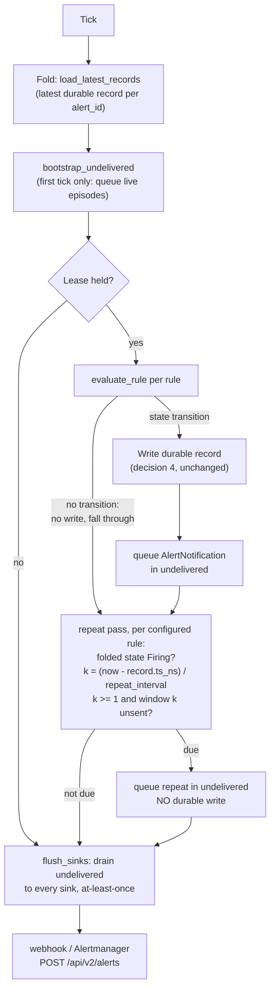

# ADR-0043: Unified alerting engine - observability alerts and detection rules, stored as data

Status: Accepted

## Context

This engine covers both observability alerting (recording/alert rules
over PromQL, the Grafana-adjacent workflow) and security detection
(Sigma-style rules over the `logs` SQL table), with alert state itself
stored as durable data so a rule can read alert history - including a
rule that fires on other alerts. This depends on ADR-0040
(`Signal::Alerts`, RLOG-format reuse, fold-derived state, the
generation-based recursion guard) and benefits from, but does not
require, the aggregation operators already on main.

No rule-evaluation machinery exists in Ravel today. The closest
structural precedent is `services/ravel-server/src/maintain.rs`'s
`Mode::Maintain`: one background tokio task spawned per tenant
(`spawn`/`run_loop`), ticking on a configurable interval, with a
graceful-shutdown channel per task. This is the pattern a rule
evaluator scheduler mirrors, not a new scheduling mechanism.

## Decision

1. **Rule definition is generic, not PromQL-specific or Sigma-specific.**
   A rule is `{rule_id, query: {lang: "promql"|"sql", text}, condition
   (how the query result maps to firing - e.g. "any series > threshold"
   for PromQL, "row count > 0" for SQL), labels, annotations,
   for_duration (optional pending-before-firing delay, PromQL
   alerting's usual semantics), max_alert_generation override
   (optional, defaults to ADR-0040's global default)}`. This one shape
   covers observability alert rules (PromQL query + threshold),
   recording rules (PromQL query, no condition, always "fires" to
   record a derived series - out of this ADR's v1, see deferred list),
   and detection rules (SQL query over `logs`, condition = nonempty
   result). A Sigma-to-this-shape compiler is additive later work, not
   a second rule engine.
2. **Rules are per-tenant static config for v1**, following the exact
   pattern `--tenant-token`/`--retention-tenant` already use (a CLI
   flag or config file, loaded at startup). A rules-management HTTP API
   (create/update/delete rules at runtime) is explicitly deferred - v1
   proves the evaluation and alerts-as-data model; dynamic rule
   management is a follow-up epic once the eval loop is trusted.
3. **One background evaluator task per tenant**, mirroring
   `maintain.rs::spawn`/`run_loop` exactly: `--alert-eval-interval-secs`
   ticks, each tick evaluates every configured rule for that tenant.
   Ravel's compute processes are disposable (core architecture
   invariant), so per-rule "how long has this been pending" state is
   never held in the evaluator's memory - each tick queries the most
   recent `Signal::Alerts` record for the rule's `alert_id` (fold to
   current state, per ADR-0040) and derives pending-duration from that
   record's timestamp, not from an in-process timer. A restarted
   evaluator resumes correctly from the last written record.
4. **A new record is written only on state transition** (pending ->
   firing, firing -> resolved, firing -> suppressed), not on every tick
   a condition continues to hold - avoiding a heartbeat record per rule
   per tick. "Still firing since Tn" is answered by folding to the last
   transition record, the same way "is this bucket retained" is
   answered by folding retention tombstones rather than a per-tick
   liveness record.
5. **Alerts-on-alerts**: a rule's `query` may target the `alerts` SQL
   table (ADR-0040) the same as `samples` or `logs`. The evaluator
   computes each produced record's `generation` per ADR-0040's formula
   and rejects (typed error, logged, not silently dropped) exceeding
   `max_alert_generation`. This is the only rule type where the query
   result directly names other alert records as input, so it is also
   the only place the generation computation applies; ordinary
   PromQL/SQL rules over metrics/logs always compute `generation = 0`.
6. **Sinks**: a webhook sink (HTTP POST of the transition record as
   JSON) and an Alertmanager-compatible sink (POSTs in Alertmanager's
   own `/api/v2/alerts` payload shape) fire on the same tick a
   transition is written, at-least-once (sinks are expected to be
   idempotent consumers, the same delivery guarantee the rest of
   Ravel's strict-mode acknowledgement already assumes downstream of
   itself). Sink failures are logged and retried next tick from the
   latest record, never block the record from being written - the
   durable record is the source of truth, the sink is a notification,
   not a second commit path.
7. **Query surface**: `alerts` and `audit` SQL tables follow
   the exact `logs` table provider/pushdown/scan pattern (ADR-0033),
   reusing `LogSegmentFetcher`'s shape against the shared RLOG-format
   reader (ADR-0040).

## Deferred (explicitly out of v1)

- **Recording rules** (a PromQL query that always writes a derived
  series back as new metric data, rather than conditionally firing an
  alert). Same evaluator loop, different output signal (`Metrics`, not
  `Alerts`) and a different ingest path (through the existing shard
  actor, not a new record kind) - different enough to be its own
  follow-up rather than bundled into the alert-condition engine.
- **Sigma DSL compiler.** V1 rules are hand-authored SQL/PromQL. A
  compiler translating Sigma YAML into this ADR's generic rule shape
  is additive, high-value, and independently shippable once the
  generic shape is proven - not a precondition for it.
- **Dynamic rules-management API.** Static per-tenant config for v1
  (point 2).
- **Live tail (`/api/v1/tail`)** for hunt workflows. Independent of the
  alerting engine's data model; can be built against `logs` or `alerts`
  once either exists, as its own smaller ticket.

## Rejected alternatives

- **In-memory pending/firing state, checkpointed periodically.**
  Rejected: violates "every compute process is disposable" - an
  evaluator crash between checkpoints would either lose pending-state
  progress or double-fire depending on checkpoint timing. Deriving
  state by fold from durable records has no such window.
- **A record per tick regardless of transition (heartbeat model).**
  Rejected: multiplies storage and compaction load by the tick count
  for no query benefit "is this still firing" already answers by fold;
  Prometheus-alertmanager users do not expect per-tick alert records
  either.
- **Two separate engines for observability alerts and security
  detections**, matching how most vendors ship them as separate
  products. Rejected because the generic rule shape (point 1) already
  covers both without
  duplicating the scheduler, the fold logic, or the sink code.
- **Exactly-once sink delivery via a second durable outbox table.**
  Rejected: real added complexity (an outbox needs its own retry/dedup
  state) for a guarantee downstream sinks do not need - webhook/
  Alertmanager consumers are already expected to be idempotent, the
  same assumption the rest of the system makes about its own
  strict-mode acknowledgement.

  That idempotency assumption is narrower than it reads, so state its
  limit explicitly. The duplicate suppressor for the repeat pass,
  `repeat_marks` in `services/ravel-server/src/alerting.rs`, is a
  process-local map, not a durable record. It is lost whenever the
  evaluating process changes, which includes a lease handover to
  another live process, not only a restart. `k` is re-derived from the
  durable record on every tick, so losing the mark can never cause a
  silence; it can cause one extra send for the alert's current repeat
  window.

  What that extra send costs depends on the sink. An Alertmanager sink
  satisfies the assumption: Alertmanager dedupes on the label set, so
  the duplicate is absorbed with no operator-visible effect. A plain
  webhook sink does not: it forwards both POSTs, and a consumer that
  opens a ticket or pages per POST sees two distinct events. A
  webhook-shaped sink must therefore dedupe on its own, but nothing in
  the payload distinguishes the duplicate from an intended repeat: a
  repeat and its duplicate carry the same `alert_id`, `ts_unix_nano`,
  and `generation`, and a `null` `previous_state`, because every repeat
  is built from the same durable record for the whole firing episode.
  Dedupe on `alert_id` within a window shorter than the rule's
  `repeat_interval` instead, or set `repeat_interval: 0s` (the
  amendment's decision 3) to disable repeats for that rule entirely.
  This ADR does not guarantee exactly-once delivery to a sink that does
  neither.

## Consequences

- No new frozen format beyond ADR-0040's `Signal::Alerts` (already
  decided); this ADR is entirely about the evaluation loop, rule
  shape, and sinks built on top of it.
- The evaluator reuses `QueryEngine` (PromQL) and `ravel-sql`'s executor
  (SQL) as libraries, not services it calls over the network - same
  in-process reuse `POST /api/v1/analytics` already established for
  sharing the query engine with a non-query-endpoint feature.
- Rule config lives alongside tenant-token/retention config for v1;
  moving it to a dynamic API later is additive, not a breaking change,
  since the evaluator's internal rule shape does not change.
- Alerts-on-alerts is real but bounded by `max_alert_generation`; an
  operator who needs deeper chains adjusts the config knob, but the
  default protects against an accidental infinite loop from day one.

## Amendment: repeat notifications while firing

Decisions 4 and 6, combined, notify exactly once per transition: a rule
that starts firing and stays firing sends one notification and then
nothing for as long as the condition holds. Alertmanager auto-resolves
any alert it has not heard about within `resolve_timeout` (default 5
minutes), so at default configuration every persistently firing alert
produces a false all-clear to on-call while the problem continues. That
is worse than no alerting. The risk was rated P1 at high likelihood.

The gap is in delivery cadence, not in the data model. Decision 4 is
correct and unchanged: the durable record is state, and "still firing"
is a fold, not a heartbeat. What was missing is that a notification is
not a record, so re-sending one needs no new durable write. The re-send
mechanism itself already exists: `bootstrap_undelivered` re-notifies
from the folded latest record on a non-transition tick after a restart.
This amendment gives that mechanism a cadence.

### Decision

1. **A repeat pass runs on every evaluation tick**, after rule
   evaluation, on the lease-holding replica only (the same gate as rule
   evaluation; `flush_sinks` still runs everywhere). For each configured
   rule whose folded latest record is `Firing`, it computes elapsed time
   since that record's own durable timestamp and the repeat window index

       k = (now_ns - record.ts_ns) / repeat_interval

   (integer division, clamped to zero if the clock stepped backward,
   matching the existing pending-duration clamp). When `k >= 1` and no
   notification has been handed to the sinks for window `k` yet, the
   alert is queued into the existing `undelivered` map and delivered by
   the existing `flush_sinks` path. **No durable record is written for a
   repeat.** Decision 4 stands verbatim.

2. **The schedule is derived from durable state plus the clock, never
   stored.** The anchor is `record.ts_ns` of the firing transition
   record, which survives any restart by construction (decision 3). The
   only in-memory addition is a per-alert mark of
   `(anchor_ts_ns, window)` for the last window a notification was
   queued in; a mark whose anchor differs from the current firing
   record's `ts_ns` is stale and ignored, so a resolve-then-refire
   cycle re-anchors cleanly instead of inheriting the old episode's
   window count and staying silent. The mark is a duplicate
   suppressor, not the schedule: losing it (restart, lease failover)
   costs at most one extra send, which the at-least-once contract of
   decision 6 already permits, and can never cause silence, because a
   fresh process re-derives `k` from the record and
   `bootstrap_undelivered` queues one delivery immediately anyway. A
   delivery failure needs no window bookkeeping either: the entry stays
   in `undelivered` and retries next tick, exactly as transitions do
   today.

3. **`repeat_interval` is a per-rule field on the rule definition**
   (`Rule` in `crates/ravel-alerting/src/rule.rs`, and a humantime
   string in the rules-file `RuleSpec`, like `for`). Absent means the
   default, `DEFAULT_REPEAT_INTERVAL = 1m` - the same default as
   Prometheus's `--rules.alert.resend-delay`, giving several sends
   inside Alertmanager's default 5-minute `resolve_timeout` so a few
   missed ticks cannot false-clear. An explicit `0s` disables repeats
   for that rule (for a webhook consumer that opens a ticket per POST).
   Validation stays at the parse layer: an unparseable duration rejects
   the rules file at startup, as `for` already does; zero is legal, so
   `Rule::validate` gains no new constraint. The effective cadence is
   `repeat_interval` rounded up to the next tick; the evaluator logs a
   warning at spawn for a rule whose `repeat_interval` is shorter than
   `--alert-eval-interval-secs`, since the tick then bounds the cadence.
   There is deliberately no server-wide flag (see rejected
   alternatives).

4. **Only `Firing` repeats.** `Pending` does not (the Alertmanager
   payload is already `None` for pending, and `for` exists precisely to
   keep pending quiet); `Resolved` and `Suppressed` are terminal or
   intentional silence. An alert whose rule has been removed from the
   config never repeats, so Alertmanager auto-resolves it after
   `resolve_timeout` - the correct end for an orphaned alert, and the
   same outcome Prometheus produces for a deleted rule.

5. **Repeat-send and bootstrap-redelivery share the delivery path and
   stay two triggers.** Both build an `AlertNotification` from the
   folded latest record and feed the same `undelivered` map and
   `flush_sinks` drain; that shared queue is the generalization that
   matters. The triggers differ on every axis and are not merged:
   bootstrap runs once per process, unguarded by the lease (it recovers
   this process's own possibly-lost in-flight notifications), and covers
   `Pending` too; the repeat pass runs every tick, lease-gated, `Firing`
   only. On a restart mid-episode they compose instead of doubling: the
   `undelivered` map is keyed by `alert_id`, and the bootstrap send
   counts as the current window's send.

6. **No payload change.** Verified against
   `services/ravel-server/src/alert_sink.rs`: `alertmanager_payload`
   already emits `startsAt` and omits `endsAt` for a `Firing` record,
   which is exactly the shape of a Prometheus re-send, and Alertmanager
   identity is the label set, so a re-POST simply refreshes its timer.
   The webhook body shape is also unchanged; a repeat carries a `null`
   `previous_state` (there is no prior transition to report for a
   non-transition send), the same shape a fresh bootstrap re-send uses.
   This means a repeat is not distinguishable from an unintended
   duplicate by payload alone - see the idempotency-assumption
   narrowing in "Rejected alternatives" above for what a webhook-shaped
   sink needs to dedupe on instead. One documented approximation: a
   repeat built from the folded latest record alone reports
   `started_at_ns` as the firing record's `ts_ns`, which for an episode
   with a pending phase is slightly later than the original
   notification's - the same single-step-fold approximation
   `bootstrap_undelivered` already carries, and cosmetic only, since
   Alertmanager keys on labels, not `startsAt`.

### Tick flow

### Rejected alternatives

- **A durable record per repeat (or per tick).** The per-tick variant is
  the heartbeat model this ADR already rejected. The lighter
  one-record-per-repeat variant still writes an object per firing alert
  per minute at the default cadence, multiplying storage, compaction,
  and audit-log noise in proportion to how long an incident runs -
  precisely when the system is under stress - and what it buys is
  duplicate suppression that idempotent sinks (decision 6's stated
  contract) do not need. The record is state, not a delivery log;
  decision 6 already established that the sink is a notification, not a
  second commit path.
- **A server-wide `--alert-repeat-interval-secs` flag.** Cadence is a
  property of the rule and its consumers: a page-out rule wants a
  1-minute keepalive, a ticket-per-POST webhook wants none, and one
  global knob forces the noisiest rule's needs onto every rule. It also
  parts company with the rules-file layout decision 2 chose, where
  everything rule-shaped lives on the rule. Tactically, it would also
  land in `services/ravel-server/src/config.rs`, which has concurrent
  in-flight work this session - a guaranteed conflict for no semantic
  gain.
- **An in-memory-only timer** ("remember when we last notified, re-send
  when older than the interval"). Rejected for the same reason as the
  original in-memory pending-state alternative: it violates decision 3,
  and here the failure mode is the exact defect this amendment closes.
  A restart mid-episode resets the timer, so the first repeat arrives a
  full interval after the restart at best; a process restarting more
  often than `repeat_interval` - a crash loop, rolling deploys, spot
  reclaim, all normal for compute Ravel declares disposable - never
  crosses its timer at all, Alertmanager hits `resolve_timeout`, and
  on-call gets the false all-clear back. Anchoring the schedule to
  `record.ts_ns` makes the worst restart cost one duplicate
  notification, never one silence.

### Consequences

- Closes the false all-clear gap. The interim mitigation (raising
  `resolve_timeout` per deployment) is no longer required.
- The acceptance proof is a test that holds a rule firing across
  injected-clock advances spanning more than one default
  `resolve_timeout` and asserts the notification count grows, plus a
  restart-mid-episode test asserting repeats resume on the schedule
  derived from the durable record.
- `docs/architecture.md`'s alerting section gains one sentence on
  repeat cadence in the same commit that implements it.
- The rules file grows an optional field; existing files parse
  unchanged and silently gain the 1-minute default, which is the point:
  the safe behavior must be the default, because this failure's
  likelihood was rated high specifically at default configuration.
