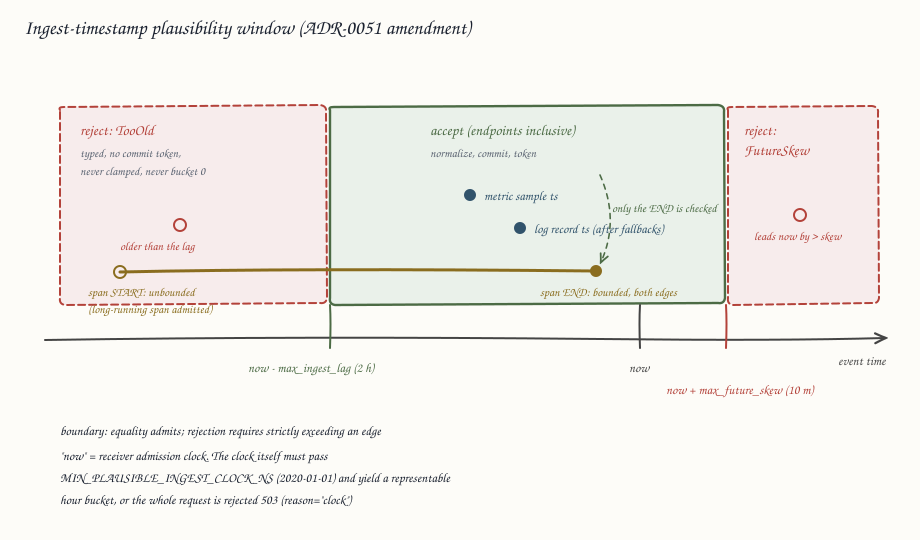

# ADR-0051: Tenant admission control and ingest-time correctness

Status: Accepted (2026-08-02)

## Context

ADR-0009 decided that per-tenant quotas (series, bytes per second) are
"enforced at gateway/frontend from config; hard limits precede
allocation". Nothing implements that sentence. The adversarial
architecture review (docs/reviews/adversarial/RAVEL-ADVERSARIAL-REVIEW.md,
findings S3-01/S4-05, risk B5, experiment L10) verified against the code
that the only ingest-side limits are per-request structural caps in
`ravel-otlp` (`IngestLimits`, `LogIngestLimits`, `TraceIngestLimits`) and
the decompression caps in OTAP (16 MiB) and Remote Write (64 MiB). There
is no active-series cap, no series-creation-rate limit, and no ingest
byte-rate quota anywhere; one tenant emitting a fresh label set per point
drives fleet-wide object count, PUT spend, catalog size, and query
fan-out, with no per-tenant counter to attribute it (S3-08).

The same epic covers a cluster of ingest-time correctness gaps the review
rated alongside the quota gap:

- **S2-01 (CRITICAL).** Metrics enforce event-time skew bounds at
  admission (`checked_event_ts`, crates/ravel-otlp/src/normalize.rs:729;
  ADR-0010 §8): event time outside
  `[ingest_ts - max_ingest_lag, ingest_ts + max_future_skew]` is rejected
  with a typed partial-success reason. Logs and spans have no such check:
  `logs_normalize` uses `ingest_ts_ns` only as a fallback timestamp, and
  `traces_normalize` passes sender timestamps through unchecked. The
  catalog listing window (crates/ravel-catalog/src/catalog.rs:344,
  docs/consistency-model.md "Late and skewed data") is provably complete
  only under those admission bounds, and logs and spans resolve through
  the identical window formula. A future-skewed record is stored and
  acked but invisible to every non-token query, and because retention
  anchors expiry on `max_event_ts`, one `now + 100y` record makes its
  bucket unexpirable forever.
- **S2-02 / S1-07 (CRITICAL).** Query-time dedup exists for metrics only
  (`(series_id, ts)`). Logs and spans have no duplicate identity on any
  read path, so a client retry after a lost ack (crash-matrix row 3, a
  normal event) doubles visible log rows and spans with no signal.
  docs/consistency-model.md documents at-least-once delivery honestly,
  but its "identical duplicates are harmless" framing is true for
  metrics only and is widely over-read.
- **S1-12.** All three shard actors map a non-representable flush-open
  clock reading to ingest hour bucket 0 (`u32::try_from(...).unwrap_or(0)`
  at crates/ravel-ingest/src/shard.rs:423, log_shard.rs:349,
  span_shard.rs:317 — the review cited only the metrics shard; the same
  line exists in all three). A clock that goes bad between admission and
  flush open produces a strict-acked commit in the 1970 bucket that no
  realistic query window ever lists.
- **S4-11.** The OTLP-HTTP handlers decode from an axum `Bytes` body with
  no explicit `DefaultBodyLimit` on the routes; the bound is the
  framework default, undocumented, and can regress silently.
- **S2-06 / S3-05.** The unconditional 500 ms flush age trigger gives
  every tenant a PUT floor set by cadence, not volume: up to ~16 PUTs/s
  across 4 shards per signal regardless of data (~$200/month/tenant in
  PUT requests alone).
- **S4-07.** `max_series` on the query path is enforced after the full
  `by_id` map is materialized (crates/ravel-query/src/engine.rs:352-364),
  so the memory the cap exists to bound is allocated before the cap
  rejects.

Where the review is stale, this ADR designs for what is on `main` now,
not for what the review saw:

- A `/metrics` endpoint exists (services/ravel-server/src/metrics.rs,
  ADR-0044 §4): a hand-written Prometheus exposition renderer with a
  compile-time-closed `Label` allowlist (`tenant_hash`, `signal`, `mode`,
  `op`, `error_kind`, `workload_class`, `level`) and a `TenantHashLabel`
  that folds every unconfigured tenant into `other` so per-tenant
  cardinality is bounded by configured-tenant count, not traffic. The
  review's "Ravel exports no runtime telemetry at all" is no longer true;
  this ADR reuses that renderer and adds no second registry.
- Per-query cost accounting types exist (`QueryAccounting` in
  crates/ravel-types/src/accounting.rs, ADR-0044). Measurement is in;
  enforcement was explicitly deferred by ADR-0044 to a later ADR. The
  read-side "query bytes scanned" quota named by ADR-0009 therefore stays
  out of scope here and lands in that enforcement ADR.
- ADR-0044 blocked per-tenant `/metrics` series on an authentication
  decision for the route. This ADR makes that decision (below).

## Decision

### 1. Admission layers, and where each sits relative to allocation

Admission is enforced in `ravel-server` gateway handlers and in a new
`ravel-ingest` admission component, in this order on every ingest path
(OTLP HTTP, OTLP gRPC, OTAP, Remote Write, logs, spans). Each layer runs
before the allocation it exists to bound; nothing reaches a shard buffer
without passing all of them.

1. **Request body size** — at the transport, before the body is buffered.
   Explicit `DefaultBodyLimit` on `/v1/metrics`, `/v1/logs`, `/v1/traces`
   (default 16 MiB), `max_decoding_message_size` (16 MiB) on every tonic
   service, an explicit compressed-body cap on `/api/v1/write` (16 MiB)
   ahead of its existing 64 MiB decompressed cap. OTAP's existing
   decompression caps stay. Rejection: HTTP 413, gRPC
   `RESOURCE_EXHAUSTED`. Per-request.
2. **Ingest byte rate** — per tenant, charged on wire body bytes after
   tenant resolution and before decode, so over-rate bytes cost one
   buffered body and nothing else. Token bucket
   (`ingest_bytes_per_sec` + burst). A request whose size exceeds the
   available tokens is rejected whole without consuming tokens.
   Rejection: HTTP 429 with `Retry-After`, gRPC `RESOURCE_EXHAUSTED`.
   Per-request.
3. **Structural and event-time bounds** — in normalization, per point /
   record / span, via the existing typed-rejection partial-success
   machinery. This is where the new log/span skew bounds land (§4).
4. **Series admission** — per tenant, between normalization and
   `IngestRouter::write`, before any shard-buffer allocation (this is
   ADR-0009's "hard limits precede allocation" point):
   - **Series-creation rate** (`series_creation_rate_per_sec` + burst):
     the batch's distinct new-series demand is computed first; if it
     exceeds available tokens the whole request is rejected 429 without
     consuming tokens and without admitting any of the batch. Whole-
     request, because a partially admitted batch that the client retries
     re-ingests the admitted remainder, and for logs that duplication is
     user-visible (S2-02). Retryable rejections are therefore always
     all-or-nothing.
   - **Active-series cap** (`max_active_series`): points that would
     create a series beyond the cap are rejected per-series through
     partial success; points for already-active series are admitted.
     Per-series, because a cap breach is not retryable-soon and OTLP
     partial-success semantics instruct the client not to resend the
     rejected items, so no retry-duplication arises.

   Metrics series and log streams both have stable identity (`SeriesId`,
   `LogStreamId`) and get both controls. Spans have no stable series
   identity (`trace_id` is sender-chosen and naturally unbounded), so
   spans are bounded by layers 1–3 only; this is stated, not silent.

**Rejection status codes, per limit:**

| Limit | Scope | OTLP HTTP | OTLP/OTAP gRPC | Remote Write |
|---|---|---|---|---|
| Body size | request | 413 | `RESOURCE_EXHAUSTED` | 413 |
| Byte rate | request | 429 + `Retry-After` | `RESOURCE_EXHAUSTED` | 429 + `Retry-After` |
| Series-creation rate | request | 429 + `Retry-After` | `RESOURCE_EXHAUSTED` | 429 + `Retry-After` |
| Active-series cap | per series | 200 + partial success | OK + partial success | 200 (see below) |
| Event-time skew | per point | 200 + partial success | OK + partial success | 400 only if all samples rejected, else 200 + written-count |

Remote Write has no partial-success message: per-series and per-point
rejections admit the rest of the batch and return 2xx (RW 2.0 additionally
carries the true count in `X-Prometheus-Remote-Write-Samples-Written`),
because a non-2xx makes Prometheus retry or drop the whole batch
including its admitted samples. The drop is observable through the
per-tenant rejection counters (§6). 429 is reserved for rate limits,
where a retry genuinely will succeed later, matching Prometheus
backoff semantics.

### 2. Active-series accounting: exact, per process, bounded by the cap

An `AdmissionController` in `ravel-ingest` holds, per (tenant, signal),
an exact `HashSet` of series/stream ids over two rotating one-hour
epochs: a series is active if seen in the current or previous epoch.
Exact, not sketched, because the workspace invariant is exact semantics
by default and approximation must be opt-in and visible; the memory
argument for a sketch does not apply here, since the set stops growing at
`max_active_series` — the cap itself bounds the tracker at roughly
16 bytes × cap × 2 epochs per tenant.

Enforcement state is **per process**. With N ingest replicas the
fleet-wide effective bound is N × the configured limit. This is stated
in the limits documentation rather than hidden: Ravel's compute processes
are disposable and share no state except object storage, and putting an
S3 round-trip into every admission decision to make the cap global would
add latency and request cost to the hottest path in the system to defend
against a factor the operator already controls (replica count).

### 3. Configuration and per-tenant overrides

A TOML limits file, `--limits-file <path>`, with a `[defaults]` table and
`[tenants.<tenant-id>]` override tables; absent file means shipped
defaults. Loaded at startup; changing limits is a restart, consistent
with every other per-tenant flag today (`--retention-tenant`,
`--tenant-token`). Enforcement is on by default with finite shipped
defaults — ADR-0009 promised admission control, so its absence is the
bug, not its presence; a tenant needing no limit sets an explicit
`unlimited = true`, which is visible in config review rather than being
the silent default.

Shipped defaults (all per tenant, all overridable):

| knob | default |
|---|---|
| max_request_body_bytes | 16 MiB |
| ingest_bytes_per_sec / burst | 32 MiB/s / 64 MiB |
| max_active_series (metrics) | 1,000,000 |
| max_active_streams (logs) | 1,000,000 |
| series_creation_rate_per_sec / burst | 10,000/s / 100,000 |
| max_future_skew (all signals) | 10 m |
| max_ingest_lag (all signals) | 2 h |
| max_flush_delay_idle | 10 s |
| min_flush_bytes | 64 KiB |

### 4. Event-time skew bounds for logs and spans

Logs and spans mirror the metrics `checked_event_ts` path exactly: the
bound is checked in `logs_normalize` and `traces_normalize` against the
receiver's admission-time clock, rejecting with typed reasons through the
existing partial-success machinery. They do not anchor stored timestamps
on ingest time: rewriting or clamping a sender's event time would be
silent data corruption (the exactness invariant), where rejection is
visible and reportable.

- **Logs:** the resolved `ts_ns` (after the existing observed-time and
  ingest-time fallbacks, which are trivially in bounds) must lie in
  `[ingest_ts - max_ingest_lag, ingest_ts + max_future_skew]`.
- **Spans:** `end_ts_ns` is bounded by `max_future_skew` and
  `start_ts_ns` by `max_ingest_lag`, because the commit record advertises
  `[min start_ts, max end_ts]` and the listing window is sound only if
  both advertised bounds are admission-bounded. `end_ts < start_ts` is
  rejected outright. Consequence: a span longer than `max_ingest_lag`, or
  reported later than that after it started, is rejected at admission.

The defaults are the same 10 m / 2 h the metrics path uses, because the
catalog listing window (crates/ravel-catalog/src/config.rs) is one shared
`max_ingest_lag_ns`, not per-signal. Raising the admission lag for a
signal or tenant is legal only together with the catalog-side window
config, and the limits documentation states this coordinated-raise rule
the same way docs/consistency-model.md states it for
`max_flush_lifetime`.

### 5. Idempotency for logs and spans

Two-part decision:

1. **The documented contract is at-least-once.** docs/consistency-model.md
   and the log/span query documentation are amended to say, in so many
   words, that log and span counts are at-least-once and a client retry
   after a lost ack is user-visible duplication — removing the
   "duplicates are harmless" over-read, which is true for metrics only.
2. **An opt-in client idempotency key closes the window where it
   matters.** Log and span ingest surfaces accept an optional
   `x-ravel-idempotency-key` HTTP header / gRPC metadata entry (opaque,
   ≤128 bytes). For a keyed request the gateway, after a successful
   flush, writes a marker object before releasing the ack:

   ```
   data PUT → commit PUT → marker PUT (CreateIfAbsent) → ack
   ```

   A retry of a keyed request first consults the marker (one prefix LIST)
   and, on a hit inside the dedup window, replays the stored receipt
   without re-ingesting. The OTLP protobuf schemas are untouched: the key
   travels as transport metadata, never in a proto field.

   Marker keyspace, additive to the frozen key layout per the
   format-change procedure (new prefix, no reshaping of any existing
   key):

   ```
   t/<tenant_hash>/<signal>/idem/<keyhash32>.<ingest_hour>.idm
   keyhash = hex(blake3("ravel-idem-v1" || tenant_id || client_key)[0..16])
   ```

   docs/catalog-and-mvcc.md is amended in the same change that adds the
   key builder. The marker body is versioned and checksummed (`RIDM`
   magic, u16 version = 1, crc32c over magic || version || the payload,
   payload = the serialized write receipt); a corrupt or truncated
   marker is a typed error treated as a miss (fail-open to at-least-once,
   never a lost ack), counted and exported. There is no dual-reader
   question: the prefix is new, no old data exists under it, and no
   existing read, resolve, or sweep path lists it (commit resolution
   lists `c/…`, the orphan sweep lists `l0/…`; the fail-loud unknown-key
   rule applies to the `c/` prefix only). Markers older than the dedup
   window (default 24 h, from the `ingest_hour` in the file name) are
   deleted by a stateless sweep rule in `ravel-maintain`
   (`ravel_maintain::sweep_idempotency_markers`, epic #452, EB-9), wired
   into the maintenance driver's tick in
   `services/ravel-server/src/maintain.rs::run_tick`, once per signal for
   logs and spans (metrics has no markers); `ravel-cli` will get an
   inspector for the new object class (EB-12; not yet implemented).

   **Amendment (2026-08-03):** the checksum coverage above was
   implemented as `crc32c(magic || version || payload)`, not
   `crc32c(payload)` as an earlier draft of this section stated — the
   header fields a reader branches on (magic, version) must be under the
   same checksum as the payload, or a corrupted or forged header byte
   passes verification silently (the precedent: ADR-0010 §4). Version
   stays 1; no marker has ever been written under the payload-only
   scheme, since this format is new in the same change, so there is no
   dual-reader question and no version bump.

   Honest residuals, documented with the feature: a crash after the
   commit PUT but before the marker PUT still yields a duplicate on
   retry; two concurrent requests with the same key can both ingest
   (the window targets sequential retry, the actual failure mode); and
   unkeyed requests get plain at-least-once. Keyed requests pay one LIST
   plus one PUT.

### 6. Per-tenant usage export

The admission controller's per-(tenant, signal) counters are rendered by
a new family function beside `render_ingest_family` in the existing
`/metrics` renderer — no new registry, no metrics crate, exactly the
extension seam the renderer's module docs define:

- `ravel_admission_active_series{tenant_hash, signal}` (gauge)
- `ravel_admission_admitted_total{tenant_hash, signal}` and
  `ravel_admission_admitted_bytes_total{tenant_hash, signal}`
- `ravel_admission_rejected_total{tenant_hash, signal, reason}`, with
  `reason` a new closed `Label` variant over
  `{body_size, byte_rate, series_rate, series_cap, skew, structural}`

Cardinality is bounded by construction: (configured tenants + `other`) ×
3 signals × 6 reasons, all through the compile-time-closed `Label` enum.
ADR-0044 blocked per-tenant series on an auth decision for the
unauthenticated `/metrics` route; the decision here is an explicit
opt-in flag, `--metrics-tenant-labels` (default off, everything folds to
`tenant_hash="other"`), turned on only where the operator attests the
scrape network is trusted. Per-tenant attribution therefore costs one
deliberate flag, not a new auth subsystem.

### 7. Ingest-time correctness fixes carried with the epic

- **Hour-bucket fail-loud (S1-12):** in all three shard actors a
  non-positive or non-representable `flush_open_ns` fails the flush with
  `WriteError::SegmentBuild` (typed, waiters errored, client retries)
  instead of `unwrap_or(0)`.
- **Idle-aware age trigger (S2-06/S3-05):** the 500 ms age trigger fires
  only when the flush window contains a strict-mode waiter or the buffer
  holds at least `min_flush_bytes`; otherwise `max_flush_delay_idle`
  (default 10 s) applies. Strict-mode ack latency is unchanged;
  buffered-mode trickle tenants' PUT floor drops ~20x. A strict-mode
  trickle tenant still pays the floor — that is the price of its ack
  latency, and the per-tenant `max_flush_delay` override is the operator
  lever for tenants that prefer cost over latency.
- **Incremental `max_series` (S4-07):** the query engine enforces
  `max_series` during `by_id` construction, aborting the loop at the
  bound, so peak memory is bounded by the cap rather than by the match.

### Relation to ADR-0009

This ADR **implements** ADR-0009's admission-control decision (the
"per-tenant quotas … hard limits precede allocation" bullet) as written —
enforcement at the gateway, rejection before allocation — and makes it
concrete where ADR-0009 was silent: the specific limits, their rejection
semantics and status codes, per-signal applicability, and the per-process
enforcement scope. It does not supersede or amend ADR-0009, which remains
Accepted. The one part of that bullet not delivered here is the read-side
query-bytes-scanned quota, which ADR-0044 deliberately staged behind its
measurement layer and which lands in ADR-0044's follow-up enforcement
ADR, not this one.

## Rejected alternatives

1. **Globally consistent (S3-coordinated) quota enforcement.** Shared
   counters CAS'd in object storage, so the cap holds fleet-wide
   regardless of replica count. Rejected: it puts an S3 round-trip into
   every admission decision on the hottest path in the system, adds a new
   mutable-object churn class, and defends against a multiplier (replica
   count) the operator already controls. Per-process enforcement with the
   N× bound documented is honest and has zero hot-path cost.
2. **Approximate cardinality tracking (HyperLogLog or similar) for the
   active-series set.** Rejected: exactness is the workspace default and
   approximation must be opt-in and visible; and the memory argument for
   a sketch is void because the exact set is bounded by the very cap it
   enforces.
3. **Anchoring log/span timestamps on ingest time (clamping event time
   into bounds) instead of rejecting.** Rejected: silently rewriting a
   sender's event time is data corruption of the plausible-wrong-result
   class the review rates most dangerous; a typed rejection is visible to
   the sender and countable by the operator.
4. **Content-hash query-time dedup for logs/spans (dedup by
   (stream_id, ts, body-hash) as metrics dedup by (series_id, ts)).**
   Rejected: two identical log lines in the same nanosecond are
   legitimate distinct events for logs (metrics dedup is safe only
   because `(series_id, ts)` is a sample's entire identity), so this
   trades visible duplicates for silently dropped real records — a worse
   wrong-result class; and it charges every read a per-record hash
   forever to fix a write-side fault.
5. **Mandatory (rather than opt-in) idempotency keys, or a
   pre-ingest pending-marker protocol for exactly-once.** Rejected:
   mandatory keys break every stock OTLP exporter; a pending/complete
   two-phase marker gives exactly-once against concurrent replay but
   needs TTL'd lock recovery (a pending marker whose writer died blocks
   the key until a timeout), which is a distributed-lock protocol grown
   from a dedup cache. The post-commit marker suppresses the actual
   failure mode (sequential retry after a lost ack) at one PUT of cost
   and degrades to documented at-least-once in the corners.
6. **429 (or 400) whole-request rejection for active-series cap
   breaches on Remote Write.** Rejected: 429 makes Prometheus retry a
   batch that can never succeed while the tenant is at cap (retry storm,
   and the batch's under-cap samples are delayed indefinitely); 400 makes
   it drop the whole batch including admitted samples. Partial admission
   with 2xx plus the RW 2.0 written-count header and rejection counters
   loses only the over-cap series and keeps the sender healthy.
7. **A second metrics registry (adopt the `prometheus`/`metrics` crate)
   for per-tenant usage.** Rejected: ADR-0044 already rejected
   registry-style label allocation as the mechanism by which
   observability systems acquire unbounded self-telemetry, and the
   existing renderer's closed `Label` enum is the cardinality bound this
   epic itself requires (S3-08). One registry, extended at its documented
   seam.
8. **Enforcing quotas inside the shard actors instead of at the
   gateway.** Rejected: by the time a point is in a `ShardMsg` the
   allocation ADR-0009 orders the rejection to precede has already
   happened (normalized point vectors, channel slots, buffer merge), and
   per-shard enforcement fragments one tenant's budget across shards,
   making rejection order dependent on shard routing.

## Consequences

- Every ingest path gains two cheap checks (a token-bucket charge and a
  set lookup per distinct series in the batch) between tenant resolution
  and buffer admission. No object format, no proto schema, no series
  identity, and no commit token changes. The only frozen-contract change
  is the additive `idem/` keyspace, carried out under the format-change
  procedure (versioned checksummed body, docs/catalog-and-mvcc.md amended
  with the key-builder change, property tests over corrupt/truncated
  markers, CLI inspector).
- Experiment L10 (one tenant drives fleet cost with no cap) passes:
  series count is capped by `max_active_series`, PUT-driving volume by
  the byte-rate bucket, and the idle age trigger removes the
  volume-independent PUT floor for buffered-mode tenants. Experiment L6
  (retry doubles log rows with no signal) passes for keyed requests
  (count stays flat) and is a documented, counted contract for unkeyed
  ones.
- Fleet-wide limits are per-process × replicas; operators sizing a hard
  business cap divide by ingest replica count. Documented, not silent.
- Long-running spans (duration > `max_ingest_lag`) are rejected at
  admission under the default 2 h window; deployments that need them
  raise the lag together with the catalog window config.
- Senders with skewed clocks now see log/span rejections where they saw
  silent acceptance; that is the point, but it is a behavior change for
  any pipeline that was (unknowingly) storing unqueryable records.
- Per-tenant `/metrics` series exist only behind `--metrics-tenant-labels`;
  fleets that leave it off keep today's `other`-folded exposition and
  still get fleet-total admission counters.
- The dual-compaction-record overlap for signals without dedup (the
  read-side half of S2-02) is not addressed here: it is Ravel-caused
  duplication, not client-caused, and belongs to the compaction/read
  path, tracked in the review ledger, not to admission control.
- Read-side cost enforcement (bytes-scanned budgets) remains staged
  behind ADR-0044's measurement, unchanged by this ADR.

## Amendment (2026-08-13): fail-closed ingest-timestamp plausibility

Issue #905, adversarial finding S1-12. This amendment appends to the
original decision; where it supersedes a sentence of §4 or a Consequences
bullet, it says so explicitly. Everything else above stands unchanged.

### Context

S1-12's headline was "ingest-hour derivation fails open on nonsense
clocks". §7 closed half of it: a non-positive or non-representable
flush-open clock reading now fails the flush loudly instead of writing
bucket 0. Two fail-open holes remain, and one earlier fix attempt made
things worse in a different way:

1. **The receiver's clock is never checked at admission.** A
   positive-but-nonsense clock (a host whose RTC reset to shortly after
   the epoch, or jumped decades forward) passes
   `checked_ingest_hour_bucket` and buckets commits in far-past or
   far-future hours, polluting the hour-partitioned layout and the
   retention arithmetic anchored on it. Worse, in buffered mode the ack
   precedes the flush, so a clock that goes bad between admission and
   flush open strands already-acked data behind a flush §7 will now
   (correctly) keep failing.
2. **The span bound from §4 anchors on the wrong end of the interval.**
   §4 bounds `start_ts` by `max_ingest_lag`, which rejects every
   legitimate span longer than the lag window; the original Consequences
   section admitted this ("Long-running spans ... are rejected at
   admission"). A review of the first #905 implementation blocked on
   exactly this class of regression.
3. **The blocked fix invented a second window.** That implementation
   added a fresh ~2h past-reject bound distinct from `max_ingest_lag`.
   Review blocked it as a product regression: Prometheus Remote Write
   replays hours of samples on outage recovery, OTLP client retry
   backlogs can exceed 2h, and a long-running span starts hours before
   it ends. A new, undocumented bound either duplicates the existing lag
   knob or silently tightens the documented late-data contract.

What already exists on `main`, verified against the code: every record
path enforces the event-time window today. Metrics OTLP
(`checked_event_ts`, crates/ravel-otlp/src/normalize.rs), OTAP (its
mirror in crates/ravel-otap/src/normalize.rs), Remote Write
(`checked_event_ts` over millisecond wire timestamps,
crates/ravel-remote-write/src/normalize.rs, samples, histograms, and
exemplars), logs (`checked_record_ts`,
crates/ravel-otlp/src/logs_normalize.rs), and spans
(`checked_span_interval`, crates/ravel-otlp/src/traces_normalize.rs).
Issue #905's "extending to the metric path if it lacks the bound" turns
out to be moot: no metric surface lacks it. The real gaps are the span
anchor and the receiver clock, below.

### Decision

**1. The plausibility window is the existing documented bounds. No new
knob.** A record timestamp is admissible if and only if

```
now - max_ingest_lag  <=  ts  <=  now + max_future_skew
```

where `now` is the receiver's admission-time clock reading
(`ingest_ts_ns`), and `max_ingest_lag` / `max_future_skew` are the §3
limits (defaults 2 h / 10 m) that ADR-0010 §8 and
docs/consistency-model.md ("Late and skewed data") already document.
Both endpoints are inclusive: a timestamp exactly at either edge is
admitted, and rejection requires strictly exceeding a bound. This
matches every existing implementation (`skew_ns > max_future_skew_ns`
rejects, equality passes) and is now the normative statement. Enforcing
this window is not a new product limit: the catalog listing window
(crates/ravel-catalog/src/catalog.rs `resolve`) is provably complete
only under these admission bounds, so admitting a record outside them
was never a capability, it was the bug — a stored, acked record that no
non-token query can discover.

**2. Which timestamp is bounded, per signal:**

| Signal | Bounded timestamp | Bound |
|---|---|---|
| Metrics (OTLP, OTAP, Remote Write) | each sample's event ts | both edges |
| Logs | resolved record ts (after observed-time / ingest-time fallbacks) | both edges |
| Spans | span **end** (`end_ts_ns`) | both edges |
| Spans | span start (`start_ts_ns`) | only `end_ts >= start_ts`; **never** the lag bound |
| Exemplars | exemplar ts | both edges (dropped and counted, ADR-0047) |

This **supersedes the §4 span sentence** ("`end_ts_ns` is bounded by
`max_future_skew` and `start_ts_ns` by `max_ingest_lag`") and the
Consequences bullet "Long-running spans (duration > `max_ingest_lag`)
are rejected at admission". The lag bound moves from the span's start to
its end: a span reported more than `max_ingest_lag` after it *ended* is
late data, the same contract metrics and logs already have; a span whose
start precedes `now` by more than the lag but whose end is in window is
a legitimate long-running span and is admitted.

Why this is correct, not just kinder: the listing-window completeness
proof never needed the start bound. `resolve` lists ingest hours
overlapping `[range.start_ns - max_ingest_lag, now_ns +
clock_skew_allowance]` and then filters by event-time overlap using the
commit record's advertised `[min start_ts, max end_ts]`. Any span
overlapping the query range has `end_ts >= range.start`, and the end's
future bound gives `end_ts <= ingest_ts + max_future_skew`, so
`ingest_ts >= range.start - max_future_skew`, which is strictly inside
the listed window (`max_future_skew` 10 m << `max_ingest_lag` 2 h). The
upper edge is covered because ingest hours never exceed `now` plus the
tolerated writer skew the `clock_skew_allowance` pad exists for. The
start bound's only real contribution was capping the advertised
`min start_ts` (pruning precision — and an uncapped min is merely
conservative over-inclusion, never wrong results), at the price of
rejecting real telemetry. `start_ts <= end_ts <= ingest_ts +
max_future_skew` still bounds the start's future side for free, and
`end_ts < start_ts` remains rejected outright.

**3. Rejection is fail-closed and typed, through the existing
partial-success machinery.** An out-of-window record is rejected at
admission with the existing typed reasons
(`Rejection::FutureSkew`/`TooOld` for metrics,
`LogRejection::FutureSkew`/`TooOld`, `SpanRejection::FutureSkew`/
`TooOld`), earns no commit token, and is never clamped into bounds and
never mapped into bucket 0 or any other fallback bucket. Within a
batch, in-window records commit normally and out-of-window records are
reported rejected, exactly per the §1 status-code table's "Event-time
skew" row (partial success on OTLP/OTAP; Remote Write returns 2xx with
the written-count header unless every sample was rejected). This is
consistent with docs/consistency-model.md's acknowledgement rules: an
ack covers exactly the records that were committed, and rejected
records are visibly accounted in the same response. Rejections count
under the existing per-signal counter
`ravel_admission_rejected_total{tenant_hash, signal, reason="skew"}`
(§6).

**4. The receiver's own clock is checked at both points it is read
(this is the actual S1-12 close-out).** There is no second clock to
compare against, but a floor is derivable: no host legitimately runs
Ravel with a clock reading before the system existed. A compiled
constant

```
MIN_PLAUSIBLE_INGEST_CLOCK_NS = 1_577_836_800_000_000_000  // 2020-01-01T00:00:00Z
```

is enforced:

- **At admission:** before the window is computed, the handler's
  `now_ns()` reading must be at or above the floor and must yield a
  representable `u32` hour bucket. Failure rejects the whole request
  with a typed error (HTTP 503, gRPC `UNAVAILABLE`): the fault is the
  replica's, not the data's, and a retry against a healthy replica will
  succeed. Whole-request, because no per-record decision is meaningful
  when the reference clock itself is nonsense. Counted under a new
  closed reason label variant, `reason="clock"`.
- **At flush open:** `checked_ingest_hour_bucket` additionally rejects
  `flush_open_ns < MIN_PLAUSIBLE_INGEST_CLOCK_NS`, extending §7's
  fail-loud rule (typed `WriteError::SegmentBuild`, waiters errored).

Honest residual: a wrong-but-post-2020 clock cannot be detected against
any reference. What the window buys in that case is loud failure
instead of silent pollution — honest clients' genuinely-current
timestamps fall outside the bad clock's shifted window and are rejected
with typed errors, producing an attributable rejection spike on
`reason="skew"`, rather than data landing quietly in a wrong hour
bucket. Fail-closed means the failure is visible, not that a bad clock
is impossible.

**5. Backfill and replay.** A client replaying hours of buffered data
after an outage (Prometheus Remote Write WAL replay, an OTLP retry
backlog) is bounded by `max_ingest_lag` like all late data: samples
older than `now - max_ingest_lag` are rejected with `TooOld`. That is
ADR-0010 §8's existing contract, not a new restriction, and this
amendment does not shrink it — the accept region is exactly the
documented one. Deployments that need longer replay raise
`max_ingest_lag`, together with the catalog listing window, under the
coordinated-raise rule (docs/consistency-model.md "Late and skewed
data"; docs/guides/admission-limits.md "Raising max_ingest_lag"): widen
the catalog window first, then the admission bound. Lowering is always
safe.



### Rejected alternatives (amendment)

1. **A fresh ~2h past-reject window (the blocked implementation).**
   Rejected because any bound tighter than `max_ingest_lag` breaks the
   documented late-data replay contract (Remote Write outage recovery,
   OTLP retry backlogs, spans that end hours after they start), and any
   bound equal to it is a duplicate knob that will drift from the
   catalog listing window the real knob is coordinated with. The window
   Ravel already documents is the plausibility window; the work is
   enforcing it, not inventing a sibling.
2. **Silently clamping out-of-window timestamps to the nearest edge.**
   Rejected: retention anchors expiry on advertised event-time bounds,
   so a clamp corrupts retention arithmetic with fabricated timestamps;
   it rewrites sender data (the exactness invariant — original
   Rejected-alternative 3 already refused this for logs and spans); and
   it hides the client clock bug that a visible typed rejection
   surfaces.
3. **Keeping the span-start lag bound (status quo).** Rejected: it
   rejects legitimate long-running spans, and §2 above shows the
   listing-window completeness proof never required it.
4. **Failing readiness (`/readyz`) on an implausible clock instead of
   per-request 503.** Rejected: per-request rejection already sheds
   ingest safely, keeps query serving up (reads take `now` from the
   caller), and recovers instantly when NTP fixes the clock, without
   readiness flapping.

### Consequences (amendment)

- `checked_span_interval` changes its lag anchor from `start_ts_ns` to
  `end_ts_ns`. Long-running spans are now admitted; `end_ts < start_ts`
  is still rejected; span event/link timestamps ride inside the record
  unbounded, as today.
- The following prose is superseded and must be updated in the same
  commit as the code change (documentation stays current): the §4 span
  sentence and Consequences bullet named above,
  docs/consistency-model.md "Late and skewed data" ("spans bound
  `end_ts` by `max_future_skew` and `start_ts` by `max_ingest_lag`"),
  docs/guides/admission-limits.md "Event-time skew" (the span
  paragraph), and docs/guides/ingest.md's event-time-skew section.
- The closed `Label` reason enum (§6) gains one variant, `clock`.
  Cardinality stays bounded by construction.
- **Test fixtures re-anchor.** Roughly 14 existing tests across the
  reverse dependencies drive ingest with epoch-adjacent clock fixtures
  (`now_ns` values a few hours past 0, `NS_PER_HOUR * 3` style) that
  the clock floor makes inadmissible. They move to real-clock-relative
  fixtures: a fixed named base constant comfortably above the floor
  (e.g. 2026-01-01T00:00:00Z), with offsets from it — never
  `SystemTime::now()`; time stays injected and tests stay
  deterministic. Affected: services/ravel-server `logs_ingest` /
  `traces_ingest` unit fixtures and `admission_reconcile_e2e`,
  ravel-promql-difftest (documented examples regenerate),
  ravel-sim (workload injected clock, wide-interval span scenarios),
  ravel-failure-tests `crash_matrix` common fixtures.
- A sender with a wrong clock that previously saw silent acceptance
  into a wrong bucket now sees typed rejections; that is the point, and
  it is the same behavior change the original ADR already shipped for
  log/span skew.

### Implementation note (issue #905 executor)

- **Span anchor:** crates/ravel-otlp/src/traces_normalize.rs
  `checked_span_interval` — move the `max_ingest_lag_ns` check from
  `start_ts_ns` to `end_ts_ns`; keep the `end < start` rejection and the
  `end_ts_ns` future-skew check; update its doc comment and the
  `SpanRejection::TooOld` doc in crates/ravel-otlp/src/traces_limits.rs
  to say "end", citing this amendment.
- **Clock floor constant:** `MIN_PLAUSIBLE_INGEST_CLOCK_NS` in
  `ravel-ingest` (public), next to `checked_ingest_hour_bucket` in
  crates/ravel-ingest/src/config.rs, which gains the floor check.
  Admission-side helper (e.g. `plausible_ingest_clock(now_ns) ->
  Result<(), ...>`) lives beside it; services/ravel-server already
  depends on ravel-ingest.
- **Admission call sites:** every handler that reads `now_ns()` to
  build a normalize context checks the clock first and returns 503 /
  `UNAVAILABLE` on failure: services/ravel-server/src/ingest.rs (OTLP
  metrics HTTP and gRPC), logs_ingest.rs, traces_ingest.rs,
  otlp_grpc_logs.rs, otlp_grpc_traces.rs, remote_write.rs,
  otap_grpc.rs.
- **Typed errors:** reuse `Rejection`/`LogRejection`/`SpanRejection`
  `FutureSkew`/`TooOld` for record-window rejections (no new variants
  needed there); add one typed clock-implausibility error for the
  whole-request path; extend the `/metrics` reason `Label` enum
  (services/ravel-server/src/metrics.rs) with `clock`.
- **Counters:** record-window rejections keep `reason="skew"`
  per-signal; clock rejections count `reason="clock"`; flush-side floor
  failures surface through the existing abandoned-flush accounting.
- **Tests (prove the fault fires):** per signal, boundary tests both
  edges (equality admits, one nanosecond past rejects); a span whose
  start precedes `now - max_ingest_lag` but whose end is in window is
  admitted, and one whose end is older than the lag is rejected; clock
  floor rejected per surface with the typed error asserted;
  ravel-failure-tests `crash_matrix` rows for the flush-open floor with
  `FaultStore` counter asserts proving injection fired; re-anchor the
  fixture set listed in Consequences; regenerate
  ravel-promql-difftest's documented examples.
- **Docs in the same commit:** the superseded prose list in
  Consequences, plus docs/guides/admission-limits.md gains the clock
  floor and 503 semantics.
