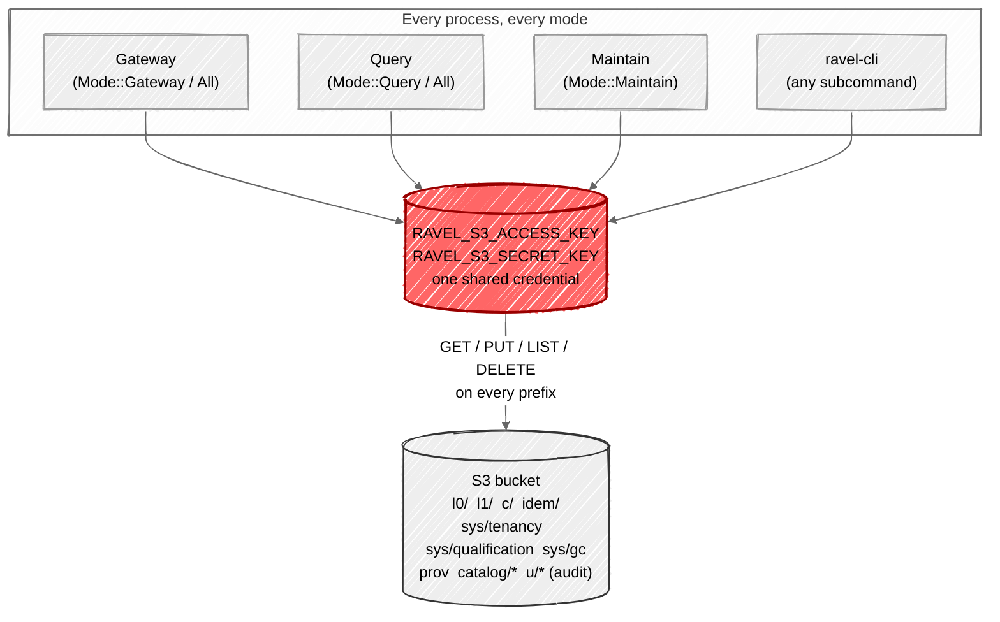
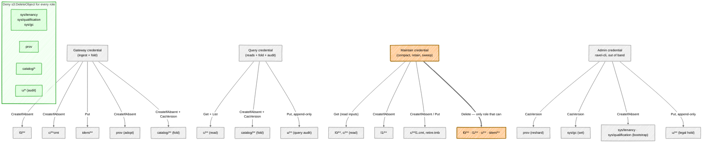

# ADR-0055: per-role storage credential scoping

Status: Accepted (2026-08-05)

Epic EE (issue #455), program #450. The adversarial review calls this "the
highest-leverage structural fix in the whole review" and "the one thing to
force a redesign immediately" (S4-03), and review v2 (the post-remediation
delta run 2026-08-05) restates it as the single change that most raises the
program's verdict ceiling, now with a wider blast radius than when it was
first found: the new control-plane objects epics EC and EK added
(`sys/tenancy`, `sys/qualification`, the per-(tenant,signal) `prov`
provisioning/generation record) all live under the same single credential
this ADR splits (findings NF-1, NF-10, issue #455's rescoping comment).

## Context

`S3Config` (`crates/ravel-object-store/src/s3.rs:123-149`) is a flat struct:
bucket, region, endpoint, one `access_key_id`/`secret_access_key` pair, an
optional `kms_key_id`. `services/ravel-server/src/store.rs` and
`services/ravel-cli/src/store.rs` each build exactly one `S3Store` from one
`RAVEL_S3_*` env-var set at process startup, wrap it once in
`InstrumentedStore`, and hand the resulting `Arc<dyn ObjectStoreBackend>` to
every route, background task, and CLI command that process runs. This is
deliberate, documented design, not oversight: "Ravel does not use the AWS
credential chain (profiles, instance roles, `AWS_ACCESS_KEY_ID`). It reads
only the `RAVEL_S3_*` flags/env" (`docs/guides/operations.md:372-373`).

`ObjectStoreBackend` (`crates/ravel-object-store/src/lib.rs:406-441`) has no
caller-identity, tenant, or role parameter on any method. Every holder of the
trait object is fully trusted for every operation on every key in the
bucket. `StoreError::AccessDenied` exists in the error enum only to surface
an *upstream* S3-level denial; Ravel's own code never raises it. There is no
interceptor or middleware layer, and ADR-0042's own rejected alternatives
already ruled one out: "a second, parallel write path outside the
`ObjectStoreBackend` trait's contract-tested abstraction would violate 'no
durability may depend on' an unaudited side channel" — an in-process
authorization layer is the same category of side channel.

The Kubernetes operator (`services/ravel-operator/src/reconcile.rs`) already
builds three separate `Deployment`s per `RavelCluster` — gateway, query,
maintain (`desired_gateway_deployment`, `desired_query_deployment`, and the
maintain deployment) — but all three source AWS credentials from **one**
`credentialsSecretRef` via the identical `s3_credential_env(spec)` helper
(reconcile.rs:98-112). No pod sets `serviceAccountName`; every pod runs under
the namespace's `default` ServiceAccount, so there is no IRSA/Workload
Identity hook today either.

### What each role actually does, read from the code

The full call-site inventory (every PUT/GET/LIST/DELETE and the prefix it
touches) is recorded in this epic's design research and summarized in the
per-role grants below. Two facts from that inventory drive this ADR's shape:

1. **The catalog fold task runs in Gateway and Query mode, not only Query.**
   `services/ravel-server/src/lib.rs:715-736` spawns `fold::spawn` in every
   mode except `Mode::Maintain`. A `Mode::Gateway` process therefore writes
   `catalog/<sig>/snap/…`, `catalog/<sig>/HEAD` (`CasVersion`), and
   `catalog/<sig>/idx/…` alongside its ingest writes — fold is not a
   query-only responsibility, and any role split that gave Gateway an
   ingest-only grant would break it in the shipped topology.
2. **Nothing in the current codebase ever deletes `sys/*`, `prov`,
   `catalog/*`, or the audit prefix `t/<hash>/u/*`.** Deletion is confined
   to `l0/`, `l1/`, `c/` (records and tombstones), and `idem/`, all from
   `crates/ravel-maintain/src/{sweep,retention}.rs`. This means a
   deny-delete policy on the first four prefixes costs no legitimate
   operation anything today — it is a precise fit to what the code already
   guarantees it never needs, not a speculative restriction.

### The WORM pairing question this ADR must answer

Review v2 pairs the credential split with putting "`sys/`, `c/` (commit
records), and `prov` objects under WORM / object-lock." Read literally for
`c/`, that is wrong: `crates/ravel-maintain/src/sweep.rs` (`sweep_superseded`,
`sweep_unreferenced_parts`) and `retention.rs` (`physical_sweep`) legitimately
and routinely delete commit records — after compaction supersedes them, or
after a tombstone's grace period expires. A blanket "no delete on `c/`" would
break already-shipped, correct maintenance. The review's own next epic (ED
#454) is a commit-record *reconstruction tool*, which only makes sense if
commit records can legitimately go missing and need rebuilding — further
confirming they are not meant to be permanently undeletable.

The actual threat the finding names — S4-03/S5-03's "a compromised process or
a mistaken lifecycle rule deletes commit records it should not have" — is a
question of *who* can delete `c/`, not *whether* `c/` is ever deleted. That
is a role-scoping question, which this ADR answers directly (§2, sweep
grants), not a WORM question. WORM applies to the four prefixes nothing
legitimately deletes at all: `sys/tenancy`, `sys/qualification`, `sys/gc`,
`prov`, `catalog/*`, and the audit prefix. See §3.

ADR-0042 decision 3 already evaluated true per-object S3 Object Lock and
rejected implementing it now: `object_store` 0.14.1 has no per-PUT
retain-until-date/legal-hold header, so "real WORM requires the operator to
additionally enable S3 Object Lock at the bucket level... as an out-of-band,
documented deployment step," reserved as "its own ADR extending the
`ObjectStoreBackend` trait itself (a capability-gated new method, following
the existing `Capabilities` pattern), not a workaround." This ADR is that
reserved follow-up for the delete-deny half of the problem; it does not
reopen the in-process-Object-Lock question ADR-0042 already closed.

### Today: one credential, everything trusted



A single leaked or compromised credential — from any of the four boxes on
the left — reads, overwrites, or deletes anything in the bucket. This is
S4-03.

## Decision

Scope storage credentials to the process roles the codebase already has —
Gateway, Query, Maintain (the existing `Mode` enum,
`services/ravel-server/src/config.rs:15-23`, and the operator's existing
three `Deployment`s) — plus a new Admin role for `ravel-cli`'s one-off
bootstrap and mutation commands. Enforcement is entirely at the storage
backend's native IAM/bucket-policy layer, not in Ravel's own code: no
`ObjectStoreBackend` trait change, no new runtime service, no caller-identity
parameter threaded through call sites. `S3Config` and the `RAVEL_S3_*`
env-var contract are unchanged; what changes is that operators provision a
distinct, narrower credential per role instead of one bucket-wide credential,
the same way they already provision the bucket itself.

This works because S3 (and S3-compatible backends: MinIO, used in
`kind-up.sh` and CI) already has a native, load-bearing, cloud-audited
mechanism for exactly this — bucket policies or IAM policies scoped by
principal, prefix, and action. Building an in-process equivalent inside
Ravel would duplicate a control the backend already provides for free and
more robustly (a Rust bug cannot bypass an IAM deny; it can bypass
Ravel's own check), which is precisely the reasoning ADR-0042 already used
to reject an in-process authorization side channel.

### 1. Four roles, mapped to existing process boundaries

| Role | Process | Read | Write (create/mutate) | Delete |
|---|---|---|---|---|
| **Gateway** | `Mode::Gateway`, or the gateway half of `Mode::All` | `prov`, `idem/<key>` (dedup lookup), `sys/tenancy`, `sys/qualification`, `sys/gc` (bootstrap reads); `l0/`, `c/` (fold's own read-back of what it just built on); `catalog/<sig>/**` (HEAD, snap parts, name postings — fold reads its own prior output to fold incrementally, `fold.rs` `get_head`/part/postings reads) | `l0/**` (CreateIfAbsent), `c/**cmt` (CreateIfAbsent, L0 commit records only), `idem/**` (Put), `prov` (CreateIfAbsent, adopt path only), `catalog/<sig>/snap/**` (CreateIfAbsent), `catalog/<sig>/HEAD` (CasVersion), `catalog/<sig>/idx/**` (CreateIfAbsent); `sys/tenancy` (CreateIfAbsent, first-boot race, see §4) | none |
| **Query** | `Mode::Query`, or the query half of `Mode::All` | `c/**` (Phase 1 listing), `l0/**`, `l1/**` (the query fetchers GET segment data directly — footer-first ranged reads — not just commit-record metadata; `ravel-query`'s fetcher, `ravel-server`'s exemplar/log/span fetchers), `catalog/<sig>/**` (snap/HEAD/idx), `prov`, `admission/query/**` (fleet-global query concurrency reconciliation, ADR-0061 decision 2: LIST the bucket-root `admission/query/` prefix and GET each sibling process's snapshot), `sys/tenancy`, `sys/qualification`, `sys/gc` | `catalog/<sig>/snap/**`, `catalog/<sig>/HEAD` (CasVersion), `catalog/<sig>/idx/**` — same fold grants as Gateway, per the code fact above; `t/<hash>/u/<QUERY_AUDIT_SHARD>/**` (Put, append-only query audit); `admission/query/<process_id>.snapshot` (Overwrite, this process's own fleet-concurrency snapshot, ADR-0061 decision 2 — a bucket-root key, deliberately **not** under a `t/<hash>/` prefix since the ceiling is fleet-global, not per-tenant); `sys/tenancy` (CreateIfAbsent, first-boot race) | none |
| **Maintain** | `Mode::Maintain` | `l0/**`, `c/**` (compaction input read, footer-first ranged reads); `l1/**` (HEAD, the lost-CAS-race convergence path re-verifies a part's existence before retrying publish); `maint/<shard>/cursor` (read before its own CAS mutation); `t/<hash>/u/<AUDIT>/**` (legal-hold refresh); `sys/tenancy`, `sys/qualification`, `sys/gc`, `prov` | `l1/**` (CreateIfAbsent); `c/**l1.cmt` (CreateIfAbsent, compaction records); `c/**retire.tmb` (Put, tombstones); `maint/<shard>/cursor` (mutable CAS); `sys/gc` (CreateIfAbsent bootstrap only — see §4 for the CasVersion mutation, which stays Admin); `sys/tenancy` (CreateIfAbsent, first-boot race) | `l0/**`, `c/**` (records and tombstones, superseded/retention/orphan sweep), `l1/**` (unreferenced-part sweep), `idem/**` (marker sweep) — **the only role with any delete grant at all** |
| **Admin** (`ravel-cli`, operator/CI use only, never a long-running server) | n/a — invoked out of band | everything the roles above read, plus `idem/<key>` single-key inspect | `sys/tenancy` (CreateIfAbsent bootstrap), `sys/qualification` (CreateIfAbsent, `store qualify`), `sys/qualify/<run-id>/**` (CreateIfAbsent, the same command's transient scratch prefix — `store qualify` exercises PUT/GET/LIST/CAS under this prefix as part of running the conformance suite, not just the final record write), `sys/gc` (CasVersion, `gc-config set`), `prov` (CasVersion, `provision reshard` / `provision adopt`), `t/<hash>/u/<AUDIT>/**` (legal hold set/clear, append-only), `c/**cmt` (CreateIfAbsent, reconstructed L0 commit records only, `commit reconstruct`, ADR-0058 — see Amendment 2026-08-07) | none (Admin never deletes; delete stays exclusively Maintain's) |

**Correction (2026-08-06), found during epic EE wave 1's adversarial checkpoint:**
the table above was missing four read/write grants in its first accepted
version, each a genuine gap that would have made the role split unshippable
(the affected role's process would hard-fail on its own normal operation
under the originally-published policy): Gateway's fold needs to read its own
prior `catalog/**` output, not just write new output; Query's fetchers GET
segment data (`l0/`, `l1/`) directly, not only commit-record metadata under
`c/`; Maintain's lost-CAS convergence path HEADs `l1/**` and its cursor
logic reads `maint/<shard>/cursor` before mutating it; and Admin's `store
qualify` writes to the `sys/qualify/<run-id>/**` scratch prefix, not only
the final `sys/qualification` record. All four are corrected in place above
rather than left wrong with a note, since this ADR has not yet been acted
on by any deployment at the time of correction — epic EE's own wave 1
(issues #662-664) is still in its landing checkpoint, not yet shipped.

This is not the literal "ingest, compaction, query, and sweep" four-way split
the epic issue named — sweep is not split into its own process here. Sweep
runs inside the same `Mode::Maintain` process as compaction and retention
today (`crates/ravel-maintain/src/sweep.rs` is invoked from the same tick
loop as `build.rs`/`retention.rs`), and splitting it into a fifth process
would be a larger, separate change to the maintenance architecture (epic EI,
#459, is already the tracked place for maintenance-process restructuring).
See Rejected Alternatives.



Four distinct credentials, each scoped to one process's actual call sites.
Only Maintain's policy grants `DeleteObject`, and only over `l0/`, `l1/`,
`c/`, `idem/` — the same four prefixes Ravel's own sweep and retention code
already deletes from today. The green box is denied to every role,
including Maintain: nothing currently deletes there, so nothing legitimate
loses capability, and NF-10 (deleting `sys/tenancy` to brick every
process's fail-closed startup) becomes unreachable regardless of which
credential is compromised.

### 2. Delete stays exclusively with Maintain

No role other than Maintain's IAM policy grants `s3:DeleteObject` on
anything. This is the concrete answer to S4-03/S5-03: a compromised Gateway,
Query, or Admin credential — including a leaked `ravel-cli` credential run
from a CI job or an operator's laptop — cannot delete a single object,
anywhere, ever. It can corrupt or forge new data within its write grant
(a real residual risk, unchanged by this ADR, and the reason ED's
reconstruction tool and legal-hold's fail-closed posture matter
independently), but it cannot make existing data disappear. Only a
compromised Maintain credential retains delete capability, and only over
`l0/`, `l1/`, `c/`, `idem/` — never `sys/`, `prov`, `catalog/`, or the audit
prefix, which brings us to §3.

### 3. Deny-delete, everywhere, on the four prefixes nothing deletes

Every role's policy — including Maintain's — denies `s3:DeleteObject` (and,
where the backend distinguishes it, `s3:DeleteObjectVersion`) on:

- `sys/tenancy`, `sys/qualification`, `sys/gc`
- `t/<hash>/<sig>/prov`
- `t/<hash>/catalog/<sig>/**` (snap parts, HEAD, name postings)
- `t/<hash>/u/**` (legal hold and query audit records)

This closes NF-10 directly: nobody, including a fully compromised Maintain
process, can delete `sys/tenancy` and brick every process's fail-closed
startup (ADR-0050 §7's `/readyz` probe target). It closes the "roll back the
qualification marker" and "delete a competitor's `prov` record to force a
mismatch refusal" scenarios review v2 raised, by the same mechanism.

This is a **delete-deny**, not full Object Lock: `CasVersion`-mutated
objects on this list (`prov`, `sys/gc`, `HEAD`) can still be *overwritten*
by whichever role's policy grants them a `PutObject` with the right
precondition (see the write columns in §1's table) — a compromised writer
with legitimate write access to `prov` can still corrupt it going forward,
it just cannot destroy the object outright or roll back to a stale prior
state via delete-then-recreate. Full immutability-against-overwrite is the
gap ADR-0042 already named and reserved: `object_store` 0.14.1 has no
per-PUT retention API, so true Object Lock enforcement stays bucket-level
and out-of-band for this ADR too, exactly as ADR-0042 decided for `c/`. This
ADR adds one thing beyond ADR-0042's existing gap statement: `ravel-cli
store qualify`'s conformance suite (`crates/ravel-object-store/src/
conformance.rs`) gains an **informational** probe that reports whether
Object Lock/versioning appears enabled on the bucket, alongside the
existing `sys/qualification` record, so operators get a startup-adjacent
signal instead of discovering the gap during an incident. It is
informational only — `object_store` still cannot act on Object Lock even if
present, so this cannot become a startup-blocking check without contradicting
ADR-0042's already-accepted honest-gap framing.

### 4. The two remaining bootstrap-write exceptions

Two objects need a write grant broader than the strict per-role table above,
because ADR-0050 designed them to be written by whichever process happens to
boot first against a fresh bucket:

- **`sys/tenancy`** (`CreateIfAbsent`, ADR-0050 §3): every server role
  (Gateway, Query, Maintain) keeps a `CreateIfAbsent`-only grant on this one
  object, in addition to Admin's. `CreateIfAbsent` cannot overwrite or
  delete an existing object, so this does not weaken §3's deny-delete
  boundary — it only lets the race ADR-0050 already designed keep working
  without requiring an operator to run `ravel-cli tenancy bootstrap` as a
  manual pre-step before every fresh deployment.
- **`sys/gc`**: Maintain keeps its existing `CreateIfAbsent` bootstrap grant
  (unchanged from today); the `CasVersion` *mutation* path (`gc-config set`)
  is Admin-only, matching that it is already an explicit CLI-operator action
  today, not something any server process does autonomously.

`sys/qualification` gets no such exception: it is written exactly once, by
Admin's `store qualify` run, which is already an explicit out-of-band
operator step per its own documented contract ("never reads, lists, or
writes any tenant-prefixed key... safe to run against a bucket that already
holds production data," `docs/object-store-contract.md:332-334`). No server
role needs to write it.

### 5. Operator change

`services/ravel-operator`'s `RavelClusterSpec.storage.s3` gains an optional
per-role credential-secret map alongside the existing single
`credentialsSecretRef`:

```rust
pub struct S3StorageSpec {
    // existing field, unchanged, used when role_credentials is empty
    pub credentials_secret_ref: SecretRef,
    // additive; when a role is present, its Deployment uses this secret
    // instead of credentials_secret_ref for that role only
    pub role_credentials: Option<RoleCredentials>, // { gateway, query, maintain: Option<SecretRef> }
}
```

`s3_credential_env(spec)` (reconcile.rs:98-112) becomes
`s3_credential_env(spec, role)`, resolving `role_credentials.<role>` first
and falling back to `credentials_secret_ref`. Every existing `RavelCluster`
with no `role_credentials` set behaves exactly as today — one shared
credential across all three Deployments — so this is additive and requires
no migration to keep working. `ravel-cli` gets no operator-managed
credential at all; it is invoked out of band and takes `RAVEL_S3_*` from
whatever environment the operator or CI job that runs it provides, using
the Admin-scoped credential documented in a new "Storage credential roles"
section in `docs/guides/kubernetes.md` and `docs/guides/operations.md`,
alongside the four roles' exact IAM policy templates (the allow-lists in
§1's table, expressed as bucket-prefix-scoped policy JSON for AWS and the
MinIO policy-language equivalent for dev/CI).

## Rejected alternatives

**A new runtime "storage-access broker" issuing short-lived per-request
tokens.** Rejected. This is the literal phrase the source review used, but
building it means a new stateful, network-reachable service: a new trust
root (what authenticates *to* the broker?), a new durability dependency
(CLAUDE.md: "no durability may depend on local disk, and no recovery path
may read state another process wrote locally" — a broker that must be up
for any process to acquire credentials is exactly this kind of dependency
if it is anything more than a thin wrapper around the cloud's own STS), and
a second thing to operate, monitor, and secure. S3-compatible backends
already have a native mechanism that does this — IAM/bucket policies scoped
by principal, prefix, and action, resolved by the backend itself on every
request with no Ravel-side moving part. Using it is strictly less
architecture for the same isolation guarantee.

**Cloud-native workload identity (IRSA / Workload Identity), dropping
explicit key/secret config.** Rejected for this ADR. `docs/guides/
operations.md:372-373` documents the current explicit-credential model as a
deliberate choice, not an oversight, and reversing it without a stated
reason is a bigger and different change than this ADR's scope. More
concretely: IRSA is AWS-specific and would not carry over to MinIO, which
`kind-up.sh` and CI use as the dev/test backend — adopting it here would
either fork the credential-acquisition path by backend or drop MinIO
support, neither of which this epic's problem (a single bucket-wide
credential) requires. Nothing in this ADR forecloses IRSA as a later,
AWS-specific *addition* layered on top of `S3Config` (a credential-provider
enum instead of only explicit keys); it is simply not required to close
S4-03, and is out of scope here.

**In-process authorization inside `ObjectStoreBackend`.** Rejected, per
ADR-0042 decision 1's already-established precedent against a side channel
outside the trait's contract-tested abstraction. Concretely: every current
caller holds a bare `Arc<dyn ObjectStoreBackend>` with no identity or role
parameter; retrofitting one would mean threading a caller-identity value
through every call site across `ravel-ingest`, `ravel-maintain`,
`ravel-catalog`, and both service binaries, for a control the storage
backend's own IAM already provides for free — and provides more robustly,
since a bug in Ravel's own check can be a Rust bug, while a cloud IAM deny
cannot be bypassed by application code at all.

**Full literal ingest/compaction/query/sweep four-way process split.**
Rejected for this epic, not forever. Sweep runs inside the same
`Mode::Maintain` process as compaction and retention today; giving it a
genuinely separate credential would require first giving it a genuinely
separate process, which is maintenance-architecture restructuring already
tracked under epic EI (#459, leased distributed maintenance) rather than a
credentials change. This ADR's four-role model (Gateway/Query/Maintain/
Admin) still moves every process from "one bucket-wide credential" to "a
credential scoped to what that process actually does," including denying
delete to every role except Maintain — the review's core ask — without
requiring EI to land first. If EI later splits sweep into its own process,
narrowing Maintain's delete grant to a fifth, sweep-only role is a natural,
independent follow-up to this ADR, not a redesign of it.

**Real per-object S3 Object Lock enforced in-process for this epic.**
Rejected, reaffirming ADR-0042 decision 3's already-accepted reasoning:
`object_store` 0.14.1 exposes no per-PUT retention/legal-hold header, so
enforcing real Object Lock from inside `ObjectStoreBackend` is not possible
without either a fork of the `object_store` dependency or a parallel
direct-SDK write path — the latter explicitly rejected by ADR-0042 decision
1 for the same side-channel reason as above. This ADR's deny-delete policy
(§3) is the achievable subset for now; true immutability-against-overwrite
stays the documented, informationally-probed gap ADR-0042 already named.

## Consequences

- **No `ObjectStoreBackend` trait change, no new persistent format, no new
  service.** This is a deployment/config/IAM-policy change plus one small,
  additive operator struct field and one CLI/docs addition (the Object-Lock
  informational probe in `store qualify`). Risk tier: low for durability and
  commit-protocol correctness, despite being the highest-priority item in
  the program by leverage.
- **A compromised Gateway, Query, or Admin credential can no longer delete
  anything, anywhere.** A compromised Maintain credential can still delete
  within `l0/`, `l1/`, `c/`, `idem/` — the same set Ravel's own maintenance
  code already deletes from today — but nothing else.
- **`sys/tenancy`, `sys/qualification`, `sys/gc`, `prov`, `catalog/*`, and
  the audit prefix are undeletable by any role's policy.** This closes NF-10
  outright and removes the "roll back a control object via delete-then-
  recreate" class of attack the review raised against the new resharding
  and readiness machinery, without weakening anything sweep or retention
  already legitimately does.
- **Existing single-credential deployments are unaffected until an operator
  opts in.** `role_credentials` is additive on the operator CRD; a cluster
  that never sets it keeps today's one-secret behavior exactly, so there is
  no forced migration and no correctness risk from rolling this out
  incrementally, cluster by cluster.
- **True Object-Lock immutability against overwrite remains an explicit,
  documented gap**, informationally probed but not enforced, exactly as
  ADR-0042 already stated for `c/` — this ADR extends that same honest
  framing to `prov`, `sys/gc`, and `HEAD` rather than silently implying a
  stronger guarantee than the code delivers.
- **Interacts with EJ (#460, selective deletion).** Selective/subject-level
  deletion, when designed, will need to delete or rewrite data under `l0/`,
  `l1/`, `c/` — squarely inside Maintain's existing delete grant, not the
  newly deny-deleted prefixes — so this ADR does not block EJ. EJ's own ADR
  should state explicitly which role performs selective deletion (most
  naturally an extension of Maintain's existing delete-capable role) rather
  than inventing a fifth role for it.
- **Does not close S4-04 (per-tenant KMS)** or any other program finding.
  This ADR is scoped to who can reach which storage operations, not to
  encryption-at-rest posture, which stays epic EL's (#462) scope.

## Amendment (2026-08-07): Admin gains `c/**cmt` write for commit reconstruction

Epic ED (issue #693, grouped under ADR-0058) ships
`ravel-cli commit reconstruct`, which rebuilds lost L0 commit records for a
shard from the record-less data objects' own footers and writes each rebuilt
record `CreateIfAbsent`. That write lands under the `c/` prefix
(`t/<hash>/<sig>/c/…`), which §1's original table did not grant Admin any
write on at all: without this amendment the tool would fail its own PUT with
an access-denied error the moment it tried to publish a rebuilt record. This
gap was called out in ADR-0058's own "The ADR-0055 gap" section as something
to decide here rather than discover at decompose time.

Admin's write column in §1's role table therefore gains `s3:PutObject` on
`t/*/*/c/*` — the same prefix Gateway already writes L0 commit records to
(§1, Gateway row), scoped the same way. This is additive and narrow:

- It is a create-only write in practice (the tool only ever writes
  `CreateIfAbsent` and reports a conflict rather than overwriting an existing
  record), though at the IAM layer `CreateIfAbsent` is a plain `s3:PutObject`
  exactly as §1 already notes for every other create-only grant.
- It grants **no delete**. Admin still has no delete grant anywhere; delete
  stays exclusively Maintain's (§2), and the `DenyDeleteProtected` boundary
  (§3) is unchanged — `c/` was never one of the deny-delete prefixes, since
  Maintain legitimately deletes superseded and retention-swept records there.
- No other role's grants change, and no server role gains this: reconstruction
  is an out-of-band operator action, like every other Admin-only write.

This is amended in place rather than left wrong with a note, following the
same rationale as the 2026-08-06 Correction above: ADR-0055's role split has
not yet been deployed against a narrower Admin credential (epic EE's own
landing is still in flight), so nothing has provisioned an Admin policy
without this grant yet. The matching IAM policy JSON in
`docs/guides/operations.md` (`AdminWrite`) is updated in the same change.
