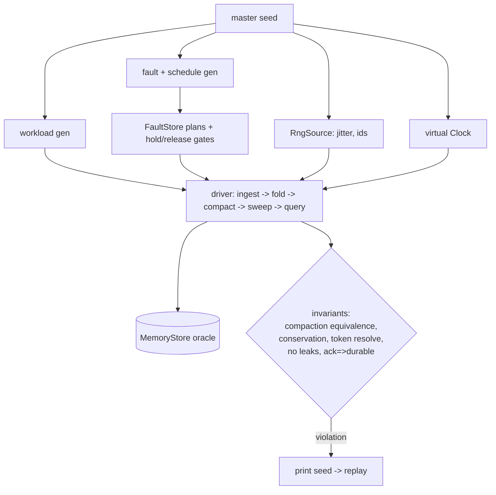

# ADR-0068: Deterministic whole-system simulation harness (ravel-sim)

Status: Accepted

## Context

Ravel already has most of the substrate deterministic simulation needs,
built piece by piece for unit and crash-matrix testing:

- Injected clocks everywhere, including injectable `sleep`
  (crates/ravel-ingest/src/clock.rs, crates/ravel-maintain/src/clock.rs,
  MemoryStore's settable clock).
- Seeded fault injection with per-operation rules, Nth-occurrence
  triggers, deterministic random mode, and hold/release scheduling gates
  (crates/ravel-object-store/src/fault.rs).
- A strong-consistency in-memory store oracle with pagination control
  (MemoryStore).
- Bit-pattern float discipline and a documented total order for dedup.
- Pure-logic crates for alerting, analytics, and record encoding.

What is missing is composition: no harness runs
ingest -> fold -> compact -> sweep -> query as one seeded program under a
generated workload and fault schedule, checks system invariants, and
replays any failure from its seed. Today's crash matrices are hand-written
scenarios; they cover the failure shapes someone thought of. The bug
classes this architecture generates by construction — racing compactors,
stale snapshot HEADs, sweep racing a pinned query, fold racing a late
commit — live in interleavings nobody enumerated.

Known nondeterminism that a harness must control or eliminate: unseeded
jitter (`rand::rng()` in commit publish backoff and the server's loop
jitters), fresh UUIDv4 writer ids per process, `buffer_unordered`
completion order, and the query engine's HashMap-iteration-order leak at
the cross-plan combine.

## Decision

Build `crates/ravel-sim`, a dev-only crate (never a dependency of any
shipping binary), containing:

1. **A seeded runtime**: single-threaded tokio (`current_thread`,
   `start_paused`), one master seed deriving per-component seeds for
   workload, faults, jitter, and identity.
2. **An `RngSource` seam** mirroring the existing `Clock` pattern, threaded
   through the production call sites that currently draw OS entropy on
   code paths the simulator exercises (publish retry jitter, server loop
   jitters, writer/compactor/folder ids). Production default remains OS
   entropy; only the harness injects a seeded source.
3. **A workload generator**: tenants, series cardinality profiles, point
   streams (scalar + histogram), log/span batches, query mix — all drawn
   from the seed.
4. **A fault-schedule generator** compiling to FaultStore plans and
   hold/release gate scripts, so operation interleavings (not just
   failures) are searchable.
5. **Drivers and invariants**: run full cycles over MemoryStore and assert
   after every phase: query-result equivalence before and after compaction
   (bit-exact, as compaction_bench's demo scenario already does once);
   record-count conservation; commit-token satisfiability; no orphan or
   unreferenced-part leaks past the horizon; strict-ack-implies-durable.
6. **Seed replay and CI**: any failure prints the master seed; a nightly CI
   job runs a seed batch, and a small smoke batch runs per PR. A failing
   seed is reproduced locally with one command.

## Rejected alternatives

- **loom / shuttle**: model-check std synchronization primitives inside
  one process. Ravel's risky interleavings are protocol-level (object
  visibility order, CAS races, sweep timing), not lock orderings; there
  are almost no locks on the paths in question. Complementary later, not
  the harness.
- **madsim / turmoil**: simulate the network/socket layer. Ravel's I/O
  boundary is the object-store trait, and FaultStore already injects
  exactly there with richer semantics (conditional-write outcomes,
  corrupt ranges, etag changes) than a socket simulator can express.
- **External deterministic-hypervisor testing** (Antithesis-style): far
  heavier than needed while the whole system runs in one process against
  MemoryStore; revisit if multi-process deployment testing is ever needed.
- **Doing nothing (keep hand-written matrices)**: the matrices stay; the
  harness exists to find the rows nobody wrote.

## Consequences

- A small `RngSource` seam lands in a few production crates (API addition,
  behavior unchanged by default).
- Determinism defects become fix-first prerequisites; the HashMap-order
  combine is the first.
- CI gains a nightly seed-batch job with a time budget; flaky seeds are
  bugs by definition (a seed either passes always or fails always).
- New crate to maintain; deliberately dev-only so it can move fast without
  touching shipping code paths.
- The harness runs single-threaded by design; it searches interleavings
  via gates and schedules, not via racing OS threads, so runs are
  reproducible by construction.
