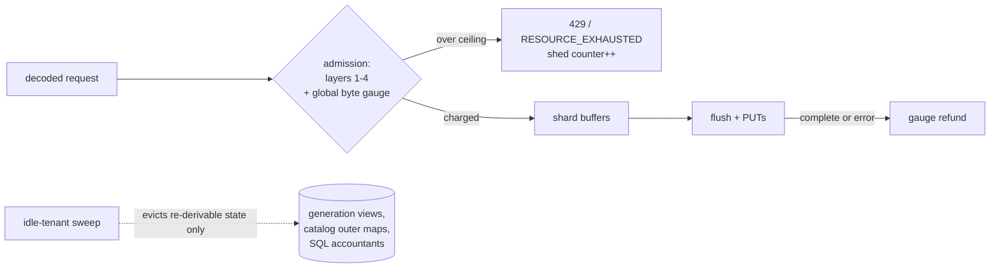

# ADR-0069: Global ingest memory bounds and idle-tenant state eviction

Status: proposed (2026-08-09)
Refs: 2026-08-09 architecture review (RAVEL-TIGERBEETLE-REVIEW.md R5,
section 8), issue #802 (transport concurrency limit, in flight).

## Context

Ravel's memory model is configuration-bounded per tenant and per query,
with no unbounded channels anywhere. But nothing bounds the *sum*:

- Ingest buffers are capped per (tenant, shard, signal) at ~8 MiB, so the
  worst case is roughly `tenants x shards x signals x 8 MiB` — unbounded
  in active-tenant count. On the 8 GB hosts the fleet actually runs, a few
  dozen active tenants can theoretically exceed RAM before any per-tenant
  limit trips.
- Every parked strict request holds its decoded, normalized points for up
  to the 10 s ack deadline. Issue #802 (in flight) bounds the number of
  parked requests; it does not bound their bytes.
- Per-tenant map entries are never evicted for idle tenants: admission
  controller state, generation-switch views (old shard sets are never
  removed), the catalog's per-tenant cache outer maps, and SQL memory
  accountants all grow monotonically over process lifetime.

TigerBeetle answers this with fully static allocation. That model does not
fit a multi-tenant elastic system: tenants appear and disappear, and
cardinality swings by orders of magnitude. But the underlying principle —
know the bound, enforce it explicitly, fail with backpressure instead of
OOM — applies directly.

## Decision

1. **A process-wide ingest byte budget.** One atomic gauge charges the
   estimated bytes of buffered ingest state at admission (after decode,
   before buffering) and refunds on flush completion or error. A new flag
   (`--max-ingest-buffer-bytes`, default 512 MiB, 0 = unlimited) sets the
   ceiling. At the ceiling, new writes are shed exactly like any admission
   failure — HTTP 429 with Retry-After, gRPC RESOURCE_EXHAUSTED — before
   any buffering, so strict-mode semantics are untouched. The gauge and a
   shed counter render on /metrics inside the existing label allowlist.
   Interacts with ADR-0067: in-flight pipelined flushes stay charged until
   their PUTs complete, so pipelining depth is automatically accounted.
2. **Idle-tenant eviction, only for re-derivable state.** A background
   sweep (jittered interval, same worker shape as every other loop) evicts
   per-tenant entries idle past a threshold (default 1 h) from: generation
   views (re-read from the provisioning record on next touch), catalog
   per-tenant cache maps (already reconstructible by definition), and SQL
   memory accountants with zero outstanding reservations. Admission
   controller state is explicitly **excluded** in this ADR: its
   active-series/stream counts are correctness-bearing caps, and evicting
   them silently resets a tenant's cap consumption. Whether ADR-0057's
   fleet reconciliation records make admission-state eviction safe is a
   separate follow-up decision; until then that map grows with tenant
   count and is documented as doing so.
3. **A documented boundedness statement** in docs/ingest.md: worst-case
   process RSS as the sum of the ingest budget ceiling, cache byte caps,
   per-query budgets x concurrency ceiling, and fixed overhead — every
   term a named config knob.

## Rejected alternatives

- **Full static allocation** (TigerBeetle's model): requires fixing tenant
  count and per-tenant shape at startup; wrong for an elastic multi-tenant
  service and would waste most of an 8 GB host or hard-cap tenancy.
- **Per-tenant fixed reservations**: same waste problem in different
  clothes; the global gauge admits bursty tenants opportunistically while
  keeping the sum bounded.
- **LRU caps on the admission maps**: silently discards correctness-bearing
  cap state; a tenant's active-series count must never reset as a side
  effect of memory pressure.
- **Relying on the #802 concurrency limit alone**: bounds request *count*,
  not buffered *bytes*; a small number of maximal 16 MiB requests across
  many tenants still needs the byte gauge.
- **cgroup/OOM-based limits**: an OOM kill loses every in-flight strict
  request and looks like a crash to clients; explicit shed is strictly
  better and is the existing admission idiom.

## Consequences

- A new global admission check on the hot path: one atomic add/sub per
  request — negligible next to existing per-request work.
- Under sustained overload the system now sheds with 429 instead of
  growing RSS; clients with retry/backoff (the OTLP norm) experience
  backpressure, not data loss.
- Eviction introduces a re-read cost on first touch after idleness
  (one provisioning-record GET for generation views); bounded and rare.
- The admission-state exclusion is an honest gap, documented, with a named
  follow-up rather than an unsafe eviction.
