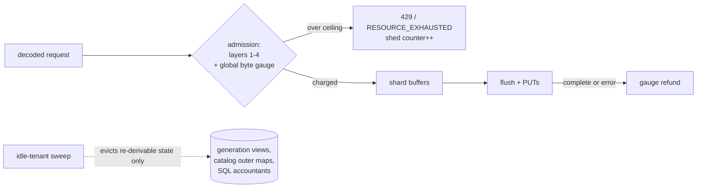

# ADR-0069: Global ingest memory bounds and idle-tenant state eviction

Status: Accepted

## Context

Ravel's memory model is configuration-bounded per tenant and per query,
with no unbounded channels anywhere. But nothing bounds the *sum*:

- Ingest buffers are capped per (tenant, shard, signal) at ~8 MiB, so the
  worst case is roughly `tenants x shards x signals x 8 MiB` — unbounded
  in active-tenant count. On the 8 GB hosts the fleet actually runs, a few
  dozen active tenants can theoretically exceed RAM before any per-tenant
  limit trips.
- Every parked strict request holds its decoded, normalized points for up
  to the 10 s ack deadline. A separate transport concurrency limit bounds
  the number of parked requests; it does not bound their bytes.
- Per-tenant map entries are never evicted for idle tenants: admission
  controller state, generation-switch views (old shard sets are never
  removed), the catalog's per-tenant cache outer maps, and SQL memory
  accountants all grow monotonically over process lifetime.

TigerBeetle answers this with fully static allocation. That model does not
fit a multi-tenant elastic system: tenants appear and disappear, and
cardinality swings by orders of magnitude. But the underlying principle —
know the bound, enforce it explicitly, fail with backpressure instead of
OOM — applies directly.

## Decision

1. **A process-wide ingest byte budget.** One atomic gauge charges the
   estimated bytes of buffered ingest state at admission (after decode,
   before buffering) and refunds on flush completion or error. A new flag
   (`--max-ingest-buffer-bytes`, default 512 MiB, 0 = unlimited) sets the
   ceiling. At the ceiling, new writes are shed exactly like any admission
   failure — HTTP 429 with Retry-After, gRPC RESOURCE_EXHAUSTED — before
   any buffering, so strict-mode semantics are untouched. The gauge and a
   shed counter render on /metrics inside the existing label allowlist.
   Interacts with ADR-0067: in-flight pipelined flushes stay charged until
   their PUTs complete, so pipelining depth is automatically accounted.
2. **Idle-tenant eviction, only for re-derivable state.** A background
   sweep (jittered interval, same worker shape as every other loop) evicts
   per-tenant entries idle past a threshold (default 1 h) from: generation
   views (re-read from the provisioning record on next touch), catalog
   per-tenant cache maps (already reconstructible by definition), and SQL
   memory accountants with zero outstanding reservations. Admission
   controller state is explicitly **excluded** in this ADR: its
   active-series/stream counts are correctness-bearing caps, and evicting
   them silently resets a tenant's cap consumption. Whether ADR-0057's
   fleet reconciliation records make admission-state eviction safe is a
   separate follow-up decision; until then that map grows with tenant
   count and is documented as doing so.
3. **A documented boundedness statement** in docs/ingest.md: worst-case
   process RSS as the sum of the ingest budget ceiling, cache byte caps,
   per-query budgets x concurrency ceiling, and fixed overhead — every
   term a named config knob.

## Rejected alternatives

- **Full static allocation** (TigerBeetle's model): requires fixing tenant
  count and per-tenant shape at startup; wrong for an elastic multi-tenant
  service and would waste most of an 8 GB host or hard-cap tenancy.
- **Per-tenant fixed reservations**: same waste problem in different
  clothes; the global gauge admits bursty tenants opportunistically while
  keeping the sum bounded.
- **LRU caps on the admission maps**: silently discards correctness-bearing
  cap state; a tenant's active-series count must never reset as a side
  effect of memory pressure.
- **Relying on the transport concurrency limit alone**: bounds request *count*,
  not buffered *bytes*; a small number of maximal 16 MiB requests across
  many tenants still needs the byte gauge.
- **cgroup/OOM-based limits**: an OOM kill loses every in-flight strict
  request and looks like a crash to clients; explicit shed is strictly
  better and is the existing admission idiom.

## Consequences

- A new global admission check on the hot path: one atomic add/sub per
  request — negligible next to existing per-request work.
- Under sustained overload the system now sheds with 429 instead of
  growing RSS; clients with retry/backoff (the OTLP norm) experience
  backpressure, not data loss.
- Eviction introduces a re-read cost on first touch after idleness
  (one provisioning-record GET for generation views); bounded and rare.
- The admission-state exclusion is an honest gap, documented, with a named
  follow-up rather than an unsafe eviction.

## Implementation notes (idle-tenant eviction)

Decision 2 is implemented as one background sweep in `services/ravel-server`
(`idle_tenant_state.rs`), spawned alongside the other worker loops with the
same jittered-interval shutdown shape and driven by the injected `SystemClock`.
The flag is `--idle-tenant-state-ttl` (default `1h`, `0` disables the sweep).
Each owning crate exposes a deterministic, clock-free eviction entry point that
the sweep drives with the injected `now_ns` and the TTL:

- `ravel-ingest`: `GenerationSwitch::evict_idle` (via each router's
  `evict_idle_generation_views`). Last touch advances on every cache-hit route
  and every refresh; an evicted view re-reads the provisioning record on the
  next write and succeeds. Only the per-tenant `views` map is swept — the
  shared-by-count `sets` map is topology, not per-tenant idle state.
- `ravel-catalog`: `Catalog::evict_idle_tenants`. Last touch is stamped per
  tenant at the head of `resolve_impl`; a swept tenant loses its whole
  outer-map entry in every per-tenant decoded cache and re-reads on the next
  resolve. The process-wide content-hash-keyed byte cache is not partitioned
  per tenant and is reclaimed by its own capacity bound instead.
- `ravel-sql`: `SqlExecutor::evict_idle_accountants`, guarded on zero
  outstanding reservations so an accountant backing a live query is never
  evicted (that would stop the tenant ceiling being shared across its
  concurrent queries). Last touch is stamped in the shared `resolve` funnel, so
  both the HTTP and Flight SQL paths keep an active tenant out of the sweep.

The admission-controller maps (active-series/stream sets, token buckets,
usage counters) are the one long-lived per-tenant map family that is
deliberately *not* an evictor and never registered with the sweep, so its
exclusion from decision 2 is structural, not merely a convention.

The OTLP HTTP handler's exemplar admission (`services/ravel-server/src/ingest.rs`,
wired through `normalize_metrics_with_exemplars`) does not add a second one:
its `ExemplarCap` (ADR-0047 decision 2) is built fresh per request and
dropped at the end of the call, the same shape every other OTLP normalize
entry point already uses. The real per-series-per-window budget is enforced
per shard actor with no cross-shard coordination (`crates/ravel-ingest/src/shard.rs`),
which already builds and drops its own cap per flush -- a shard-lived (or
longer) cap was considered and rejected there as an unbounded memory-growth
vector, since `ExemplarCap`'s per-series map has no eviction. Nothing at the
transport layer needs to, or should, outlive one request.

## Amendment (2026-09-07): the OTLP HTTP gzip inflate is charged pre-inflate

This amendment appends to decision 1; it moves the charge point for one
transient and, in doing so, redefines what the gauge measures. Everything
else above stands unchanged.

### Context

Decision 1 charges "at admission (after decode, before buffering)". That
placement left the OTLP HTTP gzip decompression buffer outside the ceiling.
`services/ravel-server/src/otlp_http.rs` takes the in-flight-request permit,
then decompresses the body up to `MAX_DECOMPRESSED_OTLP_BODY_BYTES` (64 MiB),
and only afterward does the router take the decision-1 charge. So
`--max-inflight-ingest-requests` copies of a 64 MiB inflate -- 64 GiB at the
default 1024 -- could exist at once before a single byte was charged. The
`--max-ingest-buffer-bytes` flag and docs/ingest.md both claimed a bound that
this transient escaped: the flag overclaimed (issue #1297).

### Decision

The gzip inflate path charges the process-wide `IngestByteBudget` for the
bytes it decompresses, **before it finishes inflating**, incrementally as each
chunk is produced. A decompression whose running total would cross the ceiling
is shed mid-inflate (OTLP HTTP 429 with `Retry-After`, the existing shed
counter) rather than being allocated in full and charged afterward. This
amendment covers OTLP HTTP gzip only; the Remote Write snappy inflate is
charged by the 2026-09-10 amendment below, and OTLP gRPC gzip decompression
stays uncharged (that amendment records why), so no gRPC status is described
here. The charge
is held as an RAII guard through protobuf decode and released once decode has
consumed and freed the inflate chunks -- prost copies them into owned structs --
before the router takes its own decision-1 buffered charge. A single request's
inflate charge and buffered charge therefore never coexist: the peak that one
request contributes to the gauge is the larger of the two, not their sum.

The decompressed body is retained as the list of exactly-sized chunks that were
charged for, and decoded through that list as a non-contiguous `Buf`, rather than
appended into one growing `Vec<u8>`. This is what makes the charge equal the
retained bytes at every instant: an amortized-growth buffer holds spare capacity
past its length, and holds the old and the new allocation simultaneously while it
reallocates, so a charge taken on the appended length would undercount the very
buffer this amendment exists to bound (`reserve_exact` does not close the gap,
because an allocator may return more than was requested).

**What the gauge now means.** Before this amendment `ravel_ingest_buffer_bytes`
measured buffered ingest state only. It now also counts the transient OTLP HTTP
gzip decode state currently in flight (and, since the 2026-09-10 amendment
below, the Remote Write snappy decode state): a request that is mid-inflate holds a
decode charge on the same gauge, alongside every other request's buffered
charge, so the gauge reflects the concurrent inflate buffers that used to be
invisible. For that decode term the gauge counts the bytes the request has
actually retained -- the summed length of its inflate chunks, which because each
chunk is allocated once at its final size is also the number of bytes those
allocations occupy -- not an estimate and not a length that a spare-capacity or
mid-reallocation buffer would exceed. A single request does not hold both charges
at once -- it releases the decode charge once decode has consumed and freed those
chunks, before the router takes its buffered charge -- so that one request's
contribution is the larger of the two, never their sum. This is deliberate: the ceiling bounds peak
resident ingest memory, and the concurrent inflate buffers are part of that
peak. The identity (uncompressed) path allocates no inflate buffer and takes no
gateway charge; the OTLP gRPC and Remote Write decode paths are out of scope
here. Remote Write is charged by the 2026-09-10 amendment below; OTLP gRPC and
OTAP remain bounded by `--max-inflight-ingest-requests` alone.

**Why the actual inflated length, charged incrementally.** Charging the 64 MiB
cap up front would over-charge every well-compressing request and shed real
traffic under a tight budget. Charging a compressed-size estimate would either
over- or under-charge depending on the ratio. Charging each produced chunk
makes the summed charge equal the actual decompressed length exactly: the
over-charge bound for an admitted request is **zero**, and the uncharged
allocations are a fixed staging-and-decoder cost plus per-chunk bookkeeping
that scales with chunk count: one staging chunk (64 KiB) per in-flight inflate,
which transiently holds one chunk of decompressed bytes; per-chunk bookkeeping
(a `Bytes` handle and a charge guard for each retained chunk, about 48 bytes
per 64 KiB chunk, held in two vectors that grow by doubling); and flate2's own
decoder state (tens of KiB). The compressed request body itself also stays
resident for the whole inflate, but it is bounded by the wire-body cap
(`MAX_REQUEST_BODY_BYTES`, 16 MiB, ADR-0051 section 1 and section 3) and
already counted against `--max-inflight-ingest-requests`, not left uncharged
here. No uncharged allocation holds a copy of the full decompressed body; the
staging chunk holds only one chunk at a time, and it and the decoder state are
a fixed cost that alone can exceed the charge itself on a small decompressed
body. A shed request refunds every partial chunk on the spot.

### Rejected alternatives

- **Documentation only** (correct the flag docs, leave the resource
  unbounded): rejected. It leaves 64 GiB of possible inflate outside the
  ceiling and keeps the flags claiming a bound they do not enforce.
- **Lower the `--max-inflight-ingest-requests` default**: rejected. It caps
  concurrency for every caller to paper over an accounting gap, and the gap
  (uncharged inflate) would still exist at the lower concurrency.
- **Charge after inflate** (keep decision 1's point, add the decompressed size
  once decode finishes): rejected. The peak *is* the inflate; charging after
  it has already been allocated does not bound the transient this amendment
  exists to bound.
- **Reserve `max_inflight_requests x cap` statically**: rejected for the same
  reason decision 1's own "Full static allocation" bullet rejects it -- it
  wastes most of an 8 GB host or hard-caps tenancy, and the point of the global
  gauge is to admit bursty requests opportunistically while keeping the sum
  bounded.

### Model (RUST_ONLY)

The formal model is unaffected. Admission shedding happens strictly before
`PinFlush`, and the model has no admission action, so a shed request mints no
flush: there is no new transition, no new commit-protocol interleaving, and
nothing for the TLA+ model to cover. This amendment changes only where in the
Rust ingest path a byte is charged, not the durability or visibility state
machine.

## Amendment (2026-09-10): the Remote Write snappy inflate is charged

This amendment appends to decision 1 and extends the 2026-09-07 amendment to a
second ingest path. Everything above stands unchanged.

### Context

The 2026-09-07 amendment closed the OTLP HTTP gzip gap and left the other
ingest surfaces where decision 1 put them: outside the ceiling. Two of them
inflate attacker-controlled bytes before anything is charged.

- **Remote Write** (`services/ravel-server/src/remote_write.rs`) takes the
  in-flight permit, then snappy-decompresses the body up to
  `MAX_DECOMPRESSED_PAYLOAD_BYTES` (64 MiB), and only afterward does the
  router take the decision-1 charge. As with gzip,
  `--max-inflight-ingest-requests` copies of a 64 MiB inflate could exist at
  once with nothing charged.
- **OTLP gRPC** (`services/ravel-server/src/lib.rs`, `accept_compressed(
  CompressionEncoding::Gzip)`) inflates inside tonic, bounded only by
  `max_decoding_message_size` (16 MiB here).
- **OTAP** (`crates/ravel-otap/src/stream.rs`, `decompress_capped`) inflates
  each `ArrowPayload.record` with zstd, bounded per payload by
  `StreamConfig::default().max_decompressed_payload_bytes` (16 MiB), with one
  such buffer per payload in a `BatchArrowRecords`.

The flag docs and docs/ingest.md named the uncharged Remote Write inflate as a
term of the declared bound, so the same overclaim #1297 identified for gzip
applied to it (issue #1419).

### Decision

The Remote Write path charges the process-wide `IngestByteBudget` for its
snappy expansion **before that expansion is allocated**. The snappy block
format declares its decompressed length in a varint header, so
`snap::raw::decompress_len` returns the exact inflated size without allocating,
and `ravel-remote-write` then allocates exactly that many bytes. The handler
therefore charges the exact quantity it is about to materialize, not the cap
and not the compressed length, and a body the budget cannot admit is shed with
HTTP 429 and `Retry-After` (the existing `ravel_ingest_buffer_shed_total`)
before its output buffer exists.

The order per request is cap, then budget, then allocate: a declared inflate
larger than the 64 MiB post-decompression cap takes no charge and is rejected
by the decoder with 400 exactly as before, so a tight budget cannot turn an
over-cap body into a 429. The charge is an RAII guard held through protobuf
decode and normalization and released immediately before the router takes its
own decision-1 buffered charge, so a single request's inflate charge and
buffered charge never coexist. Holding it past decode over-holds on purpose:
the inflate buffer is freed when decode returns, and the charge then stands as
the admission cost of the decoded request until its points reach the router.
Charging one step rather than chunk by chunk is what the declared length buys:
the sum charged equals the length allocated exactly, with no partial-chunk
refund path and no incremental shed point to describe.

**Scope: this amendment covers Remote Write only.** The OTLP gRPC gzip inflate
and the OTAP zstd payload inflate are **not** charged and remain outside
`--max-ingest-buffer-bytes`, bounded only by `--max-inflight-ingest-requests`
times their 16 MiB per-message caps. Together with the 2026-09-07 amendment,
two of Ravel's four ingest decompression surfaces are inside the ceiling and
two are outside it. Any claim that the flag bounds all ingest inflate is false.

**Why OTLP gRPC was not fixed here.** Three placements were examined and none
charges the right quantity at the right time without a change below our code:

1. *A tonic interceptor, custom codec, or `Service` layer that sees the
   compressed frame.* An interceptor receives `Request<()>` (metadata and
   extensions), never the frame body. A `tower::Layer` does see the compressed
   frame, and one already runs on the gRPC listener
   (`services/ravel-server/src/wire_byte_count.rs`), but the only quantity
   derivable there before inflation is the *compressed* length: gzip, unlike
   snappy, does not declare its output size, so no correct pre-inflate charge
   exists at that seam. A custom codec would be the right seam, and it is not
   reachable: tonic-build emits `let codec = tonic_prost::ProstCodec::
   default();` inside the generated server's `call`, so the codec cannot be
   substituted without hand-writing the generated stubs.
2. *Charge the post-inflate length in the handler.* Available, and rejected:
   it charges after the peak has already been allocated, which the 2026-09-07
   amendment rejects by name ("Charge after inflate"). It would also charge a
   quantity that is not the allocation. tonic inflates into a reused
   amortized-growth `BytesMut` (`Streaming::decompress_buf`, tonic 0.14.6
   `src/codec/decode.rs`), cleared but not freed between messages on a stream,
   so its length undercounts its capacity.
3. *Neither, without a tonic-level change.* This is where OTLP gRPC stands.

A correct fix needs one of: an upstream tonic hook that reports decompressed
bytes as they are produced (so the charge can be taken incrementally and the
inflate shed mid-stream, as gzip is on HTTP), or moving the inflate out of
tonic entirely -- accept identity at the tonic layer and inflate in our own
layer using the charged chunked reader `otlp_http.rs` already has. Both are
larger than this change and neither is attempted here. OTAP is untouched for
the same reason at a different layer: its inflate is inside `ravel-otap`, out
of scope for this change.

**What the gauge now means.** `ravel_ingest_buffer_bytes` counts the Remote
Write snappy decode state in flight alongside the OTLP HTTP gzip decode state
and the buffered charges. For the Remote Write term the gauge counts the
declared decompressed length, which is exactly what `ravel-remote-write`
allocates for the body (`vec![0u8; len]`, allocated once at its final size),
not an estimate. Uncharged on this path: the compressed request body (bounded
by the 16 MiB `MAX_REQUEST_BODY_BYTES` cap and already counted against
`--max-inflight-ingest-requests`), and the prost-decoded and normalized structs
the request holds after the inflate buffer is freed, which stay in the
in-flight-request term exactly as decision 1 left them.

### Rejected alternatives

- **Charge the 64 MiB cap up front**: rejected. It over-charges every
  well-compressing request and sheds real traffic under a tight budget, and
  the declared length makes the exact figure available for free.
- **Charge the compressed body length**: rejected. It is the wrong quantity by
  the compression ratio, which is precisely what a decompression bomb
  maximizes, so the bound would fail exactly when it matters.
- **Charge inside `ravel-remote-write` rather than in the gateway**: rejected
  for this change. It would put a budget dependency into a decode crate that
  has none, and the declared length is readable from the gateway without it.
- **Fix OTLP gRPC by charging post-inflate so all paths "look" covered**:
  rejected. It would let the flag docs claim a bound the gRPC path does not
  enforce, which is the failure #1297 was filed for.

### Model (RUST_ONLY)

Unaffected, for the reason the 2026-09-07 amendment gives: shedding happens
strictly before `PinFlush` and the model has no admission action.

## Amendment (2026-09-12): OTLP gRPC is bounded and documented, not charged

This amendment resolves the OTLP gRPC gzip inflate that the 2026-09-10
amendment left as an open item ("Why OTLP gRPC was not fixed here"). It changes
no ingest behavior; it records a decision and adds a test that pins the ceiling
that decision relies on. Everything above stands unchanged. It matches the
Remote Write amendment's scope in reverse: that one added a charge, this one
records that no charge is the correct outcome for this path and says why
completely, rather than leaving the path as a deferred gap. OTAP is out of
scope (issue #1419 names gRPC only) and is treated below.

### Context

The 2026-09-10 amendment charged the Remote Write snappy inflate and examined
three placements for a matching OTLP gRPC charge, concluding none charges the
right quantity at the right time without a change below Ravel's code. It left
the path uncharged and the fix unattempted. docs/ingest.md described the state
as "not charged by this amendment", which reads as a deferral rather than a
decision. Issue #1419's gRPC half is that decision.

The determining fact is where the inflate happens. tonic decompresses inside
its own `Streaming` codec (`decompress` into `StreamingInner::decompress_buf`,
tonic 0.14.6 `src/codec/decode.rs`), before the generated server calls any
Ravel handler. The earliest Ravel code on the request path is
`WireByteCountLayer` (`services/ravel-server/src/wire_byte_count.rs`, installed
on the gRPC server builder in `src/lib.rs`), a `tower::Layer` whose body wrapper
parses gRPC frame headers off the wire. Before inflation it can read only the
compressed frame length and the compression flag; gzip does not declare its
output size, so the true inflated size is not knowable at that seam.

### Decision

The OTLP gRPC gzip inflate stays uncharged and is bounded per request by
tonic's `max_decoding_message_size` (16 MiB here, set on every OTLP gRPC service
in `src/lib.rs`), which tonic 0.14.6 enforces at two points, both verified
against the version in the lock file:

- the compressed frame length is checked against the cap before anything is
  inflated (`decode.rs`, `len > limit` yields `OUT_OF_RANGE`), and
- the decompression output buffer is capped at the same value
  (`(&mut self.decompress_buf).limit(limit)`), so an inflate that would exceed
  it fails with `RESOURCE_EXHAUSTED` mid-decompression rather than allocating
  past the cap.

So one gRPC ingest request's decompressed message cannot exceed 16 MiB, and the
process-wide exposure is `--max-inflight-ingest-requests` times 16 MiB, a term
the worst-case arithmetic in docs/ingest.md already states. This is the same
bound `--max-inflight-ingest-requests` documents for every uncharged OTLP
decoded body; no new headroom is claimed.

`services/ravel-server/tests/inflate_budget_e2e.rs` pins the ceiling: a gzip
gRPC request whose body inflates past 16 MiB is refused with
`RESOURCE_EXHAUSTED` and a status message that names the exact 16777216-byte
limit, and a request inflating to just under 16 MiB is accepted. The number the
documentation states is therefore the number the code enforces, checked in CI.

### Rejected alternatives

- **Charge the compressed frame length in `WireByteCountLayer`.** It runs before
  inflation and could hold a charge across the allocation, but the compressed
  length is the wrong quantity by the compression ratio, which a decompression
  bomb maximizes, so the bound would fail exactly when it matters. Same reason
  the Remote Write amendment rejects "charge the compressed body length".
- **A custom tonic `Codec` that charges as it decompresses.** The right seam and
  unreachable: tonic-build emits `tonic_prost::ProstCodec::default()` inside the
  generated server's `call`, and the `Decoder` trait sees only the already
  decompressed `DecodeBuf`, so even a hand-substituted decoder would charge
  after the peak.
- **Charge the post-inflate length in the handler.** After the peak has already
  been allocated, which does not bound the peak (the 2026-09-07 amendment
  rejects "charge after inflate" by name), and it charges tonic's reused
  amortized-growth `decompress_buf`, whose length undercounts its retained
  capacity.
- **Charge a flat 16 MiB per request on admission.** This does bound the peak
  and can be held across the allocation, but it over-charges every
  well-compressing request and sheds real traffic under a tight budget, and the
  result (`max_inflight` times 16 MiB) is exactly what the concurrency bound
  already states without any charge. It buys nothing over documenting the
  existing bound.
- **Fix it post-inflate anyway so all paths "look" covered.** Rejected for the
  reason the 2026-09-10 amendment gives: it would let the flag docs claim a
  bound the path does not enforce, the failure #1297 was filed for.

### OTAP (out of scope, recorded for a follow-up)

OTAP is not part of issue #1419 and is not decided here. It is a larger
exposure than the gRPC path and is worth its own issue. A `BatchArrowRecords`
carries `arrow_payloads`, an unbounded repeated field; `ravel-otap`
(`crates/ravel-otap/src/stream.rs`) imposes no payload-count cap and decompresses
each payload's `record` capped at `max_decompressed_payload_bytes` (16 MiB),
one payload at a time. The whole compressed message is bounded by the same
16 MiB `max_decoding_message_size`, so the payload count is bounded only by that
size divided by the minimum per-payload wire bytes (on the order of 10^4 for
maximally-compressing bomb payloads). The transient decompress buffer is 16 MiB
(freed between payloads), but the decoded `RecordBatch`es accumulate across all
payloads of the message, so one request's retained decode bytes are the payload
count times the per-payload decoded size, far above a single 16 MiB message.
`max_rows_per_batch` (default 1,000,000) caps rows per IPC message but neither
the payload count nor the sum. docs/ingest.md and this ADR state the per-payload
16 MiB cap but not this per-request total; quantifying and bounding it is the
follow-up.

### Model (RUST_ONLY)

Unaffected. This amendment records a decision and adds a test; it changes no
ingest path and no durability or visibility state.
