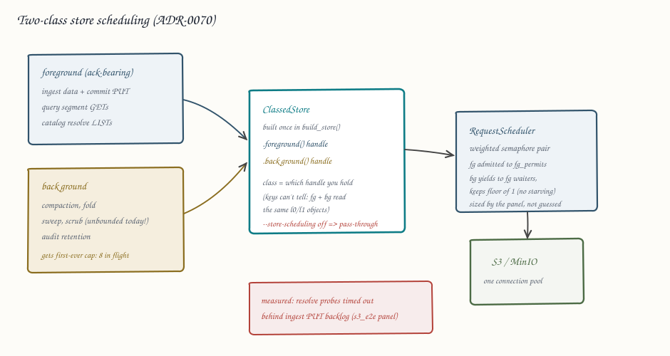

# ADR-0070: Request-class scheduling for object-store traffic and a CI benchmark regression gate

Status: Accepted

## Context

Every process shares one `Arc<dyn ObjectStoreBackend>` built at a single
site (`services/ravel-server/src/store.rs::build_store`). Foreground,
ack-bearing traffic (ingest data and commit PUTs, query segment GETs,
resolve LISTs) and background traffic (compaction, fold, sweep, scrub,
audit retention) meet in the same connection pool with no request
prioritization and no global cap. The starvation is measured, not
hypothesized: the `s3_e2e` MinIO panel saturated ingest at
3,923 accepted points/s with 70 s visibility lag, and the bench's
min-token resolve probe repeatedly timed out queued behind the ingest
PUT backlog. Under the same load, reader p99 was 417 ms against 26 ms on
an idle store.

Concurrency limits exist but were never derived from measurement, and
they do not cover the storm sources. Query fetch holds a 16-permit GET
semaphore and 8 segment futures; catalog resolve holds 16; compaction
part-fetch holds 16; fold 8. Sweep, scrub, and audit retention -- the
exact background storms -- have no cap at all: they list and delete
sequentially but unboundedly interleave with everything else. The
fetcher's GET knob (`with_max_concurrent_gets`) has zero non-test
callers, so none of these numbers can even be swept without plumbing.

Two facts constrain the design:

- **Request class is not decidable from the key.** Foreground query
  fetch and background compaction, fold, and scrub GET the same
  `t/<hash>/<sig>/l0/...` and `l1/...` objects. A key-sniffing
  decorator (the KmsRoutingStore shape, "one seam, zero threading")
  cannot classify reads. Class is a property of the caller, so it must
  attach where callers get their store handle.
- **Timing cannot be a hard CI gate on shared hosts.** The reference
  host (`ci-16gb-fsn1-1`) routinely carries load 3.5-5.8 from
  co-resident CI; GitHub-hosted runners are noisier still. The repo
  already encodes the honest answer in
  `crates/ravel-bench/tests/catalog_byte_gates.rs`: bytes and request
  counts are exact and deterministic, "this makes the gate unlosable."
  Meanwhile nothing gates performance at all: a past eager-decode
  regression merged silently, and every benchmark panel is a
  manual, one-shot run.

ADR-0067's depth panel left cells pending: depth 3 under
~300 ms injected RTT (committed as zero-byte placeholders) and a
multi-tenant bench shape (the single-tenant cadence never wants a
second in-flight flush). Both block the `max_inflight_flushes` and
adaptive-flush default decisions.

## Decision

### 1. Two request classes, attached per handle, one shared scheduler

`ravel-object-store` gains a `ClassedStore` wrapper constructed once in
`build_store`: it wraps the instrumented store and hands out two
`Arc<dyn ObjectStoreBackend>` handles -- `foreground()` and
`background()` -- that share one `RequestScheduler`. Wiring changes at
the construction sites only: ingest, query, and catalog receive the
foreground handle; the maintain driver, fold, sweep, scrub, and audit
retention receive the background handle. No trait change, no
per-request parameter, no key sniffing.

The scheduler is deliberately minimal: a weighted pair of semaphores.
Foreground requests are admitted up to `fg_permits`; background
requests are admitted up to `bg_permits` and additionally yield when
foreground waiters exist (strict-priority-with-floor: background never
starves completely -- it keeps a configurable floor of at least one
permit -- and never delays a foreground acquire by more than one
in-flight request). Metrics per class ride the existing
`InstrumentedStore` op labels extended with `{class}`.

### 2. Off by default until the panel sizes it

`--store-scheduling` defaults off: both handles pass through
unscheduled, byte-for-byte today's behavior. The flag flips on (and the
defaults freeze) only on evidence from the decision-4 panel, per the
epic's "semaphore defaults change only on panel evidence" rule. One
exception lands immediately regardless of the flag: sweep, scrub, and
audit retention acquire from the background class even in pass-through
mode, which for the first time bounds their in-flight store requests
(default cap 8, operator-tunable). Today they are unbounded; a bound of
8 is strictly safer and does not depend on panel calibration.

### 3. The CI gate is two-tier: exact gates hard, timing gates advisory

- **Tier A (hard, any runner):** extend the byte/request-count gate
  family (`catalog_byte_gates` shape) with counts for the read path and
  ingest publish path. Deterministic, MemoryStore-only, unlosable;
  runs in the normal check job.
- **Tier B (advisory, reference runner only):** a criterion smoke
  compare over the stable pure-CPU set (`segment_encode` groups,
  `series_id_hash`, `merge_kway_vs_materialized`, `bytes_slice_vs_copy`,
  `logseg_encode`, `logseg_scan`, `otap decode`) against a committed
  baseline under `bench/baselines/`, threshold +/-15%, posting a PR
  comment, never failing the build, and running only on the
  self-hosted reference runner where the baseline was recorded.
  Promotion to enforcing happens after a probation
  window shows acceptable false-positive rate, and only for regressions
  beyond 15% sustained across two consecutive runs of the same PR head.

### 4. One measurement panel closes the open loops

A single local panel session (MinIO + toxiproxy, the ADR-0067 panel's
fresh-data-dir/fresh-bucket/drift-canary methodology) produces:
the real-S3/non-loopback rerun listed as pending; the
GET-concurrency sweep {8, 16, 32, 64, 128} under concurrent ingest
(needs the fetch/catalog knobs plumbed to bench flags first);
the depth-3-at-300ms cells; and the multi-tenant shape
(needs an ingest_bench `--tenants` flag). The bench report JSON gains a
counted `resolve_starvation_timeouts` field so starvation stops being a
grep over raw logs. Panel results freeze the scheduler defaults
(decision 2) and the depth/adaptive-flush defaults (ADR-0067's open
decision).

## Rejected alternatives

- **Key-sniffing class decorator.** Reads are unclassifiable by key
  (foreground and background read identical objects); it would
  misclassify exactly the traffic that matters.
- **Per-request priority parameter on the trait.** Threads a parameter
  through every call site in nine crates for information the handle
  already carries; the trait stays clean.
- **A full scheduler (deadlines, aging, per-tenant queues).** No
  evidence requires it; the measured problem is two-class starvation.
  Weighted-pair semantics are explainable in one sentence and testable
  with FaultStore's hold/release ordering gate.
- **Hard timing gates on shared runners.** The reference host is never
  quiet and hosted runners are noisier; a hard timing gate would train
  everyone to ignore red. Exact gates stay hard, timing stays advisory
  until probation proves otherwise.
- **Skipping the panel and sizing semaphores analytically.** The
  existing constants came from exactly that method and the arithmetic
  shows they can be off by 4x against real RTT; the panel is the
  cheaper mistake.

## Consequences

- Background storms stop being able to starve acks once the flag flips;
  before that, sweep/scrub/audit-retention gain their first concurrency
  bound with no behavior change elsewhere.
- Every store construction site changes once (handle selection); new
  callers must choose a class, which is the point.
- The reference runner becomes CI infrastructure (self-hosted runner
  labels on the existing dual-role box); Tier B is skipped, not failed,
  when the runner is offline.
- The panel is local-only work (MinIO + toxiproxy on a workstation, per
  the depth-panel methodology); code legs are fleet-dispatchable, the
  workflow leg iterates on live Actions runs.
- The benchmark discipline holds: every number states its
  environment; loopback panels stay labeled as loopback.
