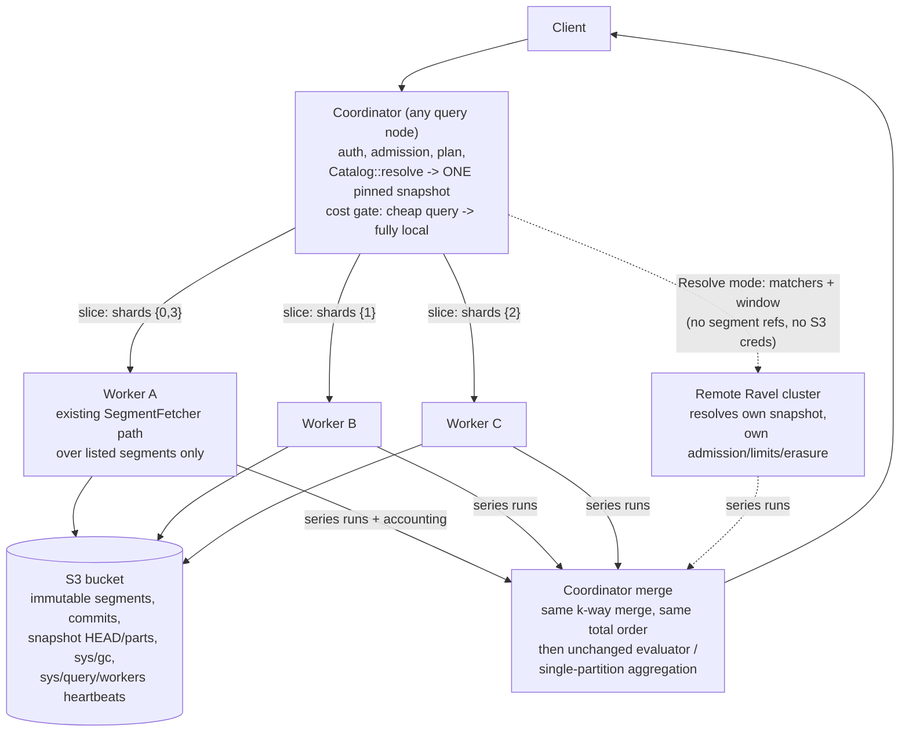
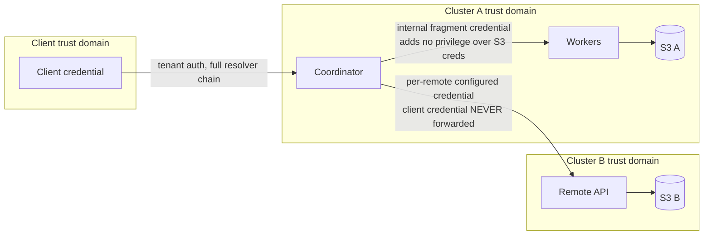

# ADR-0071: Distributed read fan-out and cross-cluster federation

Status: Accepted

## Context

Ravel's compute is stateless and disposable over an S3 source of truth. A
query executes entirely inside one process: `Catalog::resolve` pins one
immutable snapshot, a bounded fan-out fetches and decodes segments
(`fetch_concurrency`, per-fetcher GET semaphores), a lazy k-way merge dedups
under one total order, and evaluation runs materialized and sequential
(PromQL) or single-partitioned (SQL, where every DataFusion repartition knob
is deliberately off so aggregation order is bit-stable). Budgets, deadline,
accounting, and tracing are per query and explicitly threaded.

Consequences of the single-process shape:

- One node's NIC, CPU, and memory bound the largest serviceable query, even
  though the data layer imposes no such bound: any process can read any
  segment.
- There is no way to query data held by an independent Ravel deployment
  (different bucket, different trust domain) through one surface.

Everything a distributed plan needs already exists as durable metadata:
segment keys embed the ingest shard, commit records and snapshot entries
carry event-time bounds, sample/series counts, and object sizes, and the
provisioning record gives the shard domain per hour. All cross-process
coordination in the codebase today is object-store mediated (admission
reconciliation, maintain ownership by rendezvous hashing over heartbeat
keys, one CAS lease); no peer RPC exists yet.

## Decision

Two capabilities, one invariant: distribution changes where bytes are
fetched and decoded, never what the query computes.

**Intra-cluster fan-out.** The query node that receives a request is the
coordinator for that query, a per-query role, not a process type. It
resolves one pinned snapshot exactly as today, partitions the snapshot's
segment set by ingest shard into slices, and dispatches each slice to a peer
query node over an internal gRPC surface: Arrow Flight for the SQL lane
(extending `FlightInfo` to N endpoints whose tickets each carry a slice),
a protobuf `SeriesFetch` service for the PromQL lane (Arrow stays isolated
to the crates that already use it). Workers execute the existing fetch path
over only the listed segments: suffix-GET footers, verify identity, prune by
matchers, fetch and decode selected pages, apply erasure predicates,
pre-merge per slice, and stream series runs back with f64 values as raw bit
patterns. The coordinator k-way merges all slices under the existing total
order and then runs the unchanged PromQL evaluator or the unchanged
single-partition SQL aggregation. Aggregation and evaluation do not move in
v1; results are byte-identical to local execution, and a differential test
enforces that property for arbitrary partitions.

Dispatch is cost-gated: the existing pre-execution estimate decides local
versus distributed, so a cheap query runs today's path untouched. Worker
membership is a heartbeat key per process (`sys/query/workers/<id>`, same
shape as maintain heartbeats) with rendezvous hashing of
`(tenant_hash, signal, shard)` over the live set; no leader, no assignment
object, no new durable state. Rendezvous affinity also makes the per-process
content-addressed read caches behave as one aggregate cache with no
invalidation protocol, because segments are immutable.

**Cross-cluster federation.** The same fetch RPC in a second mode: instead
of segment references, the request carries matchers, a time window, and
budgets, and the remote cluster resolves its own snapshot and enforces its
own admission, limits, tenancy scheme, and erasure. Segment references and
S3 credentials never cross a trust boundary. The coordinator authenticates
to each remote with a per-remote operator-configured credential (a normal
tenant credential of that remote); client credentials are never forwarded.
Remote failures fail the query by default; a per-remote `skip_unavailable`
opt-in returns partial results marked in the response `warnings` plus a
`partial` stats block naming the skipped clusters. Intra-cluster execution
never returns partial results.

## Architecture

Slice atomicity: a slice contributes to the merge only after its terminal
summary frame arrives; partial frames from a failed attempt are discarded
whole. That rule makes re-dispatch safe with no dedup bookkeeping.

Protocol (new `proto/ravel/queryfrag.proto`, versioned from day 1,
reject-unknown like commit tokens): request carries protocol version, query
id, tenant hash, signal, scope (pinned segment identities, reconstructed and
verified by the worker per the reconstruct-don't-trust rule, or resolve-mode
matchers), matchers, padded window, budget shares, absolute deadline,
erasure predicates, and trace context. Response streams per-series frames
(labels once, then per-run timestamp deltas and value bits, preserving NaN
payloads, -0.0, and the staleness marker) and ends with a summary frame
carrying the worker's accounting snapshot and typed status. This is a
transient wire contract between processes, not a persistent format; no
stored byte changes.

## Failure semantics

- Worker unreachable or mid-stream loss: re-dispatch the slice to the next
  rendezvous worker once, then run the slice on the coordinator, then fail
  typed. Never partial.
- `SnapshotInvalidated` from any worker: one coordinator re-resolve and full
  re-dispatch, mirroring the existing single-retry rule; a second occurrence
  fails.
- `Corrupt`: fail immediately, no retry, matching local semantics.
- Budget trip on a slice or on the merged total: the same typed errors the
  local path produces.
- Deadline: the coordinator deadline (already bounded by `sys/gc`
  `max_query_duration`, which keeps every worker inside the GC protection
  horizon) cancels the fan-out; stream teardown reaches workers and the
  existing drop-based cancellation frees GETs and permits.
- Protocol version mismatch (rolling deploy): silent fallback to fully local
  execution, never an error.
- Fragment admission runs under a separate internal workload class with its
  own cap, so a coordinator holding a client-query permit can never deadlock
  waiting on fragments that need the same permit pool.
- Remote cluster down or slow: fail by default; with `skip_unavailable`,
  continue and mark, never silently.

## Security

The fragment surface accepts only a cluster-internal credential
(operator-provisioned, distributed like S3 credentials) and refuses external
identities; it conveys no privilege a process holding the bucket's S3
credentials lacks. Remote endpoints come only from operator config, never
from query text. Remote responses are size- and shape-validated data; a
remote cannot escalate through the coordinator.

**Implementation note: the two credential models are one wire
type with two trust boundaries.** The `FetchRequest` carries a `Scope`. A
`Pinned` fetch is an intra-cluster slice: the worker trusts the coordinator
and uses the already-resolved `tenant_hash` on the wire directly. A
`Resolve` fetch is cross-cluster federation: the remote treats the presented
credential as an ordinary tenant credential, resolves the tenant from its
own `TenantResolver`, and overwrites (never reads) the wire `tenant_hash`,
so a federated request reaches exactly the tenants that credential
authorizes there. A remote rejects the intra-cluster fragment token
outright — it is a slice credential, never a federation credential. This
distinction is a security invariant: collapsing the two would let a
coordinator name any tenant on a remote it holds one credential for.

Partial coverage (a soft-timed-out or skipped remote, or a remote that
returned a data kind this build cannot decode, such as native histograms
across the slice boundary) is never silent. The query stats carry
`partial: true` and one warning per degraded remote, merged into the
Prometheus JSON envelope. Warnings name only the operator-facing cluster
name; remote IP:port and errno are redacted, and `RemoteClusterConfig`'s
`Debug` redacts the configured credential.

## Performance

Fetch and decode scale near-linearly in workers until coordinator-side
evaluation or final aggregation dominates; that ceiling is explicit and is
what a future aggregation-pushdown ADR would move. Network bytes to the
coordinator are matcher-pruned, window-clipped decoded samples, bounded by
the existing per-selector budgets; total S3 request count is identical to
local execution for scalar-only queries (a histogram-bearing query pays the
distributed fetch and then the local fallback fetch, with both folded into
its reported cost), and instantaneous rate is capped by
`max_parallel_slices` times the per-worker GET semaphore. Initial gate
thresholds (distribute above 256 MiB estimated store bytes or 64 segments)
are set from the crossover benchmark before defaults freeze, and every later
optimization (straggler hedging, slice rebalancing, limit hints) requires a
benchmark demonstrating its value.

## Operational model

Off by default. Enabled per query node with `--distributed-query` plus a
fragment credential file; remotes with repeatable `--remote-cluster`
config. Workers self-register by heartbeat and drain by staleness. New
`ravel_distrib_*` metrics (slices dispatched, re-dispatched, failed,
fragment admissions, bytes streamed) and a `stats.fragments[]` block in the
query stats JSON, with per-slice tracing spans nested under the existing
phase spans.

## Rejected alternatives

1. Workers resolve their own snapshots intra-cluster. N catalog resolves per
   query and N potentially different pinned snapshots; breaks
   single-snapshot isolation and multiplies LIST/HEAD cost. The coordinator
   resolves once and ships explicit segment lists, which immutability keeps
   valid for the whole horizon-protected lifetime.
2. Shipping raw page bytes to the coordinator. Moves more bytes than local
   execution fetches, and adds a hop; the entire benefit of fan-out is that
   pruning and decoding happen next to the extra NICs.
3. Aggregation pushdown in v1. The SQL engine deliberately forces
   single-partition aggregation because parallel float accumulation is not
   bit-stable, and that ban's reasoning applies unchanged to distributed
   partials. Order-insensitive operators (count, min, max, group) are a
   future, separately-decided step; sum/avg/stddev need a float-tolerance
   ADR first.
4. Coordinator reads a remote cluster's S3 directly. Requires
   cross-trust-domain S3 credentials and bypasses the remote's admission,
   tenancy hashing, and erasure filtering. The remote's API is the boundary.
5. A consensus service, shard manager, or metadata database. Nothing here
   needs agreement: slices are derived deterministically from one snapshot,
   membership is heartbeat-plus-rendezvous (a pattern already live in
   maintain), and S3 CAS covers the rest.
6. A replica concept at the query layer. S3 is the replica; any worker can
   serve any slice, so failover is re-dispatch, not replica selection.
7. Probabilistic sketches for distributed aggregation. Exactness is standing
   policy (ADR-0020, ADR-0049, ADR-0051 all reject sketches); nothing in
   this design depends on them.
8. A per-query dedicated coordinator service or scheduler tier. Any query
   node coordinates the queries it receives; a tier would add a hop and a
   failure domain without removing any work.

## Consequences

- A new internal RPC surface exists and must be operated (credential
  rotation, version-skew awareness during deploys); version fallback keeps
  skew safe.
- The coordinator remains the ceiling for high-cardinality final
  aggregation until a future pushdown ADR.
- One new crate (`ravel-fleet`) holds the heartbeat live-set and rendezvous
  logic extracted from `ravel-maintain`, which loses its private copy.
- The differential invariant (distributed equals local, bit for bit)
  becomes part of the test surface and gates every future optimization.
- No storage format, catalog format, key layout, ingest path, or GC rule
  changes. Frozen contracts are untouched; the new proto file is a
  versioned transient wire contract.

## Future extensions

Order-insensitive aggregation pushdown; a float-tolerance ADR unlocking
sum/avg pushdown; straggler hedging; segment-granular rebalancing of
oversized shards; SQL-lane federation; snapshot-handle pagination (ticket
TTL is already bounded by `protection_horizon - grace`, so the mechanism
exists).
