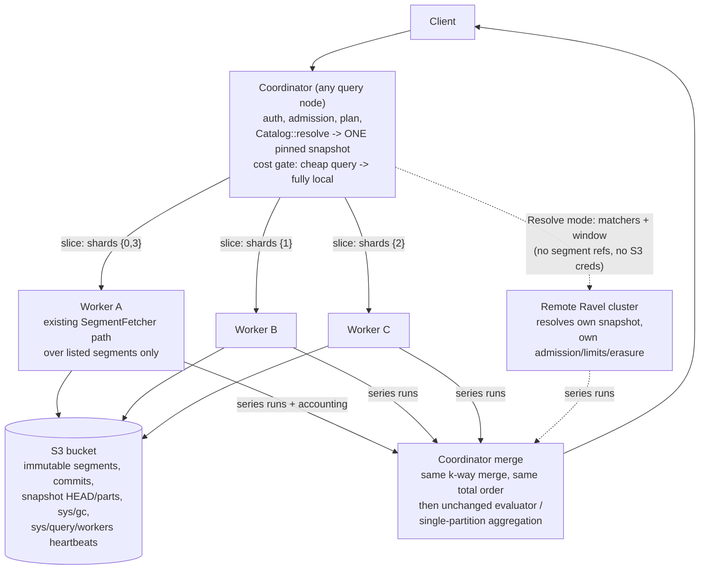
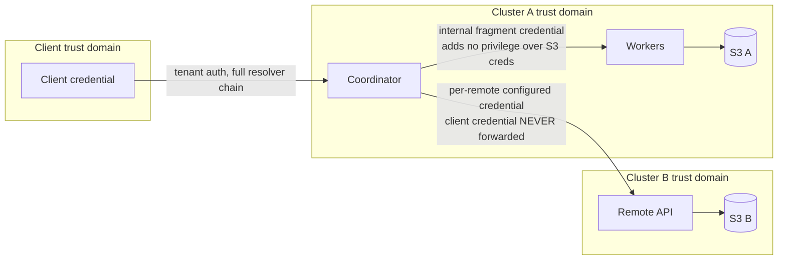
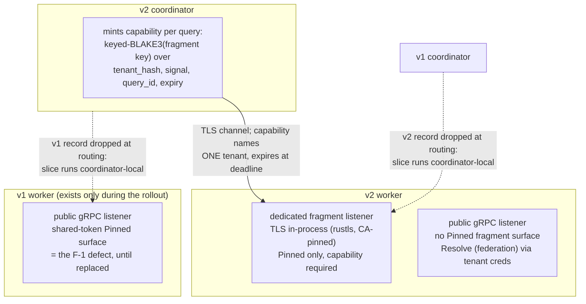

# ADR-0071: Distributed read fan-out and cross-cluster federation

Status: Accepted

## Context

Ravel's compute is stateless and disposable over an S3 source of truth. A
query executes entirely inside one process: `Catalog::resolve` pins one
immutable snapshot, a bounded fan-out fetches and decodes segments
(`fetch_concurrency`, per-fetcher GET semaphores), a lazy k-way merge dedups
under one total order, and evaluation runs materialized and sequential
(PromQL) or single-partitioned (SQL, where every DataFusion repartition knob
is deliberately off so aggregation order is bit-stable). Budgets, deadline,
accounting, and tracing are per query and explicitly threaded.

Consequences of the single-process shape:

- One node's NIC, CPU, and memory bound the largest serviceable query, even
  though the data layer imposes no such bound: any process can read any
  segment.
- There is no way to query data held by an independent Ravel deployment
  (different bucket, different trust domain) through one surface.

Everything a distributed plan needs already exists as durable metadata:
segment keys embed the ingest shard, commit records and snapshot entries
carry event-time bounds, sample/series counts, and object sizes, and the
provisioning record gives the shard domain per hour. All cross-process
coordination in the codebase today is object-store mediated (admission
reconciliation, maintain ownership by rendezvous hashing over heartbeat
keys, one CAS lease); no peer RPC exists yet.

## Decision

Two capabilities, one invariant: distribution changes where bytes are
fetched and decoded, never what the query computes.

**Intra-cluster fan-out.** The query node that receives a request is the
coordinator for that query, a per-query role, not a process type. It
resolves one pinned snapshot exactly as today, partitions the snapshot's
segment set by ingest shard into slices, and dispatches each slice to a peer
query node over an internal gRPC surface: Arrow Flight for the SQL lane
(extending `FlightInfo` to N endpoints whose tickets each carry a slice),
a protobuf `SeriesFetch` service for the PromQL lane (Arrow stays isolated
to the crates that already use it). Workers execute the existing fetch path
over only the listed segments: suffix-GET footers, verify identity, prune by
matchers, fetch and decode selected pages, apply erasure predicates,
pre-merge per slice, and stream series runs back with f64 values as raw bit
patterns. The coordinator k-way merges all slices under the existing total
order and then runs the unchanged PromQL evaluator or the unchanged
single-partition SQL aggregation. Aggregation and evaluation do not move in
v1; results are byte-identical to local execution, and a differential test
enforces that property for arbitrary partitions.

Dispatch is cost-gated: the existing pre-execution estimate decides local
versus distributed, so a cheap query runs today's path untouched. Worker
membership is a heartbeat key per process (`sys/query/workers/<id>`, same
shape as maintain heartbeats) with rendezvous hashing of
`(tenant_hash, signal, shard)` over the live set; no leader, no assignment
object, no new durable state. Rendezvous affinity also makes the per-process
content-addressed read caches behave as one aggregate cache with no
invalidation protocol, because segments are immutable.

**Cross-cluster federation.** The same fetch RPC in a second mode: instead
of segment references, the request carries matchers, a time window, and
budgets, and the remote cluster resolves its own snapshot and enforces its
own admission, limits, tenancy scheme, and erasure. Segment references and
S3 credentials never cross a trust boundary. The coordinator authenticates
to each remote with a per-remote operator-configured credential (a normal
tenant credential of that remote); client credentials are never forwarded.
Remote failures fail the query by default; a per-remote `skip_unavailable`
opt-in returns partial results marked in the response `warnings` plus a
`partial` stats block naming the skipped clusters. Intra-cluster execution
never returns partial results.

## Architecture

Slice atomicity: a slice contributes to the merge only after its terminal
summary frame arrives; partial frames from a failed attempt are discarded
whole. That rule makes re-dispatch safe with no dedup bookkeeping.

Protocol (new `proto/ravel/queryfrag.proto`, versioned from day 1,
reject-unknown like commit tokens): request carries protocol version, query
id, tenant hash, signal, scope (pinned segment identities, reconstructed and
verified by the worker per the reconstruct-don't-trust rule, or resolve-mode
matchers), matchers, padded window, budget shares, absolute deadline,
erasure predicates, and trace context. Response streams per-series frames
(labels once, then per-run timestamp deltas and value bits, preserving NaN
payloads, -0.0, and the staleness marker) and ends with a summary frame
carrying the worker's accounting snapshot and typed status. This is a
transient wire contract between processes, not a persistent format; no
stored byte changes.

## Failure semantics

- Worker unreachable or mid-stream loss: re-dispatch the slice to the next
  rendezvous worker once, then run the slice on the coordinator, then fail
  typed. Never partial.
- `SnapshotInvalidated` from any worker: one coordinator re-resolve and full
  re-dispatch, mirroring the existing single-retry rule; a second occurrence
  fails.
- `Corrupt`: fail immediately, no retry, matching local semantics.
- Budget trip on a slice or on the merged total: the same typed errors the
  local path produces.
- Deadline: the coordinator deadline (already bounded by `sys/gc`
  `max_query_duration`, which keeps every worker inside the GC protection
  horizon) cancels the fan-out; stream teardown reaches workers and the
  existing drop-based cancellation frees GETs and permits.
- Protocol version mismatch (rolling deploy): silent fallback to fully local
  execution, never an error.
- Fragment admission runs under a separate internal workload class with its
  own cap, so a coordinator holding a client-query permit can never deadlock
  waiting on fragments that need the same permit pool.
- Remote cluster down or slow: fail by default; with `skip_unavailable`,
  continue and mark, never silently.

## Security

The fragment surface accepts only a cluster-internal credential
(operator-provisioned, distributed like S3 credentials) and refuses external
identities; it conveys no privilege a process holding the bucket's S3
credentials lacks.

> **Superseded in part** for `Pinned` fetches by the amendment below
> ("Dedicated fragment listener and per-tenant fragment capabilities"):
> the shared-listener, shared-token design this section describes is the
> defect epic #1055 finding F-1 identified. `Resolve` (federation)
> authorization is unchanged. Remote endpoints come only from operator config, never
from query text. Remote responses are size- and shape-validated data; a
remote cannot escalate through the coordinator.

**Implementation note: the two credential models are one wire
type with two trust boundaries.** The `FetchRequest` carries a `Scope`. A
`Pinned` fetch is an intra-cluster slice: the worker trusts the coordinator
and uses the already-resolved `tenant_hash` on the wire directly. A
`Resolve` fetch is cross-cluster federation: the remote treats the presented
credential as an ordinary tenant credential, resolves the tenant from its
own `TenantResolver`, and overwrites (never reads) the wire `tenant_hash`,
so a federated request reaches exactly the tenants that credential
authorizes there. A remote rejects the intra-cluster fragment token
outright — it is a slice credential, never a federation credential. This
distinction is a security invariant: collapsing the two would let a
coordinator name any tenant on a remote it holds one credential for.

Partial coverage (a soft-timed-out or skipped remote, or a remote that
returned a data kind this build cannot decode, such as native histograms
across the slice boundary) is never silent. The query stats carry
`partial: true` and one warning per degraded remote, merged into the
Prometheus JSON envelope. Warnings name only the operator-facing cluster
name; remote IP:port and errno are redacted, and `RemoteClusterConfig`'s
`Debug` redacts the configured credential.

## Performance

Fetch and decode scale near-linearly in workers until coordinator-side
evaluation or final aggregation dominates; that ceiling is explicit and is
what a future aggregation-pushdown ADR would move. Network bytes to the
coordinator are matcher-pruned, window-clipped decoded samples, bounded by
the existing per-selector budgets; total S3 request count is identical to
local execution for scalar-only queries (a histogram-bearing query pays the
distributed fetch and then the local fallback fetch, with both folded into
its reported cost), and instantaneous rate is capped by
`max_parallel_slices` times the per-worker GET semaphore. Initial gate
thresholds (distribute above 256 MiB estimated store bytes or 64 segments)
are set from the crossover benchmark before defaults freeze, and every later
optimization (straggler hedging, slice rebalancing, limit hints) requires a
benchmark demonstrating its value.

## Operational model

Off by default. Enabled per query node with `--distributed-query` plus a
fragment credential file; remotes with repeatable `--remote-cluster`
config. Workers self-register by heartbeat and drain by staleness. New
`ravel_distrib_*` metrics (slices dispatched, re-dispatched, failed,
fragment admissions, bytes streamed) and a `stats.fragments[]` block in the
query stats JSON, with per-slice tracing spans nested under the existing
phase spans.

## Rejected alternatives

1. Workers resolve their own snapshots intra-cluster. N catalog resolves per
   query and N potentially different pinned snapshots; breaks
   single-snapshot isolation and multiplies LIST/HEAD cost. The coordinator
   resolves once and ships explicit segment lists, which immutability keeps
   valid for the whole horizon-protected lifetime.
2. Shipping raw page bytes to the coordinator. Moves more bytes than local
   execution fetches, and adds a hop; the entire benefit of fan-out is that
   pruning and decoding happen next to the extra NICs.
3. Aggregation pushdown in v1. The SQL engine deliberately forces
   single-partition aggregation because parallel float accumulation is not
   bit-stable, and that ban's reasoning applies unchanged to distributed
   partials. Order-insensitive operators (count, min, max, group) are a
   future, separately-decided step; sum/avg/stddev need a float-tolerance
   ADR first.
4. Coordinator reads a remote cluster's S3 directly. Requires
   cross-trust-domain S3 credentials and bypasses the remote's admission,
   tenancy hashing, and erasure filtering. The remote's API is the boundary.
5. A consensus service, shard manager, or metadata database. Nothing here
   needs agreement: slices are derived deterministically from one snapshot,
   membership is heartbeat-plus-rendezvous (a pattern already live in
   maintain), and S3 CAS covers the rest.
6. A replica concept at the query layer. S3 is the replica; any worker can
   serve any slice, so failover is re-dispatch, not replica selection.
7. Probabilistic sketches for distributed aggregation. Exactness is standing
   policy (ADR-0020, ADR-0049, ADR-0051 all reject sketches); nothing in
   this design depends on them.
8. A per-query dedicated coordinator service or scheduler tier. Any query
   node coordinates the queries it receives; a tier would add a hop and a
   failure domain without removing any work.

## Consequences

- A new internal RPC surface exists and must be operated (credential
  rotation, version-skew awareness during deploys); version fallback keeps
  skew safe.
- The coordinator remains the ceiling for high-cardinality final
  aggregation until a future pushdown ADR.
- One new crate (`ravel-fleet`) holds the heartbeat live-set and rendezvous
  logic extracted from `ravel-maintain`, which loses its private copy.
- The differential invariant (distributed equals local, bit for bit)
  becomes part of the test surface and gates every future optimization.
- No storage format, catalog format, key layout, ingest path, or GC rule
  changes. Frozen contracts are untouched; the new proto file is a
  versioned transient wire contract.

## Future extensions

Order-insensitive aggregation pushdown; a float-tolerance ADR unlocking
sum/avg pushdown; straggler hedging; segment-granular rebalancing of
oversized shards; SQL-lane federation; snapshot-handle pagination (ticket
TTL is already bounded by `protection_horizon - grace`, so the mechanism
exists).

## Amendment: dedicated fragment listener and per-tenant fragment capabilities

Epic #1055, finding F-1 (risk R7, P2). The Security section above made two
claims that the adversarial review showed compose into a fleet-wide
cross-tenant read credential. This ADR said:

> The fragment surface accepts only a cluster-internal credential
> (operator-provisioned, distributed like S3 credentials) and refuses
> external identities; it conveys no privilege a process holding the
> bucket's S3 credentials lacks.

and, in the implementation note:

> A `Pinned` fetch is an intra-cluster slice: the worker trusts the
> coordinator and uses the already-resolved `tenant_hash` on the wire
> directly.

As shipped, the `SeriesFetch` service registers on the same gRPC listener
as the public OTLP and Flight SQL surfaces
(`services/ravel-server/src/lib.rs`, gRPC server assembly), so the fragment
surface is reachable on the public gRPC port. Its credential is one shared
bearer token (`services/ravel-server/src/distrib.rs`). Any holder of that
token who can reach that port can set any `tenant_hash` in a `Pinned`
`FetchRequest` and a worker will execute it: one leaked token grants read
access to every tenant.

The "no privilege beyond S3 credentials" claim is true of a compromised
*process* but was silently extended to the *token*, and the token's exposure
surface is much wider: it travels on every fragment request, in cleartext
gRPC metadata, on a public port, and sits in operator config on every query
node. The review's exit criterion, verbatim: "Fragment surface moved to a
genuinely separate listener with TLS and per-tenant (not master) fragment
authorization." This amendment decides how.

### 1. A dedicated fragment listener, terminating TLS in-process

`Pinned` fragment fetches move to a dedicated listener
(`--fragment-listener <addr>`, a fourth listener alongside HTTP, public
gRPC, and the mTLS client listener). The public gRPC listener no longer
registers any `Pinned`-serving fragment surface; the dedicated listener
serves `Pinned` only and rejects `Resolve` outright. Startup refuses a
`--fragment-listener` address equal to any other listener's, the same
misconfiguration refusal ADR-0050 section 1 applies to the mTLS listener:
"genuinely separate" must hold by construction, not by operator care. Federation is
unchanged: `Resolve` requests keep arriving on the public surface with
ordinary tenant credentials of the serving cluster, exactly as the
implementation note above already requires.

The dedicated listener terminates TLS in-process. This is Ravel's first
in-process TLS termination, and that is a deliberate departure worth
stating plainly: ADR-0050 established that Ravel terminates no TLS and
delegates client mTLS to an external proxy. That decision stands, because
it governs something else. ADR-0050's rejected alternative 2 declined to
parse *client certificate identity* in-process ("a second, weaker parser
of certificate identity"); here no identity is ever parsed from a
certificate. TLS on the fragment listener provides channel
confidentiality and integrity (capabilities travel on it) and server
authenticity (a coordinator knows it dialed a real cluster worker, not an
interceptor that could harvest capabilities); authorization is carried by
the capability, never the certificate. And the proxy delegation has no
analog on a worker-to-worker hop: requiring a TLS side-car in front of
every worker would hand the isolation invariant back to deployment
hygiene, which is exactly what ADR-0050 section 1 exists to avoid
("by construction, not by proxy hygiene").

Mechanism: tonic 0.14's rustls-based TLS support (the `tls-aws-lc`
feature), i.e. rustls 0.23 on the aws-lc-rs backend. Both are already in
the workspace dependency graph (rustls via `reqwest`/`hyper-rustls` under
`ravel-object-store`, and via kube's `rustls-tls`; aws-lc-rs under
`jsonwebtoken`). No new TLS stack enters the tree; this turns on a feature
of a dependency we already ship.

Certificate provisioning: operator-provided PEM files
(`--fragment-tls-cert`, `--fragment-tls-key`, and `--fragment-tls-ca` for
the coordinator's client side), minted outside Ravel. Ravel never
generates certificates or keys, matching the ADR-0055/0072 stance that
Ravel expresses externally minted credentials and mints nothing. On
Kubernetes the operator wires a Secret (cert-manager-issued or
hand-provisioned) into these paths; elsewhere the operator runs a
cluster-internal CA by hand. Coordinators verify workers against the
pinned CA with one fixed expected server name (`ravel-fragment`,
carried as a dNSName SAN in every worker certificate): the CA is
dedicated to this surface, so any certificate it signed means "a fragment
worker of this cluster", and per-process certificate identity is
deliberately not required (the capability, not the certificate, is the
authorization). Certificates are read at startup; rotation is a rolling
restart, which cluster-internal CA lifetimes make an operator-scheduled
event. Live reload is a future deliverable if operational need shows.

### 2. Per-tenant, per-query fragment capabilities replace the shared token

The bearer token on `Pinned` fetches is replaced by a fragment capability:
a MAC-authenticated claim set naming exactly what it authorizes.

- Claims (fixed-width canonical encoding, transient, never stored):
  capability version, `tenant_hash` (16 bytes), signal, `query_id`
  (16 bytes), and `expires_unix_ns`.
- MAC: keyed BLAKE3 over the claims (BLAKE3 is already the workspace's
  content-hash primitive; its keyed mode is a MAC). The key is a 32-byte
  cluster fragment key from an operator-provisioned file
  (`--fragment-key-file`), replacing the shared-token file in the same
  distribution slot. The file holds a short list of keys: the first
  mints, all verify, so key rotation needs no flag day.
- Mint: the coordinator mints one capability per query (a query has
  exactly one tenant), sets `expires_unix_ns` to the query's absolute
  deadline, and attaches it to every slice of that query, including
  re-dispatches. Coordinator-local fallback needs no capability.
- Verify, worker side, stateless: recompute the MAC (compared with the
  existing `constant_time_eq`), check expiry against the injected clock,
  and require the request's `tenant_hash`, signal, and `query_id` to
  equal the claims. No store read, no cache, no coordination, no new
  durable state: object storage remains the only durable backend and is
  untouched. Expiry reuses the deadline the protocol already enforces
  cluster-wide, so no new clock-synchronization assumption is introduced.
- Rejects are typed and counted (`ravel_distrib_*` gains a
  capability-reject counter with a closed reason label: missing, bad MAC,
  expired, tenant mismatch, query mismatch).

What this buys, stated honestly. The credential that travels on the wire,
appears in captures, and can leak from a single request now names one
tenant and one query and dies at the deadline; the long-lived secret (the
mint key) never transits the network at all. The mint key itself remains
cluster-internal: any process holding it can mint capabilities for any
tenant. That is not a weakness this surface can remove, and this amendment
does not claim to remove it: a process positioned to hold the mint key
also holds the Query-role S3 credential and can read every tenant's
segments directly, so process compromise was and remains outside the
fragment surface's threat scope. It is governed by ADR-0072's key-custody
posture (KMS grants), not by fragment authorization. The exit criterion is
met at the layer it names: what a fragment server *accepts* is per-tenant,
never master.

### Why this is not the per-tenant credential ADR-0072 rejected

ADR-0072 rejected per-tenant *data-plane storage credentials*
(STS-per-tenant) on three findings, none of which hold here:

1. *"Every process still needs a tenant-agnostic credential"* for tenant
   discovery, `sys/*`, and fleet admission, so per-tenant storage
   credentials would be additive plumbing that removes no grant. The
   fragment surface is the opposite case: there is no tenant-agnostic
   fragment operation. Every `Pinned` fetch names exactly one
   `tenant_hash`, so a per-tenant capability *replaces* the master
   credential outright; no shared read credential survives on this
   surface.
2. *A mint/refresh lifecycle Ravel has no machinery for.* The capability
   lifecycle is degenerate: minted per query from a key the coordinator
   already holds, sent once, expired at the query deadline, never stored,
   never refreshed, never individually revoked (revocation is key
   rotation, the same operational motion the shared token already
   required).
3. *KMS key custody achieves the isolation with existing machinery.*
   There is no KMS analog for an RPC surface; the cheap alternative that
   won in ADR-0072 does not exist here.

ADR-0072's rejection stands, unmodified, for storage credentials. This
amendment scopes an RPC-layer authorization credential, one layer above
storage IAM, in the one place where per-tenant scoping subtracts a master
credential instead of adding plumbing beside one.

### 3. Protocol version 2 and the mixed-version fleet

`queryfrag` `PROTOCOL_VERSION` moves 1 -> 2
(`crates/ravel-query/src/distrib/codec.rs`). `FetchRequest` gains
`bytes fragment_capability = 14`: an additive field number on a transient
wire contract, exactly the evolution the proto file's own header
sanctions. **No frozen persistent format changes.** The RSEG layout,
commit tokens, key layout, and every stored byte are untouched;
`queryfrag.proto` is the versioned transient contract this ADR already
declared it to be, and this is an additive field plus a version-number
bump, not a proto rewrite.

`QueryWorkerRecord` keeps its schema: `protocol_version` now reads 2 and
`fragment_endpoint` now names the dedicated TLS listener address. The
record is transient heartbeat state with a version field designed for
exactly this.

Rolling deploy behavior, both directions, using the version-skew rule this
ADR already shipped (a skewed worker is dropped at routing time, costing
zero round trips, falling back to coordinator-local execution):

- A v2 coordinator drops v1 worker records; those slices run locally.
- A v1 coordinator drops v2 worker records; those slices run locally.
- Results stay byte-identical in every mix (the differential invariant is
  indifferent to where slices run). The degradation during rollout is
  parallelism, never correctness and never availability.

The security window, plainly: a node running the old binary keeps serving
the shared-token fragment surface on its public gRPC port until that node
is replaced. The v2 binary does not register the old surface and does not
accept the old token anywhere, so there is no dual-stack period and no
second flag-flip: the vulnerable surface disappears node by node and is
gone when the rollout completes. The window is therefore exactly one
rolling deploy. Two mitigations shrink it further, and both are ordered
into the rollout:

1. Rotate the shared token immediately before starting the rollout. Any
   token leaked before that moment is then already dead; exploiting the
   window requires a token leaked *during* the rollout itself. (Token
   rotation is itself a rolling restart of the v1 fleet; the sequence is
   two rolls, not one, and both are bounded.)
2. Land the H-1 NetworkPolicy (epic #1055, restricting fragment-port
   reachability to cluster peers) before the rollout, so network reach,
   the second precondition of R7, is already withdrawn from
   outside-cluster holders.

Residual risk during the window is R7 with a fresh token and restricted
reach, for the duration of one deploy: accepted.

### Verification

The review's experiment becomes a permanent test, not a one-time probe:

- Cross-tenant rejection: a capability minted for tenant A presented on a
  `Pinned` fetch naming tenant B is rejected before any snapshot resolve
  (asserted via store-operation counters, per the FaultStore/counter
  discipline).
- Expiry: a capability past `expires_unix_ns` is rejected.
- Tampering: any flipped byte in claims or MAC is rejected.
- Surface split: the public listener rejects `Pinned` scope outright,
  valid capability or not; the dedicated listener rejects `Resolve`. The
  existing federation-rejects-the-fragment-token invariant test evolves
  into federation-rejects-a-fragment-capability.
- End to end: `distributed_query_e2e` runs over the real TLS listener
  with a test CA, and the distributed-equals-local byte-identity
  invariant is unchanged.
- Skew: the routing-time drop is asserted for a v1 record under a v2
  coordinator (extending the existing version-skew test).

### Configuration surface (named here, dispatched later)

`--fragment-listener`, `--fragment-tls-cert`, `--fragment-tls-key`,
`--fragment-tls-ca`, `--fragment-key-file`; the v1 shared-token flag is
removed with the v2 surface. These touch `services/ravel-server/src/config.rs`,
which has concurrent in-flight work as of this amendment; implementation
of this section sequences after that work lands and is not part of any
task dispatched alongside this amendment's approval. The same
implementation commit updates `docs/guides/operations.md` with the
fragment CA and key-file provisioning story, next to the existing IAM and
KMS templates, per the doc-currency rule.

### Amendment-adjacent fixes that need no ADR

Two epic #1055 items are deliberately *not* gated on this amendment,
because they decide nothing architectural; they are recorded here only so
the epic's scope reads in one place:

- `crates/ravel-query/src/http/tenant.rs` line 51:
  `StaticBearerTokenResolver` resolves by `HashMap` lookup keyed on the
  raw token, whose string equality short-circuits on the first differing
  byte. It becomes a constant-time lookup (digest-keyed or
  constant-time-scan; implementer's choice). The fragment token's own
  check is already constant-time.
- R10, the tenant-triggerable OTAP arrow-decode panic: mitigation is a
  `catch_unwind` boundary inside `crates/ravel-otap` mapping any decode
  panic to the crate's typed error, keeping `services/ravel-server`
  unedited. Independent of F-1 entirely.

### Rejected alternatives (amendment)

1. **Per-worker mTLS client certificates as the authorization.**
   Certificates identify processes, not tenants; a tenant-scoping
   mechanism would still be needed on top, and parsing authorization out
   of certificate identity is what ADR-0050 declined. Client
   certificates remain available as future defense-in-depth *under*
   capabilities, not instead of them.
2. **Asymmetric capability signatures (Ed25519).** Any query node can
   coordinate, so every node would hold the private key; against the
   in-scope threat (wire, log, and config leakage, not process
   compromise) asymmetry buys nothing over a keyed MAC, and it adds a
   signing dependency and key-format surface. Revisit only if a
   dedicated-coordinator tier (rejected alternative 8 above) ever
   changes who mints.
3. **Long-lived per-tenant fragment tokens** (in `sys/auth` or a new
   object). Durable per-tenant credential state plus a mint/refresh
   lifecycle: the exact machinery ADR-0072 declined to build, and it
   would put a control-plane read on the fragment hot path.
4. **A TLS side-car or proxy per worker instead of in-process TLS.**
   Externalizes the isolation invariant to deployment hygiene;
   contradicts both the exit criterion ("genuinely separate listener
   with TLS") and ADR-0050's by-construction principle.
5. **Binding the capability to the slice's exact segment set.** Adds a
   canonical segment-list encoding and breaks capability reuse across
   re-dispatch, to constrain reads *within* one tenant's own data. The
   isolation boundary is the tenant; no cross-tenant exposure is
   removed, so the complexity buys nothing this finding needs.
6. **Keeping the shared listener and only scoping the token.** Fails the
   exit criterion, and keeps the internal surface's exposure and
   availability coupled to the public port (a public-surface incident
   reaches intra-cluster reads, and the fragment port cannot get a
   NetworkPolicy stricter than the public one).

### Consequences (amendment)

- Ravel terminates TLS in-process for the first time, on one
  cluster-internal listener, with rustls already in the tree; ADR-0050's
  external-proxy posture for client mTLS is unchanged.
- The fragment wire credential is per-tenant and expiring; the master
  credential class on this surface no longer exists. The mint key is the
  surface's trust root and its custody sits with the same operator
  posture as S3 credentials (ADR-0072).
- One rolling deploy of exposure window, mitigated by pre-rollout token
  rotation and the H-1 NetworkPolicy, then the old surface is gone.
- Operators gain a certificate lifecycle (CA, worker certs, rolling
  restart on rotation) for one internal listener.
- No frozen persistent format changes; `queryfrag` evolves additively
  under its version field, as designed.

## Amendment: partial results are consent-gated and envelope-visible

Status: Accepted. Epic #1063. Amends the response-contract halves of two
sentences above: the Decision's "a per-remote `skip_unavailable` opt-in
returns partial results marked in the response `warnings` plus a `partial`
stats block", and the Security section's "The query stats carry
`partial: true` and one warning per degraded remote." Which remotes MAY be
skipped, and the redaction rules for what a warning may name, are unchanged;
what a skipped remote does to the response is re-decided here.

### Context

Adversarial review of the shipped fan-out found that a partial federated
result is an HTTP 200 whose only incompleteness signals are prose strings in
`warnings` and a `partial: true` flag nested inside `data.stats`. A client
that reads `status` and `data` and nothing else - which is every naive
programmatic consumer - takes an incomplete answer as complete, with no
visible sign it is wrong. `skip_unavailable` exists precisely so operators
can opt into partial answers, which makes the honest signal matter more,
not less.

The defect is not hypothetical; this repository contains it. The alert
evaluator (`services/ravel-server/src/alerting.rs`, `run_query`) evaluates
PromQL rules through `QueryEngine::instant`, whose signature is
`Result<Value, QueryError>`: the stats and annotations that carry the
partial flag are discarded inside the engine's own convenience wrapper
(`crates/ravel-query/src/engine.rs`). An alert rule can fire, or worse
resolve, on a partial federated answer, and no signal that the coverage was
incomplete is even reachable from the alerting code. Warnings in the
response body cannot help a caller that never sees a response body.

The same review scope found the marker is not even uniform on the HTTP
surface: `/api/v1/labels`, `/api/v1/label/{name}/values`, and
`/api/v1/series` resolve series through the same federation fan-out and
forward its
warnings, but carry no partial marker at all - their envelopes have no
stats block to bury one in (`crates/ravel-query/src/http/handlers.rs`).

### Decision

1. **Partial coverage is a query error unless the client opted in.** A
   request that would produce partial coverage (any case the Security
   section enumerates: skipped remote, soft-timed-out remote, undecodable
   remote data kind) fails with the existing typed `unavailable` error -
   HTTP 503, `errorType: "unavailable"`, the mapping already in
   `crates/ravel-query/src/http/error.rs` - unless the request carries
   `allow_partial=true`. The error message names the degraded clusters
   (operator-facing names only, same redaction as warnings) and names the
   `allow_partial` parameter so the remedy is in the failure itself.
2. **An opted-in partial response is HTTP 200 with a required top-level
   `partial` field.** The field is a sibling of `status`/`data`/`warnings`,
   present on every response of the endpoints below - `false` on complete
   coverage, `true` on partial - so generated clients and strict
   deserializers cannot model the envelope without it. The `data.stats`
   copy and the merged `warnings` stay as they are.
3. **The contract is uniform across the read surface.** `/api/v1/query`,
   `/api/v1/query_range`, `/api/v1/labels`,
   `/api/v1/label/{name}/values`, and `/api/v1/series` all gate on
   `allow_partial` and all carry the top-level `partial` field.
   Intra-cluster execution still never returns
   partial results, and the SQL lane has no federation, so nothing changes
   there.
4. **The engine API cannot hand a caller a value without its coverage.**
   `ravel-query` gains a `#[must_use]` `Coverage` type
   (`Complete | Partial { skipped }`), and the bare convenience wrappers
   (`instant`, `range`, `resolve_series`) change signature to return
   their result paired with its `Coverage`. No public entry point returns a
   result that compiles away its coverage; a caller that wants to ignore
   it must write that decision down where review can see it. The
   stats-carrying variants are unchanged and remain the source for the
   wire rendering.
5. **The alert evaluator treats partial coverage as a failed evaluation.**
   Wiring the new signature into `alerting.rs` is in this amendment's
   implementation scope: `Coverage::Partial` takes the existing per-rule
   failure path (log, count `rules_failed`, keep prior state, retry next
   tick), so no transition record is ever written from partial data. Any
   richer policy - a per-rule opt-in to evaluate on partial coverage -
   belongs to epic #1052, which owns alerting; this amendment only
   guarantees the safe default and makes the signal reachable.

### Grafana compatibility

ADR-0039's constraint is the deciding factor and was checked, not assumed.
206 Partial Content is rejected: RFC 9110 defines it as the response to a
Range request and requires `Content-Range`, no Prometheus-flavor server
returns it so client handling is untested across the ecosystem, and it
fails both audiences at once - a client that hard-fails on non-200 loses
graceful degradation, while a client that never checks the status is still
fooled by the body. Mutating the envelope's `status` value (a `"partial"`
status) is rejected for breaking every client that checks
`status == "success"`, Grafana included. An unconditional 200 with only a
more prominent field is rejected because it fails this epic's acceptance
test: a client ignoring warnings and ignoring the new field still mistakes
partial for complete.

Consent-gating keeps the Grafana path whole. Grafana's Prometheus
datasource supports per-datasource custom query parameters; an operator
who wants dashboards to degrade gracefully sets `allow_partial=true` there
once, and Grafana gets exactly today's behavior: 200, rendered data, the
warning banner from `warnings`. Every consumer that never asked - alert
jobs, billing scripts, generated SDKs - fails safe with a typed 503. This
is the repository invariant applied to the wire: exact semantics by
default, approximation opt-in and visible.

This is a behavior change for deployments already using `skip_unavailable`
without the parameter. Accepted deliberately: distributed reads are off by
default, `skip_unavailable` is a per-remote opt-in on a surface that just
shipped, and the cost of changing this contract only grows.

### Out of scope

- The fragment surface's listener, transport encryption, and credential
  model: a separate amendment to this ADR (epic #1055) owns those; this
  amendment neither depends on nor constrains it.
- The `--remote-cluster` federation TLS default (currently off). Flipping
  it is federation transport hardening, not response honesty; it was
  bundled into epic #1063 but belongs with #1055's transport work, and
  this amendment recommends re-homing it there rather than deciding it
  here.
- The dead-endpoint ranking window after mass worker death (epic #1063's
  P3 item): a recovery-latency tuning, no response-contract impact, stays
  a separate task.
- Per-rule partial-coverage policy in alerting: epic #1052, as decided
  above.

### Consequences

- A naive client can no longer receive an incomplete answer shaped as a
  complete one; the acceptance test asserts it verbatim: a client which
  ignores warnings cannot mistake partial for complete.
- The metadata endpoints gain the marker they were missing, so the
  contract has no second-class endpoints.
- The engine's bare wrappers change signature; every in-repo caller is
  found by the compiler, which is the point.
- Complete-coverage responses gain one additive top-level field
  (`partial: false`), which unknown-field-tolerant Prometheus clients
  ignore; no other wire shape changes, and no persistent format is
  touched.
