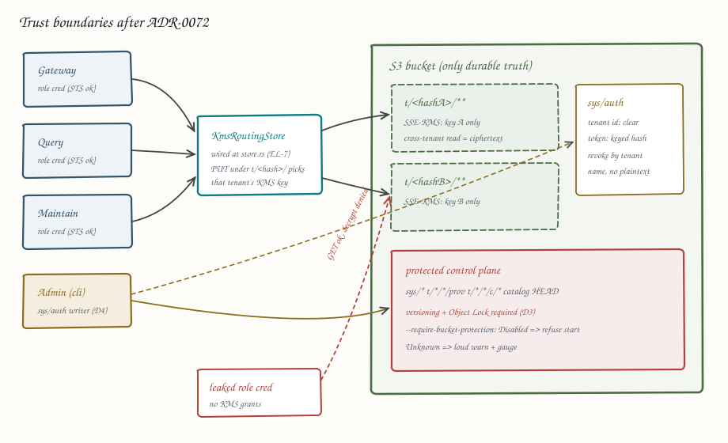

# ADR-0072: Tenant-scoped credentials and control-plane write protection

Status: accepted
Date: 2026-08-12
Refs: #455 (epic EE, per-tenant half), #875, adversarial review v2 findings
S4-03 (residual), NF-1, NF-10

## Context

ADR-0055 scoped storage credentials per role (Gateway / Query / Maintain /
Admin), enforced at the S3/MinIO IAM layer. That closed the "one
credential does everything" finding for processes, but the per-tenant
half of epic EE (#455) was never designed: a leaked Maintain-role
credential can still read every tenant's objects, and any credential
with write access to `sys/*` or `t/<hash>/<sig>/prov` can roll back or
destroy control-plane state (findings NF-1, NF-10). Both adversarial
reviews name the shared-credential blast radius as the top surviving
reason Ravel is not approved for hostile multi-tenant deployments.

Three facts discovered while researching this ADR constrain the design:

1. **A per-tenant data-plane credential cannot replace the role
   credential.** Tenant discovery is one `list_delimited("t/")` from
   Maintain, Gateway and Query (`crates/ravel-maintain/src/discover.rs`),
   fleet query admission lives at bucket root (`admission/query/<pid>`),
   and `sys/*` is read by every role. Every process needs a
   tenant-agnostic credential no matter what; per-tenant credentials
   would be additive plumbing on top, with a per-tenant mint/refresh
   lifecycle Ravel has no machinery for. `S3Config` cannot even express
   a temporary credential today: it has no session-token field.
2. **Cryptographic scoping already has a designed, unwired mechanism.**
   ADR-0062's `KmsRoutingStore` routes tenant-prefixed PUTs to
   per-tenant SSE-KMS keys. Once wired (EL-7, #764), a role credential
   without `kms:Decrypt` on a tenant's key cannot read that tenant's
   plaintext even though S3 `GetObject` succeeds at the IAM layer. That
   converts the cross-tenant-read blast radius from "every tenant's
   data" to "ciphertext plus metadata" without any credential
   lifecycle machinery.
3. **In-process WORM enforcement is impossible on the current store
   trait.** `object_store` 0.14 exposes no Object Lock or versioning
   API, and opening a direct-SDK side channel was explicitly rejected
   by ADR-0042/ADR-0055. The conformance probe
   (`crates/ravel-object-store/src/conformance.rs`) can report
   Enabled / Disabled / Unknown, and today it is informational only:
   a bucket with no Object Lock and no versioning boots cleanly, and
   `sys/tenancy` deletion bricks the deployment (NF-10).

Two defects found in the shipped artifacts fold into this ADR's scope
because fixing them changes the same templates and docs:

- The ADR-0055 IAM policy templates in `docs/guides/operations.md`
  condition `s3:ListBucket` on prefixes like `t/*/*/l0/*`. Under AWS
  `StringLike`, a delimited listing of the bare `t/` prefix (tenant
  discovery) matches none of them: applying the shipped Gateway, Query,
  or Maintain policy verbatim breaks tenant discovery, fold, and cache
  warm. Nothing tests the templates.
- ADR-0062 section 2d writes the audit prefix as `t/<hash>/u/0/**`;
  real audit keys are `t/<hash>/u/<l0|c|l1>/<shard:04>/...`. An IAM
  prefix transcribed from the ADR matches nothing.

Separately, #875 reported operator token revocation lost across
restarts. The code says the premise is narrower and worse: `sys/auth`
(the durable token map from EM-T7) has **no writer in any shipped
binary** -- `upsert_token` / `remove_token` have zero production
callers, the operator does not depend on `ravel-catalog`, and
operator-managed deployments hardcode the unkeyed tenant hash, which
disables the durable resolver entirely. Revocation cannot be "lost";
it never durably happens.

## Decision

Tenant isolation becomes cryptographic; control-plane protection
becomes a startup-checked bucket contract; the durable auth map gets an
owner and a revoke-by-tenant primitive; the shipped IAM templates get
fixed and tested. Per-tenant *data-plane credentials* are rejected.

### 1. `S3Config` learns temporary credentials

`S3Config` gains `session_token: Option<String>` (env
`RAVEL_S3_SESSION_TOKEN`, flag `--s3-session-token`), passed through to
the S3 client, plus optional `credentials_file: Option<PathBuf>`
(`--s3-credentials-file`): a JSON file holding
`{access_key_id, secret_access_key, session_token}` re-read when it
changes on disk, so an external process (Kubernetes secret rotation, an
STS sidecar, IRSA-style mounting) can rotate short-lived role
credentials without a restart. Ravel itself never calls STS: the
rejected credential-broker stance of ADR-0055 stands. This decision
only makes externally minted short-lived credentials expressible.

### 2. Per-tenant isolation is delivered by key custody, not credentials

EL-7 (#764) wires `KmsRoutingStore` into the single store construction
site (`services/ravel-server/src/store.rs`) behind
`--tenant-kms-config`, with epoch-0 bootstrap per
`crates/ravel-catalog/src/key_epoch.rs`. This ADR adds the posture
statement EL-7 amends the guides with: in a hostile multi-tenant
deployment, each tenant's KMS key policy grants decrypt to the Ravel
role principals only for that deployment, so a leaked role credential
alone yields ciphertext; compromise requires the credential *and* KMS
grants. The operations guide gains the corresponding key-policy
template next to the IAM role templates.

### 3. Bucket protection contract, checked fail-closed at startup

`docs/object-store-contract.md` gains a normative "Required bucket
configuration" section (absorbing ADR-0064 section 7): versioning
guidance, the two sanctioned lifecycle rules, and Object Lock
(compliance mode, per-key-class retention guidance) on the protected
prefixes -- `sys/*`, `t/*/*/prov`, commit records `t/*/*/c/*`, and
`t/*/catalog/*/*` HEAD history.

`ravel-server` gains `--require-bucket-protection` (default off for
compatibility; the operator sets it for production profiles). At
startup the existing probes run; `ObjectLockStatus::Disabled` or a
versioning misconfiguration is then fatal, `Unknown` (a backend whose
probe cannot answer, e.g. plain MinIO without lock support) logs a
single loud warning and sets `ravel_bucket_protection_unknown 1` so
fleets alarm on it. Enforcement stays at the bucket/IAM layer per
ADR-0042; this decision makes silently unprotected production
deployments impossible, not lock semantics in-process.

### 4. `sys/auth` gets an owner; revocation gets a durable primitive

- `ravel-catalog` gains `remove_tokens_by_tenant(tenant_id)` (and a
  `replace_tenant_tokens` companion) so revocation needs no plaintext:
  entries carry the tenant ID in the clear, only the token is a keyed
  hash (#875's requested primitive).
- `ravel-cli` gains `tenant token upsert|revoke|list` (Admin role),
  making the CLI the first shipped writer of `sys/auth`.
- `services/ravel-operator` takes a `ravel-catalog` dependency and
  reconciles `sys/auth` from the CRD token Secret: upsert on new
  values, `remove_tokens_by_tenant` for tenants absent from the Secret.
  Because removal is by tenant name, it is correct after an operator
  restart with no in-memory history. The operator also stops
  hardcoding `--tenant-hash-unkeyed` when the CRD carries a deployment
  key, so `DurableBearerResolver` actually constructs on managed
  clusters (prerequisite for any of this to matter; EM-T10 #773 covers
  the migration story).

### 5. Fix and test the shipped IAM templates

`operations.md` templates get corrected so every role that performs
tenant discovery may list the bare `t/` prefix (delimited, keys never
readable beyond the role's read grants), and the ADR-0062 audit-prefix
misstatement is corrected in place with an amendment note. A new test
target validates the JSON templates structurally: every prefix pattern
in the policies must match at least one key shape produced by
`ravel-commit`'s key constructors, and the discovery listing must be
admitted for Gateway, Query, and Maintain -- so a template edit that
breaks a real key shape fails CI instead of a production deployment.

## Rejected alternatives

- **Per-tenant data-plane credentials (STS-per-tenant).** Every process
  still needs a tenant-agnostic credential for discovery, `sys/*`, and
  admission (facts above), so per-tenant credentials add a mint/refresh/
  cache lifecycle and a second failure mode on every request path while
  removing no required grant from the role credential. Decision 2
  achieves the isolation goal (leaked role credential cannot read
  cross-tenant plaintext) with machinery that already exists.
- **In-process authorization layer.** Re-rejected per ADR-0055: it
  guards only compromised-credential-outside-Ravel paths when the IAM
  layer already does, and it cannot guard a compromised process.
- **Direct-SDK Object Lock side channel.** Re-rejected per ADR-0042:
  it forks the store abstraction for one call. The probe + fail-closed
  flag reaches the same operational outcome (no silently unprotected
  fleet) without it.
- **Operator-side plaintext token cache made durable** (a literal
  reading of #875): persists secrets the design deliberately never
  persists; revoke-by-tenant needs no plaintext at all.

## Consequences

- A leaked single-role credential in a KMS-routed deployment yields
  ciphertext for other tenants' data objects; control-plane rollback
  and deletion require defeating bucket versioning/Object Lock, which
  `--require-bucket-protection` guarantees is configured on fleets
  that opt in. The residual risk is a leaked Admin credential plus KMS
  grants, which is the platform-operator trust boundary, not a Ravel
  one.
- Revocation becomes durable and restart-safe on operator-managed
  clusters; the static `--tenant-token` path keeps its documented
  reconcile-latency window (up to 300 s).
- `MemoryStore`/`FaultStore` and MinIO-without-lock deployments run
  unchanged (probe answers Unknown; flag stays off in dev profiles).
- The IAM templates become tested artifacts; future key-layout changes
  that invalidate a policy prefix fail CI.
- Deliberately out of scope: per-tenant credentials (rejected), rekey
  migration for legacy unkeyed-hash buckets (tracked separately),
  audit-log export off-bucket.
