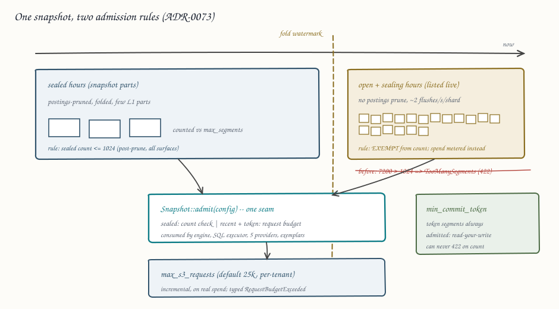

# ADR-0073: Recent-hours read path

Status: accepted
Date: 2026-08-12
Refs: #658, adversarial review finding S1-13 (v1 section 6, v2 section L
experiment 10)

## Context

A query's pinned snapshot is capped at `max_segments` (default 1024),
checked as a single scalar over the whole snapshot after resolve
(`crates/ravel-query/src/engine.rs`). Sealed hours below the fold
watermark are served from snapshot parts and pruned by name postings
before they count. Hours above the watermark are listed live, are
never postings-pruned, and every L0 flush object counts. The ingest
flush trigger is time-based (500 ms age, ADR-0067), so a tenant above
~0.28 sealed segments/second/shard fills the cap inside the open hour:
about 7,200 segments/shard-hour at full cadence against a cap of 1024.
Compaction relieves an hour only after seal margin (65 min) plus a
maintain tick, so the newest one to two hours of a hot tenant are
unqueryable exactly when an operator debugging an incident needs them.
ADR-0063 raised the fold ceiling and explicitly disclaimed this cliff;
ADR-0071 distributes fetch but resolves and cap-checks the whole
snapshot on the coordinator first, so it does not lift it either.

Two aggravations make this worse than a sizing bug:

- The cap is enforced at eight sites that count different things
  (whole snapshot in the PromQL engine, SQL executor, and exemplars
  state; the post-prune set in the five SQL table providers), so
  identical data can pass in one language and 422 in the other.
- `resolve_min_token` inserts the token's segments into the same
  counted map, so a client that just wrote with strict ack and passes
  its own commit token can still get `TooManySegments`: a durable,
  explicitly referenced write is unreadable. That contradicts the
  spirit of the read-your-write contract in docs/consistency-model.md,
  which promises the referenced commit or a typed `unsatisfiable
  token`, never a fan-out error.

The failure is honest today (fails closed, no wrong data), and the
recent-hour cost profile is request-dominated, not byte-dominated: the
phase-5 gate measurement attributes 97.6% of a selective query's
requests to per-candidate-segment suffix GETs, and small L0 objects
cost exactly one GET each under the whole-object threshold. A fix must
keep exactness and fail-closed behavior while converting "count
exceeded, refuse" into "spend bounded, serve".

## Decision

Recent hours stop counting against `max_segments`; their cost is
governed by an explicit per-query S3 request budget instead. One
enforcement seam replaces the eight divergent checks. Nothing about
visibility, ordering, or erasure changes.

### 1. The snapshot knows which segments are recent

`Snapshot` carries a per-segment origin already implied by resolve:
sealed-below-watermark (extracted from snapshot parts, postings-pruned)
versus recent (listed above the watermark, or resolved from an explicit
`min_commit_token`). Resolve records the split (two counters and a flag
on each `SegmentRef`); no persistent format changes -- `Snapshot` is an
in-memory type.

### 2. `max_segments` governs only the sealed set

The cap keeps its meaning -- a guard against unfolded metadata blowups
and pathological matchers over history -- but applies to the sealed,
prunable set only. Recent segments and token-resolved segments are
exempt: read-your-write can no longer 422 on count, closing the
contradiction above.

### 3. A per-query S3 request budget bounds what the exemption can spend

`EngineConfig` gains `max_s3_requests` (default 25,000; per-tenant
override in `QueryLimits` beside `max_bytes_scanned`, ADR-0061
machinery). `QueryAccounting::total_s3_requests()` already counts every
store operation a query issues; enforcement is an incremental
comparison at the same points the bytes-scanned budget already checks,
producing a typed `RequestBudgetExceeded` (HTTP 422, same class as the
other budget errors). The default admits the worst legitimate open hour
(~7,200 GETs per shard-hour plus resolve and sealed fetch) with
headroom, while bounding a runaway query to a knowable spend. Unlike
the count cap, the budget trips on actual spend, not on a pre-fetch
estimate, so cheap-but-many-segment queries (highly selective matchers
over many small objects) succeed if they stay under budget.

### 4. One enforcement seam, all surfaces

A single helper on the snapshot (`Snapshot::admit(&EngineConfig) ->
Result<SegmentAdmission, _>`) computes the sealed-set count check and
carries the request budget, and all eight sites consume it: PromQL
engine, SQL executor, the five SQL providers, and the exemplars state.
The PromQL/SQL asymmetry (pre- versus post-prune counting) collapses
into one definition: the sealed count is post-prune everywhere. SQL
surfaces get the same recent-hour exemption and the same budget.

### 5. What does not change

The open-hour listing stays listing-immediate: no caching, batching, or
deferral of the above-watermark LIST, so the consistency model's
zero-staleness claim for recent commits is untouched. Erasure
predicates attach at resolve exactly as before and apply to recent
segments. The mixed-level total order and query-time dedup are
untouched: this ADR changes which segments are *admitted*, never how
they merge. Distribution (ADR-0071) composes: slices carry recent
segments like any others, and the request budget folds worker spend
through the existing accounting merge.

## Rejected alternatives

- **Raise `max_segments`.** Converts a fast 422 into a 30 s deadline
  timeout plus unbounded S3 spend; no per-tenant control; still fails
  the read-your-write case at the next ceiling.
- **Bytes-scanned budget as the recent-hour governor.** The open hour
  is request-dominated (97.6% of requests are per-segment GETs on
  small objects); a byte budget barely moves while request spend
  explodes. The bytes budget stays, the request budget is the
  discriminating control.
- **A read-side L0.5 merge artifact (pre-compaction consolidation for
  hot hours).** Attacks the request count itself and remains the right
  future optimization, but it needs write-path machinery, cache
  semantics, and interaction rules with the seal lemma (nothing may
  claim a complete input set before seal margin). Deferred; named
  follow-up, not this ADR. The budget makes the current shape safe to
  operate; the artifact would later make it cheap.
- **Serving recent hours through ADR-0071 distribution.** The
  coordinator resolves and cap-checks before slicing; fan-out moves
  fetch cost, not admission. Not a relief mechanism.
- **Approximate or partial recent-hour results.** Banned by the
  exactness invariant; the reviews credit the current design precisely
  for failing closed.

## Consequences

- Recent hours of a hot tenant stay queryable through the compaction
  lag window at a bounded, observable request cost; the outage class
  S1-13 (v2 experiment 10) closes.
- A hot open hour is expensive until compaction catches up (thousands
  of GETs); operators see it in the existing per-query accounting and
  can tighten per-tenant `max_s3_requests`. The L0.5 read-side
  consolidation remains the follow-up that removes the cost.
- Error surfaces change shape: queries that previously died on
  `TooManySegments` because of recent-hour counts now either succeed
  or die on a budget error that names spend. `TooManySegments` remains
  possible for genuinely oversized sealed matches.
- docs/consistency-model.md gains a "Recent-hours read path" paragraph
  stating the exemption and the budget; docs/query-engine.md documents
  the unified admission seam; tests in tests/failure/ pin the
  read-your-write-token case and the sustained-flush-past-cap case.
