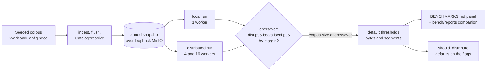

# ADR-0074: Benchmark-driven distributed-query thresholds

Status: Accepted
Date: 2026-08-12
Refs: #944, ADR-0071 (distributed read fan-out)

## Context

ADR-0071 gave the distributed read fan-out a cost gate. Before a query is
split into slices, the coordinator estimates its cost from the pinned
snapshot and decides whether distributing is worth the overhead:

```rust
// crates/ravel-query/src/distrib/partition.rs
pub const DISTRIBUTE_MIN_STORE_BYTES: u64 = 256 * 1024 * 1024; // 256 MiB
pub const DISTRIBUTE_MIN_SEGMENTS: u64 = 64;

pub fn should_distribute(thresholds: &DistribThresholds, cost: &CostEstimate) -> bool {
    cost.estimated_store_bytes >= thresholds.min_store_bytes
        || cost.segments >= thresholds.min_segments
}
```

The two constants back the `--distribute-bytes-threshold` and
`--distribute-segments-threshold` flags as their defaults. They were picked
by estimate. Nothing measures where distribution actually starts to pay.

The gate matters because distribution is not free. A distributed query adds
a snapshot resolve, slice dispatch, per-slice gRPC frame decode, and a
coordinator merge over the returned runs. Below some corpus size those costs
exceed the parallel-fetch win and local execution is faster; above it the
fan-out wins. The gate's whole value is sitting near that crossover: set too
low, it distributes cheap queries and pays overhead for no win; set too
high, it keeps large queries on one node and leaves the fan-out unused.

The one distributed-crossover benchmark on main runs over `MemoryStore`,
which serves reads with no I/O latency. The fan-out's main win is overlapping
fetch and decode across workers, each on its own NIC; with zero fetch latency
that win is invisible, so the MemoryStore panel cannot locate the real
crossover. `BENCHMARKS.md` already lists an S3/MinIO multi-worker crossover
as pending.

The epic is titled "threshold autotuning," which leaves the meaning of
"autotuning" open: a gate that adapts at runtime from live query behavior, or
a default measured offline and re-validated periodically. That choice shapes
everything downstream, so it is recorded here.

## Decision

1. Measure the local-versus-distributed crossover on the reference host
   (`ci-16gb-fsn1-1`, the `BENCHMARKS.md` same-host baseline) against a
   realistic RSEG corpus over a real object store: loopback MinIO through
   `S3Store`, not `MemoryStore`. This matches the 2026-08-09 ADR-0067 S3
   panel, which ran `--store s3` against a native-binary loopback MinIO on
   the same host.

2. Set the two default thresholds from the measured crossover: the corpus
   size (in estimated store bytes and in segment count) where distributed
   p95 latency first beats local p95 by a stated margin. Record the run in
   `BENCHMARKS.md` with a `bench/reports/<date>-distrib-crossover-s3/`
   companion holding the raw output and the exact config.

3. "Autotuning" is an offline measured default, not a runtime-adaptive gate.
   `should_distribute` stays a cheap, deterministic comparison of a pinned
   snapshot's cost estimate against a constant. Learning thresholds at
   runtime (per query, per tenant) is deferred to the query-worker
   autoscaling and observability epic (#951), which reads these measured
   defaults as its starting point.

4. Re-validate the defaults when the reference host, or the fetch, decode, or
   merge path, changes materially. A default whose measurement has gone stale
   carries the `BENCHMARKS.md` dagger convention until re-measured.

## Benchmark methodology

The measurement is a matrix, run by an extended distributed-crossover
benchmark in `ravel-bench`:

- Workers: 1, 4, 16.
- Query shapes: point lookup, 1-hour selective range, 24-hour wide scan,
  high-cardinality group-by, top-k.
- Cache: cold, and warm affinity cache (repeated dashboard-style load).
- Metrics per cell: p50, p95, p99 latency; bytes moved; S3 request counts;
  coordinator CPU; cache-affinity hit rate.
- Corpus: the deterministic-by-seed generator (`WorkloadConfig.seed`), sized
  above the gate constants so real fan-out engages, and swept across sizes to
  find the crossover rather than fixed at one size.
- Object store: native-binary loopback MinIO through `S3Store` on the
  reference host.

Reproducibility follows the `BENCHMARKS.md` rule already in force: the exact
command, a full environment table (CPU, cores, memory, OS, rustc, Ravel
commit, object-store backend and version, network path), and every
non-default config knob are recorded with the panel, and the raw output is
committed under `bench/reports/`. A run on any host other than the reference
host is not comparable and is not recorded as the baseline.



## Threshold policy

For each query shape, find the corpus size where distributed p95 first beats
local p95 by the stated margin. That size, expressed in the same units the
cost estimate uses (estimated store bytes, segment count), is the shape's
crossover.

When shapes disagree, take the conservative (higher) crossover for each axis
so the gate never distributes a query that local execution would serve
faster; a query above every shape's crossover distributes. Either axis
tripping is enough, matching `should_distribute`'s existing OR.

The measurement may land on the ADR-0071 256 MiB / 64-segment constants.
Confirming them with data is a valid outcome and is recorded as such; the
point is that the default is backed by a measurement, not that it changes. The
measured result (below) confirmed the byte axis and moved the segment axis.

## Measured result and resulting defaults (2026-08-12)

The crossover was measured over native loopback MinIO through `S3Store` on the
reference host `ci-16gb-fsn1-1`, swept across corpus size at worker counts 1,
4, 16. Full panel and raw per-cell JSON: `BENCHMARKS.md` "Distributed read
crossover (S3/MinIO, ci-16gb-fsn1-1)" and
`bench/reports/2026-08-12-distrib-crossover-s3/`.

Distributed p95 beats local p95 by the 10% margin **only at 16 workers**,
first at ~35.8 MiB estimated store / 75 segments on the byte axis and at 256
segments on the tiny-segment axis. At 1 and 4 workers distribution never wins
in the swept range. At the 35.8 MiB cell, 1 worker is ~2.5x slower than local
while 16 workers is ~12% faster.

Resulting defaults, per this ADR's conservative-crossover policy:

1. `DISTRIBUTE_MIN_SEGMENTS`: **64 -> 256**. The measured segment crossovers
   are 75 (byte axis) and 256 (tiny-segment axis); the conservative (higher)
   value per this ADR's policy is 256. The old 64 had to move regardless: it
   triggered a case measured ~25% slower distributed even at 16 workers.

2. `DISTRIBUTE_MIN_STORE_BYTES`: **256 MiB, unchanged.** The reason is outcome
   asymmetry, not the untested range. `should_distribute(thresholds, cost)`
   cannot see the worker count, so in the 36-256 MiB band no single byte
   threshold is correct: at 35.8 MiB, 1 worker is 2.5x slower and 16 workers
   is 12% faster. Keeping the conservative 256 MiB deliberately avoids the
   2.5x downside at the cost of leaving measured 16-worker wins on the table.

Caveats. These are single-host loopback numbers and so an **upper bound** on
the true cross-host crossover. The `DISTRIBUTE_MIN_STORE_BYTES` axis was not
reachable directly: the in-process generator materializes every batch in RAM
(~1 KiB/point), capping the corpus near ~146 MiB estimated store before OOM,
so the byte crossover (~36 MiB at 16 workers) was observed well below the
256 MiB default rather than at it.

Follow-ups tracked separately: #959 (warm-affinity cache measurement), #960
(corpus-span generator bug), #961 (generator RAM cap), and #962
(worker-count-aware gate plus a multi-host measurement, which is what would
let the byte threshold drop below 256 MiB safely).

## Rejected alternatives

- **Keep the hand-picked constants.** No evidence they sit near the real
  crossover. A wrong constant either distributes cheap queries for no win or
  keeps expensive queries local; the gate is only useful if the constant is
  near the crossover, which is exactly what is unmeasured today.

- **A runtime-adaptive gate that learns from live query cost and latency.**
  Makes the gate stateful and non-deterministic, which complicates
  reproducibility and testing, and defers the decision into production where
  a bad early estimate degrades real queries. The gate must be a cheap,
  deterministic comparison. Runtime adaptivity is a larger, separate scope
  (#951) that consumes these measured defaults rather than replacing them.

- **Measure over `MemoryStore`.** No I/O latency, so the parallel-fetch win
  that motivates the fan-out is invisible and the reported crossover is a
  CPU-decode artifact, not the real one. This is what the existing panel does
  and why it cannot answer the question.

- **Measure on the dispatching workstation or any fleet executor.**
  `BENCHMARKS.md` requires same-host comparison, and the stock executors
  (8 GB, 4 cores) cannot run a realistic object-store benchmark. The
  reference host is fixed at `ci-16gb-fsn1-1`.

## Consequences

- `ravel-bench` gains a distributed-crossover benchmark that runs over
  `S3Store` (loopback MinIO) and reports the full matrix. A `BENCHMARKS.md`
  panel and a `bench/reports/` companion document it.

- The two default thresholds may change. That is a production behavior change
  on the query path (queries near the boundary distribute differently),
  landed and reviewed on its own, separate from the benchmark.

- The P4 optimization epics gate on this benchmark: order-insensitive
  aggregation pushdown (#946), order-sensitive pushdown and its
  float-tolerance policy (#947), and straggler hedging and rebalancing (#948)
  each must show a measured win against it before landing.

- The benchmark and its defaults are tied to the reference host. A host
  change requires re-measurement before the numbers are trusted again.
