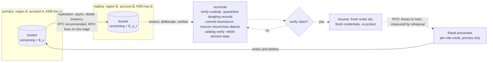

# ADR-0075: operator-owned DR via replicated-bucket controls, a rehearsed restore, and a process-kill evidence lane

Status: Accepted

## Context

The due-diligence review's risk register carries R6 (P2, low likelihood,
catastrophic impact): total telemetry loss on a bucket, region, credential,
lifecycle-rule, or KMS-key accident. Everything durable — data objects,
commit records, manifests, catalog snapshots, control objects — lives in
exactly one bucket, and Ravel itself cannot recover from losing it. The
review is explicit that this is a by-design out-of-scope catastrophe, not a
defect, and that `docs/guides/disaster-recovery.md` (ADR-0058 decision 5)
is commendably honest about it. It is equally explicit that honesty does
not close the gap: "disqualifying for buyers with mandated RPO/RTO." The
exit criterion accepts either a real backup/export path or "a documented,
tested external DR runbook (versioning + NoncurrentDays + CRR) with a
stated RPO/RTO and a rehearsed restore" (#1054).

The same epic carries the review's J-3 finding: no test in the repository
ever kills a process. Every durability claim rests on `MemoryStore` and
fault injection inside one process. For a system whose pitch is disposable
compute, no evidence exists that a real process dying mid-flush or
mid-compaction against a real object store behaves the way the in-process
tests assume.

### What already exists, and what already constrains this decision

**ADR-0058** shipped the honest posture statement and, more importantly,
`ravel-cli commit reconstruct`: a record-less data object's commit record
is rebuildable from the object's own footer (plus one full GET for the
exact content hash). ADR-0058 framed this as a narrow recovery path for
commit-record loss. This ADR promotes it to load-bearing DR machinery: it
is exactly the reconciliation step a replica restore needs (below).

**ADR-0064 §7** is the accepted contract this decision must reconcile
with, not paper over. It states: object versioning **OFF unless
deliberately paired** with a noncurrent-version expiration rule
(`NoncurrentDays = E_v`), because a versioned bucket silently converts
every Ravel delete — retention, sweep, and erasure — into a soft delete;
with the pairing, every physical-erasure and retention bound gains `+E_v`.
ADR-0064 §6 adds: bucket-default Object Lock retention `D` makes the
physical erasure bound `max(bound, D)`, and instructs operators with
erasure obligations to prefer scoped legal holds or keep `D` inside their
erasure SLA. So the standard S3 DR pattern is in direct tension with the
erasure guarantee: turning on versioning extends the physical erasure
bound, and turning on Object Lock can extend it arbitrarily. ADR-0064's
consequences already anticipated replication in one sentence ("erasure
applies to the primary bucket, and operators with replicated buckets must
apply the same lifecycle discipline to replicas") without deciding what a
sanctioned replicated configuration is. That is this ADR's job.

**ADR-0068** built `ravel-sim`, the deterministic single-process
interleaving-search harness, and rejected external deterministic-hypervisor
testing (Antithesis-style) as "far heavier than needed while the whole
system runs in one process against MemoryStore; **revisit if multi-process
deployment testing is ever needed**." The review's process-kill experiment
is multi-process deployment testing. This ADR must either satisfy the
evidence need without reversing that rejection, or reverse it explicitly.

**Replication facts the decision turns on** (S3 semantics; MinIO's bucket
replication is equivalent for rehearsal purposes):

- Cross-region replication is asynchronous and preserves no cross-object
  ordering. Ravel's ingest awaits the data PUT to completion before it
  builds the commit record (`crates/ravel-ingest/src/shard.rs`), but
  replication may deliver either object first, so at any instant a replica
  can hold a data object without its record or a record without its data.
- Simple DELETEs (what every Ravel delete issues; `object_store` never
  deletes by version id) become delete markers on a versioned bucket, and
  replicate only when `DeleteMarkerReplication` is enabled. Version-id
  permanent deletes are **never** replicated — a compromised primary
  credential cannot purge the replica through the replication channel.
- Replication requires versioning on both buckets, and can re-encrypt into
  a different KMS key in a different account (`ReplicaKmsKeyID`).
- S3 Replication Time Control (RTC) carries a published SLA: 99.99% of
  objects replicated within 15 minutes. Without RTC, lag has no bound.

**Invariants that bound the solution space**: object storage is the only
durable backend (no local-disk durability path, however convenient for a
backup mechanism); persistent formats are frozen (no export/snapshot
format); and every published guarantee must stay exact and honest —
including ADR-0064's erasure bounds after DR controls are switched on.

## Decision

Ravel adopts a DR posture. Its shape is **operator-owned bucket-level
controls — versioning, noncurrent-version expiration, and cross-region
cross-account replication — specified normatively by Ravel, verified where
the platform can see them, and proven by a rehearsed restore whose
measured numbers are the only RPO/RTO Ravel publishes.** No in-product
backup, export, or failover mechanism is built.

### 1. Three configuration tiers, each with its erasure bound stated

`docs/guides/disaster-recovery.md` graduates from a posture statement to a
normative runbook (this amends ADR-0058 decision 5) defining three tiers.
Every tier states its erasure-bound consequence next to its protection, so
the ADR-0064 §7 tension is resolved by disclosure, never silently:

- **Tier 0 — no DR (default).** Unversioned bucket, exactly today's
  ADR-0064 §7 baseline. Erasure bounds hold as stated in
  docs/consistency-model.md with no modifiers. RPO/RTO: none; bucket loss
  is total loss. This remains a supported posture; the guide states its
  blast radius plainly.
- **Tier 1 — replicated (the recommended DR posture).** On the primary:
  versioning ON, paired with `NoncurrentDays = E_v` and expired-delete-
  marker cleanup — precisely the "deliberately paired" configuration
  ADR-0064 §7.1 already sanctions, so no amendment to ADR-0064 is needed;
  this tier instantiates it. Replication (v2 configuration,
  `DeleteMarkerReplication` enabled, RTC recommended) to a replica bucket
  in a **different region and a different account**, encrypted under a
  **different KMS key**, holding its own `NoncurrentDays = E_v_r` rule.
  Ravel processes never hold replica-account credentials; the replication
  channel is the only writer. Erasure consequence, disclosed: the primary
  physical bound gains `+E_v` (already an ADR-0064 §4 modifier); the
  replica's copy of an erased subject is physically gone within
  replication lag + `E_v_r` after the primary sweep, **provided
  `DeleteMarkerReplication` is enabled — without it, erased bytes persist
  on the replica indefinitely, and that configuration is unsupported for
  any deployment with erasure obligations.**
- **Tier 2 — Tier 1 plus Object Lock.** Bucket-default retention `D` on
  the primary (and/or replica). Erasure consequence per ADR-0064 §6:
  physical bound becomes `max(bound, D)`; query-time exclusion stays
  immediate. ADR-0064 §6's instruction carries forward unchanged: prefer
  scoped legal holds over blanket default retention, or keep `D` inside
  the erasure SLA. Supported, but **not part of the recommended DR
  baseline**,
  for the reason in Rejected Alternatives: the cross-account replica
  already covers the credential-compromise threat Object Lock addresses,
  without touching the primary's erasure bound.

The load-bearing design insight of Tier 1, stated in the guide verbatim:
**`E_v` is one knob controlling two windows.** It is the disaster-
detection budget (after an accidental or malicious mass delete, the
operator has `E_v_r` — and `E_v`, if the deletes were simple deletes — to
notice and restore noncurrent versions) and it is simultaneously the
erasure-residue window (erased bytes persist as noncurrent versions for
`E_v`). Choosing it is a compliance decision, not a tuning default; the
guide instructs operators to set it deliberately against both their
detection SLO and their erasure SLA, and refuses to pick a number for
them.

### 2. Restore semantics: the replica is a restore source, never a live failover target

ADR-0058's analysis stands unchanged: the replica is asynchronous, has no
cross-bucket CAS, and its listing consistency covers only what has
arrived. Pointing a live Ravel deployment at the replica on outage would
silently violate the commit-then-visible ordering, the seal/GC/compaction
reasoning, and the sweeper's re-verify LIST. The runbook therefore defines
restore as a deliberate, verified operation:

1. **Freeze.** Stop every Ravel process writing to the lost or suspect
   primary (region loss usually does this for you). Nothing may write to
   the restore target until step 5.
2. **Choose the restore bucket.** Either promote the replica in place or
   copy it to a fresh bucket. Both are sanctioned: objects are immutable
   and content-addressed, so every replicated object is bit-identical to
   its original; the only skew is presence/absence.
3. **Reconcile to a consistency point.** This is where replication's lack
   of ordering is repaired, using tools that all exist today:
   - `ravel-cli maintain verify-custody` (versioning-aware mode, ADR-0064
     §7) finds **dangling commit records** — record replicated, data
     object not. These are quarantined (deleted under the operator's
     restore credential, with maintenance stopped, exactly the ADR-0058
     stop-maintain-first discipline); each is counted as data loss against
     the measured RPO.
   - `ravel-cli commit reconstruct` (ADR-0058) recovers the opposite skew:
     **data object replicated, record not.** The footer carries everything
     a rebuilt record needs. Because ingest completes the data PUT before
     building the record, this converts "the record lagged replication"
     from loss into recovery — the effective RPO is the replication lag of
     the *data object*, not of the record pair.
   - `ravel-cli catalog verify` classifies catalog staleness. Catalog
     objects are derived; the fold rebuilds them over whatever the
     reconciled commit-record set is.
   - `sys/` control objects are each either self-healing (heartbeats,
     qualification — rewritten by the owning process on startup) or
     `CreateIfAbsent`-idempotent (seal records, provisioning). The
     rehearsal (§4) must validate that claim end to end; any `sys/` object
     found not to self-heal is a blocking finding, not a footnote.

   Skew between *related maintenance objects* is bounded by the horizons
   that already gate the machinery: a compaction or rewrite record is
   published at least `protection_horizon` (~25 h with defaults) before
   the sweep deletes its inputs, and an erasure `.dreq` is deleted at
   least `protection_horizon` after its `.done`. A delete marker can
   therefore reach the replica ahead of the day-older record that
   justified it only if replication lag exceeded `protection_horizon`.
   The runbook states the consequence both ways: within that envelope,
   the reconciliation above is complete and §3's RPO definition holds;
   if lag at disaster time may have exceeded it (no RTC, replication
   degraded for a day or more), the operator must also treat erasure
   state as suspect and re-submit any erasure request completed within
   the lag window, because a restored bucket could otherwise serve
   pre-rewrite inputs whose `RewriteRecord` — or whose exclusion-keeping
   `.dreq` — never arrived. Superseded-but-unswept compaction duplicates
   need no such care: overlap harmlessness holds for compaction, and
   only for compaction (ADR-0064 decision 3).
4. **Verify before serving.** verify-custody clean, catalog verify clean,
   and a canary query set over known-ingested data.
5. **Resume.** Start Ravel against the restored bucket. Disposable compute
   pays off here: processes mint fresh writer ids and epochs, no local
   state exists to reconcile, and the operator issues fresh per-role
   credentials (ADR-0055/0072) scoped to the restore bucket.
6. **Re-protect.** Re-establish versioning, lifecycle rules, and
   replication to a new replica before declaring the incident closed; an
   unreplicated restored primary is Tier 0.

### 3. RPO and RTO: defined here, published only from a rehearsal

The issue's requirement is verbatim: "the RPO/RTO numbers must come from
that rehearsal rather than from estimation." Accordingly this ADR
publishes **no number**. It defines what the numbers mean and where they
come from:

- **RPO** = the replication lag of acked data at disaster time, plus any
  dangling-record quarantine from step 3. With RTC enabled it has a
  published ceiling (15 minutes for 99.99% of objects, S3's SLA); without
  RTC it has no bound and the guide says so. A deployment that needs a
  stated RPO enables RTC.
- **RTO** = wall-clock time from freeze to verified resume (steps 1–5),
  which is dominated by reconciliation and scales with the restored
  object count. It is deployment-sized and cannot be honestly stated in
  the abstract.
- **Publication rule**: the runbook carries a "rehearsal record" section —
  date, environment, object count, measured RPO and RTO, anomalies found.
  Until the first rehearsal record exists, the guide states "unmeasured"
  in those fields. A rehearsal that surfaces a blocking finding (a
  non-self-healing `sys/` object, a reconciliation step that fails) blocks
  publication until fixed. Rehearsals re-run when the restore-relevant
  machinery changes materially, and the record keeps its history.

### 4. The chaos-evidence lane: process-kill scenarios against MinIO

A new lane under `scripts/chaos/`, deliberately **not** part of
`ravel-sim` and **not** run in PR CI. Two scenarios, real binaries, real
multi-threaded runtime, real MinIO, real `kill -9`, real clock:

- **Kill ingest mid-flush.** Drive load through the server, SIGKILL it
  mid-flush (trigger observed via metrics/log markers), restart, and
  assert: every write acked under strict ack before the kill is durable
  and queryable; no partial flush is visible; verify-custody and catalog
  verify are clean. This is the exit criterion's "kill -9 mid-flush
  against MinIO with no strict-ack violation" row.
- **Kill a maintain worker mid-compaction, with a sibling running.** Two
  maintain-role workers under leased maintenance (ADR-0065), SIGKILL one
  mid-compaction. Pass: the sibling takes over the dead worker's units
  within `3 * H` (ADR-0065's own liveness bound) plus one maintenance
  tick; no unit stays orphaned; the interrupted compaction completes under
  the conservation gate; the dead worker's abandoned partial outputs age
  out under the existing unreferenced-part rule with no leak past the
  horizon; verify-custody and catalog verify are clean.

The oracle is pinned by this ADR (the harness implements it, it does not
choose it): **strict-ack-implies-durable, sibling takeover within
`3 * H` + one tick, no orphaned lease, conservation holds, custody and
catalog verification clean.** A failure of the second scenario would mean
the disposable-compute claim has a real-clock or partial-visibility gap
the MemoryStore tests miss — the review's words — and is treated as a
release-blocking bug, not a flaky test.

**Relationship to ADR-0068, stated so nobody has to infer it**: this does
not reverse ADR-0068's rejection. What ADR-0068 rejected was
deterministic-hypervisor technology for *interleaving search*, and its
reasoning stands — the lane built here searches nothing, enumerates two
scripted scenarios, and is nondeterministic by design. What ADR-0068
explicitly reserved — "revisit if multi-process deployment testing is
ever needed" — is the clause this ADR invokes: the DR epic is the named
trigger. `ravel-sim` remains the tool that finds interleavings nobody
enumerated; this lane is the tool that proves the enumerated claims
survive contact with a real process death and a real store. Execution
placement follows the epic's split: the harness is fleet-buildable, but
runs are orchestrator-local (executors have no MinIO), recorded in the
same rehearsal-record discipline as §3.

### 5. ADR-0058 amendment

ADR-0058 decision 5's document graduates from "honest statement of what
does not exist" to the normative runbook above. Decisions 1–4 of ADR-0058
(orphan-presence gauge, reconstruction tool, Admin `c/**` write grant,
stop-maintain-first runbook) are untouched and become load-bearing steps
of the restore procedure. A one-line cross-reference lands in ADR-0058's
header with this ADR.

## Rejected alternatives

**An in-product backup/export mechanism (a `ravel backup` daemon or
subcommand copying bucket-to-bucket).** Rejected. (a) It re-implements
what S3 replication already does with worse properties: Ravel-side copy
has the identical consistency-point problem (it walks a listing while
writers race it) plus a new failure domain — a scheduled process whose
silent death erodes RPO invisibly, on a platform whose thesis is that no
process is load-bearing. (b) It needs a new credential shape (read
everything, write elsewhere) that ADR-0055/0072 deliberately do not have.
(c) RTC's replication SLA is better than anything a periodic copy can
promise. (d) A point-in-time export format would be a new persistent
format — a frozen-contract change this epic is forbidden to make. The
review's own exit criterion names the external runbook as an acceptable
answer, and for this architecture it is the *better* answer, not the
cheaper one: immutable content-addressed objects are what make a
replicated bucket a usable restore source at all.

**Keep declining (today's Tier 0 as the only posture, better
documented).** Rejected. The absence is the review's single most damning
operational finding, R6 is catastrophic-impact, and the marginal cost of
Tier 1 is a runbook, lifecycle rules the erasure ADR already sanctions,
and one rehearsal. Honesty about a gap was ADR-0058's correct first step;
stopping there converts a documented risk into an accepted one without
anyone having accepted it.

**Object Lock as the mandatory DR baseline.** Rejected, and this is the
heart of the ADR-0064 reconciliation. Object Lock's marginal protection
over Tier 1 is against a compromised credential purging version history on
the primary. But Tier 1 already contains that threat: version-id deletes
never replicate, the replica lives in an account whose credentials Ravel
never holds, and the replica retains deleted data as noncurrent versions
for `E_v_r`. Making Object Lock mandatory would impose `max(bound, D)` on
every DR-adopting deployment's erasure bound — exactly the collision
ADR-0064 §6 warns about — to defend against a threat the cross-account
replica already covers. Deployments whose compliance regime demands WORM
get Tier 2, with the erasure consequence disclosed, as a choice rather
than a default.

**Automatic or live failover to the replica.** Rejected for the reasons
ADR-0058 already documented and this ADR preserves: replication is
asynchronous with no cross-bucket ordering, so a live redirect serves a
store where commit-then-visible does not hold. Failover stays a deliberate
restore with a verification gate. No code path learns about a second
bucket.

**Reversing ADR-0068 and building multi-process deterministic
simulation.** Rejected. The evidence the review demands is that real
process death against a real store matches the model — that is a
falsification test of the in-process model, and it needs reality, not a
better model. Deterministic multi-process simulation remains the heavy
technology ADR-0068 declined, and nothing in this epic changes its cost
calculus. If the chaos lane ever finds a real-clock bug that demands
interleaving search to fix, that finding — not this ADR — would be the
case for revisiting.

**Running the chaos lane in PR CI.** Rejected: it needs MinIO, multiple
processes, and real-clock waits of `3 * H`-scale — minutes of wall clock
with inherent nondeterminism. In PR CI that is a flake generator, and a
flaky durability lane is worse than none because red stops meaning
anything. Orchestrator-local (optionally nightly later, once its
stability is demonstrated), with results recorded, keeps the evidence
real and the signal clean.

## Consequences

- **`docs/guides/disaster-recovery.md` becomes normative** (runbook, tiers,
  restore procedure, rehearsal record), amending ADR-0058 decision 5.
  docs/guides/operations.md cross-references it; README's operations
  pointers update in the same commit.
- **docs/consistency-model.md's deletion-guarantees modifiers gain the
  replica rows**: `+E_v` (already present), replica residue = replication
  lag + `E_v_r` with `DeleteMarkerReplication` required, and the
  unsupported-configuration callout (replication without delete-marker
  replication under erasure obligations). ADR-0064's text needs no
  amendment: Tier 1 is the "deliberately paired" configuration its §7.1
  already anticipated, and this ADR cites it rather than restating it.
- **The erasure bound for DR-adopting operators is longer, and that is
  stated, not hidden**: an operator choosing Tier 1 accepts erased-subject
  residue for up to `E_v` on the primary and replication lag + `E_v_r` on
  the replica; Tier 2 accepts `max(bound, D)`. Query-time exclusion stays
  immediate in every tier. The guide presents this as the deliberate
  trade it is.
- **RPO/RTO are published only from rehearsal records.** Until the first
  rehearsal lands, the guide says "unmeasured" — which is still strictly
  more than today, because the procedure that will measure them exists
  and is normative.
- **A new `scripts/chaos/` lane exists** with a pinned oracle;
  `ravel-sim`'s scope is unchanged; ADR-0068's rejection stands,
  its revisit clause consumed by exactly the trigger it named.
- **No new crate, no new credential role, no format change, no code path
  that knows about a second bucket.** The only durable backend remains
  object storage; the replica is written by the platform's replication
  channel, never by a Ravel process.
- **Ravel cannot enforce most of this**, and says so: `store qualify`
  already probes versioning and lifecycle rules (ADR-0064 §7 teeth);
  replication configuration is invisible to `object_store`, so the
  runbook carries an explicit platform-CLI verification checklist
  (`aws s3api get-bucket-replication` and equivalents) instead of
  pretending Ravel checked.
- **What this ADR does not do**: no backup daemon, no failover mechanism,
  no RPO/RTO promise in code, no Object Lock enforcement, no change to
  erasure semantics — only to their disclosed bounds under configurations
  operators choose.
