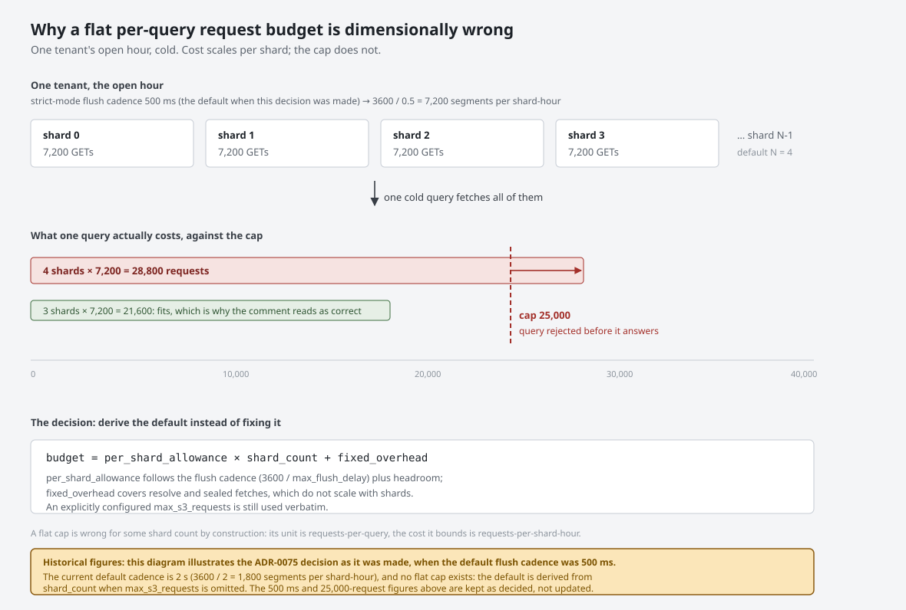

# ADR-0075: Shard-aware query request budget

Status: Accepted

## Context

A query carries a per-tenant cap on the S3 requests it may issue,
`max_s3_requests`, introduced by ADR-0073 decision 3 to bound a runaway query
to a knowable spend. It defaults to a flat 25,000 requests
(`ravel-query/src/config.rs:23`).

The comment justifying that number states it "admits the worst legitimate open
hour (~7,200 GETs per shard-hour plus resolve and sealed fetch) with headroom".
The 7,200 is exact and derived: strict-mode ingest flushes on a 500 ms cadence
(`ravel-ingest/src/config.rs:181`), so a busy tenant produces 3600 / 0.5 = 7,200
segments per shard per hour, and a cold query over that open hour must fetch
each one.

The budget is a **per-query total**. The cost it bounds is **per shard-hour**.
The default shard count is **4** (`ravel-server/src/config.rs:54`). So the
worst legitimate open hour actually costs 4 x 7,200 = 28,800 requests against a
25,000 cap, and the query is rejected before it can answer.

The sizing comment is therefore correct only at three shards or fewer. At the
shipped default, the most-queried window in any observability system — the last
hour, the live dashboard — is not answerable for a busy tenant until compaction
seals it an hour or two later. An independent review classified this P1 and
noted the incoherence is visible in the code's own justification.

This is a dimensional error rather than a tuning mistake: a cap whose unit is
requests-per-query is being sized from a quantity whose unit is
requests-per-shard-hour. Any flat number is wrong for some shard count.

## Decision

**1. The default request budget scales with the configured shard count.**

The effective default becomes

```
budget = per_shard_allowance x shard_count + fixed_overhead
```

with `per_shard_allowance` sized from the flush cadence (the 7,200 figure, which
is itself `3600 / max_flush_delay`) plus headroom, and `fixed_overhead` covering
resolve and sealed-segment fetches that do not scale with shards. An operator
who sets `max_s3_requests` explicitly still gets exactly that value; the scaling
applies only to the default.

The span `per_shard_allowance` covers is no longer one open hour. It is the
worst healthy unsealed tail plus the fold-stall alert window (ADR-1306
amendment below).

**2. The budget is derived from configuration, not hardcoded.** Because the
per-shard cost is a function of `max_flush_delay`, deployments that trade ack
latency for cost (a supported posture, and the only lever available without the
shared-object work in #1064) must not have to recompute the cap by hand. The
default is computed at startup from the values actually in effect.

**3. Published performance and cost numbers are measured against real S3.**
MinIO removes per-request fees entirely, which is precisely what makes this
class of defect invisible: a request budget that is structurally too small costs
nothing on MinIO and is a hard query failure plus a line item on S3. MinIO
remains valid for correctness and conformance testing, where it is already used
in required CI. It is not an acceptable substrate for a performance or cost
claim.

## Rejected alternatives

**Raise the flat default to cover four shards (~40,000).** Lost because it
repeats the original error one shard count later. A deployment at 16 shards is
back to a hard failure, and nothing in the code would explain why 40,000 was
chosen or when it stops being enough.

**Make the budget per-shard rather than per-query.** Lost because the budget's
purpose is to bound *a query's* total spend to a knowable number. A per-shard
cap makes the total spend depend on a value the operator is not thinking about
when they set it, which is the same coupling problem wearing different clothes.

**Reduce the default shard count so the existing cap fits.** Lost because it
sells ingest parallelism to fix a read-path accounting error, and because four
shards is a deliberate ingest sizing choice that should not be dictated by a
query cap.

**Raise `max_flush_delay` so fewer segments exist per shard-hour.** Lost as a
*fix*, though it remains a supported operator lever. It trades strict-ack
visibility latency — a headline property — to correct an arithmetic mistake in a
cap, and it would leave the cap still dimensionally wrong.

**Exempt the open hour from the budget.** Lost because the budget exists to
bound runaway queries, and the open hour on a busy tenant is exactly where a
runaway query is most expensive. Removing the bound where it matters most
defeats its purpose.

## Consequences

- A cold query over a busy tenant's open hour succeeds at the shipped defaults,
  at any shard count, which is what the sizing comment always claimed.
  (See the ADR-1306 amendment below: that held for one hour of unsealed
  data, and the unsealed tail reaches 2 h 20 m on a healthy fold.)
- The relationship between flush cadence, shard count and query cost becomes
  explicit in one place instead of implicit across three files, so the next
  change to either input cannot silently invalidate the cap.
- Operators who pinned `max_s3_requests` explicitly are unaffected.
- The default budget rises with shard count, so a high-shard deployment permits
  a more expensive worst-case query. That is the honest consequence of the cost
  genuinely being higher there; the cap still bounds it to a computable number,
  which is what ADR-0073 decision 3 asked for.
- Benchmark and cost figures gain an environment requirement. Numbers produced
  on MinIO cannot be published as performance or cost evidence, which makes the
  measurement work in this epic depend on real S3 credentials and a bucket.
- This does not reduce the request bill. It makes the read path's cap correct.
  The write-side request economics that dominate the bill are ADR territory for
  #1064 and are explicitly out of scope here.

## Diagram



One tenant's open hour fanned across shards, the per-query cap drawn across the
total, and the point where the shipped default stops fitting.

## Amendment (ADR-1306, 2026-09-26): the budget covers the unsealed tail and the fold-stall alert window

<!-- amendment-applies: sections="Decision|Consequences" pointer="ADR-1306 amendment" -->
<!-- amendment-supersedes: phrase="at any shard count, which is what the sizing comment always claimed" pointer="ADR-1306 amendment" -->

Decision 1 sized `per_shard_allowance` from one open hour. The span a
recent-window query resolves is the unsealed tail, which is longer. The fold
seals ingest hour `H` only `max_flush_lifetime + clock_skew_allowance +
fold_safety_margin` after `H` ends, so a healthy tail swings between 1 h 20 m
and 2 h 20 m at the defaults. When the fold stalls, the tail grows until the
budget refuses cold queries with HTTP 422. At the one-hour sizing that refusal
comes before the `RavelCatalogFoldStalled` alert fires.

ADR-1306 replaces the one-hour span in decision 1 with

    covered_span = (seal_margin + 1 h)
                 + (seal_margin + FOLD_STALL_ALERT_FOR + ALERT_DELIVERY_SLACK)

`seal_margin` is the sum of the three durations above, taken from the
`CatalogConfig` the fold runs with. `FOLD_STALL_ALERT_FOR` is the shipped
alert's 600 s `for:`, and `ALERT_DELIVERY_SLACK` is 300 s for scrape,
evaluation and Alertmanager delay. At the defaults `covered_span` is
14,100 s. The per-shard term also gains a measured
`REQUESTS_PER_UNSEALED_FLUSH` factor, starting at 1.
The shape of decision 1 is unchanged: a per-shard allowance times the shard
count, plus the fixed overhead, with an explicit `--max-s3-requests` used
verbatim. At 4 shards and a 2 s flush cadence the derived default goes from
15,800 to 47,300 requests.

The first Consequences bullet held only for one hour of unsealed data. Under
ADR-1306 the claim becomes: no query is refused for fold lag before the
fold-stall alert pages, and at the default `max_ingest_lag` no query whose
range covers the last 50 minutes or less is refused for fold lag at all.
Both hold at the measured per-flush cost. The remaining decisions and rejected alternatives stand as written.
See ADR-1306 for the proof, the rejected alternatives, and the acceptance
tests.
