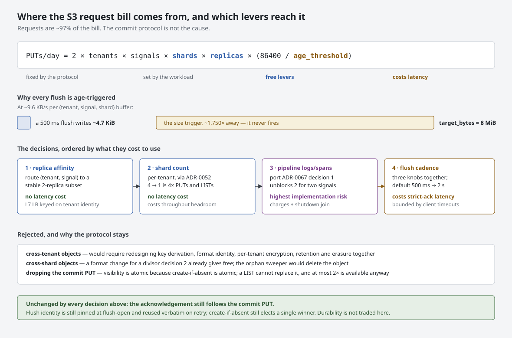

# ADR-0076: Reducing S3 request cost without weakening durability

Status: Accepted

## Context

Request charges, not storage, dominate Ravel's bill. An independent review
modelled ~45-55M PUTs/day and ~$7-8k/month of request fees against ~$100-150 of
storage at 100 tenants and 1 TB/day — roughly **97% of the cost is requests** —
scaling linearly with tenants x signals x shards x ingest replicas.

The obvious reading is that the two-object commit protocol is expensive: every
flush issues a data PUT and a commit-record PUT. That reading is wrong, and
acting on it would trade away the most valuable property in the system for
almost nothing.

**The cost is flush frequency against a size target that never fires.**

At the modelled load each `(tenant, signal, shard)` buffer receives about
9.6 KB/s. So:

| | value | source |
|---|---|---|
| Object produced by a 500 ms flush | **~4.7 KiB** | derived |
| `target_bytes`, the size trigger | **8 MiB** | `ravel-ingest/src/config.rs:180` |
| Time to reach `target_bytes` | **~870 s** | derived |
| Time to reach `min_flush_bytes` (64 KiB) | **~6.8 s** | `config.rs:184` |

The size trigger sits roughly **1,750x away from ever firing**. Every flush in
production is age-triggered, and the system pays a PUT pair to write a 4.7 KiB
object while its own batching target is 8 MiB. The protocol is not the problem;
the cadence and the fan-out are.

Cost therefore follows

```
PUTs/day = 2 x tenants x signals x shards x replicas x (86400 / age_threshold_s)
```

Three of those five terms are controllable: **shards**, **replicas**, and the
**age threshold**. This ADR addresses all three, in increasing order of what
they cost to use.

`target_bytes` is deliberately left alone: at these loads no plausible value
fires, so changing it is a no-op.

The formula counts flush PUTs only. Keyed log and span requests additionally
write an idempotency marker and perform a dedup-window LIST **per request**
(`docs/consistency-model.md:169-211`), which no lever here touches.

### Three facts that shape the decision

- **The age threshold has three knobs, not one.** A buffer with a waiter, or
  with `est_bytes >= min_flush_bytes`, takes the fast tier
  (`max_flush_delay`); otherwise it takes `max_flush_delay_idle`, which is
  10 s (`shard.rs:1029-1038`, `config.rs:183`). So buffered-mode tenants flush
  at ~6.8 s today, and **nothing past 10 s is reachable for them** unless the
  idle knob moves too.
- **The adaptive delay shipped by ADR-0067 decision 3 adapts the wrong way for
  cost.** It is off by default (`config.rs:191`) and clamps a *bursty* tenant up
  to the floor while relaxing a *trickle* tenant (`shard.rs:361-378`). The
  tenants generating the bill are the bursty ones. Its ceiling is additionally
  capped by a hard-coded `STRICT_VISIBILITY_BUDGET_NS = 1_000_000_000`
  (`shard.rs:351`).
- **There is no per-tenant flush or request metric.** `IngestMetrics` sums
  "across all shards and all tenants… no per-tenant dimension"
  (`ravel-ingest/src/metrics.rs:7-11`). Nothing today can tell an operator which
  tenant is generating the bill.

## Decision

**1. Route each `(tenant, signal)` to a stable subset of ingest replicas.**

Buffers are per replica, so a tenant whose writes spray across R replicas pays R
independent age-triggered flush streams for the same data. Consistent-hash
affinity at the load balancer divides that term by the ratio of total replicas
to subset size, **at no cost in acknowledgement latency and no contract change**.
Affinity is best-effort: a replica death simply reroutes, and correctness is
unaffected because `writer_id` and `epoch` already disambiguate concurrent
writers in the key. Disposability is preserved.

The subset is **two replicas by default**, not one, so a single replica loss
does not concentrate a tenant on one process. Subset size scales up with tenant
volume: a fixed subset is a throughput ceiling by construction, so a
high-volume tenant is given a larger subset rather than being pinned.

The deliverable is a **layer-7 load-balancer configuration keyed on tenant
identity**, owned by the Kubernetes operator's Service and ingress configuration
plus an operations guide. OTLP connections are long-lived and tenant identity
lives in authentication material rather than the URL, so the key must come from
a header or the mTLS identity. Naming the owning component matters: without it
this decision reads as advice rather than work.

This is the cheapest lever and it is listed first deliberately.

**2. Make per-tenant shard count the primary operator-facing cost control, and
reduce the default.**

Cost is linear in shards. ADR-0052 (online resharding) is accepted and
implemented — generation-versioned, activated on an hour boundary, and
**decrease is explicitly supported** with slack `S`
(`ravel-catalog/src/provisioning.rs`). Four shards to one is a **4x reduction in
PUTs and a 4x reduction in read LIST cost** (the read path loops
`for shard in 0..scan`), with no format change.

**Prerequisite: per-tenant flush and request attribution must land first.**
Making shard count "the primary cost control" while no metric reports per-tenant
PUT volume gives an operator no way to choose a target or verify a saving.

`IngestMetrics` is label-free partly as a deliberate cardinality choice, so the
answer must be **bounded-cardinality**: a top-K attribution or a dedicated
accounting endpoint, never an unbounded per-tenant Prometheus label.

**Costs that must be documented with the control**, not discovered:
- A tenant at one shard funnels a signal through a single shard actor and a
  single-threaded merge loop; this is a per-tenant throughput ceiling.
- Every one-shard tenant lands on shard index 0, concentrating load on one actor
  per replica while its siblings idle.
- Maintenance ownership and compaction units are `(tenant, signal, shard)`
  (ADR-0065), so one shard means one unit per tenant-signal: less distribution
  across maintain workers and larger per-unit input sets.
- **Logs and spans reach this lever only after decision 3 lands.** Both flush
  inline today, so at one shard a single 2-PUT round trip blocks that
  tenant-signal's whole channel drain.

**3. Pipeline the log and span flush, carrying the byte-budget charge with it.**

The metrics shard moves a pinned flush into a spawned task bounded by a
semaphore (ADR-0067 decisions 1 and 2). The log and span shards do not: their
flush runs inline (`log_shard.rs:384`, `span_shard.rs:347`), with no production
spawn anywhere in either file. `max_inflight_flushes` and `adaptive_flush_delay`
are therefore silently inert for two of three signals.

Port ADR-0067 decision 1 to both actors. This is applying an accepted decision,
not making a new one — but it is the highest-risk change in this ADR and must
not be treated as a mechanical copy, because **the inline structure is currently
load-bearing for budget accounting**. `log_shard.rs:384-388` says so directly:
holding `charges` in the inline scope refunds the ADR-0069 ingest byte budget
"exactly when this flush reaches its terminal outcome, whichever `return` below
it takes". Moving the flush into a spawned task requires moving the charges into
that task, as the metrics path already does (`shard.rs:418-452`), or the budget
either leaks — throttling a tenant's ingest permanently — or refunds early,
admitting bytes past the cap. The inflight guard's decrement-on-panic has the
same requirement.

A second requirement carries equal weight and is easy to miss because it lives
in the run loop rather than the flush function: **in-flight flushes must be
joined on shutdown.** The metrics actor ends `flush_all` with `join_all_flushes`
(`shard.rs:1093,1096-1108`) and carries a third `select!` branch draining
`join_next` (`shard.rs:948-950`). Without that, `Shutdown`, `FlushNow` or a
closed channel returns while a PUT is still in flight, the process exits, and an
acknowledged buffered point is silently discarded — which the consistency model
does not permit, because it tolerates crash loss but not a graceful shutdown
racing its own flushes. The log and span run loops have two branches and no
`JoinSet` at all.

The port therefore has five named requirements: move the charges into the task;
move the waiters with them; add the semaphore and carry an owned permit into the
task; add the inflight guard with decrement-on-Drop; and add the `JoinSet`, the
third select branch, and the shutdown join. "Copy the metrics pattern"
under-specifies the last of these.

Why it belongs in this ADR rather than a later one: without it, decision 2's
divisor reaches metrics only, and at the modelled 1 TB/day the bulk of the
volume is logs. An epic whose principal lever covers one of three signals is a
partial delivery.

**4. Expose the flush cadence as a bounded operator setting, moving all three
knobs together, and amend the sub-second visibility target.**

`max_flush_delay`, `max_flush_delay_idle` and `min_flush_bytes` become operator
settings that move as a set. Moving one alone does little: raising only
`max_flush_delay` leaves buffered tenants at the 10 s idle threshold, and
raising only the delay while `min_flush_bytes` stays at 64 KiB flips buffers onto
the fast tier at 6.8 s regardless.

`docs/consistency-model.md:33-34` states a p99 visibility target under one second
in strict mode. That target is amended to a **configurable visibility budget**
with a default of **2 s** in strict mode, chosen to sit well clear of the 5-10 s
OTLP client timeout budgets analysed below while still delivering a 4x request
reduction over today's 500 ms.

The **ceiling is derived, not picked**: it must remain below the smallest client
timeout budget minus the PUT p99 tail, and below the flush-bound slack that
`FLUSH_BOUND_SLACK_HOURS` encodes. The setting is validated against both, and a
value violating either is refused at startup rather than accepted silently, in
keeping with the fail-closed gate chain.

**This decision costs strict-mode acknowledgement latency, and that is its real
price.** A strict write leaves `waiters` non-empty, which selects the fast tier,
and the acknowledgement is sent only after the commit PUT returns. So raising
`max_flush_delay` to 5 s makes a strict export block ~5 s before it is
acknowledged. The durability contract is untouched — `consistency-model.md:8-17`
defines the strict ack as durability-only, and the ack still follows the commit
PUT — but the client-visible latency changes, and the following consumers
constrain how far this can go:

- **OTLP client timeouts.** Collector exporter and SDK defaults sit in the 5-10 s
  range. An ack latency near that budget produces timeouts, which produce
  retries, which produce **user-visible duplicates for logs and spans**
  (`consistency-model.md:162-165`; metrics dedup at query time, logs and spans do
  not). A retry storm also *increases* request count, partially cancelling the
  saving. The exposed ceiling must be justified against client timeout budgets,
  and the default must stay far below them.
- **Gateway concurrency.** Held request contexts scale linearly with ack
  latency. ADR-0069's global ingest budget charges buffer bytes, not held
  HTTP/gRPC response contexts, so that budget does not cover this.
- **Alert evaluation.** The in-server evaluator (ADR-0043) reads as a normal
  non-token reader, so its freshness for the open hour is bounded by flush
  cadence. At a few seconds this is noise; at tens of seconds, alert firing
  latency degrades correspondingly.

**Relationship to ADR-0067.** That ADR rejected "delayed or relaxed commit acks"
as violating the strict-mode contract. This decision delays the flush that
precedes the ack; it does not relax what the ack means. Durability is identical.
The two ADRs are reconciled on that distinction, and this one supersedes the
latency expectation while leaving the durability rejection standing.

**Coupled constants that must move in lockstep:**
- `FLUSH_BOUND_SLACK_HOURS = 2` (`provisioning.rs:344-357`) is hand-derived from
  `ceil(max_flush_delay + max_flush_lifetime)` and its comment says it must be
  revisited in lockstep. The exposed setting therefore needs a **validated upper
  bound**; an operator setting hours would silently break decrease-straggler
  visibility.
- `STRICT_VISIBILITY_BUDGET_NS` (`shard.rs:351`) hard-codes the one-second target
  this decision makes configurable, and must follow it or the adaptive corridor
  will contradict the operator's chosen budget.

### Expected effect

Decisions 1 and 2 together are multiplicative and cost no
latency. Decision 4 is linear in the threshold and costs latency, so it is the
lever of last resort rather than first. A conservative combination — affinity,
one shard, and a few seconds of cadence — is roughly an order of magnitude,
without touching a frozen contract.

At the **small end** the same defaults matter disproportionately: a single-tenant
deployment pays >98% of its bill in requests, and the default shard count and
cadence alone move that bill by roughly an order of magnitude. The defaults are
an adoption concern, not only a scale concern.

## Rejected alternatives

**Cross-tenant coalescing (one object holding several tenants' batches).**
Rejected because it requires a coordinated redesign of five independent
tenant-isolation layers for a saving that decisions 1 to 4 deliver by
configuration. It was already rejected on the record by ADR-0067. Against the
contracts as they stand it breaks at:

1. *Key derivation.* `reconstruct_data_key` (`keys.rs:454-472`) derives the data
   key purely from the commit record's identity fields, and `verify_object_key`
   (`:500-512`) treats disagreement as a fatal invariant breach.
2. *Format.* The RSEG/RLOG/RSPAN footers carry a **singular** `tenant_hash` and
   no row-level struct carries tenancy. Worse, a mixed object would not be
   **caught**: `check_identity` compares the object's single declared hash
   against the requester and passes, serving one tenant's rows to another.
3. *Encryption.* `parse_tenant_hash` takes the first key segment, so the object
   is encrypted under one tenant's CMK; ADR-0062's cryptographic-erasure
   guarantee then means one tenant's key revocation destroys another's data.
4. *Retention.* One retention period per bucket, swept by prefix LIST, turning
   ADR-0019's guaranteed over-retention into unacknowledged **under**-retention.
5. *Erasure.* Predicates and rows carry no tenant, giving simultaneous over- and
   under-erasure.

These are statements about the current frozen contracts, which this project can
change by ADR and version bump — so this is a reasoned rejection, not a claim of
impossibility. Anyone revisiting it must redesign all five layers together.

Note also that **credential scoping is not the barrier.** IAM roles carry
cross-tenant wildcards, and ADR-0072 states that per-tenant isolation is
delivered by key custody rather than credentials.

**Cross-shard coalescing (one object per tenant/signal/hour across shards).**
Rejected as dominated. It requires a shard-less L0 key shape or a repeated-shard
record field plus a format version bump, and the orphan sweeper's reference set
is shard-scoped — an object whose only commit record sat under a different shard
would be swept as an orphan, which is silent data loss. Decision 2 delivers the
same divisor with no contract change.

**Batching commit records.** Deferred. The arithmetic caps it: batching N records
takes 2N PUTs to N+1, **at most 2x**. The LIST side would accommodate it, and
single-winner create-if-absent survives if the key derives from a set hash. But
`commit_key_for_token` documents that a token fully determines its commit key so
resolvers GET directly and never re-list, so batching breaks token-to-key
determinism unless `CommitToken` gains an index — and `CommitToken` is a frozen,
client-visible contract.

**Eliminating the commit PUT (deriving visibility from a LIST of `l0/`).**
Rejected. ADR-0058 shows footer-to-record reconstruction costs a full-object GET
per object and cannot distinguish rot, and `consistency-model.md:29-31` makes
atomic visibility depend on create-if-absent rather than LIST consistency.

**Parallelising the data and commit PUTs.** Rejected previously by ADR-0067 and
still rejected: the commit record must not exist before the data object is
durable, and a crash-matrix row depends on that order. It saves no requests.

**Relying on the shipped adaptive delay.** Rejected as a cost lever: it relaxes
trickle tenants and clamps bursty ones, which is backwards for cost, and its
ceiling is capped by the hard-coded one-second budget.

## Consequences

- Strict-mode **durability** is unchanged: the ack still follows the commit PUT,
  flush identity is still pinned at flush-open and reused verbatim on retry, and
  create-if-absent single-winner behaviour is untouched.
- Strict-mode **acknowledgement latency** becomes an operator choice bounded by
  client timeout budgets. This is a client-visible change and must be documented
  wherever the sub-second target is currently asserted.
- **Buffered mode's crash-loss window widens** with the age threshold, which
  `consistency-model.md:20-21` already bounds by the flush delay.
- **Memory grows with cadence**, bounded by ADR-0069's global ingest budget,
  which becomes load-bearing. Held request contexts grow too, and are **not**
  covered by that budget.
- Fewer, larger L0 objects **reduce open-hour segment counts**, which directly
  helps the per-query request budget (ADR-0073) and reduces compaction input
  fan-in. The read side benefits from the write-side change.
- Log and span ingest gains the pipelining metrics already had, so
  `max_inflight_flushes` stops being inert for two of three signals. The
  **adaptive delay remains inert for them**: that is ADR-0067 decision 3, a
  separate body of machinery (arrival-gap tracking, RTT sampling, the corridor)
  that neither actor contains, and it is deliberately out of scope here.
- The ADR-0069 budget charge moving into the spawned task, and the shutdown
  join, are the correctness-critical parts of that port.
- Per-tenant request attribution becomes a shipped capability rather than a gap.
- This does not address read-path LIST cost in the catalog resolve, which
  remains unowned by any decision here.

## Diagram



The five terms of the cost equation, which lever acts on each, which cost
latency, and the gap between a 4.7 KiB flush and an 8 MiB size trigger that
explains why the trigger never fires.
