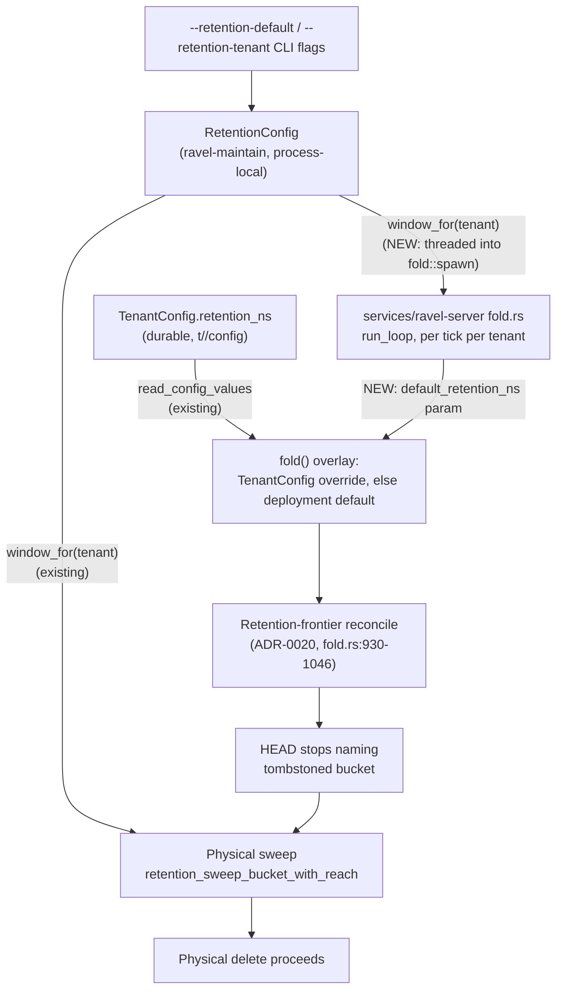

# 0078. Fold retention-frontier reconcile honors the deployment-wide retention default

Status: accepted

## Context

Issue #114. ADR-0020's delete-blocker fix has two halves: the physical sweep
refuses to delete an object a HEAD-referenced snapshot still names, and the
fold's retention-frontier reconcile pass is what drops a tombstoned bucket
from that snapshot so the sweep's block clears
(`crates/ravel-catalog/src/fold.rs:930-1046`,
docs/catalog-and-mvcc.md:540-595). Only the first half runs in a real
deployment.

The frontier reconcile pass is gated on `TenantConfig.retention_ns`
(`crates/ravel-catalog/src/fold.rs:765-777`, gate at `fold.rs:995`), the
durable per-tenant record at `t/<tenant_hash>/config`
(`sys.v1.TenantConfigRecord`, `proto/ravel/sys.proto:386`, ADR-0066 decision
6). Nothing in the running server ever writes that record. The CLI flags a
real deployment actually sets (`--retention-default`,
`--retention-tenant=<id>:<window>`) become a `RetentionConfig`
(`crates/ravel-maintain/src/config.rs:498`, built unconditionally at
`services/ravel-server/src/main.rs:248-253`), which is threaded only into the
Maintain-mode physical sweep (`main.rs:401-408`,
`crates/ravel-maintain/src/retention.rs:374`, `window_for`). It never reaches
fold. So in any deployment that only sets CLI retention flags,
`tenant_retention_ns` inside `fold()` is always `None`, the frontier
reconcile pass never runs, HEAD never stops naming an expired bucket, and the
sweep is permanently blocked on it. Storage grows without bound and the
`blocked_by_snapshot` gauge climbs every cycle with no operator remedy short
of a code change.

The only code that writes `TenantConfig.retention_ns` today is test
scaffolding (`crates/ravel-catalog/src/fold.rs:3580-3591`,
`crates/ravel-maintain/tests/retention.rs:617-624`), and the existing
sweep+fold end-to-end test has to manually construct both a `RetentionConfig`
(for the sweep) and a `TenantConfig` (for the fold) with the same numeric
window to make the scenario pass at all — the two sources of truth this ADR
closes.

This is not an isolated gap. `TenantConfig.indexed_fields` has the identical
disconnect: production ingest wires indexed-field config straight from CLI
flags (`main.rs:337-342`) and never consults `TenantConfig.indexed_fields`.
ADR-0066 decision 6 promised four fields (`lifecycle_state`, the
admission-limit fields, `retention_ns`, `indexed_fields`) as durable,
runtime-settable per-tenant overrides layered on a CLI-derived default; only
the first two actually got a write/read/apply loop wired up. The
`indexed_fields` half of this gap is out of scope here (reported, not fixed,
per this repo's unattended rule) and tracked separately.

`TenantConfig` is a proto-defined, versioned `sys/*`-class control object
(its own `format_version`, additive-evolution migration class per ADR-0066),
but it is not part of the catalog's commit/manifest/snapshot format family —
fold only ever reads it, never regenerates or embeds it. Nothing in this
ADR's decision touches a frozen catalog format, so the format-change skill's
procedure does not apply.

## Decision

Fold's frontier reconcile resolves a tenant's effective retention window the
same way `crates/ravel-ingest/src/lifecycle.rs`'s admission-limit refresh
already resolves admission limits: a CLI-derived deployment default/override
as the base, overlaid by the durable per-tenant `TenantConfig.retention_ns`
override when present. Concretely:

- `Catalog::fold()` (`crates/ravel-catalog/src/fold.rs`) gains one new
  parameter, a caller-resolved `Option<i64>` (this tenant's deployment-level
  default retention window, or `None` if none is configured). `ravel-catalog`
  does not gain a dependency on `ravel-maintain`'s `RetentionConfig` type —
  the same one-directional dependency `protection_horizon_ns` already
  respects (`crates/ravel-catalog/src/config.rs:86`, "mirrored from
  ravel-maintain's default, since the dependency runs the other way"). The
  caller resolves the value; `ravel-catalog` only ever sees a plain `i64`.
- Inside `fold()`, the effective window becomes `TenantConfig.retention_ns`
  (if the record exists and carries `Some`) else the caller-supplied default
  — including on a `TenantConfig` read failure or an absent record, both of
  which today mean "skip the frontier reconcile"; with this change they mean
  "fall back to the deployment default," which does not depend on that read
  at all. A tenant with neither a per-tenant override nor a deployment
  default still gets no frontier reconcile (nothing is being retired) — the
  one case that keeps behaving identically to today.
- `services/ravel-server/src/fold.rs`'s `FoldTaskConfig`/`spawn` gains
  access to the already-built `RetentionConfig` (currently threaded only
  into `MaintenanceTaskConfig`, `main.rs:401-408`). Each fold tick resolves
  `retention.window_for(&tenant)` per tenant and passes it into
  `Catalog::fold`.
- `services/ravel-server/src/main.rs` threads the one `RetentionConfig` it
  already builds unconditionally into `fold::spawn` alongside its existing
  `MaintenanceTaskConfig` use — one config, two consumers, no new parsing.
  No new CLI flags.
- Every other call site of `Catalog::fold()` (benches, sim, `ravel-cli
  catalog fold`, and test call sites across `ravel-catalog`, `ravel-maintain`,
  `ravel-server`) passes `None` for the new parameter, preserving today's
  behavior exactly, except the sweep+fold end-to-end test and its sibling
  fold-crate test, which pass a resolved default to prove the fix.
- `docs/catalog-and-mvcc.md:552-554` and the surrounding fold.rs doc
  comments (`fold.rs:761-764`, `fold.rs:992-999`) are corrected in the same
  commit: "a tenant with no per-tenant window gets no frontier reconcile" is
  no longer true; they now describe the override-over-default resolution.

## Rejected alternatives

**Write `TenantConfig.retention_ns` from CLI flags at process startup
(issue's option A).** `TenantConfig` is per-tenant, but the tenant set is
storage-discovered and grows after startup (ADR-0048 decision 3) — this is
the exact root cause ADR-0066 decision 6 already had to fix once for
`lifecycle_state` (a startup-frozen tenant view silently stopped maintaining
a tenant whose token was later removed). A true "write at startup" can't
cover a tenant onboarded afterward without becoming a recurring reconcile
loop anyway, at which point it is no longer a startup action — it is a new
per-tenant sync job whose entire purpose is mirroring a value the process
already holds (the CLI-parsed default) redundantly into N durable objects.
It also creates two writers of one CAS-replaced record: this sync job and,
once any operator-facing write path for `TenantConfig` exists, an operator
setting a real per-tenant override — the sync job would silently overwrite
it on its next cycle. Rejected: wrong direction for data that is genuinely
process-local config, not durable per-tenant state.

**Have the fold's frontier reconcile read `RetentionConfig` directly instead
of `TenantConfig` (issue's option B, read literally).** Read literally, this
would keep the sweep and fold on independent config paths but simply swap
which one is empty by default. Kept as an operator override at all (an
already-decoded `TenantConfig.retention_ns`) would then be a dead field with
no effect on fold, silently changing behavior for anyone who ever gets a
real per-tenant write path for it. `RetentionConfig`'s own doc comment
(`config.rs:494-495`) already states "only the sweeper reads it; resolvers
never do" — extending that same narrow-scoped struct into a second, unrelated
consumer with a different precedence rule than the sweep uses was rejected in
favor of feeding both fold and sweep from the same `window_for` resolution
and layering `TenantConfig` on top only in fold, matching the accepted
decision.

**Add a floor-validation / write API for `TenantConfig.retention_ns`.** No
production write path for `TenantConfig` exists yet for any field; adding
one is a larger, separately-scoped change (mirroring how `lifecycle_state`
and the admission limits already get an operator-facing write path would
need its own design). This epic only fixes the read side that already
silently fails; it does not add a new writer or new validation surface for a
record nothing here writes.

## Consequences

- An existing deployment already sitting on an unbounded `blocked_by_snapshot`
  backlog needs no manual remedy: upgrading and restarting is sufficient. The
  frontier reconcile's existing jump-handling (`frontier_reconcile_max_hours`,
  capped, oldest-first, `fold.rs:564-574`) already exists to drain exactly
  this kind of backlog — a long-unreconciled tenant is not a new code path,
  it is the same "folder stopped for a long time" case the fold already
  handles.
- Fold and the physical sweep now agree on a tenant's deployment-default
  retention window from the same `RetentionConfig` source, closing the
  latent divergence the existing e2e test had to paper over by hand-setting
  both sources to the same number.
- `ravel-catalog`'s public `Catalog::fold()` signature changes; every call
  site across `ravel-catalog`, `ravel-bench`, `ravel-sim`, `ravel-cli`, and
  `ravel-server` (tests and production) needs updating in the same change,
  which is why this ships as one task rather than split across crates.
- `TenantConfig.indexed_fields` has the identical CLI-flags-never-reach-it
  gap. Out of scope here; reported for separate follow-up.

## Refs

Refs: #114
