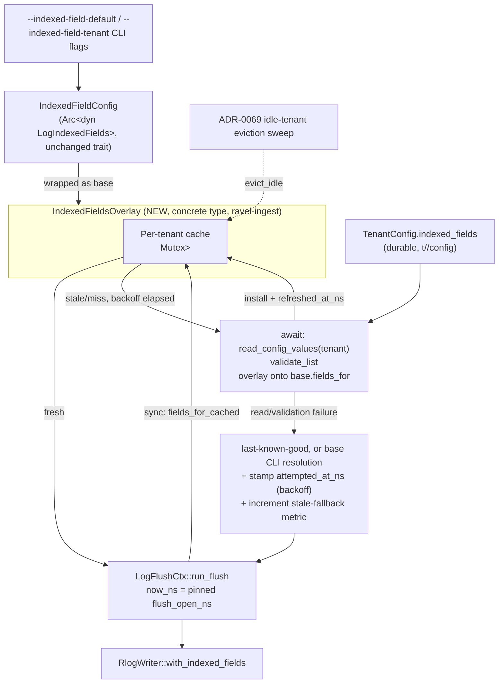

# 0079. Durable per-tenant indexed-field override via a cache-aside overlay

Status: accepted

## Context

Issue #139. ADR-0066 decision 6 names `TenantConfig.indexed_fields` (the
durable per-tenant record at `t/<tenant_hash>/config`,
`sysproto::TenantConfigRecord.indexed_fields`) as one of four fields meant
to move off process flags and into durable, runtime-overridable per-tenant
state: lifecycle state, admission limits, retention, and indexed-field
config. Only the first two actually got a runtime write/read/apply loop
built. ADR-0078 just closed the retention gap. `indexed_fields` is worse
off than retention_ns was: it has **zero production readers anywhere in the
repo**. The only thing that actually decides which attribute fields get
indexed at ingest time is `services/ravel-server/src/postings_config.rs`'s
`IndexedFieldConfig`, built once at startup from CLI flags
(`--indexed-field-default`/`--indexed-field-tenant`, `main.rs:337-342`) and
resolved once per log flush via `fields_for(tenant_hash)`
(`postings_config.rs:124-129`), called by
`LogFlushCtx::run_flush` (`crates/ravel-ingest/src/log_shard.rs:272`). The
module's own doc comment states plainly that changing this list today means
"editing `--indexed-field-default`/`--indexed-field-tenant` and restarting"
— contradicting ADR-0066 decision 6's promise of a no-restart per-tenant
override.

Applying the durable override here is not a copy-paste of ADR-0078's fix.
Fold reads `TenantConfig.retention_ns` once per fold cycle (every ~5
minutes, an already-coarse cadence); `fields_for` is called **once per log
flush**, up to several times a second per tenant at default ingest
settings (`max_flush_delay` 500ms, `flush_tick` 200ms, `shard_count` 4). A
naive per-call `read_config_values` would add an object-store GET to every
flush of every tenant on every process — out of budget by ADR-0066 decision
6's own cost line, which assumes one GET per tenant per **horizon**, not
per call.

Two existing patterns in this codebase already solve "durable per-tenant
override, applied to a live hot-path component, without a per-call read":

- **The admission-limits horizon loop**
  (`services/ravel-server/src/lifecycle_refresh.rs`,
  `crates/ravel-ingest/src/lifecycle.rs`): a background task enumerates a
  known tenant set every ~60s, reads each tenant's `TenantConfig`, overlays
  it onto a CLI-derived base (`overlay_admission_limits`), and re-invokes
  `AdmissionController::set_tenant_limits`. It requires its own
  "known tenant set" — and neither of the two existing tenant-enumeration
  mechanisms fits without change: `discover_and_restrict_by_lifecycle` does
  a full storage LIST (right universe, wrong cadence — wired to
  fold/maintain, not ingest); the admission loop's own set is narrower
  (tenants named by `--limits-file` or present in the `sys/auth` map),
  which would under-cover a tenant with neither.
- **`GenerationSwitch<H>`** (`crates/ravel-ingest/src/generation.rs`), the
  shard-routing cache already shared by the metrics, log, and span
  routers: a per-tenant, bounded-staleness (60s) in-memory cache with a
  synchronous fast-path lookup (`route_cached`) and an async, caller-driven
  refresh on a stale/missing entry (`log_router.rs::active_set`: check
  cache, await a fresh read on miss, install it, fall back to a bounded
  grace-extend if the re-read itself fails). This runs on an even hotter
  path than log flush (once per record dispatch, not once per flush), has
  no discovery loop, and needs no up-front tenant enumeration: a tenant's
  cache entry is populated the first time it is actually seen.

## Decision

Model the indexed-field override on `GenerationSwitch`'s cache-aside shape
(sync fast path, async caller-driven refresh on miss, lazy per-tenant
population), not the admission-limits background-loop shape — but as a
concrete wrapper type, not a reshaped public trait, and with an explicit,
narrower failure discipline than `GenerationSwitch`'s grace-extend (see
Safety below).

- A new concrete type, `IndexedFieldsOverlay` (`ravel-ingest`), wraps the
  existing `Arc<dyn LogIndexedFields>` (the CLI-derived base/override,
  unchanged) plus a per-tenant cache —
  `TenantHash -> (resolved fields, refreshed_at_ns)` behind a `Mutex`
  (mirroring `GenerationSwitch::Inner`, not `ArcSwap`/`RwLock`: the read
  side already tolerates a lock acquisition, and a lock lets the miss path
  install a freshly-read value without a lost-update race).
  `ravel_ingest::LogIndexedFields`'s public trait is untouched — it keeps
  its single sync method, meaning "resolve the CLI base/override," and
  every existing implementor (including test doubles like
  `NoIndexedFields`) is unaffected. `IndexedFieldsOverlay` is a concrete
  struct `LogFlushCtx` holds directly, not a trait object; only the one
  call site (`run_flush`) changes.
- `run_flush` (already `async`) does the same two-step dance
  `log_router.rs::active_set` already uses: a sync
  `IndexedFieldsOverlay::fields_for_cached(tenant, now_ns)` fast path
  returns the cached resolved list if fresh (`<=` a staleness horizon,
  mirroring `GenerationSwitch::TenantView`'s inclusive-fresh boundary and
  60s horizon rather than `crate::lifecycle::StalenessGate`, which is a
  process-wide fail-closed gate and not a fit for a per-tenant cache); on
  a miss or stale entry, `.await`
  `IndexedFieldsOverlay::refresh(tenant, now_ns)`, which reads
  `TenantConfig` for that one tenant (`read_config_values`) and overlays
  it onto the wrapped base's own `fields_for` resolution exactly as
  `overlay_admission_limits` overlays admission limits: `TenantConfig`'s
  `indexed_fields: Some(list)` — list possibly empty, a valid explicit
  opt-out — replaces the resolved list outright; `None` leaves the base's
  own tenant-override-or-default unchanged. **`now_ns` is the flush's own
  pinned `flush_open_ns`** (`log_shard.rs:197-201`'s pinned-identity
  contract forbids re-reading the clock inside `run_flush`), not a fresh
  clock read — this also keeps the cache deterministic under test.
- **Failed re-read discipline (not grace-extend — see Safety):** on a
  failed `TenantConfig` read, the overlay keeps serving the last
  successfully-resolved value for that tenant if one exists, or the
  wrapped base's CLI-only resolution if the tenant has never been
  refreshed yet — unbounded, no horizon cutoff, no failing closed. To keep
  this cheap under a sustained store outage, a failed re-read stamps an
  `attempted_at_ns` and the overlay does not retry that tenant again until
  a short backoff elapses (mirroring `lifecycle_refresh.rs`'s
  `DEFAULT_ON_MISS_INTERVAL_NS` shape) — so a degraded object store adds
  at most one failed GET per tenant per backoff window, never one per
  flush, and never spends any of `deadline_ns` (the same budget
  `put_data_object_with_retry` races for the flush's data PUT,
  `log_shard.rs:321-333`) on a read whose result doesn't gate the flush.
- **Validation on read:** a durable list read from `TenantConfig` passes
  through the same `validate_list` (empty/duplicate names) the CLI-parsed
  policy already uses (`postings_config.rs:151-167`) before it replaces
  the resolved list. A list that fails validation is treated exactly like
  a failed re-read (serve last-known-good/base, stamp the backoff, count
  the metric below) — a malformed durable record must never silently
  produce a writer that indexes the wrong set or panics on an empty name,
  the same discipline the CLI path already has.
- **Visibility (mandated by ADR-0066 decision 6's own transport
  discipline):** every flush resolved from a stale cached value or a
  failed-re-read fallback (rather than a fresh durable read) increments a
  counter, mirroring `GenerationSwitch`'s grace-extended-stale metric.
  Without this, a tenant whose durable override is permanently unreadable
  or malformed would have its override silently never apply — exactly the
  silent-gap class issue #139 is about, just moved one layer down.
- **Eviction:** the overlay's per-tenant cache is wired into the same
  idle-tenant eviction sweep `GenerationSwitch::evict_idle` already uses
  (ADR-0069 decision 2), so a tenant that stops flushing does not leave an
  entry behind forever.
- No new background task, no new tenant-discovery mechanism: a tenant's
  cache entry is populated lazily, the first time that tenant flushes,
  exactly as `GenerationSwitch` populates a tenant's shard-generation view
  on its first write. This sidesteps the admission-limits loop's own
  "which existing tenant set do we reuse" problem entirely, because there
  is no up-front enumeration to get right.
- The empty-list-is-a-valid-opt-out semantics already fully modeled at the
  storage layer (`TenantConfig.indexed_fields: Option<Vec<String>>`, proto
  `IndexedFieldConfig` sub-message presence, both already correctly
  round-tripped and tested) carry through unchanged; this ADR adds no new
  representation for that distinction, only a consumer of it.
- **Scope: read side only.** As with `retention_ns` before ADR-0078, no
  production code path writes `TenantConfig.indexed_fields` today — every
  `set_tenant_config` call in the repo (CLI, operator, server) is test
  scaffolding. This ADR makes the read/apply side actually work once a
  write path exists; it does not add one. `TenantConfig`'s existing
  admission-limits horizon loop (`lifecycle_refresh.rs`) already fetches
  the whole `TenantConfig` record — including `indexed_fields` — per
  covered tenant per horizon and discards that field; a covered tenant is
  therefore now read twice per horizon (once by that loop, once lazily by
  this overlay). Accepted as a minor, bounded cost rather than coupling
  the two mechanisms together for a one-field saving.

## Safety: why unbounded serve-stale is correct here, unlike `GenerationSwitch`

`GenerationSwitch::try_grace_extend` is not the right precedent for this
overlay's failure behavior, and citing it would be misleading. Its bounded
window exists because stale shard *routing* can be provably wrong past a
reshard's lead-time floor, so it fails closed once that provable window
closes. Indexed-field config has no analogous correctness hazard:
postings are per-object, self-describing, advisory pruning hints written
from that object's own records — a query-time probe of an unindexed field
in a given object returns "not indexed here" and falls through to bloom
filtering plus an exact scan of that object, per
`crates/ravel-logseg`'s reader. Nothing on the query side
(`ravel-query`/`ravel-sql`/`ravel-promql`) consults `IndexedFieldConfig` or
`TenantConfig.indexed_fields` at all — indexed-field config only ever
affects what a writer chooses to index at write time, never what a reader
is entitled to trust. Stale or CLI-only-resolved config can therefore only
ever cost extra scan work or a missing index in some objects; it can never
produce a wrong query result. The correct precedent is ADR-0057's
last-known-value discipline (`refresh_tenant_limits_once` "keeps the
last-applied limits, never resets on a transient fault"), not
`GenerationSwitch`'s fail-closed grace window — and this ADR's unbounded
serve-stale is the "approximation is opt-in and visible" case CLAUDE.md's
invariants describe, made visible by the metric above, not a silent
violation of exact-semantics-by-default (query results stay exact
regardless; only ingest-time index selection is approximate under
staleness).

## Rejected alternatives

**Copy the admission-limits background-horizon-loop shape.** Rejected
because it requires answering "what is the known tenant set" up front, and
neither existing mechanism fits without modification: a full storage LIST
(`discover_and_restrict_by_lifecycle`) is the right universe but the wrong
cadence (fold/maintain, not ingest — and ingest and maintain can be
different processes under different `--mode`s); the admission loop's own
narrower set (flag-named or auth-map-present tenants) would silently
under-cover a tenant seen only via ingest. The cache-aside design needs no
answer to this question at all.

**Read `TenantConfig` on every flush.** Rejected outright: at default
ingest settings this adds an object-store GET to multiple flushes per
second per tenant, far outside ADR-0066 decision 6's own accepted cost
budget of one GET per tenant per horizon per process.

**Reuse `GenerationSwitch<H>` generically (parameterize `H` as
`Vec<String>`).** Rejected: `GenerationSwitch` is generic over shard-handle
sets specifically because multiple tenants can dedupe onto the same
generation's shard set (`Inner::sets`, keyed by generation id, shared
across tenants). Field-override lists have no analogous dedup-by-generation
structure — forcing this shape on would carry dead complexity for no
reuse benefit. `GenerationSwitch`'s cache-aside *pattern* (sync fast path,
async caller-driven refresh) is what's reused; its generic type, and its
fail-closed grace-extend failure behavior (see Safety below), are not.

**Reshape the public `ravel_ingest::LogIndexedFields` trait itself** (a
sync fast-path method plus an async refresh method on the trait). Rejected
in favor of a concrete `IndexedFieldsOverlay` wrapper type: the trait's
only job is "resolve the CLI base/override," and every implementor
(including test doubles) would otherwise need to carry cache semantics for
no benefit. A concrete wrapper confines the new cache/refresh/backoff/
eviction logic to one type with one test surface, and changes exactly one
call site (`run_flush`).

## Consequences

- `ravel_ingest::LogIndexedFields`'s public trait is untouched. A new
  concrete `IndexedFieldsOverlay` wraps it; `LogFlushCtx::run_flush` gains
  the cache-aside orchestration `log_router.rs::active_set` already has a
  working, tested precedent for, using its own pinned `flush_open_ns` as
  the staleness clock. `LogIngestRouter::new_with_indexed_fields` and
  `LogShardActor::new`'s parameter type changes from
  `Arc<dyn LogIndexedFields>` to `Arc<IndexedFieldsOverlay>` — the trait
  is untouched, but these two constructor signatures are not.
- No new CLI flags, no new background task, no new tenant-discovery
  mechanism.
- A tenant's very first flush(es) after a durable override is written may
  still observe the pre-override (CLI-only) resolution until the cache is
  first populated for that tenant — the same bounded, accepted staleness
  every other `GenerationSwitch`-style overlay in this codebase already
  has, not a new correctness gap. Unlike `GenerationSwitch`, this staleness
  is genuinely unbounded on a persistent read failure (see Safety) rather
  than eventually failing closed — made visible via the stale-fallback
  metric rather than silently indexing the wrong set forever.
- A sustained object-store outage costs at most one failed GET per tenant
  per backoff window, never one per flush, and never borrows from a
  flush's PUT deadline budget.
- The cache is wired into the existing ADR-0069 idle-tenant eviction
  sweep, so it does not grow unboundedly with tenant churn.
- Admission limits keep their existing background-loop mechanism; this
  ADR does not consolidate the two into one abstraction (rejected above,
  no reuse benefit). A tenant covered by that loop is read twice per
  horizon (once there, once lazily here) — accepted as a minor, bounded
  cost.
- Read side only: no production write path for `TenantConfig.indexed_fields`
  exists yet (mirrors ADR-0078's identical scoping for `retention_ns`).

## Refs

Refs: #139
