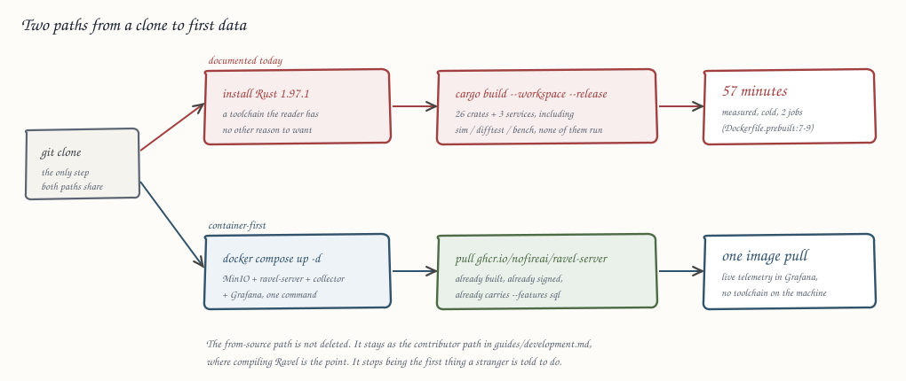

# 0081. Container-first quickstart and executable README verification

Status: accepted

## Context

Ravel's documented first run is `make demo`. That target declares `demo: build`,
and `build` is `cargo build --workspace --release` over all 26 crates and 3
services. The workspace it compiles includes `ravel-sim`, `ravel-promql-difftest`,
`ravel-bench`, and `ravel-failure-tests` — dev-only crates the demo never
executes. This repository has already measured what that costs: a cold release
build of the workspace at `CARGO_BUILD_JOBS=2` "took 57 minutes on the 8 GiB
arm64 development host" (`Dockerfile.prebuilt:7-9`). It also requires a Rust
toolchain pinned to 1.97.1, which a reader evaluating an observability database
has no other reason to install. Even the demo's input needs it: the OTLP fixture
comes from `cargo run -p ravel-server --example gen_otlp_fixture`.

A faster path already exists and is not used. Since ADR-0037, `ravel-server` and
`ravel-operator` publish to GHCR on every release tag. The packages are
anonymously pullable today (tags `0.9.0`, `0.9.1`, `0.9.2`, `latest`), each a
signed OCI index carrying an SBOM and build provenance. The shipping image is
built with `cargo build --release --locked -p ravel-server --features sql`
(`Dockerfile:46`), so it carries a capability the from-source demo does not:
`POST /api/v1/sql` works out of the box. The README documents pulling these
images twenty lines *below* the quickstart that tells the reader to compile
instead.

Nothing in `deploy/docker-compose/` runs Ravel. The directory holds one file,
`minio.yml`, which starts MinIO and creates a bucket.

Separately, the README's `## Query it` section is wrong in three independent
ways, and each is the kind of error that fails on a reader's first action:

| README says | Reality |
|---|---|
| `localhost:8080` | The default bind is `127.0.0.1:4318` (`services/ravel-server/src/config.rs:44`). The string `8080` appears nowhere in `ravel-server`'s sources. |
| `SELECT * FROM metrics` | The registered tables are `samples`, `logs`, and `spans` (`crates/ravel-sql/src/session.rs:252-259`). There is no `metrics` table. |
| no `Authorization` header | Query requires `Authorization: Bearer <token>`, the same as ingest (`docs/guides/query.md:6`). |

No gate covers this. The `doc-scripts` CI job runs `scripts/check-doc-drift.sh`
(derived counts inside `docs/query-engine.md`) and the Python unit tests; no job
executes a README command. In a repository with 16 CI jobs and roughly 3,800
test attributes, the landing page is the one untested surface — and it is the
first surface a stranger executes. Issue #125 tracks one of the three, under a
body that describes an unrelated defect.

## Decision

**1. A published-image `docker compose` stack is the documented first run.**

`deploy/docker-compose/ravel.yml` brings up MinIO, the bucket-creation
one-shot, `ravel-server` from `ghcr.io/nofireai/ravel-server` (tag pinned to the
current release, overridable through a `RAVEL_IMAGE` variable), an OpenTelemetry
Collector producing real telemetry, and Grafana with a provisioned Ravel
datasource. `docker compose up -d` becomes the README's first command. No Rust
toolchain, no cargo invocation, no compile.

Every published host port binds loopback explicitly (`127.0.0.1:4318:4318`, and
likewise for gRPC, MinIO, and Grafana). The container process must bind
`0.0.0.0` inside its own namespace, but a bare `4318:4318` mapping publishes on
every host interface, and this stack ships a checked-in bearer token in front of
a writable ingest endpoint. Without the loopback prefix the quickstart puts an
effectively unauthenticated write path on the reader's LAN, which would
contradict the caveat the consequences below promise.

The pinned default tag is the one configuration no verifying job exercises: the
per-PR job overrides `RAVEL_IMAGE` with the image it just built, and the weekly
lane overrides it with `:latest`. The weekly lane therefore runs twice — once
against `:latest`, once against the compose file's own default, unmodified — so
a stale pin surfaces as a scheduled failure rather than as a reader's first
command pulling a tag that no longer resolves.

**2. The compose file supplies Ravel's full argument vector.**

The image deliberately has no default `CMD` — the root `Dockerfile` records that
"the operator supplies every argument from the CRD." The compose service
therefore passes them explicitly: `--mode all --store s3 --listen-http
0.0.0.0:4318 --listen-grpc 0.0.0.0:4317 --shards 4 --tenant-token
demo-token=demo-tenant`, with the `RAVEL_S3_*` environment fallbacks supplying
the MinIO endpoint, bucket, region, and credentials.

Binding `0.0.0.0` is forced by the container boundary, and it has one
consequence worth stating: `--dev-insecure-tenant-header` "refuses to enable
unless `--listen-http` binds a loopback address" (`config.rs:70-72`), so the
quickstart cannot use it. The demo authenticates with a real bearer token
against a real tenant map, which is what a deployment does. The convenience flag
would have taught the reader a shortcut that does not exist in production.

**3. The demo's data generator is an OpenTelemetry Collector, not a Rust example.**

`otel/opentelemetry-collector-contrib`, configured with a `hostmetrics`
receiver, a `bearertokenauth` extension, and OTLP exporters pointed at the Ravel
service. Beyond removing the toolchain dependency, this buys two things a
checked-in fixture cannot: the quickstart exercises the same OTLP path a real
user will configure, and the first Grafana screen shows the reader's own machine
rather than a synthetic counter named `demo_requests_total`.

**4. `make demo` survives, and stops being the front door.**

It remains the from-source path for contributors who are changing Ravel's code
and need to run their own build, documented under `docs/guides/development.md`.
`make quickstart` wraps the compose path for symmetry. The README leads with
compose; `docs/guides/getting-started.md` presents compose first and the
from-source flow second.

**5. README command blocks are marked, and executed in CI.**

Blocks the reader is meant to run carry an explicit marker comment.
`scripts/check-readme-commands.sh` extracts the marked set, runs each against a
live stack, and asserts the documented outcome — not merely a zero exit, since
`curl` exits zero on an HTTP 401 and on a JSON error envelope. A wrong port,
table name, or missing header fails the job.

Two constraints follow from decision 3, and are binding on which blocks may be
marked. CI brings up **the same compose file the reader runs**, collector
included, and adds `telemetrygen` alongside it purely to inject a deterministic
series for assertions. A marked block may therefore assert only an outcome both
generators produce: the shapes that hold regardless of which series exist (an
HTTP 200, a `"status":"success"` envelope, a non-empty `data.result`, a named
`samples`/`logs`/`spans` column set), or a series `telemetrygen` guarantees. A
block whose assertion depends on a `hostmetrics` series name stays unmarked,
because a CI runner's metric set is not the reader's laptop's.

Each marked block runs behind an explicit readiness wait — the stack's health
endpoints, then a bounded poll until the first query returns a non-empty result
— never a fixed sleep. Data-presence assertions otherwise race collector scrape
cadence and flush delay, and a race in the job that exists to stop the README
lying would be the worst possible flake.

**6. The verifying job builds two binaries, on the runner, not the workspace inside Docker.**

`cargo build --release -p ravel-server --features sql` **and** `cargo build
--release -p ravel-cli`, with the shared sccache and `rust-cache`, then `docker
build --file Dockerfile.prebuilt --target server` to assemble a runtime image
from those binaries. This is the same split ADR-0053 D5 established for the kind
lane, applied to a far smaller build, and it means the job verifies **the pull
request's own code**, not a previously released image.

`ravel-cli` is not optional and not a convenience here: `Dockerfile.prebuilt`'s
`server` target COPYs both binaries (`Dockerfile.prebuilt:65,72`), deliberately,
because ADR-0050's store-qualification Job runs `ravel-cli store qualify` from
inside that image. A build context holding only `ravel-server` fails the docker
build outright. Building the second binary against a warm cache is the cheap
option; changing `Dockerfile.prebuilt` to make the CLI conditional is not, since
that file is shared with the kind lane and the change would land its blast
radius there for no benefit to this one.

**7. The job runs even when the change is documentation-only.**

`changes.outputs.docs_only == 'true'` currently short-circuits the compile lanes.
This job must be exempt from that gate, because a README-only edit is precisely
the change it exists to catch. It carries its own path filter: `README.md`,
`deploy/docker-compose/**`, `demo/**`, `scripts/check-readme-commands.sh`,
`Dockerfile.prebuilt`, and `services/ravel-server/**`.

**8. A weekly lane runs the same script against the published image.**

The per-PR job proves the README matches `HEAD`. It cannot prove the README
matches what a reader actually pulls, because a merged doc change ships before
the next release tag does. A scheduled run of the same script with `RAVEL_IMAGE`
set to `ghcr.io/nofireai/ravel-server:latest` closes that window, plus the
unmodified-default run from decision 1.

That window is also the lane's one legitimate red state, and the lane cannot
tell it apart from a real defect: between merging a README that documents
unreleased behavior and cutting the release, `:latest` genuinely does not do
what the README says. The policy is therefore that **`main`'s README documents
released behavior**. A change that documents behavior not yet on a release tag
either waits for the tag or ships with those blocks unmarked until it lands. If
the weekly lane goes red, the remediation is to cut the release or correct the
README, never to wait it out.

Failure routing is part of the decision, not an operational afterthought: a red
weekly run files an issue automatically, labelled and assigned, rather than
emitting a notification nobody owns. This repository has already had a
chronically red job whose later steps went unread; a scheduled lane with no
routing rots the same way, and a rotted lane is worse than no lane because it
launders a real failure as background noise.

**9. The kill-and-recover demo is an assertive script; the GIF is a recording of it.**

`demo/kill-and-recover.sh` ingests under strict acknowledgement, captures the
`x-ravel-commit-token`, hard-kills the server container, restarts it from empty,
queries with `min_commit_token`, and exits non-zero if the sample is absent or
the token is unsatisfiable. The artifact under test is the script, which fails
loudly on its own; the GIF is a recording of a passing run. Recording is a local
step, not a CI step — CI runs the assertions.

The job that runs it is the per-PR `quickstart` job from decision 6, as a step
after the marked README blocks. Its path filter already covers `demo/**`, it
already has the stack up, and it is the only lane that both has docker and gates
a merge. Naming it here is not a formality: the fleet executors that write this
script cannot run docker, so without an explicit job attachment the script would
merge unproven, which is precisely the failure mode this ADR exists to close for
the README.

## Rejected alternatives

**Run the README commands against `ghcr.io/nofireai/ravel-server:latest` on
every pull request.** It is the cheapest possible job — no build at all. It
verifies the wrong thing: a pull request that renames a flag or moves a route
passes, while shipping a README that breaks at the next release. Kept as the
weekly lane in decision 8, where "does the doc match the image a user pulls" is
exactly the question.

**Build the shipping root `Dockerfile` in the verifying job.** Its builder stage
recompiles the entire workspace inside Docker at `CARGO_BUILD_JOBS=2` with no
access to the workflow's sccache — the 57 minutes cited above. The existing
`docker-build` job already carries that cost, and only behind a
Dockerfile-changed guard with a 60-minute timeout. A required per-PR check
cannot.

**Reuse the images `k8s-build` already assembles.** Attractive, since that job
does exactly the runner-build-plus-prebuilt-assemble dance. It is gated behind
the `run-k8s` pull-request label and budgets 55 minutes, so most pull requests
skip it entirely. A required check cannot depend on a job that usually does not
run.

**Make `ravel-cli` conditional in `Dockerfile.prebuilt` so the job builds one
binary.** Saves one warm-cache build. Rejected: that file is shared with the
kind lane, where the CLI is load-bearing for ADR-0050's store-qualification Job,
so the change would put a k8s-lane regression risk against a saving measured in
seconds.

**Keep `make demo` as the quickstart and document the image pull more
prominently.** This treats the problem as awareness. It is not: the measured
cost of the recommended path is the blocker, and no amount of adjacent prose
makes a 57-minute compile a reasonable first action.

**Generate the quickstart's data with `telemetrygen`.** Simpler than a collector
config, and deterministic. Rejected as the default because its synthetic series
make a weak first Grafana screen and it exercises none of the collector pipeline
a user will actually deploy. It is the better choice inside CI, where
determinism outranks realism, so the check job adds it alongside the collector
and the quickstart does not.

**Extract and run every fenced block in the README, doctest style.** No marker
to maintain, no way to forget one. Rejected because the README legitimately
contains blocks that must not run in CI: the `cosign verify` example names a
specific historical tag, and `docker pull` of a moving tag is not an assertion.
Explicit marking keeps the executable set auditable, and an unmarked block that
should have been marked is a reviewable omission rather than a silent one.

**Ship the Grafana dashboard as the whole demo.** It proves data flows. It does
not prove the data survives a process kill, which is Ravel's actual claim. The
dashboard is the hook; the kill script is the evidence.

## Consequences

- Time to first useful behaviour drops from tens of minutes to one image pull.
  The reader's first payoff becomes a Grafana screen rather than two lines of
  JSON.
- The README acquires a gate. A wrong port, table, or header in a marked block
  now fails CI instead of failing a stranger.
- New per-PR CI cost: two release builds (`ravel-server --features sql` and
  `ravel-cli`) against a warm cache, plus a compose bring-up and the assertions.
  The job lands advisory and is promoted to required once its warm-cache budget
  has been observed on the reference runner, matching how ADR-0070's Tier B gate
  was introduced. Promotion should be faster than Tier B's, and the probation is
  for budget only: Tier B's caution was timing noise, and this job's assertions
  are deterministic, so a red run here is a defect rather than a measurement.
- A documentation-only pull request that touches `README.md` stops being nearly
  free in CI. Today `docs_only` skips all 14 compile lanes — PR #171, the stub
  that claimed this ADR number, skipped every one of them. Once this job is
  required, a README-touching docs PR carries two release builds and a compose
  bring-up on its merge path. That is the intended trade and the whole point of
  decision 7, but it is a real latency cost on the most common PR shape in a
  docs-heavy repository, and it is stated here rather than discovered.
- The quickstart's SQL surface exists because the image carries `--features
  sql`; the from-source `make demo` still does not. The guides must state which
  path gives which capability rather than describing one surface.
- `minio-data/` is already gitignored and shared with the existing MinIO stack.
  The compose path must tolerate a populated directory across runs rather than
  requiring the reader to delete it.
- Grafana's provisioned datasource carries the demo bearer token in a checked-in
  file. It is a fixed development credential against a local MinIO with a fixed
  development secret, in the same class as the existing
  `ravel`/`ravel-dev-secret` pair in `minio.yml`, and the quickstart docs must
  say plainly that none of these values are for any deployment reachable from a
  network. Decision 1's loopback-only port mappings are what make that caveat
  true rather than aspirational. The token value stays self-evidently a
  placeholder (`demo-token`), both so no reader mistakes it for a generated
  secret and so secret scanners do not flag the repository.
- No frozen format changes: no RSEG, RLOG, or RSPAN layout change, no protobuf
  schema change, no series-identity or commit-token change, no object-key layout
  change. No crate under `crates/` and no service under `services/` changes
  behavior. This ADR is documentation, deployment manifests, demo scripts, and
  CI only.

## Refs

Refs: #170
