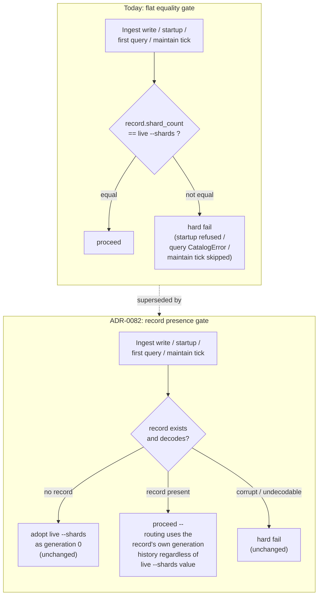

# ADR-0082: Provisioning shard-count drift tolerance for an evolving default

Status: Accepted

## Context

ADR-0076 decision 2 makes per-tenant shard count an operator-facing cost
control, and recommends lowering the shipped default (currently 4) since
request cost is linear in shard count. #147 (T4) shipped the per-tenant
mechanism (`spec.shardOverrides`, driving ADR-0052's `append_generation`).
#166 was opened to flip the *global* `--shards` default, deferred out of
#147 because of an upgrade hazard. This ADR resolves that hazard.

**The hazard is bigger than an upgrade caveat.** Provisioning enforcement
(`crates/ravel-catalog/src/provisioning.rs`, `validate_record`) requires a
tenant's frozen generation-0 `shard_count` scalar to equal the deployment's
*live* `--shards` config value, with no tolerance for mismatch, at four
call sites — the fourth is the largest practical blast surface and is easy
to undercount if you stop at the obvious three:

- **Ingest first-write path**
  (`services/ravel-server/src/provisioning.rs:122-158`,
  `ProvisioningRecordWriter::ensure`, wired into every ingest handler):
  `is_hard_failure` (`services/ravel-server/src/provisioning.rs:65-74`)
  classifies `ShardCountMismatch` as hard, so **every ingest request for
  every existing tenant fails**, not once at startup but on an ongoing
  basis, until the tenant is somehow remediated. This is the dominant
  surface, not the static-startup case below.
- **Static tenant startup validation**
  (`services/ravel-server/src/main.rs:171`, `validate_static_provisioning`):
  a mismatch on *any* `--tenant-token`/`--maintain-tenant` entry refuses the
  server from starting at all.
- **Dynamic tenant first touch**
  (`crates/ravel-catalog/src/catalog.rs:220`, `enforce_provisioning_once`,
  wired on by `services/ravel-server/src/query.rs:119`): a mismatch fails
  that tenant's first query per process with a typed `CatalogError`.
- **Maintain loop** (`services/ravel-server/src/maintain.rs:1054`): softest
  of the four — logs, increments
  `ravel_provisioning_shard_count_mismatch_total`, skips that tenant's tick.

`append_generation`'s own doc comment states the scalar is "never changed"
(`provisioning.rs:1080`). **ADR-0052 already recognized this check needed to
change and left the replacement semantics unspecified — this ADR supplies
them.** ADR-0050 section 5 originally stated the design intent, pre-dating
resharding: *"`shard_count` remains immutable per (tenant, signal)... this
decision makes the current value safe, not changeable."* ADR-0052 section 1
(`docs/adrs/0052-online-resharding.md:138-140`) explicitly revisited this:
"startup/first-touch validation are unchanged; validation now compares the
full generation history, not one scalar." Its sequencing note (line 284-286)
is more direct still: "This ADR does not change the provisioning record's
validation choke points; it changes what they compare." The shipped
implementation kept the scalar-equality gate anyway — the code comment at
`provisioning.rs:862-867` rationalizes it post hoc ("the configured value
still equals it — a reshard never touches gen 0") — because ADR-0052 never
specified what "compare the full history" should mean when no coherent
single answer exists for a resharded tenant. That gap is exactly what made
**T4's own per-tenant reshard mechanism unable to clear this check**: a
reshard never touches generation 0, so a tenant deliberately resharded to
the new default via `shardOverrides` still fails the equality check
forever, because the check compares against generation 0, not the active
generation.

The practical consequence: as the code stands today, lowering the global
default breaks ingest for every existing tenant on an ongoing basis (not
just server startup), and there is no remediation available through any
currently-shipped mechanism, including the one this epic just shipped.

**The write and read paths are not at risk.** Independent research
confirmed both are already generation-aware and do not depend on this
equality check for correctness:

- **Read**: `Catalog::read_scan_generations`
  (`crates/ravel-catalog/src/catalog.rs:271-286`) reads the tenant's actual
  durable generation history when a record exists; the live config value is
  used only as the generation-0 fallback when no record exists at all.
- **Write**: `GenerationSwitch::refresh`/`load_generations`
  (`crates/ravel-ingest/src/generation.rs:285-320,372-391`) decode the
  tenant's real provisioning record and route on its actual generation
  history; the live `IngestConfig.shard_count` (`default_count`) is used
  only when `StoreError::NotFound` — i.e. the tenant genuinely has no
  record yet.

So the equality check is not load-bearing for routing correctness. It
predates ADR-0052 and encoded a true invariant in a world with exactly one
valid shard count ever. That world no longer exists: per-tenant divergence
is now a first-class, intentionally supported feature. The check is
testing an invariant that ADR-0052 already made false by design, and is
now indistinguishable from "operator changed the fleet-wide default,"
"operator's fleet is mid-migration," and "this tenant was deliberately
resharded" — treating all three as the same fatal error.

## Decision

**Once a tenant already has a provisioning record, stop requiring its
frozen generation-0 `shard_count` to equal the deployment's live `--shards`
config value.** The fix is a single change in `validate_record`
(`provisioning.rs:853-861`) — every enforcement call site listed above
(`ProvisioningRecordWriter::ensure`, `validate_static_provisioning`,
`enforce_provisioning_once`, the maintain loop) routes through
`validate_or_adopt`/`validate_record`, so one change covers all four:

- If a record exists and decodes successfully (`read_generations_checked`
  succeeds), treat it as valid regardless of what its generation-0 scalar
  is relative to the live config default. Routing correctness already
  comes entirely from the generation history via `GenerationSwitch` /
  `active_shard_count`, independent of this comparison — nothing about
  removing the equality requirement changes what shard count a write or
  read actually uses.
- Corrupt or undecodable records still fail closed exactly as today
  (`read_generations_checked`'s existing error path is untouched — this
  ADR only removes the `shard_count != shard_count` equality branch in
  `validate_record`, not the structural/corruption checks around it).
- A tenant with **no** record still adopts the live config default as
  generation 0, exactly as today (`AbsentPolicy::CreateFromConfig`,
  `AbsentPolicy::AdoptIfData`) — new tenants are unaffected.
- `ShardCountMismatch` as an error variant can be removed once no caller
  can still produce it, or kept dead-documented if removal churns call
  sites unnecessarily — a decision left to the implementing task, not
  fixed here.
- `ProvisioningCheck::Matched` (`provisioning.rs:754-769`) is returned by
  `validate_or_adopt` whenever a record is present; its name and doc
  comment currently promise an equality match. Rename or redoc it (e.g.
  `RecordPresent`) so it stops asserting something no longer checked.
  `ravel-cli provision adopt` (`services/ravel-cli/src/provision.rs:68-73`)
  prints "already provisioned; recorded shard_count matches {shards}" on
  this result today — update the message so it doesn't claim a match that
  was never verified post-change.
- Keep drift *observable* even though it stops being fatal: log at info
  level (and keep incrementing a metric, distinct from the corruption-only
  `ravel_provisioning_shard_count_mismatch_total`) whenever a record's
  gen-0 differs from the live config default, so an operator can still see
  which tenants are running below/above today's default without it
  blocking anything.
- One fail-closed path is intentionally untouched and worth naming: a
  tenant with pre-ADR-0050 shard data and **no** record still refuses
  adoption under a lowered default via `AdoptionWouldHideData`
  (`provisioning.rs`, scenario 2 of `validate_or_adopt`'s doc comment) if
  any observed shard index would fall outside the new, lower count. That
  tenant needs an explicit `provision adopt` at its true count, not an
  automatic pass — this ADR does not change that.

This makes the global `--shards` default what its name should already
imply: **a default for new tenants**, not an ongoing fleet-wide invariant.
An operator can lower it at any time; every already-provisioned tenant
keeps routing at whatever their own generation history says, unaffected,
exactly as T4's resharding mechanism already assumes.

### Diagram

## Rejected alternatives

**Parallel per-tenant override allowlist, mirroring `shardOverrides`, fed
into a per-tenant-aware `validate_record`.** Rejected: this duplicates
ground truth that already exists in the provisioning record's generation
history (the record already says what count is correct for this tenant;
inventing a second list that must agree with it is new state to keep in
sync for no correctness benefit). It also does not remove the actual
blocker — it still requires an explicit allowlist entry per
already-onboarded tenant before any default flip, which is a migration
step in different clothing, not a fix.

**Release-note fence only ("pin `--shards N` on upgrade"), no code
change.** Rejected as insufficient, not merely incomplete: research showed
this permanently freezes the flag at the old value for any real
deployment forever, since T4's own resharding mechanism cannot clear the
gen-0 equality check either. A fence that can never be lifted defeats the
purpose of flipping the default at all.

**Rewrite/migrate generation-0's scalar on upgrade.** Rejected: the scalar
is a stated immutable invariant (ADR-0050 section 5,
`provisioning.rs:1080`), and `read_generations` independently enforces
`generations[0].shard_count == scalar` as a structural invariant
(`provisioning.rs:641`). Rewriting an immutable durable record as part of
an upgrade path is exactly the kind of unsafe migration this project's
invariants forbid, and loosening *that* invariant is a larger, riskier
change than recognizing the equality check itself is obsolete.

**Compare against the latest/active generation's count instead of gen-0,
or against history membership.** Rejected: both still fail the actual flip
use case. A never-resharded tenant's only generation is gen-0 itself, so
either comparison degenerates back to the same equality check for exactly
the population this ADR needs to unblock — the tenant that has never been
touched by T4's mechanism and never will be, because the whole point is a
lower default with zero per-tenant action required.

## Consequences

- The global `--shards` default becomes a new-tenant default only, matching
  the operator mental model ADR-0076 decision 2 already assumes.
- No change to any frozen format, the two-object commit protocol, or
  durability. This is a provisioning-*validation* semantics change only;
  the write and read paths are already generation-history-aware and are
  unaffected in behavior.
- `ShardCountMismatch`'s remaining legitimate case is a genuinely corrupt
  or undecodable record, not a routine default change — its error message
  and any operator-facing documentation referencing it should be updated
  to reflect the narrower meaning.
- Unblocks #166 (the global default flip) and confirms #147/T4's
  per-tenant mechanism was already correctly designed against this future:
  no changes needed there.
- The maintain loop's `ravel_provisioning_shard_count_mismatch_total`
  metric's practical trigger rate should drop to near zero post-fix (only
  real corruption trips it); worth noting in its documentation so a
  nonzero reading after this lands is read as a real signal, not routine
  drift noise.
- `write_record_race_safe`'s `CreateIfAbsent` race-loser path
  (`provisioning.rs:970`) also routes through `validate_record`: a race
  loser configured differently from the winner now accepts the winner's
  record instead of erroring. This is the correct record-wins semantics
  (and is exactly the shape of a mid-rolling-upgrade race), not a new
  hazard, but it is a behavior change an existing test asserts against and
  the implementing task must invert, not merely leave failing.
