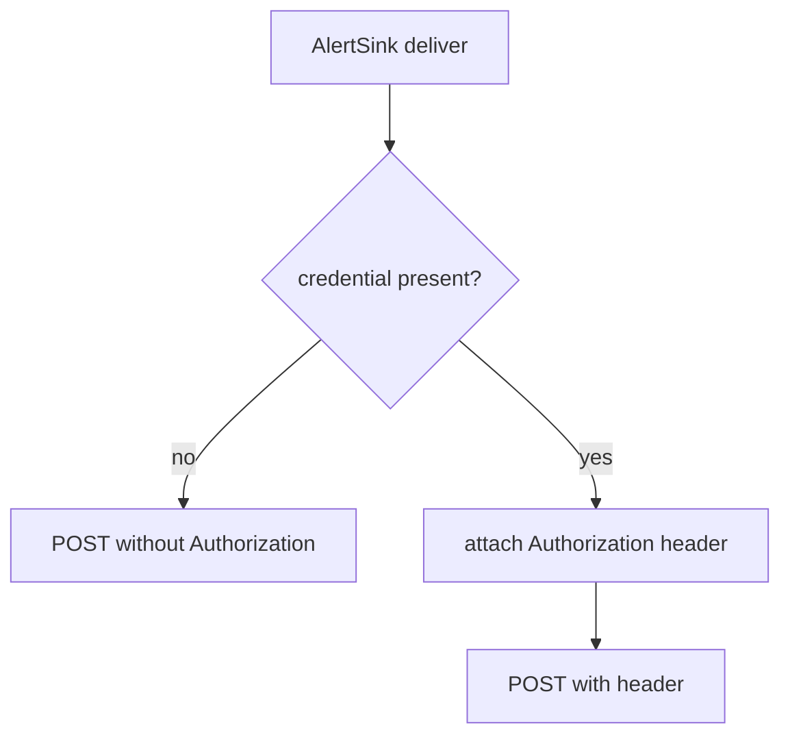

# Alert sink delivery supports optional credentials

Status: accepted

Refs: #120

## Context

`AlertSink` only stores a URL (`services/ravel-server/src/alert_sink.rs:31-59`). The `deliver` function sends a plain POST with no auth header of any kind (`services/ravel-server/src/alert_sink.rs:255-269`):

```rust
let response = client.post(sink.url()).json(&body).send().await?;
```

No bearer token, no basic auth, no HMAC signature. Both shipped sink kinds, the generic webhook and the Alertmanager sink, hit this same code path.

Most real Alertmanager and webhook receiver deployments sit behind authentication. An operator running Alertmanager with basic auth or a bearer token in front of it cannot receive Ravel alerts at all, unless they put an unauthenticated proxy in front of their own Alertmanager to accept the plain POST, which defeats the reason they added auth in the first place.

Wanted outcome: let `AlertSink` carry an optional credential (bearer token or basic auth pair) and have `deliver` attach it as an `Authorization` header on every request.

## Decision

Add an optional `credential` field to `AlertSink` (enum: `Bearer(String)` or `Basic { user, pass }`). Serialize only the non-secret parts into the control-plane record. On delivery, if present, attach the appropriate `Authorization` header before the POST. Store secrets in the existing secret envelope so they never appear in plaintext in the database or logs.

## Rejected alternatives

- Require the operator to front the Alertmanager with an unauthenticated proxy: rejected because it defeats the purpose of adding auth in the first place and adds operational surface.
- Send credentials as query parameters: rejected because credentials in URLs leak into logs, proxies, and referer headers.
- Only support bearer tokens: rejected because many Alertmanager installations use HTTP Basic and operators should not be forced to change their receiver auth scheme.

## Consequences

- Alert delivery now works against authenticated Alertmanager and webhook endpoints without extra proxies.
- One new enum variant and two new optional fields in the sink configuration surface.
- Secrets remain inside the existing secret envelope; no new secret storage path is introduced.
- All existing unauthenticated sinks continue to work unchanged (credential remains optional).


