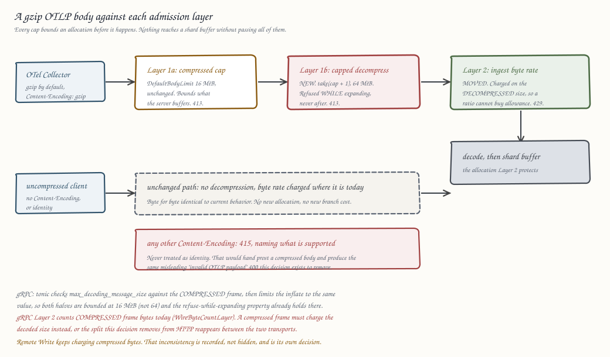

# 0084. Accept gzip-compressed OTLP ingest

Status: accepted

## Context

Ravel's OTLP ingest does not accept compressed bodies on either transport.

On HTTP, `export_metrics`, `export_logs`, and `export_traces`
(`services/ravel-server/src/otlp_http.rs`) pass the raw request `Bytes`
straight to `ExportMetricsServiceRequest::decode` and its siblings. Nothing
reads `Content-Encoding`. A gzip body reaches prost as compressed bytes and
fails with `invalid OTLP payload: failed to decode Protobuf message: buffer
underflow`, returned as HTTP 400.

On gRPC, the three tonic services are built with `max_decoding_message_size`
but no `accept_compressed`, so tonic rejects a compressed message outright.

**The OpenTelemetry Collector's `otlphttp` exporter defaults to gzip.** So does
Grafana Alloy. Pointed at Ravel with default settings, every export fails. The
client sees a 400 and drops the batch; Ravel logs nothing unusual, because from
its side the request was simply malformed.

This is not hypothetical. Ravel's own container-first quickstart shipped with
this defect and nobody noticed for a day: the Collector dropped every export it
made, the Grafana dashboard the quickstart tells the reader to open stayed
empty, and CI stayed green because a `telemetrygen` process alongside the
Collector supplied the series the assertions queried. The quickstart now carries
`compression: none` as a workaround, which is a setting no user should have to
discover.

### What already exists, and why it constrains this

Ravel already ingests a compressed body on one path. Remote Write
(`services/ravel-server/src/remote_write.rs`) accepts Snappy and bounds it with
two separate caps:

```rust
const MAX_COMPRESSED_REQUEST_BODY_BYTES: usize = 16 * 1024 * 1024;
const MAX_DECOMPRESSED_PAYLOAD_BYTES: usize = 64 * 1024 * 1024;
```

ADR-0051 section 1 names both in its Layer 1 description: "an explicit
compressed-body cap on `/api/v1/write` (16 MiB) ahead of its existing 64 MiB
decompressed cap." OTAP does the same per `ArrowPayload.record` with
`max_decompressed_payload_bytes`, enforced *during* decompression through
`decompress_capped`, which wraps the decoder in `take(cap + 1)` so the buffer is
never allowed to grow past the cap before the check runs.

Two properties of the existing admission design matter here, and accepting gzip
disturbs both.

**Layer 1 caps the wire message, not the decoded one.** The 16 MiB
`DefaultBodyLimit` on `/v1/metrics` and the 16 MiB `max_decoding_message_size`
on each tonic service exist to bound what Ravel buffers and decodes. Once a body
may be compressed, the wire cap stops bounding the decode: 16 MiB of gzip can
expand past 1 GiB at achievable ratios, and gzip's theoretical ceiling is over
1000:1. Without a second cap, Layer 1 no longer does the job it was written for.

**Layer 2 charges the ingest byte rate on wire bytes.** ADR-0051 section 1 is
explicit: "charged on wire body bytes after tenant resolution and before
decode." Remote Write follows it literally, calling `check_byte_rate` with
`body.len()`, the compressed length. That is a deliberate property (charge for
what the tenant made the server buffer) but it means a compressing tenant gets
several times the effective ingest allowance of a non-compressing one for the
same real telemetry. Today only Remote Write has that property. Accepting gzip
on OTLP extends it to the main ingest path, and the choice should be made
deliberately rather than inherited by copying the call.

## Decision

**1. Accept gzip on the OTLP HTTP endpoints, dispatched on `Content-Encoding`.**

`/v1/metrics`, `/v1/logs`, and `/v1/traces` decompress the body when
`Content-Encoding: gzip` is present, then decode as now. An absent or `identity`
encoding keeps the current path byte for byte, so an uncompressed client sees no
behavior change and no new allocation.

Any other `Content-Encoding` value is rejected with HTTP 415 and a message
naming what is supported. Silently treating an unknown encoding as identity
would hand prost a compressed body and produce the same misleading
`invalid OTLP payload` 400 this ADR exists to remove.

Header parsing rules, written down so the implementation does not decide them
by accident:

- The comparison is case-insensitive, per RFC 9110. `GZIP` and `gzip` are the
  same coding.
- `x-gzip` is accepted as an alias for `gzip`, which RFC 9110 treats as
  equivalent. Rejecting a legacy alias that the RFC calls the same thing would
  produce exactly the mystery 415 this decision exists to avoid.
- A single coding only. A multi-coding list, including `gzip, gzip` and
  `deflate, gzip`, is 415. Ravel does not implement chained decoding, and
  guessing at one member of a list would be a silent approximation.

**A gzip body must decode as a whole stream.** `flate2`'s `GzDecoder` stops at
the end of the first gzip member, so a concatenated multi-member stream (legal
gzip, and produced by ordinary tooling) would decode member one, acknowledge it,
and drop the rest. That is silent data loss on an acknowledged write, which
Ravel does not do. The implementation uses multi-member semantics
(`MultiGzDecoder`), under the same cap across all members, and any trailing
bytes after a well-formed stream ends are HTTP 400. Truncating silently is not
an option at any size.

**2. Accept gzip on the OTLP gRPC services.**

`MetricsServiceServer`, `LogsServiceServer`, and `TraceServiceServer` gain
`.accept_compressed(CompressionEncoding::Gzip)`.

What tonic 0.14 does with `max_decoding_message_size`, stated precisely because
an implementer writing tests from a vaguer sentence would write the wrong ones:
it checks the compressed frame length from the 5-byte gRPC prefix against the
cap first and answers `out_of_range` if that alone exceeds it, then decompresses
into a buffer limited to the *same* value, where an overrun during expansion
becomes `resource_exhausted`. The cap therefore applies to both the compressed
frame and the decompressed output, and the decompressed half is enforced while
expanding. That is the safety property this ADR wants, and it already holds on
gRPC without new code: no gzip bomb gets through.

It also means the gRPC decompressed ceiling is 16 MiB, not the 64 MiB decision 3
sets for HTTP. See the transport-asymmetry consequence below; this ADR accepts
that gap rather than closing it, because raising `max_decoding_message_size` to
64 MiB would also raise the cap on uncompressed gRPC messages, which nothing
asked for.

Ravel does not enable `send_compressed`. Response bodies are small
(`ExportMetricsServiceResponse` is a partial-success record), so compressing
them buys nothing and adds a per-response CPU cost.

**3. A decompressed-size cap, enforced during decompression, not after.**

HTTP decompression is bounded by a new `MAX_DECOMPRESSED_OTLP_BODY_BYTES` of
64 MiB, matching Remote Write's post-Snappy cap. The enforcement follows
`ravel-otap`'s `decompress_capped` exactly: read through `take(cap + 1)` and
fail if the output exceeds the cap, so a decompression bomb is refused while it
is being expanded rather than after Ravel has already allocated a gigabyte.

Exceeding it is HTTP 413, the same status Layer 1 uses for an oversized body.

The 16 MiB `DefaultBodyLimit` stays exactly as it is and continues to bound the
compressed body. The two caps are independent, as they are for Remote Write.

**4. The ingest byte rate charges the decompressed size.**

This is the one place this ADR deliberately diverges from the Remote Write
precedent, so the reasoning is stated rather than assumed.

Layer 2 exists to bound a tenant's ingest volume. The quantity a tenant cares
about, that Ravel's shards buffer, that segments store, and that the object
store is billed for, is the decompressed size. Charging the compressed size
would let a tenant multiply its effective allowance by its compression ratio,
which for OTLP protobuf is routinely 5x to 10x. Two tenants sending identical
telemetry would be charged differently based only on a client-side setting.

The check therefore moves to after decompression on the gzip path. On the
identity path it stays exactly where it is, charging the same bytes as today,
so nothing changes for an uncompressed client.

**This applies to gRPC too, and that takes real work rather than a copied
line.** gRPC Layer 2 does not charge a decoded size today: `WireByteCountLayer`
(`services/ravel-server/src/wire_byte_count.rs`) parses gRPC framing off the
request body as tonic's decoder reads it, counting each frame's total length
including its 1-byte compression flag and 4-byte length prefix. That count is
the *compressed* frame length. Enabling `accept_compressed` without touching it
would leave gRPC charging compressed bytes while HTTP charges decompressed, so
two tenants sending identical telemetry would be charged differently based only
on which transport they chose. That is precisely the failure this decision
exists to prevent, reintroduced one layer down.

For a frame whose compression flag is set, gRPC therefore charges the decoded
message size rather than the counted wire length. The counting layer already
parses that flag per frame, so which basis applies is available where the
decision has to be made. An uncompressed frame keeps the wire count exactly as
today.

The layer's own docstring says it "aligns the charged quantity with the HTTP
ingest path, which has always charged wire body bytes." After this ADR that
sentence is stale, and the alignment it describes now holds on the decompressed
quantity instead. It must be updated in the same change.

**A compressed-size pre-check keeps rejection cheap.** ADR-0051's stated Layer 2
property is that "a request whose size exceeds the available tokens is rejected
whole without consuming tokens", so an over-rate tenant costs one buffered body
and nothing more. Charging after decompression would weaken that to one buffered
body plus one inflate: a tenant already over its rate could stream 16 MiB bombs
and bill the gateway up to 64 MiB of decompression each, bounded only by the
ingest concurrency ceiling.

The compressed size is a strict lower bound on the decompressed size, so it can
be checked first for free. If the compressed length alone exceeds the tenant's
available tokens, the request is rejected 429 without inflating anything and
without consuming tokens. Otherwise decompression proceeds and the real charge
is made on the decompressed size. The charging basis is unchanged by this; it
only restores the cheap-rejection property against the adversarial case this
path invites.

Remote Write is left alone. Changing its charging basis is a behavior change for
existing deployments and belongs in its own decision, not smuggled in here.
This ADR records the inconsistency rather than hiding it.

**5. Metrics distinguish the compressed and decompressed size.**

Per-tenant ingest metrics gain the decompressed byte count alongside the
existing wire count. Without it an operator reading `/metrics` cannot tell a
tenant that doubled its telemetry from one that turned compression off, and the
two need very different responses.

**6. The quickstart drops its workaround.**

`deploy/otel/collector-config.yaml` currently sets `compression: none` with a
comment pointing at this issue. That line is removed once gzip lands, which
returns the quickstart to a stock Collector configuration and turns the
`check-collector-delivery.sh` assertion (#209) into a live regression test for
this ADR.



## Rejected alternatives

**Document the collector setting instead of supporting gzip.** The issue offers
this as an option. It fails the test the quickstart already ran: a default
Collector pointed at Ravel produces a 400 and an empty dashboard, and the reader
has no reason to suspect compression. Documentation does not help someone who
does not know a question needs asking, and every OTLP client that defaults to
gzip has to be told separately. Ravel would be the only backend in the ecosystem
requiring it.

**Accept gzip without a decompressed cap.** Smallest diff, and it reintroduces
the exact hazard Layer 1 exists to prevent. A 16 MiB compressed body expands
past a gigabyte at achievable ratios, so an unauthenticated-shaped resource
attack becomes available to any tenant with a valid token. ADR-0051 already
rejected this shape twice, for Remote Write and OTAP.

**Decompress into a buffer and check the size afterwards.** Simpler than a
capped reader, and useless: the allocation has already happened by the time the
check runs, which is what the attack targets. `ravel-otap`'s `decompress_capped`
solved this correctly and this ADR copies it rather than inventing a second
approach.

**Charge the ingest byte rate on the compressed size, matching Remote Write.**
Consistent with the one existing precedent, and one line rather than a moved
check. Rejected because it makes a tenant's allowance depend on a client-side
setting: a tenant that enables compression gets 5x to 10x the real ingest volume
for the same nominal rate, and two tenants sending identical data are charged
differently. Ravel's admission limits are a cost-control mechanism, and
compressed bytes are not what the cost tracks.

**Support zstd and deflate as well.** The OTLP specification permits gzip and
zstd, and zstd compresses better. Rejected for now on evidence: gzip is what the
Collector and Alloy send by default, and it is what the failure reports are
about. Adding a second codec doubles the decompression surface for a case nobody
has hit. `Content-Encoding` dispatch makes zstd a small follow-up if a real
client needs it, and the 415 message names exactly what is supported so the gap
is legible rather than mysterious.

**Put decompression in a `tower` layer instead of the handlers.** Architecturally
tidier and it would cover future endpoints automatically. Rejected because the
byte-rate check needs the decompressed length (decision 4) and lives inside the
handler after tenant resolution. A layer that decompressed earlier would either
duplicate tenant resolution or hand the handler a body whose original wire size
it can no longer report, and the metrics in decision 5 need both numbers.

## Consequences

- A stock OpenTelemetry Collector and a stock Grafana Alloy work against Ravel
  with no configuration. This is the single most common first-contact failure
  the project has, and it stops being one.
- The quickstart returns to a stock Collector config, and #209's
  delivery assertion becomes a standing regression test for this path.
- A new dependency for gzip decompression (`flate2`, which is not currently in
  the workspace). Rust gzip decoders are well-audited and `flate2` is the
  ecosystem default, but it is a genuinely new dependency and is flagged as one.
  The workspace's existing `zstd` cannot decode gzip, so there is no in-tree
  alternative.
- The two transports cap decompressed size differently: 64 MiB on HTTP
  (decision 3), 16 MiB on gRPC, because tonic applies
  `max_decoding_message_size` to both the compressed frame and the decompressed
  output. A batch that inflates to 40 MiB is accepted over HTTP and rejected
  over gRPC with `resource_exhausted`. This ADR accepts the asymmetry: closing
  it by raising the gRPC cap to 64 MiB would also raise the ceiling on
  uncompressed gRPC messages, which is a separate change nobody has asked for.
  The gap is documented so an operator hitting it can recognize it.
- Peak transient memory grows by the ingest concurrency ceiling times the 64 MiB
  HTTP cap, in the worst case. That memory is held while a concurrency permit is
  held, and ADR-0069's ingest buffer budget does not account for it. On the
  small hosts this project targets, that product belongs in an operator's sizing
  arithmetic, so the operations guide must state it.
- OTLP HTTP and Remote Write now charge the ingest byte rate on different bases:
  decompressed for OTLP, compressed for Remote Write. This is a real
  inconsistency, recorded here deliberately. It should be resolved by moving
  Remote Write to the decompressed basis in its own decision, which is a
  behavior change for existing deployments.
- A tenant sending gzip sees its effective byte-rate allowance drop relative to
  what an uncompressed client of the same nominal rate gets today, because it is
  now charged for what it actually sends rather than what it put on the wire.
  This is the intent of decision 4, and it is a visible change for anyone who
  was already working around the rejection by compressing elsewhere.
- CPU cost on the ingest path for compressed requests, bounded by the caps.
  Decompression is not free, and a gateway sized on today's uncompressed traffic
  should be re-measured once clients start sending gzip.
- No frozen format changes. No RSEG, RLOG, or RSPAN layout change, no protobuf
  schema change, no series-identity or commit-token change, no object-key layout
  change. The wire encoding of a request is not a persisted format.

## Refs

Refs: #115
