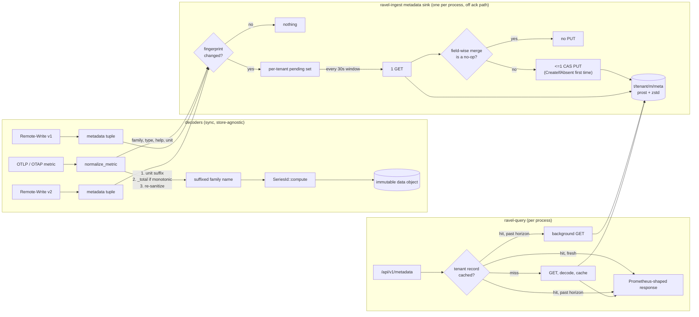

# ADR-0085: metric metadata store and OTLP name suffixing

Status: accepted

## Context

`GET /api/v1/metadata` (`crates/ravel-query/src/http/compat.rs:76-82`) always
returns an empty object. Ravel never captures per-metric type, help text, or
unit at ingest time, so there is nothing to serve; the handler and its test
(`metadata_data_is_an_empty_object`) lock in the empty response on purpose.
All three ingest paths already receive this data on the wire and discard it:

- OTLP (`crates/ravel-otlp/src/normalize.rs`): only `Metric.name` is read.
  `Metric.description` (help) and `Metric.unit` are never touched. Metric
  type is implicit in the `data` oneof (Gauge/Sum/Histogram/Summary/
  ExponentialHistogram) but never persisted as a tag.
- Remote-Write v1 (`crates/ravel-remote-write/src/rw1.rs`,
  `resolved.rs:113-139`): `req.metadata` is reduced to a bare
  `metadata_count: usize` because RW1's `MetricMetadata` list has no
  per-series correlation.
- Remote-Write v2 (`crates/ravel-remote-write/src/rw2.rs:139-229`): per-series
  `metadata.help_ref`/`unit_ref` are bounds-checked against the symbol table,
  then also collapsed into a tally. The decoded strings are dropped.

Separately, OTLP-ingested metrics never get the standard OTLP-to-Prometheus
name suffixes a Prometheus exporter adds: a monotonic Sum named `foo` stays
`foo` instead of becoming `foo_total`; a gauge with `unit: "By"` stays
unsuffixed instead of becoming `foo_bytes`. `sanitize_metric_name`
(`normalize.rs:1398-1423`) only replaces disallowed characters; `is_monotonic`
is captured (`normalize.rs:449`) but never used for naming. The result: the
same application, exported once through a collector's Prometheus exporter and
once through direct OTLP into Ravel, produces two differently named series
for the same metric, and dashboards/alert rules built against one convention
silently don't match data ingested the other way.

Both gaps are explicitly out of scope for epic #78 and #81 ("no
`/api/v1/metadata` content, and no OTLP name suffixing (G-9) ... feature
development, not hardening, track separately if wanted"). This ADR is that
separate tracking, filed against #119.

Neither change touches a frozen format. Metric name is an ordinary input
string to `SeriesId::compute(tenant, metric_name, &label_set)`
(`crates/ravel-types/src/lib.rs:401`); ADR-0005 freezes the hash's canonical
byte layout, not any particular name string, and states outright that "unit
and type are metadata, not identity" (`docs/adrs/0005-series-identity.md:26`).
Suffixing is therefore a pure ingest-time transform applied before the name
reaches `SeriesId::compute`. The natural storage location for per-name
metadata, `NamePostings` (`crates/ravel-catalog/src/snapshot_format/
postings.rs`), is a frozen, versioned wire format (`RNP1`, CRC-validated,
sealed into the catalog snapshot by the commit protocol) and the wrong fit
for data that changes independently of committed series data — this ADR uses
a new, additive, module-owned key instead, following the precedent already
documented for `t/<tenant_hash>/config`, `enc`, and `<signal>/prov` in
`docs/catalog-and-mvcc.md:16-61`: a small versioned record, single-writer
per key, whose body is the internal contract of the module that owns it.
Checked against the format-change skill: the frozen "object key layout"
contract covers the data/commit/snapshot key *shapes* the commit and
catalog protocols depend on, and that doc already documents the carve-out
this ADR follows — an additive, single-purpose, module-owned key needs no
version bump or dual-reader window, the same way `config` and `prov`
didn't. The record's prost message is an additive addition to
`proto/sys/v1`, allowed under the frozen-proto rule and the same move
ADR-0066 made for `TenantConfigRecord`.

## Decision

### 1. Metric metadata capture and store

Add a new per-tenant, per-signal catalog key, under the metrics signal
prefix `m/` like every other metrics-scoped record (`m/l0`, `m/c`,
`<signal>/prov`), not a new top-level prefix:

```
t/<tenant_hash>/m/meta   metric-family-name -> {type, help, unit} record
                          (CAS whole-record replace, additive)
```

Body: a prost message `MetricMetadataRecord` in `ravel_proto::sys::v1`
(`format_version`, repeated `entries {family_name, type, help, unit,
updated_unix_ns}`), zstd-compressed on the wire. This follows the precedent
the other durable `t/<tenant_hash>/` records set (`config`, `enc`, `prov`
are all versioned prost with a `format_version` guard;
`crates/ravel-catalog` carries no serde dependency at all), not the JSON
shape of `admission/query/*`, which is a root-level, per-process, ephemeral
key with a different lifecycle. Adding a new message is an additive
change under the frozen-proto rule (the same thing ADR-0066 did for
`TenantConfigRecord`); its field numbers freeze once shipped. Sizing,
honestly: about 2,000 families with typical help strings is roughly 250 KB
of prost and roughly 50 KB after zstd. Bytes are not what drives Ravel's
S3 bill (request count is; see `docs/guides/cost-model.md`), so the
compression buys read latency and egress, not dollars, and it costs one
already-present workspace dependency.

One entry per metric family name per tenant (not per series): Prometheus
metadata is keyed by name, and Ravel has no per-target scrape concept that
would make multiple type/help/unit tuples per name meaningful, so a single
latest-write-wins record per name is the exact match for Ravel's ingest
model, not an approximation of a richer thing Ravel doesn't have.

The map key is the *family* name, defined per path so all three agree on
what a lookup at query time matches: for OTLP it is the name after the
suffix pass in Decision 2 (final unit + `_total` suffix applied, but before
the classic histogram/summary explosion that appends `_bucket`/`_sum`/
`_count`) — the metadata describes the family the exploded series belong to,
not any one exploded series. For RW1 it is `metric_family_name` as already
parsed. For RW2, per-series names that already carry a structural
`_bucket`/`_sum`/`_count`/`_total` suffix are stripped back to the family
name before use as the map key (mirroring the same structural-suffix set
OTLP's explosion produces), so a classic histogram doesn't fragment into
multiple spurious metadata entries.

Each ingest path (OTLP, OTAP, RW1, RW2) keeps decoding type/help/unit
exactly as it already does — RW1/RW2 already parse it and only need to stop
discarding it; OTLP needs `Metric.description` and `Metric.unit` read
alongside `Metric.name` (the type is already known from the `data` oneof
match); OTAP mirrors OTLP's normalize point-for-point (its own module doc
says so, and `crates/ravel-otap/tests/differential.rs` enforces it), so it
picks up the same capture. The decoder crates (`ravel-otlp`, `ravel-otap`,
`ravel-remote-write`) are synchronous and store-agnostic by design; they
surface a protocol-neutral `(family_name, type, help, unit)` tuple and
nothing else. The one **metadata sink** per process lives in `ravel-ingest`
(the crate that already owns the object-store client and the per-process
ingest pipeline all four surfaces funnel through via `IngestRouter`); its
flush task is spawned and supervised from `ravel-server` next to the
existing lifecycle refresh loop. One sink per process, not one per
protocol, so a single process never races itself on the key.

The sink keeps an in-memory `HashMap<(tenant, family_name), fingerprint>`
where `fingerprint` hashes the last-flushed `(type, help, unit)` tuple —
keyed on content, not just name, so a help/unit change during the process's
lifetime is detected locally instead of being masked by "we've seen this
name before." This local map is purely a fast skip — it is never trusted on
its own. Names whose current fingerprint differs from the local map (new
name, changed metadata, or a fresh process after restart where the map is
empty) are not flushed one at a time: they accumulate in a per-tenant
pending set, and once per **debounce window** (default 30 s, configurable)
the sink does, per tenant with a non-empty pending set, exactly **one GET**
of `t/<tenant_hash>/m/meta` and **at most one CAS PUT**. It field-wise
merges every pending tuple into the record it just read — an absent/empty
incoming field never overwrites a populated existing field, so RW1
supplying help without unit and OTLP later supplying unit without help
compose instead of one clobbering the other — and compares the merged
record against what it read. If the merge is a no-op (every field already
matches, the common case right after a restart, when every name looks new
locally but the durable record already reflects it), it skips the PUT and
just updates the local fingerprints. Only a genuine new-or-changed field
triggers the CAS PUT, retried against a freshly read body on conflict up to
a bounded retry count (default 5, jittered backoff); on exhaustion the
window's update is dropped, an `ingest_metadata_flush_dropped_total`
counter is incremented and a warning logged — visible, not silent, and
never fatal to any ingest request. The first record for a tenant is written
with `CreateIfAbsent` (the `config`/`prov` first-write precedent), never
CAS against a version that does not exist.

The request-count consequences, stated so they can be checked: steady-state
ingest (existing series, unchanged metadata) costs zero requests. A cold
start of R ingest replicas over T active tenants costs R x T GETs total and
zero PUTs when nothing changed. A new deployment introducing thousands of
new families at once costs at most two requests (one GET, one PUT) per
replica per tenant per window, however many names arrive; the second
window's GET sees the winner's merge and skips. Batching bounds the request
count; the entry cap below bounds the record size; they are separate
protections and both are needed. This flush is asynchronous and off the
ingest acknowledgement path entirely: a point is acked on its data write,
never blocked on or failed by the metadata CAS, so a contended or degraded
metadata key cannot become an ingest availability regression.

Expected metric-name cardinality per tenant is orders of magnitude below
series cardinality (typically low thousands, not millions — name count grows
with distinct metric definitions, not label combinations), so the
whole-record CAS-replace body stays small in the common case. The
pathological case — a client minting unbounded distinct metric names (IDs
embedded in names) — turns this shared key into a per-tenant write-amplification
target with no expiry, since metadata is additive-only by default. This ADR
therefore adds a hard per-tenant entry cap (default 20,000, configurable):
once a durable record is at the cap, a new name is not added (the point is
still ingested and queryable, only its metadata entry is dropped), and an
`ingest_metadata_entries_dropped_total` counter is incremented — a visible
drop, not a silent one. Remediation for a record that needs pruning (stale
names from a since-fixed bad client) doesn't need a delete grant: it is the
same CAS-write path with a smaller merged body, evicting entries whose
last-updated timestamp (carried per entry) is oldest, which stays within the
established "no role holds delete, only overwrite in place" pattern below.

Grants: the ingest role (the process hosting the OTLP, OTAP, RW1, RW2
surfaces) holds read + CAS write on `t/<tenant_hash>/m/meta`, the same role
that already writes `t/<tenant_hash>/<signal>/idem/*` and the data/commit
keys for that tenant. The query role holds read-only. No role holds delete:
like the `config` and `admission`/`maintain` keys this prefix is never
swept, only overwritten in place.

**Read path.** `ravel-query`'s `/api/v1/metadata` handler (`compat.rs:76-82`)
gets `AppState` access (the router that mounts `compat.rs` currently merges
it in stateless — this changes) and serves from a per-process, per-tenant
**metadata cache**, never from a per-request object-store read. Grafana
calls this endpoint on every dashboard load and datasource probe; an
uncached design would turn every one of those into an S3 round trip that is
both user-visible latency (tens of milliseconds per call, on the dashboard
critical path) and a request-count line item the read-side budget
(ADR-0075) never accounted for. The cache is filled **on demand**: a tenant
nobody asks about costs zero requests. On first request for a tenant the
handler GETs `t/<tenant_hash>/m/meta` once, decompresses and decodes it,
and keeps the parsed record. Later requests within the refresh horizon
(default 60 s, the same bounded-staleness horizon `config` and the
lifecycle gate use) are served from memory; a request past the horizon is
still served from the cached record immediately while one background
refresh GET runs (stale-while-revalidate), so no client ever waits on S3
for metadata after the first call. Cost is therefore one GET per (queried
tenant, horizon, query process), independent of request rate. The
object-store contract has `head` but no conditional GET, and S3 bills HEAD
and GET identically, so a HEAD-then-GET dance saves nothing; the refresh
is a plain GET. Memory: a record at the 20,000-entry cap is on the order of
3 MB parsed; entries are per-tenant and evicted after a small number of
idle horizons, so the process holds records only for tenants it recently
answered for, and a bound on the cached tenant count (default 256, LRU)
keeps a many-tenant deployment predictable.

The handler projects the single-entry-per-name record into Prometheus's
documented response shape (`data: {"<name>": [{"type", "help", "unit"}]}`
— an array of length 0 or 1 in Ravel's case, matching the wire contract
every existing Prometheus API client already expects). Missing key or
missing entry for a name returns an empty result for that name, not an
error: this metadata is best-effort and its absence is not a fault. The
endpoint is unauthenticated today because it has nothing tenant-specific
to say. Metadata is per-tenant, so a request that carries a resolvable
tenant credential (the same bearer resolution `/api/v1/labels` uses) gets
that tenant's record; a request with no resolvable tenant keeps today's
behavior exactly — `200` with an empty object — rather than turning a
previously always-succeeding probe into a `401`. Additive for every
existing caller.

### 2. OTLP name suffixing

Add a suffix pass in `crates/ravel-otlp/src/normalize.rs`, applied to the
base metric name after `sanitize_metric_name` and before the name is handed
to `SeriesIdMemo`/`SeriesId::compute` (call sites at `normalize.rs:792-794,
857-859, 1082-1084`), and before the classic histogram/summary explosion that
appends `_bucket`/`_sum`/`_count` (ADR-0016). Order, matching the
OpenTelemetry Collector's `prometheusexporter` translator (unit suffix, then
counter suffix, then the structural suffixes ADR-0016 already applies):

1. Sanitize the base name (existing `sanitize_metric_name` behavior,
   unchanged).
2. If `Metric.unit` is non-empty, map it through the OTel spec's unit
   suggestion table (OpenTelemetry Metrics API spec, "Metric Points" /
   `prometheusexporter`'s `unitMapper` and `perUnitMapper`) and append the
   mapped unit as a `_<unit>` suffix if the name doesn't already end with
   it: `s` -> `seconds`, `By` -> `bytes`, `ms`/`us`/`ns` -> `milliseconds`/
   `microseconds`/`nanoseconds`, and so on through the documented table.
   `1` (dimensionless ratio) maps to `_ratio` on Gauge metrics specifically
   (matching the collector/spec convention, which ties the ratio suffix to
   gauge semantics) and to no suffix on other types. Any `{annotation}`
   bracketed portion of the unit (e.g. `{packet}`) is stripped before
   lookup, regardless of position; if stripping empties one side of a
   compound unit entirely (`{packet}/s` leaves an empty numerator and `s`
   denominator), the suffix uses only the remaining side's mapped form
   (`_per_second`), not a `_per_` with an empty component. A compound unit
   `a/b` with both sides present maps each side through the table
   independently and joins as `_<a>_per_<b>` (`By/s` -> `_bytes_per_second`).
   An unrecognized unit string is left unmapped (no suffix appended) rather
   than guessed.
3. If the metric is a monotonic Sum (`is_monotonic_sum`) and the
   (now unit-suffixed) name does not already end in `_total`, append
   `_total`. This order matches real output: `process_cpu_seconds_total`,
   not `process_cpu_total_seconds`.
4. Re-run `sanitize_metric_name`'s character rules over the final string
   as a safety pass (the unit table's output is chosen to already be
   identifier-safe, but this catches any future table entry that isn't).

The same pass lands in `crates/ravel-otap/src/normalize.rs`, which mirrors
`ravel_otlp::normalize` point-for-point by its own module doc and is held
to that by the OTAP/OTLP differential proptest
(`crates/ravel-otap/tests/differential.rs`); an OTLP-only change would fail
that test, and OTAP is a real, feature-gated production surface. The unit
string written into the metadata record for an OTLP/OTAP metric is the
mapped Prometheus word (`bytes`, `seconds`), the same word an OpenMetrics
`# UNIT` line would carry, so the metadata `unit` field agrees with the
suffix on the name rather than repeating the raw UCUM `By`.

This is an ingest-time-only change: it does not touch `SeriesId::compute`,
ADR-0005's canonical byte layout, or any RSEG/commit/catalog format.
Historical data already written under pre-suffix names is untouched — data
objects are immutable and this ADR does not rewrite them. Only points
ingested via OTLP after this ships get the new names. This is a real,
visible behavior change for any dashboard or alert built directly against
OTLP-ingested series names before this ships; see Consequences.

## Rejected alternatives

- **Store metadata per-series instead of per-name.** Rejected: wrong
  granularity. Prometheus metadata semantics are per metric name; per-series
  storage would multiply copies on every label-set variant and every series
  churn event for no benefit, and `/api/v1/metadata` would need to
  de-duplicate back down to per-name at read time anyway.
- **Extend the frozen `NamePostings` snapshot format to carry metadata.**
  Rejected: `NamePostings` is a sealed, versioned wire format (`RNP1`) that
  the commit protocol seals into immutable catalog snapshots. Metadata
  changes independently of committed series data (a help string can change
  without any new series being written) and doesn't share that immutability
  or sealing lifecycle. Coupling them would force a format-change ADR and
  version bump for a concern that has nothing to do with series data commit.
- **One object per metric family (`t/<hash>/m/meta/<name_hash>`).**
  Rejected on the read path: serving `/api/v1/metadata` would need a LIST
  plus one GET per family, thousands of requests per cache fill against a
  bill that request count dominates. Whole-record CAS makes the read one
  GET.
- **One object per ingest process (`t/<hash>/m/meta/<process_id>`,
  plain Overwrite, no CAS).** Rejected: it trades away CAS conflicts (which
  batching already makes rare and bounded) for a read path that must LIST
  and GET every replica's record and merge them per request, plus a sweep
  for dead processes. Worse on both request count and read latency.
- **Carry metadata in the catalog snapshot fold, so `/api/v1/metadata`
  reads the same cached snapshot bytes `/api/v1/labels` does.** Rejected:
  the fold is driven by commit records, which carry no metadata and are
  frozen, and the snapshot part format (`RNP1`/`.csnap`) is frozen too.
  Reaching it would be a format-change ADR against two frozen contracts for
  a record that changes on its own lifecycle.
- **Fold the record into `t/<hash>/config` to save a key.** Rejected:
  `config` is operator-written from the control plane under CAS; adding an
  ingest-side writer to the same object makes two unrelated writers
  contend, and a lost race on a limits change is a much worse failure than
  a delayed help string.
- **JSON body, citing the `admission/query/*` snapshot precedent.**
  Rejected on second look: that key is root-level, per-process, and
  ephemeral. Every durable tenant-scoped record in `ravel-catalog` is
  versioned prost with a `format_version` guard and the crate carries no
  serde dependency; the metadata record has the durable, tenant-scoped
  lifecycle, so it takes that shape.
- **Per-request object-store read on `/api/v1/metadata`.** Rejected: an S3
  round trip on every dashboard load and datasource probe is user-visible
  latency and an unbudgeted request stream. The on-demand horizon cache
  serves the same data at one GET per (queried tenant, horizon, process).
- **In-memory-only cache, no durable store.** Rejected: goes empty on every
  process restart and diverges between concurrent query-serving processes,
  which reads as flapping/inconsistent metadata to a Grafana user hitting
  different processes — a correctness gap disguised as an optimization, not
  a legitimate approximation.
- **Write metadata synchronously on every ingested point.** Rejected: turns
  a per-tenant CAS key into a write-amplification hot spot under normal
  ingest load, for data (type/help/unit) that is overwhelmingly unchanged
  point-to-point. The debounced first-seen/changed-only flush gets the same
  end state at negligible steady-state cost.
- **Gate OTLP suffixing behind a per-tenant opt-in config flag.** Rejected:
  adds a permanent config surface for what is a one-time migration concern,
  and any tenant that never flips it keeps mismatched names forever, which
  directly fights the issue's stated goal (same series name regardless of
  ingest path). Ship it as the default behavior and document the one-time
  compat break instead.
- **Implement only a narrow subset of the OTel unit-suffix table (e.g. just
  `_total` for counters, skip unit suffixes).** Rejected by the "exact
  semantics by default, approximation opt-in and visible" invariant: a
  partial table would silently under-match the real Prometheus exporter's
  output for unit-suffixed metrics, which is exactly the divergence this
  ADR exists to close.

## Consequences

- `/api/v1/metadata` returns real data for any metric ingested after this
  ships; metrics ingested before this ships (or via a path that never sends
  type/help/unit) return nothing for that name until they're re-ingested,
  which is consistent with Prometheus's own behavior when metadata isn't
  available.
- OTLP-ingested series get new names going forward (e.g. `foo` ->
  `foo_total`). Existing dashboards/alerts built directly against
  OTLP-ingested names before this ships stop matching new points under the
  old name; this is a one-time, intentional compat break in service of
  matching Prometheus-exporter naming, called out here rather than
  discovered silently. Historical data under the old name is untouched.
- `docs/catalog-and-mvcc.md`'s key layout table gains the
  `t/<tenant_hash>/m/meta` row (Decision 1 pattern, matching the
  existing `config`/`admission`/`maintain` entries).
- `docs/query-engine.md`'s `/api/v1/metadata` entry updates from "always
  empty" to the real behavior.


