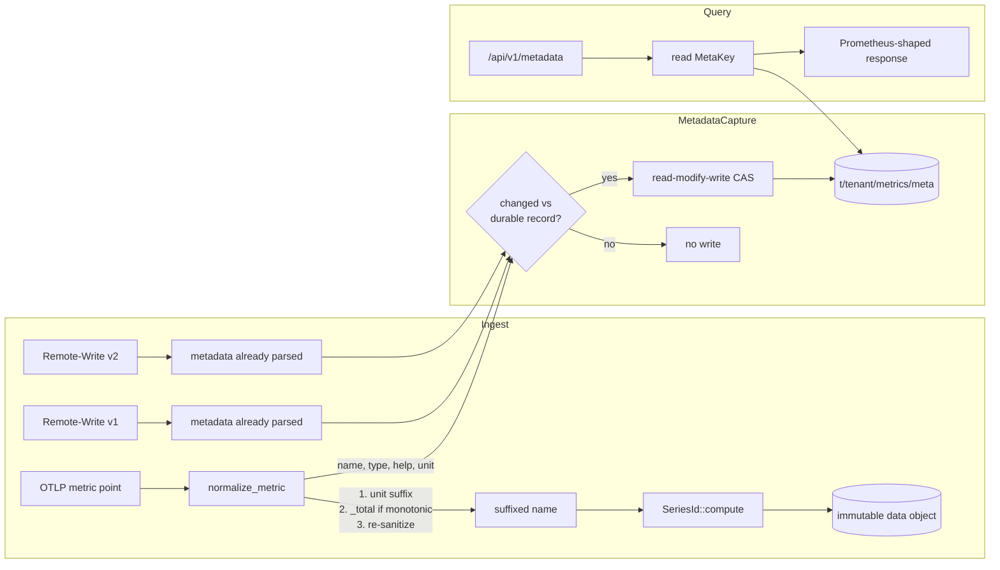

# ADR-0085: metric metadata store and OTLP name suffixing

Status: accepted

## Context

`GET /api/v1/metadata` (`crates/ravel-query/src/http/compat.rs:76-82`) always
returns an empty object. Ravel never captures per-metric type, help text, or
unit at ingest time, so there is nothing to serve; the handler and its test
(`metadata_data_is_an_empty_object`) lock in the empty response on purpose.
All three ingest paths already receive this data on the wire and discard it:

- OTLP (`crates/ravel-otlp/src/normalize.rs`): only `Metric.name` is read.
  `Metric.description` (help) and `Metric.unit` are never touched. Metric
  type is implicit in the `data` oneof (Gauge/Sum/Histogram/Summary/
  ExponentialHistogram) but never persisted as a tag.
- Remote-Write v1 (`crates/ravel-remote-write/src/rw1.rs`,
  `resolved.rs:113-139`): `req.metadata` is reduced to a bare
  `metadata_count: usize` because RW1's `MetricMetadata` list has no
  per-series correlation.
- Remote-Write v2 (`crates/ravel-remote-write/src/rw2.rs:139-229`): per-series
  `metadata.help_ref`/`unit_ref` are bounds-checked against the symbol table,
  then also collapsed into a tally. The decoded strings are dropped.

Separately, OTLP-ingested metrics never get the standard OTLP-to-Prometheus
name suffixes a Prometheus exporter adds: a monotonic Sum named `foo` stays
`foo` instead of becoming `foo_total`; a gauge with `unit: "By"` stays
unsuffixed instead of becoming `foo_bytes`. `sanitize_metric_name`
(`normalize.rs:1398-1423`) only replaces disallowed characters; `is_monotonic`
is captured (`normalize.rs:449`) but never used for naming. The result: the
same application, exported once through a collector's Prometheus exporter and
once through direct OTLP into Ravel, produces two differently named series
for the same metric, and dashboards/alert rules built against one convention
silently don't match data ingested the other way.

Both gaps are explicitly out of scope for epic #78 and #81 ("no
`/api/v1/metadata` content, and no OTLP name suffixing (G-9) ... feature
development, not hardening, track separately if wanted"). This ADR is that
separate tracking, filed against #119.

Neither change touches a frozen format. Metric name is an ordinary input
string to `SeriesId::compute(tenant, metric_name, &label_set)`
(`crates/ravel-types/src/lib.rs:401`); ADR-0005 freezes the hash's canonical
byte layout, not any particular name string, and states outright that "unit
and type are metadata, not identity" (`docs/adrs/0005-series-identity.md:26`).
Suffixing is therefore a pure ingest-time transform applied before the name
reaches `SeriesId::compute`. The natural storage location for per-name
metadata, `NamePostings` (`crates/ravel-catalog/src/snapshot_format/
postings.rs`), is a frozen, versioned wire format (`RNP1`, CRC-validated,
sealed into the catalog snapshot by the commit protocol) and the wrong fit
for data that changes independently of committed series data — this ADR uses
a new, additive, module-owned key instead, following the precedent already
documented for `t/<tenant_hash>/config` and `admission/query/<process_id>.
snapshot` in `docs/catalog-and-mvcc.md:16-61`: small JSON, non-frozen,
internal contract of the module that owns it. Checked against the
format-change skill: the frozen "object key layout" contract covers the
data/commit/snapshot key *shapes* the commit and catalog protocols depend on,
and that doc already documents the carve-out this ADR follows — an additive,
single-purpose, module-owned key needs no version bump or dual-reader
window, the same way `config` and `admission/query/*` didn't.

## Decision

### 1. Metric metadata capture and store

Add a new per-tenant catalog key:

```
t/<tenant_hash>/metrics/meta   metric-name -> {type, help, unit} map
                                (CAS whole-record replace, additive)
```

Body: a small JSON object, `{format_version, entries: {"<metric_family_name>":
{"type": "counter"|"gauge"|"histogram"|"summary"|"unknown", "help": "...",
"unit": "..."}}}`. One entry per metric name per tenant (not per series):
Prometheus metadata is keyed by name, and Ravel has no per-target scrape
concept that would make multiple type/help/unit tuples per name meaningful,
so a single latest-write-wins record per name is the exact match for
Ravel's ingest model, not an approximation of a richer thing Ravel doesn't
have.

The map key is the *family* name, defined per path so all three agree on
what a lookup at query time matches: for OTLP it is the name after the
suffix pass in Decision 2 (final unit + `_total` suffix applied, but before
the classic histogram/summary explosion that appends `_bucket`/`_sum`/
`_count`) — the metadata describes the family the exploded series belong to,
not any one exploded series. For RW1 it is `metric_family_name` as already
parsed. For RW2, per-series names that already carry a structural
`_bucket`/`_sum`/`_count`/`_total` suffix are stripped back to the family
name before use as the map key (mirroring the same structural-suffix set
OTLP's explosion produces), so a classic histogram doesn't fragment into
multiple spurious metadata entries.

Each ingest path (OTLP, RW1, RW2) keeps decoding type/help/unit exactly as it
already does — RW1/RW2 already parse it and only need to stop discarding it;
OTLP needs `Metric.description` and `Metric.unit` read alongside `Metric.name`
(the type is already known from the `data` oneof match). Each ingest process
keeps an in-memory `HashMap<(tenant, metric_family_name), fingerprint>` where
`fingerprint` hashes the last-flushed `(type, help, unit)` tuple — keyed on
content, not just name, so a help/unit change during the process's lifetime
is detected locally instead of being masked by "we've seen this name before."
This local map is purely a fast skip — it is never trusted on its own. On a
name whose current fingerprint differs from the local map (new name, changed
metadata, or a fresh process after restart where nothing is in the local map
yet), the process reads the current `t/<tenant_hash>/metrics/meta` body and
field-wise merges the new tuple into the existing entry for that name — an
absent/empty incoming field never overwrites a populated existing field, so
RW1 supplying help without unit and OTLP later supplying unit without help
compose instead of one clobbering the other. It compares the merged record
against what it just read: if merging is a no-op (every field already
matches, the common case right after a restart, when every name looks new
locally but the durable record already reflects it), it skips the CAS write
and just updates the local fingerprint. Only a genuine new-or-changed field
triggers the CAS write, retried against the freshly-read body on conflict up
to a bounded retry count (default 5, jittered backoff); on exhaustion the
update is dropped and an `ingest_metadata_flush_dropped_total` counter is
incremented and a warning logged — visible, not silent, and never fatal to
the ingest request. This flush is asynchronous and off the ingest
acknowledgement path entirely: the point being ingested is acked based on
the data write succeeding, never blocked on or failed by the metadata CAS,
so a contended or degraded metadata key cannot turn into an ingest
availability regression. This bounds a rolling restart of N ingest processes
to zero rewrites once the durable record already reflects current metadata,
and bounds steady-state ingest — the overwhelming majority of points, which
are existing series with unchanged metadata — to zero CAS traffic, the same
debounced-write shape already used for `sys/maintain/workers/<process_id>`.

Expected metric-name cardinality per tenant is orders of magnitude below
series cardinality (typically low thousands, not millions — name count grows
with distinct metric definitions, not label combinations), so the
whole-record CAS-replace body stays small in the common case. The
pathological case — a client minting unbounded distinct metric names (IDs
embedded in names) — turns this shared key into a per-tenant write-amplification
target with no expiry, since metadata is additive-only by default. This ADR
therefore adds a hard per-tenant entry cap (default 20,000, configurable):
once a durable record is at the cap, a new name is not added (the point is
still ingested and queryable, only its metadata entry is dropped), and an
`ingest_metadata_entries_dropped_total` counter is incremented — a visible
drop, not a silent one. Remediation for a record that needs pruning (stale
names from a since-fixed bad client) doesn't need a delete grant: it is the
same CAS-write path with a smaller merged body, evicting entries whose
last-updated timestamp (carried per entry) is oldest, which stays within the
established "no role holds delete, only overwrite in place" pattern below.

Grants: the ingest role (OTLP, RW1, RW2 ingest processes) holds read + CAS
write on `t/<tenant_hash>/metrics/meta`, the same role that already writes
`t/<tenant_hash>/<signal>/idem/*` and the data/commit keys for that tenant.
The query role holds read-only. No role holds delete: like the `config` and
`admission`/`maintain` keys this prefix is never swept, only overwritten in
place.

`ravel-query`'s `/api/v1/metadata` handler (`compat.rs:76-82`) gets
`AppState` access (the router that mounts `compat.rs` currently merges it in
stateless — this changes) and, on request, reads
`t/<tenant_hash>/metrics/meta`, projecting the single-entry-per-name body into
Prometheus's documented response shape (`data: {"<name>": [{"type", "help",
"unit"}]}` — an array of length 0 or 1 in Ravel's case, matching the wire
contract every existing Prometheus API client already expects). Missing key
or missing entry for a name returns an empty result for that name, not an
error: this metadata is best-effort and its absence is not a fault.

### 2. OTLP name suffixing

Add a suffix pass in `crates/ravel-otlp/src/normalize.rs`, applied to the
base metric name after `sanitize_metric_name` and before the name is handed
to `SeriesIdMemo`/`SeriesId::compute` (call sites at `normalize.rs:792-794,
857-859, 1082-1084`), and before the classic histogram/summary explosion that
appends `_bucket`/`_sum`/`_count` (ADR-0016). Order, matching the
OpenTelemetry Collector's `prometheusexporter` translator (unit suffix, then
counter suffix, then the structural suffixes ADR-0016 already applies):

1. Sanitize the base name (existing `sanitize_metric_name` behavior,
   unchanged).
2. If `Metric.unit` is non-empty, map it through the OTel spec's unit
   suggestion table (OpenTelemetry Metrics API spec, "Metric Points" /
   `prometheusexporter`'s `unitMapper` and `perUnitMapper`) and append the
   mapped unit as a `_<unit>` suffix if the name doesn't already end with
   it: `s` -> `seconds`, `By` -> `bytes`, `ms`/`us`/`ns` -> `milliseconds`/
   `microseconds`/`nanoseconds`, and so on through the documented table.
   `1` (dimensionless ratio) maps to `_ratio` on Gauge metrics specifically
   (matching the collector/spec convention, which ties the ratio suffix to
   gauge semantics) and to no suffix on other types. Any `{annotation}`
   bracketed portion of the unit (e.g. `{packet}`) is stripped before
   lookup, regardless of position; if stripping empties one side of a
   compound unit entirely (`{packet}/s` leaves an empty numerator and `s`
   denominator), the suffix uses only the remaining side's mapped form
   (`_per_second`), not a `_per_` with an empty component. A compound unit
   `a/b` with both sides present maps each side through the table
   independently and joins as `_<a>_per_<b>` (`By/s` -> `_bytes_per_second`).
   An unrecognized unit string is left unmapped (no suffix appended) rather
   than guessed.
3. If the metric is a monotonic Sum (`is_monotonic_sum`) and the
   (now unit-suffixed) name does not already end in `_total`, append
   `_total`. This order matches real output: `process_cpu_seconds_total`,
   not `process_cpu_total_seconds`.
4. Re-run `sanitize_metric_name`'s character rules over the final string
   as a safety pass (the unit table's output is chosen to already be
   identifier-safe, but this catches any future table entry that isn't).

This is an ingest-time-only change: it does not touch `SeriesId::compute`,
ADR-0005's canonical byte layout, or any RSEG/commit/catalog format.
Historical data already written under pre-suffix names is untouched — data
objects are immutable and this ADR does not rewrite them. Only points
ingested via OTLP after this ships get the new names. This is a real,
visible behavior change for any dashboard or alert built directly against
OTLP-ingested series names before this ships; see Consequences.

## Rejected alternatives

- **Store metadata per-series instead of per-name.** Rejected: wrong
  granularity. Prometheus metadata semantics are per metric name; per-series
  storage would multiply copies on every label-set variant and every series
  churn event for no benefit, and `/api/v1/metadata` would need to
  de-duplicate back down to per-name at read time anyway.
- **Extend the frozen `NamePostings` snapshot format to carry metadata.**
  Rejected: `NamePostings` is a sealed, versioned wire format (`RNP1`) that
  the commit protocol seals into immutable catalog snapshots. Metadata
  changes independently of committed series data (a help string can change
  without any new series being written) and doesn't share that immutability
  or sealing lifecycle. Coupling them would force a format-change ADR and
  version bump for a concern that has nothing to do with series data commit.
- **In-memory-only cache, no durable store.** Rejected: goes empty on every
  process restart and diverges between concurrent query-serving processes,
  which reads as flapping/inconsistent metadata to a Grafana user hitting
  different processes — a correctness gap disguised as an optimization, not
  a legitimate approximation.
- **Write metadata synchronously on every ingested point.** Rejected: turns
  a per-tenant CAS key into a write-amplification hot spot under normal
  ingest load, for data (type/help/unit) that is overwhelmingly unchanged
  point-to-point. The debounced first-seen/changed-only flush gets the same
  end state at negligible steady-state cost.
- **Gate OTLP suffixing behind a per-tenant opt-in config flag.** Rejected:
  adds a permanent config surface for what is a one-time migration concern,
  and any tenant that never flips it keeps mismatched names forever, which
  directly fights the issue's stated goal (same series name regardless of
  ingest path). Ship it as the default behavior and document the one-time
  compat break instead.
- **Implement only a narrow subset of the OTel unit-suffix table (e.g. just
  `_total` for counters, skip unit suffixes).** Rejected by the "exact
  semantics by default, approximation opt-in and visible" invariant: a
  partial table would silently under-match the real Prometheus exporter's
  output for unit-suffixed metrics, which is exactly the divergence this
  ADR exists to close.

## Consequences

- `/api/v1/metadata` returns real data for any metric ingested after this
  ships; metrics ingested before this ships (or via a path that never sends
  type/help/unit) return nothing for that name until they're re-ingested,
  which is consistent with Prometheus's own behavior when metadata isn't
  available.
- OTLP-ingested series get new names going forward (e.g. `foo` ->
  `foo_total`). Existing dashboards/alerts built directly against
  OTLP-ingested names before this ships stop matching new points under the
  old name; this is a one-time, intentional compat break in service of
  matching Prometheus-exporter naming, called out here rather than
  discovered silently. Historical data under the old name is untouched.
- `docs/catalog-and-mvcc.md`'s key layout table gains the
  `t/<tenant_hash>/metrics/meta` row (Decision 1 pattern, matching the
  existing `config`/`admission`/`maintain` entries).
- `docs/query-engine.md`'s `/api/v1/metadata` entry updates from "always
  empty" to the real behavior.


