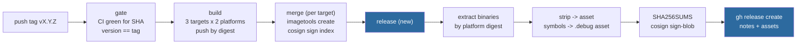

# ADR-0086: GitHub Releases, downloadable binaries, and release hygiene

Status: accepted

## Context

Ravel has four release tags (`v0.9.0` through `v0.9.3`) and **zero GitHub
Releases**. `gh api repos/NOFireAI/ravel/releases` returns `0`, and
`/releases/tags/v0.9.3` returns 404. The releases page shows bare tags: no
notes, no downloadable artifact, nothing that tells a visitor what changed or
gives them something to run without Docker.

ADR-0037 and its two amendments built a strong publishing pipeline: images are
signed, carry an SBOM and max-mode provenance, are gated on CI passing for the
exact tagged commit, and since ADR-0037's multi-arch amendment publish as
`linux/amd64` and `linux/arm64` indexes. None of that is visible from the
releases page, and none of it produces a binary a person can download.

Facts this ADR is built on, measured against the live registry and current
`main` rather than assumed:

- `[profile.release]` sets `debug = 1`. It is not incidental:
  ADR-0036 records it as *"the one piece already in place for line-level
  profiling"*. Removing it would silently revoke that ADR's premise.
- The cost of that setting on the shipped artifact is large and unmeasured
  until now. Extracted from `ghcr.io/nofireai/ravel-server:0.9.3` (arm64):
  `ravel-server` is **659 MB**; stripped it is **81.5 MB**; stripped and
  gzipped, **30.7 MB**. The published image is **923 MB**.
- The Dockerfile has three runtime targets (`server`, `operator`,
  `ingest-router`) and one builder stage, and the builder recompiles the whole
  workspace once per target. With two platforms that is six full workspace
  compiles per release; measured on the `v0.9.3` run, 23 to 31 minutes each.
- All four shippable binaries already exist inside those images: `server`
  carries `ravel-server` and `ravel-cli`, `operator` carries `ravel-operator`,
  `ingest-router` carries `ravel-ingest-router`.
- `docker create` plus `docker cp` extracts them. `docker run` cannot: the
  distroless runtime has no shell.
- `CHANGELOG.md` documents `0.9.0` only. Releases `0.9.1`, `0.9.2` and `0.9.3`
  have no entry, so any release process that reads the changelog as its source
  of notes would have shipped three empty releases.
- `main`'s ruleset requires seven checks: `changes`, `check`, `doc-scripts`,
  `features`, `flight-sql`, `lint`, `sql`. `supply-chain`, `docker-build`,
  `fuzz`, `object-store-contract`, `promql-difftest` and `quickstart` are not
  required. PR #227 merged while `supply-chain` was red for a live RustSec
  advisory (RUSTSEC-2026-0258 in h2).
- Nothing anywhere lints `.github/workflows/`. CLAUDE.md states no local gate
  compiles them, and no CI job does either. During epic #218 an executor ran
  `actionlint` and reported exit 0 on a file that a shellcheck-enabled
  `actionlint` flagged twice.

## Decision 1: the Release is a job in `publish-images.yml`, gated on the merge jobs

A new `release` job `needs:` all three per-target `merge` jobs and runs once
per tag push. It does not run on `workflow_dispatch`: a `manual-<sha>` publish
is a test artifact and must never create a public Release.

This is deliberately not a separate workflow. GitHub Actions has no
cross-workflow `needs:` (ADR-0037 decision 9 records this), so a separate
workflow could only poll or race. A Release that appears when the image
publish failed is worse than no Release at all: it advertises artifacts that do
not exist. Making it a downstream job in the same run makes "images published
and verified" a structural precondition rather than a hope.

## Decision 2: release binaries are extracted from the published images, never rebuilt

The `release` job pulls each platform's image **by its digest** and extracts
the binaries with `docker create` plus `docker cp`.

Rebuilding the binaries with a separate `cargo build` matrix was rejected: it
would add four more full workspace compiles to a release that already runs six,
and it would produce binaries that are not the binaries in the image. Extraction
gives a property a rebuild cannot: the file a user downloads is byte-identical
to the one inside the signed, attested image they can pull.

Extraction resolves the **platform-specific digest** from the index, never the
tag with `--platform`. This is the same trap as ADR-0037 decision 14: pulling
`0.9.3 --platform linux/arm64` on an amd64 runner can silently resolve a
manifest other than the one that was signed. The digest is read from the index
the merge job assembled.

## Decision 3: binaries ship stripped, with debug symbols as separate assets

`[profile.release] debug = 1` stays exactly as it is. ADR-0036 depends on it,
and a 659 MB `ravel-server` is what that setting costs.

The `release` job strips each extracted binary before uploading it, and uploads
the separated debug info as its own asset (`<name>-<os>-<arch>.debug`). Both
are listed in the checksums file.

Stripping without publishing symbols was rejected: a stack trace from a
deployed binary would stop being symbolizable, which trades away exactly what
ADR-0036 set that profile flag to buy. Publishing the unstripped binary was
also rejected: a 659 MB download, 120 MB gzipped, for a program that is 81.5 MB
of actual code is a hostile default, and the people who need symbols are a
small minority of the people who need the binary.

## Decision 4: assets carry checksums, and the checksum file is signed

The job writes a `SHA256SUMS` file covering every uploaded asset and signs it
with `cosign sign-blob` in the same keyless mode ADR-0037 decision 7 chose for
images, uploading the signature and certificate alongside it.

Signing each asset individually was rejected as redundant: a signature over a
checksum file that covers every asset gives the same guarantee with one
signature and one verification step, and it is the convention a user arriving
from other Rust projects already knows.

## Decision 5: release notes are auto-generated, with the changelog section prepended when it exists

Notes are produced with GitHub's own generated notes (the merged pull requests
since the previous tag) as the base. When `CHANGELOG.md` contains a section for
the version being released, that section is prepended above the generated list.

Reading the changelog as the sole source was rejected on evidence: it documents
`0.9.0` and nothing since, so this process would have produced three empty
releases. Requiring a changelog section to release was rejected for the same
reason: it makes the release fail closed on a documentation lapse, and a
release blocked on prose is a release that gets cut by hand instead.

Backfilling `CHANGELOG.md` entries for `0.9.1`, `0.9.2` and `0.9.3` **is in
scope** for this epic. The changelog is a normative document under CLAUDE.md's
doc-currency rule, and it is three releases stale.

## Decision 6: the README carries a release badge, and names all three images

A `shields.io` release badge joins the existing badge row, linking to
`/releases/latest`.

The badge renders "no releases" until a Release exists, so ordering matters:
the badge lands only after the first Release is created. Because `v0.9.3` is
already tagged and published, the rollout backfills a Release for it rather
than waiting for `v0.9.4`.

The same change fixes a stale claim next to it: the "Container images" section
names `ravel-server` and `ravel-operator` and its `docker pull` block lists
two, but three images publish. `ghcr.io/nofireai/ravel-ingest-router:0.9.3`
exists.

## Decision 7: CI lints workflow files

A job in `ci.yml` runs `actionlint` with `shellcheck` available, over
`.github/workflows/`.

The gap this closes is precise. During epic #218 a fleet executor ran
`actionlint` on a 300-line workflow rework, got exit 0, and reported it clean.
A shellcheck-enabled `actionlint` on the same file reported SC2046 and SC2129.
A linter whose sub-checker is not installed reports clean identically to one
that ran everything, and nothing downstream could tell the difference.

## Decision 8: a guard fails the build when workspace versions drift

A check asserts that every `version = "..."` on a path dependency in every
workspace manifest equals `[workspace.package] version`.

Epic #218 shipped a `0.9.3` bump that left seven per-crate path dependencies
requiring `0.9.2`. That compiles, because a caret requirement on `0.9.2` is
satisfied by a `0.9.3` path crate, so it is invisible until a **minor** bump
makes those requirements fail to resolve. The failure lands on whoever cuts
`0.10.0`, far from the change that caused it.

## Decision 9: the Dockerfile builds the workspace once per platform

The builder stage is restructured so all four binaries are produced by one
`cargo build` invocation, and the three runtime targets copy from that single
stage. The same change strips the binaries copied into the runtime images.

ADR-0037's multi-arch amendment named this and deferred it: *"Publish cost
roughly doubles: six full workspace compiles per release instead of three...
halving it by building the workspace once and deriving all three runtime
images belongs in its own change."* This is that change, and it now also
carries the image-size fix, because both are edits to the same file and
splitting them across tasks would produce two divergent rewrites of one
Dockerfile.

Expected effect: six full workspace compiles become two, and the server image
drops from 923 MB toward the ~100 MB its stripped contents occupy.

This is the highest-risk decision here. It rewrites the build of the image the
README's first command pulls, so it re-verifies natively on arm64 against the
same bar ADR-0037 decision 16 set: the stack up, `/healthz` returning 200, and
`demo/kill-and-recover.sh` passing.

## Decision 10: ADR-0037's "public mirror" premise is corrected in place

ADR-0037's amendments reason about releases publishing from a public mirror,
written when this repository was the private `store` and a separate public
mirror existed. `origin` is now `NOFireAI/ravel` directly and there is no
mirror. The prose is corrected where it describes topology; no decision
changes, and the `cosign verify` identity is unaffected because it already
resolves to this repository's workflow path.

## Decision 11: the required-checks list is proposed here, not changed here

This ADR records the evidence and a recommendation. It does not flip the
setting.

`supply-chain`, `docker-build`, `fuzz`, `object-store-contract` and
`promql-difftest` are recommended for promotion to required. The evidence is
concrete: PR #227 merged while `supply-chain` was red for a published RustSec
advisory, because the check is advisory. `docker-build` not being required
means a broken Dockerfile can reach `main`, which decision 9 makes materially
worse.

`quickstart` is deliberately excluded from that recommendation: ADR-0081's
consequences hold it advisory until its warm-cache budget is observed.

Branch protection is a repository setting, not code. It is applied by hand with
the owner's explicit go-ahead, never folded into an auto-merged pull request,
because a rule change that lands automatically can silently loosen the very
gate it is meant to tighten.

## Rejected alternatives

- **Publish macOS binaries.** Rejected for now. There is no tested macOS
  deployment path, the images that would source them do not exist, and it
  would mean a separate `cargo build` matrix, contradicting decision 2. A
  macOS user can run `ravel-cli` from the container. Revisit if asked for.
- **Build binaries with `cargo dist` or a release-plz style tool.** Rejected:
  both want to own the release pipeline, and this repository already has a
  gated, signed, attested one. Adopting a tool would mean re-deriving
  ADR-0037's gate, signing, and attestation decisions inside someone else's
  framework for no gain.
- **Static musl binaries.** Rejected: ADR-0037 already chose
  `distroless/cc` glibc over "untested musl", and decision 2 sources binaries
  from those images. Shipping a musl build would mean shipping something no
  image and no test ever exercised.
- **A separate `release.yml` workflow.** Rejected under decision 1: no
  cross-workflow `needs:`.
- **Removing `debug = 1`.** Rejected under decision 3: ADR-0036 depends on it.

## Consequences

- The releases page becomes the front door it currently is not: notes, four
  binaries per platform, symbols, checksums, and a signature.
- Binaries are glibc-dynamic, built against Debian 12. This is stated on the
  release, not left for a user to discover from an `ld.so` error.
- Release wall-clock grows by the extract-strip-sign-upload step, and shrinks
  far more from decision 9. Net expected: substantially faster.
- `SHA256SUMS` covers stripped binaries. A user who downloads the `.debug`
  asset verifies it from the same file.
- The badge is broken-looking until the first Release exists, which is why the
  rollout backfills `v0.9.3` before the badge lands.
- Decision 11 leaves a known gap open until someone with repository admin
  applies it. That is deliberate and is recorded rather than silently carried.
- No frozen format changes, no crate logic changes. This is CI configuration, a
  Dockerfile, and documentation.
