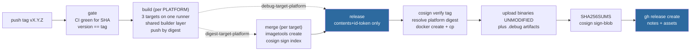
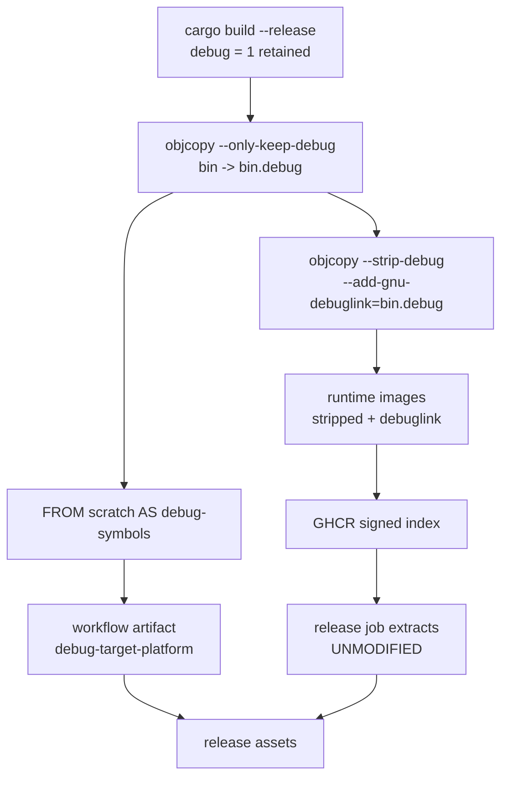

# ADR-0086: GitHub Releases, downloadable binaries, and release hygiene

Status: accepted

## Context

Ravel has four release tags (`v0.9.0` through `v0.9.3`) and **zero GitHub
Releases**. `gh api repos/NOFireAI/ravel/releases` returns `0`, and
`/releases/tags/v0.9.3` returns 404. The releases page shows bare tags: no
notes, no downloadable artifact, nothing that tells a visitor what changed or
gives them something to run without Docker.

ADR-0037 and its two amendments built a strong publishing pipeline: images are
signed, carry an SBOM and max-mode provenance, are gated on CI passing for the
exact tagged commit, and since ADR-0037's multi-arch amendment publish as
`linux/amd64` and `linux/arm64` indexes. None of that is visible from the
releases page, and none of it produces a binary a person can download.

Facts this ADR is built on, measured against the live registry and current
`main` rather than assumed:

- `[profile.release]` sets `debug = 1`. It is not incidental:
  ADR-0036 records it as *"the one piece already in place for line-level
  profiling"*. Removing it would silently revoke that ADR's premise.
- The cost of that setting on the shipped artifact is large and unmeasured
  until now. Extracted from `ghcr.io/nofireai/ravel-server:0.9.3` (arm64):
  `ravel-server` is **659 MB**; stripped it is **81.5 MB**; stripped and
  gzipped, **30.7 MB**. The published image is **923 MB**.
- The Dockerfile has three runtime targets (`server`, `operator`,
  `ingest-router`) and a single builder stage that produces all four binaries;
  every runtime target already copies from that one stage. The six full
  workspace compiles per release come from the publish workflow's
  `target x platform` matrix, which is six independent jobs on six runners with
  `type=gha` caching deliberately off (ADR-0037 decision 4), so no job can
  reuse another's builder layer. Measured on the `v0.9.3` run: 23 to 31 minutes
  each.
- All four shippable binaries already exist inside those images: `server`
  carries `ravel-server` and `ravel-cli`, `operator` carries `ravel-operator`,
  `ingest-router` carries `ravel-ingest-router`.
- `docker create` plus `docker cp` extracts them. `docker run` cannot: the
  distroless runtime has no shell.
- `CHANGELOG.md` documents `0.9.0` only. Releases `0.9.1`, `0.9.2` and `0.9.3`
  have no entry, so any release process that reads the changelog as its source
  of notes would have shipped three empty releases.
- `main`'s ruleset requires seven checks: `changes`, `check`, `doc-scripts`,
  `features`, `flight-sql`, `lint`, `sql`. `supply-chain`, `docker-build`,
  `fuzz`, `object-store-contract`, `promql-difftest` and `quickstart` are not
  required. PR #227 merged while `supply-chain` was red for a live RustSec
  advisory (RUSTSEC-2026-0258 in h2).
- Nothing anywhere lints `.github/workflows/`. CLAUDE.md states no local gate
  compiles them, and no CI job does either. During epic #218 an executor ran
  `actionlint` and reported exit 0 on a file that a shellcheck-enabled
  `actionlint` flagged twice.

## Decision 1: the Release is a job in `publish-images.yml`, gated on the merge jobs

A new `release` job `needs:` all three per-target `merge` jobs and runs once
per tag push. It does not run on `workflow_dispatch`: a `manual-<sha>` publish
is a test artifact and must never create a public Release.

The release job's permissions are exactly `contents: write` and
`id-token: write`. It holds no `packages` permission: the images it extracts
from are public and are pulled anonymously. It also carries
`if: github.event_name == 'push'` alongside its `needs:`, so a dispatch run
skips it rather than failing it. Stating this here is not pedantry: the
obvious implementation copies the merge job's permission block and adds
`contents: write`, producing a job holding all three and quietly undoing the
least-privilege split ADR-0037 decision 17 established.

This is deliberately not a separate workflow. GitHub Actions has no
cross-workflow `needs:` (ADR-0037 decision 9 records this), so a separate
workflow could only poll or race. A Release that appears when the image
publish failed is worse than no Release at all: it advertises artifacts that do
not exist. Making it a downstream job in the same run makes "images published
and verified" a structural precondition rather than a hope.

## Decision 2: release binaries are extracted from the published images, never rebuilt

The `release` job extracts the binaries from each published image with
`docker create` plus `docker cp`, and uploads them **unmodified**. Every
transformation (stripping, symbol separation) happens in the builder stage
under decision 3, so the file a user downloads is byte-identical to the file
inside the signed, attested image they can pull. That property is the reason
for this decision and it only holds because nothing is modified here.

Rebuilding the binaries with a separate `cargo build` matrix was rejected. Not
primarily for cost (it would be two more workspace compiles, one per platform,
not four), but because it would produce binaries that are not the binaries in
the image: a second artifact, built from the same source but never exercised by
the quickstart, the kind lanes, or anything else that tests what actually
ships.

Digest resolution is specified, because the obvious shortcut is a trap this
pipeline already documented. The release job resolves each target's
platform-specific digests from the registry by inspecting the run's immutable
identity tag (`docker buildx imagetools inspect --raw`, selecting the runnable
platform entries), the same maneuver the merge job's platform check uses. It
does **not** read them from `needs.merge.outputs`: the merge job is a
three-target matrix and a matrix's job outputs collapse last-writer-wins, which
is exactly what ADR-0037 decision 13 routed around with artifacts. It does not
pull a tag with `--platform` either (ADR-0037 decision 14).

Before extracting, the job runs the README's own `cosign verify` invocation
against each identity tag, so "extracted from the signed image" is checked
rather than assumed.

The job extracts an explicit expected inventory and fails if any path is
absent: `server` provides `ravel-server` and `ravel-cli`, `operator` provides
`ravel-operator`, `ingest-router` provides `ravel-ingest-router`. A future
Dockerfile change that drops or renames a binary then fails the release loudly,
instead of publishing a Release with an asset silently missing.

## Decision 3: debug info is split in the builder, not after extraction

`[profile.release] debug = 1` stays exactly as it is. ADR-0036 depends on it,
and a 659 MB `ravel-server` is what that setting costs.

The split happens in the builder stage, before anything is copied into a
runtime image. For each binary: `objcopy --only-keep-debug <bin> <bin>.debug`,
then `objcopy --strip-debug --add-gnu-debuglink=<bin>.debug <bin>`. The runtime
images receive the stripped binaries, which carry a `.gnu_debuglink` section. A
dedicated non-runtime stage (`FROM scratch AS debug-symbols`) receives the
`.debug` files; each per-platform build job exports that stage with
`--output type=local` and uploads the result as a workflow artifact named
`debug-<target>-<platform>`, following the same per-target-and-per-platform
naming rule ADR-0037 decision 14 requires of the digest artifacts. The release
job downloads those and uploads each as `<name>-<os>-<arch>.debug`.

Doing the split here rather than in the release job is forced by two things,
either of which alone would decide it:

- **It is the only ordering that is self-consistent.** If the images ship
  stripped and the release job tries to separate symbols afterwards, there is
  nothing left to separate: `objcopy --only-keep-debug` on an
  already-stripped binary yields an empty, useless `.debug` file while every
  step exits 0. And if the release job strips instead, then what it uploads is
  by construction not what is in the image, and decision 2's byte-identity
  property is false.
- **The release job cannot do it anyway.** It is a single job on a single
  architecture, and GNU `objcopy` on an amd64 runner will not correctly process
  an aarch64 ELF. The builder runs natively per platform (ADR-0037 decision
  12), so it is the only place where a native toolchain already matches the
  binary. If any object manipulation is ever added back to the release job, it
  must use `llvm-objcopy`, which is target-agnostic.

`--add-gnu-debuglink` is not decoration. Without it a downloaded `.debug` file
requires the user to know to run `symbol-file` by hand; with it, gdb and
friends resolve symbols by name automatically.

Shipping unstripped binaries was rejected: a 659 MB download, 120 MB gzipped,
for 81.5 MB of actual code is a hostile default. Stripping without publishing
symbols was also rejected: it would revoke exactly what ADR-0036 set the
profile flag to buy.

This decision is also what shrinks the published images, from 923 MB toward the
size their stripped contents occupy. That is a direct consequence of the same
`objcopy` step, not a separate change.

## Decision 4: assets carry checksums, and the checksum file is signed

The job writes a `SHA256SUMS` file covering every uploaded asset and signs it
with `cosign sign-blob` in the same keyless mode ADR-0037 decision 7 chose for
images, uploading the signature and certificate alongside it.

Signing each asset individually was rejected as redundant: a signature over a
checksum file that covers every asset gives the same guarantee with one
signature and one verification step, and it is the convention a user arriving
from other Rust projects already knows.

## Decision 5: release notes are auto-generated, with the changelog section prepended when it exists

Notes are produced with GitHub's own generated notes (the merged pull requests
since the previous tag) as the base. When `CHANGELOG.md` contains a section for
the version being released, that section is prepended above the generated list.

Reading the changelog as the sole source was rejected on evidence: it documents
`0.9.0` and nothing since, so this process would have produced three empty
releases. Requiring a changelog section to release was rejected for the same
reason: it makes the release fail closed on a documentation lapse, and a
release blocked on prose is a release that gets cut by hand instead.

The job reads `CHANGELOG.md` from the **tagged tree**, so a section only reaches
a Release if it was committed before the tag was cut. That has a consequence
worth stating plainly rather than discovering later: the backfilled `0.9.1`
through `0.9.3` entries land on `main` after those tags already exist, so they
will never appear in any automated release's notes. They are for readers of the
file, not for the releases page.

Backfilling `CHANGELOG.md` entries for `0.9.1`, `0.9.2` and `0.9.3` **is in
scope** for this epic. It is reconstruction, not invention: the tags exist and
the merged pull requests in each range are recoverable from history. The changelog is a normative document under CLAUDE.md's
doc-currency rule, and it is three releases stale.

## Decision 6: the README carries a release badge, and names all three images

A `shields.io` release badge joins the existing badge row, linking to
`/releases/latest`.

The badge renders "no releases" until a Release exists, so ordering matters:
the badge lands only after the first Release is created.

The first Release is `v0.9.4`, cut once this epic lands. Backfilling one for
the already-published `v0.9.3` was considered and rejected. Every automated
path to it is closed by this ADR's own rules: the tag is already pushed so no
push trigger fires again, re-pushing it violates the write-once policy, the
original run executed a workflow file that had no release job, and decision 1
forbids a dispatch run from creating a Release. That leaves a manual
`cosign sign-blob`, which would carry a human's Fulcio identity rather than the
workflow identity the README documents, making the very first Release users
see the one that does not match the verification story. And `v0.9.3`'s images
predate decision 3, so they hold unstripped binaries with no debuglink: its
assets would be structurally unlike every release after it.

Cutting `v0.9.4` costs one tag push and produces a Release that is honest about
its own provenance. The epic's own changes are its changelog entry.

The same change fixes a stale claim next to it: the "Container images" section
names `ravel-server` and `ravel-operator` and its `docker pull` block lists
two, but three images publish. `ghcr.io/nofireai/ravel-ingest-router:0.9.3`
exists.

## Decision 7: CI lints workflow files

A job in `ci.yml` runs `actionlint` with `shellcheck` available, over
`.github/workflows/`.

The gap this closes is precise. During epic #218 a fleet executor ran
`actionlint` on a 300-line workflow rework, got exit 0, and reported it clean.
A shellcheck-enabled `actionlint` on the same file reported SC2046 and SC2129.
A linter whose sub-checker is not installed reports clean identically to one
that ran everything, and nothing downstream could tell the difference.

## Decision 8: a guard fails the build when workspace versions drift

A check asserts that every `version = "..."` on a path dependency in every
workspace manifest equals `[workspace.package] version`.

Epic #218 shipped a `0.9.3` bump that left seven per-crate path dependencies
requiring `0.9.2`. That compiles, because a caret requirement on `0.9.2` is
satisfied by a `0.9.3` path crate, so it is invisible until a **minor** bump
makes those requirements fail to resolve. The failure lands on whoever cuts
`0.10.0`, far from the change that caused it.

## Decision 9: the publish matrix collapses to one dimension, so the workspace compiles once per platform

The six full workspace compiles do **not** come from the Dockerfile. The
builder is already a single stage that produces all four binaries, and all
three runtime targets already copy from it. They come from the workflow: the
build matrix is `target × platform`, which is six independent jobs on six
runners, and ADR-0037 decision 4 deliberately disabled `type=gha` caching, so
no job can reuse another's builder layer.

The fix is therefore in the workflow, not the Dockerfile. The build matrix
collapses to a single dimension, `platform: [linux/amd64, linux/arm64]`. Each
platform job runs three `docker/build-push-action` invocations, one per target,
sequentially on the same runner. The second and third hit the first's local
layer cache for the shared builder stage, so the workspace compiles once per
platform rather than three times. Each invocation keeps `sbom: true` and
`provenance: mode=max` (ADR-0037 decision 15 unchanged) and pushes by digest,
and the job uploads three digest artifacts named `digest-<target>-<platform>`
exactly as decision 14 requires, so the per-target merge jobs need no change at
all. Build-job permissions are unchanged: `packages: write`, no `id-token`.

The builder's four sequential `cargo build` invocations stay four. Collapsing
them into one `cargo build -p ... -p ... --features ravel-server/sql` was
considered and rejected: this workspace is `resolver = "3"`, and feature
resolution still unifies features of shared dependencies across every package
selected in a single invocation. Enabling `ravel-server/sql` pulls the
DataFusion tree into that unified graph, and whatever features it turns on for
dependencies shared with `ravel-cli`, `ravel-operator` and
`ravel-ingest-router` would then compile into those binaries too. The change is
usually additive and harmless, but it is unverified, it silently alters what
ships, and it buys almost nothing: the four invocations already share one
target directory inside one stage. Collapsing them trades a real correctness
question for a negligible saving.

Expected effect: six full workspace compiles become two. Measured against the
`v0.9.3` run's 23 to 31 minutes per compile, that is the dominant cost of a
release.

ADR-0037's multi-arch amendment named this and deferred it: *"halving it by
building the workspace once and deriving all three runtime images belongs in
its own change."* This is that change. Its premise was slightly off, in that it
implied the waste was in the image build; it is in the job matrix.

This is the highest-risk decision here. It restructures the workflow that
publishes the image the README's first command pulls, so it re-verifies
natively on arm64 against the bar ADR-0037 decision 16 set: the stack up,
`/healthz` returning 200, and `demo/kill-and-recover.sh` passing.

## Decision 10: ADR-0037's stale topology gets a dated amendment, not a silent edit

ADR-0037's amendments reason about releases publishing from a public mirror,
written when this repository was the private `store` and a separate public
mirror existed. `origin` is now `NOFireAI/ravel` directly and there is no
mirror.

A short dated "Amendment: repository topology" section is appended to ADR-0037
stating that, noting that mirror-era reasoning should be read historically, and
confirming the `cosign verify` identity is unaffected because it already
resolves to this repository's workflow path.

Correcting the prose in place was rejected. That reasoning is load-bearing
history: decision 7 argues keyless signing is right partly because *"the mirror
is the repository strangers can actually read"*, and decision 9 rejects the
implicit CI gate specifically because the mirror rewrote history. Editing the
topology out from under those arguments leaves them reading as non sequiturs
and hides that the topology ever changed. Dated amendment sections are this
ADR's own established convention, twice over.

## Decision 11: the required-checks list is proposed here, not changed here

This ADR records the evidence and a recommendation. It does not flip the
setting.

`supply-chain`, `docker-build`, `fuzz`, `object-store-contract` and
`promql-difftest` are recommended for promotion to required. The evidence is
concrete: PR #227 merged while `supply-chain` was red for a published RustSec
advisory, because the check is advisory. `docker-build` not being required
means a broken Dockerfile can reach `main`, which decision 9 makes materially
worse.

`quickstart` is deliberately excluded from that recommendation: ADR-0081's
consequences hold it advisory until its warm-cache budget is observed.

Branch protection is a repository setting, not code. It is applied by hand with
the owner's explicit go-ahead, never folded into an auto-merged pull request,
because a rule change that lands automatically can silently loosen the very
gate it is meant to tighten.

## Rejected alternatives

- **Publish macOS binaries.** Rejected for now. There is no tested macOS
  deployment path, the images that would source them do not exist, and it
  would mean a separate `cargo build` matrix, contradicting decision 2. A
  macOS user can run `ravel-cli` from the container. Revisit if asked for.
- **Build binaries with `cargo dist` or a release-plz style tool.** Rejected:
  both want to own the release pipeline, and this repository already has a
  gated, signed, attested one. Adopting a tool would mean re-deriving
  ADR-0037's gate, signing, and attestation decisions inside someone else's
  framework for no gain.
- **Static musl binaries.** Rejected: ADR-0037 already chose
  `distroless/cc` glibc over "untested musl", and decision 2 sources binaries
  from those images. Shipping a musl build would mean shipping something no
  image and no test ever exercised.
- **A separate `release.yml` workflow.** Rejected under decision 1: no
  cross-workflow `needs:`.
- **Removing `debug = 1`.** Rejected under decision 3: ADR-0036 depends on it.
- **Collapsing the builder's four `cargo build` invocations into one.**
  Rejected under decision 9: `resolver = "3"` unifies shared-dependency
  features across a combined package selection, so it would silently change
  what three of the four binaries are compiled with, to save almost nothing.
- **Stripping in the release job instead of the builder.** Rejected under
  decision 3: it contradicts decision 2's byte-identity property, and a single
  release job cannot correctly `objcopy` a foreign-architecture ELF anyway.
- **Backfilling a Release for `v0.9.3`.** Rejected under decision 6: no
  automated path to it exists that this ADR's own rules permit, and the manual
  one would sign under an identity the README does not document.
- **Editing ADR-0037's mirror prose in place.** Rejected under decision 10: it
  erases load-bearing history and leaves two decisions' rationales reading as
  non sequiturs.

## Consequences

- The releases page becomes the front door it currently is not: notes, four
  binaries per platform, symbols, checksums, and a signature.
- Binaries are glibc-dynamic, built against Debian 12. This is stated on the
  release, not left for a user to discover from an `ld.so` error.
- Release wall-clock grows by the extract-strip-sign-upload step, and shrinks
  far more from decision 9. Net expected: substantially faster.
- `SHA256SUMS` covers stripped binaries. A user who downloads the `.debug`
  asset verifies it from the same file.
- The badge is broken-looking until the first Release exists, which is why it
  lands together with the `v0.9.4` cut rather than before it.
- Decision 11 leaves a known gap open until someone with repository admin
  applies it. That is deliberate and is recorded rather than silently carried.
- No frozen format changes, no crate logic changes. This is CI configuration, a
  Dockerfile, and documentation.
