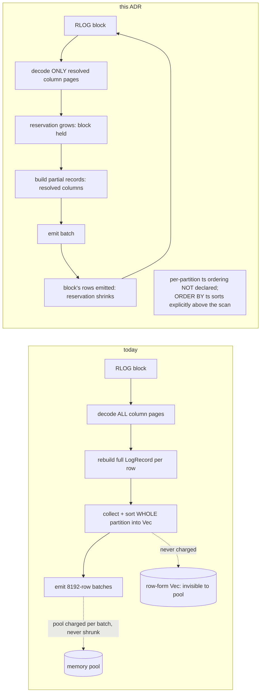

# ADR-0087: streaming, column-projecting logs SQL scan

Status: Proposed

## Context

The logs SQL scan (`crates/ravel-sql/src/logs_scan.rs`) reads a query
partition by decoding every RLOG block in full, rebuilding each record in
row form (`Vec<(String, AttrValue)>` per record), collecting the whole
partition into one `Vec<LogRecord>`, sorting it by `ts`, then emitting it
in fixed 8192-row batches (`BATCH_ROWS`). `crates/ravel-logseg/src/block.rs`
`read_block` decodes every page of every column in a block regardless of
which columns the query references; there is no column-set parameter on
the read path. The per-query memory reservation (`try_grow` on each
emitted batch, `logs_scan.rs`) only grows over the life of the query and
is freed once on drop: it tracks cumulative Arrow bytes emitted, not
bytes currently resident, so it bounds throughput, not memory pressure.
The row-form `Vec<LogRecord>` collected before emission is never charged
against this reservation at all — it is invisible to the DataFusion
memory pool regardless of which bound is used.

At roughly 100 dynamic attributes per record this is several KB of
row-form memory per record before any Arrow array exists. Because
projection is applied *above* the scan today (a `ProjectionExec` that
drops unwanted columns after the scan has already produced them,
`crates/ravel-sql/src/logs_provider.rs`), even `COUNT(*)` receives every
column from the scan; at ~100 attributes per row the emitted `attrs` Map
arrays alone cross the default 256 MiB SQL pool well under 100,000 rows,
long before any aggregate state is built. Raising the pool ceiling does
not fix this: the collect-then-emit design keeps growing the *emitted*
charge without bound as more rows are scanned, and the row-form
collection stage that precedes it is not charged at all, so no pool
setting makes a full-table scan of a large logs table complete.

A second, load-bearing fact this ADR must not lose: the scan declares a
per-partition `ts` ascending ordering through `PlanProperties`
(`logs_scan.rs`, doc comment: "Declaring `ts` ascending is therefore
truthful for the stream this stage produces"), and earns that truth by
sorting the *entire collected partition* before emitting it — `RlogReader`
itself only emits a segment's records grouped by `(stream_ref, ts)`, not
globally by `ts`, and a partition spans several segments. Any change that
streams blocks out one at a time without also buffering across the whole
partition breaks that sort silently: DataFusion trusts the declared
ordering downstream (`ORDER BY ts`, a sort-preserving merge) and would
produce wrong results with no error, not a slower correct one.

## Decision

Three changes, delivered together because a correct fix to one requires
the other two:

1. **Drop the per-partition global `ts` ordering guarantee from
   `PlanProperties`.** A block-streaming scan can only guarantee the order
   `RlogReader` already produces — grouped by `(stream_ref, ts)` within
   each block, not globally ascending across a partition. `ORDER BY ts`
   queries get their ordering from an explicit sort operator above the
   scan instead of a leaf-level guarantee. This is the correctness
   prerequisite for streaming at all; everything below assumes it.
2. **Live memory reservation.** The reservation is grown when a block's
   decoded columns and the row-form records built from them are held, and
   shrunk when that block's data is no longer needed (its rows have been
   emitted downstream or discarded by predicate evaluation). It charges
   what streaming decode actually holds at a point in time — one block's
   worth of buffered data plus the batch under construction — not
   cumulative output. The pool (256 MiB, or operator-configured per
   ADR-0088) now bounds concurrently-held scan memory, which is what an
   operator sizing a host needs it to bound.
3. **Column projection into the reader.** The projected column set is
   defined as: the fixed columns always needed (`stream_ref`, `ts`), the
   schema columns DataFusion's `ProjectionExec` requests, every field
   named by a pushed content predicate (`LogQuery.content`, evaluated
   exactly per row in `RlogReader::eval`), and every attribute key named
   by a pending erasure predicate (record-level in the fetcher, merged
   resource/scope/record level at the scan's `retain_unerased`, ADR-0064
   — both must see the columns they filter on). Because the SQL schema
   exposes attributes as a single `attrs` Map column (ADR-0033), any
   query that references `attrs` at all — including `SELECT *` — is
   treated as referencing every dynamic column plus the `attrs_raw`
   overflow column; per-key projection through `attrs['k']` expressions
   is out of scope for this ADR and left for the typed-attribute-columns
   epic. `read_block` decompresses and decodes only pages for the
   resolved column set; skip-index and bloom evaluation, which already
   operate on stored statistics rather than decoded pages, are unchanged.
   Whole-object GET is retained; `RlogRangeReader` (`ravel-logseg::ranged`)
   already exists for per-stream block-range reads and is the natural
   target for a later range-read change, out of scope here.

This touches three crates, not one file: `ravel-logseg` (`read_block`'s
signature, and its other callers — `RlogReader::scan_pruned` and the
ranged reader used by `ravel-maintain` compaction, both of which must stay
byte-identical when no column filter is supplied), `ravel-query`
(`LogSegmentFetcher`, which returns the collected `Vec<LogRecord>` today
and must support a streaming/callback mode), and `ravel-sql` (the scan
executor itself).

## Rejected alternatives

- **Raise the pool ceiling instead of changing the reservation model.**
  Rejected: the row-form collection stage is never charged against any
  pool setting, so no ceiling fixes the failure mode; it only postpones
  it to a larger table while leaving the actual resident memory
  unaccounted for.
- **Column projection only, reservation semantics unchanged.** Rejected:
  a cumulative-emitted reservation still charges for the whole table's
  worth of output on a full scan regardless of how narrow each batch is,
  so a `COUNT(*)` at large row counts still exhausts the pool for a
  reason unrelated to what memory is actually held at any instant.
- **Keep the per-partition `ts` ordering by buffering the whole partition
  before emitting (stream only the block-decode step).** Rejected: this
  keeps peak memory proportional to partition size rather than block
  size, which is the exact problem this ADR exists to remove; a partition
  spanning a large `logs` table is no better bounded than today.
- **Larger fixed batch size / fewer batches.** Does not change the
  underlying charge-what-you-emit-forever model; only shifts where the
  ceiling is hit.

## Consequences

- Dropping the leaf-level `ts` ordering guarantee is a plan-shape change:
  any downstream operator relying on a sort-preserving merge over logs
  scan partitions now needs an explicit sort. A test must assert
  `ORDER BY ts` still returns correctly sorted results (via the added
  sort, not the removed leaf guarantee) — this is the must-not-regress
  case for this ADR.
- `docs/query-engine.md` and `docs/guides/query.md` ("Query budgets"
  section) gain the corrected description of what the SQL pool bounds:
  concurrently-held scan memory, not cumulative query output. (Not
  `docs/guides/caching.md` — that page's 256 MiB figure is
  `--cache-max-bytes`, the unrelated read cache.)
- A new bounded-memory test: a fixture large enough that the *cumulative*
  emitted-bytes charge would exceed a small pool (e.g. 8 MiB) by an order
  of magnitude, with a full-table `COUNT(*)` and a `GROUP BY` completing
  within that pool — proving peak memory tracks live block/batch state,
  not total rows scanned.
- No format change: RLOG's on-disk layout, FIELD_DIR, and page structure
  are untouched. This is a read-path change only, but it is not confined
  to `ravel-sql`; `ravel-logseg` and `ravel-query` callers listed above
  must be updated in the same change and their existing differential
  tests (including `ravel-maintain` compaction, which uses the ranged
  reader) must still pass unmodified when no column filter is supplied.
- Scan fan-out (`target_partitions`) versus S3 GET concurrency
  (`fetch_concurrency`) are the same knob today
  (`crates/ravel-sql/src/session.rs`); this ADR does not decouple them.
  ADR-0088 exposes `--fetch-concurrency` as the single flag governing
  both; a future decoupling is a separate decision, not implied here.
