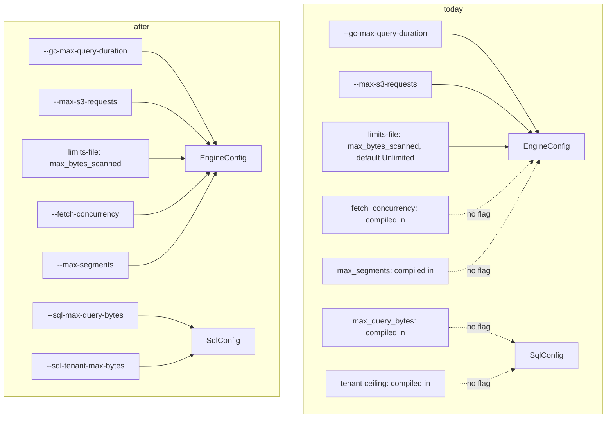

# ADR-0088: operator-configurable query budgets

Status: Accepted (amended 2026-09-02, see "Amended 2026-09-02" below)

## Context

Several budgets that decide whether a large analytical query completes
are compiled in with no flag: the SQL per-query memory pool (256 MiB,
`crates/ravel-sql/src/config.rs`, its own comment calls it "a placeholder
pending measurement"), the per-tenant SQL ceiling (1 GiB,
`services/ravel-server/src/query.rs`), `fetch_concurrency` (8,
`crates/ravel-query/src/config.rs`), and `max_segments` (1024). Flags
already exist for the engine deadline (`--gc-max-query-duration`) and
`--max-s3-requests`; `max_bytes_scanned` is not a flag today — it comes
from the `--limits-file` TOML's `query_defaults.max_bytes_scanned`
(default Unlimited). Nothing threads the compiled-in values into
`EngineConfig`/`SqlConfig` except the ones the server already overrides.

`max_segments` needs correcting from an earlier draft of this ADR: it is
not exempt for "fresh or lightly-compacted tables" in general.
`SegmentOrigin::Recent` is a narrow exemption — segments the fold-below-
watermark listing path resolves directly, roughly the most recent couple
of hours. Everything older counts as `SealedBelowWatermark` toward the
1024 cap regardless of whether it has been compacted. A wide scan over a
tenant with many sealed L0 or L1 objects — the exact shape of workload
this ADR is meant to unblock — hits the cap directly, so it belongs in
the flag set, not left compiled in.

An operator sizing a specific host — more or less memory, more or fewer
cores, a workload with wider scans than the defaults were chosen for —
cannot express any of this today without a rebuild.

## Decision

Add server flags for `max_query_bytes` (SQL per-query pool), the
per-tenant SQL ceiling, `fetch_concurrency`, and `max_segments`. Document
`fetch_concurrency`'s relation to scan partition count: it is, today, the
single knob governing both SQL scan fan-out and S3 GET concurrency
(ADR-0087 does not decouple them). Document the existing
`--max-s3-requests` flag and the limits-file `max_bytes_scanned` default,
and how to size both for wide scans. Verify `--gc-max-query-duration` at
multi-minute values passes validation against the tenant's durable
`sys/gc.max_query_duration` (default 1 h) — a deadline set above that
value requires raising `sys/gc` first, and this ADR documents that
ordering rather than silently accepting a flag value the engine can never
honor.

The new per-query and per-tenant SQL budgets are server flags, not
limits-file entries, even though the limits-file is this repo's existing
precedent for a per-tenant override (ADR-0061). The limits-file's
per-tenant query overrides are process-wide today with no per-tenant
`EngineConfig` lookup at query time (`services/ravel-server/src/main.rs`
warns exactly this: a per-tenant override there is currently inert).
Adding new per-tenant knobs to a mechanism already known not to enforce
per-tenant scoping would ship a second budget an operator could
reasonably expect to be tenant-scoped and would not be. A server flag is
honest about being process-wide; per-tenant SQL budgets are future work
once the limits-file's per-tenant enforcement gap is closed.

**Defaults are unchanged at ship time.** The 256 MiB and 1 GiB figures
stay exactly as they are; only the ability to override them is new. The
"placeholder pending measurement" comments are replaced with the actual
default rationale (today's compiled-in value, adjustable via flag) rather
than with a new guessed number. Changing the default is a separate,
measurement-backed follow-up once real workload data exists — this ADR is
about giving operators a lever, not about deciding where the lever should
default to for workloads nobody has measured yet.

(Superseded by the amendment below: that follow-up is issue #1141, and
the measurement is #968.)

## Rejected alternatives

- **Choose new default values now, based on estimated workloads.**
  Rejected: there is no measurement behind any candidate number, so a new
  default would just be a different placeholder with more confidence
  behind it than it has earned. This ADR ships the lever; the follow-up
  ships the number, backed by data.
- **A single global budget instead of per-query and per-tenant.**
  Rejected: the per-tenant ceiling exists specifically for multi-tenant
  isolation (one tenant's wide scan should not starve another's query
  pool). Collapsing to one budget removes that isolation property.
- **Auto-tune budgets from host resources at startup.** Rejected as scope
  creep beyond what this ADR decides: the goal is operator control that
  is explicit and auditable in server flags/config, not inference from
  detected host capacity, which hides the actual bound in play from
  whoever is reading the startup flags.
- **Put the new SQL budgets in the limits-file instead of server flags.**
  Rejected: the limits-file's per-tenant override path has no per-tenant
  `EngineConfig` lookup at query time today (a known gap noted in
  `main.rs`), so a per-tenant entry there would silently not do what its
  location implies. A process-wide server flag is honest about its own
  scope; per-tenant SQL budgets wait on that gap closing.

## Consequences

- Every new flag needs a reachability test in the shape of the existing
  `max_s3_requests_budget_is_reachable_from_cli` test
  (`services/ravel-server/src/config.rs`): the flag's value proven to
  arrive at the `EngineConfig`/`SqlConfig` the engine actually uses,
  driven through real server startup — not a unit test on the flag parser
  alone. This project has shipped features that parsed correctly and
  never reached their consumer before (a registered-but-unreachable table
  provider, an unreachable erasure filter); this ADR's acceptance
  criterion is explicitly the reachability shape, not just "flag parses."
- `docs/guides/operations.md`, `docs/guides/query.md`, and
  `docs/guides/admission-limits.md` gain the new flags and the
  `--max-s3-requests` sizing guidance.
- No behavior change at default flag values: every default matches
  today's compiled-in constant exactly. (Amended below: an unset flag is
  now derived from the host.)

## Amended 2026-09-02: unset means derive (issue #1141)

The follow-up this ADR deferred ("Changing the default is a separate,
measurement-backed follow-up once real workload data exists") is now
done. The measurement is the ClickBench result on issue #968, run on a
16-core, 30 GB host. Every setting that run needed had to be typed on the
command line, because each default was sized for a laptop; a deployment
that did not read that runbook got a server that could not complete the
workload at all. An unset flag now means DERIVE from the host, and an
explicit flag still wins, verbatim and unchanged in meaning.

The six rules, and what each is measured against on #968:

| Setting | Derived default | #968 measurement |
|---|---|---|
| `--fetch-concurrency` | `max(8, 2 x cores)` | 32 on the 16-core host; this is the knob that moved a cold full scan the most, and it also sets the SQL scan partition count |
| `--cache-max-bytes` | 80% of `MemTotal` | ~24 GiB, chosen to exceed the ~12 GB corpus so a warm run has a hot column to report |
| `--sql-max-query-bytes` | 25% of `MemTotal` | ~8 GiB, an order of magnitude above the largest value the in-process lane had been run at; this is the pool an `ORDER BY` or high-cardinality `GROUP BY` exhausts with `query memory budget exhausted` |
| `--sql-tenant-max-bytes` | 50% of `MemTotal` | ~16 GiB, twice the per-query pool so a serial run never binds on the isolation ceiling |
| `--max-segments` | 1,000,000 | a folded ClickBench tenant resolves ~8,400 sealed segments, so the old 1024 cap failed every statement with `8424 exceeds max 1024` |
| `--gc-max-query-duration` | 11 minutes | the deadline the run was configured with, well above the 30s compiled-in engine default its longest statements would have hit, and well under the durable `sys/gc` `max_query_duration` default of 1h that query-mode startup validates against |

Consequences of the amendment:

- The host is read once at startup (`HostProfile`: cores from
  `std::thread::available_parallelism`, memory from `/proc/meminfo`'s
  `MemTotal` on Linux) and every consumer takes the resolved value.
  `resolve_performance_defaults` is pure and takes the profile as a
  parameter, so no test reads the machine it runs on.
- A host whose memory cannot be read (a non-Linux target, an unreadable
  `/proc/meminfo`) falls back to the exact constants this ADR shipped:
  256 MiB, 1 GiB, 256 MiB cache. A percentage of an unknown total is not
  a number, and assuming one would size a 24 GiB cache on a 2 GB box.
- The per-query SQL pool is clamped to the per-tenant ceiling, downward
  only. Raising the ceiling to fit a per-query flag would silently widen
  the multi-tenant isolation bound this ADR's "Rejected alternatives"
  defends, so the clamp lowers the per-query pool instead and warns.
- The amendment answers this ADR's "Auto-tune budgets from host resources
  at startup", rejected above as hiding the actual bound in play from
  whoever reads the startup flags. That objection is met by making the
  resolution visible rather than by not deriving: startup logs one line
  per setting with its value and its source (`derived`, `flag`, or
  `fallback`), which is a stronger audit surface than a flag list, since
  it reports the number in force rather than the number requested.
- Percentages are integer arithmetic with truncation, computed in `u128`,
  so a resolved figure is reproducible from `MemTotal` by hand.
- The reachability criterion above is unchanged and extended: the derived
  value, not just the flag value, is proven to arrive at the
  `EngineConfig`/`SqlConfig`/cache the process actually uses.
