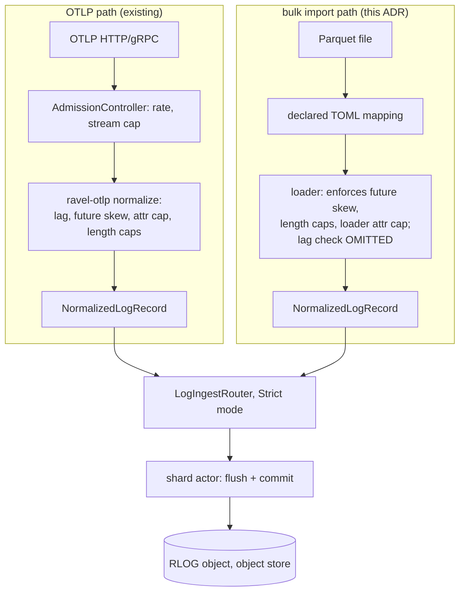

# ADR-0089: bulk import of structured event data into the logs signal

Status: Accepted

## Context

The only way to write log records into Ravel is OTLP: `crates/ravel-otlp`
enforces a two-hour past-event-time lag, a matching future-skew bound, a
128-attribute-per-record cap, and several length caps, on top of a
per-tenant `AdmissionController` (active-stream cap, stream-creation rate,
byte rate) that lives in `services/ravel-server/src/logs_ingest.rs`, one
layer above the router. There is no bulk import path. Loading an existing
structured dataset — a Parquet export, an archive migration, a historical
backfill — requires writing code against internal crates.

The event-time lag exists to protect a specific hazard, documented in
`docs/guides/ingest.md`: a point admitted with too old an event time could
land in a bucket a query has already stopped looking at. The record's
ingest-hour bucket is derived from the *flush-open wall clock*
(`crates/ravel-ingest/src/config.rs`, `checked_ingest_hour_bucket`), not
from the record's event timestamp — so an old-event record still lands in
today's bucket. But that alone does not prove the record stays
discoverable: what a query can find is governed separately by the catalog
listing window, `crates/ravel-catalog/src/catalog.rs::window_hour_bounds`,
which lists `[query_range.start - max_ingest_lag, now + max_future_skew]`,
and the folded-snapshot resolve path prunes by those same hour bounds
before checking event-range overlap. A record's *bucket* is safe from the
lag limit's stated hazard because it buckets by wall clock; a record's
*discoverability* still depends on the query's listing window reaching
that bucket. `docs/consistency-model.md` states this as a paired
invariant: "the bound on what is admitted and the bound on what is
discoverable must be the same value... raising the admission lag alone
admits records the listing window then fails to discover." This ADR
relaxes the *admission* lag for this path without violating that
invariant, by keeping the *listing* side's future bound intact (see
Decision) and by requiring bulk-loaded queries to use a query window wide
enough to reach the ingest-hour bucket the loader actually wrote to
(`now`, not the event time) — which a caller querying through the normal
`start`/`end` window already does, since that window is compared against
event-range overlap, not used to compute the bucket.

The future-skew bound has no equivalent argument for relaxation: a record
admitted with an event time far in the *future* still buckets by today's
wall clock, but a later query for that time range lists from
`query_range.start - lag`, which does not reach today's bucket — such a
record becomes permanently undiscoverable. Future skew must stay
enforced.

## Decision

Add `services/ravel-cli load --parquet <file> --tenant <t> --mapping
<toml>`. The loader is an in-process caller of `LogIngestRouter` — the
same shard actors, flush cadence, and commit protocol OTLP calls, not a
parallel implementation — built by the CLI process itself against the
target tenant's provisioned shard count (ADR-0052/ADR-0082) and configured
indexed fields, using `WriteMode::Strict` and awaiting every write's
acknowledgment before the process exits, so a run that returns success has
no buffered-but-unflushed data.

Two `ravel-otlp`-layer admission rules are explicitly relaxed for this
path; everything else stays enforced, either by the loader re-implementing
the same check or by construction:

- **Past event-time lag: relaxed.** Per the discoverability argument
  above, this is sound as long as bulk-loaded data is queried with a
  window that reaches the ingest-hour bucket the loader wrote to. The
  loader's `--mapping` maps a source column to the record's `ts`
  independent of when the load ran; documentation must state this
  explicitly, and `docs/consistency-model.md`'s paired-bound statement
  gets a clause noting this path's exception and why it does not violate
  the invariant.
- **Future skew: kept.** Not relaxed — the argument above shows relaxing
  it would create permanently undiscoverable records. The loader enforces
  the same `max_future_skew_ns` bound OTLP does.
- **128-attribute-per-record cap: relaxed to a loader-specific explicit
  cap**, chosen independent of the RLOG per-object dynamic-column ceiling
  (1000 distinct name+type pairs *per object*, which is a different
  budget — past it, further keys silently fold into the `attrs_raw`
  overflow column rather than being rejected, and that overflow behavior
  applies to this path exactly as it does to OTLP and must be documented,
  not treated as a cap). The relaxation is justified the same way the
  original ADR framing argued: this is an operator-initiated, offline,
  locally-invoked action reading a file the operator already controls, a
  different threat model than a networked OTLP sender.
- **Length caps (attribute key/value length, body length): kept**,
  re-implemented by the loader identically to `ravel-otlp`'s limits —
  these protect against unbounded field sizes regardless of who is
  sending, and nothing about the offline/trusted framing changes that.
- **Per-tenant `AdmissionController` (active-stream cap, stream-creation
  rate, byte rate): not applicable.** This sits in `ravel-server`'s HTTP
  layer, above the router the loader calls directly; the loader does not
  go through it and there is no equivalent concept for a single bulk
  load. This is a bypass by construction, not a relaxation decision, and
  must be stated as such in the README so nobody mistakes bulk-loaded
  volume for evidence the admission controller's limits were exercised.

The `--mapping` TOML declares, at minimum: which source columns are
resource attributes (they determine stream identity via
`stream_attrs_bytes`, so must be distinguished from record attributes),
which is the record's `ts` column and its unit, the `severity`/`body`
source columns if present, and a type for every other mapped column
(str/i64/f64/bool/bytes) used to build typed `AttrValue`s. Trace/span ID
mapping is optional and defaults to absent.

## Rejected alternatives

- **A new ingest path outside `LogIngestRouter`.** Rejected: duplicates
  shard, flush, and commit logic that already exists and is tested; a
  second implementation of the durability-critical write path doubles the
  surface for a divergent bug, for no benefit over calling the existing
  router directly.
- **Keep the past-event-time lag limit and require callers to rewrite
  timestamps before import.** Rejected: this corrupts the source data's
  semantics for exactly the use case bulk import exists for (a backfill
  or migration needs its real event times), and the discoverability
  argument above shows the limit can be relaxed on the admission side
  without reintroducing the hazard, as long as the listing side keeps its
  own bound — which this ADR does not touch.
- **Relax future skew too, for symmetry with the lag limit.** Rejected:
  the two are not symmetric. The lag limit's hazard is about admission
  reaching a bucket the *listing window's past bound* excludes; the skew
  limit's hazard is about the *listing window's future bound* (`now +
  skew`) never reaching a bucket at all once time moves on. Relaxing it
  produces silently unrecoverable data.
- **Raise the attribute cap in `ravel-otlp` itself instead of relaxing it
  per-path.** Rejected: the cap's job is bounding what an untrusted or
  semi-trusted network sender can push into one record. Raising it
  globally weakens that protection for live ingest to accommodate a
  different, offline, operator-trusted caller; a per-path limit keeps
  each admission rule matched to the threat model it actually faces.

## Consequences

- `docs/guides/ingest.md` gains a bulk-import section stating which
  `ravel-otlp` rules this path relaxes (past lag, attribute cap), which it
  keeps (future skew, length caps), and which it bypasses by construction
  (the per-tenant `AdmissionController`) — with the discoverability
  argument for the lag relaxation spelled out, not just asserted.
  `docs/consistency-model.md` gets a clause on its paired admission/
  discoverability bound noting this path's documented exception.
- Retention and GC are keyed on ingest-hour buckets
  (`docs/catalog-and-mvcc.md`), so a bulk-loaded record with an old event
  timestamp is retained for the full retention window measured from the
  *load* time, not the event time — worth a line in the doc section so an
  operator doesn't expect retention to follow the data's real age.
- An RLOG object spanning a wide event-time range overlaps every later
  query's event range at resolve time; unsorted input makes every
  subsequent query over the affected stream fetch the bulk-loaded objects
  regardless of the query's actual window. The loader documentation
  recommends sorting input by event time before load where the mapping
  allows it; this is a performance note, not a correctness requirement.
- `parquet` is a new external dependency for the workspace (today's
  `[workspace.dependencies]` carries `arrow`/`arrow-ipc`/`arrow-flight`
  but not `parquet`), and this is the first `arrow`-family dependency in
  `ravel-cli`, which sits outside the ingest-critical path ADR-0011
  otherwise isolates `arrow` from. Flagged per the dependency-addition
  rule; not itself a reason to reject, since `ravel-cli` is inspection/
  operator tooling, not a durability-path crate.
- An end-to-end test (Parquet fixture in, SQL logs query out, against
  `MemoryStore`) and a fault test (`FaultStore` injecting a PUT failure)
  proving a failed flush surfaces as a non-zero CLI exit that reports the
  commit tokens already durable before the failure — a failure mid-file
  is a genuine partial load, not a rollback, and re-running the loader
  re-ingests the whole file with no deduplication; the CLI's output and
  the docs must say so plainly so an operator doesn't assume otherwise.
