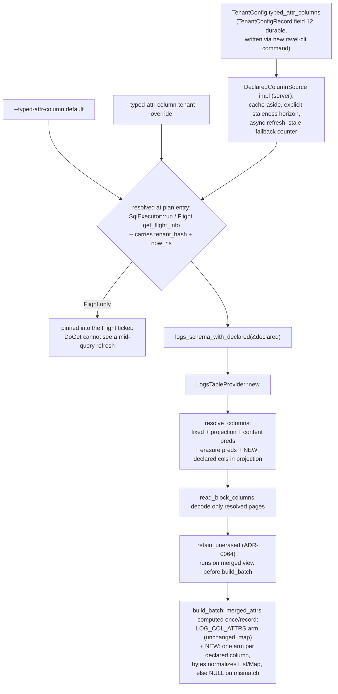

# ADR-0090: typed attribute columns for the logs SQL table

Status: Accepted

## Context

The logs SQL table exposes every record, resource, and scope attribute
through one merged `attrs: Map(Utf8, Utf8)` column
(`crates/ravel-sql/src/logs_schema.rs::logs_schema`, a fixed
`SchemaRef` with no per-query variation, unchanged by ADR-0087). RLOG
stores each attribute typed on disk — `FieldType::{Str, I64, F64, Bool,
Bytes}` (`crates/ravel-logseg/src/record.rs`) — and
`crates/ravel-logseg/src/block.rs`'s `DecodedBlock` and
`ravel_logseg::RlogReader` already reconstitute that typing into
`LogRecord.attrs: Vec<(String, AttrValue)>` per record. The type
information survives all the way to `ravel-sql`; it is
`crates/ravel-sql/src/logs_scan.rs::build_batch`'s `LOG_COL_ATTRS` arm
that flattens every value through `attr_value_to_string`
(`rlog_attrs.rs`) into the map. Every numeric or date predicate and every
aggregate over an attribute becomes a `CAST(attrs['k'] AS ...)` over a
materialized string, and no typed comparison (`<`, `>`, `BETWEEN`) is
possible at all. ADR-0033 named this and deferred it: "a per-tenant,
per-key column schema is a v-next refinement" — this ADR is that
refinement, and the specific per-key item ADR-0087 itself declined
("per-key projection through `attrs['k']` expressions is out of scope
for this ADR and left for the typed-attribute-columns epic").

ADR-0087 (landed) built the exact seam this ADR extends, not a
competing one. `logs_scan.rs::resolve_columns` folds contributors into
one `ColumnSelection`, keyed by attribute **name**: the fixed `ts`/
`stream_ref` set, the DataFusion projection, every field a pushed
content predicate names, and every key a pending erasure predicate
names (the function's own doc calls these "four contributors";
declared columns are a new, additional one, not a "fourth" replacing
an existing count). `ColumnSelection` is handed to
`ravel_logseg::read_block_columns`, which decodes only the requested
dynamic-column pages. `build_batch`'s per-schema-index `match` is where
Arrow arrays get built from the decoded, still-typed `LogRecord.attrs`
— `LOG_COL_ATTRS` funnels every key through `MapBuilder` there today; a
declared typed column needs a sibling arm in that same `match`, not a
parallel scan path. Erasure exclusion (`retain_unerased`, ADR-0064) runs
on the merged view before `build_batch` executes, so a typed column
built from that same merged view carries the exclusion automatically —
no separate enforcement needed.

A working precedent for typed-column promotion exists in the same
codebase: `crates/ravel-sql/src/alerts_scan.rs` promotes four
well-known attribute keys (`alert_id`, `rule_id`, `state`,
`generation`) via `find_attr` over the merged attribute list, while
still exposing the same keys inside the full `attrs` map. It is static
and compiled-in, and its `generation` column diverges from this ADR's
type-mismatch posture (decision 7): it accepts a decimal-string value
"for resilience" rather than returning NULL. This ADR does not follow
that divergence — see the rejected alternatives.

No per-tenant SQL schema mechanism exists today, but the write side has
an established pattern for exactly this shape: `crates/ravel-ingest/src
/indexed_fields.rs`'s `IndexedFieldsOverlay` (ADR-0079) is a cache-aside
overlay over a per-tenant field list — a synchronous fast path serving a
cached entry within a staleness horizon (`DEFAULT_LIFECYCLE_REFRESH_
INTERVAL_NS`, 60s, borrowed from `crates/ravel-ingest/src/lifecycle.rs`;
`services/ravel-server`'s `lifecycle_refresh.rs` only lends the shape of
its separate 1s backoff, not the horizon itself), an async
caller-driven refresh on a stale or missing entry, and a documented
serve-stale-on-failure fallback. ADR-0079's safety argument for
serving stale rests entirely on nothing downstream of it affecting a
query result ("the query path never consults it"); that argument does
not transfer here, because this overlay's output *is* what a query
result is computed from — a stale entry can mean a query fails with an
unknown-column error, resolves an existing column to the wrong type,
or two replicas answer the same query differently for up to the
staleness horizon (unboundedly longer under a sustained read outage,
same as `IndexedFieldsOverlay`'s own worst case). This ADR needs its
own staleness contract and its own stale-fallback observability, not
an inherited one. `ravel-sql` and `ravel-query` have zero references
to `TenantConfig` today, so this is new surface, not a reuse.

The durable half, `crates/ravel-catalog/src/tenant_config.rs`'s
`TenantConfig`, already carries `indexed_fields: Option<Vec<String>>`
for the ADR-0079 feature — but `TenantConfig` has **no production
write path** for either field. `set_tenant_config`
(`tenant_config.rs:324`) is called only from `#[cfg(test)]` modules
today (`lifecycle.rs`, `log_shard.rs`, `indexed_fields.rs`'s own
tests); the only durable per-tenant write `ravel-cli` exposes is
`gc-config set`, which is not tenant-hashed at all (a different,
non-per-tenant durable record). A per-tenant declared-column override
this ADR promises is unreachable by any operator today unless this
epic also ships the write path — decision 1 covers that.

`TenantConfig` is durable state backed by `TenantConfigRecord`
(`proto/ravel/sys.proto:386`), a frozen contract under CLAUDE.md's
persistent-format rules and NOT an immutable record — its own doc
comment states the opposite ("Mutation shape: whole-record CAS-replace
... a mutable current-state knob," `sys.proto:374-383`). It is Class C
under the `format-change` skill (immutable metadata *record shape*,
mutated by whole-record replace, not append) for the same reason
`indexed_fields` landed under it: a new additive field number,
protected by `TENANT_CONFIG_FORMAT_VERSION`'s existing refuse-higher
guard (currently 1; an additive field needs no bump of that constant).
The Class C label does not remove one real hazard `indexed_fields`
already carries and this ADR inherits: `set_tenant_config` decodes with
prost (unknown fields silently dropped) and rebuilds the whole record
from the caller's in-memory `TenantConfig` struct — a writer running
older code that swaps, say, lifecycle state can silently drop this
ADR's field on that same write. This is a pre-existing, not new, hazard
of the CAS-replace shape; name it rather than imply protobuf forward-
compatibility alone covers it.

Aggregation determinism bounds what this ADR can safely declare as a
type. ADR-0013 and ADR-0022 require aggregation over `samples` to run
single-partitioned above a sort-preserving merge with a defined total
order, specifically for float bit-exactness. The logs scan gives no
such order: ADR-0087 dropped even the per-partition `ts` ordering the
scan used to guarantee, and its round-robin partitioning (which
predates ADR-0087) was never cross-partition-deterministic either.
Forcing a single partition ahead of the aggregate does not by itself
fix this — `CoalescePartitionsExec` concatenates concurrently-running
inputs in arrival order, it does not sort, so it only moves the
non-determinism from the Final merge to the row interleave. Getting a
real, reproducible order for logs would mean either an explicit sort
(the per-partition-buffering cost ADR-0087 specifically removed) or
defining a fold order over the physical layout (segment, block,
`(stream_ref, ts)`) that changes under compaction — neither of which
this ADR is scoped to solve, and #277 exists precisely to make that
decision properly. `SUM`/`COUNT`/`MIN`/`MAX`/`AVG` over integer, bool,
or string-typed columns need none of this: they are exact under any
partitioning or order (ADR-0022's own "integer inputs are exact"
reasoning), which is why the logs table's existing numeric fixed
columns (`severity_num`, `flags`, both integers) have never surfaced
this problem. `CAST(attrs['k'] AS DOUBLE)` aggregates already have this
exposure today, undeclared and untyped; this ADR does not create the
underlying gap, but it does decide not to widen it with a first-class
declared type until #277 lands (decision 1).

## Decision

1. **Per-tenant declared schema, not global. Four declarable types in
   v1, not five: `str`/`i64`/`bool`/`bytes`. `f64` is deferred.** A
   declared float aggregate is exactly the order-sensitive case the
   Context section shows this ADR cannot safely support without either
   an explicit sort or #277's fold-order decision; shipping it now
   means solving that problem twice, once ad hoc here and once
   properly in #277. `str`/`i64`/`bool`/`bytes` need none of that —
   their aggregates are exact under any partitioning. `f64` support is
   a follow-up, gated on #277 landing. Date/timestamp declared columns
   (part of the epic's original wishlist) are also deferred: they need
   a lifting rule from `i64` storage plus a declared unit, which is
   real, separate design work this ADR does not attempt; undeclared
   date/timestamp attribute values remain reachable via `attrs['key']`
   exactly as today, so this is a scope narrowing, not a regression.
   A new `TenantConfig` field, `typed_attr_columns` (`TenantConfigRecord`
   field 12, the next free number), holds an optional list of declared
   columns: key, one of the four logical types. A CLI-provided default
   (`--typed-attr-column key=type[,key=type...]`) resolves for any
   tenant with no durable override; a per-tenant CLI override
   (`--typed-attr-column-tenant TENANT=key=type,...`) mirrors
   `IndexedFieldConfig`'s base-plus-override flag pair exactly (not
   just the base). Validation (both flags, and any durable write)
   rejects: an empty key, a duplicate key within one declaration, the
   same key declared twice with different types, an unknown type name,
   and a key colliding with any of the nine fixed column names (`ts`,
   `body`, `attrs`, ...). The SQL column name is the attribute key
   verbatim, never mangled: a key containing `.` or uppercase
   characters (real examples: `http.status_code`, `k8s.namespace.name`)
   requires double-quoting in SQL per DataFusion's identifier rules.
   A new `ravel-cli typed-attr-column set
   --tenant T key=type,...` command writes the durable override via
   `set_tenant_config` — without it, the durable half of decision 1
   is unreachable (see Context on `TenantConfig`'s missing write path).
2. **Query-time resolution is a `DeclaredColumnSource` trait, owned by
   `ravel-sql`, resolved once per plan and passed in — not read by
   `SqlExecutor` reaching sideways into an injected overlay per call.**
   `SqlExecutor` gains a `Arc<dyn DeclaredColumnSource>` field
   (`async fn declared_columns(&self, tenant: TenantHash, now_ns: i64)
   -> Vec<DeclaredColumn>`, `DeclaredColumn { key: String, ty:
   DeclaredType }`). `ravel-sql` ships a `StaticDeclaredColumns`
   test-only implementation so its own tests do not depend on
   `ravel-server`; `ravel-server` implements the real one, a cache-aside
   overlay in the shape of `IndexedFieldsOverlay` — synchronous fast
   path within a staleness horizon this ADR sets explicitly (matching
   `IndexedFieldsOverlay`'s 60s default, not inherited implicitly), an
   async caller-driven refresh on a stale or missing entry, and a
   `typed_attr_columns_stale_fallback_total` counter on every
   serve-from-cache-on-refresh-failure, mirroring ADR-0079's own
   observability requirement. A present durable list replaces the CLI
   base for that tenant; `None` (never refreshed, or an explicit
   durable `Some([])`) falls through to the CLI base only in the
   never-refreshed case — a durable `Some([])` is deliberately zero
   declared columns for that tenant, distinct from "no override yet",
   matching `IndexedFieldConfig`'s own present-but-empty-vs-absent
   distinction. Resolution happens once per plan, at the entry points
   that already carry `now_ns` and `tenant_hash` — `SqlExecutor::run`
   (HTTP) and Flight's `get_flight_info`, whose result is what a
   Flight ticket pins (`flight_ticket.rs`), so a refresh mid-query
   cannot change the schema the paired `DoGet` streams against — not
   inside `plan_pinned`/`plan_pinned_with`, which gain a resolved
   `&[DeclaredColumn]` parameter instead of resolving anything
   themselves. A query naming a column the resolved schema does not
   have fails at planning with an unknown-column error — never
   silently wrong data.
3. **Schema construction gains a `logs_schema_with_declared(&[DeclaredColumn])
   -> SchemaRef` path; the zero-declaration base is unchanged.**
   `logs_schema()` stays exactly as it is today (existing tests and the
   public re-export in `lib.rs` depend on it as the base). Declared
   columns are appended after `attrs` (schema index 9 onward) in
   declaration order, and declaration order is itself stable — the CLI
   base and a durable override are both stored and read as an ordered
   list, never re-sorted, so the same tenant's schema does not reorder
   between a cache refresh and the next. The resolved schema threads
   from `SqlExecutor::run`/Flight's resolution point through
   `LogsTableProvider::new`, into `LogsScanExec::new` (which currently
   calls `logs_schema()` directly and must take the resolved schema as
   a parameter instead), and into `build_batch` and `resolve_columns`'s
   index-keyed `match` arms (both currently assume a fixed, small index
   space with `_ =>` fail-open/error arms, and need declared-column
   arms added dynamically per the resolved schema's length, not
   hand-enumerated).
4. **`resolve_columns` gains a new contributor**: every declared column
   the query's DataFusion **projection** references (DataFusion already
   folds residual-filter columns into the projection it hands the scan,
   so a declared column named only in a `WHERE` clause is still
   decoded). Declared-column predicates are not extracted or pushed in
   this ADR — a typed comparison over a declared column (`declared_key
   > 5`) is evaluated only as a residual filter above the scan, the
   same as any other unpushed predicate; typed-predicate pushdown is
   #278's job entirely, not a partial implementation here. Declaring a
   column that used to be reached only via `attrs['key']` therefore
   makes an equality predicate on it *slower* until #278 lands:
   `attrs['key'] = 'v'` prunes via POSTINGS today
   (`logs_pushdown.rs::attr_equality_predicate`, unaffected and
   unchanged by this ADR), `declared_key = 'v'` does not.
5. **`build_batch` gains one match arm per declared column.** The
   merged attribute view (`merged_attrs`) is computed once per record —
   hoisted out of the per-column `match` into a per-record precompute,
   the row-major shape `alerts_scan.rs` already uses, not decoded again
   per declared column — and each declared arm looks the key up via
   `find_attr` against that one precomputed view, building a native
   typed Arrow array builder (`Int64Builder`/`BooleanBuilder`/
   `StringBuilder`/binary) instead of, or in addition to, feeding that
   key into the `attrs` map builder (decision 6).
6. **Declared keys stay in `attrs` too**, matching the `alerts`
   precedent for the map side (not for the cast side — decision 7).
   Cost is zero under ADR-0087's existing rule: any query referencing
   `attrs` at all already pulls every dynamic column, so a declared
   key's page is decoded regardless of whether the map also carries it.
7. **A declared column reads NULL for a row whose decoded `AttrValue`
   variant does not match its declared type — no cast, ever** — with
   one exception for `bytes` that closes a real storage-location
   inconsistency rather than documenting it. A resource- or
   scope-level attribute whose value is a nested `Map`/`List` is
   silently omitted by `decode_stream_attrs` before it ever reaches
   `merged_attrs`; it can never populate any declared column, native or
   map, from that source. A record-level `List`/`Map` value is
   different: if it fits the object's dynamic-column budget it is
   canonicalized into a `Bytes` column at write time
   (`ravel_logseg::record::resolve_value`); if it overflows into
   `attrs_raw`, the identical logical value decodes back as `AttrValue::
   List`/`Map`, not `Bytes` — the same value reading two different
   `AttrValue` variants depending only on how many other dynamic
   columns that object happened to already have. A declared `bytes`
   column normalizes this: a `List`/`Map`-valued attribute is
   canonicalized via `ravel_logseg::record::canonical_value_bytes`
   (the same function the write path already uses) before it reaches
   the column builder, so both storage locations produce the identical
   `bytes` value. Every other declared type has no such ambiguity: NULL
   means the key is absent from the merged view, or its `AttrValue`
   variant (after the `bytes` normalization above) is not the one the
   declared type maps to — SQL cannot and does not distinguish "absent"
   from "present with the wrong type," both read as unrepresented data
   for that column. The raw value, whatever its type, stays reachable
   via `attrs['key']` unaffected by this rule.
8. **Conformance registration** for the SQL shapes analytical queries
   over typed columns need: `COUNT(DISTINCT)`, `OFFSET`, `HAVING`,
   `GROUP BY <ordinal>`, `CASE`, `IN (...)`, `REGEXP_REPLACE` with
   backreferences, `extract(minute FROM ts)`, `DATE_TRUNC`, plus typed
   comparisons and aggregates over declared columns. `validate.rs`
   rejects statement *kinds* (DDL, `EXPLAIN`, non-admitted aggregates),
   not clause shapes — none of these are blocked today. But
   `conformance.rs`'s `SupportedAndCovered` means "exercised by the
   two-layer differential gate against an independent reference," not
   merely "returns a plausible result": each row needs a genuine
   differential-oracle case, re-derived directly from the fixture's
   input records — never through the implementation's own
   `merged_attrs`/`find_attr` path, which proves the helper is
   consistent with itself, not that it is correct.

## Rejected alternatives

- **A global (non-per-tenant) declared schema.** Rejected: different
  tenants' logs have different attribute shapes by construction (RLOG's
  own dynamic-column budget and `attrs_raw` overflow are already
  per-object, not global); a global schema either forces every tenant
  to declare the same columns or silently NULLs most of them for most
  tenants.
- **A new table/provider parallel to `logs` instead of extending it.**
  Rejected: duplicates the scan, streaming, and column-projection
  machinery ADR-0087 just built, for no benefit over adding columns to
  the table that machinery already serves.
- **Infer typed columns from FIELD_DIR at plan time instead of operator
  declaration.** Rejected: a query's snapshot spans objects written at
  different times, whose FIELD_DIRs can disagree on a key's type (the
  same key stored as two different `FieldType`s occupies two distinct
  RLOG columns per object, `columns.rs`); inference would need to
  resolve that ambiguity per query, and a plan-time footer read across
  every candidate object is itself expensive. An operator declaration
  is a single, stable answer independent of how any one object happened
  to encode a key.
- **A per-tenant TOML mapping file** (the shape #275's bulk loader
  uses for its `--mapping` file). Rejected for this feature: the loader's
  mapping is a one-shot, operator-local input to a CLI run; a query-time
  schema needs to be durable, replicated to every query-serving process,
  and updatable without redeploying a file, which is exactly what
  `TenantConfig` plus the CLI-flag-and-override pattern already give for
  free.
- **Exclude declared keys from the `attrs` map once promoted** (the
  "clean" alternative to decision 6). Rejected: breaks `SELECT attrs`
  and `SELECT *` for any existing tool or query reading the map, for
  tenants who adopt typed columns after already querying attributes
  through the map. The `alerts` precedent already keeps both; matching
  it costs nothing extra to decode and avoids a breaking change this
  ADR has no reason to force.
- **Rewrite `attrs['k']` to transparently prefer the typed column when
  `k` is declared.** Rejected for this ADR: couples schema declaration
  to pushdown/pruning decisions that belong to #278, and the planner
  today correctly has zero visibility into declared keys — giving it
  that visibility is a real design question (does a rewrite change
  which predicates get pushed? `attrs['k']`'s existing equality pruning
  works today and must not regress) that deserves its own decision when
  #278 is designed, not a rider on this one.
- **Cast a type-mismatched value instead of returning NULL** (matching
  `alerts_scan.rs`'s `generation` column, which accepts a decimal-string
  value "for resilience"). Rejected: a lossy or best-effort cast on
  data this ADR does not control the shape of is exactly the kind of
  silent-wrong-data risk CLAUDE.md's "exact semantics by default" rules
  out. `alerts`' single hand-picked column accepting one specific
  string-to-int coercion is a narrow, reviewed exception for a fixed,
  compiled-in shape; a general per-tenant declared-column feature
  cannot carry the same case-by-case judgment for arbitrary operator
  declarations. NULL for a declared-but-mismatched value is honest
  about what the column actually contains for that row, and the raw
  value stays reachable via `attrs['key']` regardless.

## Consequences

- `proto/ravel/sys.proto`'s `TenantConfigRecord` gains field 12
  (`typed_attr_columns`), Class C per the `format-change` skill: an
  additive field on a CAS-replace, current-state record, guarded by
  `TENANT_CONFIG_FORMAT_VERSION`'s existing refuse-higher check (no
  bump needed for an additive field). Does not remove the pre-existing
  whole-record-rebuild hazard `indexed_fields` already carries (Context):
  an older writer racing a `set_tenant_config` call can drop this field
  on that write. Pre-existing, not introduced by this ADR, but real.
- `docs/sql-conformance.md`'s generator re-runs
  (`REGEN_SQL_CONFORMANCE=1 cargo test -p ravel-sql --test conformance`)
  once the new rows land; regenerate against the real merged tree, not
  a stale local copy.
- A new differential-oracle extension, independent of `merged_attrs`/
  `find_attr`: a typed column's decoded value must match a value
  re-derived directly from the fixture's input records, proptested
  across the four declarable `FieldType` variants, including the
  type-mismatch case (a declared `i64` column whose record actually
  carries a `Str` for that key) and the `bytes`-normalization case (the
  same `List`/`Map` logical value read once via a dynamic column and
  once via `attrs_raw` overflow, asserting both produce the identical
  canonical bytes) — currently untested anywhere in the codebase.
- `docs/query-engine.md` and `docs/guides/query.md` gain the declared-
  schema flags, the staleness contract (horizon, stale-fallback metric),
  the "declared keys also appear in `attrs`" behavior, and the
  slower-until-#278 note for a predicate moved from `attrs['k']` to a
  declared column. `docs/guides/operations.md` gains the CLI default
  and per-tenant override flags plus the `ravel-cli typed-attr-column
  set` command.
- No RSEG/RLOG format change: FIELD_DIR and page structure are
  untouched. This is a read-path, query-planning, and durable-config
  change.
- Scope split across `ravel-catalog` (`TenantConfigRecord` field,
  `TenantConfig` accessor), `ravel-sql` (the `DeclaredColumnSource`
  trait and its `StaticDeclaredColumns` test impl, `resolve_columns`,
  `build_batch`, schema construction, conformance rows), and
  `services/ravel-server` (the real cache-aside `DeclaredColumnSource`
  implementation, CLI flags and validation, the `typed-attr-column set`
  command). `ravel-catalog` and `ravel-sql` are genuinely file-disjoint
  and independently dispatchable in the same wave — `ravel-sql` defines
  the trait and can be built and tested entirely against
  `StaticDeclaredColumns` without the server's overlay existing yet.
  `services/ravel-server` is not independent of either: it implements
  a trait `ravel-sql` defines and reads a field `ravel-catalog` defines,
  so it lands in a following wave, after both.
