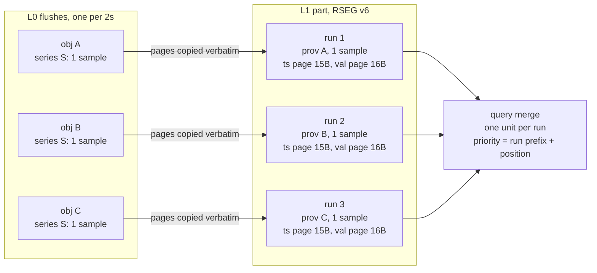
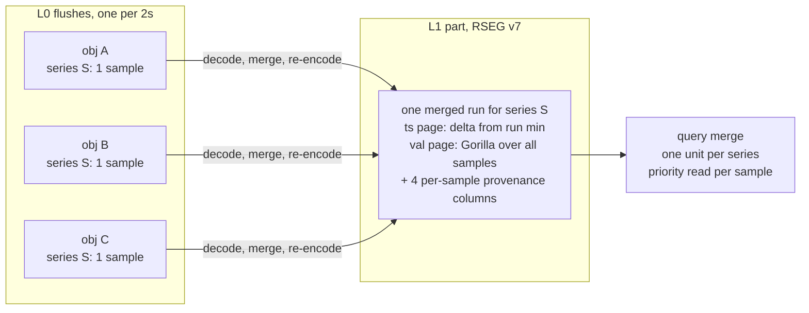
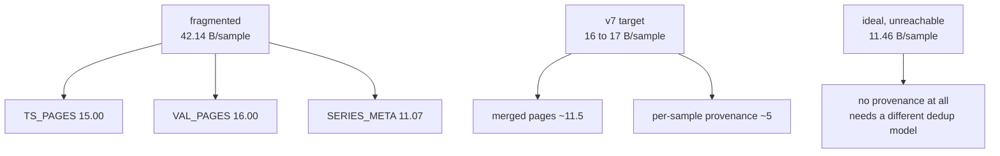

# ADR-0092: Run-merged L1 compaction and RSEG v7

Status: Accepted

Migration class: A (bulk data objects), ADR-0066 decision 4. Convergence is
by retention, by rewrite-on-touch, and by the `maintain migrate` job. The
pre-release regime of ADR-0027 applies: exactly one supported version, and
v6 read and write support is deleted in the same change that introduces v7.

## Context

ADR-0018 chose verbatim run preservation for L0-to-L1 compaction. An L1
object holds one run per input segment per series, with page bytes copied
unchanged (`crates/ravel-maintain/src/build.rs:503-516`). That choice bought
three things: page CRCs stay valid, the query-time merge is unchanged, and
overlap between an L1 part and its own inputs is harmless
(`docs/adrs/0018-l0-l1-compaction.md:66-73`).

It also has a cost that ADR-0018 recorded as "~20 bytes per run" and named a
run-merging L2 as the follow-up (`:251-254`). That estimate was made before
compression. The real cost is larger than the estimate suggests, because run
count is far higher than the ADR assumed.

### How many runs a series actually gets

Strict is the default write mode on every ingest surface
(`services/ravel-server/src/otlp_http.rs:445-455`; remote-write is
hard-coded Strict at `remote_write.rs:431`). A buffer with a waiter takes the
fast age tier, `max_flush_delay`, which ADR-0076 decision 4 set to 2 s
(`crates/ravel-ingest/src/config.rs:207-215`). So a series scraped every 15 s
appears in about 240 separate L0 flushes per hour, and its sealed bucket's L1
part holds about 240 runs of one sample each.

Every codec resets at a run boundary. A one-sample value page always falls
back to raw `f64`, because the Gorilla fallback rule fires at count 1
(`crates/ravel-segment/src/writer.rs:862-874`). A one-sample timestamp page
stores the timestamp as an absolute zigzag varint, 9 bytes at current epochs
(`crates/ravel-segment/src/ts_delta.rs:22-30`), and never reaches the 64-byte
LZ4 floor (`writer.rs:949`).

### Measured

500 series, 15 s spacing, millisecond resolution, 200 ms jitter, built
through the production writer at commit `2e1a3ed7`:

| Section | 240 runs x 1 sample | 1 run x 240 samples |
|---|---|---|
| `TS_PAGES` | 15.00 B/sample | 4.69 |
| `VAL_PAGES` | 16.00 | 6.61 |
| `SERIES_META` | 11.07 | 0.07 |
| `SERIES_IDS` | 0.07 | 0.07 |
| `LABEL_DICT` | 0.01 | 0.01 |
| **Total** | **42.14** | **11.46** |

Raw `(i64, f64)` is 16 bytes per sample. The fragmented layout is 3.68 times
the merged one and 2.6 times raw. The marginal catalog cost is 11.04 bytes
per run after zstd, about half ADR-0018's pre-compression estimate, because
the run-major columns sit inside a zstd-compressed `SERIES_META`.

### Why 11.46 is not the target

The merged column above is a floor no exact system reaches. ADR-0018's
correctness core requires per-sample dedup provenance for any merged
representation, because a duplicate write can land in a later ingest hour,
after compaction has already run (`docs/adrs/0018-l0-l1-compaction.md:49-60`).

Today that provenance is per run. `RunInputV4` and `RunEntry` each carry one
`(created_unix_ns, writer_epoch, writer_seq)` triple
(`crates/ravel-segment/src/writer.rs:151-160`,
`crates/ravel-segment/src/reader.rs:299-309`). The fourth element of the
dedup key, the sample's index inside its run, is never stored: the query
engine computes it from array position
(`crates/ravel-query/src/engine.rs:2217-2220`). Merging runs changes those
positions, so the fourth element must become explicit.

Measured cost of the four provenance columns over one 240-sample run: 5.20
bytes per sample after zstd, with a cross-series frame floor near 4. The
reachable exact endpoint is therefore about **16 to 17 bytes per sample**
against 42.14 today, a 2.5x reduction that lands at roughly raw-tuple parity.

### Logs and spans do not have this problem

RLOG and RSPAN already rewrite at L1. Both decode every input back to
records, merge, re-sort, and re-block at the same 8192-record target an L0
write uses (`crates/ravel-maintain/src/rlog.rs:231-320`,
`rspan_codec.rs:199-295`). A test pins it: five 1000-record blocks per input,
8600 records total, L1 output asserts two blocks
(`crates/ravel-maintain/src/rlog.rs:1310-1323`).

They can do that because they carry no per-record provenance at all
(`crates/ravel-logseg/src/record.rs:73-92`,
`crates/ravel-rspan/src/record.rs:138-151`). ADR-0032 states the reason: the
log write path makes retry duplicates structurally impossible, so there is no
cross-writer record-level dedup for compaction to preserve
(`docs/adrs/0032-rlog-compaction-and-generic-maintain.md:49-62`).

The difference is a dedup-model difference, not an oversight. No RLOG or
RSPAN format change is needed, and this ADR proposes none.

## Decision

### 1. RSEG v7 merges runs at L1 and stores per-sample dedup provenance

L1 compaction stops being a re-layout of its inputs and becomes a rewrite.
Per series, every contributing run is decoded, merged in timestamp order, and
re-encoded into one run. The merged run carries four new run-major columns
holding each sample's dedup key: `created_unix_ns` delta, `writer_epoch`,
`writer_seq`, and the sample's original in-page index.

The four columns are encoded through `ravel-codec`'s `encode_i64`, which
picks the smallest of Constant, RLE, delta-zigzag, double-delta,
frame-of-reference bit-pack, and Plain
(`crates/ravel-codec/src/encoding.rs:242-268`). Samples from one L0 flush
share a `created_unix_ns`, an epoch, and a seq, so those three columns are
long constant or RLE runs in practice, which is why the measured cost is
about 5 bytes per sample and not four full varints.

The machinery already exists. Two call sites in `ravel-maintain` already
decode a run and re-encode it into a single `RunInputV4`:
`reencode_run_to_current_version` (`build.rs:537-594`, the ADR-0066 migration
path) and `erasure_rewrite::build_rewrite` (`erasure_rewrite.rs:867-1066`).
This decision generalizes the second one.

### 2. Exactness is preserved, and the differential test is the proof

The property that must hold is ADR-0018's: a snapshot containing an L1 part
plus any subset of its own inputs answers every query identically to the
pre-compaction snapshot. `crates/ravel-query/tests/differential_compaction.rs`
already asserts exactly this, against an in-test oracle that reimplements
`is_greater`.

Per-sample provenance preserves it, because the merged run reproduces the
same candidate multiset with the same priorities that the unmerged runs
produced. A merged run without per-sample provenance does not, which is why
option 3 below is rejected.

The query side changes with it. `FetchedSeriesSoa` carries one run-wide
provenance triple today (`crates/ravel-query/src/fetcher.rs:179-187`), and
the fetcher emits one unit per (series, run) for L1 inputs
(`fetcher.rs:1349-1382`). Under v7 an L1 series is one unit whose priorities
vary per sample, so `SeriesRun.prefix`
(`crates/ravel-query/src/engine.rs:2101-2105`) becomes an optional per-sample
priority column, with the run-wide prefix kept as the L0 case.

### 3. Part splitting moves from predicted input bytes to encoded output bytes

`build_parts` accumulates `batch_bytes` from input catalog byte ranges and
splits when it reaches `max_l1_part_bytes` (`build.rs:236`, `:201-207`). That
prediction is exact only because the bytes are copied. Once runs are
re-encoded, the estimate decouples from the output, and from decoded peak
memory.

v7 splits on encoded output bytes, accumulated as series are written, with
the input-byte figure retained only as a fetch-buffer bound. The memory
bound that `crates/ravel-maintain/tests/memory.rs:40` pins must hold at the
same value or better, and the test stays as the gate.

### 4. Two page-level wins land in the same version, separately

Neither needs a compaction change, and both are worth having whether or not
run merging lands.

- A run's first timestamp is encoded as a delta from the run minimum rather
  than as an absolute varint from zero. The catalog already carries
  `run_min_ts_delta`, and the decoder is already handed the bounds
  (`crates/ravel-segment/src/ts_delta.rs:41-46`), so the stored value becomes
  zero. Saves 9 bytes per run, 21% of the fragmented regime's timestamp
  bytes.
- Single-sample raw-`f64` value pages stop paying the 8-byte alignment pad.
  The pad exists so raw payloads are eligible for Arrow zero-copy views
  (ADR-0013), which a one-sample page never serves. Measured at about 2
  bytes per sample in the fragmented regime.

### 5. One version bump, at the end of a train of separate changes

ADR-0027 supports exactly one version before first release and deletes the
previous version's paths in the same change, so a bump costs golden
regeneration, a fuzz corpus refresh, and a specification rewrite, not a
migration.

Each change in this ADR lands as its own reviewed commit with its own
differential test. The trailer version moves to 7 once, at the end. Bundling
a compaction-semantics rewrite with two page-codec changes in one commit
makes a differential-test failure impossible to attribute to a cause.

### 6. Codec work is gated on measurement, not adopted here

Two codec questions stay open and are answered by benchmarks in this epic,
not by this ADR:

- Whether an integer-transform value codec beats Gorilla on integer-valued
  counters. The 2026-07-28 bake-off tested only XOR-family challengers, and
  its counter workload increments by a random float
  (`crates/ravel-bench/src/generator.rs:456`).
- Whether a timestamp stack of GCD, double-delta, and an entropy or bit-pack
  stage beats today's encoding. Measured: production already reaches 0.16
  bytes per sample on exactly-regular millisecond streams through LZ4, a bare
  `encode_i64` regresses that case about 6x, the win is confined to jittered
  millisecond streams (4.68 to 1.88), and it is nil on true-nanosecond OTLP.

A codec that clears its threshold gets a new page encoding in the same v7. A
codec that does not is not adopted.

### 7. The reader window stays single-version, and two silent sites are fixed first

**The window.** ADR-0027 decision 3 deletes the previous version's read and
write paths in the same change that introduces the new one, so v7 ships as
`SupportedVersions::single(VERSION_V7)`
(`crates/ravel-segment/src/format.rs:109`). Existing v6 objects become
unreadable, visibly, with a typed `UnsupportedVersion`. Development stores are
wiped or re-ingested, which decision 6 already accepts.

The consequence to state plainly: the `maintain migrate` job cannot rewrite v6
objects into v7, because a single-version reader cannot open its own inputs.
That is the intended pre-release behavior, not a gap. If any store turns out to
hold v6 data worth keeping, this decision flips to
`SupportedVersions::n_and_prev(VERSION_V7)` for exactly one release, the
migrate job runs, and the v6 reader is deleted in a later change citing the
format floors, per ADR-0066 decision 3. The machinery for both shapes already
exists and is unused (`format.rs:71,84`). Answering this needs an operational
fact this repository does not record, so it is the first question the epic asks.

**Two production sites hardcode `VERSION_V6` and would misbehave rather than
fail to compile.** Both are fixed before the bump, in their own change, so the
fix is reviewable on its own:

- `crates/ravel-query/src/distrib/codec.rs:622` stamps
  `segment_format_version: u32::from(ravel_segment::VERSION_V6)` into every
  distributed-query fragment identity. It must read
  `SUPPORTED_VERSIONS.newest()`.
- `crates/ravel-maintain/src/read.rs:324` selects the sparse catalog decode
  branch with `loc.version == VERSION_V6`. A v7 object silently takes the
  non-sparse branch.

A third, `crates/ravel-catalog/src/fold.rs:2059`, fails closed with a typed
error rather than misbehaving, and is fixed with the bump.

The version is not as single-sourced as ADR-0066 implies. `MAGIC` is; the
version is read from a constant in seven production sites. This ADR does not
re-architect that, but the fix above removes the two that are unsafe.

## Rejected alternatives

**1. Keep verbatim runs and accept the cost.** Lost because the cost is
2.6 times raw storage for the dominant production shape, and because it
scales with flush frequency, which ADR-0076 already tuned once for request
cost and can tune again in the opposite direction.

**2. Reduce run count by flushing less often.** Lost as a solution, though it
remains a complementary lever. ADR-0076 decision 4 already scaled the cadence
knobs 4x. Going further trades acknowledgement latency and the buffered-mode
crash-loss window for storage, and it does not remove the per-run overhead,
it only divides it by a constant.

**3. One merged run per series without per-sample provenance.** Lost on
exactness. ADR-0018 rejected the same option at `:86-89`. A synthesized
run-wide priority changes which sample wins at an overlapping timestamp,
against both the other inputs and any late duplicate that lands in a later
hour, and it breaks overlap harmlessness, which the non-atomic L0-to-L1 swap
and the sweep both rely on.

**4. Inline single-sample runs into the catalog as two more columns.** A real
option: store a count-1 run's timestamp delta and `f64` bit pattern as
run-major columns with no pages at all, keeping per-run provenance verbatim.
Estimated at about 20 bytes per sample against 42, with no change to dedup or
compaction semantics, so it carries none of decision 1's correctness risk.
Lost because 20 is materially worse than 16 to 17, and because it adds a
second representation for scalar values that every reader must handle
forever. It is retained as the named fallback if decision 1's differential
work stalls.

**5. Make duplicate writes structurally impossible on the metrics path, as
RLOG did.** This is the only path to the 11.46 floor, since it removes the
provenance requirement entirely rather than compressing it. Lost as out of
scope: it changes the commit protocol (ADR-0002) and the consistency model,
not a storage format, and it would need its own ADR and its own epic. Named
here so that a future reader knows the 5-byte provenance cost is a
consequence of the dedup model, not a law.

**6. Keep the v6 reader alongside v7 by default.** Lost against ADR-0027
decision 3, which is explicit that pre-release the old paths are deleted rather
than deprecated, so that reader, writer, test, and documentation surface stay
proportional to one version. Keeping both would also mean carrying two catalog
decoders through the merged-run change, which is the part of this work most
likely to grow a subtle bug.

**7. Bump to v7 per change instead of once.** Lost on cost: three bumps mean
three golden regenerations and three specification rewrites, and dev stores
are wiped either way. The attribution problem that motivates separate
changes is solved by separate commits and separate differential tests, not by
separate version numbers.

## Consequences

- **Compaction stops being a re-layout.** Page CRCs are recomputed rather
  than carried, so the "a verbatim copy alters none of `series_id || enc ||
  comp || payload`" note in `docs/segment-format.md` no longer describes the
  metrics path and must be rewritten.
- **Compaction CPU rises.** Every page is decoded and re-encoded. The migrate
  job already pays this on its path, so the cost is measurable before the
  change lands, by running a migrate over a representative bucket.
- **Peak memory changes shape.** The fetch buffer is still bounded by input
  page bytes, but decoded samples now live alongside it. The bound in
  `crates/ravel-maintain/tests/memory.rs:40` is the gate.
- **The query fetcher's L1 per-run emission becomes vestigial** for v7
  objects and stays for v6 only until v6 is deleted, which under ADR-0027 is
  the same change.
- **Storage falls about 2.5x for the dominant shape.** This matters most for
  long-retention tenants: ADR-0076's 97% request share is a short-retention
  figure, and storage and request cost approach parity at retention windows
  measured in hundreds of days.
- **Downsampling (#118) gets its prerequisite.** A downsampling job reads an
  hour of L1 and writes a window. Against fragmented L1 it pays the
  fragmentation on every read.
- Every checksum boundary is unchanged in kind: sections keep their
  `Section.crc32c`, pages keep a CRC bound to `series_id || enc || comp ||
  payload`, and the new provenance columns live inside `SERIES_META`, under
  its existing section checksum.
- `ravel-cli` inspectors print the new columns, per the format-change
  procedure. Its golden is hand-maintained
  (`services/ravel-cli/tests/fixtures/golden_v6_inspect.txt`), with no capture
  test, unlike ravel-segment's which regenerates through an ignored test.
- **The old golden becomes a rejection seed, never a regeneration.**
  `golden_v6_with_exemplars.bin` joins `REJECTION_SEEDS`
  (`crates/ravel-segment/tests/fuzz_mutation.rs:65-70`) unchanged, proving v6
  bytes are rejected rather than half-parsed. This is the established
  convention for every retired version.
- **Three tests invert on this bump and must be re-pointed, not deleted.**
  `todays_window_accepts_only_the_current_version`
  (`crates/ravel-segment/src/format.rs:254-262`) asserts the window rejects
  `VERSION_V6 + 1`, which is v7. `unknown_version_still_fails_closed`
  (`crates/ravel-segment/tests/reader_v5.rs:472-483`) writes trailer version 7
  and asserts rejection; it moves to 8. `format_constants_are_pinned`
  (`format.rs:229-247`) pins the version value.
- The migrate job's cross-version tests currently fake an old version with
  `FUTURE_VERSION = VERSION_V6 + 1`, a recorded version above the writer's
  output rather than real old bytes (`migrate.rs:677`, `rewrite.rs:329`). A
  genuine v6 fixture can replace them.
- `SPARSE_INDEX_VERSION` (`crates/ravel-segment/src/sparse.rs:52`) is a second,
  independent version byte inside SERIES_IDX. It does not bump unless the
  sparse index layout itself changes.
- No protobuf change is needed. `segment_format_version` is `uint32` and
  value-agnostic in all four schemas that carry it.
- No RLOG or RSPAN change is in scope.

## Diagrams

Today, one run per input survives into L1:

Under v7, one run per series, with the dedup key carried per sample:

Where the bytes go, measured:

