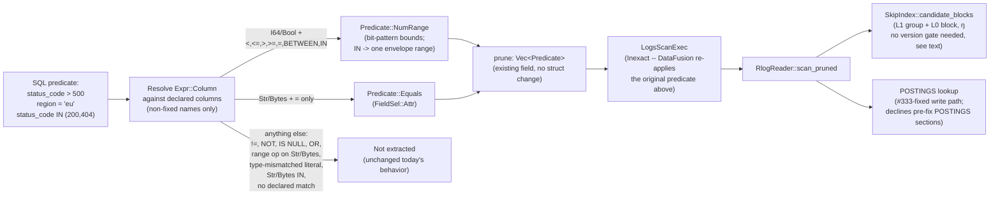

# ADR-0093: skip-index and postings pushdown for declared typed logs columns

Status: Proposed

## Context

RLOG persists two pruning primitives that the SQL pushdown path never
reaches for typed predicates. The skip index carries per-block `NumStat`
min/max for I64/F64/Bool dynamic columns (`crates/ravel-logseg/src/
block.rs`), and `SkipIndex::candidate_blocks` already consumes a
`Predicate::NumRange` arm at both L1 group and L0 block level
(`crates/ravel-logseg/src/skip_index.rs:268-307`) — landed by #331
(PR #380). POSTINGS indexes operator-selected fields (any attribute
type, not only strings) for exact equality, and `attrs['k'] = 'v'`
pushdown against it already ships,
including the fix for a correctness bug in its write path (#333, commit
`87240232`: `merged_indexed_terms` now folds duplicate-key occurrences in
the same order the read side's merged view does).

Neither primitive is reachable from a query written against a **declared**
column the way ADR-0090/ADR-0100 actually shipped declared columns: as a
plain Arrow column, queried as `status_code = 500`, not as
`attrs['status_code'] = 500`. `crates/ravel-sql/src/logs_pushdown.rs`'s
`handle_binary` recognizes exactly three shapes today — `ts` comparisons
(`ts_comparison`, ~line 216), `has_word` (`has_word_predicate`, ~line 309),
and `attrs['k'] = 'v'` equality (`attr_equality_predicate`, ~line 181,
gated by `attr_subscript_key` at ~line 201 checking `Expr::Column(c) if
c.name == "attrs"`). **No extractor recognizes a plain `Expr::Column`
matching a declared column's name**, for either a range comparison or an
equality. `status_code = 500` and `status_code > 500` both scan and
decode every block today regardless of what the skip index or POSTINGS
could tell the planner.

Both gaps share an identical first step — resolve a bare `Expr::Column`
reference against the tenant's declared-column vocabulary
(`crates/ravel-sql/src/declared.rs`) — but they are not one mechanism past
that point: they dispatch to two different reader-side primitives, each
with its own soundness basis and its own version story (see the soundness
section below). This ADR is one shared resolver feeding two existing,
independently-proven prune primitives, not a single unified mechanism.
`DeclaredType` is exactly four variants today (`Str`, `I64`, `Bool`,
`Bytes` — `declared.rs:41-54`; F64 is ADR-0101-Accepted but has no landed
code yet, `git log` shows only doc commits for it; date/timestamp is
fully deferred with no ADR). This ADR scopes to what the declared-column
vocabulary can actually carry today: `I64` and `Bool` route to
`Predicate::NumRange`, `Str` (and `Bytes`, where POSTINGS already indexes
it) route to `Predicate::Equals`. F64 and date/timestamp pushdown follow
automatically, with zero new pushdown-side work, once their own
declared-column plumbing lands — this ADR does not block on either.

**Extraction is an allowlist, not a best-effort translation.** The
resolver only ever recognizes a fixed set of shapes (enumerated in the
Decision section below); every other shape — negation (`!=`, `NOT`, a
negated `BETWEEN`), `IS [NOT] NULL`, `OR` disjunctions, a range operator on
a resolved `Str`/`Bytes` column, or a cast-wrapped operand — is not
extracted and contributes nothing to the prune channel, exactly as if the
column were undeclared. This mirrors the existing `attrs[...]` extractor's
own behavior (it already declines everything outside its three recognized
shapes) and is the safe default for a prune-only, widen-never mechanism:
declining to prune is always sound, inventing an unsound negation is not.

`Bool` needs no separate machinery: `bool_stat` (`block.rs`) stores its
min/max as `0u64`/`1u64`, the identical shape `i64_stat` uses, and
`stat_disjoint` is generic over `NumStat`'s type tag. `col = true`
degenerates to `Predicate::NumRange { field, ty: FieldType::Bool, min:
Some(1), max: Some(1) }` and `col = false` to `min: Some(0), max: Some(0)`
— the same extraction code path as an I64 equality with a boolean-to-bit
literal mapping. This does NOT extend to `col != true`: `NumRange` is a
single contiguous inclusive range and cannot express "not equal to X" as
a widen-only predicate for I64 (the complement of a point is disjoint).
Bool's complement happens to coincide with the other single point, but
special-casing that coincidence would invite the same trick for I64,
where it is unsound. Per the allowlist rule above, `!=` and `NOT`-wrapped
predicates on any declared column are simply not extracted, for both Bool
and I64 alike.

### The soundness basis differs by half; this ADR reuses both, unmodified

**NumRange half.** `skip_index.rs` (~lines 204-208): "An arm whose column
has no stat in `stats` proves nothing and is skipped: absence is 'no
information', never 'no match' (ADR-0013)... Pruning on an absent stat
would silently drop correct results, so this degrade-safe fallthrough is
unconditional." Mutation-tested in both directions by PR #380, applied at
both L1 group and L0 block level unconditionally — there is no version
gate on the NumRange consumption path (`numeric_range_arms` →
`SkipIndex::candidate_blocks`, called unconditionally from
`scan_pruned`). It needs none: since ADR-0095's RLOG v3, `NumStat` folds
each row's fully-resolved merged-view value (block.rs, ADR-0095), and
ADR-0095 deleted v2 read support outright ("every existing RLOG object
becomes unreadable the moment this ships"), so every object this reader
can open has merged-view-correct stats already. Absence of a stat (a
column never declared for that tenant at write time, or an old object
predating the column's declaration) falls through under the rule above.

**POSTINGS-equality half.** Reuses `Predicate::Equals` against POSTINGS
verbatim (same as the already-shipped `attrs['k']='v'` path), and
inherits POSTINGS' own, separate version gate: a section whose POSTINGS
version predates the #333 fix declines **all** equality pruning
unconditionally, both content and prune channels (`scan_blocks`'s version
check, ~reader.rs:281-296, regression-tested at ~reader.rs:2288 by
`version_1_object_with_cross_type_duplicate_declines_to_prune`), because
that section cannot prove its per-record duplicate-key index is complete.
Any equality predicate this ADR adds inherits that decline automatically
— it is enforced at the POSTINGS-section-version level, not per-predicate-
type, so no new code carries it. This decline is orthogonal to the
NumRange half's story above: they gate on different axes (POSTINGS
section version vs. nothing, because RLOG's own single-version regime
already guarantees it), and a query mixing both predicate types can prune
on one half while declining the other for the same object.

**A note on where the resolver may NOT look.** The resolver must not
shadow the fixed logs schema: `declared.rs` has no reserved-name check,
and ADR-0090 specifies a declared column's SQL name is used verbatim,
never mangled, so a tenant could in principle declare a column literally
named `ts`. Resolving a bare `Expr::Column` against declared names must
run only for names outside the nine fixed logs columns (`ts`, `attrs`,
and the rest) — the existing `ts_comparison`/fixed-column handling always
wins for a fixed name, declared resolution only applies to a name that
isn't one of them. This is not a new invariant this ADR invents; it is
the order the existing `handle_binary` chain must preserve so this ADR's
addition cannot regress the already-shipped, most-common `TsRange`
pushdown. (A declared key literally colliding with a fixed schema name
would already be a schema-construction problem in `logs_schema_with_
declared` today, independent of this ADR; that gap is out of this ADR's
scope and is reported, not fixed, here.)

### Precedent: pushdown stays Inexact, DataFusion's residual is the correctness backstop

`logs_scan.rs` (~lines 147-155): "Pushdown is always `Inexact`, so
DataFusion re-applies the *original* predicate against the emitted batch.
`build_batch` populates the `attrs` column from the fully merged view
(ADR-0033 amendment), so the residual evaluates `attrs['k'] = 'v'` against
exactly the data a row's SQL semantics demand... The merged column and the
residual are the whole correctness story." Both new extraction shapes stay
`Inexact` for the same reason: pruning underneath the residual, never a
substitute for it.

## Decision

Add one shared resolver to `logs_pushdown.rs`, feeding two existing,
separately-sound prune primitives.

1. **Resolve a plain `Expr::Column` against the tenant's declared
   columns**, but only for a name that is not one of the nine fixed logs
   columns (`ts`, `attrs`, and the rest) — a fixed-column name always
   takes the existing `ts_comparison`/fixed-column path first, regardless
   of whether a tenant also happens to have declared a column of the same
   name. For a non-fixed name: a match against a declared column
   (`crates/ravel-sql/src/declared.rs`'s resolution, already used
   elsewhere in this crate for declared-column projection) resolves to
   its `DeclaredType`; no match falls through unchanged to today's
   behavior (scanned, not pruned, exactly as now — this ADR only adds
   pruning opportunities, removes none).
2. **Extraction is an explicit allowlist of (type, operator, operand)
   shapes; every shape not listed here declines extraction:**
   - `I64`/`Bool` + one of `<`, `<=`, `>`, `>=`, `=`, or `BETWEEN`, against
     a literal whose `ScalarValue` type exactly matches the resolved
     `DeclaredType` (an I64 column against an integer literal, a Bool
     column against a boolean literal) → build a `Predicate::NumRange
     { field, ty, min, max }` (the actual variant shape,
     `crates/ravel-logseg/src/record.rs`; not a `min_bits`/`max_bits`
     pair — those names belong to the separate `NumStat`/`NumRangeArm`
     types) using the same bit-pattern encoding `NumStat` already uses
     (two's-complement u64 for I64, 0/1 for Bool; F64's `to_bits` encoding
     is not reachable yet per the F64 scoping above). Honor the
     `NumRange` variant's own doc-comment contract exactly (record.rs,
     ~lines 267-291): a range that should include zero must be widened to
     cover both `0.0`/`-0.0` bit patterns explicitly, and a bound must
     never be constructed from a NaN literal.
   - `I64` + `IN (v1, v2, ...)` → build ONE envelope `NumRange { field,
     ty: I64, min: Some(bits(min(v1,v2,...))), max:
     Some(bits(max(v1,v2,...))) }` — a single contiguous range spanning
     the literal set, not one range per value. This is deliberately
     coarser than an exact per-value prune (it also "matches" every value
     strictly between the given ones), but it is prune-safe: a wider
     range can only fail to prune a block the exact set would also have
     kept, never prune one it shouldn't. `Predicate` has no disjunction
     arm (`Predicate::And` exists, no `Or`), and `numeric_prunes` treats
     multiple arms as an intersection, so one range-per-value would be
     unsound here — an arm covering only one of several IN values would
     independently prove some blocks disjoint that the full disjunction
     does not exclude, silently dropping matching rows. See rejected
     alternative 5 for the disjunctive-prune shape this envelope
     approach deliberately avoids building.
   - `Str`/`Bytes` + `=`, against a matching-type literal →
     `Predicate::Equals { field: FieldSel::Attr(name), value }` —
     byte-identical to what `attr_equality_predicate` already builds for
     the `attrs['k'] = 'v'` shape; a second SQL-expression shape
     producing the same predicate value, not new POSTINGS-side machinery.
   - `Str`/`Bytes` + `IN (...)` → **not extracted**, matching the existing
     `attrs['k'] IN (...)` behavior exactly (logs_pushdown.rs's own module
     doc: "an IN list is a disjunction, and the prune channel intersects
     its arms, so a sound disjunctive prune needs a different shape... it
     contributes nothing to either channel"). POSTINGS has no sound
     disjunctive-equality prune shape today; do not invent one under this
     ADR's scope.
   - Any other combination — `!=`, `NOT`, a negated `BETWEEN`, `IS [NOT]
     NULL`, an `OR` disjunction, a range operator (`<`, `>`, etc.) on a
     resolved `Str`/`Bytes` column, or a literal whose type does not
     exactly match the resolved `DeclaredType` (including any
     `Cast`-wrapped operand DataFusion's own type coercion may have
     already inserted, e.g. rewriting `i64_col > 3.14` to compare against
     a cast column) — is **not extracted**. Never coerce a mismatched
     literal to fit; decline instead.
3. **Wire the produced predicate into the existing `prune: Vec<Predicate>`
   field** on whatever pushdown-result struct `logs_pushdown.rs` already
   builds (no struct change: it is already typed to hold arbitrary
   `Predicate` values). `SkipIndex::candidate_blocks` already consumes
   `NumRange` arms from wave #331 via `RlogReader::scan_pruned`'s existing
   resolution path; no reader-side change is needed for the range half.
4. **Regression tests**: a selective numeric/bool predicate on a declared
   column must reduce `blocks_scanned` (`SqlStats` already surfaces the
   counter, per #331's own test pattern); a selective declared-Str
   equality must reduce `blocks_pruned` via POSTINGS the same way the
   existing `attrs['k']='v'` test does; a differential test with pruning
   disabled proving identical results; a predicate whose declared column
   is absent from some objects (a tenant that added the column later)
   must still return correct results, exercising the existing absence
   rule against the NEW extraction path specifically (the rule itself is
   proven, the new call site into it is not); a declared-column `IN`
   predicate over I64 must return correct results across the envelope
   range's necessarily-coarser pruning (values strictly between the IN
   set's min and max, absent from the set, must still be excluded by the
   Inexact residual, not by pruning); `!=`/`NOT`-wrapped predicates on a
   declared column must produce no prune arm at all; a mismatched-type
   comparison (e.g. a float literal against a declared I64 column) must
   produce no prune arm; **the extraction assertions must run against a
   fully planned/optimized `LogicalPlan`** (not a hand-built `Expr`), so
   that a type-coercion rewrite silently turning a target shape into an
   unrecognized `Cast`-wrapped one is caught rather than masked by a test
   that only ever exercises the pre-optimization shape.

### Data flow

### Explicitly out of scope

- **F64 declared-column pushdown.** ADR-0101 is Accepted but unimplemented
  (`declared.rs`'s `DeclaredType` has no F64 variant yet). This ADR's
  `NumRange` extraction dispatches on `DeclaredType`, so F64 support is a
  one-variant addition to the same `match` once ADR-0101 lands code — not
  a reason to block this ADR on that landing.
- **Date/timestamp declared columns.** No declared-column type exists for
  them yet; fully deferred, no ADR filed. Same non-blocking relationship:
  whichever future ADR adds the type, this mechanism's dispatch extends to
  it without new pushdown-side design.
- **Wave #331's own scope** (the `NumRange` predicate type, its bit-pattern
  encoding, `SkipIndex::candidate_blocks`'s L1/L0 consumption, the
  absence-is-no-information rule) — already landed, reused verbatim, not
  re-litigated here.
- **#362's remaining scope** (LIMIT pushdown as a fetch-stop hint) —
  independent, unrelated mechanism, tracked separately.

## Rejected alternatives

1. **A second, parallel extractor for declared-column predicates,
   separate from the existing `attrs[...]`/`ts` extractors.** Rejected:
   the resolve-then-dispatch shape this ADR proposes is one small addition
   to the existing `handle_binary`/`handle_leaf` chain, sharing its
   `IN`-unioning and residual-Inexact discipline. A parallel extractor
   would duplicate both, and two `IN`-handling implementations invites
   exactly the kind of drift the object-store-contract's checksum
   discipline in this repo exists to prevent elsewhere.
2. **Making the new pushdown Exact instead of Inexact**, since a declared
   column's projected value is deterministic and doesn't need DataFusion's
   residual re-check the way the merged `attrs` column's ADR-0033
   semantics do. Rejected outright, not on cost grounds: both `NumRange`
   and the reused `Equals` are prune-only, block-level arms by
   construction (`NumRange`'s own doc comment: "never an exact per-row
   filter"). Classifying either as Exact would tell DataFusion to skip
   re-evaluating the predicate against surviving rows, so any
   non-matching row inside a block that merely wasn't pruned (the
   ordinary, expected case for a coarse block-level bound) would stream
   to the client unfiltered — wrong query results, not a hygiene
   trade-off.
3. **Blocking this ADR on ADR-0101's F64 code landing**, to ship numeric
   pushdown for all three numeric-capable declared types at once.
   Rejected: I64 and Bool cover real, already-declarable tenant columns
   today (status codes, flags, small integer enums — exactly ClickBench's
   own `hits` mapping shape), and gating a shipped correctness/performance
   win on an unrelated epic's implementation timeline serves no one.
4. **Extending `Predicate::NumRange` itself to carry a new range-of-strings
   or prefix-match shape for declared Str columns**, to prune more than
   equality (e.g., `status_message > 'a'` lexicographic ranges). Rejected
   as unscoped: POSTINGS is an equality index, not an ordered index; a
   lexicographic range predicate would need its own format-level index
   (a sorted term dictionary or similar), which is new frozen-format
   surface this ADR does not open. Equality-only for Str is the honest
   scope of what POSTINGS already supports.
5. **Adding a disjunctive prune shape (a `Predicate::Or`, or a
   multi-range `NumRange` variant) to prune `IN` exactly**, for both the
   numeric and string halves. Rejected for this ADR: `numeric_prunes`'
   intersection-of-arms design and POSTINGS' single-term lookup both
   assume conjunctive composition throughout the reader; a disjunction
   arm is a real, independently-reviewable design question (does it
   compose with the existing L1/L0 traversal? does POSTINGS need a
   multi-term lookup path?) that deserves its own ADR rather than riding
   in as a side effect of wiring declared columns. This ADR's envelope-
   range approach for numeric `IN` gets a real, if coarser, pruning
   benefit today without opening that surface; Str/Bytes `IN` stays
   unextracted until a disjunctive-prune ADR lands.
6. **Also routing `I64`/`Bool` equality through POSTINGS** (in addition to
   `NumRange`), since `term_key` (`postings.rs`) covers I64/F64/Bool/Bytes
   bit-exactly and `prune_postings_arms` already resolves a non-Str
   `Equals` arm via `field_dir.column(name, ty)` with no Str-style
   cross-type decline — an exact-term POSTINGS lookup is strictly more
   selective than a NumRange min/max point for a single-value equality.
   Deferred, not rejected: the two arms are both widen-only and safe to
   combine (they would intersect, only ever pruning more), so this is a
   real, additive follow-up once this ADR's `NumRange` path has landed
   and been measured — but it doubles the number of prune arms an
   equality predicate produces for no benefit until measurement shows the
   NumRange point-range is leaving real selectivity on the table, so it
   is out of this ADR's initial scope.

## Consequences

- `status_code = 500`, `status_code > 500`, `region = 'eu'`, and
  `is_active = true`-shaped predicates on declared columns prune blocks
  before decode for the first time, using entirely already-landed reader-
  side machinery (#331, #333) — this ADR is planner-side wiring only, no
  frozen-format change, no version bump.
- The dispatch-on-`DeclaredType` shape means F64 and future date/timestamp
  declared columns inherit pushdown automatically once their own
  declared-column plumbing lands, at the cost of one `match` arm each —
  no future ADR needs to redesign the extraction mechanism.
- A tenant reading a section written before the #333 POSTINGS fix sees no
  pruning benefit from the new equality path on that specific section —
  an existing, already-tested decline (gated on POSTINGS section version,
  not on RLOG's own trailer version) — while the NumRange half is
  unaffected, since it carries no version gate and needs none under
  ADR-0095's single-version regime. Both halves stay sound either way;
  operators simply see the equality half's pruning benefit arrive only
  for sections written under the fixed POSTINGS writer.
- The Str-equality half also inherits an existing, over-conservative
  decline from the already-shipped `attrs['k']='v'` path: a name that
  also carries a non-Str-typed column anywhere in the tenant's data
  declines pruning entirely for that name, even though a declared Str
  column can only ever match a Str-typed merged winner. This is a
  performance no-op on such names, not a soundness gap, and is
  unchanged by this ADR.
- No change to `NumRange`'s bit-pattern contract, `candidate_blocks`'s
  soundness argument, or POSTINGS' write path: this ADR is the first real
  caller of primitives #331 and #333 already proved correct in isolation,
  and inherits their proofs rather than re-deriving them.
