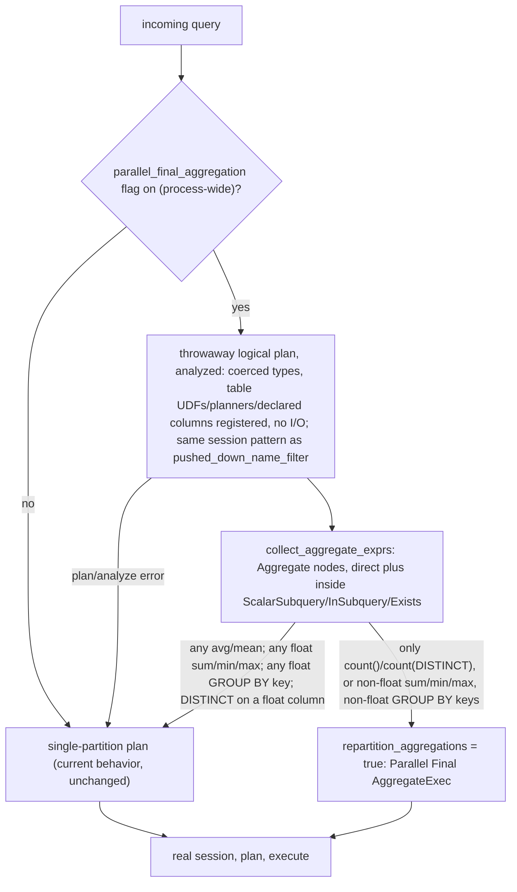

# ADR-0094: parallel final aggregation for exact-typed inputs

Status: Accepted

## Context

`crates/ravel-sql/src/session.rs`'s module doc states the current
invariant plainly: every DataFusion `repartition_*` config knob is off
(`session_config`, `session.rs:154-165`) because "every `repartition_*`
knob is turned off. Float aggregation is order-dependent, so v1 requires
aggregations to execute single-partitioned above the merged, deduplicated
stream... Parallel aggregation is banned until an ADR defines a tolerance
policy or a compensated-summation scheme" (`session.rs:54-61`). This is
ADR-0013's determinism invariant (differential gate bit-exactness against
a reference), ADR-0022's sequential-fold `avg` UDAF
(`crate::avg`), and ADR-0023's total-order `min`/`max` UDAF
(`crate::minmax`) — both built specifically to be deterministic under the
single-partition plan; ADR-0022's opening paragraph states min/max's
total-order semantics are "a sibling gap decided separately in ADR-0023;
this ADR does not touch them," so the two are cited separately below
rather than folded together.

With `repartition_aggregations` off, DataFusion's `EnforceDistribution`
never fans a `Final` `AggregateExec` across partitions: today's actual
plan (confirmed by reading it, not assumed) is a `Partial`
`AggregateExec` per scan partition — the logs scan already produces up
to `fetch_concurrency` partitions (default 8, `EngineConfig::fetch_concurrency`,
consumed by `session_config`'s `with_target_partitions`) — collapsed by
a `CoalescePartitionsExec` into one stream, then a single, serial
`Final` `AggregateExec` over the whole result. For a low-cardinality
`GROUP BY` this merge is cheap; the epic's premise is that for a
high-cardinality `GROUP BY` over a large log table, this serial merge
is the actual bottleneck, not the (already-parallel) partial
aggregation or the scan itself.

**This premise had never been measured before this ADR** — the epic's
own dependency list named "measurement showing the final merge
dominates on representative queries" as a precondition, and no such
measurement or benchmark harness existed in this repo. A throwaway,
uncommitted local benchmark was built for this ADR (real `RlogWriter`-
produced objects, a real `SessionContext`, real query execution,
`fetch_concurrency=1` vs `=8` at two data volumes) and found:

| rows / groups | 1 partition (avg) | 8 partitions (avg) | ratio |
|---|---|---|---|
| 40k / 10k | 225ms | 257ms | 0.88x (8-way slower) |
| 400k / 100k | 2.58s | 2.52s | 1.02x (no measurable gain) |

Widening the scan/partial-aggregation stage's parallelism from 1 to 8
partitions produced **no wall-clock improvement across a 10x data
range** — consistent with the serial single-partition final merge (or
some other partition-count-invariant cost) dominating, exactly as the
epic assumed. This measurement is **preliminary, not production-grade**:
`--profile ci` (unoptimized), `MemoryStore` (no network/object-store
latency), a single contended dev-machine process, not the real
multi-tenant server. It is enough to justify drafting this design; it
is explicitly **not** enough to justify shipping the resulting feature
without a release-build, production-scale (S3-backed, multi-GB,
realistic cardinality distribution) validation pass — Consequences
below makes that a required follow-up, not optional polish. **That
validation pass has since been run** (ADR-0102 decision 2, issue #458);
its S3-backed release-build numbers, and the decision they drive (the
flag's default stays `false`), are recorded in Consequences below and
are why this ADR is now Accepted rather than Proposed.

The type-exactness half of the epic's premise needs more care than "int
vs float." Two aggregates behave very differently once repartitioning is
on the table:

- `sum`, `min`, `max` over a non-float input are genuinely order- and
  partition-independent. Integer `sum` accumulates as integer addition
  end to end (DataFusion's built-in; ADR-0024, tracking whether `sum`
  should ever change, is still Proposed and does not affect this), and
  integer overflow wraps rather than raising an intermediate error, so
  the result bits are identical regardless of merge order even at the
  overflow boundary. `min`/`max` over non-float input delegate to the
  plain comparison order (`minmax.rs`'s `is_float`, below, only forces
  the slower total-order accumulator for float input) and are
  associative/commutative under any grouping of partial results.
- `avg`/`mean` are **not** eligible, regardless of input type, and this
  ADR excludes them unconditionally. `crates/ravel-sql/src/avg.rs`'s
  module doc is explicit: the sequential-fold UDAF's "metadata (name,
  aliases, signature, return type, coercion) delegates to the wrapped
  built-in so integer input still coerces to Float64 exactly as before"
  — every `avg`/`mean` call, integer or float input, runs as plain IEEE
  f64 addition (`as_float64`, `SequentialAvgAccumulator::update_batch`),
  and "a merge of partial states adds sums with the same plain IEEE
  addition" (avg.rs). f64 addition is not associative once a running sum
  exceeds 2^53, trivially reachable summing ordinary `i64` values, so
  `avg`'s bit-exactness depends entirely on the deterministic
  single-partition fold order avg.rs states as its own precondition: "in
  the deterministic `(series_id, ts)` order v1 guarantees by executing
  aggregation single-partitioned." Treating `avg(int_col)` as exact
  because its argument's *declared* type is non-float would silently
  break this UDAF's own documented contract the moment two partitions'
  partial sums are added in a different order than today's. An earlier
  draft of this ADR admitted `avg`/`mean` over non-float input on
  exactly this reasoning; it was wrong, caught by adversarial review
  before any code was written against it (this Context section records
  the mistake so it is not made twice).

`crates/ravel-sql/src/minmax.rs`'s `is_float(data_type: &DataType) -> bool`
(`minmax.rs:126-131`, checking `Float16`/`Float32`/`Float64`) already
exists and already drives a real behavioral branch —
`groups_accumulator_supported` (`minmax.rs:170-`) delegates to the fast
native accumulator only for non-float input, forcing the slower
total-order accumulator for float. It is a private `fn`; this ADR's
classification (decision 1) needs it visible from `executor.rs`, so a
visibility change (`pub(crate)`) travels with that change. It classifies
an accumulator's *resolved* scalar return type, not a raw pre-coercion
argument type — decision 1 below is deliberately built to match that
(classify from a fully type-coerced plan, not a raw one), for reasons
explained there.

## Decision

1. **A per-query exact-typed check runs before session construction,
   using the same "throwaway plan, discard it, build the real session"
   pattern this crate already uses for a different purpose**
   (`SqlExecutor::pushed_down_name_filter`, `executor.rs:838-861`:
   builds a `SessionContext` over an *empty* snapshot, with the real
   fetcher but nothing for it to fetch, purely to logical-plan the SQL
   and inspect its structure, then discards the session before the
   real, snapshot-backed one is built). This ADR's check reuses that
   shape with one deliberate difference: **it runs the query through
   DataFusion's analyzer (type coercion), not just `create_logical_plan`,
   before walking it.** `create_logical_plan` alone does not coerce
   `avg`'s argument to Float64 or apply any other UDAF/operator
   coercion — classifying from that raw plan would see `avg(int_col)`'s
   *argument* as `Int64` and misclassify it, and more generally would
   misjudge any expression whose resolved type differs from its
   syntactic operands (`a + b` where `a` and `b` are different numeric
   types, for instance). Running the plan through DataFusion's
   `Analyzer` (the same coercion pass `create_logical_plan`'s normal
   callers eventually apply before physical planning) before
   classification closes this for every admitted aggregate, not only
   `avg` — `avg` is additionally excluded unconditionally regardless of
   what this resolves to (Context section), so this mainly protects
   `sum`/`min`/`max` against a coercion this ADR did not anticipate.
   Against the coerced plan, walk every `LogicalPlan::Aggregate` node,
   reached by:
   - `plan.inputs()` recursion, mirroring `collect_filter_predicates`
     (`executor.rs:1260-1267`) — a new `collect_aggregate_exprs` helper,
     sibling to it, for the direct-descendant case.
   - **Also**, at every node visited, a scan of that node's own
     `expressions()` for an embedded subquery plan
     (`Expr::ScalarSubquery`, `Expr::InSubquery`, `Expr::Exists`), each
     of which wraps its own `LogicalPlan` that `plan.inputs()` never
     descends into. `crate::validate`'s own aggregate-name check
     recurses into subqueries too (`validate.rs:729`'s test,
     `stddev_var_is_rejected_in_a_subquery_and_case_insensitively`) —
     that test exercises a FROM-clause derived-table subquery, which
     `plan.inputs()` already descends into on its own, so it confirms
     subqueries are admitted, reachable surface in this SQL dialect in
     general, not specifically evidence for the expression-embedded case
     this bullet exists for. A float `avg` hidden inside a scalar
     subquery must be found the same as one at the top level regardless,
     which is why this scan runs unconditionally rather than only where
     a precedent happens to demonstrate the exact shape. Each embedded
     subquery's `LogicalPlan` is walked with the identical
     `collect_aggregate_exprs` recursion, recursively.
   - Classify every `Aggregate` node found this way:
     - Zero aggregate expressions (a `SELECT DISTINCT` lowers to an
       `Aggregate` node with an empty aggregate-expression list) is
       still visited for its **group-by keys** — see below.
     - `count(...)` over any input type: always exact. Counting
       presence is order-independent regardless of the counted value's
       type or floatness — reordering never changes how many non-null
       values existed. `count(DISTINCT x)` is included in this
       exactness (partial-count merge is exact integer addition
       regardless of `x`'s type; distinctness is a per-row property
       merge order cannot change).
     - `sum`/`min`/`max` (the only other exact-eligible aggregates) over
       a resolved-non-float input (via the now-`pub(crate)`
       `minmax::is_float` on the coerced type): exact under any
       partitioning.
     - `avg`/`mean`, over **any** input type: never exact (Context
       section). Their presence anywhere in the query, like a float
       `sum`/`min`/`max`, forces the single-partition plan.
     - Any `sum`/`min`/`max` over a `Float16`/`Float32`/`Float64`
       (resolved) input: not exact.
   - **Every `Aggregate` node's GROUP BY key expressions are also
     type-checked, independent of its aggregate expressions.** A
     `Float64` (or narrower float) group key is excluded even when
     every aggregate in the same query is exact: this repo's own
     conventions make `-0.0` and NaN payloads bit-significant
     (`minmax.rs`'s reason for existing at all; ADR-0013's differential
     gate), and this ADR has no proof that DataFusion's grouping
     mechanism picks a merge-order-stable representative bit pattern
     for a float group key under an arbitrary partition split. Absent
     that proof, a float group key disqualifies the query — this also
     covers `SELECT DISTINCT float_col`, since that lowers to an
     `Aggregate` node whose group-by key is the `DISTINCT` column, with
     no aggregate expression to otherwise flag it.
   - A single disqualifying aggregate or group key, anywhere in the
     query including inside a subquery, forces the *whole* query onto
     today's single-partition plan — this ADR is query-granular, not
     expression- or subquery-granular: DataFusion's
     `EnforceDistribution` reads `repartition_aggregations` as one
     session-wide config knob, not a per-`AggregateExec`-node or
     per-subquery choice.
   - **Any error while building or analyzing the throwaway plan
     classifies the query as not exact (fail closed), the opposite
     polarity from `pushed_down_name_filter`'s fail-open `None` on
     error.** `pushed_down_name_filter`'s `None` is safe there because
     "no name filter extracted" only costs a missed optimization
     (widen-only); here, wrongly admitting an unclassifiable query into
     the exact-typed set could repartition an aggregate this check
     never actually verified. The throwaway session must register
     everything a legitimate query might need to plan successfully —
     the query's table-specific UDFs (`has_word`, `label`/
     `label_match`), the map-field `ExprPlanner`, and the tenant's
     ADR-0090 declared columns — or a normal, otherwise-safe query fails
     to plan in this check and (per fail-closed) silently loses the
     optimization rather than erroring the query; this is a performance
     regression risk to note in the implementation task, not a
     correctness one, precisely because fail-closed is the chosen
     default.
2. **`session_config` gains an `exact_typed_aggregates: bool` parameter**,
   threaded from decision 1's check into the one place that currently
   hardcodes `.with_repartition_aggregations(false)`
   (`session.rs:161`) — set to `.with_repartition_aggregations(exact_typed_aggregates)`
   instead. Every other `repartition_*` knob (`joins`, `sorts`,
   `windows`, `file_scans`, `session.rs:162-165`) stays unconditionally
   `false`: this ADR is scoped to aggregation only, per the epic; a
   join or sort's own determinism requirements are untouched and out of
   scope. `build_session`'s callers thread the same computed value they
   already have in scope from decision 1's check, run once per query
   right before the real session is built, at every production call
   site that funnels through `plan_pinned_with`'s single `build_session`
   call (`executor.rs:660`): `execute` (`executor.rs:427`, the HTTP
   `run` path's caller), `plan_pinned` (`:540`), and
   `plan_pinned_distributed` (`:576`, whose only production caller is
   the Flight SQL lane's `start_pinned`). `worker_fragment_stream`
   (`executor.rs:718`, the Flight SQL worker-fragment path) is a
   distinct call site that plans no new SQL and runs no aggregation of
   its own — it passes `false` unconditionally, not through decision
   1's check. Test-only call sites (`session.rs`, `logs_provider.rs`,
   `spans_scan.rs`) are unaffected and continue passing `false`.
   To avoid planning every query three times (name-filter extraction,
   this classification, the real plan) when the feature is off,
   decision 1's check does not run at all unless
   `parallel_final_aggregation` (decision 4) is `true` — skipping it
   when the flag is off is strictly equivalent (an unclassified query
   already gets `false`) and costs nothing. The flag is process-wide
   (decision 4: one `SqlConfig` value, no per-tenant dimension), so
   this is a single global check, not a per-request tenant lookup.
3. **No amendment to ADR-0013's no-spill invariant, but its cost profile
   changes in a specific, previously-misstated way, and must be
   validated, not assumed.** Spilling stays disabled (`session.rs`'s
   `MemoryPool`, unchanged; ADR-0013's hard-cap guarantee for
   scan/sort/aggregate operators via the enforced `try_grow` path is
   unaffected in kind — budget exhaustion is still always an error,
   never a silent partial result). **What does not change**: up to
   `fetch_concurrency` `Partial` `AggregateExec` instances already run
   concurrently today, one per scan partition, each building its own
   partial hash table — that concurrency is `repartition_aggregations`-
   independent and exists under today's single-partition plan too.
   **What changes** is the `Final` stage: today, `CoalescePartitionsExec`
   collapses every partial partition into one stream feeding a single
   `Final` `AggregateExec`, whose one hash table approaches the query's
   full group cardinality. Under this ADR, a hash-partitioning
   `RepartitionExec` (new buffered exchange memory, not present today)
   redistributes each partial partition's rows by group-key hash across
   up to `fetch_concurrency` `Final` `AggregateExec` instances, each
   building a hash table for its own hash-partitioned *share* of the
   group space rather than the full cardinality — so the real memory
   delta is a new redistribution buffer plus N final tables that
   jointly, not individually, approach the prior single table's total
   size, not "N tables each near full cardinality" (an earlier draft's
   wrong claim, corrected here). This still is not free: the
   redistribution buffer is new memory that did not exist in today's
   plan, and DataFusion's partial-aggregation early-emit mechanism
   (`skip_partial_aggregation`, which bounds an individual partial
   table's growth once its distinct-key ratio suggests grouping isn't
   shrinking the data, and which already runs under both plans) does
   not bound the redistribution buffer itself. The shared per-query
   memory pool's hard cap still makes any outcome *safe* (a query that
   would overshoot the budget fails closed exactly as it does today,
   per ADR-0013), but the new redistribution buffer means a query that
   fit comfortably under single-partition execution could newly hit the
   budget error under the repartitioned plan for the same data — a real
   behavior change worth surfacing to an operator, not silently
   absorbing. This ADR does not change the budget or the no-spill
   stance; it requires (Consequences) a peak-memory measurement across
   representative high-cardinality `GROUP BY` shapes, specifically
   comparing the redistribution-buffer cost against today's single
   final table, as part of the same production-scale validation pass
   the Context section's benchmark caveat already demands, before this
   ships to a default-on posture (decision 4).
4. **Ships behind the existing `SqlConfig`, not force-enabled everywhere
   at once.** Given the wall-clock benchmark above is preliminary and
   decision 3's memory-shape change is unvalidated at production scale,
   this ADR does not claim "always beneficial, always safe" as a launch
   condition. Whether a tenant's exact-typed queries are *allowed* to
   actually repartition is gated by a new `SqlConfig` field,
   `parallel_final_aggregation: bool` (default `false` at merge). This
   repo has no live-reload mechanism for `SqlConfig` today — it is
   built once at server startup from CLI/env
   (`services/ravel-server/src/config.rs`) — so flipping the default
   means a config change plus a process restart, the same rollback
   story every other `SqlConfig` field already has; an earlier draft
   incorrectly described this as flippable without a redeploy, which
   this repo's config loading does not support.
5. **Differential test proves bit-identical results across partition
   counts under an explicit canonical ordering, not "bit-identical rows"
   unqualified.** A `GROUP BY` without an `ORDER BY` has no row-order
   guarantee in this engine today, single-partition or not (nothing in
   the HTTP/Flight contract promises aggregate output order absent an
   explicit `ORDER BY`), and under repartitioned final aggregation the
   physical merge order is completion-order-dependent, i.e.
   nondeterministic *even for a fixed partition count* across repeated
   runs. The differential test therefore:
   - Sorts result rows by the full group-by key tuple (a total order,
     since group-by columns are exactly what distinguishes rows) before
     comparing, both for the baseline (`fetch_concurrency=1`, today's
     plan) and every repartitioned run (`4`, `8`, `16`) — proving
     identical *content*, which is the actual invariant this ADR must
     preserve, not identical *arrival order*, which was never
     guaranteed.
   - Runs each repartitioned partition count multiple times (not once),
     to catch a merge-order-dependent race that a single run could miss
     by chance.
   - Includes an explicit comparison of `parallel_final_aggregation` on
     with `fetch_concurrency=1` against today's shipped single-partition
     configuration, rather than assuming the two are the same test.
     With `target_partitions=1` a single partition already satisfies
     `EnforceDistribution`'s distribution requirement, so no
     `RepartitionExec` is expected and the physical plan should in fact
     converge with today's — the comparison exists to confirm that
     convergence actually holds (decision 1's classification and
     decision 2's config flip both still ran, even though the resulting
     plan shape is expected to be unchanged), not because the code path
     differs.
   - Includes adversarial data specifically chosen to distinguish a
     correct integer `sum`/`avg` boundary from a silently-wrong one: an
     integer column whose running sum crosses 2^53 within a single group
     (this exact case is what would have caught the avg mistake this
     Context section records, had `avg` still been admitted).
   A separate test asserts a query with a disqualifying float aggregate,
   a float group-by key, or a `SELECT DISTINCT` on a float column still
   produces the single-partition plan's `EXPLAIN` shape (no
   `RepartitionExec` above the scan feeding a fanned-out `Final`
   `AggregateExec`) regardless of `parallel_final_aggregation`, proving
   decision 1's classification, not just decision 2's config wiring, is
   what gates the behavior. A third asserts a query with a disqualifying
   aggregate hidden inside a scalar subquery is also classified
   not-exact, covering decision 1's subquery-walk requirement
   specifically.

## Rejected alternatives

- **Turn `repartition_aggregations` on unconditionally (drop the
  per-query type check entirely).** Rejected outright: this breaks
  ADR-0013's differential-gate bit-exactness for every float aggregate
  query, which is not a performance trade-off this ADR is authorized to
  make — ADR-0013 requires float aggregation to stay single-partitioned
  until an ADR defines a tolerance policy or a compensated-summation
  scheme (`session.rs:60-61`), and this ADR defines neither; it only
  proves the *exact*-typed case (now correctly excluding `avg`/`mean`
  entirely, and any float group key) needs no such policy in the first
  place.
- **Define a float tolerance policy or compensated-summation scheme now,
  so float aggregates (including `avg`) can repartition too.** Rejected
  as out of scope: this is explicitly issue #65's problem (named in the
  epic body), a numerically substantial design question (which
  tolerance? Kahan summation's own ordering sensitivity? how does a
  tolerance interact with the differential gate's current bit-exact
  comparison?) entirely independent of whether exact-typed aggregation
  can safely repartition today. Bundling it here would block a design
  that needs no such policy behind one that does.
- **Admit `avg`/`mean` over non-float input as exact, on the reasoning
  that "sum-then-divide over integers is associative."** This was this
  ADR's original position and is rejected: it is false for this specific
  UDAF regardless of the *declared* input type, because
  `crate::avg`'s numerator always runs as plain IEEE f64 addition
  (Context section) — coercion happens before the accumulator ever
  sees the value, so there is no integer-arithmetic path to be
  associative in the first place. A future amendment could admit `avg`
  by reworking its numerator to genuine fixed-point/integer arithmetic
  for non-float input, but that is a UDAF redesign with its own
  correctness surface, not something this ADR's classification alone
  can grant.
- **Classify exactness from the raw SQL text, the parse-gate's AST
  (`crate::validate`), or an unanalyzed logical plan.** Rejected for all
  three: `sum(dur)`'s exactness depends on `dur`'s *resolved, coerced*
  Arrow type, which requires running the plan through DataFusion's type
  coercion (decision 1) — an unanalyzed plan can misreport an
  argument's type for any UDAF or operator with non-identity coercion
  (`avg` is the concrete example that surfaced this, Context section).
  A syntactic check would either reject conservatively (defeating the
  ADR's purpose for expressions it can't parse) or wrongly admit an
  expression whose real, coerced type it never resolved.
- **Make the exactness check span-granular within one query (repartition
  the exact-typed aggregates, keep the float ones single-partition, in
  the same physical plan).** Rejected: `repartition_aggregations` is one
  `SessionConfig` boolean `EnforceDistribution` reads for the whole
  physical-plan pass, not a per-`AggregateExec`-node override;
  achieving per-expression granularity would need a custom physical
  optimizer rule replacing `EnforceDistribution`'s aggregate handling
  entirely — real, separate design work with its own correctness
  surface (getting DataFusion's own distribution-enforcement invariants
  right for a partially-repartitioned plan), not justified by the
  epic's stated scope (whole-query admission, not per-expression).
- **Ship with `parallel_final_aggregation` defaulting to `true`
  immediately, since the preliminary benchmark is directionally
  positive.** Rejected: the benchmark is explicitly caveated as
  non-production (Context section) and decision 3 identifies a real,
  unvalidated peak-memory cost shape (the new redistribution buffer).
  Shipping default-off with an explicit flag costs nothing but a
  redeploy once validation completes, and avoids a silent behavior
  change (a query newly hitting its memory budget) reaching every
  tenant on a benchmark this ADR itself says isn't strong enough to
  justify that.

## Consequences

- `crates/ravel-sql/src/session.rs`: `session_config` signature gains
  `exact_typed_aggregates: bool`; `with_repartition_aggregations` reads
  it instead of a hardcoded `false`. Every other `repartition_*` call
  unchanged.
- `crates/ravel-sql/src/minmax.rs`: `is_float` becomes `pub(crate)` so
  `executor.rs` can reuse it for classification.
- `crates/ravel-sql/src/executor.rs`: a new `collect_aggregate_exprs`
  helper (sibling to `collect_filter_predicates`, extended to also
  descend into `Expr::ScalarSubquery`/`InSubquery`/`Exists`-embedded
  plans); a new per-query classification step running DataFusion's
  analyzer over `pushed_down_name_filter`'s throwaway-session pattern
  (registering the query's table-specific UDFs, `ExprPlanner`, and
  ADR-0090 declared columns), run once before `build_session` at
  `plan_pinned_with`'s call site, but only when
  `parallel_final_aggregation` is `true` (decision 2). `worker_fragment_stream`
  passes `false` unconditionally.
- New `parallel_final_aggregation: bool` field on `SqlConfig`
  (`crates/ravel-sql/src/config.rs`), default `false`; set at startup
  from `services/ravel-server/src/config.rs` like every other `SqlConfig`
  field — no live-reload.
- No format change: this is pure query-execution-plan behavior, no
  proto, no `TenantConfig`, no RSEG/RLOG change.
- **S3-backed validation measurement (ADR-0102 decision 2, issue #458).**
  The Context section's preliminary `MemoryStore` benchmark has now been
  re-run at release build against a real S3-compatible store, replacing
  that preliminary framing as the evidence of record. Tool:
  `crates/ravel-bench/src/bin/groupby_scaling_bench.rs` (issue #457),
  `--store s3`. Backend: a loopback MinIO reached over `RAVEL_S3_*`
  (`minio/minio:latest`, HTTP, `127.0.0.1`) — **not** a real AWS S3
  endpoint. Host: 8 logical cores, release profile. Query: the bin's
  fixed exact-typed group-by, `SELECT series_id, count(*), min(ts),
  max(ts) FROM samples GROUP BY series_id` (non-float group key,
  `count`/`min`/`max` over non-float inputs — provably exact-typed, so
  the flag genuinely engages: the `fanned_out` column below is read back
  from the real physical plan). Dataset: 2000 distinct series (= 2000
  result groups) across 8 RSEG parts, 1000 samples/series (2,000,000
  scanned rows). 30 timed runs per combination after one warm-up.

  | target_partitions | parallel | fanned_out | median_ms | stddev_ms | runs |
  |---|---|---|---|---|---|
  | 1 | false | no  | 6403.8 | 116.7 | 30 |
  | 1 | true  | no  | 6392.1 | 117.6 | 30 |
  | 2 | false | yes | 8210.9 | 678.8 | 30 |
  | 2 | true  | yes | 7742.7 | 185.9 | 30 |
  | 4 | false | yes | 9834.0 | 464.5 | 30 |
  | 4 | true  | yes | 9467.5 | 546.4 | 30 |
  | 8 | false | yes | 18590.1 | 2754.1 | 30 |
  | 8 | true  | yes | 18552.6 | 2521.8 | 30 |

  (At `target_partitions=1` a single partition already satisfies
  `EnforceDistribution`, so no `RepartitionExec` is inserted and
  `fanned_out` is `no` even with the flag on — the expected convergence
  decision 5 predicts. At 2/4/8 the flag really did fan the `Final`
  stage out.)

  **Reading, per-partition-count (on median vs off median at the same
  `target_partitions`, run-to-run stddev from a per-run spread on a
  contended host, not a standard error of the median -- runs within a
  combination were not interleaved, so this is a coarser check than a
  proper significance test):** `tp=1` −0.18% (11.7 ms, well inside the
  ~117 ms stddev); `tp=2` −5.7% (468 ms — the largest apparent gain, but
  the off row's 679 ms stddev comes from a high-variance tail and the two
  distributions overlap heavily); `tp=4` −3.7% (367 ms, inside one
  combined per-run stddev); `tp=8` −0.20% (37.5 ms, dwarfed by the
  ~2500 ms stddev). Parallel final aggregation is **within one combined
  per-run stddev of serial at every measured partition count**: the only
  apparent gains (tp=2, tp=4) are small and inside that band, and vanish
  again at tp=8; no partition count shows parallel robustly faster by
  this check, and none shows it slower.

  **A second, structural finding, on the PARTITION-COUNT axis (not the
  flag axis above):** holding the flag fixed, median latency *rises*
  monotonically with `target_partitions` (6.4 s → 18.6 s from tp=1 to
  tp=8, roughly +190%) -- the opposite of core-count speed-up, and a far
  larger effect, in the same direction, as the preliminary `MemoryStore`
  measurement's own partition-count sweep (which found parallelizing the
  scan ~14% slower at 8 partitions and low cardinality). The two
  measurements are not directly comparable -- the preliminary run had no
  `parallel_final_aggregation` flag to test, only scan partition count
  with a serial final merge -- but both point the same way: fanning the
  scan out costs more than it saves at this cardinality, on both a
  `MemoryStore` and a real-S3 backend. The likely mechanism on real S3:
  the dataset's segment count (`parts=8`) is fixed across the whole
  sweep, so GET count and size per segment are invariant as
  `target_partitions` increases from 1 to 8 -- only *concurrency*
  changes, either more simultaneous object-store round trips contending
  for the same loopback MinIO, or CPU oversubscription from running more
  concurrent scan/decode threads than the host's 8 logical cores. This
  measurement cannot distinguish the two; either way, the epic's founding
  premise (the serial final merge is the bottleneck) holds only when this
  concurrency cost is absent, as the preliminary `MemoryStore` run's
  much smaller regression suggests it was; with real S3 (and its
  concurrency contention) in the loop, the final merge is not where the
  time goes, so parallelizing it buys nothing net.

  **Decision, per ADR-0102 decision 2's default-follows-measurement
  rule:** parallel is not robustly faster than serial at any measured
  partition count, so the flag's default **stays `false`**
  (`SqlConfig::default().parallel_final_aggregation`,
  `crates/ravel-sql/src/config.rs`; unchanged by this measurement, pinned
  by a new test -- see Tests below) and this ADR moves to Accepted on the
  strength of a proper S3-backed measurement — a validated "do not
  default this on" is a real, evidenced decision, not an open question.
  This measurement did not reach a cardinality large enough to test
  ADR-0102 decision 2's other branch (a partition-count-dependent
  crossover) -- see the cardinality caveat below.

  **Caveats, stated plainly:**
  - *Loopback MinIO, not real AWS S3, and the I/O-vs-CPU-oversubscription
    ambiguity above.* A `127.0.0.1` MinIO has far lower and more uniform
    latency than a real remote S3 endpoint. If the structural finding
    above is genuinely object-store-latency-bound, a real S3 endpoint
    would make the scan dominate the wall clock *more*, not less, which
    would make this measurement a **lower bound** on how thoroughly the
    scan out-weighs the final merge in production and would strengthen
    the "default off" conclusion. But if the finding is actually
    CPU/thread oversubscription on this specific 8-core host rather than
    object-store latency, that lower-bound argument does not hold, and a
    differently-shaped host or a real S3 endpoint could shift the balance
    either way. This measurement cannot tell the two apart; whoever picks
    up ADR-0102 decision 1's redesign (which independently flagged the
    same real-S3 request-amplification risk from scan fan-out) should
    re-derive this rather than assume the lower-bound framing holds.
  - *Cardinality is 2000 groups / 2M rows (`groupby_scaling_bench`'s
    `--series` default left as-is, `--samples-per-series` raised
    500→1000), below the 20000-group / ClickBench-class target
    ADR-0102 framed.* The final-merge cost this ADR parallelizes grows
    with group cardinality, so a much larger cardinality could in
    principle shift the balance toward parallel. That regime was not
    reachable for a 30-run sweep on this real-S3 path: scan cost scales
    with series count (≈25 s per scan at 20000 series, and higher
    `target_partitions` made it slower, not faster, for the same
    concurrency-cost reason above), and a single aggregation over
    ≈10M+ rows exceeds the shipped 256 MiB per-query pool
    (`DEFAULT_MAX_QUERY_BYTES`) and fails closed with a typed
    `ResourcesExhausted` (ADR-0013 no-spill) — which the bench exposes no
    flag to raise (`--max-tenant-bytes` sets the per-tenant ceiling, not
    the per-query pool; confirmed no other flag reaches it). So the
    measured point is the largest that both fits the real shipped
    per-query budget and admits a 30-run sweep within the validation
    host's time budget. A future task that wants the high-cardinality
    crossover point specifically would need the bin extended to raise
    `max_query_bytes`; that is not this decision's blocker, because the
    scan-dominated real-S3 result is itself the
    answer for representative execution.
  - Decision 3's isolated peak-memory (redistribution-buffer)
    measurement is not reproduced numerically here; the sweep did
    surface its qualitative shape during scoping (a parallel-plan
    combination hit `Memory Exhausted while SpillPool (DiskManager is
    disabled)` where the serial plan reported the plain pool-exhausted
    error for the same data, i.e. the new redistribution buffer does move
    the memory ceiling), consistent with decision 3's caveat. A precise
    peak-memory isolation remains the follow-up decision 3 named.
  - **Cross-reference for ADR-0102 decision 1 (intra-segment scan
    partitioning, currently Deferred pending redesign):** this
    measurement's structural finding -- scan fan-out costing more than it
    saves at this cardinality on real S3 -- empirically corroborates
    decision 1's own deferral rationale, which independently predicted
    real S3 request/egress amplification from splitting one segment's
    blocks across partitions. Whoever redesigns decision 1 should read
    this measurement's caveats above (particularly the
    I/O-vs-CPU-oversubscription ambiguity on this specific 8-core host)
    before assuming the amplification is purely an object-store-request
    cost that a byte-range `GetRange` fetch or the ADR-0046 single-flight
    cache would fully absorb -- it may be a concurrency/scheduling cost
    that persists even with the request count fixed.
- `docs/query-engine.md` gains a short note on `parallel_final_aggregation`,
  the exact-typed admission rule (including that `avg`/`mean` and any
  float group-by key are never eligible), and that a `GROUP BY` without
  an explicit `ORDER BY` has no row-order guarantee, unchanged by this
  ADR. `docs/sql-conformance.md` needs no new row (this changes
  execution plan shape, not which SQL constructs are supported).
- Out-of-scope bug found during this ADR's review, reported per this
  repo's rules rather than fixed here: `session.rs`'s doc comment near
  `ADMITTED_AGGREGATES` (around `:115`) still says "`avg`/`mean` are
  admitted (ADR-0022 decision 7) and stay excluded here until their
  custom UDAF lands" — the UDAF has landed and `avg`/`mean` are in the
  admitted array a few lines below, so the comment is stale and
  self-contradicting; it also cites "decision 7" where the rest of this
  file cites "decisions 3, 4" for the same UDAF.

## Amendment 2026-08-26 (issue #741): default flips to `true`

Status: Accepted (amends decision 4's default; the classification of
decision 1 and the determinism argument of decision 3 are unchanged).

The original decision shipped `parallel_final_aggregation` defaulting to
`false`, on the strength of the earlier synthetic-load measurement, which
found parallel not robustly faster than serial at any partition count.
This amendment flips the default to `true` for the exact-typed class only.
The classification gate is untouched: a non-exact-typed plan still gets the
single-partition final byte for byte, and nothing here changes which plans
are eligible.

**Evidence.** Measured on the 8,424-object ClickBench tenant (issue #680)
at 32 scan partitions with an 8 GiB per-query memory pool:

- With the flag **off**, every high-cardinality `GROUP BY` /
  `COUNT(DISTINCT)` statement runs its `Final` aggregate in a single
  partition under `CoalescePartitionsExec`. That serial final exhausted
  the 8 GiB pool: **nine statements failed** outright with a pool-exhausted
  error (not merely slow — refused, because spilling is disabled by design,
  ADR-0013/ADR-0102 decision 3).
- With the flag **on**, `COUNT(DISTINCT UserID)` completes in **44–50 s**,
  and four more previously-failing statements complete at **47–50 s** — the
  same figure as a plain full scan, i.e. the aggregate stops being the
  bottleneck. The read-only trace found **no determinism cost** for the
  exact-typed class: the partition of the group set cannot change any
  aggregated value (`count`, `count distinct`, and integer `sum`/`min`/`max`
  are all partition-order-independent), and output order without an explicit
  `ORDER BY` was already unguaranteed (see `docs/query-engine.md`), so the
  repartitioned merge order changes nothing a client was entitled to rely
  on. Decision 3's caveat — that the hash exchange carries every forwarded
  row when the #728 probe fires — held only as a *slower*, never a
  *failing*, path.

The measurement therefore inverts decision 4's default-follows-measurement
conclusion for the exact-typed class: the serial final is not merely slower
at scale, it fails queries that the parallel final completes, and it does so
with no correctness or determinism cost for that class.

**Opt-out.** The behavior remains a single process-wide switch with no
live-reload. `SqlConfig::parallel_final_aggregation` now defaults to `true`;
the server flag `--sql-parallel-final-aggregation` stays accepted and still
means on, and `--sql-parallel-final-aggregation=false` is the operator
opt-out (a clap bool value parser: `num_args = 0..=1`, `default_value_t =
true`, `default_missing_value = "true"`, `action = Set`). Setting it to
`false` restores the exact pre-amendment single-partition final for every
query. The bench (`sql_latency_bench`) carries the same shape and its
report's provenance records the effective value.

**Still excluded (unchanged).** `avg`/`mean` over any input type remain
never eligible (their fold is IEEE f64 addition, not associative past
2^53), as does any `sum`/`min`/`max` over a float input and any float
`GROUP BY` key (including a bare `SELECT DISTINCT float_col`). A single
disqualifying aggregate or key anywhere in the query — including inside a
scalar/`IN`/`EXISTS` subquery — still forces the whole query onto the
single-partition plan. This amendment changes only the default of the gate,
not the gate. It also does not touch the *string-keyed partial* stage that
exhausts the pool for a different reason (`partitions x distinct` pre-final
state); that is issue #680's separate `skip_partial_aggregation` fix, which
was already on by default.
