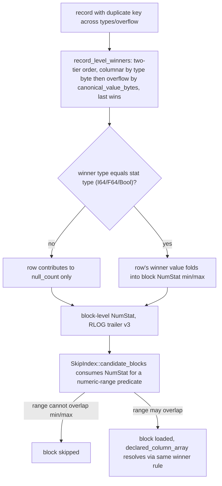

# ADR-0095: NumStat cross-type resolution fix and RLOG v3

Status: Proposed

Migration class: A (bulk data objects), ADR-0066 decision 4. Convergence is
by retention and re-ingest only. The pre-release regime of ADR-0027 applies:
exactly one supported RLOG trailer version, and v2 read and write support is
deleted in the same change that introduces v3. This matches the sibling
precedent ADR-0092 just set for RSEG v6 to v7 (decision 7): no N/N-1 window,
no `maintain migrate` rewrite path, because a single-version reader cannot
open its own inputs to rewrite them.

**Every existing RLOG object becomes unreadable the moment this ships.**
There is no dual-reader window and no migration job that can touch a v2
object once v3 readers are the only readers. Convergence is retention aging
the old objects out, or re-ingestion. This is the same consequence the team
already accepted for RSEG today; here it applies to logs.

## Context

Issue #331: declared-column range pruning was scoped as a planner change in
ADR-0093, then found to need a write-path fix first. Research into why:

### NumStat is blind to cross-type and overflow duplicates

`NumStat` (`crates/ravel-logseg/src/block.rs:41-54`) is a per-block min/max
stat for I64/F64/Bool dynamic columns, computed by `i64_stat`/`f64_stat`/
`bool_stat` (`block.rs:109-205`) from `row_column`
(`block.rs:380-385`):

```rust
row.columns.iter().find(|(cid, _)| *cid == column_id).map(|(_, v)| v)
```

This reads `ResolvedRow.columns` only. It has no access to `overflow` or
`attrs_raw`, and no notion that the same attribute name can appear more than
once in a record across different columnar type slots or in overflow.

This is structurally the same gap #333 found and fixed in POSTINGS: two
occurrences of the same key with different types (or a same-type occurrence
that spilled to overflow) produce a merged-view winner that the old
write-path logic never consulted. #333's fix
(`writer.rs:753-791`, `record_level_winners`) computes, per record and per
*indexed* name, the true cross-type winner: columnar entries sorted by type
byte, then overflow entries sorted by `canonical_value_bytes`, take the
last entry of the combined list. That is exactly what `rebuild_record` and
`merged_attrs` reconstruct on read. NumStat has no equivalent.

### What a declared column actually resolves to

`declared_column_array` (`crates/ravel-sql/src/logs_scan.rs:942-993`) reads
a row's value via `find_attr` (`rlog_attrs.rs:93`), which does first-match
over `merged_attrs`'s output. `merged_attrs` has already deduplicated to one
entry per key via its own last-wins fold, so "first match" is really "the
one merged-view winner for this key" — there is normally only one entry to
find by the time `find_attr` looks.

The consequence that matters for NumStat: `declared_column_array` only
accepts a value when the merged-view winner's `AttrValue` variant *matches
the declared type exactly*. If the winner for `dur` in a given record is a
`Str`, a declared `dur: i64` column materializes NULL for that record, even
if the record also has an I64 occurrence of `dur` somewhere that lost the
merge. There is no coercion attempt.

So a row's true contribution to the `(name, I64)` NumStat is not "does this
row have an I64 occurrence of `name`" — it is "is the cross-type merged
winner for `name` in this row of type I64, and if so, what is it." A
columnar I64 value that lost to a same-record `Str` duplicate must
contribute nothing to the I64 stat, not its own value; encoding it anyway
means the min/max range does not bound the value `declared_column_array`
actually produces, and pruning against it can silently discard the one
block that holds the record a range query is looking for.

### Where this leaves the reader side

`SkipIndex::candidate_blocks` (`skip_index.rs:140-177`) does not consume
`stats: Vec<NumStat>` at all today — it prunes on ts/stream_ref bounds
only. Declared-column range pruning has no reader-side wiring yet,
independent of the write-path bug above.

## Decision

### 1. Generalize the cross-type winner computation

Widen the name set that `resolve_row`'s winner-tracking
(`idx_cols`/`idx_overflow`, currently gated on `indexed_names`) covers, from
indexed names only to `indexed_names ∪ numstat_names`, where
`numstat_names` is the set of attribute names with an I64, F64, or Bool
dynamic column eligible for a NumStat. Reuse `record_level_winners`'s
two-tier ordering (columnar by type byte, then overflow by
`canonical_value_bytes`, last wins) as the single source of per-record,
per-name winner resolution for both POSTINGS and NumStat. Do not write a
second implementation of that order — a second copy is the exact kind of
divergence that produced #333.

Scope the widened tracking to `numstat_names` specifically, not every
attribute in the record: growing `idx_cols`/`idx_overflow`-equivalent maps
for every attribute on every row in the hot `resolve_row` loop is an
unbounded cost increase; scoping to the (typically small) set of names that
actually get a NumStat keeps it bounded to today's indexed-name cost shape.

### 2. Block-encode step consults the winner, not the raw column value

`i64_stat`/`f64_stat`/`bool_stat` take the per-record winner for a given
name and include the row's value in the stat if and only if the winner's
type matches the stat's type. A row whose winner for that name is a
different type (or absent) contributes to `null_count` the same way an
absent attribute does today — it does not contribute its raw columnar
value.

### 3. Fix all three types uniformly

I64, F64, and Bool all move to winner-based resolution in the same change.
ADR-0090 declares no `f64` column today, so nothing currently reads F64
NumStat through a declared column, but NumStat is written for it
regardless. Leaving F64 on the old semantics while fixing I64/Bool would
put two different resolution rules under one section version byte, and
would cost a second version bump the day a declared f64 column is added.
Fix it now while the trailer is already moving.

### 4. RLOG trailer version bump, v2 to v3

SKIP_IDX is one of RLOG's mandatory sections
(`docs/log-segment-format.md:596-633`: "Only a change to an existing
section's grammar shape, or to a mandatory/optional kind's legality, needs a
trailer version bump and an ADR"). This is a
change to an existing field's meaning, not a new optional section, so the
POSTINGS carve-out (ADR-0029, exercised when ADR-0049 added POSTINGS as a
new section — the amendment's later POSTINGS_VERSION 1-to-2 bump is a
separate, section-local event needing no trailer bump for its own,
different reason) does not apply here. `footer::VERSION` moves 2 to 3
(`crates/ravel-logseg/src/footer.rs:15-22`),
`SUPPORTED_VERSIONS = SupportedVersions::single(VERSION_V3)`
(`footer.rs:81`), and v2 read and write support is deleted in the same
change — writer, reader gate, `audit-versions`, `migrate`, and the
compactor's `OUTPUT_FORMAT_VERSION` all read the single constant, per the
format-change skill's single-sourcing requirement.

### 5. Dual-reader question

None. Pre-release single-version regime: no N-1 reader, no window, no
fleet rollout ordering. This is the direct answer the format-change skill
requires stated explicitly.

### 6. Reader-side wiring, in scope for this epic

`SkipIndex::candidate_blocks` gains an optional numeric-range predicate
input (per NumStat-eligible column) and prunes a block when the range
cannot overlap the block's recorded min/max for that column, using the
existing `min_bits`/`max_bits`/type-aware comparison already present in
`merge_stats` (`skip_index.rs:52-69`). This closes the loop: a write-path
fix with no reader consumer delivers no observable capability, which fails
deliver-epic's reachability requirement. The acceptance test drives this
through `ravel-logseg`'s own reader test harness — the existing
`Predicate`-driven scan tests that already exercise ts/stream_ref pruning
are the pattern to follow — proving blocks are actually skipped for a
numeric range that the merged winner falsifies. This does **not** include
wiring a SQL-planner-side predicate extraction from a declared-column
comparison; that is #278's job, unblocked once this mechanism is sound.

### 7. Checksum coverage

SKIP_IDX bytes are already inside RLOG's existing trailer-covered span;
this change alters field semantics, not the section's byte layout or its
position relative to the checksum. Implementation must verify the NumStat
byte range stays under the same checksum coverage it has today — no
coverage change is expected, but this is a verification item for the task,
not an assumption to skip.

### 8. Tests and tooling

Extend `ravel-logseg`'s fuzz and property tests to cover v3 NumStat
encoding, plus corrupt and truncated SKIP_IDX inputs at v3. Add a
cross-type-duplicate property test asserting `declared_column_array`'s
resolution and NumStat's min/max bound agree for generated records with
colliding keys across types. Update `ravel-cli`'s RLOG inspector to print
v3 and the corrected NumStat semantics. `ravel-maintain/tests/
rlog_determinism.rs:35` hardcodes `= 2` rather than reading
`footer::VERSION`; update it in this change or the bump breaks that test
on a stale literal instead of the constant.

## Rejected alternatives

**Recheck at query time instead of fixing NumStat.** Keep NumStat as-is;
after `candidate_blocks` returns a candidate set, re-verify each block by
loading it and checking `declared_column_array`'s actual value. Rejected:
this doesn't just make pruning imprecise, it makes it unsound in the wrong
direction — a block that should have been pruned still gets loaded (a perf
loss, tolerable), but the current wrong-semantics stats can also cause a
block containing the true winner to be excluded from the candidate set to
begin with, and a query-time recheck can never recover a block that was
never loaded. The write path has to be correct; the read path cannot
compensate for it.

**N/N-1 dual-reader window instead of single-version delete-in-place.**
Rejected: RLOG is still pre-release (ADR-0027 governs, not ADR-0066
decision 1's post-release rule), the sibling RSEG v6/v7 precedent just
landed with the single-version approach, and a dual-reader window adds real
complexity to a regime the user has already said is fine to break until
v1.0.

**Section-local grammar version bump only, no trailer bump (POSTINGS-style
carve-out).** Rejected: the carve-out in ADR-0029 is specifically for a
*new, optional* section kind, exercised when ADR-0049 added POSTINGS as a
new section; the amendment's later section-local 1-to-2 bump is a separate
no-trailer-bump event for a different reason. SKIP_IDX is mandatory and
already exists; this changes what an existing field means, which ADR-0029
itself classifies as requiring a trailer bump.

**Leave F64 NumStat unfixed since no declared f64 column exists.**
Rejected: produces one section with two different resolution semantics
under one version byte, and defers a second, avoidable version bump to
whenever a future ADR-0090 amendment adds declared f64 columns.

## Consequences

- NumStat's I64/F64/Bool min/max now matches what `declared_column_array`
  actually materializes per row, including the cross-type-loser-nulls-out
  case. Range pruning built on it is sound, not merely present.
- POSTINGS (#333) and NumStat now share one winner-computation path
  (`record_level_winners`, widened), reducing the chance of a third
  divergent reimplementation the next time a section needs record-level
  duplicate resolution.
- Every existing RLOG object (trailer version 2) becomes unreadable once
  v3-only readers ship. No `maintain migrate` path exists for this
  transition. Convergence is retention expiry or re-ingestion, full stop.
- `resolve_row`'s per-row cost grows modestly: winner-tracking now covers
  `numstat_names` in addition to `indexed_names`, for records that carry
  those attributes.
- Unblocks #278 (declared-column planner-side range pushdown) and lets
  ADR-0093 (currently `Status: claimed`, drafted but not pushed pending this
  fix) be revisited to add the numeric range decision it originally deferred.

## Diagram


