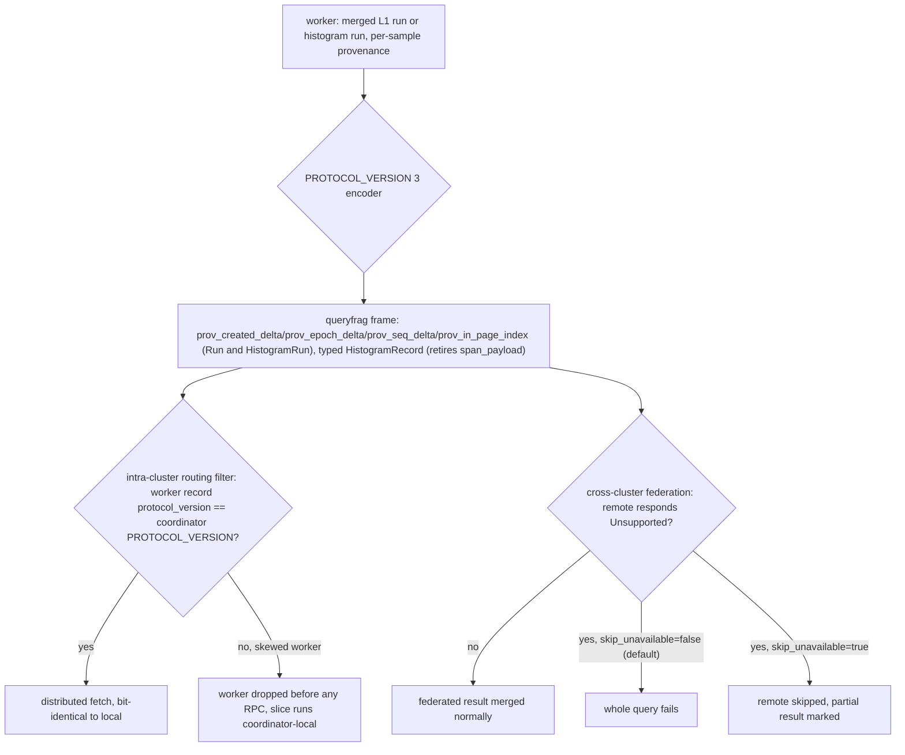

# ADR-0096: Query fan-out frame carries per-sample provenance and histograms

Status: Accepted

Amends: ADR-0071 (Distributed read fan-out and cross-cluster federation).

Migration class: N/A. `ravel.queryfrag.v1` is a transient RPC wire contract,
not a durable object format — none of ADR-0066 decision 4's classes (A-D)
apply, since there is no persisted object with a retention frontier or a
`maintain migrate` job to converge it. The applicable regime is instead the
pre-release single-supported-version rule (ADR-0027), the same shape
ADR-0092 decision 5 used for RSEG v7: `PROTOCOL_VERSION` moves 2 to 3 once,
at the end of a staged commit train, with no N/N-1 window. Convergence is
process upgrade, not object aging: every worker and coordinator eventually
runs the same binary, and a peer running the old version during rollout is
rejected outright rather than silently misread.

## Context

`ravel.queryfrag.v1` cannot express two shapes the storage layer now
produces, and both trace to the same fact.

### Gap 1: the distributed path cannot carry a run-merged series

Since #315 (ADR-0092), L1 compaction produces merged runs whose samples came
from different flushes, with dedup priority carried in a per-sample column
rather than the run-wide triple. `pb::Run` has no field for it, so a
distributed fetch that sent a merged run would drop the column and pick a
different winner at an overlapping timestamp than the identical local query
would. #315 refuses the merged shape at the service level and falls back to
local execution — correct, but it means distributed queries cannot serve
merged L1 data, which is now the normal shape of compacted metrics.

### Gap 2: histograms are not distributed at all

`crates/ravel-query/src/distrib/service.rs:355-364` returns
`pb::status::Code::Unsupported` for any histogram series and falls back to
local:

```rust
if any_histograms {
    return Ok(vec![summary_frame(&accounting.snapshot(), 0, 0,
        pb::status::Code::Unsupported,
        "histogram series are not distributed yet".to_string(), &stats)]);
}
```

`HistogramFrame` and the `hist` oneof member on `FetchResponse` already
exist in the proto. The coordinator-side merge exists and is tested:
`HistogramSortKey`, `histogram_is_greater`, and `merge_histogram_soa_runs`
(`crates/ravel-query/src/engine.rs:2364,2465,2624`) compare `sum` and
`zero_threshold` by bit pattern (`to_bits`), not float equality — the same
discipline this codebase already requires for dedup-sensitive comparisons.

**These are the same gap.** `HistogramRun` carries the run-wide provenance
triple only, exactly like `Run`, and `crates/ravel-maintain/src/build.rs`'s
`merge_histogram_runs` (~640-677) already merges histogram runs with
per-sample provenance at L1, the same as scalar runs. Enabling histograms
without the provenance columns does not silently corrupt results — the
correct fix, if the columns were skipped, is a #315-shaped refusal specific
to merged histogram runs, mirroring the guard the scalar path already has.
But that is precisely the problem: a histogram distribution feature that
refuses every merged L1 run (the normal shape of compacted metrics) ships a
capability that is correct and close to unusable in practice. "Recreates
gap 1" means recreates it as a refusal, the same engineering dead end #315
already produced for scalars, not a silent bit-identity violation — the
necessity here is that histograms are worth shipping at all, not that
skipping the columns is unsafe.

## Decision 1: four packed, delta-transformed `sint64` columns, optional per run

Added to both `Run` and `HistogramRun` — field 6 is genuinely unused on
both messages (`Run` uses 1-5; `HistogramRun` uses 1-5, with `span_payload`
at field 5, decision 2 below):

```protobuf
// Per-sample dedup key columns (ADR-0092 decision 1), parallel to ts_delta.
// All four present with length == ts_delta length, or all absent (run-wide
// provenance, the key's 4th element taken from array position).
// Delta-transformed exactly as ts_delta is: first entry a delta from the
// run-wide field, each later entry a delta from its predecessor.
repeated sint64 prov_created_delta = 6 [packed = true];
repeated sint64 prov_epoch_delta   = 7 [packed = true];
repeated sint64 prov_seq_delta     = 8 [packed = true];
repeated uint32 prov_in_page_index = 9 [packed = true];
```

A length disagreement across the four columns, or against `ts_delta`'s
length, is a typed `CodecError`, mirroring `RunLengthMismatch`
(`crates/ravel-query/src/distrib/codec.rs`, constructed at the length-check
site around line 317) and the merge's own `PrioritySampleCountMismatch`
(`crates/ravel-query/src/error.rs:55`). When the columns are present they
are the authoritative dedup key; the ADR text — and the proto comment above
— must be read as stating the run-wide provenance fields are not consulted
for dedup on such a run.

**Optional per run costs nothing.** Proto3 omits empty `repeated` fields
from the wire, so a run-wide run (the common case outside bulk backfill)
encodes byte-identical to today automatically. The only new code on that
path is the all-or-nothing length check.

**The arithmetic, which is what decided this.** The dominant cost in the
shape being replaced is not the run triple — it is `series_id` and the
label set, re-sent on every one of roughly 240 frames per series per hour
under strict mode's 2s flush.

| | per sample |
|---|---|
| fragmented today (~1 sample per run) | ~90-140 B |
| merged with the columns | ~17-21 B |

Merged frames are **4-6x smaller** than the frames they replace. Even raw,
un-delta'd `created_unix_ns` (~10 B/sample) keeps the direction. Break-even
on samples-per-source-run is roughly 12-17; strict mode's flush cadence
pins real scrape traffic near 1 sample per source run, so only bulk
backfill approaches the break-even point. Post-compaction, the live
alternative to sending these columns is not "send fragmented frames" — it
is the current refusal — so the wire cost only has to be non-pathological,
not minimal.

**Settled by measurement, not argument:** delta-from-predecessor vs.
delta-from-run-base for `prov_created_delta`, and real bytes per sample
across m=1 scrape, backfill m≫1, and overlapping-timestamp duplicates.
`crates/ravel-bench/tests/catalog_byte_gates.rs` gets a new wire gate over
`prost::Message::encoded_len`, reusing its existing generator and
split-printing pattern rather than inventing a new harness.

### Rejected

- **`ravel_codec::encode_i64` blobs in `bytes` fields.** Saves roughly 5-8
  B/sample in the m=1 regime — a real but modest 1.4-1.6x frame shrink. The
  price is making `ravel_codec::Enc` tag values load-bearing in a second
  frozen contract, so a codec change ripples into the wire with no version
  signal of its own; two encoding regimes coexist in one message; and the
  payload becomes opaque to `grpcurl`. If wire size later matters, enabling
  tonic channel compression on this internal lane recovers more without
  touching the contract, and is measurable independently of this decision.
- **Row-major `repeated PerSamplePriority`.** Adds 4-6 B/sample of
  per-message framing, loses columnar packing, and both endpoints already
  hold the columnar layout internally — row-major would cost a transpose on
  both sides for no benefit.
- **De-merge at the worker** (split a merged run back into per-triple runs
  before sending, no proto change, no version bump). Rejected on
  correctness, not size. A merged run is sorted by `(ts, dedup key)`, not by
  write order, and any range or erasure filtering the worker applies before
  sending shifts array positions further — so `in_page_index`, the
  provenance key's fourth element, cannot be reconstructed from a sample's
  position in a de-merged, filtered run; only the run's own recorded
  provenance columns carry it. Splitting without those columns therefore
  either fabricates a wrong `in_page_index` or drops it, and any snapshot
  where one write's triple becomes readable from two independently-fetched,
  independently-filtered units tie-breaks differently from a local query.
  That is exactly the bit-identity violation #315 refused. The appeal of
  avoiding a version bump is the trap: it would reintroduce the gap #315
  closed, on the distributed path specifically.

## Decision 2: retire `span_payload`, carry typed histogram records

`HistogramRun.span_payload`'s grammar was never defined (its proto comment
reads "Grammar deferred to a later ticket"). It should not be defined now;
the field should be retired instead.

This repo has met this decision twice already and resolved it the same way
both times. `LogRecordFrame` and `SpanFrame` each began as a deferred
opaque `bytes` payload and each was later replaced by a field-for-field
typed message, with the placeholder field number marked `reserved` and
never reused (`proto/ravel/queryfrag.proto:205-210` for `LogRecordFrame`,
`:273-277` for `SpanFrame`). This decision follows the same shape:
`reserved 5;` on `HistogramRun` retiring `span_payload`, plus a new
`repeated HistogramRecord records = 10` field (10, not reusing 6-9, which
decision 1 assigns to the provenance columns on this same message) mirroring
`ravel_segment::HistogramValue` field for field, every `f64` crossing the
wire as a `to_bits` `fixed64`, and `optional fixed64 sum_bits` so an absent
`sum` stays distinct from a present zero.

Two code facts support this beyond precedent, one of which needs a small
correction from the issue-body draft this ADR is based on:

1. **Verbatim pass-through is not mechanically available.** The worker
   holds decoded `HistogramValue`s, not raw `HIST_SPANS` bytes: the fetch
   call site is `crates/ravel-query/src/distrib/service.rs:318-320`, and
   `crates/ravel-query/src/fetcher.rs:242-255` defines
   `FetchedHistogramSeries { values: Vec<HistogramValue>, .. }` — already
   decoded by the time a distributed fetch would touch it. So the
   RSEG-grammar-on-the-wire option really means re-encoding already-decoded
   records, not forwarding bytes, and its CPU advantage evaporates: every
   option decodes once at the worker and once at the coordinator.
   `crates/ravel-query/src/erasure.rs:287-289`'s `retain_histogram_series`
   already exists to filter decoded histogram records by predicate — it
   operates on `HistogramValue`, not bytes, which is what makes per-sample
   erasure filtering possible on this path at all. **Correction:** this
   function is not yet called from the distributed histogram path (that
   path currently short-circuits to the `Unsupported` refusal before
   reaching erasure). Wiring it in is part of this epic's own
   implementation (decision 3, steps 3-4), not already-active behavior —
   stated as a fact about what exists today, not what runs today.
2. **Coupling would defeat ADR-0071's compatibility mechanism.** RSEG
   changes in place, pre-1.0, under ADR-0027 — v7 landed this month
   (ADR-0092). If the wire grammar were the RSEG record grammar directly,
   an RSEG histogram change would silently change the wire with no
   `PROTOCOL_VERSION` movement, and the skew would become invisible to the
   routing filter: an old coordinator would misdecode at query time
   instead of being dropped at routing time, the opposite of what a
   version field exists to prevent. The refusal to couple has to be
   structural, because "remember to bump the wire version when touching
   RSEG" is exactly the discipline a version field is meant to replace
   with an enforced check.

### Rejected

- **RSEG `HIST_SPANS` grammar on the wire**, verbatim or re-encoded.
  Verbatim is mechanically unavailable per fact 1 above; the re-encode
  variant keeps the CPU cost of decoding twice while chaining a frozen
  wire contract to a storage grammar that is actively changing, and would
  need `ravel-segment`'s record codec exported as public API outside the
  crate that owns it.
- **An independent opaque grammar in `bytes`.** The typed option with
  prost's own benefits (generated types, `grpcurl` visibility, no
  hand-written parser to fuzz) removed — a second hand-written wire format
  to maintain and fuzz, opaque to tooling, same CPU cost, same bytes to
  first order as the typed option.

Typed framing costs roughly 10-25% over RSEG's own on-disk record encoding,
on records tens to hundreds of bytes each. The byte gate (decision 1) can
measure this; it should not drive the contract decision, since the
structural argument in fact 2 holds regardless of the size delta.

## Decision 3: one `PROTOCOL_VERSION` bump (2 to 3), staged commits, encoders flip last

The provenance columns REQUIRE a version bump: prost silently discards
unknown fields, so a new worker sending fields 6-9 to an old coordinator
decodes as a run-wide-only run and picks the wrong dedup winner with no
error at all — silently wrong, not a rejected request. Histograms alone
could in principle ride the existing signal-gate pattern without a bump,
but shipping histogram distribution without the provenance columns leaves
only a refusal-shaped feature (Context, "these are the same gap") — so
histogram enablement is only worth doing together with the columns, and the
columns force the bump on correctness grounds independent of histograms.
One bump covers both by necessity: the columns need it for correctness, and
histograms need the columns to be worth shipping at all.

**Two separate bumps would double two real skew windows, not just double
the churn.** Intra-cluster, every skewed worker is dropped at routing time
before any RPC (`services/ravel-server/src/distrib.rs:1229`,
`.filter(|record| record.protocol_version == codec::PROTOCOL_VERSION)`),
and its slices simply run coordinator-local instead — correct, just less
parallel, the same shape #315's own refusal already established as
acceptable. **Cross-cluster federation has no worker-record filter at
all**: a skewed remote returns `Unsupported` for the whole request, which
`crates/ravel-query/src/distrib/federation.rs`'s `handle_unavailable`
(~391-427, ~448-472) treats as skippable only when `skip_unavailable` is
set, and the default is `false` — so an unset `skip_unavailable` fails the
entire cross-cluster query on one skewed remote. Remotes upgrade on
someone else's operational schedule, not this repo's release cadence, so
that federation window is the one that actually matters, and it is
proportional to how many separate bumps a rollout has to carry through.

Sequence, applying ADR-0092 decision 5's pattern (each step its own
reviewed commit with its own differential test, version moves once at the
end):

1. This ADR, amending ADR-0071, per the `format-change` skill.
2. Proto fields for the four provenance columns on both `Run` and
   `HistogramRun`, decode-side support, and codec round-trip and property
   tests. `HistogramRun`'s provenance columns are tested structurally at
   this step (length-matching against `ts_delta`, decode/encode
   round-trip) — `HistogramRun`'s value payload has nothing to attach them
   to yet, since `span_payload` is still the only value field and stays
   untouched until step 3 retires it. No wire behavior changes for either
   message: both refusals (merged-run, histogram) stay in place.
3. `HistogramRecord` messages and their decode side, plus wiring
   `retain_histogram_series` into the histogram fetch path so erasure
   filtering is real, not latent. Both refusals still stay in place.
4. Final commit: flip `PROTOCOL_VERSION` to 3, enable both encoders,
   remove both refusals, land the skew and bit-identity acceptance tests.

The encoders and the version flip land in the same commit as each other,
never split: an intermediate `main` that encodes the new columns while
still advertising version 2 reopens exactly the silent-drop hazard this
whole decision exists to close.

## Dual-reader question

None. This is the pre-release single-supported-version regime (ADR-0027),
not ADR-0066 decision 1's post-release N/N-1 window. There is no dual
decode path to build and no later deletion commit to schedule: a peer
speaking `PROTOCOL_VERSION` 2 after the flip is rejected outright by the
existing filters (routing-time drop intra-cluster, `Unsupported` refusal
federated), the same enforcement mechanism ADR-0071 already built and this
ADR reuses rather than replaces. Enforcement is doubly redundant, covering
both directions of a rolling upgrade: the coordinator-side routing filter
(`services/ravel-server/src/distrib.rs:1229`) drops a worker on the wrong
version before dispatching to it, and the worker itself independently
checks the incoming request's version (`distrib/service.rs:180`,
`check_protocol_version`, mapped to `Unsupported`) — so a new coordinator
talking to an old worker and an old coordinator talking to a new worker are
both caught, not just one direction. Landing the encoders and the version
flip in the same commit (decision 3) is what keeps this sound: no commit
ever exists where a binary encodes v3 fields while still advertising v2.

## Checksum coverage

Not applicable. `ravel.queryfrag.v1` frames are transient gRPC messages,
never written to object storage, so there is no persisted section or
checksum scope for this change to review — the format-change skill's
checksum-coverage step (step 4) is about durable formats specifically, and
this wire contract has no durable form to cover.

## Consequences

- A distributed query over run-merged L1 data becomes possible again,
  matching #315's fallback-to-local behavior in result but not in
  parallelism: the query now returns bit-identical results through the
  distributed path instead of always dropping to local execution.
- Histogram queries become distributable for the first time, on the same
  provenance mechanism scalars use, closing the "would recreate gap 1"
  hazard identified in Context before it ships.
- Every worker and coordinator must run `PROTOCOL_VERSION` 3 before the
  new capability is usable end to end; during rollout, the existing
  skew-handling machinery (routing filter, federation `Unsupported`
  refusal) keeps results correct at the cost of reduced parallelism on
  the skewed side, exactly as it does today for any other version skew.
- `crates/ravel-query/src/erasure.rs`'s `retain_histogram_series` goes from
  latent (exists, uncalled on this path) to load-bearing.
- `HistogramRun.span_payload` is retired; field 5 becomes `reserved` and is
  never reused, matching the `LogRecordFrame`/`SpanFrame` precedent.

## Diagram


