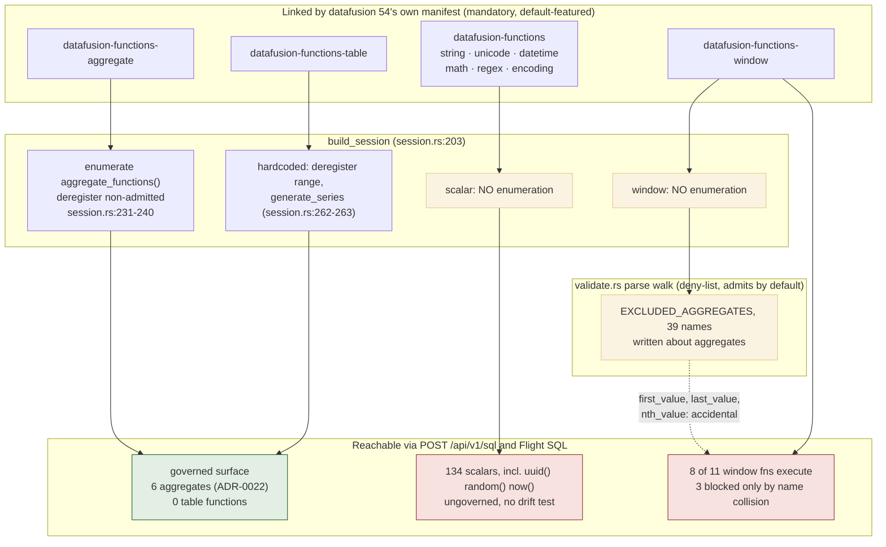

# ADR-0097: The SQL scalar and window function surface

Status: proposed

## Context

ADR-0022 decision 2 makes one promise about how the SQL function surface is
controlled:

> `build_session` becomes the hard boundary: it enumerates the registered
> UDAFs and deregisters every name not in the admitted set [...] so a
> DataFusion upgrade that registers new default aggregates fails closed.

That promise is kept for aggregates and for nothing else. This ADR is about
the two registries nobody enumerates.

Every measurement below was taken on `c55e8b61` through the production entry
point `SqlExecutor::execute`, which calls `validate(&req.sql)?` at
`crates/ravel-sql/src/executor.rs:436` before any planning. Two probes, both
in throwaway worktrees: a surface probe over a real published RLOG object for
the registry counts and the window-function reachability results, and a
semantics probe over a real RSEG segment with a controlled float pool for the
accumulator findings. Neither probe's code is committed; the tests decision 5
and the Consequences section call for are how these results become permanent.

### The live surface: 134 scalars, 11 window functions, 6 aggregates

A session built through `crate::session::build_session` registers:

```
scalar=134  window=11  aggregate=6
```

The six aggregates are exactly `avg count max mean min sum`. The
deregistration gate works, and it is the only thing that works.

The eleven window functions are `cume_dist dense_rank first_value lag
last_value lead nth_value ntile percent_rank rank row_number`.

The 134 scalars include the full string, unicode, datetime, math, regex, and
encoding packs: `lower`, `upper`, `substr`, `substring`, `concat`,
`starts_with`, `regexp_like`, `regexp_replace`, `date_trunc`, `date_part`,
`to_char`, `floor`, `round`, `abs`, `coalesce`, all present and all executing.
They also include `uuid`, `random`, `rand`, `now`, `current_timestamp`, and
`version`, which are nondeterministic or environment-reading.

### Why the manifest flag does not do what its comment says

`crates/ravel-sql/Cargo.toml:51` declares:

```toml
datafusion = { version = "54", default-features = false, features = ["sql"] }
```

and the comment above it (`Cargo.toml:43-50`) claims this yields "no
nested/regex/crypto expression packs".

The regex half is false, and the comment omits that string, unicode,
datetime, math, and encoding are on too. The cause is not feature unification
from elsewhere in this workspace, since `ravel-sql` is the only workspace
crate that names datafusion at all. It is datafusion 54.1.0's own manifest,
which declares `datafusion-functions`, `-aggregate`, `-table`, and `-window` as
**mandatory dependencies with no `default-features = false`**:

```toml
[dependencies.datafusion-functions]
version = "54.1.0"          # no default-features = false
```

`default-features = false` on the `datafusion` facade disables *the facade's*
default features. It has no power over a mandatory sub-crate dependency that
inherits its own defaults. Those defaults are exactly the six expression
packs. The flag never controlled this and never could.

Crypto genuinely is off (no `md5`/`sha256` in the live list). Nested is
linked: `libdatafusion_functions_nested` is compiled, arriving as a mandatory
dependency of `datafusion-sql`, which the facade's `sql` feature enables. The
facade's own `datafusion-functions-nested?/sql` weak reference activates
nothing, since a `?/` reference only forwards a feature to an optional
dependency that something else has already turned on. It is never registered
either way, because registration is gated on the `nested_expressions` feature
the flag does leave off. Zero array functions appear in the live 134.

The conformance record independently corroborates that the packs execute:
`DATE_TRUNC` (`docs/sql-conformance.md:112`), `REGEXP_REPLACE backreference`
(`:122`), and `date_part(minute)` (`:124`) are all `Supported and covered`,
which in that registry means executed against a fixture-derived expected
result by the conformance suite. (Note for precision: these three rows are
carried by `conformance.rs::supported_constructs_execute`, not by the
differential suite; they appear in neither `tests/differential.rs` nor
`tests/pipeline.rs`.)

### The gate covers one of three registries

`crates/ravel-sql/src/session.rs:231-240` enumerates `aggregate_functions()`
and deregisters every name outside `ADMITTED_AGGREGATES`. That is the only
production registry enumeration in the workspace (the drift test at
`session.rs:427-464` enumerates too, in test code). There is no
`scalar_functions()` call and no `window_functions()` call anywhere in
`crates/` or `services/`. A grep for `window_function`, `WindowUDF`, or
`over_clause` across
`crates/ravel-sql/src/` returns **zero files**; every `window` hit in
`executor.rs` and `session.rs` is the time-range `window` field or the
`repartition_windows` config knob. Nothing in this crate is window-aware.

Table functions get two hardcoded removals (`session.rs:262-263`, `range` and
`generate_series`) rather than an enumeration, so a DataFusion release adding
a third ships it straight into the surface.

### Window functions are live, and the one block that exists is accidental

Eight of the eleven registered window functions plan and execute end to end
over real data, through `SqlExecutor::execute`, with no gate at any stage:
`row_number`, `rank`, `dense_rank`, `lag`, `lead`, `ntile`, `cume_dist`,
`percent_rank`.

```
SELECT row_number() OVER (ORDER BY ts) AS rn FROM logs
   execute: OK  UInt64 [1, 2, 3]
SELECT lag(body) OVER (ORDER BY ts) AS prev FROM logs
   execute: OK  Utf8 [null, "PROBE record 0", "PROBE record 1"]
SELECT sum(severity_num) OVER (PARTITION BY severity_text) AS s FROM logs
   execute: OK  UInt64 [27, 27, 27]
```

The remaining three (`first_value`, `last_value`, `nth_value`) are refused,
but **only incidentally**: those three names happen to appear in
`validate.rs:91-131`'s `EXCLUDED_AGGREGATES`, a list written about aggregates.
The refusal is a name collision, not a window-aware decision.

That distinction is not academic. With `validate` bypassed, `first_value(body)
OVER (ORDER BY ts)` **planned and executed successfully** on a session built
by `build_session`, returning real rows. The session is not fail-closed for
window functions; `validate`'s parse-time name walk is the entire defense, and
it is a deny-list, so it admits by default.

There is one genuinely two-layer case, and it shows the mechanism that works:

```
SELECT stddev(severity_num) OVER (ORDER BY ts) FROM logs
   validate: Err(ExcludedAggregate { name: "stddev" })
   plan (validate bypassed): ERR Plan("Invalid function 'stddev'.")
```

`stddev` used as a window function resolves through the **aggregate**
registry, so the `build_session` deregistration catches it even without
`validate`. A native window UDWF resolves through `window_functions()`, which
nothing touches. Aggregate-shaped window usage therefore inherits ADR-0022's
*registry admission* for free. Whether it inherits ADR-0022's and ADR-0023's
*semantics* is a separate question, and the answer turns out to be more
interesting than either yes or no.

### Aggregate semantics are selected by window frame shape

Ravel replaces DataFusion's min/max and avg with custom UDAFs to get
deterministic, total-order behavior (ADR-0023 for min/max, ADR-0022 decision 4
for avg). A moving window frame does not use them.

`crates/ravel-sql/src/minmax.rs:195-196`:

```rust
fn create_sliding_accumulator(&self, args: AccumulatorArgs) -> DFResult<Box<dyn Accumulator>> {
    self.inner.create_sliding_accumulator(args)
}
```

Unconditional delegation to the wrapped built-in, with no float guard, in
contrast to `accumulator` at `minmax.rs:163-173`, which carries one.
DataFusion routes an aggregate-over-window through the sliding accumulator
whenever the frame start is not UNBOUNDED PRECEDING, so
`min(value) OVER (ORDER BY ts ROWS BETWEEN 2 PRECEDING AND CURRENT ROW)`
runs upstream code and `min(value) OVER (ORDER BY ts)` runs Ravel's.

Instrumenting both constructors and running through `SqlExecutor::execute`
over a real RSEG segment confirms the split directly:

```
min(value) OVER (ORDER BY ts)                          RAVEL TotalOrderAccumulator extreme=Min
min(value) OVER (... ROWS BETWEEN 2 PRECEDING ...)     BUILTIN  (Ravel's never constructed)
avg(value) OVER (... ROWS BETWEEN 2 PRECEDING ...)     RAVEL SequentialAvgAccumulator, then error
```

**The results agree anyway, and for a structural reason.** Over a pool of
`NaN` carrying payload `0x7ff80000deadbeef`, `+0.0` ordered before `-0.0`,
triple `+Inf`, triple `-Inf`, and ordinary finite values, all fifteen moving
frames for both `min` and `max` match an ADR-0023 total-order reference
computed over each frame's own rows, bit for bit. Retracting across a `NaN`
does not poison the deque; `-0.0` still beats `+0.0` after `+0.0` is
retracted; the `NaN` payload survives. The reason is
`datafusion-common/src/scalar/mod.rs:635-645`: `ScalarValue`'s `PartialOrd`
uses `f64::total_cmp` for float types, and `MovingMin`/`MovingMax` are generic
over `PartialOrd`. Upstream's sliding path is total-order by construction,
which is the order ADR-0023 mandates.

`avg` fails closed rather than diverging. Its absence of
`create_sliding_accumulator` is not an oversight: DataFusion's trait default
(`datafusion-expr/src/udaf.rs:626-631`) routes to `accumulator()`, so Ravel's
`SequentialAvgAccumulator` is constructed, and DataFusion then refuses it
because `supports_retract_batch()` defaults to false:

```
This feature is not implemented: Aggregate can not be used as a sliding
accumulator because `retract_batch` is not implemented: avg(samples.value)
```

So there is no live wrong answer here. What there is instead is an
**unpinned dependency on an upstream implementation choice**. Float safety on
the sliding path rests entirely on `ScalarValue` ordering by `total_cmp`, a
decision made in another repository, and nothing in this one tests it. If
upstream changed that comparator, ADR-0023's guarantee would break silently
in the one code path no test covers: `ROWS BETWEEN`, `RANGE BETWEEN`, and
`GROUPS BETWEEN` appear nowhere in this repository, and neither does any
window function at all.

### The conformance score does not cover this surface

`docs/sql-conformance.md` contains **no window-function row of any kind**:
none supported, none intentionally rejected. Its score reads 24 supported and
covered, 55 intentionally rejected, 0 unclassified, 79/79, 100.0%, explicitly
scoped at `:19` "over the surface Ravel actually claims". Eight executable
window functions sit outside that denominator. The registry's three states
have no cell for "linked, registered, executing, and never considered".

### A second session construction omits two invariants

`crates/ravel-sql/src/executor.rs:861-880` (`pushed_down_name_filter`) is
production code (the file's `#[cfg(test)]` modules begin at 1656), called
from `resolve()` at line 813 for the Metrics signal. `resolve()` is, by its
own comment, the one snapshot funnel both the HTTP path (`execute`/`run`) and
the Flight SQL path (`resolve_snapshot`) pass through, so this bare session is
reachable from both surfaces. It builds a bare
`SessionContext::new()`, so it skips the aggregate deregistration loop
entirely (the full default aggregate set is registered there) **and** carries
the default `RuntimeEnv`, hence the default `ObjectStoreRegistry` rather than
the `EmptyObjectStoreRegistry` that ADR-0013's security invariant 1 relies on.

Its sibling throwaway-session site, `analyzed_classification_plan` (circa
`executor.rs:944`), constructs correctly via `build_session`. Two throwaway
sessions, two different constructions.

The wider surface there is currently **inert**: the function calls
`create_logical_plan` and nothing else, with no optimizer, no physical
planning, and no `collect`, over an empty snapshot, discarding the session,
with every error path collapsing to `None`. Logical planning issues no I/O,
so the missing registry has nothing to act on. It is reached only after
`validate`, so any string it plans was already permitted. The inertness
argument holds today and evaporates the moment the function is extended past
`create_logical_plan`.

### Three documentation statements are stale or self-contradictory

1. `Cargo.toml:43-50`, as established above.
2. ADR-0033's amendment at `0033:220`: "the dependency surface did not grow."
   The *registration* did not, since the hand-written `ExprPlanner` in
   `map_field_planner.rs` still does that work, but the *dependency* did:
   `datafusion-functions-nested` is compiled in.
3. `validate.rs:78-79` names a four-name admitted set against the
   six-element `ADMITTED_AGGREGATES` at `session.rs:136` and the six-name
   error text at `validate.rs:169-174`. `session.rs:127` carries the mirror
   error, saying `avg`/`mean` "stay excluded here" directly above the
   constant that includes them.

None of these is a behavior bug. All three cause a reader to reason about the
surface from a false model, which is how this gap survived.

## Decision

1. **Correct the manifest comment; do not pretend the flag is a control.**
   A mandatory, default-featured sub-crate dependency cannot be subtracted
   from a downstream edge. The `Cargo.toml:43-50` comment is rewritten to
   state what actually resolves and why, so the next reader stops reasoning
   from a false model. The enforcement mechanism is decision 3, not the
   manifest.

2. **Extend the fail-closed boundary to every registry.** `build_session`
   enumerates `scalar_functions()` and `window_functions()` the way it
   already enumerates `aggregate_functions()`, and deregisters everything
   outside an explicit admitted list per registry. The two hardcoded
   `deregister_udtf` calls are replaced by the same enumeration over table
   functions.

   The scalar enumeration runs against the upstream defaults, **before**
   per-table UDF registration (`session.rs:269-282`). Ravel's own per-table
   UDFs are part of the admitted set for their table: `label` and
   `label_match` for Metrics, `has_word` for Logs, none for Spans. This
   matters because the observed count of 134 is a Logs session; the admitted
   list is one upstream set plus a per-table addendum, not three unrelated
   lists.

3. **Extend the drift test correspondingly.** The mechanism at
   `session.rs:427-464` is generalized: for each registry, admitted plus
   excluded must exactly cover what a session registers. A DataFusion upgrade
   that adds any function then breaks a test naming it, and admitting it
   becomes a decision rather than a default. The test covers all three
   `SessionTable` variants, so a per-table UDF that stops being registered,
   or starts being registered for the wrong table, also fails it.

4. **Admitted scalar set: keep what works.** The registered scalar functions
   stay admitted. They are pure per-row transforms; ADR-0022's
   sequential-accumulation concern does not apply to them, and removing
   working, differentially-tested capability serves nothing. The allowlist's
   purpose is to stop the surface growing without a decision, not to shrink
   it.

   Two carve-outs are decided here rather than deferred. The
   nondeterministic and environment-reading scalars (`uuid`, `random`,
   `rand`, `now`, `current_timestamp`, `current_date`, `current_time`,
   `version`) are **excluded**. `uuid()` executes today and returns a
   different answer for identical input, which is incompatible with a
   differential conformance gate that compares against an independent
   reference executor, and `version()` reports the DataFusion build to any
   caller. Query-time wall-clock is available through the request's own time
   range; a nondeterministic scalar inside a query has no legitimate use here
   and defeats the oracle the rest of the surface is verified with.

5. **Aggregate-shaped OVER stays admitted, and the upstream assumption it
   rests on gets pinned by a test.** The measurement changed this decision.
   An earlier draft excluded aggregate-shaped `OVER` on the theory that the
   sliding path silently produced different float semantics. It does not.
   Moving-frame `min`/`max` runs upstream's accumulator rather than Ravel's,
   but returns bit-identical results, because `ScalarValue`'s ordering is
   `f64::total_cmp`, the same total order ADR-0023 mandates. Moving-frame
   `avg` fails closed with a typed error. Excluding a capability that is
   both working and correct would be a real cost for no correctness gain.

   What is missing is not a guard but a test. ADR-0023's guarantee currently
   holds on the sliding path by virtue of an implementation choice in another
   repository, unpinned by anything here, in a code path no test in this
   workspace enters. So:

   - A differential case pins moving-frame `min`/`max` against the
     total-order reference over the adversarial value pool ADR-0022
     decision 1 names (NaN with a non-default payload, `+0.0` ordered before
     `-0.0`, all-infinite frames), asserting bit equality including retract
     transitions across a `NaN` and across `+0.0`. If a DataFusion upgrade
     ever changes that comparator, this test is what catches it.
   - Moving-frame `avg`'s typed refusal becomes a recorded
     `Intentionally rejected` conformance row, so it is a decision with
     evidence rather than an accident of a trait default that a future
     `supports_retract_batch` override could silently reverse.
   - `minmax.rs:195-196` gains a comment stating why unconditional
     delegation is safe for float input and naming the upstream property it
     depends on. The float guard on `accumulator` right above it makes a
     reader expect one here; the reason there is none should not have to be
     rediscovered by probe.

   This ADR does not admit `sum` over a moving frame as a new decision: `sum`
   has no custom UDAF by deliberate choice (`avg.rs:24-26`) and is admitted
   under ADR-0022 as it stands, windowed or not.

6. **Native window functions are admitted per function.** `row_number`,
   `rank`, `dense_rank`,
   `ntile`, `lag`, and `lead` compute positions and offsets, carry no
   floating-point accumulation, and are deterministic under the existing
   single-partition rule; they are admitted. `cume_dist` and `percent_rank`
   return `Float64` from one correctly rounded IEEE division of two exact
   integer counts. The quotient need not be exactly representable (`cume_dist`
   over three rows is 1/3), but a single correctly rounded division is
   deterministic, order-independent given a fixed frame, and bit-for-bit
   reproducible against any conforming reference. That is the same property
   ADR-0022 decision 4 used to admit `avg`, and they are admitted on it,
   subject to a differential case confirming it. `first_value`,
   `last_value`, and `nth_value` are today refused by name collision with an
   aggregate deny-list; that refusal becomes explicit and window-aware rather
   than accidental, and whether they are readmitted is a conformance-row
   decision, not an ADR one.

   The point is that after this decision the answer for each of the eleven is
   recorded and enforced by enumeration, instead of resting on whether a name
   happens to appear in a list written about something else.

7. **The second session construction is unified.** `pushed_down_name_filter`
   routes through `build_session`, as `analyzed_classification_plan` already
   does. The inertness argument is real but it is an argument, and this
   codebase treats `EmptyObjectStoreRegistry` and the aggregate
   deregistration as invariants everywhere else. One construction path is
   cheaper to keep correct than two plus a written justification for the
   divergence.

8. **The claimed surface becomes auditable, at bounded cost.** Scalar and
   window functions enter `conformance.rs` following the ADR-0090 decision 8
   precedent: a row plus a genuine differential-oracle case, re-derived from
   the fixture's input records. This is deliberately **not** one row per
   registered scalar function, because 134 rows would mostly test upstream
   DataFusion rather than Ravel. The bound is: one row per admitted family
   (string, unicode, datetime, math, regex, encoding), plus every function
   this repository already names as claimed or relied upon, plus each of the
   eleven window functions, plus each excluded nondeterministic scalar as an
   `Intentionally rejected` row. Functions inside an admitted family with no
   row are covered by the family row and the drift test: admitted, not
   individually attested.

   Mechanical consequence for the implementer:
   `conformance.rs:633-658` (`registry_reads_the_live_allowlist_sets`)
   asserts rejected-row count equals `EXCLUDED_AGGREGATES.len()` and
   supported-row count equals `ADMITTED_AGGREGATES.len()`. Adding per-registry
   allowlists requires reshaping that assertion into per-registry counts and
   regenerating `docs/sql-conformance.md`, whose freshness gate
   (`tests/conformance.rs::generate_and_check_conformance_doc`) fails
   otherwise.

9. **Newly excluded functions get typed errors, not opaque plan failures.**
   An excluded aggregate today produces `ValidationError::ExcludedAggregate`
   before planning, naming the admitted set (`validate.rs:169-174`). A
   function excluded only by deregistration surfaces instead as a generic
   `MSG_PLAN` plan error. `validate`'s name walk is therefore extended to the
   newly excluded scalar and window names, so the caller experience matches
   the aggregate precedent rather than degrading for the new exclusions. The
   walk remains a message layer over the allowlist, exactly as rejected
   alternative C describes: the allowlist is what fails closed, the walk is
   what explains why. This also gives decision 8's `Intentionally rejected`
   rows a concrete Evidence value, the typed-error test, rather than leaving
   the implementer to invent one.

10. **The three stale statements are corrected**, each in the commit that
   touches the code it describes.



The decision turns both red boxes green by making `GS` and `GW` real
enumerations, and demotes the dotted deny-list edge from a load-bearing
control to a source of error messages.

## Rejected alternatives

**A. Leave it; the surface works and nothing is broken today.**
Rejected on the evidence. It is not only a future-upgrade risk: `uuid()` is
executable inside a query today on a system whose conformance gate compares
against an independent reference executor, and eight window functions execute
entirely outside the surface the project reports 100% conformance over. Even
setting those aside, ADR-0022 decision 2 legislated exactly against
"an upgrade silently widens the surface", and it currently holds for one
registry of three.

**B. Genuinely strip the packs, making the manifest comment true.**
Rejected twice over. It would remove working, differentially-tested
capability the conformance registry already claims and ADR-0090 decision 8
deliberately added rows for. And it is not achievable by the stated means:
`datafusion-functions` is a mandatory dependency of the `datafusion` facade
with its own defaults, so no flag on this crate's edge removes it. Making a
stale comment true by deleting features would be fixing the wrong artifact.

**C. Extend the `validate.rs` deny-list to scalar and window functions.**
Rejected because a deny-list cannot fail closed. It admits by default, so a
new upstream function is admitted by default, which is the property being
fixed. The probe demonstrates the failure mode concretely: `first_value` is
blocked only because its name happens to be in a list written about
aggregates, and with `validate` bypassed the session executes it. The
deny-list stays where it is, as a source of good typed errors naming the
admitted set (`validate.rs:169-174`) before planning, but it is a message
layer over the allowlist, not the control.

**D. Reject any query containing window syntax outright.**
Rejected as both too broad and too narrow: too broad because the rank and
offset families are deterministic and legitimately useful, too narrow because
it addresses one spelling of one registry and does nothing about 134
ungoverned scalars or a future upstream addition.

**E. Pin exact sub-crate versions and treat the resolved graph as the spec.**
Rejected because it makes every upgrade a manual audit of a transitive graph
and still produces no signal when the graph changes. The drift test gives
that signal at the level that matters, which is what a constructed session
registers rather than what is compiled into the binary.

**F. Exclude aggregate-shaped OVER for v1, on the grounds that the sliding
path bypasses Ravel's accumulators.** This was the draft position and the
measurement killed it. The bypass is real for `min`/`max`, but the results
are bit-identical to the total order because upstream's comparator is
`f64::total_cmp`, and `avg` over a moving frame fails closed with a typed
error rather than diverging. Excluding it would have removed working,
correct behavior to fix a defect that does not exist. Recorded here because
the reasoning was sound and only the facts were missing: the general lesson
is that "custom UDAF exists" does not tell you which accumulator a given
query shape actually constructs, and only instrumentation does.

**G. Write a total-order sliding accumulator now, rather than a test.**
Rejected as solving a problem that is not currently failing. Upstream's
sliding path already satisfies ADR-0023's order requirement; replacing it
would mean owning a deque algorithm and its retract logic for no behavior
change. The test in decision 5 costs far less and catches the only scenario
that would make the replacement necessary.

**H. Fix only the window-function gap, since that is the sharpest finding.**
Rejected because the scalar registry has the same structural defect and the
same one-line fix once the enumeration exists. Splitting them means writing
the mechanism twice and leaving `uuid()` reachable in the interim.

## Consequences

- A DataFusion upgrade that adds a function to any registry fails a test that
  names it. Upgrades get slightly more work and stop being able to change the
  surface by accident.
- **Reachability, not registry state, is the acceptance evidence.** What this
  ADR delivers is the absence of a capability, and a unit test over
  `build_session` proves only that a constant matches a map. The acceptance
  test follows `crates/ravel-sql/tests/security.rs:426-446`
  (`table_functions_are_not_reachable`, which asserts `range` and
  `generate_series` yield `SqlError::Plan`): at least one non-admitted scalar
  (`uuid()`) and one non-admitted window function must be shown unreachable
  through `SqlExecutor::execute`, the path a real caller takes, and not merely
  absent from a registry in a unit test. The probe that produced this ADR's
  evidence is the template; it should land as a permanent test rather than
  being thrown away.
- Aggregate-shaped `OVER` keeps working, and acquires the test that makes its
  correctness this repository's property instead of an upstream coincidence.
  The moving-frame path currently has zero coverage; after this it has the
  adversarial pool ADR-0022 decision 1 requires.
- `uuid()`, `random()`, `now()`, `version()`, and the other excluded scalars
  (`rand`, `current_timestamp`, `current_date`, `current_time`) stop being
  callable inside a query. This is a surface reduction that could in principle
  break a caller, though nothing in this repository uses them and no
  conformance row claims them.
- The admitted scalar surface is written down for the first time. Today no
  artifact states what it is: `docs/sql-conformance.md` enumerates aggregates
  exhaustively and scalars in three incidental rows.
- Window functions gain a recorded position, and the conformance denominator
  starts covering a surface that ships.
- One session-construction path instead of two, removing a site that silently
  omits ADR-0013's security invariant 1.
- Nothing about tenancy, durability, the commit protocol, or any persistent
  format is touched. No format version bump is required.
- ADR-0022's decision 2 wording ("it enumerates the registered UDAFs") is
  narrower than what this implements. ADR-0022 is not superseded; this ADR
  extends its mechanism to the registries it did not name, and its decision 1
  admission rule continues to govern the aggregate path unchanged.
