# ADR-0098: Share one label set per series run

Status: proposed

## Context

Two independent measurements agree that the metrics ingest path is bound by
memory movement rather than by compression, hashing, or I/O.

The allocation benchmark added for issue #367
(`crates/ravel-otlp/benches/normalize_alloc.rs`) counts allocations per
datapoint through `normalize_metrics`. With the memo hitting, each added
resource label costs about two allocations on **every** point: 13.16, 23.27
and 43.50 allocations per datapoint across 0, 5 and 15 resource labels at 5
attributes and 100 points per metric. Resource labels are constant for the
whole resource, yet they are cloned per point.

The CPU flamegraph recorded in `docs/ingest.md` puts point and buffer memory
traffic at about 56% of on-CPU samples in the write path, ahead of the router
conversion loop at about 16% and the series-id hash map at about 15%. Label
byte-slice comparison appears as a separate visible cost that grows with
shared-label cardinality.

The reason both measurements point the same way is visible in
`crates/ravel-ingest/src/shard.rs`. `TenantBuf::merge` runs a collision
pre-pass that compares each incoming point's labels against the claimed set
for that series id:

```rust
Some((labels, _)) if *labels != point.labels => { /* SeriesIdCollision */ }
```

and then, in the insertion pass, keeps the labels only for a series it has
not seen before:

```rust
Entry::Occupied(mut occ) => { occ.get_mut().values.try_push(point.value); }
Entry::Vacant(vac) => { vac.insert(SeriesAccum { labels: point.labels, .. }) }
```

So for a series carrying 100 points in one batch, 100 `LabelSet`s are
constructed, 99 are compared field by field and then dropped, and one is
retained. The comparison is itself O(L) string comparisons per point. The
allocation and the comparison are both pure waste on the 99, and the realistic
OTLP shape is exactly this: one series sampled over time, many points with
identical attributes, emitted consecutively. `SeriesIdMemo` already exploits
that shape and measured a 99.0% hit rate on grouped input.

`SeriesIdMemo` does not remove the waste, and cannot as currently designed. It
memoises the *output* `SeriesId`, keyed on a constructed `LabelSet`, so the
label set must be built before the memo can decide whether it is a repeat.
Issue #392 recorded the measured consequence: a memo hit saves no allocation,
because `SeriesId::compute` hashes through a thread-local scratch buffer and
allocates nothing once warm, while a memo miss costs a full `LabelSet` deep
clone on top. On interleaved series the memo measured net-negative, 46.05
against 23.27 allocations per point.

The name-sanitisation change for #367 removed one allocation per clean
attribute name by moving the caller's existing `String` into the `Label`
(33.36 to 18.36 allocations per datapoint at 15 attributes). That closes the
per-attribute-name cost. It does not touch the per-point cost of the label
values, the `Vec<Label>` itself, or the resource-label clone, because those
are rebuilt per point regardless of where their bytes come from.

### What is frozen here and what is not

ADR-0005 freezes the *canonical encoding* that determines series identity:

```text
"ravel-series-v1\0"
u16_le(len(tenant)) tenant
u16_le(len(name)) name
u16_le(label_count)
per label sorted by name: u16_le(len(k)) k u16_le(len(v)) v
```

`SeriesId::compute` serialises label bytes into that layout and hashes it. The
frozen artifact is the byte sequence, not the Rust type that holds it. A
change to how labels are stored in memory is therefore not a frozen-format
change, provided the bytes fed to `compute` and their order are unchanged.
This ADR exists partly to state that distinction explicitly, because it is the
kind of thing that otherwise gets decided by whoever reviews the pull request.

`LabelSet`'s own invariant, sorted by name with unique names enforced at
construction, is relied on by every holder and is unchanged by this decision.

## Decision

1. **`NormalizedPoint` and `IngestPoint` carry `Arc<LabelSet>` rather than
   `LabelSet`.** The points of one series run then share a single allocation
   instead of each owning a copy.

2. **`SeriesIdMemo` is keyed on the normalizer's input, not on a constructed
   `LabelSet`,** and caches the built `Arc<LabelSet>` alongside the
   `SeriesId`. A hit is decided by comparing the incoming attribute slice
   against the previous point's, which is a borrowed comparison that allocates
   nothing, and yields an `Arc` clone rather than a rebuild. A miss builds one
   `LabelSet`, wraps it, and stores it. The resource-label prefix is part of
   what the cached set already contains, so the per-point resource clone
   disappears with it.

3. **`TenantBuf::merge`'s collision pre-pass gains an `Arc::ptr_eq` fast
   path** before its structural comparison. Two points that share the cached
   set compare in one pointer comparison. The structural comparison remains as
   the fallback for genuinely distinct `Arc`s, so the collision check keeps
   exactly the strength it has today.

4. **`ravel-types` is not modified.** `Label` keeps `String` fields and
   `LabelSet` keeps `Vec<Label>`. The sharing is at the label-set level, in
   the crates that produce and consume points.

5. **No behaviour changes.** The bytes fed to `SeriesId::compute`, their
   order, the sorted-unique `LabelSet` invariant, the collision error, and
   every query result stay identical. This decision is about how many times
   the same label set is built, not about what it contains.

6. **The acceptance evidence is the existing benchmark.** Allocations per
   datapoint at 100 points per metric must fall by approximately `2L` for the
   points after the first in each run, where `L` is resource labels plus point
   attributes, and the all-miss (interleaved) shape must not regress. A change
   that improves the grouped shape by regressing the churny one is not
   accepted.

```mermaid
flowchart TD
  subgraph now["today: per point"]
    A1["dp.attributes"] --> B1["build LabelSet<br/>2L allocations"]
    B1 --> C1["SeriesIdMemo<br/>compare built set"]
    C1 --> D1["NormalizedPoint<br/>owns LabelSet"]
    D1 --> E1["merge: structural compare<br/>O(L) string compares"]
    E1 --> F1{"series seen?"}
    F1 -->|"yes, 99 of 100"| G1["drop the LabelSet"]
    F1 -->|"no, 1 of 100"| H1["keep in SeriesAccum"]
  end

  subgraph next["with this decision"]
    A2["dp.attributes"] --> C2["memo: compare<br/>input attributes<br/>0 allocations"]
    C2 -->|hit| I2["clone Arc<br/>1 refcount bump"]
    C2 -->|miss| B2["build LabelSet once<br/>wrap in Arc"]
    I2 --> D2["NormalizedPoint<br/>shares Arc&lt;LabelSet&gt;"]
    B2 --> D2
    D2 --> E2["merge: Arc::ptr_eq<br/>then structural fallback"]
    E2 --> H2["one LabelSet per series run"]
  end
```



## Rejected alternatives

**A. Change `Label`'s `String` fields to `Arc<str>`.** This was the shape the
#367 measurement write-up implied, and it is the obvious reading of "hoist the
resource-label clone". It turns each label clone into two refcount bumps, so
it removes the 2R resource-label cost per point. It loses on three counts.
It edits `ravel-types`, the crate holding canonical series identity, for a
performance reason, which is a worse place to spend a frozen-adjacent change
than the producing crates. It still constructs a fresh `Vec<Label>` per point
and still runs the O(L) structural comparison in `merge`, so it addresses the
allocation count while leaving the rebuild and the compare in place. And it
touches roughly 197 `Label { .. }` construction sites across 112 files, nearly
all of them tests, which is a large mechanical diff carrying real review cost
for a smaller win than decision 1 delivers.

**B. Keep `LabelSet` per point but build it into a reused scratch buffer.**
Truncating a shared `Vec` to the resource-label prefix and pushing per-point
attributes would avoid regrowing the vector. It cannot work: the label set
outlives the point. `NormalizedPoint` carries it into `IngestPoint` and into
`SeriesAccum`, and the flush path moves it into `SeriesInputV3`. A buffer
reused across points would be aliased by every point that borrowed it.

**C. Make the memo cache the `Arc` but keep keying on a constructed
`LabelSet`.** This is the smallest change that shares the allocation, and it
is half a fix. The set must still be constructed on every point in order to
compare it against the cached one, so the 2L allocations remain and only the
retained copy is saved. The measured memo behaviour in #392 is exactly this
shape: a hit that saves nothing because the work happens before the memo is
consulted.

**D. Drop `SeriesIdMemo` entirely.** Defensible on today's numbers. #367
measured it net-negative on interleaved series, 46.05 against 23.27
allocations per point, because a miss deep-clones the label set to store it
and a hit saves no allocation. But removing it forecloses decision 2, which
turns the same structure into the mechanism that eliminates the rebuild. The
memo is not wrong in principle; it is keyed on the wrong thing.

**E. Share the label set only for the resource-label prefix.** A two-part
representation, shared prefix plus per-point suffix, would avoid the resource
clone without sharing the whole set. It complicates `LabelSet`'s sorted-unique
invariant, since the merged view has to be sorted across two segments, and it
delivers less than decision 1 because the per-point attributes are still
rebuilt for every point of a run that has identical attributes. The common
case this targets has an identical suffix too.

**F. Do nothing and accept the cost.** The measurements are from a
single-board host whose memory bandwidth is far below a server's, so the ~56%
memory-traffic share is the figure most likely to shrink on production
hardware. Rejected because the allocation counts do not depend on the host:
99 label sets built and dropped per 100-point series is a property of the code,
and the benchmark that measures it is host-independent.

## Consequences

The per-point cost of a series run falls to one `Arc` clone plus the point's
own value. The first point of each run pays what every point pays today.

`Arc<LabelSet>` makes the label set immutable through the ingest path. Any
future code needing to modify a point's labels in place must clone, via
`Arc::make_mut` or an explicit copy. Nothing does so today: the normalizer
builds the set and every consumer reads it or moves it.

The flush path takes `accum.labels` by value into `SeriesInputV3`. With
sharing, that becomes an unwrap of the `Arc` when the accumulator holds the
last reference and a clone otherwise. On the realistic path the accumulator
does hold the last reference by flush time, because the points that shared it
have been consumed into the accumulator's value list, so the common case is a
move rather than a copy.

`NormalizedPoint` is a public type. Changing its `labels` field type is a
breaking change for anything constructing or reading one, which is
`ravel-otap`, `ravel-bench`, `ravel-sim`, `ravel-ingest`, and a number of
tests. That is a bounded set, roughly a dozen construction sites, unlike
alternative A's 197.

The collision pre-pass keeps its full strength. `Arc::ptr_eq` is only a fast
path; two distinct sets still compare structurally, so a genuine series-id
collision is detected exactly as it is now. A test must pin that: two points
with the same `series_id` and different label sets, not sharing an `Arc`, must
still produce `SeriesIdCollision`.

The interleaved shape gains less than the grouped shape, and may gain nothing:
a one-entry memo keyed on input attributes still misses on every point when
consecutive points differ. Decision 6 requires only that it not regress. A
larger memo is a separate question and is not decided here.
