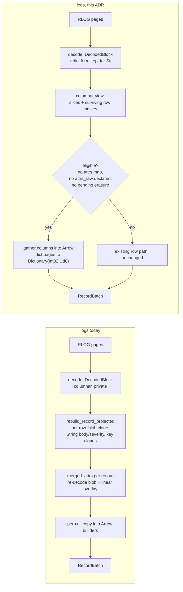
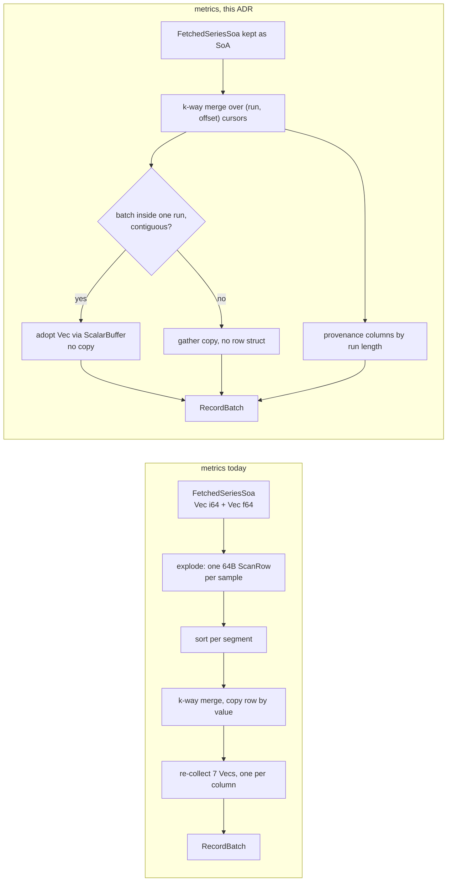

# ADR-0099: columnar decode-to-Arrow path for SQL scans

Status: Accepted

## Context

Both SQL scans decode columnar data, rebuild it as rows, and then rebuild
columns again for Arrow. The row form in the middle is pure loss.

**Logs.** `read_block_columns` (`crates/ravel-logseg/src/block.rs:535`)
produces a `DecodedBlock` holding one `Vec<Option<T>>` per column
(`block.rs:396-438`). Nothing outside `ravel-logseg` ever sees it: the type is
`pub` but is not re-exported from `lib.rs`, no public API returns one, and
every `*_col()` call site in the workspace is inside `reader.rs`.
`BlockScan::next_block` (`reader.rs:608-657`) converts each surviving row to a
`LogRecord` through `rebuild_record_projected` (`reader.rs:821-881`), which
clones the STREAM_DIR resource+scope blob per record, allocates owned
`String`s for `severity_text` and `body`, and clones a `String` key per present
attribute per row.

`build_batch` (`crates/ravel-sql/src/logs_scan.rs:807-927`) then calls
`merged_attrs` once per record (`crates/ravel-sql/src/rlog_attrs.rs:40-50`):
a fresh varint decode of the same stream blob for every record that shares a
`stream_ref`, plus a linear `iter_mut().find()` overlay per attribute key, with
another clone of every key and value. Only after that does each value get
copied into an Arrow builder. A string cell crosses four allocations between
the zstd frame and the operator, and a declared typed column
(`declared_column_array`, `logs_scan.rs:942-993`) reaches its array through a
per-row `find_attr` over that merged vector.

**Dictionary pages.** `dict_is_worth_it`
(`crates/ravel-codec/src/encoding.rs:444`) picks `Enc::Dict` whenever at most
half the values are distinct, so low-cardinality string columns are stored as
a dictionary plus bit-packed ids. The decoder throws that structure away
immediately: the `Enc::Dict` arm of `decode_strings` (`encoding.rs:525-546`)
materializes the dictionary, decodes the ids, then returns
`ids.map(|id| dict[id].clone())` — one heap allocation per row, with the
distinct set dropped at the end of the arm. `DecodedBlock` records no `Enc`
either, so by the time a caller holds one, a dict page and a plain page are
indistinguishable. A column with 1k distinct values across millions of rows is
fully materialized per row and then re-hashed by every downstream group-by. The
codebase already proves Arrow dictionaries work here: the metrics `labels`
column is `Dictionary(Int32, Map(Utf8,Utf8))`
(`crates/ravel-sql/src/schema.rs:57-60`, built at
`crates/ravel-sql/src/labels.rs:23-39`), and the JSON renderer already handles
dictionary columns (`crates/ravel-sql/src/output.rs:157`).

**Metrics.** `FetchedSeriesSoa` (`crates/ravel-query/src/fetcher.rs:221-233`)
is handed out as `timestamps: Vec<i64>` / `values: Vec<f64>` moved straight out
of the decoder — its own doc comment says "ready for zero-copy Arrow buffer
adoption in `ravel-sql`". `ravel-sql` ignores that: `prepare_partition`
(`crates/ravel-sql/src/scan.rs:411-434`) explodes the two vectors into one
7-field `ScanRow` per sample (`scan.rs:119-142`, ~64 bytes), stamping run-wide
provenance onto every row; the rows are sorted per segment (`scan.rs:446`),
k-way merged by value (`scan.rs:487-501`), and `build_batch`
(`scan.rs:576-626`) rebuilds the SoA it destroyed with seven
`rows.iter().map(...).collect()` passes, one per column.

Three constraints on that path are load-bearing and easy to break silently:

- The emitted stream is ordered by the full 6-tuple `(series_id, ts,
  created_unix_ns, writer_epoch, writer_seq, in_page_index)`, declared to the
  optimizer in `RsegScanExec::compute_properties` (`scan.rs:228-253`) and
  required above by `SortPreservingMergeExec` (`provider.rs:196-209`) and
  `RsegDedupExec::input_ordering` (`dedup.rs:58-67`), where a comment records
  that dropping the declaration once let the optimizer strip the merge and
  silently execute one partition.
- `build_batch` itself depends on that order: the labels dictionary loop
  (`scan.rs:590-608`) keeps one entry per series by run-length detecting
  series boundaries, which is only correct while a series' rows are contiguous.
- `size_of::<ScanRow>()` is the unit of the fetch/decode memory reservation
  (`scan.rs:439-442`), deliberately disjoint from the per-batch Arrow charge
  (module doc, `scan.rs:29-50`) and asserted by
  `crates/ravel-sql/tests/scan_budgets.rs:498`.

**Where filtering happens.** On the logs path the row form is not only a
materialization, it is where correctness filters run: content predicates are
evaluated per row inside `RlogReader` before a `LogRecord` is built, and
erasure filtering runs record-level in the fetcher plus `retain_unerased` at
the scan (`logs_scan.rs:748`, ADR-0064). Anything that builds arrays straight
from `DecodedBlock` bypasses both, and the failure mode of getting erasure
wrong is an erased record served to a client, not a slow query.

**Arrow version split.** `ravel-sql` does not compile against the workspace
`arrow = "59"`; it uses `datafusion = "54"`, which carries arrow 58, and every
import goes through `datafusion::arrow` (`crates/ravel-sql/Cargo.toml:39-62`
records the split). Buffer-level code added to `ravel-sql` must use
`datafusion::arrow::buffer`, and no arrow type may cross into `ravel-logseg`.

**Measurement.** The repo has an allocation-counting pattern
(`stats_alloc` + a `Region` around one untimed run,
`crates/ravel-otap/benches/decode.rs:24-25,66-86`) but no bench gate: no
workflow runs `cargo bench`, `bench-s3.yml` is explicitly non-blocking, and
`--all-targets` clippy only proves benches still compile. `ravel-sql` has no
`benches/` directory at all.

## Decision

Seven parts. The first three are the logs fast path, then the dictionary
end-to-end, then the metrics scan, then measurement.

### 1. A columnar block view out of `ravel-logseg`

`BlockScan` gains a second exit, next to `next_block`, that hands out what it
already decoded instead of rows: a borrowed view over the block, the stream and
field directories, and the surviving row indices after the block's content
predicate has been evaluated.

The view exposes **accessors, never the storage type**: per-column, per-row
readers and gather iterators over the surviving indices, plus the resolved
column ids for declared keys. `DecodedBlock` stays an implementation detail and
is not re-exported. This is what lets decision 4 change how string columns are
stored (dictionary form instead of one `Vec<u8>` per row) without touching a
single caller: a view that handed out `&[Option<Vec<u8>>]` would either block
that change or force it to materialize exactly the allocations this ADR
deletes, and would couple two otherwise independent pieces of work into one
serialized chain.

`next_block` keeps its exact signature and behaviour, implemented over the same
primitive, so `scan`, `scan_pruned`, and the ranged reader used by
`ravel-maintain` compaction stay byte-identical — the same constraint ADR-0087
placed on `read_block`'s signature change.

No Arrow types enter `ravel-logseg`. The view is slices and indices;
`ravel-sql` owns every Arrow decision.

`ravel-query`'s `LogSegmentScan` (`crates/ravel-query/src/log_fetcher.rs:209`)
gains the matching pass-through and keeps its row API unchanged.

### 2. Direct Arrow construction, behind an explicit eligibility rule

`LogsScanExec` builds arrays straight from the view's column slices, gathering
through the surviving row indices, with no `LogRecord` and no `merged_attrs`.
Declared typed columns resolve to their FIELD_DIR column id once per block
rather than through a per-row `find_attr`.

The fast path is taken only when **all** of the following hold; otherwise the
existing row path runs unchanged:

- the projection touches only fixed columns and declared typed columns — the
  `attrs` map column (`LOG_COL_ATTRS`) makes a query ineligible, because the
  merged map needs the stream-blob overlay the fast path exists to avoid;
- the block carries no `attrs_raw` overflow column — a declared key that
  spilled to `attrs_raw` is only visible after canonical-attr decode, which
  the fast path does not do;
- no pending erasure predicate applies to the query.

The `attrs_raw` clause is decided from page descriptors, not from decoded
data: a block whose records all fit their FIELD_DIR columns has no `attrs_raw`
page at all (`absent_column_occupies_no_page`,
`crates/ravel-logseg/src/block.rs:927`), so eligibility is a metadata read.
Decoding `attrs_raw` to check whether it is empty would pay exactly the cost
the rule avoids.

The erasure clause is the one that fails closed on purpose: erasure is a rare
tenant state, and columnar erasure evaluation is a separate change that must
not ride along with a performance rewrite. A test asserts the fallback fires
with a pending erasure predicate active.

Memory accounting follows ADR-0087 unchanged in contract and changes in unit:
the fast path holds a decoded block and the batch under construction rather
than a `Vec<LogRecord>`, so `hold_block` charges the block's decoded bytes
instead of `records_memory` over row structs. The reservation still tracks
what is concurrently held, and `crates/ravel-sql/tests/memory_accounting.rs`
is updated in the same commit.

### 3. The chosen path is observable

`LogsScanExec` publishes `columnar_batches` and `rowpath_batches` partition
metrics, alongside the existing `pages_decoded`/`pages_skipped` from ADR-0087,
so `EXPLAIN ANALYZE` shows which path ran and a test can assert eligibility
rather than infer it from output that is identical by construction.

### 4. Dictionary pages survive decode

`ravel-codec` gains a non-fusing string decode entry point returning either
`Plain(Vec<Vec<u8>>)` or `Dict { dict: Vec<Vec<u8>>, ids: Vec<u32> }`.
`decode_strings` stays, as a thin wrapper that fuses, so every existing caller
is untouched. `DecodedBlock` keeps the dict form for string columns, and row
rebuilding materializes from it exactly as before, byte-identical.

The columnar view of decision 1 gains the matching accessor in the same
change: for a string column, the distinct values plus the ids of the surviving
rows, presence-aware (page ids are per present row, before the presence
scatter). Without it the view's per-cell readers are the only way in, and
`ravel-sql` would have to rebuild a dictionary row by row — the cost this
decision exists to remove — or reach past the view at `DecodedBlock`, which
decision 1 forbids.

This is a decode-API addition, not a format change: `Enc` tags, page layout,
and the bytes on disk are unchanged, and `docs/log-segment-format.md` needs no
edit.

### 5. Declared `Str` columns are `Dictionary(Int32, Utf8)` end to end

DataFusion validates every batch against one schema, so the type cannot vary
per block. `logs_schema_with_declared`
(`crates/ravel-sql/src/logs_schema.rs:109-115`) therefore types every declared
`Str` column as `Dictionary(Int32, Utf8)` unconditionally. A dict-encoded page
becomes the dictionary and its ids with no per-row allocation; a plain page
becomes a degenerate identity dictionary (values as-is, keys `0..n`), which
costs no hashing and no dedup pass and leaves that case exactly as expensive
as it is today.

Because the schema is one schema for both paths, the **row path builds
dictionary arrays too**: `declared_column_array`
(`crates/ravel-sql/src/logs_scan.rs:942-993`) switches its `Str` arm to a
`StringDictionaryBuilder<Int32Type>`. Changing only the fast path would make
every fallback batch — an erasure-pending query, an `attrs` projection — fail
DataFusion's schema validation at runtime.

Dictionary ids decode as `u64` (`decode_dict_ids`,
`crates/ravel-codec/src/encoding.rs:419`) and Arrow keys are `i32`, so each
column pays one checked id-vector conversion. It is a conversion, not a
reinterpretation: `unsafe` is denied workspace-wide and a transmute here would
be wrong on width as well as forbidden.

The nine fixed columns keep their types. `severity_text` is the obvious next
candidate and is deliberately deferred: it is not opt-in the way ADR-0090's
declared columns are, so changing its Arrow type breaks every existing client
at once for a win this ADR does not need to claim.

On egress, the public Flight statement path
(`crates/ravel-sql/src/flight/stream.rs:201`) sets
`DictionaryHandling::Resend`, matching what the internal worker path already
does (`stream.rs:322-323`). Without it the encoder hydrates dictionaries back
to plain values on the wire and the win stops at the operator boundary. The
Flight SQL metadata path (`flight/service.rs:215`) is unchanged: one small
metadata batch, no dictionary columns.

### 6. The metrics scan merges columnar

`ScanRow` is deleted. Per-run SoA is kept as fetched; the k-way merge yields
`(run, offset)` cursors and gathers straight into column buffers. Where a
batch's rows come from a single run in contiguous ascending order — the common
case when a series is covered by one non-overlapping run — `ts` and `value`
adopt that run's `Vec<i64>`/`Vec<f64>` through `ScalarBuffer` with no copy.
Otherwise the gather copies values, still without ever building the 64-byte row
struct. The three run-constant provenance columns are built by run length, not
per row.

Emitted order is unchanged, so the declared 6-tuple `LexOrdering`, the
`SortPreservingMergeExec` above it, `RsegDedupExec`, and the labels
one-entry-per-series contiguity all keep holding for the same reason they do
today.

The decode reservation switches from `rows * size_of::<ScanRow>()` to the SoA
bytes actually held (timestamps, values, and per-sample priorities when
present). That is the same live-bytes contract, measured on the buffers that
now exist; `scan_budgets.rs`'s 64-bytes-per-row assumption is restated in the
same commit.

### 7. The win is a number, and a test that fails when it regresses

Each implementation task ships, in the crate it changes:

- a criterion throughput bench at its boundary, following the existing
  `logseg_scan.rs` / `otap decode.rs` shape (`ravel-sql` gets its first
  `benches/` directory), reporting before and after; and
- an allocation-count assertion using `stats_alloc`, as a `#[test]` in an
  integration test file **containing exactly that one test**, so the process
  running it has no other thread allocating into the global allocator's
  `Region`. A multi-test binary would make the count non-deterministic under
  `cargo test`'s thread pool; a one-test binary is deterministic under both
  `cargo test` and nextest.

The assertion is an upper bound on allocations per 8192-row batch, not an
equality, so an unrelated small change does not fail it but a return to
per-row allocation does. No CI bench job is created; there is none to extend.

## Rejected alternatives

- **Keep the row form, just make it cheaper** (cache the stream-blob decode
  per `stream_ref`, intern attribute keys). Rejected: it removes one of the
  four copies and leaves the per-row struct, the per-key clones, and the
  builder copy in place. More importantly, neither the dictionary win nor
  buffer adoption is reachable from a row form at all, so this buys a fraction
  of the win and forecloses the rest.
- **Return Arrow arrays directly from `ravel-logseg`.** Rejected: it puts an
  arrow dependency — and a choice between arrow 58 (via DataFusion) and the
  workspace's arrow 59 — into the storage crate and into compaction's
  dependency graph. The arrow-free boundary is deliberate and recorded in
  `Cargo.toml`; slices and row indices cross it just as well.
- **`Utf8View` instead of `Dictionary(Int32, Utf8)`.** Rejected: no in-repo
  precedent, uneven kernel support in the arrow 58 that DataFusion 54 pins,
  and no Flight `DictionaryHandling` analogue for view types, whereas
  dictionary columns are already proven end to end by the metrics `labels`
  column, the JSON renderer, and the internal worker Flight path.
- **Give the fast path columnar erasure evaluation so it covers every
  query.** Rejected for this ADR: erasure decides whether an erased record
  reaches a client. Getting it wrong is a data-protection failure, not a
  performance regression, and it is the exact defect class this repo has
  already shipped once. The eligibility rule fails closed and the fast path
  can be widened later against a proven baseline.
- **Also rebuild the merged `attrs` map columnar, so eligibility is
  unconditional.** Rejected: the map needs stream-blob decode plus
  record-wins-on-collision overlay semantics, which is a separate design, and
  a query selecting the whole attribute map is not the CPU-bound aggregation
  shape this epic targets.
- **Unsafe reinterpretation of `Vec<Option<u64>>` f64 bits as an arrow
  `Buffer`.** Rejected twice over: `unsafe` is denied workspace-wide, and
  `Option<u64>` has no layout relationship to a packed `f64` buffer, so the
  cast would be wrong even if it were permitted. Only the metrics path, whose
  SoA is already `Vec<f64>`, adopts buffers without copying.
- **Change `severity_text` (and `body`) to dictionary columns too.**
  Rejected here: `body` is high-cardinality and would lose; `severity_text`
  would win but is a fixed column, so its type change breaks every client at
  once rather than only tenants who opted into a declared column. Deferred to
  a follow-up that can be argued on its own.
- **Add a CI benchmark-regression gate.** Rejected as out of scope: nothing
  in CI runs `cargo bench` today, `bench-s3.yml` is explicitly non-blocking,
  and building baseline storage and comparison is its own decision. The
  single-test allocation-count binary is a real gate that needs no new
  infrastructure.

## Consequences

- **New public surface** in `ravel-logseg` (the columnar view, `DecodedBlock`
  re-exported) and `ravel-query` (`LogSegmentScan` pass-through). Row APIs are
  unchanged and `ravel-maintain` compaction, `scan`, `scan_pruned`, and the
  ranged reader must produce byte-identical output; their existing
  differential tests run unmodified as the proof.
- **Client-visible schema change:** a declared `Str` column arrives as
  `Dictionary(Int32, Utf8)` instead of `Utf8`, and the public Flight statement
  path now resends dictionaries rather than hydrating them. HTTP JSON output
  is unchanged — `output.rs` already renders dictionary columns. Declared
  columns are an opt-in per-tenant feature (ADR-0090), so no tenant sees this
  without having declared a column. `docs/query-engine.md` (the ADR-0090
  section) and `docs/guides/query.md` record the type.
- **Two new scan metrics** appear in `EXPLAIN ANALYZE` output for the logs
  scan.
- **The metrics decode reservation changes unit** from `ScanRow` count to SoA
  bytes held. The pool contract from ADR-0087/0088 — concurrently-held scan
  memory, not cumulative output — is unchanged; `scan_budgets.rs` and the
  `scan.rs` module doc are updated in the same commit.
- **The logs scan reservation changes unit too**, from row-form
  `records_memory` to held decoded-block bytes on the fast path;
  `memory_accounting.rs` pins that charge and is updated with it.
- **Two implementations of logs batch construction now exist.** The
  differential proptest (`crates/ravel-sql/tests/logs_differential.rs:956`)
  must run over both paths, and the eligibility rule must be asserted
  directly through the new metrics, or the two drift apart silently.
- **No frozen format is touched.** RLOG and RSEG bytes, `Enc` tags, the proto
  schemas, canonical series identity, commit tokens, and the object key layout
  are all unchanged. This is a read-path and API change only.
- **Still deferred:** `f64` declared columns (ADR-0090, gated on fold-order),
  dictionary types for fixed string columns, columnar erasure evaluation, and
  the spans scan (`crates/ravel-sql/src/spans_scan.rs`), which has the same
  row-rebuild shape and is left for a follow-up rather than widened into this
  epic.

  The spans scan is no longer deferred: ADR-0110 delivered it, following this
  ADR's decisions 1 to 3 for RSPAN. Columnar erasure evaluation is still open,
  and is what forces ADR-0110's eligibility rule to fail closed to the row path
  whenever an erasure predicate is pending.
