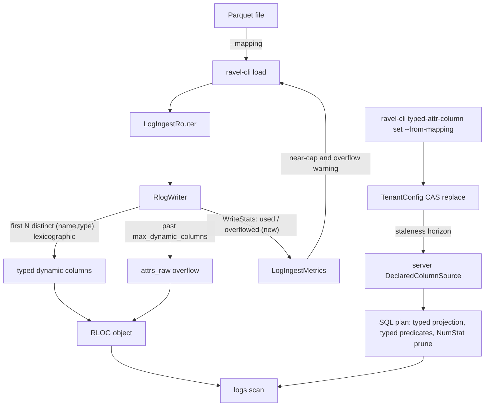
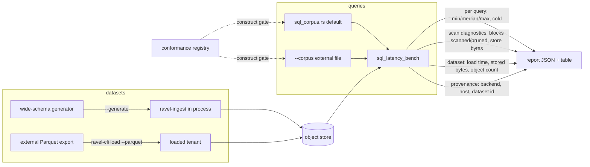

# ADR-0100: wide-schema load validation and SQL query latency measurement

Status: Accepted

## Context

Nothing in the tree loads a wide dataset (order 100+ distinct attribute
names) through the real ingest path and then queries it through SQL. The
exercised shapes are narrow test fixtures. Two independent mechanisms decide
whether such a dataset gets treatment the SQL layer can accelerate, and a
bulk load through `services/ravel-cli/src/load.rs` touches neither:

1. **The RLOG dynamic-column budget.** `RlogConfig::max_dynamic_columns`
   (default 1000, `crates/ravel-logseg/src/writer.rs:37,58`) assigns a real
   typed column to the first N distinct `(name, type)` pairs of an object,
   ordered lexicographically by name bytes then type byte
   (`writer.rs:251-257`, cap enforced at `writer.rs:304-312`) — not by arrival
   order. Eligible stream-level keys (indexed, or numeric for NumStat) draw
   from the same budget (`writer.rs:284-297`). Anything past the cap folds
   into the `attrs_raw` overflow column with no signal to the caller:
   `WriteStats` (`writer.rs:96-114`) counts POSTINGS caps and carries no
   dynamic-column counter, so an operator whose load crossed the budget
   cannot tell.
2. **The SQL declared-column set.** `DeclaredColumnSource`
   (`crates/ravel-sql/src/declared.rs:91-96`) is what typed projection,
   typed predicates, and NumStat pruning target (ADR-0090, ADR-0093,
   ADR-0095). It is resolved per tenant server-side
   (`services/ravel-server/src/declared_columns.rs`) behind a staleness
   horizon, and it is empty by default. A durable writer exists
   (`ravel-cli typed-attr-column set`, ADR-0090 decision 1) but it is a
   separate subcommand with its own column-spec syntax: nothing derives it
   from a load's `--mapping`, which carries exactly the same key/type
   information in a different syntax.

So a 100+ attribute load produces an object silently capped at the storage
layer and untyped at the SQL layer.

Separately, no harness reports SQL query latency.
`crates/ravel-bench/src/query_latency.rs` is PromQL-only;
`flight_sql_egress` runs real `SqlExecutor` queries but measures
result-egress encoding for one query. ADR-0099's columnar work names
query-latency gains as its acceptance evidence and has no instrument.

The concrete workload this has to hold, and which no existing harness can
express, is ClickBench: its `hits` table is a flat 105-column, ~100M-row
Parquet export, its suite is 43 fixed analytical statements, and its
reporting convention is the minimum, median, and maximum of three
consecutive runs per query, published alongside the time the load took and
the bytes the loaded data occupies. Every part of that shape constrains a
decision below: the row count rules out generating the dataset in process,
the column count means about a hundred declared columns in one declaration
rather than a handful, the query suite is maintained upstream and is not
ours to vendor into the tree, and the three-run min/median/max plus
load-time and stored-size figures are not what any current bin reports.

ClickBench is used here as an external dataset and query suite, the way the
`parquet_baseline` bin already uses Parquet as an external comparison point:
it is a fixed, public, wide-table analytical workload that exercises the SQL
surface far past any fixture in the tree. Its `hits` schema is also a useful
forcing function on decision 2: it is all integers, strings, and date/time
columns, so declaring it exercises the derivation at full width and settles
what a time column costs when it is declared as `i64`.

Relevant facts this decision leans on:

- A declared column's values are built from the **merged** resource + scope +
  record attribute view (`crates/ravel-sql/src/rlog_attrs.rs:34-53`,
  consumed by `logs_scan.rs::declared_column_array`), so a stream-level key
  is declarable, not only a per-record one.
- `DeclaredType` has four variants — `Str`, `I64`, `Bool`, `Bytes`
  (`declared.rs:40-50`) — while the loader's `ColType` has five: it also has
  `F64` (`load.rs:88-94`). The mapping vocabulary is strictly larger.
- `LogIngestRouter::metrics()` (`crates/ravel-ingest/src/log_router.rs:188`)
  already exposes the cumulative write metrics to whoever constructed the
  router, which is how the loader can read a per-load signal without a new
  return path.
- `services/ravel-cli` already dev-depends on `ravel-sql`, `ravel-query`, and
  `ravel-server` with its `sql` feature, and already carries a
  through-the-server reachability test
  (`tests/typed_attr_column_reachability_e2e.rs`, ADR-0090).

## Decision

### 1. `WriteStats` reports the dynamic-column budget, and the loader warns

`WriteStats` gains two counters, shaped like the ADR-0049 POSTINGS counters
(aggregate-only, no per-field label, so an ADR-0044 allowlisted `/metrics`
renderer can carry them):

- `dynamic_columns_used: u32` — distinct `(name, type)` pairs that received a
  real column in this object.
- `dynamic_columns_overflowed: u32` — distinct `(name, type)` pairs that
  found the budget full and fell to `attrs_raw`.

`ravel-ingest`'s `LogIngestMetrics` folds both into cumulative totals plus a
per-object maximum of `dynamic_columns_used`, so an operator sees pressure
before the cap, not only after it. The loader reads `router.metrics()` after
the load finishes and prints one stderr warning when any object overflowed,
and a distinct near-cap warning at >= 90% of `max_dynamic_columns`. This is
a counter addition to an existing struct, not a format change: no RLOG byte
changes, so no version bump.

The budget behavior itself is asserted, not changed: lexicographic-by-name
selection, clean fold into `attrs_raw`, and no dropped or corrupted value at
and past the cap, over a wide fixture that spans the cap.

For a 105-column dataset the cap is not the binding constraint — 105 sits
far under 1000. These counters are what turns "the load was not silently
truncated" from an assumption into a checkable claim, and they are what
catches the case where a per-object attribute set is wider than the schema
suggests (per-record keys the mapping never named, or stream-level keys
drawing from the same budget).

### 2. Declared-column derivation is a control-plane command, not a load side effect

`ravel-cli typed-attr-column set` gains `--from-mapping <mapping.toml>`: it
derives the declared-column list from a `--mapping` document and writes it
through the existing CAS whole-list replace path, unchanged. The loader
never touches tenant config.

The target is about a hundred declared columns written by one invocation, not
a handful: that is the count a wide analytical schema produces, and both the
derivation and the server's resolve path are expected to hold it.

One time column is already typed and costs nothing to exploit: a
`--mapping` requires `ts_column`, so a dataset's primary event-time column
becomes the record's native `ts`. Range predicates over it need no declared
column and no `DeclaredType` extension — only a corpus rewrite pointing that
column's references at `ts`. For ClickBench that is `EventTime`, which
carries a large share of the suite's time filtering.

A *secondary* time column — `EventDate`, `ClientEventTime`,
`LocalEventTime` in ClickBench's schema — is declared as `i64` and gets the
full typed treatment: the same NumStat pruning, the same typed comparison
and pushdown, and exact-typed status for ADR-0094's parallel final
aggregation. `DeclaredType` has no date or time variant, so what such a
column does not get is ergonomic: a `DATE` or `TIMESTAMP` literal comparing
directly rather than against an epoch integer, and `date_trunc`/`extract`
applying without manual arithmetic. Corpus statements filtering on a
secondary time column therefore compare against integers and carry the
modified-query flag decision 3 requires. #432 records the ergonomic gap
with the analysis.

One gap is real rather than ergonomic: `DeclaredType` has no `F64`, and
declaring a float key as `i64` yields NULL for every row (a declared type
describes how a value is read, and the variants do not match), so a float
attribute cannot be declared at all and every predicate over it pays a
per-row string cast with no operator opt-out. ADR-0101 closes that; #431
tracks it. Neither gap blocks this epic's measurements, and this ADR does
not extend `DeclaredType` itself: that is a frozen-contract change to
`TypedAttrColumnType` with its own rollout rule, and folding it in here
would couple the measurement work to a format change.

Derivation rules:

- Both `[[attribute]]` and `[[resource_attribute]]` entries are derived.
  Declared columns read the merged attribute view, so a stream-level key
  projects correctly; what it does not get is NumStat pruning unless the
  writer gave that key a column (indexed or numeric, `writer.rs:284-297`).
  That asymmetry is documented, not silently accepted.
- `ColType::{Str, I64, Bool, Bytes}` map to the same-named `DeclaredType`.
  `ColType::F64` has no `DeclaredType` counterpart: those entries are
  **skipped with a per-key warning on stderr**, and the command still writes
  the rest. Failing the whole command on an `f64` column would make the flag
  useless for realistic mappings; silently dropping it would misreport what
  was declared.
- Duplicate keys across the two lists, or a key repeated with two types,
  are an error: the durable list is order-significant and one key must
  resolve to one type.

The two-step operator flow (load, then declare) is documented in
`docs/guides/ingest.md` and `docs/guides/query.md`, including the
server-side staleness horizon: a freshly written declaration is not
instantly visible to queries.

### 3. The analytical query corpus lives in `ravel-bench`

A checked-in, versioned corpus of workload-shaped SQL queries against the
logs table (filtered aggregates, string search, `GROUP BY`,
`ORDER BY` + `LIMIT`) lives in `crates/ravel-bench/src/sql_corpus.rs`. Each
entry carries an id, the SQL text, the constructs it exercises, and an
optional expected row count. A test cross-checks every named construct
against `ravel_sql::conformance::registry()`, so the corpus seeds from the
supported-construct list rather than re-enumerating it, and a corpus entry
naming an unsupported construct fails the gate.

ClickBench's statements are written against a table named `hits` with bare
column identifiers. Ravel exposes one `logs` table whose declared typed
attribute columns are named by the attribute key verbatim (ADR-0090
decision 1), so running that suite means rewriting each statement's table
and column references. That rewrite is a documented, reviewable artifact
living in the corpus file, not an undisclosed adaptation: the corpus format
carries the upstream query id beside our text, so any statement can be
diffed against its original. Any rewrite that changes what a query
*computes*, rather than only how it names things, is a modified query and
must be labelled as one in the corpus entry.

The harness also accepts `--corpus <path>`: an external file in the same
format, run instead of the checked-in set. This is how ClickBench's 43
queries are run — upstream maintains them on its own schedule, so pinning a
copy into a Rust module would guarantee drift, while a corpus file next to
the dataset it targets does not. An external corpus is validated for parse
and supported-construct membership before the first query runs: it is not
exempt from the gate, only from being checked in. A ClickBench query naming
a construct the registry does not support therefore fails loudly with the
construct named, which is the signal that says which capability to build
next rather than leaving a silent gap.

It is deliberately **not** in `ravel-sql` beside the conformance registry:
the corpus is workload data whose only consumer is the benchmark harness,
and the registry proves per-construct correctness verdicts over small
fixtures, a different job (the epic's own text draws that line). The cost
is that a query covering a new SQL capability lands one crate away from that
capability; the registry cross-check test is what keeps the two from
drifting apart silently.

### 4. `sql_latency_bench`: a cold/warm per-query harness

A new `ravel-bench` bin, `sql_latency_bench`, parallel to
`query_latency_bench`, gated behind a feature that activates the existing
optional `ravel-sql` dependency entry (no second entry, so no second
`datafusion`/`arrow` activation). It:

- takes its dataset from one of two sources. `--generate` builds a
  wide-schema dataset in process through `ravel-ingest`, the same way
  `flight_sql_egress` publishes its dataset: cheap, deterministic, and the
  lane the smoke test runs. `--tenant <id>` instead runs against a tenant
  already loaded in the configured object store, which is how a ~100M-row
  ClickBench `hits` load is measured — that data arrives through the real
  `ravel-cli load --parquet` path, so the queried bytes are the bytes the
  shipping loader wrote. In-process generation alone cannot reach that row
  count, and a harness that only ever queries its own generated data proves
  nothing about the loader;
- installs declared columns with `StaticDeclaredColumns` in the generated
  lane, sidestepping the server cache's staleness horizon. Against a loaded
  tenant it resolves the tenant's real durable declaration, since that is
  the configuration under measurement;
- runs each corpus entry `--runs N` times (default 3) and reports the
  minimum, median, and maximum, with the first run flagged as cold. Cold is
  per query, against a fresh `Catalog` + `SqlExecutor` per corpus entry: a
  corpus-level cold pass would let query N warm query N+1 through the
  shared catalog and object-store caches and report one cold number for the
  whole corpus, which is not what a per-query latency table means;
- reports per query: min/median/max ms, cold ms, rows returned, plus the
  scan diagnostics the executor already computes — `SqlStats`'s `segments`,
  `blocks_total`, `blocks_scanned`, `blocks_pruned_by_postings`
  (`crates/ravel-sql/src/executor.rs:178-197`) and `QueryAccounting`'s
  object-store request/byte and cache counters. A stopwatch says a query is
  slow; these say *where* it went, which is what makes this harness an
  instrument for ADR-0099, #331, #278, and #361 rather than a scoreboard.
  Both surfaces exist today, so this is wiring, not new accounting;
- reports the dataset as loaded: wall-time, stored bytes, **and object
  count**. Object count is not decoration. `load.rs` flushes one Strict
  batch per `DEFAULT_BATCH_ROWS = 10_000` rows (`load.rs:56`), so ~100M rows
  is on the order of 10,000 flushes, each producing an RLOG object per
  involved shard. Per-object cost (LIST, footer read, per-object decode
  setup) is then paid thousands of times per query and can dominate
  everything the columnar and pushdown work saves. A layout figure that is
  not reported is a variable that cannot be ruled out;
- records run provenance in the report JSON: object-store backend (local
  filesystem, MinIO, S3), host shape, and dataset identity. The same corpus
  against local files and against S3 differs by an order of magnitude, so a
  latency table without its backend named will mislead the first person who
  compares two runs.

Two levers follow from the object-count point. `ravel-cli load` gains
`--batch-rows` (the internal `load` function already takes `batch_rows`;
only the CLI hard-codes the constant at `load.rs:202`), so load-time layout
is a measurable variable rather than a fixed one. And the `--tenant` lane
states which layout it measured: a freshly loaded tenant, or one after the
maintenance machinery has compacted it. Both are legitimate measurements and
the delta between them is itself a finding, so the report labels which one it
is rather than leaving it ambiguous.

Where #361's group-by scaling benchmark lands first, this harness drives it
rather than building a second one.

Competitive latency on this workload does not come from this ADR. It comes
from ADR-0099's columnar decode, typed predicate and limit pushdown
(#331, #278), multi-core execution and spill behavior (#361), and the
post-load object layout this harness now measures. What this ADR delivers is
the only thing that can tell those apart.

### 5. Reachability through the shipping surfaces

The epic's end-to-end acceptance test is a `services/ravel-cli` integration
test that loads a wide Parquet fixture through the real `load::run`, derives
and writes the declaration through the real `typed-attr-column set`
`--from-mapping` path, and then queries the loaded data through
`ravel-server`'s `POST /api/v1/sql` handler and its `build_sql_state`
wiring — the pattern `tests/typed_attr_column_reachability_e2e.rs` already
establishes. It asserts a typed predicate over a declared column returns the
loaded rows, and that an attribute that overflowed the dynamic-column budget
is still queryable through `attrs`.

## Diagrams

Load path and the two independent mechanisms:

Measurement path:

## Rejected alternatives

- **The loader pushes the declaration itself** (a `load --declare` flag).
  It puts a CAS whole-list replace, with the read-modify-write window
  `typed_attr_column.rs` documents, inside a data-plane command whose other
  writes are append-only, and it can clobber columns an operator declared by
  hand. Keeping the control-plane write in the control-plane subcommand
  costs one extra operator step and removes that class entirely.
- **Corpus in `ravel-sql` beside the conformance registry.** Loses on
  ownership, not on taste: the corpus's only consumer is a `ravel-bench`
  bin, and a corpus module in `ravel-sql` would serialize this epic behind
  every other in-flight change to that crate for no measurement benefit.
- **Raise `max_dynamic_columns`.** The budget is not the defect; the silence
  is. A higher cap changes object layout economics for every tenant and
  still gives no signal at the new cap.
- **Extend `query_latency_bench` with a `--sql` mode.** Its config and
  report are PromQL-shaped (instant and range windows, matched series).
  A SQL mode would fork that report schema and make both harder to read.
- **A corpus-level cold pass** (one fresh `Catalog` for the whole corpus).
  Cheaper, but the first query pays every cache miss and the rest report
  warm numbers labelled cold.
- **A generated-only harness, with the real loader proven solely by the
  reachability test.** This was the first shape of decision 4. It cannot
  reach 10^8 rows, and it measures a dataset no shipping code path
  produced — the exact "crate-tested but nobody constructs it" failure the
  reachability rule exists to catch, reintroduced one level up.
- **Vendoring the 43 ClickBench queries into `sql_corpus.rs`.** They are
  maintained upstream; a checked-in copy drifts silently and the drift is
  invisible in a diff against our own file.
- **Deriving only `[[attribute]]` entries.** Simpler, but wrong against the
  code: declared columns read the merged view, so a resource-level key is
  legitimately declarable and an operator omitting it silently loses typed
  access to it.

## Consequences

- `WriteStats` grows two fields. It is `Copy` and constructed as a literal
  at `crates/ravel-ingest/src/log_metrics.rs:464`; that site is updated in
  the same change. `WriteStats::default()` callers are unaffected.
- Two new metric names on `/metrics`, aggregate-only, no per-field label.
- The corpus and the SQL surface live in different crates, bound by the
  registry cross-check test.
- `sql_latency_bench` numbers are in-process against the configured object
  store, not a full deployment; they are comparable across runs of the same
  bin, and are the instrument ADR-0099's and #361's acceptance evidence
  needs, not a published SLA.
- About a hundred declared columns means `logs_schema_with_declared` builds
  a ~110-column schema on every plan and the scan resolves that projection
  per block. That is a new scale for both, and it overlaps ADR-0099's
  columnar decode work directly; a wide-declaration plan-and-scan cost is
  something to measure, not assume.
- Post-load object layout becomes a first-class variable: `--batch-rows`
  makes it settable, object count makes it visible, and the pre- versus
  post-compaction label makes a comparison honest. Nothing here changes the
  loader's default behavior.
- The report carries its own provenance (backend, host shape, dataset), so
  two runs are comparable or provably not.
- Running a 43-query suite against a supported-construct gate means some
  queries will fail the gate rather than return a number. That is the
  intended outcome: an unsupported construct becomes a named capability gap
  with a failing query attached, not an omission from a results table.
- A declaration written by the CLI becomes visible to queries only after the
  server's staleness horizon; anything asserting typed behavior right after
  a write must account for it (the reachability test drives the server
  handler, so it does).
- No persistent format changes: no RSEG or RLOG layout edit, no proto
  change, no key-layout change, no version bump.
