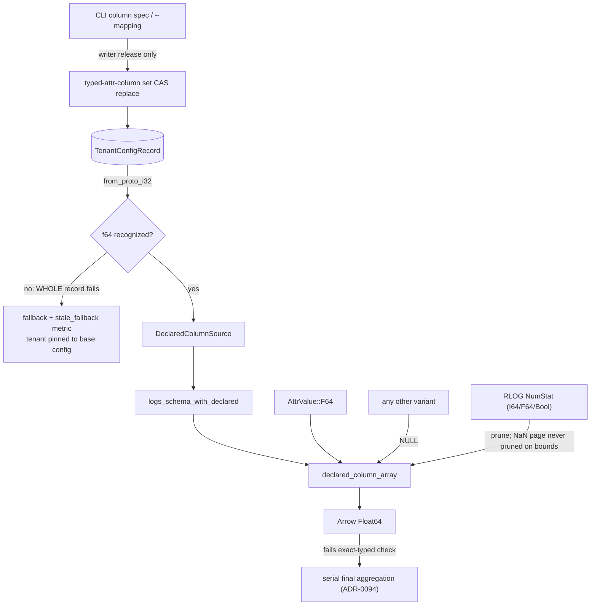

# ADR-0101: declarable f64 typed attribute columns

Status: Accepted

## Context

ADR-0090 shipped declared typed attribute columns with exactly four types —
`str`, `i64`, `bool`, `bytes` — and deferred three more on the record
(ADR-0090 decision 1): `f64` "gated on #277 landing", and date/timestamp
needing "a lifting rule from `i64` storage plus a declared unit".
`proto/ravel/sys.proto:360-375` repeats both deferrals in the
`TypedAttrColumnType` comment, so the absence is deliberate.

**The `f64` gate is now closed.** #277 landed as ADR-0094: a per-query
exact-typed check gates parallel final aggregation, and float input keeps
the serial, total-order path (`crates/ravel-sql/src/minmax.rs`'s
`is_float`, ADR-0094 decision 1). Float aggregation is order-dependent, so
the fold-order question ADR-0090 was waiting on has a settled answer:
floats are excluded from repartitioning rather than silently reordered. A
declared `f64` column therefore cannot corrupt an aggregate result; it can
only decline the parallel path.

**A float attribute is undeclarable today, with no workaround.** The other
four types each cover their storage variant, but `AttrValue::F64` has no
declarable type, and declaring such a key as `i64` yields NULL for every row
(`logs_scan.rs::declared_column_array` NULLs a value whose variant does not
match the declared type). So a float attribute stays in the merged `attrs`
map, and every predicate or aggregate over it is a
`CAST(attrs['k'] AS ...)` over a materialized string — exactly the cost
ADR-0090 exists to remove, with no way for an operator to opt out of it.

### Date and timestamp are not part of this ADR

They were in an earlier draft and are cut deliberately, because `i64`
already covers the semantics.

`ts` is natively `Timestamp(Nanosecond, None)` (`logs_schema.rs:60`) and a
`--mapping` requires `ts_column`, so a dataset's primary event-time column
is fully typed already. For a *secondary* time column declared as `i64`,
NumStat pruning uses the same stat, typed comparison and pushdown work
identically, and ADR-0094 treats it as exact-typed so it keeps parallel
final aggregation. What a declared time type would add is ergonomic: a
`DATE`/`TIMESTAMP` literal comparing directly (rather than against an epoch
integer), and `date_trunc`/`extract` applying without manual arithmetic.

That is a real ergonomic gap and #432 records it, with the analysis, as an
ergonomics ticket. It is not a latency gap, and this ADR does not spend a
frozen-contract change on it.

### The blast radius of an unknown type is the whole tenant record

This is the fact that shapes the rollout, and it applies to any new enum
value however small. `DeclaredColumnType::from_proto_i32` refuses an
unrecognized value (`crates/ravel-catalog/src/tenant_config.rs:122-135`, by
design: "an absent or unknown one is corruption, not a default to guess
at"), and its caller propagates that refusal with `?` at
`tenant_config.rs:397`, inside the decode of the whole
`TenantConfigRecord`.

So an old binary reading a declaration that names `f64` does not lose one
column, and does not lose only the declared-column list: **the entire tenant
config record fails to decode**, taking lifecycle state and every admission
override with it. On the query path that surfaces as
`TenantConfigDeclaredColumns` serving a fallback and counting
`ravel_typed_attr_columns_stale_fallback_total`
(`services/ravel-server/src/declared_columns.rs`) — the "permanently
unreadable override" case that metric exists to expose.

Fail-closed decode is correct and this ADR does not change it. It does mean
the new value is only safe to *write* once every reader can decode it.

## Decision

### 1. One new `TypedAttrColumnType` value, additive

`proto/ravel/sys.proto` gains one enum value, keeping 0-4 untouched:

```
TYPED_ATTR_COLUMN_TYPE_F64 = 5;
```

Additive, no renumbering, no field-number change, per the frozen-contract
rule. `DeclaredColumnType`, `DeclaredType`, the CLI column-spec vocabulary
(`f64`), and `--from-mapping`'s derivation (#426, which currently skips
`ColType::F64` with a warning) gain the matching variant. The proto comment
that names the deferral is updated in the same change: `f64` is no longer
deferred, and the date/timestamp deferral note stays with a pointer to #432.

Migration class: the tenant config record is a mutable, CAS-versioned
control-plane record, not a bulk data object — Class C in ADR-0066 decision
4's sense (additive-only metadata). Nothing needs converging: existing
records stay byte-valid and decode unchanged.

### 2. Projection semantics

A declared `f64` column projects as Arrow `Float64` from an
`AttrValue::F64`. A value of any other variant yields NULL for that row,
exactly as the four existing types already do. No coercion from `I64` and no
parse from `Str`: a declared type describes how a value is *read*, and
silently widening an integer into a float column would make a query's
result depend on which variant a writer happened to store.

Float comparison in this path, and in every test asserting it, uses bit
patterns (`f64::to_bits`), never `==`. NaN payloads and `-0.0` stay
significant, per the repo invariant.

### 3. NumStat pruning, with the NaN rule stated

The RLOG writer already computes NumStats for `I64`, `F64`, and `Bool`
(`crates/ravel-logseg/src/writer.rs`), so a declared `f64` column has real
bounds to prune on and needs no new stat.

The NaN rule is explicit: a page whose values include NaN has no usable
ordered bound, so its stat must not be used to prune a range predicate. An
absent or unusable stat prunes nothing, which is always legal (ADR-0095
decision 5's discipline). A test must prove that a NaN-carrying page
survives a range predicate which would exclude it on min/max alone —
demonstrated failing against an implementation that prunes on the bounds
regardless.

Cross-type agreement follows ADR-0095 unchanged: a name carrying both `I64`
and `F64` occurrences resolves by that ADR's rules, and this ADR adds no new
resolution.

### 4. Aggregation: float declines the parallel path, per ADR-0094

A query aggregating a declared `f64` column fails ADR-0094's exact-typed
check and runs its final aggregation serially. That is the existing rule for
float input, applied to a new way of producing float input; nothing here
weakens it. This is a latency consequence, not a correctness one, and it is
the reason ADR-0090 waited for #277 rather than shipping `f64` in v1.

### 5. Rollout: readers before writers

Because an unknown value fails the whole tenant record decode (see Context),
the change lands in two ordered releases:

1. **Reader release.** Decode, projection, and pruning recognize `f64`.
   Nothing writes it: the CLI does not offer it, and `--from-mapping` still
   skips a float mapping entry with the warning it prints today.
2. **Writer release**, once the fleet is on the reader release. The CLI
   column-spec vocabulary and `--from-mapping` gain `f64` and can write it
   durably.

The gap is a deployment property, not a code flag: a mixed-version fleet
where a writer runs ahead of a reader can strand a tenant's whole config
behind a fallback until the reader catches up. The release notes and
`docs/guides/query.md` state the ordering requirement, and the writer
release's ticket names the reader release as its dependency.

## Diagram



## Rejected alternatives

- **Include date and timestamp types.** Cut after checking what they buy:
  `ts` is already natively `Timestamp(Nanosecond, None)`, and a secondary
  time column declared as `i64` gets identical pruning, pushdown, and
  aggregation treatment. The remaining difference is literal and function
  ergonomics, which is not worth a frozen-contract change on its own. #432
  carries the analysis.
- **Coerce `I64` values into a declared `f64` column.** Makes a query's
  answer depend on which variant a writer stored, and hides a schema
  mismatch that NULL surfaces.
- **Per-entry skip on an unknown type at decode**, removing the
  deployment-order requirement. Wrong trade: it converts a loud, metered
  failure into a silently narrower schema, so a query would return rows
  computed against a schema the operator never declared. ADR-0090's
  fail-closed decode is deliberate and stays.
- **Leave `f64` undeclarable.** Defensible while #277 was open; not after
  ADR-0094 settled the fold order. The status quo makes every float
  predicate a per-row string cast with no operator opt-out.

## Consequences

- One additive proto enum value. Existing records decode unchanged; no
  version bump, no migration, no dual reader for the record itself.
- A mixed-version fleet must upgrade readers before any tenant writes an
  `f64` declaration, or that tenant's whole config falls back until it does.
  Stated in the guide, enforced by shipping the writer one release later.
- A declared `f64` column costs its queries ADR-0094's parallel final
  aggregation.
- The Arrow-side arms (`logs_schema.rs`, `logs_scan.rs::declared_column_array`,
  `flight_ticket.rs`) each gain one case. `flight_ticket.rs` pins a resolved
  declaration into its ticket, so a plan-then-`DoGet` across a mixed-version
  pair is bounded by the same rollout rule as the durable record.
- ADR-0099 types every declared `Str` column as `Dictionary(Int32, Utf8)`;
  an `f64` column is not dictionary-encoded, so both the fast path and the
  row-path fallback must build the right array kind or DataFusion's schema
  validation fails at runtime. That work overlaps #360's ownership of those
  files and is sequenced with it, not raced.
- This is a completeness fix, not benchmark work. ADR-0100's workload has
  no float columns to declare (verified against the real schema in #430), so
  none of #421's measurements depend on this landing.
