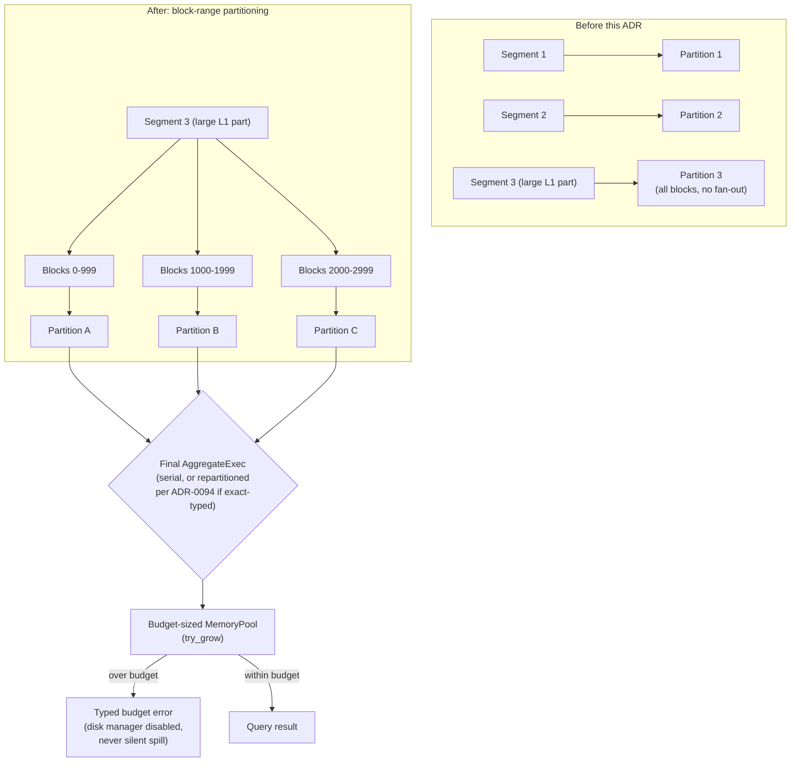

# ADR-0102: Intra-segment scan partitioning and pinned spill policy

Status: Accepted for decisions 2-4 (parallel final aggregation acceptance,
spill policy, benchmark). Decision 1 (intra-segment scan partitioning) is
Deferred — a review pass found its core fetch-granularity premise doesn't
hold as designed; see the note at the end of that section. This ADR still
claims the number for the epic as a whole; decision 1 will be revised in
place once redesigned, not moved to a new document.

## Context

Epic #361 identified three independent ceilings on SQL execution parallelism:

1. **Scan partitioning is segment-granular.** `LogsScanExec::new`
   (`crates/ravel-sql/src/logs_scan.rs:419-420`, the round-robin assignment
   loop) assigns whole segments to partitions, capped at
   `min(target_partitions, segment_count)`. Compaction packs a tenant's hour
   into a handful of 256 MiB L1 parts, so exactly when data volume justifies
   parallelism, a scan runs on one or two partitions regardless of
   `target_partitions`. Blocks are a target 8192-record unit (not fixed-size,
   `docs/log-segment-format.md:265`) and independently decodable; the skip
   index enumerates the surviving set (`SkipIndex::candidate_blocks`,
   `crates/ravel-logseg/src/skip_index.rs:268`, the first of three pruning
   tiers alongside POSTINGS and bloom, and the `BlockScan` cursor at
   `crates/ravel-logseg/src/reader.rs:615` that walks the pruned set one at a
   time) — nothing distributes them across partitions. Whether and how that
   enumeration can drive partition assignment without changing the fetch
   path's cost shape is exactly what decision 1 below turned out not to have
   answered on the first pass.
2. **Parallel final aggregation exists but has never been measured at
   production scale.** ADR-0094 (`docs/adrs/0094-parallel-final-aggregation-exact-typed.md`)
   already specifies the full mechanism: an exact-typed classification pass
   (count/sum/min/max over non-float always exact, avg/mean never, any float
   GROUP BY key disqualifies, fail-closed on any classification error) gated
   behind `SqlConfig::parallel_final_aggregation`. Its own preliminary
   measurement was a throwaway local benchmark (`--profile ci`, `MemoryStore`,
   one dev machine) that showed no clear win and one regression case (8
   partitions 14% *slower* than 1 at 40k rows / 10k groups) — explicitly
   flagged in the ADR as not production-grade evidence. The flag has stayed
   off ever since.
3. **Spill contradicts its own ADR.** ADR-0013 states plainly: "budget
   exhaustion is an error, never a partial result; spilling stays disabled."
   `build_session` (`crates/ravel-sql/src/session.rs:422-431`) configures a
   budget-sized `MemoryPool` with `try_grow` enforcement, matching that
   claim for the pool — but never calls `.with_disk_manager(...)` on the
   `RuntimeEnvBuilder`. DataFusion 54's disk manager defaults to
   `DiskManagerMode::OsTmpDirectory` (confirmed via
   `datafusion-execution-54.1.0/src/disk_manager.rs:45-52`, a narrow grep,
   not a wholesale source read) with a 100 GB ceiling. A high-cardinality
   final aggregation over the budget-sized pool most likely spills silently
   to local disk today, on a node whose disk is supposed to be disposable —
   the exact "partial result masking a budget problem" ADR-0013 was written
   to prevent, just via a different subsystem than the one it named.

These three are independent: item 1 touches `logs_scan.rs` and the
`skip_index`/`reader` block-enumeration layer; item 2 touches
`session.rs`/`executor.rs`'s classification and is orthogonal to how many
scan partitions feed it; item 3 touches only `RuntimeEnvBuilder`
configuration. None blocks another structurally. Item 2's production
measurement would be more representative once item 1 lands (wider fan-in
gives a cleaner signal on whether the serial merge is the bottleneck), but
item 1 is deferred with no fixed timeline (see decision 1) and is also
externally sequenced behind a peer epic's in-flight work on the same file
— items 2-4 do not wait for it and proceed on their own schedule, with the
measurement caveat above noted rather than blocking.

Epic #360 (columnar decode-to-Arrow, in flight on a peer session) changes
what happens *inside* one partition's block-decode loop; this ADR changes
how many such loops run concurrently. Orthogonal by construction — neither
depends on the other landing first.

## Decision

### 1. Intra-segment partitioning — DEFERRED, real design gap found

The original design here (flatten `(segment, block_index)` pairs from
`SkipIndex::candidate_blocks` and round-robin them across
`target_partitions`, mirroring how `LogsScanExec` already round-robins
whole segments) does not hold up against the actual fetch path and is not
being shipped as first drafted. Recorded here for whoever picks this back
up:

- `candidate_blocks` only runs inside `RlogReader::scan_blocks` at
  *execute* time, per partition, after the object is fetched — not at plan
  time where partition assignment (`LogsScanExec::new`) happens. There is
  no candidate list to flatten before partitions already exist.
- The fetcher's unit is the whole object: `log_fetcher.rs` fetches with
  `GetRange::Full`. K partitions each owning a slice of one segment's
  blocks means K independent full-object GETs of the same 256 MiB L1
  part — real S3 request/egress amplification, landing right after the
  S3-request-cost epic (#84) specifically reduced that class of cost. The
  ADR-0046 single-flight cache mitigates this only when wired, which the
  original draft didn't require or even mention.
- The "byte-accounting stays additive, no re-derivation" claim was false:
  `QueryAccounting` is one shared `Arc` of atomics with no per-partition
  fold to begin with, and per-partition `BlockMetrics` would record each
  segment's `blocks_total` once per (partition × segment) rather than
  once per segment — a real double-count, not just an unproven claim.
- `candidate_blocks` is only the first of three pruning tiers
  (skip-index, POSTINGS, bloom); a redesign needs to say which tier the
  partitioned subset indexes and where the other two run.

A real design here needs to resolve the fetch-granularity mismatch first —
plausible directions include byte-range `GetRange` fetches per partition
(block offsets are already known from the footer/FIELD_DIR before block
data is fetched, so a footer-only read could drive partition assignment
without a full-object fetch) or requiring the ADR-0046 single-flight cache
as a precondition so K partitions share one fetch — but neither is decided
here. This item is also externally sequenced behind peer epic #360's T3-T5
(`crates/ravel-sql/src/logs_scan.rs` is under active, non-trivial rewrite
there — a per-partition columnar/row-path eligibility split that a
partitioning redesign needs to interact with deliberately, not merge
textually on top of), so there is no urgency to resolve the fetch-mechanism
question before that lands either. Before redrafting, also confirm ADR-0087
(which deliberately dropped `LogsScanExec`'s per-partition timestamp
ordering guarantee) hasn't been silently reacquired downstream — the same
failure family `RsegDedupExec`'s own history documents on the metrics side:
an ordering declaration removed once let the optimizer strip a merge and
execute one partition silently.

### 2. Accept ADR-0094 in place; measure at production scale before flipping the default

ADR-0094's mechanism is not revisited — ship it as designed. This epic adds
the missing evidence: a benchmark against a real S3-backed store (not
`MemoryStore`), release profile, realistic cardinality (matching the
group-by shapes ClickBench-class workloads exercise). Measure at today's
segment-granular fan-in — decision 1 is deferred with no fixed timeline,
so this measurement does not wait for it. Note the fan-in caveat alongside
the published numbers, and re-measure if/when decision 1 lands, since
wider fan-in could shift the crossover point. Publish the numbers into
ADR-0094's own Consequences section and flip its Status from Proposed to
Accepted in the
same change that defaults `parallel_final_aggregation` on. If production
numbers repeat the preliminary regression (parallel slower at low
cardinality), the default stays off and ADR-0094 documents the measured
crossover point instead of defaulting on unconditionally — this ADR does
not pre-decide which way the number comes out, only that the flag's
default follows the measurement, not a guess.

### 3. Disable the disk manager explicitly; spill is a typed error, not silent degradation

Match ADR-0013's plain-language claim literally: configure
`RuntimeEnvBuilder::new().with_disk_manager_builder(DiskManagerBuilder::default().with_mode(DiskManagerMode::Disabled))`
in `build_session` (`with_disk_manager` taking `DiskManagerConfig` is
deprecated since DataFusion 48.0.0 and fails this repo's `-D warnings`
gate; `with_disk_manager_builder` is the current API). With the disk
manager disabled, `GroupedHashAggregateStream` is constructed in
`ReportError` mode and never touches it: an aggregation over budget
propagates the pool's own `try_grow` error directly (Ravel's
`TenantDelegatingPool::try_grow` already ignores `can_spill`, so this is
not a new code path, just closing off the one DataFusion mode that used to
route around it).

This also changes `ORDER BY`: `SortExec`'s external sorter would today
silently spill the same way; with the disk manager disabled it instead
fails typed via `DiskManager::create_tmp_file`'s own
`ResourcesExhausted("... DiskManager is disabled")`, mapped through the
same `SqlError::ResourcesExhausted` variant the aggregation path uses
(distinct message, same typed error). Both paths need their own test.

Add tests that drive (a) a high-cardinality final aggregation and (b) a
large `ORDER BY` past the pool budget, and assert the typed
`ResourcesExhausted` error fires in both cases, not a silent disk write —
mirroring the existing bytes-scanned-budget error-typing convention
elsewhere in this codebase (`bytes_scanned_exceeded` in `ravel-query`),
the established shape for "budget exhaustion is an error" here.

This is pure runtime configuration and query-execution behavior: no
persistent format, no proto/RSEG/RLOG/key-layout change, so none of the
format-change skill's machinery (migration class, version bump, dual-reader
window) applies. Ships unflagged in `build_session`, effective for every
query immediately.

### 4. Build the group-by scaling benchmark once, in `ravel-bench`

A criterion-style benchmark in `crates/ravel-bench`: one representative
group-by query and cardinality, swept across a `target_partitions` axis,
over a multi-part tenant, measuring throughput and latency scaling versus
core count. This is a different instrument from #421/ADR-0100's
`sql_latency_bench` (#428, in flight, not yet merged): that harness
measures per-query latency across a diverse SQL corpus with scan
diagnostics attached, a query-diversity axis, not a parallelism-sweep
axis. Matches ADR-0099's own criterion-throughput-bench precedent instead.
Do not build against #428's API while it is unreviewed and unmerged; once
both land, #428 may drive this benchmark as one of its entries (per
ADR-0100's own stated direction), but that composition is #428's work to
add, not built here.

No existing harness in `ravel-bench` measures core-count scaling for
aggregation (`query_latency.rs` covers PromQL percentiles with no
core-count axis; `sql_corpus.rs` covers query generation for #428, not
scaling). Measure before AND after item 2's default flip and before/after
decision 1 lands (whenever it's redesigned), so both "before" numbers are
captured, not assumed.

## Rejected alternatives

- **Just raise `target_partitions` without changing the partitioning unit.**
  Rejected: the cap is `min(target_partitions, segment_count)`, so raising
  the config value does nothing once segment count is the binding
  constraint — which is exactly the case compaction produces. The unit
  itself has to change, not the target.
- **A fixed blocks-per-partition constant instead of dividing by
  `target_partitions`.** Rejected: a static constant either over-partitions
  a small scan (per-partition overhead dominates) or under-partitions a
  large one on a high-core-count node. Deriving the partition count from
  `target_partitions` (which the caller already sets from core count) keeps
  one existing knob meaningful instead of adding a second, uncoordinated one.
- **Re-deriving ADR-0094's classification decision in this ADR.** Rejected:
  ADR-0094's Decision section is already complete and correct on its own
  terms; forking it into a second document risks the two disagreeing later.
  Accept it in place instead — one ADR per decision, amended or accepted,
  never duplicated.
- **Amend ADR-0013 to sanction bounded local-disk spill as non-durable
  scratch.** Rejected, though it was the epic's own open question rather
  than a foregone conclusion. Every other budget in this codebase (bytes
  scanned, series count, samples returned) fails as a typed error rather
  than silently degrading; spill would be the one exception, and a
  disposable compute node retaining partial query state on local disk under
  a mid-spill crash is exactly the operational assumption "compute is
  disposable, only object storage is durable" exists to avoid. Consistency
  with the rest of the budget-enforcement surface, plus this repo's
  standing invariant that no durability may depend on local disk, decided
  this in favor of disabling spill outright.
- **Leave the disk manager unconfigured (status quo).** Rejected: it
  silently contradicts ADR-0013's own text and turns "budget exhaustion is
  an error" into "budget exhaustion is an error, except when DataFusion's
  default happens to paper over it with local disk" — an unpinned,
  accidental behavior, not a decision.

## Consequences

`parallel_final_aggregation`'s default follows measurement, not this ADR's
guess; if production numbers repeat the preliminary regression, the flag
stays off and ADR-0094 records why, closing the epic's stated goal (an
evidenced default) either way. Note ADR-0094 decision 3 itself: the
repartitioned plan adds a redistribution buffer, so turning the flag on can
make a query newly hit the memory budget that stayed under it serial —
measure with that in mind, not just the happy-path throughput case.

Disabling the disk manager makes a high-cardinality final aggregation or a
large `ORDER BY` that would have spilled today fail typed instead. This is
the intended consequence, not a regression to work around: it converts a
silent, disk-dependent degradation into the same typed budget error every
other resource limit in this codebase already produces. The escape hatch
for a query that genuinely needs more memory than the budget allows is
ADR-0088's operator-configurable memory budget, or a narrower query — not
`parallel_final_aggregation`, which (per the note above) can tighten the
effective budget rather than loosen it.

Decision 1 (intra-segment partitioning) is not yet shipped; its
consequences aren't real until it's redesigned and accepted. The
Diagram below shows the target end state including decision 1, not
current behavior.

## Diagram

Target end state, once decision 1 is redesigned and lands — the left half
(block-range partitioning) is not yet shipped by this ADR; decisions 2-4
(the aggregation/spill/budget half on the right) are.

