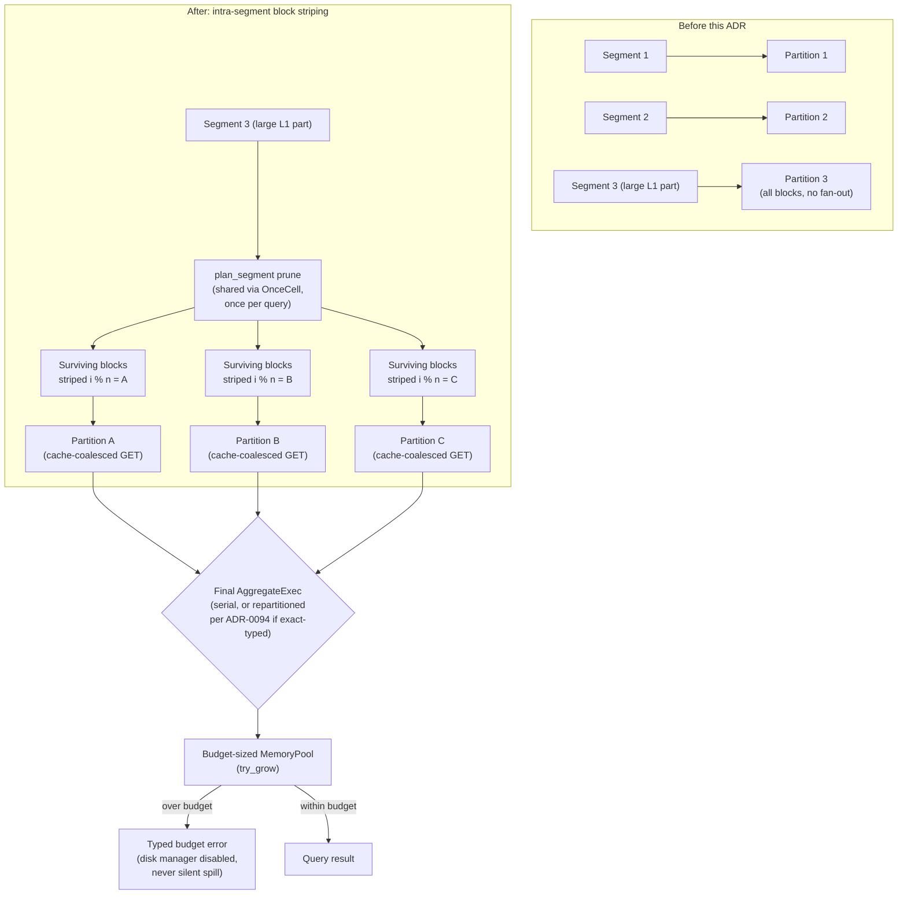

# ADR-0102: Intra-segment scan partitioning and pinned spill policy

Status: Accepted.

Decision 1 was Deferred after a review pass found its original
fetch-granularity premise (flattening `candidate_blocks` before partitions
exist) didn't hold. It was redesigned and shipped in place, not moved to a
new document: `crates/ravel-sql/src/logs_scan.rs`'s `LogsScanExec` now
determines per-segment surviving-block counts at plan time via
`LogSegmentFetcher::plan_segment` (a prune with no block decode, or for a
query with no block-level predicate at all -- #693 part 2 -- no fetch of
block data whatsoever: the footer's own block count is the survivor
count), shared across partitions through a `tokio::sync::OnceCell`, and
gates the fan-out past segment count on `LogSegmentFetcher::has_cache`
(ADR-0046's single-flight cache), the precondition the deferral note
named. See the end of that section for what changed from the original
draft and what remains explicitly out of scope (a ranged per-block
reader, ADR-0107).

## Context

Epic #361 identified three independent ceilings on SQL execution parallelism:

1. **Scan partitioning is segment-granular.** `LogsScanExec::new`
   (`crates/ravel-sql/src/logs_scan.rs:419-420`, the round-robin assignment
   loop) assigns whole segments to partitions, capped at
   `min(target_partitions, segment_count)`. Compaction packs a tenant's hour
   into a handful of 256 MiB L1 parts, so exactly when data volume justifies
   parallelism, a scan runs on one or two partitions regardless of
   `target_partitions`. Blocks are a target 8192-record unit (not fixed-size,
   `docs/log-segment-format.md:265`) and independently decodable; the skip
   index enumerates the surviving set (`SkipIndex::candidate_blocks`,
   `crates/ravel-logseg/src/skip_index.rs:268`, the first of three pruning
   tiers alongside POSTINGS and bloom, and the `BlockScan` cursor at
   `crates/ravel-logseg/src/reader.rs:615` that walks the pruned set one at a
   time) — nothing distributes them across partitions. Whether and how that
   enumeration can drive partition assignment without changing the fetch
   path's cost shape is what decision 1 below did not answer on its first
   pass, and was resolved on its second (see decision 1).
2. **Parallel final aggregation exists but has never been measured at
   production scale.** ADR-0094 (`docs/adrs/0094-parallel-final-aggregation-exact-typed.md`)
   already specifies the full mechanism: an exact-typed classification pass
   (count/sum/min/max over non-float always exact, avg/mean never, any float
   GROUP BY key disqualifies, fail-closed on any classification error) gated
   behind `SqlConfig::parallel_final_aggregation`. Its own preliminary
   measurement was a throwaway local benchmark (`--profile ci`, `MemoryStore`,
   one dev machine) that showed no clear win and one regression case (8
   partitions 14% *slower* than 1 at 40k rows / 10k groups) — explicitly
   flagged in the ADR as not production-grade evidence. The flag has stayed
   off ever since.
3. **Spill contradicts its own ADR.** ADR-0013 states plainly: "budget
   exhaustion is an error, never a partial result; spilling stays disabled."
   `build_session` (`crates/ravel-sql/src/session.rs:422-431`) configures a
   budget-sized `MemoryPool` with `try_grow` enforcement, matching that
   claim for the pool — but never calls `.with_disk_manager(...)` on the
   `RuntimeEnvBuilder`. DataFusion 54's disk manager defaults to
   `DiskManagerMode::OsTmpDirectory` (confirmed via
   `datafusion-execution-54.1.0/src/disk_manager.rs:45-52`, a narrow grep,
   not a wholesale source read) with a 100 GB ceiling. A high-cardinality
   final aggregation over the budget-sized pool most likely spills silently
   to local disk today, on a node whose disk is supposed to be disposable —
   the exact "partial result masking a budget problem" ADR-0013 was written
   to prevent, just via a different subsystem than the one it named.

These three are independent: item 1 touches `logs_scan.rs` and the
`skip_index`/`reader` block-enumeration layer; item 2 touches
`session.rs`/`executor.rs`'s classification and is orthogonal to how many
scan partitions feed it; item 3 touches only `RuntimeEnvBuilder`
configuration. None blocks another structurally. Item 2's production
measurement is more representative now that item 1 has landed (see
decision 1): a wider fan-in gives a cleaner signal on whether the serial
merge is the bottleneck.

Epic #360 (columnar decode-to-Arrow, in flight on a peer session) changes
what happens *inside* one partition's block-decode loop; this ADR changes
how many such loops run concurrently. Orthogonal by construction — neither
depends on the other landing first.

## Decision

### 1. Intra-segment partitioning — redesigned and shipped

The original design (flatten `(segment, block_index)` pairs from
`SkipIndex::candidate_blocks` and round-robin them across
`target_partitions`) did not hold up against the actual fetch path, for
the four reasons recorded when this decision was deferred: `candidate_blocks`
only exists at *execute* time inside `RlogReader::scan_blocks`, after the
object is already fetched, so there was no candidate list to flatten before
partition assignment (`LogsScanExec::new`, synchronous) runs; the fetcher's
unit is the whole object (`GetRange::Full`), so K partitions striping one
segment's blocks would issue K whole-object GETs of the same part unless
something coalesced them; the "byte-accounting stays additive" claim was
false, since naive per-partition `BlockMetrics` would record a segment's
`blocks_total` once per (partition × segment) instead of once per segment;
and `candidate_blocks` is only the first of three pruning tiers
(skip-index, POSTINGS, bloom), so a redesign had to say where the other two
run relative to the partitioned subset.

The shipped design (`crates/ravel-sql/src/logs_scan.rs`) resolves all four:

- **Plan-time pruning, not execute-time.** A new `LogSegmentFetcher::plan_segment`
  prunes every segment once, with no block decode, before any partition
  drains a block. Every partition awaits the same computation through a
  shared `tokio::sync::OnceCell` (`compute_plan_counts`), so the
  per-segment surviving-block counts partition assignment needs exist
  before partitions start draining, not after.
- **Fetch-cost gated on the read cache, not assumed away.** The whole
  object is still fetched with one `GetRange::Full` GET per partition per
  segment it touches (no ranged block reader — that's ADR-0107, explicitly
  future work, not this decision). `LogsScanExec::new` checks
  `LogSegmentFetcher::has_cache`: with ADR-0046's single-flight cache
  wired, several partitions striping one segment coalesce onto one GET, so
  fan-out proceeds to `target_partitions`; without a cache, striping past
  the segment count would multiply GETs for nothing, so the partition count
  falls back to the pre-this-decision bound,
  `target_partitions.max(1).min(segment_count.max(1))`. `ravel-bench`'s
  `logs_scan_scaling` report measures both sides: on its fixture,
  cache-wired request count stays flat across the `target_partitions`
  sweep, and un-cached it is flat too, at one plan read plus one scan read
  per segment, because segments are assigned whole (amendment below; the
  original draft had it climbing until the segment-count cap bound).
- **Double-count fixed by assigning ownership of the whole-segment totals
  to one partition.** `blocks_total` and the postings-prune drop are
  recorded once, by partition 0 only, during the shared planning step;
  every other partition's `BlockMetrics` records only the blocks it
  actually decoded. Striping a segment across N partitions no longer
  multiplies its whole-segment totals by N.
- **All three pruning tiers still run, at their original layer, for a
  query with any block-level predicate.** `plan_segment`'s prune covers
  skip-index and POSTINGS (matching what `candidate_blocks` did before,
  just earlier); the partitioned subset is the resulting surviving-block
  list. Bloom pruning is unchanged: it still runs per-block during decode,
  inside whichever partition owns that block. For a query with NO
  block-level predicate at all (#693 part 2), none of the three tiers run:
  every block trivially survives, so `plan_segment` reads only the
  object's footer and returns its block count directly.

ADR-0087's "no output ordering" guarantee (decision 1 there) is
unaffected, not silently reacquired: `LogsScanExec::compute_properties`
still declares `Partitioning::UnknownPartitioning`, explicitly, and the
module doc states why a block-streaming, striped scan cannot claim an
ordering a whole-segment scan couldn't either.

Outstanding from the original scope, deliberately not resolved here: a
ranged (per-block) reader that would remove the whole-object-GET tradeoff
entirely is claimed as ADR-0107, not folded into this decision.

### 2. Accept ADR-0094 in place; measure at production scale before flipping the default

ADR-0094's mechanism is not revisited — ship it as designed. This epic adds
the missing evidence: a benchmark against a real S3-backed store (not
`MemoryStore`), release profile, realistic cardinality (matching the
group-by shapes ClickBench-class workloads exercise). The measurement ran
at the segment-granular fan-in that predates decision 1's redesign above
(measuring first, not waiting on it, was the plan; decision 1 has since
landed, so a re-measurement at wider fan-in would need to note that the
published numbers here predate it). Publish the numbers into ADR-0094's
own Consequences section and flip its Status from Proposed to Accepted in
the same change that defaults `parallel_final_aggregation` on. If
production numbers repeat the preliminary regression (parallel slower at
low cardinality), the default stays off and ADR-0094 documents the
measured crossover point instead of defaulting on unconditionally — this
ADR does not pre-decide which way the number comes out, only that the
flag's
default follows the measurement, not a guess.

#### Amendment, 2026-08-26: aggregation state scales with partition count (issue #680)

High-cardinality ClickBench statements (`q06_distinct_searchphrase`,
`q09_region_distinct_users`, `q14_search_phrases_distinct_users`) exhausted an
8 GiB per-query pool, and the amount by which they overshot tracked the
partition count. `ravel-bench`'s `groupby_scaling --distinct-sweep`
(`run_distinct`) measured it directly on the `logs` table: 32 RLOG objects each
carrying every one of `D` distinct values once, so a partition owning one
object still sees all `D`, swept over `D` in {10,000, 100,000, 1,000,000} and
`target_partitions` in {1, 4, 16, 32}, with peak read from
`QueryAccounting::peak_intermediate_bytes`. Peak pool bytes, 1 partition versus
32:

| query | D | 1 partition | 32 partitions | ratio | exponent |
|---|---|---|---|---|---|
| `COUNT(DISTINCT high)` | 10,000 | 4,269,268 | 47,978,804 | 11.2x | 0.70 |
| `COUNT(DISTINCT high)` | 100,000 | 9,905,370 | 160,827,822 | 16.2x | 0.80 |
| `COUNT(DISTINCT high)` | 1,000,000 | 83,305,692 | 419,506,764 | 5.0x | 0.47 |
| `GROUP BY low, COUNT(DISTINCT high)` | 10,000 | 4,145,004 | 45,792,464 | 11.0x | 0.69 |
| `GROUP BY low, COUNT(DISTINCT high)` | 100,000 | 9,125,746 | 146,106,714 | 16.0x | 0.80 |
| `GROUP BY low, COUNT(DISTINCT high)` | 1,000,000 | 62,340,980 | 939,662,480 | 15.1x | 0.78 |

The exponent is `ln(peak ratio) / ln(32)`: 0 would mean peak scales with `D`
alone, 1 that it scales with `D x partitions`. Measured 0.47 to 0.80, so it is
between the two and much nearer the second. The mechanism is the one issue #680
hypothesized, confirmed from the physical plan: `single_distinct_to_groupby`
rewrites `COUNT(DISTINCT x)` into a grouping aggregate on `x`, and that
aggregate plans as one `AggregateExec(mode=Partial)` per input partition feeding
a `CoalescePartitionsExec` and a single `Final`, so the pre-final state is one
full-sized hash table per partition. It falls short of a clean 32x because
DataFusion's own skip-partial-aggregation probe already caps a partial partition
at 100,000 entries — but only once that partition has processed 100,000 rows.
Below that it never fires at all, which is exactly what a high
`target_partitions` produces when it divides a tenant's data, and is where the
multiplier is unbounded.

Fix, in `session_config` (`crates/ravel-sql/src/session.rs`), behind
`SqlConfig::skip_partial_aggregation` (default on):
`datafusion.execution.skip_partial_aggregation_probe_rows_threshold` from
100,000 to 8,192 (one Arrow batch: whatever a partial partition accumulates
before the probe can save it stays resident, and every partition pays it, so the
probe's own cost is `partitions x this`), and
`datafusion.execution.skip_partial_aggregation_probe_ratio_threshold` from 0.8
to 0.5 (give up when the probe found a new group for more than every other row,
where the partial stage returns at most a factor of two and cannot pay for
`partitions` copies of itself). Not lower on either: the ratio is judged from a
sample of that many rows, and a smaller sample starts misjudging genuinely
reducible mid-cardinality keys as unreducible.

Neither option can change a result. Skipping decides only whether a partition
pre-aggregates its rows or forwards them; the final stage sees the same rows and
computes the same groups either way. This is orthogonal to the determinism rules
that govern every other knob in `session_config`, and to ADR-0094's exact-typed
classification: it changes where aggregation state lives, not what is summed or
in what order.

Pinned by `crates/ravel-sql/tests/skip_partial_aggregation.rs` on what the
probe decides, not on how much memory the decision happened to cost: `D =
25,000` distinct values over 4 objects, three rounds each (300,000 rows), 4
partitions, and the partial `AggregateExec`'s own metrics read off the executed
plan. With the option on every partition skips after its probe, so the partial
stage's `output_rows` equals its input rows (300,000), `skipped_aggregation_rows`
is 267,232, and the group entries the partial tables held are exactly 4 x 8192
(bounded to 2 x 8192 x partitions). With the option off the partial stage emits
one row per key per partition (100,000), skips nothing, and holds 100,000
entries. Each figure is a function of the fixture and the two thresholds, so it
is byte-identical run to run under any host load; the red state is structural:
stop writing either threshold and the tightened side collapses to 100,000
output rows for 300,000 input rows.

An earlier revision of the pin measured the pool's high-water mark instead (the
`COUNT(DISTINCT)` peak minus a scalar-count baseline, option on versus off).
How many partial tables are simultaneously resident at that mark is
scheduling-dependent, so the share moved from 0.02 on an idle box to 1.55 on a
loaded 4-core CI runner, and in that fixture each partition's key did not
reduce at all, so the partial stage emitted the same row count whether it
aggregated or forwarded. The peak bytes are still printed by the test as a
diagnostic; nothing asserts on them.

One existing test moved with the behavior:
`a_high_cardinality_aggregation_is_refused_by_the_aggregate_not_the_scan`
(decision 3's operator-identity case) now sets `skip_partial_aggregation` off.
Its subject is the aggregate operator's own non-spillable reservation being what
the pool refuses, and with the probe tightened its `GROUP BY ts` stops growing
after 8192 rows, so the refusal comes from `RepartitionExec`/`RsegScanExec`
instead. The typed-error requirement decision 3 actually states is unaffected
and still covered by
`a_high_cardinality_aggregation_over_budget_is_resources_exhausted`.

Per-entry cost, for sizing a pool by arithmetic instead of guesswork: the
aggregation-attributable peak divided by `D` is 65.4 bytes at `D = 50,000` and
63.5 bytes at `D = 200,000`, for a 13-byte string key. At ClickBench's roughly
17M distinct `UserID` that puts the final aggregation state near 1.1 GiB, the
partial stage at 32 x 8,192 x 64 B (about 17 MiB, against about 205 MiB under
DataFusion's stock 100,000-row probe), and the scan at about 1.5 MiB per
partition. Allowing a factor of two for a hash table resident across a doubling
resize, `COUNT(DISTINCT UserID)` needs on the order of 2.2 GiB, so an 8 GiB pool
holds it with room; that it failed at 1 GiB and passed at 8 GiB matches this
arithmetic, since 1 GiB is below the final state alone. Per-entry cost scales
with key width, so the `SearchPhrase` statements need the real corpus's measured
average key length before the same arithmetic applies to them; this fixture's
fixed-width key cannot supply it.

### 3. Disable the disk manager explicitly; spill is a typed error, not silent degradation

Match ADR-0013's plain-language claim literally: configure
`RuntimeEnvBuilder::new().with_disk_manager_builder(DiskManagerBuilder::default().with_mode(DiskManagerMode::Disabled))`
in `build_session` (`with_disk_manager` taking `DiskManagerConfig` is
deprecated since DataFusion 48.0.0 and fails this repo's `-D warnings`
gate; `with_disk_manager_builder` is the current API). With the disk
manager disabled, `GroupedHashAggregateStream` is constructed in
`ReportError` mode and never touches it: an aggregation over budget
propagates the pool's own `try_grow` error directly (Ravel's
`TenantDelegatingPool::try_grow` already ignores `can_spill`, so this is
not a new code path, just closing off the one DataFusion mode that used to
route around it).

This also changes `ORDER BY`: `SortExec`'s external sorter would today
silently spill the same way; with the disk manager disabled it instead
fails typed via `DiskManager::create_tmp_file`'s own
`ResourcesExhausted("... DiskManager is disabled")`, mapped through the
same `SqlError::ResourcesExhausted` variant the aggregation path uses
(distinct message, same typed error). Both paths need their own test.

Add tests that drive (a) a high-cardinality final aggregation and (b) a
large `ORDER BY` past the pool budget, and assert the typed
`ResourcesExhausted` error fires in both cases, not a silent disk write —
mirroring the existing bytes-scanned-budget error-typing convention
elsewhere in this codebase (`bytes_scanned_exceeded` in `ravel-query`),
the established shape for "budget exhaustion is an error" here.

This is pure runtime configuration and query-execution behavior: no
persistent format, no proto/RSEG/RLOG/key-layout change, so none of the
format-change skill's machinery (migration class, version bump, dual-reader
window) applies. Ships unflagged in `build_session`, effective for every
query immediately.

### 4. Build the group-by scaling benchmark once, in `ravel-bench`

A criterion-style benchmark in `crates/ravel-bench`: one representative
group-by query and cardinality, swept across a `target_partitions` axis,
over a multi-part tenant, measuring throughput and latency scaling versus
core count. This is a different instrument from #421/ADR-0100's
`sql_latency_bench` (#428, in flight, not yet merged): that harness
measures per-query latency across a diverse SQL corpus with scan
diagnostics attached, a query-diversity axis, not a parallelism-sweep
axis. Matches ADR-0099's own criterion-throughput-bench precedent instead.
Do not build against #428's API while it is unreviewed and unmerged; once
both land, #428 may drive this benchmark as one of its entries (per
ADR-0100's own stated direction), but that composition is #428's work to
add, not built here.

No existing harness in `ravel-bench` measures core-count scaling for
aggregation (`query_latency.rs` covers PromQL percentiles with no
core-count axis; `sql_corpus.rs` covers query generation for #428, not
scaling). Measure before AND after item 2's default flip; a re-measurement
at decision 1's wider fan-in (now that it has landed, see decision 1) is a
separate, not-yet-taken step, since the harness's original before/after
axis was item 2's flip, not item 1's landing.

## Rejected alternatives

- **Just raise `target_partitions` without changing the partitioning unit.**
  Rejected: the cap is `min(target_partitions, segment_count)`, so raising
  the config value does nothing once segment count is the binding
  constraint — which is exactly the case compaction produces. The unit
  itself has to change, not the target.
- **A fixed blocks-per-partition constant instead of dividing by
  `target_partitions`.** Rejected: a static constant either over-partitions
  a small scan (per-partition overhead dominates) or under-partitions a
  large one on a high-core-count node. Deriving the partition count from
  `target_partitions` (which the caller already sets from core count) keeps
  one existing knob meaningful instead of adding a second, uncoordinated one.
- **Re-deriving ADR-0094's classification decision in this ADR.** Rejected:
  ADR-0094's Decision section is already complete and correct on its own
  terms; forking it into a second document risks the two disagreeing later.
  Accept it in place instead — one ADR per decision, amended or accepted,
  never duplicated.
- **Amend ADR-0013 to sanction bounded local-disk spill as non-durable
  scratch.** Rejected, though it was the epic's own open question rather
  than a foregone conclusion. Every other budget in this codebase (bytes
  scanned, series count, samples returned) fails as a typed error rather
  than silently degrading; spill would be the one exception, and a
  disposable compute node retaining partial query state on local disk under
  a mid-spill crash is exactly the operational assumption "compute is
  disposable, only object storage is durable" exists to avoid. Consistency
  with the rest of the budget-enforcement surface, plus this repo's
  standing invariant that no durability may depend on local disk, decided
  this in favor of disabling spill outright.
- **Leave the disk manager unconfigured (status quo).** Rejected: it
  silently contradicts ADR-0013's own text and turns "budget exhaustion is
  an error" into "budget exhaustion is an error, except when DataFusion's
  default happens to paper over it with local disk" — an unpinned,
  accidental behavior, not a decision.

## Consequences

`parallel_final_aggregation`'s default follows measurement, not this ADR's
guess; if production numbers repeat the preliminary regression, the flag
stays off and ADR-0094 records why, closing the epic's stated goal (an
evidenced default) either way. Note ADR-0094 decision 3 itself: the
repartitioned plan adds a redistribution buffer, so turning the flag on can
make a query newly hit the memory budget that stayed under it serial —
measure with that in mind, not just the happy-path throughput case.

Disabling the disk manager makes a high-cardinality final aggregation or a
large `ORDER BY` that would have spilled today fail typed instead. This is
the intended consequence, not a regression to work around: it converts a
silent, disk-dependent degradation into the same typed budget error every
other resource limit in this codebase already produces. The escape hatch
for a query that genuinely needs more memory than the budget allows is
ADR-0088's operator-configurable memory budget, or a narrower query — not
`parallel_final_aggregation`, which (per the note above) can tighten the
effective budget rather than loosen it.

Decision 1 (intra-segment partitioning) has shipped; its consequences are
current behavior, not a target state. The diagram below reflects it.

## Diagram

Current end state: the left half (intra-segment, block-index striping) and
the aggregation/spill/budget half on the right are both shipped by this
ADR.

## Amendment (2026-08-26, #693)

Intra-segment block striping (decision 1) applies only when the fetcher
carries ADR-0046's read cache. Without it the scan is segment-granular: each
segment is assigned whole to one partition (relevant segment `j` in snapshot
order to partition `j % n`), so it is opened by exactly one partition, and the
partition count is capped at the segment count.

The reason is that decision 1's whole premise for striping past segment count
rests on single-flight coalescing the re-opens: `n` partitions sharing one
segment each open it themselves, and only the cache collapses those onto one
object-store request per extent. Without the cache nothing coalesces them, so
striping would multiply object-store reads by the partition count (measured at
~9x on the 8424-object tenant of #680), which is a regression, not a
speed-up. The gate was always `LogSegmentFetcher::has_cache`; this amendment
records that the same predicate now selects the assignment mode, not only the
partition count.

## Amendment (2026-08-26, #693 part 3): predicate-free full-window whole-segment assignment

Decision 1 stripes a snapshot's surviving blocks across partitions and resolves
the per-segment surviving-block counts up front, once, through a plan phase
(`compute_plan_counts`, `LogSegmentFetcher::plan_segment`) behind a `OnceCell`
barrier. For a predicate-free full-window statement that plan phase is pure
overhead: no block can be pruned, so every segment's survivor count is its whole
block count, known from the footer with no block decode. Worse, above the
block-range threshold (ADR-0107) the plan phase issues one suffix probe per
segment that never coalesces with the scan reads — the barrier makes it the
first, cold touch, and it is evicted from S3-FIFO probation before the scan (on
the 8424-object tenant of #680 that was 8,424 plan probes plus ~16,300 scan-side
re-probes plus 8,424 whole-object reads for a single `SELECT`).

So for a statement that satisfies all four conjuncts below, the plan phase is
skipped entirely and whole segments are assigned round-robin — the same rule the
un-cached path uses (segment `j` in snapshot order to partition `j % n`, `n =
min(target_partitions, relevant_segments)`) — with each segment read whole in
one GET (`scan_whole_accounted_with_tenant`, a single `GetRange::Full`, no
probe). The request count becomes exactly one whole-object read per relevant
segment, zero suffix probes.

The four conjuncts, all decidable from the resolved snapshot with zero I/O (they
reuse `plan_segment`'s own fast-path gate per segment):

1. the query is block-predicate-free (`LogQuery::is_block_predicate_free`: no
   content, prune-only, or stream-attribute arm);
2. the snapshot carries no pending selective erasure (folded into (1) via
   `LogQuery::erasure`), since erasure removes rows the committed counts still
   include;
3. every relevant (ts-overlapping) segment is above the block-range threshold,
   has a well-formed span, and is fully CONTAINED in the query window
   (`ts_min <= seg.min && seg.max <= ts_max`) — strictly stronger than the
   overlap the provider already pruned on, so every block of every relevant
   segment survives; and
4. there are at least `target_partitions` relevant segments, so whole-segment
   round-robin still fills every partition.

When any conjunct fails, the unchanged plan-then-stripe path runs. The
`object_size > block_range_threshold` conjunct keeps the fast path to the band
where it actually saves a request: at or below the threshold the plan and scan
reads already coalesce on the one `(0, object_size)` whole-object cache key, so
there is no probe to eliminate. `BlockMetrics::record_segment_totals` moves from
the partition-0 planning hack to per-segment scan stats on this path (each
segment has exactly one owning partition, so the whole-segment totals are still
recorded exactly once).

## Amendment (2026-08-26, #739): the block-range threshold is no longer a conjunct

The amendment above lists four conjuncts, and conjunct 3 requires every relevant
segment to be above the block-range threshold. That conjunct is removed. The
other three (block-predicate freedom, no pending erasure, and at least
`target_partitions` relevant segments) and the containment half of conjunct 3
are unchanged, so conjunct 3 now reads: every relevant (ts-overlapping) segment
has a well-formed span and is fully CONTAINED in the query window.

The threshold conjunct was query-wide, and that is what broke: a bulk load leaves
one small tail object per `(shard, hour)`, so a single sub-512-KiB object
disqualified every segment in the snapshot. Measured on the 8,424-object
ClickBench tenant (#680), a predicate-free full-window
`COUNT(DISTINCT UserID)` at 32 partitions issued 22,473 GETs where the fast path
would have issued 8,424 plus the resolve's own reads: the fast path never fired,
because one object out of 8,424 sat below the threshold.

It is removed rather than evaluated per segment because per segment it decides
nothing. At or below the threshold both entries land in the same
`LogSegmentFetcher::whole_object_bytes`: the whole-segment entry
(`scan_whole_accounted_with_tenant`) calls it unconditionally, and the striped
path's `tenant_bytes_with_footer` falls through to it for exactly the objects
the threshold excludes. That is one `GetRange::Full` on the `(0, object_size)`
cache key, the same `QueryAccounting` records, and no `EtagPin` on either side,
since a single GET observes a single object state. So a sub-threshold segment
reads identically whichever entry opens it, and it can be assigned whole to one
partition without changing a byte of what is read, while the above-threshold
segments around it keep the probe elimination this fast path exists for.

The consequence the earlier text worried about is real and accepted: a snapshot
whose segments are ALL at or below the threshold now takes the fast path too,
where it previously striped. Nothing is read differently there either -- the
plan phase's whole-object read and the scan's are the same cache key, so what
the fast path removes is the plan pass itself, not a GET.

When a conjunct does fail, the scan now says which one. `LogsScanExec::execute`
publishes a DataFusion counter named for the first failing conjunct
(`fast_path_rejected_pending_erasure`, `fast_path_rejected_block_predicate`,
`fast_path_rejected_segment_not_contained`,
`fast_path_rejected_fewer_segments_than_partitions`), one increment per
partition, and no such counter at all when the fast path fires. A latency report
reading the scan's metrics can then state why a statement striped instead of
inferring it from GET counts.

## Amendment (2026-08-26, #761): the plan phase and the fetch prune by the numeric arms

Decision 1's plan phase (`compute_plan_counts` -> `plan_segment`) resolves each
segment's surviving-block count before any partition drains a block, and the
scan reads those survivors through `BlockRangeFetcher`. The previous amendment
removed the plan phase for a predicate-free statement. This one fixes the cost
for a SELECTIVE one — the ClickBench q20 and q37-q43 shapes, a declared-column
or `attrs` numeric predicate — which is not block-predicate-free and so always
took the plan-then-stripe path.

The defect: neither the plan phase nor the scan applied the query's prune-only
`NumRange` arms to block selection. `plan_segment`'s slow branch opened each
segment whole to count survivors, and the scan's
`BlockRangeFetcher::resolve_extents` called `SkipIndex::candidate_blocks(ts, ts,
None, &[])` with no numeric arms, so every block was a ts candidate, the
coverage crossover fired, and the read collapsed to one whole-object GET. The
predicate pruned blocks only at decode. On the 8,424-object tenant of #680 the
selective q37 moved 11.7 GB to decode 144 of 17,731 blocks, and q20 moved 17.9
GB — past the 11.1 GB of objects on disk, because a cold cache re-read each
surviving segment once per owning partition.

The fix resolves the `NumRange` arms against each object's own FIELD_DIR
(`FieldDir::numeric_range_arms`, shared with the reader's decode-time prune so
the arms are byte-for-byte identical) and applies them to `candidate_blocks` in
both phases:

1. **Fetch side.** `resolve_extents` takes the resolved arms and prunes the
   candidate set before the coverage crossover is weighed, so a selective scan
   reads only the surviving blocks. The crossover threshold (0.75) is unchanged:
   it now fires only when the survivors genuinely cover >= 75% of the BLOCKS
   section. This is byte-identical to the unpruned read — the skip index's
   per-block bounds are conservative (ADR-0013), so a block dropped at fetch is
   one the decode-side prune would have dropped anyway, and the reader still
   runs the full skip/POSTINGS/bloom prune over the fetched buffer.
2. **Plan side.** For a query the skip index can decide — ts bounds plus at
   least one `NumRange` arm, no content/text arm, no attribute-equality POSTINGS
   prune, no stream filter — `plan_segment` reads footer + SKIP_IDX (the probe)
   plus the object's FIELD_DIR to resolve the arms, and returns
   `candidate_blocks(...).len()` with no block fetched. That count equals the
   survivor list the scan stripes, because for such a query the reader's full
   prune reduces to its skip step. The footer it read is carried to each subset
   open (#693 part 3), so those opens skip their own probe. At least one arm is
   required so this stays the selective path: a query with no prune arm is
   skip-decidable too, but its plan read already fetches only the ts-candidate
   blocks and warms exactly the extents the subset opens stripe, so planning it
   from the skip index would replace one shared read with N per-partition ones
   for the same bytes.
3. **Fallback.** A predicate the skip index cannot decide — a `has_word`/text
   arm (bloom prunes it only at decode), an `attrs['k']='v'` POSTINGS equality,
   a stream filter — still reads the whole object in the plan phase and is
   counted in a new `plan_full_reads` DataFusion counter (published once, by
   partition 0), so a report can see which statements still pay the plan-phase
   whole-object read. A segment at or below the block-range threshold counts
   there too: the fetch reads such an object whole in one GET regardless, so
   planning it from the skip index would cost a second read, not save one.

Reference figures on the 8,424-object tenant. The plan phase now reads, per
segment, one 64 KiB suffix probe (footer + SKIP_IDX) plus one small FIELD_DIR
range GET, and no block; the FIELD_DIR is a front section, so resolving the
numeric arms costs one range GET per segment that the predicate-free path (a
probe alone) does not pay. Bytes are dominated by the probes: q37-class drops
from 19,690 GETs / 11.7 GB to about 8,700 GETs and 0.65 to 0.9 GB (about 8,424
probes plus coalesced reads of about 144 surviving blocks), and q20 from 29,614
GETs / 17.9 GB to about 4 to 4.7 GB (each of its ~6,592 surviving blocks read
once, no whole-object re-read). GET counts stay near two to three per object,
because the object count is the floor: the probe and the FIELD_DIR range are one
each per relevant object no matter how selective the predicate is, and only the
surviving-block reads scale with the predicate. The 0.75 coverage crossover is
unchanged; a numeric predicate whose survivors still cover >= 75% of a segment
reads that segment whole, exactly as before.
