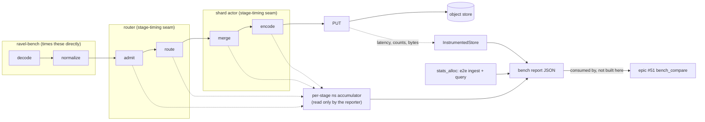

# ADR-0104: per-stage ingest profiling and regression baselines

Status: Accepted

## Context

Nothing in this workspace can attribute ingest time to a stage. Every claim
about where ingest CPU goes is an argument from code shape rather than a
measurement — and this week produced two independent demonstrations that
such arguments are unreliable at exactly the moment they matter. A peer
epic's real-S3 measurement found that scan concurrency dominates the final
merge, redirecting effort away from an optimization that reasoning had
ranked first. Another found a memory-pool charge reporting roughly a quarter
of its real footprint, under tests that had passed review.

Issue #365 catalogued six gaps. Research against the tree before writing
this ADR found **two of its premises no longer hold**, and one of its
suggested mechanisms is unsound. Recording that here because the epic's
shape follows from it:

**Gap 1 (no profiler lane) is already closed.** A pprof CPU-flamegraph lane
exists — the `profiling` feature in `crates/ravel-bench/Cargo.toml`, with
`ProfileSession` in `crates/ravel-bench/src/profiling.rs` gating on
`RAVEL_BENCH_PROFILE_SVG`, off by default so the plain gates never link
pprof or inferno. It landed citing #365 itself. Nothing to do.

**Gap 5 (the weekly report path) is not a bug.** #365 states that
`.github/workflows/bench-s3.yml` writes to a `bench/reports/` directory
that does not exist. It does not exist *in the tree*, correctly — it is an
output path. `crates/ravel-bench/src/bin/bench_report.rs:123-126` calls
`create_dir_all(parent)` before writing, so the weekly job creates it at
runtime. The premise was that the job silently writes nowhere; it does not.
This item closes with evidence rather than a change.

**Gap 3 (allocation coverage) has moved.** `stats_alloc` now also covers
OTLP normalize (`crates/ravel-otlp/benches/normalize_alloc.rs`, landed
within the last two days), alongside the pre-existing OTAP decode and
`SegmentWriter::write` coverage. The end-to-end ingest path and the query
path remain uncovered, which is the part still worth doing.

So the live gaps are per-stage ingest timing, end-to-end allocation
coverage, decode throughput measured in the wrong unit, and a duplicated
object-store counting shim.

### The constraint that shapes this ADR, and why the obvious answer is wrong

`crates/ravel-ingest/src/clock.rs` is explicit: actor logic must never read
`SystemTime` or `Instant::now()` directly; every clock read goes through the
injected `Clock` so tests can pin, replay, and advance time across retries
and hour boundaries. Flush identity (ADR-0010 §1) depends on it.

#365 suggests stage timing therefore "must go through the injected `Clock`
or live outside the actor". The first option is unsound and the ADR has to
say so plainly, because it is the natural reading:

- `Clock::now_ns()` returns **wall-clock** unix nanoseconds, not a monotonic
  reading. Durations derived from it are subject to clock steps, and this is
  a measurement path where a negative or jumped interval is not a
  theoretical concern.
- More decisively, a deterministic test clock returns **pinned** values.
  Every stage duration measured through the injected clock is therefore
  *zero* under exactly the tests that would otherwise verify the
  instrumentation works. The measurement would be structurally untestable by
  the mechanism the repo uses for everything else.

Using the injected `Clock` for durations conflates two different jobs it was
never meant to serve at once: deciding *which* hour bucket a flush belongs
to, and measuring *how long* a stage took.

## Decision

### 1. Stage timing uses a separate, feature-gated monotonic seam

Not the injected `Clock`. A `stage-timing` cargo feature on
`crates/ravel-ingest`, off by default, compiles in an instrumentation seam
that reads `Instant::now()` at stage boundaries and accumulates per-stage
nanoseconds into a handle the bench harness owns.

Three properties make this acceptable rather than a hole in the invariant:

- **Off by default**, so production and every existing gate compile the
  actor exactly as today. The `clock.rs` prohibition is about actor logic
  that ships; a measurement path compiled out of shipping builds does not
  weaken flush-identity determinism.
- **`Instant`, not `SystemTime`** — monotonic, so a duration cannot go
  backwards, and no relationship to the injected clock is implied.
- **Never feeds a decision.** The accumulated timings are read only by the
  bench reporter. No control flow, no flush trigger, no identity, reads a
  stage timing. This is the line that keeps it from becoming a second,
  competing notion of time inside the actor.

The `clock.rs` doc comment gains a sentence recording this exception and its
boundary, so a future reader does not have to reconstruct the reasoning from
a feature flag.

### 2. Both pipelines, logs first — and this is not what #365 implies

`ravel-ingest` has **two** pipelines, and the distinction decides whether
this epic measures the thing it exists to measure:

- **metrics** — `router.rs`, `shard.rs`, `SegmentWriter`. Every citation in
  #365 is metrics-side, and `crates/ravel-bench/src/ingest.rs:312` confirms
  `ingest_bench` constructs an `IngestRouter`.
- **logs** — `log_router.rs`, `log_shard.rs`, `RlogWriter`. This is the path
  `ravel-cli load --parquet` drives, so it is the path ClickBench **load
  time** goes through.

Instrumenting only what #365 cites would instrument the wrong half for the
question that motivated this epic. So: the seam covers both pipelines, with
**per-pipeline stage tables**, and **logs lands first**. The merge and encode
stages are genuinely different code (`SegmentWriter` versus `RlogWriter`),
not one parameterised path, so the stage names are verified against each
pipeline's own boundaries rather than transplanted by analogy from the other.

| Stage | Where | Measured by | Pipelines |
|---|---|---|---|
| decode | caller, before the router | harness, no seam | both |
| normalize | caller, before the router | harness, no seam | both |
| admit | router | seam | both, see caveat |
| route | router | seam | both |
| merge | shard actor | seam | both, different impls |
| encode | flush task | seam | both, different impls |
| PUT | flush task, object store | `InstrumentedStore` (decision 5) | both |

Decode and normalize need no seam: the bench drives them and can time them
directly. Only `admit`, `route`, `merge` and `encode` need instrumentation,
which keeps the seam's surface small.

**Caveat on `admit` — CORRECTED after T1 (#504) measured it.** The original
text here said the bulk-load path bypasses the per-tenant
`AdmissionController` (ADR-0089, `ADMISSION_BYPASS_WARNING`), and therefore
that an `admit` figure describes OTLP ingest but not `load --parquet`. That
was wrong, and the error was in the premise rather than the conclusion.

`AdmissionController` is never invoked inside `LogIngestRouter::write` at
all. It is constructed and applied in the server, upstream of
`crates/ravel-ingest` — `services/ravel-server/src/otap_grpc.rs:467` and
`services/ravel-server/src/exemplars.rs:2035`. `log_router.rs` references it
only in a test comment.

So the `admit` stage measures the router's own ADR-0069 byte-budget
admission (`est_record_bytes` folded, then `IngestByteBudget::try_charge`),
which runs for **both** OTLP and `load --parquet`. The figure is comparable
across both paths, which is more useful than the ADR originally claimed, and
no `AdmissionController` cost is folded into it on either path.

One real property of the boundary, worth stating because it shapes how the
number reads: on a budget shed the `?` returns before the `record` call, so a
shed request contributes **no** admit sample. The stage therefore measures
the cost of admissions that succeeded, not the cost of deciding.

`encode` deserves its own number rather than being folded into the flush,
because #368 hypothesises that segment encoding on the tokio worker pool is
a throughput ceiling and there is currently no measurement to judge that
against. This epic owes #368 that number, not a fix.

### 2b. `ingest_bench` stays default-built; the breakdown field is optional

`ingest_bench` is a default-built `[[bin]]`. If its stage breakdown required
`ravel-ingest/stage-timing`, one of two things breaks: the bin moves behind a
feature and every existing default gate stops covering it, or the default
build fails on cfg-gated constructor parameters. Neither is acceptable for a
bin the plain gates build today.

So: `crates/ravel-bench` gains its own `stage-timing` feature that forwards
to `ravel-ingest/stage-timing`; `ingest_bench` compiles in **both** modes and
emits the stage-breakdown field only when built with the feature on. Every
consumer, including #51's `bench_compare`, must tolerate the field's absence
rather than requiring it.

The CI lane for that feature must **run** its smoke test, not merely compile
it — and it must compile the *consumers*, not only `ravel-ingest`, because
cfg-gated constructor parameters break at the call site. The `features` job
already exists for exactly this class and its own history is the argument.

### 3. Allocation coverage reaches the end-to-end paths

`stats_alloc` extends to the end-to-end ingest path and the query path,
reported alongside the stage timings. Per-datapoint and per-batch figures,
pinned to exact counts or bounded proportionally to input size — never
asserted merely non-zero, which holds just as well when a figure is a
fraction of the truth.

### 4. Decode throughput is measured in bytes and normalized per core

`codec_bakeoff` reports median values per second, single-threaded, with no
bytes figure and no core normalization. It gains `Throughput::Bytes` and
scales by `available_parallelism()`, which `bench_env.rs` already reads for
the provenance header. Values-per-second stays alongside it: the two answer
different questions and dropping either would lose information.

### 5. One object-store counting implementation

`InstrumentedStore` (`crates/ravel-object-store/src/instrument.rs`) already
has per-operation latency histograms and per-error-class counters, and is
wired only into the server. `crates/ravel-bench/src/report.rs` carries its
own `CountingStore`, and `e2e` carries a second one. The bench reporter
moves to `InstrumentedStore` and the duplicated shims are deleted.

This is the same class of fix as sharing one OTel unit-mapping table
(landed this week as #259): two implementations of one thing agree until the
day they do not, and the parity is asserted nowhere.

Two things this decision must not lose:

**It widens the epic to a third crate.** `InstrumentedStore` lives in
`crates/ravel-object-store`. `OpMetricsSnapshot` exists, so read-back is
programmatic rather than `/metrics`-only, but whatever accessors the reporter
needs land in that crate. The epic's scope is therefore ravel-bench,
ravel-ingest **and** ravel-object-store, and the wave plan treats
ravel-object-store as its own crate lane.

**`backend_bills_requests` survives the deletion.** `CountingStore` carries
it deliberately: it distinguishes a real backend from an in-memory one rather
than emitting a misleading zero, so a `MemoryStore` run is a valid
correctness substrate while only an S3 run yields a publishable request
count. That property is the difference between an honest number and a
flattering one, and it must be carried onto the `InstrumentedStore` path
rather than dropped with the shim.

### 5b. What "a shape `bench_compare` can consume" means

Concretely: the existing `crates/ravel-bench/src/report.rs` JSON schema,
extended with named per-stage fields — not a new file, not a new format, and
not a parallel emitter. Naming it here because a vague interface promise to
another epic is how two implementations of one contract come about.

### 6. This epic emits inputs; it does not build a comparator

Epic #51 owns baseline comparison and CI gating (#100 the comparator and
Tier A gates, #105 the advisory-to-enforcing decision). What this epic owes
#51 is stage timings and allocation counts **in a shape `bench_compare` can
consume** — not a second comparator, and not a threshold assertion. Scope
discipline here is deliberate: a measurement epic that grows its own gate
becomes two epics that both own regression policy.

## Diagram

## Rejected alternatives

- **Stage timing through the injected `Clock`.** #365's own suggestion, and
  the reason this ADR exists in its current shape. `now_ns()` is wall-clock,
  so durations are exposed to clock steps; and a pinned test clock makes
  every measured stage zero, so the instrumentation could not be verified by
  the repo's own determinism mechanism. It also overloads a trait whose
  purpose is flush-identity determinism with a second, unrelated job.
- **Always-on stage timing.** Two `Instant::now()` reads per stage per batch
  is small but not free, and it puts a measurement concern permanently
  inside the actor's hot path where the `clock.rs` prohibition exists
  precisely to keep such things out. Feature-gating costs a CI lane and
  keeps the shipping path identical to today.
- **Deriving stage timings from the existing flamegraph.** The pprof lane
  already exists and is genuinely useful, but a sampled profile attributes
  CPU to symbols, not batches to pipeline stages, and it cannot report a
  per-run number that `bench_compare` can trend. The two are complements:
  the flamegraph says which function, the stage breakdown says which phase.
- **Fixing gap 5 (`bench/reports/`).** Nothing to fix; `bench_report`
  already creates the directory. Closed with evidence rather than a change,
  and recorded so the next reader does not re-derive it.
- **Building the baseline comparator here.** Epic #51 owns it. Two epics
  owning regression policy is worse than one epic waiting for inputs.

## Consequences

- A new off-by-default feature on `crates/ravel-ingest`, and a CI lane that
  compiles and runs it. An off-by-default feature no job builds is the
  failure mode this repo has already hit; the lane is not optional.
- The `clock.rs` invariant gains a documented, bounded exception. Anyone
  extending stage timing must keep the property that no decision reads a
  stage timing, or the exception stops being sound.
- `#368`'s three hypotheses (shard-count default, flush depth, encode
  placement) become measurable. This epic does not act on them, and its
  `encode` stage number is the input its third item needs.
- Deleting the duplicated counting shims changes what existing bench
  binaries report if `InstrumentedStore` counts differently from
  `CountingStore`. Any difference is a finding to report, not a number to
  quietly adopt.
- **The stage breakdown does not cover the loader's Parquet decode.** The
  bench times its own *synthetic* decode and normalize, so
  `load --parquet`'s Parquet-reading half stays aggregate-timed inside the
  loader. Stated because the breakdown will be read as a load-time
  attribution and it is not one for that stage: a real bulk load spends time
  in `parquet`/`arrow` that no figure here accounts for.
- **`crates/ravel-bench` is a collision horizon with epic #64.** That epic's
  T5 (differential test plus benchmark) lands in ravel-bench, and this epic
  runs several ravel-bench waves. #64 is at wave 1 of 5, so it is not
  imminent, but the same-crate rule applies: ping that epic's owner before
  this epic's first ravel-bench dispatch rather than after.
- No persistent format changes, no proto changes, no changes to any shipping
  code path with the feature off.
