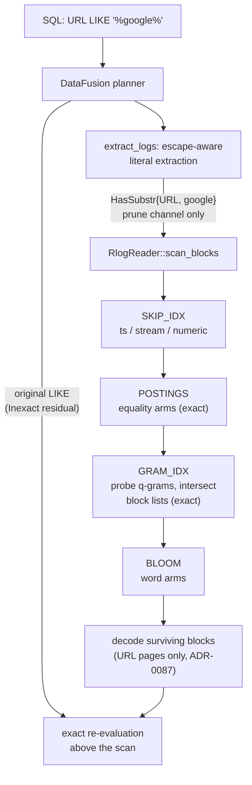

# ADR-0105: GRAM_IDX, byte-trigram block postings for infix substring pruning

Status: Accepted

## Context

ClickBench Q21-Q24 filter on infix substrings of very high cardinality
string columns:

```sql
WHERE URL LIKE '%google%'
WHERE Title LIKE '%Google%' AND URL NOT LIKE '%.google.%'
```

`LIKE` shipped with no pushdown at all, deliberately (#479): the extractor
recognizes the shape and contributes nothing
(`crates/ravel-sql/src/logs_pushdown.rs:16-33`, test `like_is_not_pushed`
at `logs_pushdown.rs:395`). Every such query is a full scan of the
column's pages, with the exact `LIKE` applied by DataFusion's residual
above the scan (`supports_filters_pushdown` returns `Inexact` for every
filter, `logs_pushdown.rs:4-7`, `logs_provider.rs:267`).

No existing structure can serve a substring prune:

- **HasWord/BLOOM are token-keyed and unsound for substrings.** The bloom
  and the `HasWord` arm (`crates/ravel-logseg/src/record.rs:251`) key on
  word tokens (docs/log-segment-format.md "Tokenizer": split on
  non-alphanumerics, lowercase). `LIKE '%foo%'` matches the value
  `"foobar"`, whose only token is `"foobar"`; a prune on
  `HasWord{word:"foo"}` drops the block holding that row. Unsound at any
  widening. This is issue #514.
- **POSTINGS is capped exactly where substring search matters.** POSTINGS
  (ADR-0049, docs/log-segment-format.md "POSTINGS") is a per-field sorted
  dictionary of whole distinct values. `postings_max_distinct` defaults to
  10,000 (`crates/ravel-logseg/src/writer.rs:62`); a field exceeding it in
  one object has its postings dropped for that object (`capped = 1`,
  `WriteStats::postings_capped_fields`). URL, Title, and SearchPhrase
  carry millions of distinct values over 100M rows, so they are capped in
  every object: there is no dictionary to scan, by design.

The columns in question are declared typed `Str` attribute columns
(ADR-0090, ADR-0100): dynamic attribute columns in FIELD_DIR
(docs/log-segment-format.md "FIELD_DIR"), materialized at query time from
the merged resource + scope + record attribute view
(`crates/ravel-sql/src/rlog_attrs.rs`, consumed by
`logs_scan.rs::declared_column_array`). They are postings-eligible in
principle (POSTINGS applies to dynamic attribute columns), which is what
makes the cap, not eligibility, the blocker.

### The granularity arithmetic that bounds any block-level index

This constraint shapes the whole design and must be stated before the
structure is chosen. RLOG blocks target 8192 records
(docs/log-segment-format.md "BLOCKS"; `block_target_records: 8192`,
`writer.rs:56`). 100M rows is roughly 12,200 blocks. Records sort
`(stream_ref ascending, ts ascending)`.

A prune-only structure selects candidate blocks. No sound candidate-block
selector, however precise, can return fewer blocks than the set that
physically contains matching rows. That floor is a property of the data
layout, not of the index. Under a uniform spread of matches, a needle
whose rarest gram occurs in a fraction g of rows leaves a block with zero
occurrences with probability about e^(-8192 g):

| rarest-gram row frequency g | blocks pruned (uniform spread) |
|---|---|
| 1e-2 (1 in 100)     | ~0%    |
| 1e-3 (1 in 1,000)   | ~0.03% |
| 1e-4 (1 in 10,000)  | ~44%   |
| 8.5e-5              | ~50%   |
| 1e-5 (1 in 100,000) | ~92%   |
| 1e-6                | ~99.2% |

A substring like `google` in 100M rows of web-traffic URLs plausibly
occurs in 0.5-3% of rows. Under a time-ordered, uniformly spread layout,
block pruning for Q21/Q22/Q24 is therefore approximately zero no matter
what structure sits under it, probabilistic or exact. Any design claiming
otherwise for those queries is claiming to beat arithmetic.

What an index CAN deliver, and what this ADR commits to:

- **Exactness down to the floor.** Where matches are rare or clustered,
  the index prunes to (nearly) exactly the blocks that can match,
  including to zero blocks when a needle's grams are absent from the
  whole object. Rare needles are the telemetry product's primary
  substring use case: a request id, an order token, an error fragment
  (`body LIKE '%order-4f3a9c%'` shaped queries), which sit far below the
  1e-5 row-frequency line where pruning removes >90% of blocks.
- **A quantified envelope for the operator.** The table above is the
  enablement criterion. An operator enabling the index for a field is
  buying pruning for needles below roughly 1 in 10,000 rows, or for
  layouts where matches cluster by stream (decision 8).
- **Honesty about Q21-Q24.** Whether ClickBench's specific needles fall
  inside the envelope depends on their measured frequency and on the
  load's stream layout. Decision 8 states the lever and the measurement;
  this ADR promises no speedup number for those four queries.

### Format ground rules

RLOG is a frozen persistent contract (docs/log-segment-format.md,
trailer version 3). A NEW OPTIONAL SECTION KIND needs no trailer version
bump: ADR-0029's versioning carve-out excepts it, because unknown section
kinds are already skipped by readers (docs/log-segment-format.md:116-117)
and an absent kind is already legal; POSTINGS itself (kind 6) shipped
under exactly this carve-out (docs/log-segment-format.md:802-809). Only a
change to an existing section's grammar, or to a kind's legality, needs a
trailer bump. This matters doubly pre-release: `SUPPORTED_VERSIONS` is a
single version, so a trailer bump would strand every stored object; an
additive section strands nothing and costs nothing to tenants who do not
enable it.

Migration class (ADR-0066 decision 4): Class A, RLOG bulk data object.
No version change, so no migration and no dual-reader window: an old
reader skips kind 7 and answers identically through bloom plus exact
scan; a new reader on an old object finds no section and degrades the
same way. Convergence is not required; objects written before a field is
enabled simply never prune substrings, and gain the section when
compaction rewrites them (decision 3).

## Decision

### 1. The structure: GRAM_IDX, exact byte-trigram block postings

A new optional section, kind 7, named GRAM_IDX. Kind 7 is free in the
SECTION kind registry, which uses 1..=6 today (STREAM_DIR, FIELD_DIR,
BLOCKS, SKIP_IDX, BLOOM, POSTINGS). Note for implementers: that registry
is NOT the page-encoding tag registry, where 7 already means the
dictionary encoding. The two tables both use small integers in the same
document and conflating them would be easy. Per enabled field, a
sorted dictionary of every distinct q-byte gram (q = 3, decision 2)
occurring in any row's resolved `Str` value, each gram mapping to the
sorted set of block indices holding at least one such row. The same
two-piece shape as POSTINGS: an eagerly-read sparse header plus
independently zstd-compressed, crc32c-verified gram blocks, so a probe
decompresses only the gram blocks its needle's grams land on.

The structure is exact, not probabilistic, at gram granularity: a probed
gram's block list is the complete truth for that field. False positives
exist only at needle granularity (all grams present in a block, but never
contiguously in one row, or spread across rows); false negatives are
impossible (decision 7's soundness argument). No approximation is
introduced anywhere in query results: the prune only ever widens the
scanned set relative to the true match set, and the exact `LIKE` is
always re-applied above the scan.

On-disk grammar, in the style of docs/log-segment-format.md. All
integers little-endian; "uvarint" is LEB128 as elsewhere in the format:

```
GRAM_IDX (section kind 7, optional; comp = none as a unit, zstd inside)

version: u8            (this section's own grammar version, = 1;
                        independent of the trailer version, same rule as
                        the POSTINGS version byte)
gram_len: u8           (q, bytes per gram; the writer emits 3; readers
                        accept 1..=8 and reject 0 or >8 as Corrupted)
field_count: u32 LE
repeat field_count, ascending column_id:
  column_id: uvarint
  capped: u8                     (0 = grams present, 1 = dropped: field
                                  exceeded gram_max_distinct)
  if capped == 0:
    stride: uvarint              (grams per gram block, > 0)
    gram_count: uvarint          (total distinct grams for this field)
    block_count: uvarint
    repeat block_count, ascending first_gram:
      first_gram: [gram_len]u8   (fixed width: grams are exactly q bytes)
      block_offset: u64 LE       (absolute offset from section start)
      block_stored_len: u64 LE   (compressed byte length)
      block_uncompressed_len: u64 LE
      block_crc32c: u32 LE       (over the stored/compressed bytes)
gram_blocks: [remaining bytes]   (concatenated zstd frames, field then
                                  block order, exactly at the offsets
                                  above; exact tiling required, as for
                                  POSTINGS)

one gram block's payload, before compression:

gram_count_in_block: uvarint     (<= stride)
repeat gram_count_in_block, ascending gram:
  gram: [gram_len]u8
  posting_count: uvarint
  repeat posting_count: delta-uvarint block index (first absolute, then
                                                   strictly increasing
                                                   deltas)
```

Differences from POSTINGS, each deliberate:

- Grams are fixed-width (`gram_len` bytes), so no per-term length prefix.
  Sort order is raw byte order.
- `gram_len` is stored data, not a format constant: a future q change is
  a new-objects data change under the same section version, not a format
  change (decision 2).
- Everything else copies POSTINGS: fixed-width offsets so the header's
  length is computable in one pass, exact tiling validation, per-block
  crc32c, whole-section `Section.crc32c` verified before the header is
  parsed, probe-time cross-check that a decompressed block's first gram
  equals its sparse entry's `first_gram` and every gram sorts below the
  next entry's. The checksum coverage map gains two rows mirroring the
  POSTINGS rows (header under the whole-section crc; one gram block under
  its per-block crc).

Validation additions to docs/log-segment-format.md's summary (all typed
`Corrupted`, never panics): unknown section version; `gram_len` of 0 or
above 8; field/gram/block counts over caps; non-ascending `column_id` or
`first_gram`; tiling gaps or overlaps; crc mismatches; a decompressed
length disagreeing with the declared one; postings not strictly
increasing; trailing bytes.

Keying: by dynamic `column_id`, exactly as POSTINGS. Only `(name, Str)`
columns are grammed in section version 1. The grammar's `column_id` space
also represents fixed columns (COL_BODY is 5), so gramming `body` later
is a writer capability addition, not a grammar change; it is out of scope
here. A gram-enabled name that occurs only at resource or scope level
gets a stub FIELD_DIR column so its grams have a column to key by, the
same mechanism indexed and numeric names already use
(docs/log-segment-format.md:243-261).

What the writer grams is the row's ONE resolved merged-view value, and
nothing else. The writer already resolves each record's merged view once,
and POSTINGS and SKIP_IDX are projections of that one resolved view
(docs/log-segment-format.md:501-504; `ResolvedRow.indexed_terms` and
`stat_winners`, `record.rs`). GRAM_IDX is a third projection of the same
view: for each enabled field, when the row's resolved winner for the name
is `Str`, every q-byte window of the winner's bytes is inserted with the
row's block index. A row whose winner is another type materializes NULL
in the declared `Str` column, and NULL never satisfies `LIKE`, so it
correctly contributes no grams. This single-resolution rule is what keeps
the section from disagreeing with what a reader materializes; it is the
ADR-0095 lesson applied to a new section.

Bounded size, without reducing to the POSTINGS cap: the dictionary is
keyed by grams, not values. Distinct 3-byte grams saturate toward the
alphabet cube (16.7M absolute; tens of thousands in practice for
URL/title text) regardless of how many distinct VALUES the field carries.
Row and value cardinality grow posting-list length (bounded by block
count) and not the dictionary. A safety cap `gram_max_distinct`
(RlogConfig, default 1,048,576) covers adversarial or binary-shaped
content; a field exceeding it in one object is dropped for that object
with `capped = 1` and a `WriteStats.gram_capped_fields` increment,
queried exactly as an un-grammed field. Unlike POSTINGS' cap, no
plausible text workload approaches it: ClickBench URLs sit two orders of
magnitude below.

An enabled field none of whose winners reaches q bytes emits no field
entry at all: absence already means "no information" and pruning nothing,
so omission keeps the absence rule uniform instead of adding an empty
entry with special semantics. (Such a field cannot contain any needle of
length >= q anyway; the omission costs no pruning that would have been
sound.)

New `WriteStats` counters, shaped like the POSTINGS ones (aggregate-only,
no per-field label, ADR-0044 allowlist): `gram_bytes`, `gram_fields`,
`gram_distinct_total`, `gram_distinct_max`, `gram_capped_fields`.

### 2. Gram size: q = 3, carried in the section header

Three-byte grams, over raw UTF-8 bytes (never code points).

- Smaller q prunes shorter needles but yields commoner grams (more
  false-positive blocks); larger q is more selective per gram but makes
  every needle shorter than q unprunable forever. q = 3 is the smallest
  gram that is selective enough to be worth a dictionary (q = 2 has at
  most 65,536 grams, nearly all of which occur in every block of URL
  text, so nearly every probe returns "all blocks"). q = 4 gains per-gram
  selectivity that the multi-gram intersection already recovers for
  needles of length >= 4, while permanently giving up all 3-byte needles
  and enlarging the dictionary (less intra-block sharing of longer
  grams). Needle-level selectivity is governed by the intersection of all
  the needle's gram lists, so the rarest gram dominates either way.
- **A needle shorter than q bytes gets no prune, by definition.**
  `%go%` (2 bytes) derives no 3-byte gram; the arm reports
  "no information", the candidate set is untouched, and the query is the
  same full scan plus exact residual it is today. This is the defined
  answer for the sub-gram case: fall back, never approximate.
- A needle of exactly q bytes (`%goo%`) derives one gram and prunes on
  that single list.
- `gram_len` is stored per object (decision 1), so the reader grams the
  needle by the object's own q. Revisiting q later means new objects
  carry a different byte and old objects keep pruning under theirs; no
  format change, no ADR.

### 3. Enablement: opt-in per field, a second list beside indexed_fields

Default off at every layer. Nothing is automatic: no cardinality trigger,
no heuristic (a trigger would make the section's presence, and therefore
query performance, vary silently per object; the operator decides, per
the project's opt-in ruling).

A SECOND, independent list, not an option on `indexed_fields`:

- Writer API: `RlogWriter::with_gram_fields(Vec<String>)`, beside
  `with_indexed_fields` (`writer.rs:151`). The two lists serve different
  predicates at different costs; either, both, or neither may name a
  field. Overloading one list would force every equality-indexed field to
  pay gram bytes and vice versa.
- Server policy: a `GramFieldConfig`/`GramFieldPolicy` pair beside
  `IndexedFieldConfig`/`IndexedFieldPolicy`
  (`services/ravel-server/src/postings_config.rs:59,83`), resolved per
  tenant through the same plumbing that feeds indexed fields to the log
  ingest router.
- Load mapping: an optional per-entry flag in the `--mapping` TOML
  (`services/ravel-cli/src/load.rs`, `AttrMap`), additive and defaulting
  to false:

```toml
[[attribute]]
key = "URL"
column = "URL"
type = "str"
gram_index = true
```

  `benchmarks/clickbench/hits.mapping.toml` sets `gram_index = true` for
  `URL`, `Title`, and `SearchPhrase`. The flag is loader configuration,
  not a frozen format; `deny_unknown_fields` on the mapping means old
  CLIs reject new mappings loudly rather than silently ignoring the flag.
- Compaction needs no tenant config: the compactor recovers which fields
  were grammed from the input objects' own GRAM_IDX field entries (a
  field entry, capped or not, marks the field), unions them across
  inputs, and passes the union to the output writer, exactly as
  `input_indexed_fields` already does for POSTINGS
  (`crates/ravel-maintain/src/rlog.rs:44,164-166,220-221,276`). The
  erasure rewrite path, which also rebuilds objects through the writer,
  follows the same recovery.

Non-`Str` entries with `gram_index = true` are rejected at mapping parse
(the index is defined over `Str` winners only).

### 4. Cost disclosure for the ClickBench `hits` shape

These numbers are what an operator needs to decide enablement; opt-in
changes who pays, not what it costs. Estimated, not measured; the
assumption that dominates the error bar is d, the distinct trigrams per
8192-row block per field, and the acceptance work below measures it.

Assumptions: 100M rows; 8192-row blocks (~12,200 across the dataset); L0
flush objects of ~10k rows (2 blocks) as the current ClickBench load
produces, L1 parts of hundreds to thousands of blocks after compaction;
URL averages ~80 bytes with d ~= 15k (range 8k-25k), Title ~60 bytes,
Cyrillic-heavy, d ~= 10k, SearchPhrase ~80% empty, d ~= 3k; delta-varint
posting entries ~1.2-1.5 bytes raw, zstd roughly halving dense lists.

| | URL | Title | SearchPhrase | three fields |
|---|---|---|---|---|
| L1 raw B/row        | ~2.2 | ~1.5 | ~0.5 | ~4.2 |
| L1 stored B/row     | ~1.2 | ~0.8 | ~0.25 | **~2.3** |
| L0 stored B/row     | ~6   | ~4   | ~1.5 | ~12 |

- L1 total for 100M rows: roughly 230 MB across the three fields. Against
  a stored object size assumed at 140-280 B/row (hits as Parquet is ~140
  B/row; the RLOG figure is unmeasured and assumed within 2x of it), the
  section is **~1-2% of L1 object size**. Even if every estimate here is
  4x too optimistic it stays under ~10%; nowhere near doubling.
- L0 objects pay proportionally more (~5-10% of object size) because the
  gram dictionary amortizes over only 2 blocks. L0 objects are transient:
  compaction replaces them with L1 parts, so the steady-state S3
  footprint is the L1 figure.
- Flush CPU: gramming is one pass over each grammed value's bytes with a
  set insert per window, comparable to the tokenizer-plus-bloom pass
  those same values already pay. Expected single-digit to low-teens
  percent flush CPU increase for a load gramming three fat columns; zero
  for loads gramming nothing. The ADR-0100 harness already reports load
  time, which is the measurement.
- A tenant enabling nothing pays nothing: no section bytes, no write
  CPU, no read cost, no reader code path taken.

WriteStats' `gram_bytes` (decision 1) makes the real per-load figure
observable, so the estimate above is checkable on the first real load,
not trusted.

### 5. Interaction with POSTINGS and BLOOM

GRAM_IDX complements both; it replaces and bypasses nothing. Per field
and probe kind:

| POSTINGS | GRAM_IDX | equality probe served by | substring probe served by |
|---|---|---|---|
| no  | no  | BLOOM exact-value (<=64B) + scan | scan only |
| yes | no  | POSTINGS (exact)                 | scan only |
| no  | yes | BLOOM exact-value + scan         | GRAM_IDX (exact to gram level) |
| yes | yes | POSTINGS                         | GRAM_IDX |

- A substring arm consults GRAM_IDX only. It never consults POSTINGS
  (whose whole-value dictionary is capped on exactly these fields, and
  whose terms a needle need not equal) and never consults BLOOM (token
  keys, the #514 unsoundness; restated as a rule, not a convention: the
  reader has no code path from a substring arm to a bloom probe).
- An equality arm consults POSTINGS and BLOOM as today; it never
  consults GRAM_IDX (it could, soundly, but POSTINGS is strictly
  stronger where present, and where absent the gram index would prune
  equality no better than the substring path already defines).
- Pipeline order in `RlogReader::scan_blocks`
  (`reader.rs:199-330`): SKIP_IDX candidates, then POSTINGS equality
  intersection, then GRAM_IDX substring intersection, then BLOOM word
  arms. All three intersect into the same candidate set; each is
  individually sound (widen-only), so intersection is sound. GRAM_IDX
  runs after POSTINGS so an equality prune that already emptied the set
  short-circuits the gram probes; within one substring arm, gram lists
  are probed rarest-first-is-unknowable so simply in needle order, and
  an absent gram short-circuits to an empty set immediately (the
  whole-object skip).
- On a field that is both indexed and grammed, both sections carry the
  field independently; a query with both an equality and a substring arm
  on it intersects both prunes.
- POSTINGS' cap and GRAM_IDX's cap are independent per-field, per-object
  events; either capping degrades only its own probe kind to "no
  information".

### 6. `NOT LIKE` gets no prune

Q23's `URL NOT LIKE '%.google.%'` contributes nothing to pruning, ever.
Two independent reasons, either sufficient:

- Structural: gram postings prove "no row of block B can contain the
  needle". Excluding B for a negated arm would require proving "every
  row of B matches the needle", a universal claim presence information
  cannot make. An index of per-block maximum match counts could, but
  nothing proposed here stores one.
- Economic: a negated common substring is satisfied by nearly every row
  (nearly all URLs lack `.google.`), so even a sound negative prune
  would remove approximately no blocks.

`NOT LIKE` stays residual-only. Q23's pruning comes solely from its
positive conjunct `Title LIKE '%Google%'`, and its negative conjunct is
evaluated exactly above the scan like any unextracted filter.

### 7. Query path: the predicate arm and the extraction

**The arm.** `Predicate` (`crates/ravel-logseg/src/record.rs:251`) gains:

```rust
/// Prune-only infix substring on a dynamic Str column's resolved
/// merged-view value. Drives GRAM_IDX block pruning through
/// scan_blocks' prune channel and nothing else; in the content
/// channel it matches every row (ADR-0095 decision 6's shape).
HasSubstr {
    field: FieldSel,
    needle: String,
},
```

The arm carries the needle, not grams: gram derivation happens in the
reader against the object's own `gram_len`, so q stays a per-object datum
(decision 2) and the SQL layer never learns it.

Prune-only is structural, not conventional, on three levels:

- The arm is emitted only into `LogsPushdown::prune`
  (`logs_pushdown.rs:80-99`), the channel `scan_blocks` consumes solely
  for candidate-set intersection and never per-row
  (`reader.rs:151-156,199-202`).
- Its content-channel evaluation is defined as match-all, exactly the
  `NumRange` rule (`record.rs`, NumRange arm doc; ADR-0095 decision 6),
  so even a mis-routed arm widens instead of filtering. It contributes no
  column to `content_columns` (`logs_scan.rs:269`, beside NumRange).
- `supports_filters_pushdown` stays `Inexact` for every filter, so
  DataFusion always re-applies the original `LIKE` above the scan
  (`logs_pushdown.rs:4-7`). A wrong prune can cost only speed.

**Reader integration.** `scan_blocks` resolves each `HasSubstr` arm:
`FieldSel::Attr(name)` to the `(name, Str)` FIELD_DIR column id; no such
column, no GRAM_IDX section, no field entry, `capped = 1`, or
`needle.len() < gram_len` all yield "no information" (`Ok(None)`, prune
nothing), the POSTINGS unindexed shape. Otherwise the reader derives the
needle's byte q-grams, probes each (binary search over `first_gram`,
decompress and crc-verify one gram block), and intersects the lists into
the candidate set; any absent gram empties the set. A corrupt section or
gram block degrades that arm to no pruning and sets a new
`ScanStats.gram_degraded` flag, mirroring `postings_degraded`
(`reader.rs:35-58`); results are never affected. A new
`ScanStats.blocks_after_gram` counter records the set size between
`blocks_after_postings` and `blocks_after_bloom`.

**Extraction.** In `extract_logs`/`walk_conjunct`
(`logs_pushdown.rs:117-153`), from top-level AND conjuncts only. The
constraints are settled and restated here, not redesigned:

- Extract only from patterns of the exact shape `%literal%`: leading and
  trailing unescaped `%`, and a literal containing NO unescaped `%` or
  `_` anywhere inside.
- Escapes resolve BEFORE wildcard analysis. In `%\%foo\%%` the needle is
  `%foo%`. An extractor that strips wildcards before resolving escapes
  gets this exactly backwards; the order is normative.
- Anything else is refused, never approximated: `_` anywhere unescaped,
  interior `%`, prefix/suffix-only patterns (`foo%`), non-literal
  patterns, and an empty literal (`LIKE '%%'` matches every non-null
  value; the arm would carry no gram and prune nothing anyway, so it is
  simply not emitted).
- Case-sensitive `LIKE` only. `ILIKE` remains native with no prune, for
  #479's original reason (ASCII-only folding diverges from the
  built-in's Unicode semantics); a case-insensitive prune is explicitly
  not designed here.
- DataFusion's `Like` carries `escape_char: Option<char>`; the extractor
  honors the default (`None`, backslash convention as above) and refuses
  any explicit non-default escape character rather than reimplementing
  its resolution.

Which column expressions are eligible: **declared `Str` columns only**
(a bare `Expr::Column` whose name is in the provider's declared list with
type `Str`; the provider owns that list, `logs_provider.rs:174`, and
passes it to extraction at `logs_provider.rs:305`).

`attrs['k'] LIKE '%lit%'` is deliberately NOT extracted, and this trap
deserves its own paragraph because it is the #514 class in new clothes:
the merged `attrs` map stringifies every value
(`rlog_attrs.rs::attr_value_to_string`), so `attrs['k'] LIKE '%4%'`
matches a row whose winner is `I64 42` via the string "42". GRAM_IDX
grams `Str` winners only, so pruning that predicate would drop a block
whose only match is a stringified non-`Str` winner. Unsound. Gramming
stringified numerics instead would freeze `ravel-sql`'s string formatting
into a persisted format, coupling two crates across a contract boundary;
rejected. On a declared `Str` column the hazard does not exist, because a
non-`Str` winner materializes NULL (ADR-0090 decision 7) and NULL never
satisfies `LIKE`.

One planner hazard is settled by decision rather than by reading
DataFusion's current source: the extractor recognizes whatever shape the
optimizer actually delivers to the provider's filter set (today
`Expr::Like`; some DataFusion versions rewrite substring `LIKE` into
other expressions, and if the shipped version does, the extractor must
match the rewritten shape too). The reachability test (decision 9) goes
through real SQL text end to end, so an upstream rewrite that changes
the shape turns the test red instead of silently killing the prune.

Data flow:



**Soundness: the false-negative argument.** Claim: for a needle n with
len(n) >= q bytes, no block containing a matching row is ever pruned.

SQL `LIKE '%n%'` on a Utf8 value v is character-substring containment.
UTF-8 encoding is injective and context-free (a character's bytes do not
depend on its neighbors), so character containment implies byte
containment: bytes(n) occurs contiguously in bytes(v). Every length-q
window of bytes(n) is then a length-q window of bytes(v). The writer
inserts EVERY length-q window of every resolved `Str` winner's bytes,
unconditionally; this universal quantifier is the entire soundness
anchor, and it is exactly what HasWord lacks (token keys are a strict
subset of byte windows, which is the #514 bug). Therefore every q-gram
of n carries the row's block in its posting list, the block survives the
intersection, and only blocks where some gram of n occurs in NO row's
winner are pruned; such a block cannot contain a match.

Degenerate cases, each with a defined answer:

- len(n) < q: n has no q-gram; the claim is vacuous and the reader
  derives no grams, prunes nothing (`%go%`).
- len(n) = q: one gram, one list, sound as a single intersection term.
- Empty needle: refused at extraction; a hostile arm still derives zero
  grams and prunes nothing.
- Multibyte UTF-8: the argument is byte-level throughout; grams may
  straddle character boundaries identically on both the write and probe
  sides, and no step assumes gram bytes form valid UTF-8.
- A needle whose q-grams start with a byte that cannot begin a valid
  UTF-8 sequence (a continuation byte 0x80-0xBF, from a window starting
  mid-character): a legal dictionary key like any other; ordering and
  probing are raw-byte, never UTF-8-aware.
- A value shorter than q bytes contributes no grams and can never
  contain a needle of length >= q (containment needs len(v) >= len(n)),
  so its omission prunes nothing sound away.
- A row whose winner is non-`Str` or absent: materializes NULL in the
  declared column; `LIKE` on NULL is not true; no gram owed.

### 8. The effectiveness envelope, stated as numbers

The Context table is normative for enablement guidance and is restated
in the operator docs verbatim: under uniform spread and 8192-row blocks,
half the blocks are pruned only when the needle's rarest gram occurs in
fewer than ~1 in 11,800 rows, and >90% only below ~1 in 100,000. The
floor no index can beat is the set of blocks physically containing
matches.

For ClickBench specifically:

- Q21/Q22/Q24 (`URL LIKE '%google%'`): the needle's grams plausibly
  occur in 0.5-3% of rows. Under the current time-ordered layout the
  expected block prune is approximately zero, and this ADR says so
  rather than implying otherwise. These queries remain full scans of the
  URL column's pages; their speed is owned by the scan path (page-level
  projection, ADR-0087; columnar decode, ADR-0099), and the gram probe
  adds a bounded, small per-object cost (one section header parse plus
  at most len(needle)-q+1 gram-block decompressions).
- Q23 (`Title LIKE '%Google%'`): case-sensitive capital-G `Google` in
  mostly-Russian titles is plausibly one to two orders rarer; whether it
  crosses the 1e-4 line is a measurement, not a claim.
- The layout lever: blocks sort stream_ref-major
  (docs/log-segment-format.md "BLOCKS"), so putting `CounterID` (the
  site id) in `[[resource_attribute]]` clusters each site's rows into
  contiguous blocks. Site-homogeneous columns like URL and Title then
  concentrate their gram sets per block, and a needle absent from a
  site's corpus prunes that site's blocks wholesale. This is a mapping
  recommendation with a real trade (it raises stream cardinality to the
  distinct-CounterID count and changes STREAM_DIR size), flagged here,
  decided in the benchmark mapping, not silently assumed.
- The settling measurement, which acceptance requires and no prose can
  replace: load the 100M dataset, run Q21-Q24, and report
  `blocks_after_gram / blocks_after_postings` per query from ScanStats,
  under both mappings (with and without CounterID as a resource
  attribute). The ADR promises the mechanism and its costs; it promises
  no speedup number for these four queries.

Where the index unambiguously pays, independent of ClickBench: needles
below the 1e-5 line (request ids, tokens, rare fragments) prune >90% of
blocks even uniformly spread, and a needle absent from an object empties
the candidate set at the cost of a few gram probes, skipping the object's
data pages entirely. That is the telemetry search shape this database
exists for, and it is the primary justification for the section; ClickBench
Q21-Q24 is the honest stress case, not the showcase.

### 9. Test strategy

The project has shipped fast paths that were individually correct and
never taken, three times in one week. The tests below are ADR content,
not implementation detail, and each names what mutation proves it can
fail.

**Differential, adversarially generated.** A proptest generator produces
(block contents, needle) pairs biased toward non-superset-exposing
shapes: rows that collectively contain all of a needle's grams while no
single row contains the needle ("gram soup"); grams present in one row
but non-contiguous or reordered; the needle split across two adjacent
rows; needles at the exact start and exact end of values; len(needle) in
{q-1, q, q+1}; values shorter than q; multibyte values where the needle's
byte-grams straddle character boundaries; winners resolved from the
stream layer only; non-`Str` winners under the same name. The property:
`scan_pruned(content, [HasSubstr])` returns a row set identical to
`scan(content)` filtered by exact byte-substring, and separately, every
block containing a matching row is in the survivor set. At the SQL
layer: the full query result with pushdown enabled equals the result
with pushdown disabled, row for row.

**Mutations that must turn a test red** (run deliberately once, per the
prove-the-test discipline):

- Writer drops the last window of each value (off-by-one in the window
  loop): the needle-at-end-of-value cases fail the differential.
- Writer grams the per-record layer instead of the resolved winner: the
  stream-layer-only cases fail.
- Reader unions gram lists instead of intersecting: widen-only, so the
  differential stays green, and the fixed-fixture candidate-set EQUALITY
  assertion (below) is what fails; this is why an equality assertion
  exists at all.
- The arm is evaluated per-row in the content channel: the gram-soup and
  stream-layer cases fail (rows dropped that the residual cannot
  recover).
- Extractor strips wildcards before resolving escapes: the fixture
  asserting the extracted needle for `%\%foo\%%` is exactly `%foo%`
  fails.
- Gramming by characters instead of bytes: the multibyte straddling
  cases fail.

**Magnitudes, never directions.** On a frozen fixture (fixed rows, fixed
block boundaries), assert the EXACT surviving candidate-block set, the
exact `blocks_after_gram` value, and the exact GRAM_IDX section byte
length; the writer's determinism guarantee (identical input, byte
identical output, `writer.rs:9`) makes exact equality viable and strictly
stronger than any band. No assertion of the form `> 0` or "fewer than
before" anywhere in the suite: those hold when the figure is a fraction
of the truth.

**Reachability in a real plan.** End to end through real SQL text
(SessionContext against `LogsTableProvider` with a declared `Str`
column): run `... WHERE URL LIKE '%needle%'` and assert (a) the
extraction produced the `HasSubstr` prune arm, and (b) `blocks_after_gram`
equals the exact planted value on a fixture engineered so ONLY the gram
prune can drop those blocks (uniform ts so SKIP_IDX drops none, one
stream, no equality arms so POSTINGS drops none, and BLOOM structurally
cannot act on substring arms). Real SQL text, not hand-built `Expr`s, so
a DataFusion upgrade that rewrites the `LIKE` shape turns this red
instead of silently orphaning the extractor (decision 7). The e2e shape
follows `typed_attr_column_reachability_e2e.rs` (ADR-0090).

**Format-change obligations** (procedure steps 5 and 6): fuzz and
property tests for the section decoder over corrupt, truncated,
mis-tiled, crc-flipped, over-cap, and mis-versioned inputs, every
rejection a typed `Corrupted`; round-trip property tests for the gram
block codec; `ravel-cli` object inspectors print the new section's
fields (version, gram_len, per-field gram counts, capped flags).

**Benchmark acceptance.** The ADR-0100 harness runs Q21-Q24 three times
(min/median/max) with the gram fields enabled and disabled in the
mapping, publishing the ScanStats prune fractions beside the latencies.
The published number is whatever it is; decision 8 already commits to
that honesty.

## Rejected alternatives

- **Widening HasWord/BLOOM to serve substrings.** Token keys are not a
  superset of substring occurrence (`"foobar"` tokenizes to itself;
  needle `foo` misses it). Unsound at any widening; this is issue #514,
  the defect that motivated the ADR. The tokenizer is also a normative
  frozen part of the format (docs/log-segment-format.md "Tokenizer"), so
  redefining tokens to include substrings would change word semantics
  everywhere.
- **Uncapping POSTINGS and scanning the whole-value dictionary with the
  pattern.** Reintroduces exactly the per-distinct-value explosion the
  cap exists for (millions of URL values per object, ~4-7 B/row for the
  dictionary alone), adds a per-query scan over millions of terms, and
  still cannot beat the block floor: the matching values' block-list
  union is the same set of blocks the matching rows live in.
- **Per-block bloom-of-grams (the ClickHouse ngrambf shape).** Sound
  (false positives only, and it would be declared as such), but it loses
  to exact postings on every axis that matters here: no empty-
  intersection whole-object skip without probing every block's filter;
  comparable size at equal power (~9.6 bits per distinct gram per block
  against ~1.2 stored bytes per gram-block posting entry, and the
  posting lists zstd-compress while bloom bits do not); no exact
  prune-to-zero; and a second probe machinery where the POSTINGS one
  already exists, is validated, and has its checksum discipline written
  down. The block-granularity arithmetic in Context applies to it
  identically, so it buys no effectiveness either.
- **Suffix array or FM-index per block.** Answers row-granular queries a
  prune-only design must not ask (the prune selects candidate blocks and
  never rows, by invariant), and costs 4-8 bytes per indexed byte, two
  orders over budget (~400 B/row for URL alone against decision 4's
  ~1.2 B/row).
- **Character (code-point) grams.** Requires UTF-8 decoding on the write
  path and boundary rules on probe, and is strictly dominated: character
  containment implies byte containment, so byte grams are sound, simpler,
  and handle needle windows that straddle multibyte characters, which
  character grams cannot represent at all.
- **q = 2 or q = 4.** q = 2's gram space is too common to prune anything
  on text columns; q = 4 permanently abandons 3-byte needles and grows
  the dictionary, while the intersection over q = 3 lists already
  recovers long-needle selectivity (decision 2).
- **Automatic enablement (cardinality trigger, all declared Str
  columns).** Contradicts the opt-in ruling; imposes decision 4's cost
  on every tenant; makes per-object query performance depend on data
  values silently. POSTINGS' own cap history shows what happens when a
  structure's applicability is decided by observed cardinality: it gets
  capped on exactly the columns that motivated it.
- **Sub-block prune granularity (pages, row ranges).** The I/O unit is
  the block: pages are per-block, framed and checksummed by the block's
  SKIP_IDX entry, so sub-block pruning saves only post-read CPU, for
  which cheaper levers exist (page projection ADR-0087, dictionary-page
  evaluation below), and it breaks the prune-selects-blocks invariant.
- **Shrinking blocks to raise prune resolution.** `block_target_records`
  is already configuration; at 1024 rows the half-pruned threshold moves
  only to ~1 in 1,500 rows, still far above `%google%` frequencies, and
  every block-proportional structure (SKIP_IDX, BLOOM) inflates for the
  whole load. Not a substitute for an index and not taken as one.
- **Evaluating LIKE once per dictionary entry on dictionary-encoded
  pages.** A real CPU lever, but it is scan-path work, not a persisted
  index, and it likely does not reach these columns: `encode_strings`
  chooses dictionary only at distinct/total <= 0.5
  (docs/log-segment-format.md "String codec layouts"), which
  high-cardinality URL pages in an 8192-row block typically exceed.
  Noted for the scan path's own backlog; out of scope here.

## Consequences

- **Additive and inert until asked for.** No trailer version bump
  (ADR-0029 carve-out; POSTINGS precedent,
  docs/log-segment-format.md:802-809). An old reader skips kind 7
  (unknown-kind rule, docs/log-segment-format.md:116-117) and answers
  every query identically through the existing paths; a new reader on an
  old or un-enabled object finds no section and degrades the same way;
  absence is legal and never corruption. A tenant that enables nothing
  pays nothing, in bytes, write CPU, and read work. No stored object is
  touched by shipping this.
- **The price, plainly.** ~2.3 stored bytes per row for the three
  ClickBench columns at L1 (~230 MB per 100M rows, ~1-2% of object
  size), several-fold more per row on transient L0 objects, and
  single-digit to low-teens percent flush CPU on loads that gram fat
  columns. Estimates, with `gram_bytes` and the load harness making the
  real figures observable on first contact.
- **What Q21-Q24 get is measured, not promised.** Under the current
  layout, arithmetic bounds the block prune for `%google%` near zero and
  this ADR says so; the honest expected wins are Q23's rarer needle,
  the CounterID-clustered mapping variant, and the sub-1e-4 needles of
  real telemetry search. If the measured prune on the four queries is
  ~zero, the documented position is that those queries are scan-bound
  and their budget belongs to ADR-0087/ADR-0099 scan work; the index is
  not the tool for uniformly common substrings and does not pretend to
  be.
- **Docs move in the same commit** (project rule):
  docs/log-segment-format.md gains the GRAM_IDX section (registry row,
  grammar, checksum coverage rows, pruning-soundness bullet, validation
  summary entries); the operator guides gain the enablement surface and
  the effectiveness table; README's query notes gain the LIKE pushdown
  status. `ravel-cli` inspectors print the section.
- **ADR-0093 adjacency.** ADR-0093 (skip-index and postings pushdown for
  declared typed columns) is a claimed stub; this ADR's declared-column
  resolution in the extractor (bare column name to `FieldSel::Attr`)
  overlaps its territory. The overlap is named here so the two land
  coherently; this ADR does not redesign equality or range pushdown.
- **Known non-goals carried forward.** `ILIKE` has no prune
  (case-insensitive pruning is not designed, per #479's semantics
  argument). `NOT LIKE` has no prune (decision 6). `attrs['k'] LIKE` has
  no prune (the stringified-numeric trap, decision 7). Prefix/suffix
  patterns (`foo%`) are refused today; extracting their literals into
  the same gram probe is sound and left as a follow-up. Gramming `body`
  is representable in the grammar and left as a writer follow-up.
- **Open measurements, named.** Three numbers decide how good this is in
  practice, and none is knowable from the tree: d (distinct grams per
  8192-row block per field, the dominant size-estimate term), the
  rarest-gram row frequencies of the ClickBench needles (which side of
  the envelope each query falls on), and the flush CPU delta. The first
  load with `gram_bytes`, the ScanStats fractions from the Q21-Q24 runs,
  and the harness load-time report settle them respectively.
