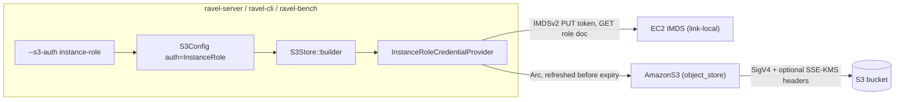
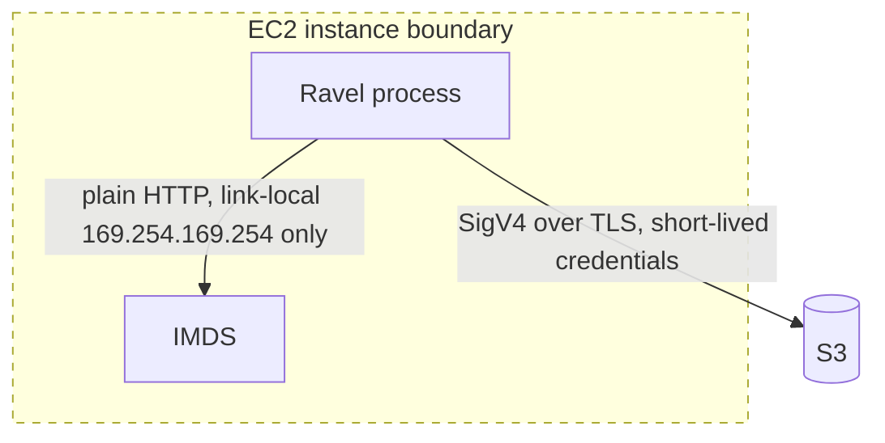

# ADR-0106: S3 credentials from EC2 IAM instance roles

Status: Accepted

## Context

Ravel stores everything in S3-compatible object storage. Every shipping
binary that talks to S3 needs a static key pair today: `S3Config`
requires `access_key_id` and `secret_access_key`, and ravel-server and
ravel-cli refuse to start with `--store s3` unless `RAVEL_S3_ACCESS_KEY`
and `RAVEL_S3_SECRET_KEY` are set (`services/ravel-server/src/store.rs`,
`services/ravel-cli/src/store.rs`).

ADR-0072 softened this for rotation: `S3Config` accepts a temporary
`session_token` and a `credentials_file` that an external process
rewrites, with the store picking up changes on the request path. Ravel
still never calls STS itself, and neither knob is plumbed into any
binary: the flags decision 1 specified were never landed.

On EC2 the platform-native answer is different: attach an IAM role to
the instance, and applications fetch short-lived credentials from the
instance metadata service (IMDSv2) on the link-local address
169.254.169.254. No static key exists to store, rotate, or leak, and
the role's permissions follow the instance. A Ravel server deployed on
EC2 should work that way: `--store s3` with a bucket and a region and
no keys at all.

Two constraints come from the codebase rather than the platform:

- `S3Config`'s stated contract (`crates/ravel-object-store/src/s3.rs`):
  "No environment or credential-chain magic: every value that changes
  behavior is a field here." Whatever we adopt must be selected
  explicitly, not inferred from absence.
- object_store 0.14 contains an IMDS credential provider
  (`InstanceCredentialProvider`) but it is `pub(crate)` and activates
  implicitly whenever no static or container credential is configured.
  We cannot name it, configure it, bound its timeouts, count its
  failures, or test it against a mock endpoint.

## Decision

Add an explicit authentication mode to `S3Config` and implement the
instance-role credential source ourselves inside ravel-object-store,
following the `FileCredentialProvider` pattern from ADR-0072.

### Config surface

```rust
pub enum S3AuthMode { Static, InstanceRole }

pub struct S3Config {
    // ... existing fields unchanged ...
    pub auth: S3AuthMode,                           // default Static
    pub instance_metadata_endpoint: Option<String>, // test seam; None = AWS link-local
}
```

- `Static` (default) behaves exactly as today: keys required. MinIO,
  on-prem, and existing deployments see no change.
- `InstanceRole`: inline `access_key_id`, `secret_access_key`,
  `session_token`, and `credentials_file` must all be absent.
  Construction fails with a typed error otherwise. There is no
  precedence question because mixing modes is refused outright.
- The library-level `instance_metadata_endpoint` override lets tests
  point at a mock IMDS on localhost. Shipped binaries expose it as
  `--s3-instance-metadata-endpoint` /
  `RAVEL_S3_INSTANCE_METADATA_ENDPOINT`. This is an operator-facing
  knob on the same trust boundary as every other `--s3-*` flag:
  whoever sets argv already owns the machine. Tenants never reach this
  surface, so it does not widen the SSRF attack surface; the default
  stays the AWS link-local address.

### Provider behavior

A new `InstanceRoleCredentialProvider` implements
`object_store::CredentialProvider`, the same seam
`FileCredentialProvider` uses through `with_credentials`:

- IMDSv2 only: PUT for a session token, then GET the role document
  (`AccessKeyId`, `SecretAccessKey`, `Token`, `Expiration`). No IMDSv1
  fallback; a 403 from the metadata endpoint is an error, not a signal
  to downgrade.
- Eager first fetch at construction: a server misconfigured for EC2
  fails at startup with a typed error instead of failing its first
  request.
- Credentials are cached and refreshed before expiry (5 minute margin).
  Every IMDS call carries a bounded timeout; construction never hangs
  indefinitely.
- Transient refresh failures keep serving the cached credential while
  it remains unexpired. Once expired, requests fail typed, the failure
  counter increments, and warnings are rate-limited (60 s) through the
  same injected-clock seam `FileCredentialProvider` uses. Serving an
  expired credential silently would turn one IMDS outage into a stream
  of confusing S3 403s.
- A manual `Debug` impl redacts secrets. Credentials live only in
  memory: never on disk, never in logs.
- `S3Store::builder` installs the provider via `with_credentials` and
  skips the inline key setters in this mode.

HTTP calls use `reqwest`, already in `[workspace.dependencies]`. No new
external dependency enters the workspace.

### Binary surface

- ravel-server and ravel-cli gain `--s3-auth <static|instance-role>`
  (default `static`). Under `instance-role`, `RAVEL_S3_ACCESS_KEY` and
  `RAVEL_S3_SECRET_KEY` stop being required; bucket and region
  semantics are unchanged. Both binaries also take
  `--s3-instance-metadata-endpoint` /
  `RAVEL_S3_INSTANCE_METADATA_ENDPOINT`, which defaults to the AWS
  link-local address and exists so tests and unusual deployments can
  redirect IMDS.
- While touching the same argument plumbing, land the two flags ADR-0072
  decision 1 specified but no binary ships: `--s3-session-token` and
  `--s3-credentials-file`. The mechanism is identical and adds no new
  design.
- ravel-bench's `s3_config_from_env` gains the same mode switch so
  benchmark runs on EC2 need no baked keys.

### What does not change

- `Capabilities` stays untouched: credential sourcing is a constructor
  concern invisible to the `ObjectStoreBackend` trait and to
  `check_capabilities`.
- SSE-KMS (`kms_key_id`) works unchanged because S3 performs the KMS
  call server-side on every PUT. Deployment docs must state that the
  instance role needs `kms:GenerateDataKey` and `kms:Decrypt` when
  SSE-KMS routing is enabled.
- No persistent format, object key layout, proto schema, or commit
  protocol changes. EKS IRSA and ECS task roles are out of scope and
  fit later as additive enum variants.

## Structure

Credential and data flow:



Trust boundaries:



The only issuer of credentials is IMDS on the link-local address,
reachable solely from the host itself. Credentials never touch disk or
logs inside the boundary.

## Rejected alternatives

- Implicit fallback through object_store's built-in selection (omit
  keys, let the builder pick its internal IMDS provider). Rejected:
  violates the "no credential-chain magic" contract, fails lazily on
  the first request rather than at startup, offers no failure counters
  or timeout bounds, and couples behavior to `pub(crate)` internals we
  cannot test against a mock endpoint.
- Full AWS default credential chain (env vars, shared config files,
  web identity, ECS container credentials, IMDS). Rejected for v1: the
  issue asks for EC2 instance roles, each additional source multiplies
  the fault-injection test surface, and more sources make startup
  failures harder to explain. Additive enum variants keep the door open.
- aws-sdk-rust credential chain. Rejected: pulls a large dependency
  tree into ravel-object-store for two HTTP calls to a documented
  link-local API.
- Keep ADR-0072's `credentials_file` as the EC2 story (an external
  sidecar rotates a file). Rejected: still places long-lived material
  on disk and adds a moving part per instance, which is exactly what
  instance roles remove.

## Consequences

- Roughly one provider (~300 lines) plus fault-injection tests in
  ravel-object-store, and small flag plumbing in three binaries.
- EC2 deployments drop static keys entirely; the role's policy becomes
  the single place permissions are managed, including SSE-KMS key
  access.
- Failure modes become explicit and counted: startup fail-fast for a
  missing role, typed request failures after credential expiry during
  an IMDS outage, rate-limited warnings, an observability counter in
  the shape of the existing `credential_rotation_failures`.
- `docs/object-store-contract.md`'s Credentials section and the README
  quickstart gain the mode; documentation lands in the same commit as
  the behavior, per repo rules.

## Test plan sketch

- Provider unit tests against a local mock IMDS (via
  `instance_metadata_endpoint`): happy path fetch, refresh before
  expiry using the injected clock, last-good within validity, typed
  failure after expiry, rate-limited warning, counter increments,
  v1-downgrade refusal, bounded-timeout construction failure.
- Builder tests mirroring `session_token_reaches_the_builder` and
  `credentials_file_wins_over_inline_credentials_and_token`:
  mode-specific builder shape, mixed-mode rejection.
- Server reachability test through the real entry point: boot
  `build_store` with `--store s3 --s3-auth instance-role` pointed at
  the mock IMDS and assert the constructed backend serves reads,
  proving the capability is reachable from the shipped binary path,
  not just unit-tested in the crate.
