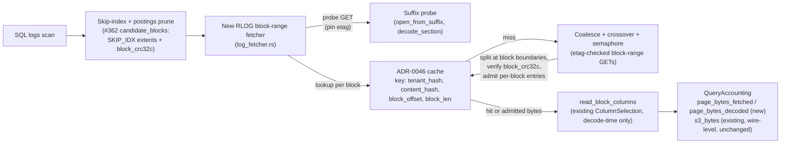

# ADR-0107: Pruning-proportional block-range fetches for logs scans

Status: Proposed

## Context

Every RLOG logs scan issues one whole-object `GET` per candidate segment
(`crates/ravel-query/src/log_fetcher.rs:571,708,737`, `GetRange::Full`
throughout, module doc at `log_fetcher.rs:29-30`), regardless of how few
blocks in that segment actually survive pruning. On a wide-schema,
low-selectivity analytical query — the exact shape epic #421 exercised —
this fetches every byte of every candidate segment even when the skip
index and postings (`#278`/`#362`) narrow the real candidate-block set to
a handful.

The RSEG path already solves this for metrics: `SegmentFetcher`
(`crates/ravel-query/src/fetcher.rs`) coalesces the wanted byte ranges
(`coalesce_ranges`, `fetcher.rs:327-339`) within a `DEFAULT_COALESCE_GAP`
of 64 KiB (`fetcher.rs:74`), falls back to a whole-object read below
`DEFAULT_WHOLE_OBJECT_THRESHOLD` of 512 KiB (`fetcher.rs:84`) where ranged
GETs cost more than they save, and bounds concurrent GETs through a shared
`Semaphore` (`fetcher.rs:90-96`). RLOG has no equivalent: `log_fetcher.rs`
has never had a coalescing or ranged path (RSEG and RLOG deliberately never
share fetch code — `log_fetcher.rs:4-6`), even though `RlogRangeReader`
(`crates/ravel-logseg/src/ranged.rs`) already reads RLOG blocks by byte
range for `ravel-maintain`'s k-way compaction merge
(`crates/ravel-maintain/src/rlog.rs:111,154,162,224,409`). ADR-0087
explicitly anticipated this as later work: "`RlogRangeReader`... already
exists for per-stream block-range reads and is the natural target for a
later range-read change, out of scope here" (0087, near line 85).

`RlogRangeReader`'s existing API is shaped for compaction, not query: it
returns one stream's full block span (`StreamBlockSpan`, `ranged.rs:37-64`)
or one block at a time (`StreamBlockLoc`, `ranged.rs:73-90`) for a bounded
streaming merge over one stream. A query scan needs the opposite shape —
an arbitrary, multi-stream candidate-block-index set (whatever the skip
index and postings pruned to) turned into coalesced byte ranges, the way
`SegmentFetcher::ensure_ranges` does for RSEG pages. `RlogRangeReader`'s
own span/streaming types are the wrong shape for that and are not reused;
what the new fetcher does reuse is the lower-level suffix-probe primitives
`RlogRangeReader` is itself built on — `open_from_suffix` and
`decode_section` — for the one probe GET this ADR's protocol needs (see
Decision 1). `RlogRangeReader` has no `ColumnSelection` coupling at all
(grep confirms zero references) and none is needed for what this ADR
ships — see the scope correction below.

### The scope correction this ADR makes: column-level fetch savings are not available today

The originating epic (#363) was written expecting per-block **column**
projection to shrink bytes on the wire — "fetch only the pages a
`ColumnSelection` needs." That is not achievable without a frozen-format
change, and this ADR does not attempt it. `read_block_columns`
(`crates/ravel-logseg/src/block.rs:618-650`) computes `block_crc32c` over
the block's **entire** stored bytes before any column filtering — the
function's own doc says every page descriptor is parsed and every page's
extent walked regardless of the column filter, because there is nothing
smaller than the whole block that carries its own integrity check. The
format doc is explicit that this is a deliberate choice, not an oversight:
"a whole-section crc could not be verified without fetching the whole
section, defeating the point" (`docs/log-segment-format.md:901-904`), which
is why BLOCKS/BLOOM checksum at block granularity. RSEG, by contrast,
carries a per-page crc (`docs/segment-format.md:534,645`) — proven
precedent for verifiable sub-object fetches, just not one RLOG's current
version has.

Fetching a sub-range of a block's pages without a page-level checksum to
verify against means trusting an unverified partial read — silently
weakening the read-path integrity guarantee every other fetch in this
codebase upholds. That is not a trade this ADR is willing to make for a
wiring change. What block-range fetching *does* buy, without touching the
format at all, is skipping whole **blocks** that pruning already proved
irrelevant — bytes proportional to row/time selectivity, not to column
count. Column projection continues to do exactly what it does today:
decode-time savings on top of whatever bytes arrive.

No weaker middle path exists between "whole object" and "column pages"
either: pages carry no implicit codec checksum to fall back on (a page is
a raw or zstd-compressed byte run — `crates/ravel-logseg/src/page.rs` —
with no per-page content checksum of its own), crc32c's linearity can't
assemble a whole-block CRC from sub-ranges without stored CRCs of the
unfetched ranges (which don't exist), and structural validation alone is
provably insufficient — the format's own history records a POSTINGS
header that was once checked only structurally and let a single flipped
byte route a lookup to the wrong block undetected
(`docs/log-segment-format.md`, POSTINGS section). The block is the
smallest unit this format can verify, full stop.

## Decision

Add a new, RLOG-specific coalescing block-range fetcher in
`ravel-query::log_fetcher`, mirroring `SegmentFetcher`'s protocol (gap
coalescing, whole-object crossover, etag pinning, a shared GET semaphore)
as its own implementation rather than a shared abstraction — RSEG and RLOG
object layouts differ enough (segment header vs. section directory) that a
real shared type would need leaky per-format branches; two small,
independently testable fetchers stay clearer than one with conditionals.

1. **Candidate-block-set fetch, whole blocks only.** A new method takes
   the tenant's already-pruned candidate block-index list for a segment
   (#362's `candidate_blocks` output carries each surviving block's
   SKIP_IDX extent and `block_crc32c`, decoded once during pruning) and:
   - A wanted block's byte range is always its **full extent** from its
     SKIP_IDX level-0 entry, never a sub-block slice; coalescing unions
     whole-block extents. Gap bytes fetched between coalesced blocks are
     never interpreted and never verified — the same standing property
     pad bytes already have under the format's whole-object BLAKE3.
   - Coalesces the wanted blocks' byte ranges within a gap threshold
     (start at RSEG's 64 KiB and confirm empirically for RLOG's block
     size distribution during decompose).
   - Two independent crossovers, not one: a **size-threshold, pre-probe**
     whole-object read when the segment's object size (carried on the
     commit record, same source `SegmentFetcher` uses) is at or below a
     threshold — this is the crossover `SegmentFetcher` actually has, and
     matters most today since RLOG objects are mostly small
     (`log_fetcher.rs:29-30`); and a **coverage-based, post-pruning**
     fallback to one whole-object GET when the coalesced ranges from the
     candidate-block set already cover most of the object — this second
     crossover is new, invented for this ADR, and is not a claim about
     RSEG's behavior. Both thresholds are decompose-time measurements,
     not ADR decisions.
   - **Etag pinning across every GET in the sequence is mandatory, not
     optional** — the fourth leg of the mirrored protocol alongside
     coalescing, crossover, and the semaphore. The current single-GET
     `log_fetcher.rs` funnel can never observe an etag change mid-fetch
     (one GET, one object state); this ADR's multi-GET sequence removes
     that property and must replace it explicitly, mirroring
     `SegmentFetcher`'s `suffix_etag` / `FetchError::EtagChanged`
     (`fetcher.rs:130-146,532-535,605-608`). Whether the pinned etag is
     the one #362's own pruning-time read of SKIP_IDX already observed
     (reused, no extra GET) or one this fetcher establishes itself with
     its own lightweight probe (an added GET, only if pruning's interface
     doesn't carry the etag forward) is a #362/#363 interface question
     for decompose, not an ADR decision — either way, every block-range
     GET this fetcher issues checks against whichever etag was current
     when the block extents it's trusting were read.
   - A `NotFound` on any GET in the sequence (probe or block range) maps
     to the same `SnapshotInvalidated` path a whole-object `NotFound`
     already takes for a pinned segment (ADR-0018's compaction-race
     mapping, `0018-l0-l1-compaction.md:203`), with one retry. Data
     objects are immutable, so a `NotFound` here always means the
     segment was compacted away and deleted after the query's protection
     horizon should have covered it, not a torn read; this widens the
     window in which that race is *observable* (multiple GETs instead of
     one) without introducing a new failure mode.
   - Bounds concurrency through the same shared-semaphore pattern
     `SegmentFetcher` uses, sized independently for RLOG's call volume.
2. **Cache key needs no schema change.** `CacheKey` is already
   `(tenant_hash, content_hash, offset, len)` (ADR-0046, confirmed current
   at `crates/ravel-cache/src/key.rs`), which is range-shaped today purely
   because RSEG needed it. Decision 3 below instantiates `offset, len` as
   each block's own extent, `(block_offset, block_len)` — no new fields,
   just a different, per-block value at admission time.
3. **Cache admission is per block, not per coalesced GET.** A coalesced
   GET can span several blocks plus unverified gap bytes with no single
   checksum covering the whole response, so this ADR does **not** mirror
   RSEG's admit-the-coalesced-range behavior here: before admission, the
   fetcher splits each GET's response at block boundaries (using the same
   SKIP_IDX extents it fetched by) and caches one entry per block, keyed
   `(tenant_hash, content_hash, block_offset, block_len)`. Gap bytes
   between blocks are discarded, never cached, never interpreted. This
   makes the corrupt-hit gate literally true as stated — a cache hit for
   a block-keyed entry is `block_crc32c` over exactly that entry's bytes,
   the identical check a live fetch of that block already runs (ADR-0046
   §4) — and it composes across queries whose candidate-block sets
   differ, which RSEG's page-selection sets rarely do but RLOG's
   predicate-driven sets will. The new fetcher is the admitting funnel
   ADR-0046 §4 requires to take responsibility for "bytes that were never
   the named range to begin with": here that means never admitting an
   entry that isn't exactly one whole block's verified bytes, and
   exercising ADR-0046's corrupted-hit acceptance test against this
   fetcher specifically.
4. **Read accounting: page_bytes_fetched vs. page_bytes_decoded.** Every
   `PageDesc` already carries its own `len`/`uncomp_len`
   (`crates/ravel-logseg/src/page.rs:21-26`), and `pages_decoded`/
   `pages_skipped` are already accumulated per query (`DecodedBlock`,
   `block.rs:474-475,681-733`, exposed via `ColumnarBlockView`,
   `columnar.rs:110-117`). Sum the already-available page lengths into a
   `page_bytes_fetched`/`page_bytes_decoded` pair on
   `QueryAccounting`/`AccountedOp` (`ravel_types::accounting`), named and
   defined precisely: stored bytes of pages present in fetched blocks,
   versus stored bytes of pages actually decoded after column filtering.
   This pair measures decode-time column-filtering waste; it is **not**
   wire-level accounting and must not be read as such — actual bytes
   moved over the wire stay measured by the existing `s3_bytes` on
   `AccountedOp::Get`, unchanged by this ADR. No new data is computed —
   this is wiring, not a new mechanism — and it is the instrument that
   would make a future column-level ADR's case with real numbers instead
   of estimates.
5. **Cache sizing guidance** for analytical deployments derives from
   measured block-range working sets once (1) ships, not from the
   metrics-oriented 256 MiB default (`services/ravel-server/src/
   config.rs:976`).

### Data flow

### Explicitly out of scope

- **Column-page-level fetch savings.** Requires a new RLOG format change
  carrying a per-page checksum (RSEG's `docs/segment-format.md:534,645`
  pattern). Per ADR-0029, a new optional section (a page-CRC table
  parallel to SKIP_IDX) is additive and needs **no version bump and no
  dual-reader window** — old readers ignore an unknown section kind; the
  real cost is a new ADR plus the fact that savings would apply only to
  newly written or compacted segments, not retroactively. Still not
  attempted here: nothing today measures whether block-level pruning
  alone already captures most of the realistic win, and that is exactly
  what this ADR's decision 4 accounting is for. Ship this first, measure,
  then decide — on the real cost, not an inflated one.
- **Disk cache tier attachment** (`--cache-dir`, `services/ravel-server/
  src/config.rs:2198-2205`). Owned end to end by epic #12, currently open
  and unclaimed. Composes with this ADR (block-range entries are smaller
  and more numerous, raising the disk tier's per-byte hit-rate ceiling)
  but neither blocks the other.

## Rejected alternatives

1. **Fetch full column pages by range now, skip the checksum concern.**
   Rejected outright: shipping an unverified partial read silently
   weakens the one guarantee every other fetch path in this codebase
   upholds (object-store-contract.md's checksum-on-every-read invariant).
   A corrupted byte in an unfetched, unverified region would never be
   caught.
2. **Add the per-page crc section now, so this epic ships real
   column-level savings immediately.** Rejected ahead of evidence, not
   ahead of cost: per ADR-0029 this is an additive optional section, not
   a version bump or a dual-reader window, so the objection isn't churn
   on a frozen format — it's that nothing today measures whether
   block-level pruning alone already captures most of the realistic win
   for the wide-schema, low-selectivity query shapes epic #421
   validated, and a page-CRC section would only cover newly written or
   compacted segments regardless. Decision 4's accounting exists
   specifically to produce that evidence before anyone proposes this
   again.
3. **Generalize `SegmentFetcher` into a shared RSEG/RLOG abstraction**
   instead of a second implementation. Rejected: the two formats' object
   layouts (fixed segment header vs. section directory with a suffix
   probe) differ enough that a shared type would need per-format
   branches throughout, which is worse than two small, independently
   testable fetchers that happen to share an algorithm shape. The
   module-doc-documented "RSEG and RLOG never share fetch code"
   convention (`log_fetcher.rs:4-6`) stays intact.
4. **Ship an opt-in, unverified sub-block fast path** (a flag that trades
   integrity for the column-level savings decision 1 explicitly declines).
   Rejected: CLAUDE.md's "approximation is opt-in and visible" invariant
   covers visibly imprecise results, not silently wrong ones indistinguishable
   from correct ones — an unverified byte range that happens to be corrupt
   looks identical to a correct one to the caller who opted in. Worse, this
   codebase's cache is content-addressed and shared: bytes admitted
   unverified under `(tenant_hash, content_hash, offset, len)` would be
   served to every future reader of that exact range, including ones that
   never opted in. The flag cannot be contained to its own caller.

## Consequences

- Byte cost of a logs scan becomes proportional to row/time selectivity
  (how much skip-index + postings pruning narrows the candidate-block
  set), not to segment count as today, and still not to column count.
  Task decomposition must state this precisely — "pruning-proportional,"
  not "projection-proportional" — so no acceptance test is written to
  assert a claim the format cannot support yet.
- `page_bytes_fetched` vs. `page_bytes_decoded` becomes visible per query
  (distinct from the existing wire-level `s3_bytes`), giving operators
  (and this repo) the first real evidence of how much wide-schema,
  narrow-projection queries pay for decode-time-only column filtering —
  the number a future per-page-crc RLOG section would need to justify
  itself, at the real additive cost ADR-0029 sets, not an inflated one.
- The disk cache tier (epic #12) becomes proportionally more valuable
  once cache entries are single blocks instead of whole segments; no
  change required on this ADR's side for that to be true later.
- Cache admission is per-block, a deliberate divergence from RSEG's
  coalesced-range admission: it costs a boundary-split step after every
  GET, and buys composable hits across queries whose candidate-block sets
  differ (which RLOG's predicate-driven sets will do far more than RSEG's
  page-selection sets) plus a corrupt-hit gate that is literally
  `block_crc32c` on exactly the cached bytes, with no coalesced-range
  gap-byte ambiguity to reason about later.
- The fetcher's multi-GET sequence (probe, then block ranges) widens the
  window in which a concurrent compactor's deletion of the segment is
  observable versus today's single GET; this is the same
  `SnapshotInvalidated` race ADR-0018 already handles, mapped explicitly
  rather than left to a generic store error, so no new failure mode is
  introduced.
- No frozen-format change, no version bump, no dual-reader window: RLOG's
  on-disk bytes are untouched. This ADR is fetch-path and accounting only.

## Amendment 2026-08-26 (issue #700)

"Sized independently for RLOG's call volume" in decision 1 means the RLOG
permit pool is separate from RSEG's, not that it is fixed. Its size is
`--fetch-concurrency` (ADR-0088), handed to the fetcher by
`LogSegmentFetcher::with_max_concurrent_gets` at the two places that build
one for queries (`ravel-server`'s query wiring and `sql_latency_bench`).
Before this amendment nothing set it, so every logs scan ran at most 16
GETs in flight regardless of the flag, and a 100M-row `count(*)` measured
the same 160 s at `--fetch-concurrency` 16 and 32.

## Amendment 2026-08-26 (issue #693 part 3): a footer carried from the plan phase establishes the etag pin on the first data GET

Decision 1 establishes the mandatory etag pin on the suffix probe: the probe is
the first live GET of the sequence, so its etag is what every later block-range
or metadata GET is checked against. Issue #693 part 3 adds a second way in.
`LogSegmentFetcher::plan_segment`'s predicate-free fast path already reads and
parses the footer via the probe; it now returns that `LogFooter`, and
`ravel_sql::logs_scan` carries it into each per-partition subset open
(`fetch_object_with_footer`). Given the footer, that open skips its own suffix
probe — the footer already gives every section's offset and length — and
establishes the pin on the FIRST live section or block GET instead
(`store_get_pinned`, normally the SKIP_IDX GET).

This is still fail-closed, and no `ravel-logseg` change is needed. Two distinct
replacement cases:

- A replacement DURING the open's own GET sequence makes a later live GET report
  a different etag than the first one pinned, exactly as the probe path catches
  it: `LogFetchError::EtagChanged`, never a buffer assembled from two states.
- A replacement BEFORE the open even starts is caught by the carried footer's
  per-section `crc32c`: a section read at the old offset from a different object
  fails its stored crc on decode (`decode_section`), a hard `LogFetchError::Corrupt`.

The pin is per-open, not carried across calls: the footer struct is reused, but
each open re-verifies the bytes it reads. Because a footer is only ever carried
for a predicate-free, fully-contained query, every block is a candidate and the
coverage crossover reads the whole object, which supplies the footer and trailer
bytes `RlogReader` re-parses to open the assembled buffer. The block-range
(non-coverage) branch, reachable only when a caller forces the ranged path,
places that tail region explicitly so a footer-carried open never assembles a
buffer with a zeroed trailer.
