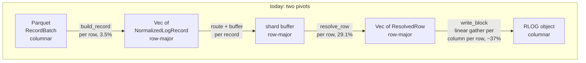
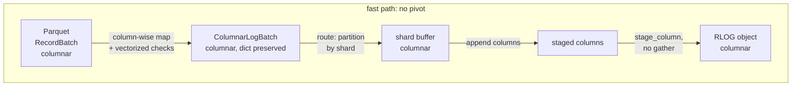

# ADR-0109: Columnar bulk-load fast path for Parquet ingest

Status: Accepted

## Context

`ravel-cli load --parquet` (ADR-0089) reads a columnar file and writes a
columnar object, and pivots to rows and back in between.

The CLI decodes an Arrow `RecordBatch` and runs `build_record` once per row
to produce a `NormalizedLogRecord` (`services/ravel-cli/src/load.rs:888`).
`LogIngestRouter::write` charges the byte budget and routes per record
(`crates/ravel-ingest/src/log_router.rs:293`). The shard actor buffers a
`Vec<NormalizedLogRecord>` and hands each record to `RlogWriter::push` at
flush (`crates/ravel-ingest/src/log_shard.rs:334`). The writer resolves
each record again in `resolve_row` (`crates/ravel-logseg/src/writer.rs:733`)
and `write_block` finally pivots the rows back into columns
(`crates/ravel-logseg/src/block.rs:236`).

### Where the CPU actually goes

Measured on the reference box (c6a.4xlarge, 2M-row sample of ClickBench
`hits.parquet`, S3 backend, pprof lane, recorded on #560):

| region | share of load CPU |
|---|---|
| shard-side encode (`flush_tenant` -> `build_object`), of which: | ~89% |
| &nbsp;&nbsp;`write_block` | 41.9% |
| &nbsp;&nbsp;`LogRecord` -> `ResolvedRow` resolution | 29.1% |
| &nbsp;&nbsp;dynamic-column map lookups (`column_of`) | 8.3% |
| &nbsp;&nbsp;zstd | 1.7% |
| &nbsp;&nbsp;remainder (bloom, postings, skip index, section assembly) | ~8% |
| Parquet decode + loader record build (`decode_and_build`), of which: | ~4.2% |
| &nbsp;&nbsp;`build_record` | 3.5% |
| &nbsp;&nbsp;Parquet reader | 0.6% |

The CLI side is nearly free. The cost is the writer, and inside the writer
most of it is not encoding at all. `write_block` reads each row's value for
a column through `row_column`, a **linear `.iter().find()`** over that row's
column vector (`crates/ravel-logseg/src/block.rs:431`), and `winner_value`
does the same over `stat_winners`. It runs three such scans per plan column
per row (presence, values, stat values). ClickBench `hits` maps 105
attribute columns, so the gather is quadratic in column count: about 16,500
comparisons per row, roughly 11 billion for the 2M-row sample.

A microbench over an 8192-row block confirms the shape (local release
build, 70 `I64` and 35 `Str` columns, criterion at 10 samples, so read the
ratio and not the absolute times):

| columns | `write_block` | the gather scans alone |
|---|---|---|
| 10 | 6.7 ms | 1.5 ms (~22%) |
| 105 | 431 ms | 477 ms (same magnitude) |

At 10 columns the gather is a fifth of the block encode. At 105 it is
effectively the whole of it: a 10.5x widening costs 64x more `write_block`
time for the same row count and the same bytes per row. So of `write_block`'s
41.9%, encoding proper is around 5 points and the row gather is around 37.

Tiers 1-3 (#519, #560, #570, #584, #585) spread this work across cores and
hide I/O behind it. They do not remove it. The reference load burns ~234
CPU-minutes at one core; perfect 16-way scaling of the current pipeline
still floors around 15 minutes.

Two constraints frame the design. ADR-0089 made the loader an in-process
caller of `LogIngestRouter` (the same shard actors, flush cadence, and
commit protocol), so bulk load has no durability story of its own to get
wrong. ADR-0069 charges every buffered byte against one process-wide
ceiling, and `est_record_bytes` is how the log path counts its share.

## Decision

### 1. The columnar batch crosses every layer intact

A new type, `ColumnarLogBatch`, carries a batch of log records in
column-major form from the CLI, through the router and the shard buffer,
into the RLOG writer. No layer materializes a per-row struct.

The win is writer-side: `resolve_row`, the `column_of` lookups, and
`write_block`'s gather are about 78 of the 89 points the writer spends. The
CLI's own 4.2% is not why the CLI changes. The CLI changes because that is
where the data is already columnar and the shape costs nothing to keep; if
the columnar form is not built there, something further down has to build
it from rows, which is the per-row work this ADR exists to delete.

### 2. `ColumnarLogBatch` is storage-native, not Arrow

The type lives in `ravel-logseg` beside `ResolvedRow`, and owns plain
column buffers: `Vec<i64>` for the timestamps, `Vec<u8>` for severity
numbers, offset+bytes pairs for the variable-width columns, fixed-width
buffers plus a validity bitmap for trace and span ids, `Vec<u32>` of stream
refs beside the distinct `stream_attrs` blobs, and one typed column per
dynamic attribute. A string column carries either plain values or a
distinct set plus one id per row, the same two shapes a decoded RLOG string
column already has (`StrColumn`, ADR-0099 decision 4).

Arrow stops at the CLI boundary. `ravel-logseg` owns a frozen format and
today depends on nothing but the codec, proto, types, and compression
crates; pulling Arrow into it to describe data that must be converted to
RLOG's own value model anyway (typed dynamic columns, canonical bytes for
`List`/`Map`, `f64` stored as bit patterns) would buy no zero-copy and cost
a large dependency. The conversion happens once per column at the CLI,
which is where the Arrow arrays already are.

### 3. Per distinct value, not per row

Removing the gather is necessary but not sufficient for the target in
decision 8. Two costs that survive it are proportional to rows where the
data only justifies proportional to distinct values, and this path knows
the distinct values because Parquet already grouped them:

- **Dictionary-preserving string columns.** When a mapped Parquet column
  arrives dictionary-encoded (most of ClickBench's 105 do), the batch
  carries that dictionary and its ids. The writer maps each distinct value
  to its RLOG dictionary entry once per block rather than once per row. It
  must reproduce exactly the page `encode_strings` derives today
  (`crates/ravel-codec/src/encoding.rs:480`): the entry order is the
  distinct values sorted, and the dictionary-versus-plain choice is
  `dict_is_worth_it(distinct, total)`. Both are computable from the
  incoming dictionary and the row count alone, so the per-block work is
  sorting and remapping a distinct set, never a pass over the values.
- **Dictionary-aware bloom.** `insert_text` tokenizes every `Str`/`Bytes`
  value of every row (`crates/ravel-logseg/src/writer.rs:493-501`). Over a
  dictionary column it needs to run once per distinct value per block.
  Bloom bit setting is idempotent, so the section bytes are unchanged.

The general rule this ADR follows: per distinct value where the data is
dictionary-shaped, per column otherwise, per row only where the semantics
demand it (which is the rejection index, and nothing else).

### 4. The router still owns durability; only its input shape changes

`LogIngestRouter` gains `write_columnar`, which does exactly what `write`
does (charge the byte budget, resolve the generation view, partition by
shard, dispatch, await Strict acks), with the partition step operating on
column selections instead of a `Vec` per shard. The commit protocol, the
object key layout, the `WriteMode::Strict` ack contract, the flush
triggers, and the RLOG format are unchanged. This ADR changes a CPU path
and nothing else; no frozen format is touched and no version is bumped.

### 5. A tenant's shard buffer is columnar or row-major, never both

The columnar path is bulk-load only. `LogShardMsg::Write` gains a columnar
variant, and a tenant buffer that holds columnar batches refuses a
row-major write for the same tenant rather than merging the two
representations. OTLP ingest is untouched: it arrives row-shaped over the
wire, so converting it to columnar per request would add a pivot rather
than remove one.

That refusal is an API-level guard, not a behavior change on any live path.
The loader builds its own `LogIngestRouter` in its own process
(`load_instrumented`), while OTLP traffic goes through the server's router,
so a mixed buffer cannot arise today; a bulk load running alongside OTLP
ingest is two independent writers under one commit protocol, exactly as it
is now.

### 6. Every per-row obligation gets a stated columnar equivalent

The obligations are not dropped; they move from per cell to per column or
per distinct value. Row-granular *reporting* survives even where the
*check* is vectorized.

| Obligation (row path) | Columnar equivalent |
|---|---|
| Future-skew rejection (`build_record`, `limits.max_future_skew_ns`) | Vectorized compare over the ts column; the first violating index is reported, so `LoadError::RowRejected` still carries an absolute row index (#541) and `file_base` accounting (#560) is unaffected |
| Type coercion / Arrow downcast (`read_i64`, `read_string`, `read_ts`, ...) | Once per column per batch. The mapping already declares each column's type, so the downcast and the unit scaling are resolved before the first cell is read |
| Body and attribute length caps (`check_attr`, `max_body_len`) | Vectorized over the offset array: a violation is a difference between consecutive offsets |
| Per-record attribute cap (`LOADER_MAX_ATTRIBUTES_PER_RECORD`) | The mapped attribute count is a property of the mapping, checked once per batch, plus a per-row non-null count when the mapping declares more columns than the cap |
| Stream identity (`log_stream_id` per row) | Hashed once per distinct resource-attribute tuple, cached by the tuple's dictionary codes, and expanded to a `Vec<u32>` of stream refs |
| Dynamic column assignment (`distinct` set built by walking every record's attrs) | Derived from the mapping, restricted to the columns that are non-null somewhere in the object, sorted by `(name bytes, type)` and truncated at `max_dynamic_columns` exactly as the row path does. It must also grant the stream-level-only columns `build_object` grants today (indexed keys, and numeric resource or scope keys that no record carries), or byte-identity fails on any input with an indexed resource attribute |
| Value gather (`row_column`, `winner_value`) | Deleted. The column is already contiguous, so `stage_column` and the NumStat fold read it directly |
| Token bloom (`insert_text` per value per row) | Once per distinct value per block on a dictionary column (decision 3); unchanged for a plain column |
| `attrs_raw` overflow | Static per `(name, type)` from the mapping, but the per-row canonical bytes must preserve the row path's attribute order and duplicate-key folding exactly |
| POSTINGS and NumStat merged view (ADR-0049, ADR-0095) | Built from the same single resolution, per column rather than per row; the two projections still come from one merged view, never two derivations |
| `InconsistentStreamAttrs` | By construction: the batch carries one blob per distinct stream id |
| Byte budget (`est_record_bytes`, ADR-0069) | Computed column-wise and required to equal the row path's number exactly for the same records, so the shared ceiling means the same thing on both paths |
| Block chunking (`chunk_blocks` / `row_estimate`) | Computed column-wise and required to equal the row path's number exactly, so the two paths cut blocks at the same rows |
| `WriteStats` reporting (ADR-0100 decision 1) | Populated identically by the columnar writer path. The loader's dynamic-column overflow and near-cap warnings read these counters through the router metrics snapshot, so a columnar path that left them at zero would silently turn the warning off |

### 7. Byte-identical output is the acceptance anchor, at two levels

The row path and the columnar path must produce byte-identical RLOG objects
for the same records. Every ordering in the writer is sorted or canonical
and `chunk_blocks` is deterministic given per-row estimates, both of which
decision 6 requires the columnar path to reproduce exactly, so byte-identity
is achievable and is the strongest available statement that no admission,
coercion, dictionary, or column-assignment rule drifted.

One test cannot carry that, because the two paths differ in what they can
even express. The guard is two permanent differential tests, each with the
corpus it can actually reach:

- **Writer level**, in `ravel-logseg`: a proptest-built sequence of
  `LogRecord`s pushed through `RlogWriter::push` against the same records as
  a `ColumnarLogBatch` through the columnar entry point, compared byte for
  byte. This is the only level that reaches `List`/`Map` attributes and the
  canonical-bytes path, duplicate keys within a record, dynamic-column
  budget overflow, stream-level-only columns, plain-versus-dictionary
  string columns at the encoder's threshold, and more than one batch merged
  into a single object. The loader runs with `target_bytes: 1`, so one
  write is one object and the Parquet-level test never merges two batches;
  only this level exercises the distinct-column union and the
  stream-directory merge across appends.
- **End to end**, in `services/ravel-cli`: the same Parquet file and
  mapping loaded through both paths, compared byte for byte. This is where
  the vectorized admission checks, the per-column coercion, the `TsUnit`
  scaling, out-of-`u8` severity numbers, nulls in every mapped column,
  all-null attribute columns, and `RowRejected` index parity live. The
  loader's `ColType` admits scalars only, so `List`/`Map` values have no
  Parquet source and are covered at the writer level instead.

Decoded equality is a fallback only if a specific chunking input turns out
not to be reproducible column-wise, and that would be recorded here as an
amendment with the reason.

### 8. The target is under 10 minutes, and here is the arithmetic

Addressable CPU, from the table above: `build_record` 3.5, `resolve_row`
29.1, `column_of` 8.3, and the gather share of `write_block` around 37, so
roughly 78 points of load CPU. Against that the columnar path adds the
Arrow-to-storage-native copy, which is a bulk copy per column rather than a
per-cell one, and decision 3 removes rather than adds work on the bloom.
Calling the remainder 25-35% of today's CPU is the honest range.

234 CPU-minutes times 0.25-0.35 is 60-80 CPU-minutes. On the 16-core
reference box, with shard count near core count, `--read-cursors` giving
the stride diversity #560 landed, and at least two writes in flight (#585)
so the S3 PUT round trip is hidden, 60-70% scaling efficiency puts wall
time at roughly 6-9 minutes. Under 10 minutes is the target and the
arithmetic reaches it across most of that range, not only at the optimistic
end; it does not reach it if the shard count is left well below the core
count, which is a provisioning condition and is stated as such.

The gather share is the load-bearing number and it is a microbench ratio,
not a production profile. Wave 1 lands that microbench as a permanent
`ravel-logseg` bench so the assumption is checkable, and the epic's final
measurement is a before-and-after on the reference box, not this
arithmetic.

## Rejected alternatives

**Bypass the router: have the CLI build and commit RLOG objects directly.**
The per-row pivot is not in the commit path, so this removes no CPU that
decision 1 does not already remove, while creating a second implementation
of the commit protocol, the shard-count and generation checks, and the ack
semantics ADR-0089 deliberately reused.

**Pivot once, at flush inside the shard actor.** Keep the row API through
the router and build columns in `flush_tenant` from the buffered
`Vec<NormalizedLogRecord>`. It touches one crate instead of three and looks
like most of the win. It is not: building columns from owned row structs is
`resolve_row` under another name, and it still pays the per-row,
per-attribute walk over `String` keys that costs 29.1 points, plus the
`column_of` lookups. It would delete the gather and leave the rest.

**Use Arrow as the interchange type all the way into `ravel-logseg`.**
RLOG's value model does not match Arrow's: dynamic columns are split by
observed type, nested values are stored as canonical bytes, and floats are
stored as bit patterns. Some conversion is unavoidable, so Arrow in the
storage crate buys no zero-copy and adds a large dependency to the crate
that owns a frozen format.

**Fix the gather in place: make `row_column` a map lookup or sort the
column vector.** This is the narrow read of the measurement, and it would
recover a real share of `write_block`. It leaves `resolve_row`'s 29.1 and
`column_of`'s 8.3 untouched, keeps every row's values in owned per-row
allocations, and leaves the bloom per row. It is a tune of the pivot, not
its removal, and it cannot reach decision 8's target.

**Make the OTLP path columnar too, so there is one path.** OTLP records
arrive row-shaped over the wire. Building a columnar batch from them adds a
pivot instead of removing one, and it would put this change on the live
ingest path's durability surface for no CPU win. The cost of two paths is
the risk that they drift, which decision 7 addresses directly.

**Reject at batch granularity to avoid per-row bookkeeping.** #541's
`RowRejected` reports an absolute row index and #560's `file_base`
accounting builds on it. A vectorized check already knows the index of the
first violating element, so batch-granular rejection would give up
operator-facing precision for no measurable saving.

## Consequences

- `ravel-logseg`, `ravel-ingest`, and `services/ravel-cli` each gain a
  columnar entry point beside the row one. Two paths into the same object
  format is a drift risk; the byte-identity differential tests are
  permanent tests, not migration checks, and they are what keeps the risk
  bounded.
- #570 (intern the `column_of` key) is not subsumed: it remains the right
  fix for the OTLP path, which keeps `RlogWriter::push`. Note that the
  quadratic gather is specific to wide bulk schemas; an OTLP record
  carrying a few dozen attributes is not where that pathology bites.
- #584 (intra-object parallel encode) should be re-evaluated against the
  post-columnar profile rather than dispatched on the current one. With the
  gather gone and shard count near core count, intra-object parallelism may
  no longer be needed for the target; it stays the right lever when shard
  count is constrained below core count.
- #585 (wider write pipeline) is complementary and assumed by decision 8's
  arithmetic: once encode CPU falls, the S3 PUT round trip is the visible
  serial term.
- Bulk load stops being a thin caller of the ingest router and becomes a
  second producer of RLOG objects. The shard-buffer split in decision 5
  keeps that from reaching OTLP.
- No frozen format changes: the RLOG layout, the protobuf schemas, series
  and stream identity, commit tokens, and the object key layout are all
  untouched, so no format version bump is required.
- The reported number is a measured before-and-after on the reference box.
  No load-time win is claimed from the arithmetic in decision 8.

Refs: #586, #519, #541, #560, #570, #584, #585
