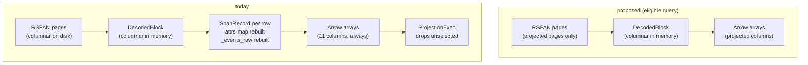

# ADR-0110: Columnar decode-to-Arrow for the SQL spans scan

Status: Proposed

## Context

ADR-0099 removed the columnar to rows to columnar pivot from the logs and
metrics SQL scans. Its consequences named what it deliberately left behind:

> **Still deferred:** [...] and the spans scan
> (`crates/ravel-sql/src/spans_scan.rs`), which has the same row-rebuild
> shape and is left for a follow-up rather than widened into this epic.

That shape is still there. RSPAN stores a block as per-column pages
(`write_block`, `crates/ravel-rspan/src/block.rs:125`), and `read_block`
decodes them into a `DecodedBlock` that holds one vector per column
(`crates/ravel-rspan/src/block.rs:359`). Every reader above it then throws that
structure away one row at a time:

- `RspanReader::scan` (`crates/ravel-rspan/src/reader.rs:123`) calls
  `decoded.record(row)` for each row and returns `Vec<SpanRecord>`.
- `SpanSegmentFetcher::scan_object` (`crates/ravel-query/src/span_fetcher.rs:275`)
  does the same and returns `Vec<SpanRow>`.
- `SpansScanExec::build_batch` (`crates/ravel-sql/src/spans_scan.rs:401`) then
  rebuilds Arrow arrays by iterating those rows eleven times, once per column.

`DecodedBlock::record` (`crates/ravel-rspan/src/block.rs:409`) is not a cheap
struct copy. For every row it reassembles the merged attribute map from the
per-key dynamic columns, decodes the `attrs_raw` overflow, re-inserts the
lifted `service.name`, and reconstructs the `_events_raw` blob from the four
nested event columns (`crates/ravel-rspan/src/block.rs:465`). A `String`
allocation per attribute key and value, per row.

The waste is not evenly spread, and that is what makes this worth doing. The
`spans` table has eleven columns. Ten of them (`trace_id`, `span_id`,
`parent_span_id`, `name`, `start_ts`, `end_ts`, `status_code`,
`status_message`, `service_name`, and the computed `duration_ns`) come from
fixed RSPAN column ids `COL_TRACE_ID` through `COL_STATUS_MESSAGE` plus
`COL_SERVICE_NAME` (`crates/ravel-rspan/src/record.rs:32-50`). Exactly one
column, `attrs`, needs the dynamic per-key columns, `COL_ATTRS_RAW`, and the
`COL_EVENT_*` reconstruction.

So a query that never selects `attrs` still pays for the whole attribute map
and the whole event reconstruction on every row, then discards it. Today it
pays twice over: `SpansTableProvider::scan` builds the full eleven-column batch
and puts a `ProjectionExec` above the scan to drop the unwanted columns
(`crates/ravel-sql/src/spans_provider.rs:291`), with the comment stating
plainly that the fetch reads the whole object regardless.

This is the pgrust query-engine lesson and ADR-0099's lesson in the same
place: delete the representation change, do not optimize the instructions that
perform it.

## Decision

Seven parts: a columnar view out of `ravel-rspan`, a columnar exit in the
fetcher, direct Arrow construction behind an eligibility rule, projection
pushed into page decoding, observability, unchanged ordering and filter
semantics, and a measured number with a regression test.

No frozen format is touched. RSPAN bytes, `Enc` tags, the proto schemas,
canonical series identity, commit tokens, and the object key layout are all
unchanged. This is a read-path change only, so the format-change procedure does
not apply.

### 1. A columnar block view out of `ravel-rspan`

`DecodedBlock` gains a second exit next to `record`: a borrowed view over its
columns, plus the surviving row indices after the query's ts and `trace_id`
predicates have been evaluated.

A view over what `read_block` already produces is not enough, and reading this
decision as "hand out what was already decoded" would delete the win. Today
`read_block` decodes **every** page in the block, `decode_events` included,
before any caller sees it. So `ravel-rspan` also gains a projected decode
entry: a `read_block` sibling taking a set of column ids, which decodes those
pages and no others, and produces a `DecodedBlock` holding only them.
`read_block` keeps its exact signature and behavior, implemented as the
projected entry called with the full column set.

The view must distinguish **column absent from this block** (a legitimate
`NULL` for every row) from **column not requested in this decode** (a caller
bug). `DecodedBlock`'s `HashMap` lookups return `None` for both today. The view
returns a typed error for the second, never a silent column of nulls: a
mis-specified projection must fail loudly rather than answer a query with an
all-`NULL` column.

The view exposes **accessors, never the storage type**. Per-column typed
readers (`i64_column`, `fixed_column`, `str_column`) and gather iterators over
the surviving indices, keyed by column id. `DecodedBlock`'s
`HashMap<u32, Vec<Option<...>>>` fields stay private and are not re-exported.
This is the same constraint ADR-0099 decision 1 placed on `ravel-logseg`'s
block view, for the same reason: it lets a later change to how string columns
are stored (a dictionary form rather than one `Vec<u8>` per row) land without
touching a caller.

`record`, `service_name`, and `record_count` keep their exact signatures and
behavior, implemented over the same primitives, so `RspanReader::scan`,
`RspanRangeReader::decode_block`, `decode_trace`, and the compaction path stay
byte-identical.

No Arrow types enter `ravel-rspan`. The view is slices and indices;
`ravel-sql` owns every Arrow decision.

### 2. A columnar exit in the span fetcher

`SpanSegmentFetcher` gains a columnar sibling of `fetch_accounted` that yields
per-object decoded blocks and their surviving row indices instead of
`Vec<SpanRow>`. `fetch` and `fetch_accounted` keep their signatures and their
row semantics, implemented over the same primitive.

Byte accounting keeps ADR-0107's contract unchanged: the columnar exit records
`page_bytes_fetched` and `page_bytes_decoded` through the same
`QueryAccounting` fold as the row exit. The two counters diverge on purpose,
and the accounting test asserts each separately:

- `page_bytes_fetched` is **identical** on both exits. The object is fetched
  whole either way; decision 4 skips decode, not fetch.
- `page_bytes_decoded` is **lower** on the columnar exit whenever the
  projection excludes `attrs` and the block actually carries attribute or
  event pages. That difference is the win, and it is the quantity decision 7
  asserts on.

### 3. Direct Arrow construction, behind an explicit eligibility rule

`SpansScanExec` builds arrays straight from the view's column slices, gathered
through the surviving row indices, with no `SpanRecord` and no `SpanRow`.

The fast path is taken only when **all** of the following hold; otherwise the
existing row path runs unchanged:

- the projection does not include the `attrs` map column. `attrs` is the only
  column requiring the dynamic per-key columns, the `attrs_raw` overflow decode,
  and the `_events_raw` reconstruction, which is precisely the work the fast
  path exists to avoid;
- **no pending selective-erasure predicate applies to the query.** This clause
  is load-bearing, not hygiene. `SpansScanExec` carries
  `erasure: Arc<Vec<ErasurePredicate>>` (ADR-0064 decision 2) and excludes rows
  with `is_erased_span(&row.record.attrs, row.record.start_ts_ns, &erasure)`
  (`crates/ravel-sql/src/spans_scan.rs:319`). The predicate matches **against
  the merged attribute map**, which is exactly the structure the fast path does
  not build. A fast path that ignored this clause would re-serve erased spans
  to a query that excludes `attrs`, silently and with HTTP 200. Erasure is a
  rare tenant state and columnar erasure evaluation is a separate change that
  must not ride along with a performance rewrite, so this fails closed to the
  row path. A test asserts the fallback fires with a pending erasure predicate
  active, and the differential proptest includes erasure-active cases;
- the block carries no `COL_ATTRS_RAW` page. A block whose records all fit
  their per-key columns has no `attrs_raw` page at all, so this is a page
  descriptor read, not a decode. This clause is defensive rather than strictly
  required: `attrs_raw` holds only overflow attributes, and RSPAN reads exactly
  one trailer version (`SUPPORTED_VERSIONS = single(VERSION)`, `VERSION = 4`,
  `crates/ravel-rspan/src/footer.rs:27-86`; ADR-0045 decision 4, single
  supported version, no dual reader), so there is no older object whose
  `service.name` or other fast-path column could be hiding in the overflow
  blob. It is kept because it is a metadata read that costs nothing and keeps
  the fast path's inputs to columns whose values are fully determined by their
  own page. Do not drop it without re-deriving that version argument.

`service_name` reads `COL_SERVICE_NAME` directly, as `SpanRow` already does
today. `duration_ns` is computed from the `start_ts` and `end_ts` columns with
`saturating_sub`, preserving today's behavior exactly: `end_ts_ns >=
start_ts_ns` is a format invariant, not one this column assumes and panics on.

Memory accounting keeps its current contract and its current unit. The scan's
`MemoryReservation` grows by `batch.get_array_memory_size()` as each batch is
produced (`crates/ravel-sql/src/spans_scan.rs:382`), a charge on the built
batch rather than on rows, so the fast path charges it identically.

That contract has a pre-existing gap this ADR does not close and does not
widen: `prepare_partition` materializes the whole partition's
`Vec<SpanRow>` before any batch exists, and that vector is never charged
against the pool. The fast path holds decoded blocks in the same place and is
equally uncharged. Issue #41 (bytes-scanned budget does not cover the spans
scan path) is the tracking issue; the wave's acceptance test asserts the batch
reservation behaves identically on both paths, and does not claim the hold
itself is bounded.

### 4. Projection is pushed into page decoding, not applied above the scan

`SpansTableProvider::scan` hands the projection to `SpansScanExec` rather than
wrapping the plan in a `ProjectionExec`, for the eligible case. The scan then:

- emits a batch whose schema is already the projected schema, and
- decodes only the pages it needs.

The decoded set is **not** the projection alone. It is the union of three
things, and an implementation that decodes less is wrong:

1. the projected columns;
2. the ordering key columns, `COL_TRACE_ID` and `COL_START_TS`, needed for the
   stable interleave in decision 6 even when the query projects neither;
3. the per-row predicate columns, which are the same two plus `COL_END_TS`
   where the ts window is evaluated against it.

So `SELECT name` still decodes `COL_TRACE_ID` and `COL_START_TS`. Dropping
them because the projection omits them breaks the advertised ordering.

The win is what falls outside that union. A `SELECT trace_id, name,
duration_ns` never touches the dynamic attribute pages, the `attrs_raw` page,
or the four `COL_EVENT_*` pages, so their bytes are neither decompressed nor
allocated, and `decode_events` never runs.

The ineligible path keeps today's `ProjectionExec` wrapping unchanged, so the
provider has one behavior per path and neither is a special case of the other.

### 5. The chosen path is observable

`SpansScanExec` publishes `columnar_batches` and `rowpath_batches` partition
metrics, alongside `pages_decoded` and `pages_skipped`, so `EXPLAIN ANALYZE`
shows which path ran and a test can assert eligibility directly rather than
infer it from output that is identical by construction.

### 6. Ordering and filter semantics are unchanged

The scan keeps advertising `(trace_id asc, start_ts asc)`, RSPAN's native sort
order, and keeps the single stable sort that interleaves several objects within
a partition. `supports_filters_pushdown` stays `Inexact`, so DataFusion
re-applies every original filter above the scan. The ts window and the optional
`trace_id` equality stay evaluated exactly per row; on the fast path they are
evaluated over the `COL_START_TS`, `COL_END_TS`, and `COL_TRACE_ID` columns
before the gather, which is what produces the surviving row indices. The
`service_name` and `name` bloom probes stay widen-only per ADR-0013.

Issue #303 (the distributed span merge key is not a refinement of this
advertised order) is a pre-existing defect in the distributed merge, not in
this scan, and is explicitly out of scope here.

### 7. The win is a number, and a test that fails when it regresses

A differential proptest runs both paths over the same generated objects and
asserts the batches are equal, including null placement and column order, for
every projection subset, with erasure-active cases among them. A bench case in
`ravel-bench` reports rows/second and bytes decoded for a projection that
excludes `attrs` and one that includes it, so the eligible and ineligible paths
are both measured. The reported figure is the one recorded in the epic.

The regression test asserts the columnar path is taken for the eligible shape,
and that its `page_bytes_decoded` is strictly lower than the row path's for the
same query. That assertion needs a corpus whose blocks actually carry attribute
and event pages: over spans with no attributes and no events there are no such
pages to skip, both paths decode the same bytes, and "strictly lower" is false
for a correct implementation. The test fixture must therefore build spans with
attributes and events, and the test says so in a comment, or it will be
"fixed" later by weakening the assertion.

## Rejected alternatives

**Widen ADR-0099's logs view to cover spans.** RLOG and RSPAN are different
formats with different block layouts, different column id spaces, and different
attribute models (RSPAN stores the merged resource+scope+span map directly and
has no stream-identity blob). A shared view would be a lowest-common-denominator
abstraction over two things that are not the same, and would couple two
formats' evolution. Rejected: each format gets its own view, matching the way
ADR-0099 kept `ravel-logseg`'s view inside `ravel-logseg`.

**Make `record` cheaper instead of bypassing it.** Reducing allocations inside
`DecodedBlock::record` (interning keys, reusing buffers) would help every caller
including compaction. It does not remove the per-row structure, does not let a
projection skip a page, and leaves the eleven-way Arrow rebuild in place.
Rejected as optimizing the representation change rather than deleting it,
though it stays available later for the compaction path, which genuinely needs
rows.

**Make the columnar path unconditional and delete the row path.** The `attrs`
map genuinely needs the per-key reassembly the row path performs, and RSPAN's
compaction and trace-lookup readers need `SpanRecord`. Deleting the row path
means reimplementing it inside the columnar path for the `attrs` case, which is
the same code with worse structure. Rejected: two paths, one eligibility rule,
one differential proptest proving they agree, exactly as ADR-0099 did.

**Push projection down but keep building `SpanRecord`.** This captures the page
skipping without the Arrow rebuild change, and is a smaller diff. It does not
work: `record` reconstructs the merged attrs map and `_events_raw`
unconditionally, so a projection that excludes `attrs` would still decode the
pages it is trying to skip, or `record` would have to grow a projection
parameter and return partially-populated `SpanRecord`s, which is a worse
contract than not returning records at all. Rejected.

**Emit dictionary-encoded `name` and `service_name` end to end.** RSPAN already
dictionary-encodes `COL_SERVICE_NAME`, and carrying `Dictionary(Int32, Utf8)`
into the batch would follow ADR-0099 decision 5. It changes the `spans` table's
advertised Arrow types, which is an API-visible change with its own
compatibility surface for Flight SQL clients. Rejected for this ADR, recorded
as follow-up work once the columnar path exists to carry it.

## Consequences

- **Two implementations of spans batch construction now exist.** The
  differential proptest must run over both, and the eligibility rule must be
  asserted through the new metrics, or the two drift apart silently. This is
  the same cost ADR-0099 accepted for logs.
- **The provider has two projection behaviors.** Eligible queries carry the
  projection into the scan; ineligible ones keep the `ProjectionExec`. A test
  asserts the plan shape for both.
- **No frozen format is touched.** Read path and query API only. No version
  bump, no writer change, no migration.
- **`attrs`-projecting queries are unchanged.** The epic's win is on queries
  that do not select the attribute map, which is the common shape for trace
  listing, latency analysis, and service-level aggregation. Queries that do
  select `attrs` keep today's cost exactly.
- **Erasure-active queries keep today's cost, permanently until columnar
  erasure evaluation exists.** A tenant with a pending erasure predicate gets
  the row path for every spans query. That is the correct trade (an erasure
  leak is unacceptable, a slower scan is not), and it is the clause most likely
  to be quietly relaxed by a later change: `is_erased_span` reads the merged
  attrs map, so nothing about the fast path can evaluate it.
- **The memory-pool charge stays batch-denominated, and the uncharged
  partition-sized hold stays uncharged.** Pre-existing, tracked in #41, neither
  closed nor widened here.
- **Follow-up left open:** dictionary types for `name` and `service_name` end
  to end, and the `attrs` map column itself, which would need a columnar
  attribute representation rather than a per-row map rebuild.
