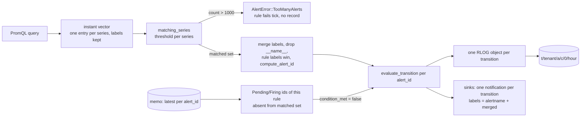

# ADR-0117: per-series alert evaluation

Status: Accepted (2026-09-16). Issue #117. Amends ADR-1294 (the one-alert-per-rule
premise in its Context).

## Context

A PromQL alert rule evaluates to an instant vector, one entry per matched
series (`crates/ravel-promql/src/eval.rs:141-142`). The evaluator throws the
series labels away before the condition runs: `promql_summary`
(`services/ravel-server/src/alerting.rs:1657-1672`) maps each sample to its
bare value, and `QueryResultSummary::Numeric(Vec<f64>)`
(`crates/ravel-alerting/src/condition.rs:14-22`) has nowhere to keep them.
`condition_met` then collapses the vector with `any()`
(`condition.rs:65-67`), so a rule over `up == 0` across ten instances raises
one alert with the rule's static labels, and the user guide says so
(`docs/guides/alerting.md:66`).

Alert identity is already a hash of a rule id plus a label set:
`compute_alert_id(rule_id, labels)` (`crates/ravel-alerting/src/record.rs:79`)
sorts the labels and hashes them under the `ravel-alert-id-v1` domain string
(`record.rs:74, 87`). The record format carries labels as `label.<k>` attrs
and the decoder ignores unknown attrs (`record.rs:145-168, 215`). The alert
stream is one per rule, keyed by `rule.id` alone (`record.rs:30-36`), and the
state machine folds records by `alert_id`, not by `rule_id`
(`crates/ravel-alerting/src/state.rs:3-5`). So the persistent side can hold
per-series identity today. What assumes one alert per rule is the evaluator:
`build_transition_record` takes both the id and the labels from `rule.labels`
(`record.rs:272-275`), `evaluate_rule` computes one id before it runs the
query (`alerting.rs:1086-1089`), `queue_repeat_if_due` does the same
(`alerting.rs:1035`), and the `undelivered` map is documented as "Bounded by
the rule count" (`alerting.rs:601-604`).

ADR-1294 built the alert state memo on that assumption: "a rule maps to
exactly one `alert_id` for its lifetime. The fold's output therefore holds at
most `R` entries" (`docs/adrs/1294-alert-state-memo.md:22-27`). The memo keeps
one entry per identity ever seen and is never pruned; pruning is issue #1438
(`1294-alert-state-memo.md:219-223`). Per-series identity multiplies the
number of identities a tenant can accumulate, so the cap on how many a rule
may produce has to be decided here, together with what happens above it.

No cap exists today. The query engine's `max_series` (default 10,000,
`crates/ravel-query/src/config.rs:9-10, 401`) bounds the series a query reads
and fails with the typed `TooManySeries` error
(`crates/ravel-query/src/error.rs:35`); it says nothing about how many alerts a
rule may raise. Rule failures are `anyhow` errors that count in
`rules_failed` and log a warning; the prior state is left as it was
(`alerting.rs:771-790, 1188-1190`). `AlertError`
(`crates/ravel-alerting/src/error.rs:6-46`) is the crate's typed error and
holds no evaluation-cap variant.

## Decision

1. **A PromQL threshold rule raises one alert per matched series.** The
   summary keeps the labels: `QueryResultSummary::Numeric` becomes a vector
   of `(LabelSet, f64)` pairs, and a new `matching_series` function returns
   the series whose value satisfies the condition, each with its labels.
   `condition_met` stays as the boolean "at least one matched" for the SQL
   path and for callers that only need the boolean. Native-histogram samples
   stay excluded, as they are today (`alerting.rs:1653-1656`).

2. **Alert identity is `compute_alert_id(rule_id, merged)`, where `merged` is
   the series labels without `__name__`, overlaid by the rule labels.** A rule
   label wins on a name clash, the order Prometheus uses and the order the
   Alertmanager sink already applies to `alertname`
   (`services/ravel-server/src/alert_sink.rs:319-323`). The preimage and the
   `ravel-alert-id-v1` domain string do not change: a rule whose query
   returns a scalar has an empty series label set, so its identity is the
   one it has today. Two series of one rule that produce the same merged set
   in one tick are a typed error (`AlertError::DuplicateAlertIdentity`) and
   the rule fails that tick; a silent overwrite would hide one of them.

3. **A rule may raise at most `MAX_ALERTS_PER_RULE = 1000` alerts.** The cap
   counts matched series after decision 1, not the size of the result vector.
   Above it the rule fails the tick with the typed
   `AlertError::TooManyAlerts { rule_id, count, limit }`: no record is
   written, prior state is untouched, `rules_failed` increments, and the
   warning names the count and the limit. The tick is otherwise unaffected.
   The cap is a crate constant, not a flag, so every tenant's memo, sink
   fan-out and per-tick publish cost have one known bound.

4. **A series that stops matching resolves.** After computing the matched set
   the evaluator walks the folded `latest` entries whose `rule_id` is the
   rule's and whose state is Pending or Firing, and feeds
   `evaluate_transition` `condition_met = false` for each identity absent
   from the matched set. `evaluate_transition` is pure and per identity
   (`state.rs:129-175`), so it needs no change. `queue_repeat_if_due` iterates
   the same set instead of computing one id from the rule's labels.

5. **SQL rules are unchanged.** `RowCount` (`condition.rs:68`) has no series
   identity, so a SQL rule keeps one alert with the rule's labels.

6. **Storage, formats and the `alerts` table do not change.** One RLOG object
   still holds one record (`alerting.rs:1273-1275`), series labels travel as
   `label.<k>` attrs, keys derive from writer identity and ingest hour, and
   the `alerts` table already exposes labels through `attrs['label.<name>']`
   and partitions current state by `alert_id` (`docs/guides/alerting.md:196-218`,
   ADR-1101 decision 1).

## Rejected alternatives

- **Truncate to the first 1000 matched series instead of failing.** Which
  series survive would depend on result order, so the set of alerts a rule
  raises would change between ticks with no change in the data. An alert
  that silently never fires is worse than a rule that visibly fails.
- **Cap the result vector rather than the matched set.** Resolution
  (decision 4) needs only the matched set and the memo, so a large vector of
  healthy series costs nothing this ADR has to bound; the engine's
  `max_series` already bounds what the query materialises.
- **Make the cap a per-rule or per-tenant setting.** A raised cap raises the
  memo growth, the sink fan-out and the sequential per-tick publish cost
  together, and each of those is sized against one number. Lowering the cap
  per rule buys nothing a narrower query does not.
- **Keep `__name__` in the identity.** Two rules on different metrics already
  differ by `rule_id`, so the metric name adds no identity within a rule
  unless the query selects several names, and then decision 2's typed error
  reports the clash instead of hiding it in a label users do not expect in
  an alert.
- **Emit one notification per rule carrying all matched series.** The
  Alertmanager sink treats the label set as the alert's identity
  (`alert_sink.rs:319-323`), so a grouped body would need a different
  identity model at the sink than in the store.
- **Widen the alert id preimage to a v2 domain string.** Not needed: the
  preimage already takes an arbitrary label set, and every existing identity
  (rule labels only) stays byte-identical.

## Consequences

- The memo holds up to 1000 live identities per rule plus every retired
  series identity, and nothing prunes it until #1438 lands. A rule over a
  churning label (pod name, request id) grows the memo by one entry per
  retired series. #1438 moves from housekeeping to a precondition for such
  rules and stays a versioned change, readers first
  (`1294-alert-state-memo.md:234-242`).
- Series label values now reach the memo and the alert history, and neither
  is reached by any erasure path (`1294-alert-state-memo.md:246-262`).
  The alerting guide states that a rule's labels and the labels its query
  returns are retained with the alert record.
- A tick that flips 1000 series writes 1000 sequential object-plus-commit
  pairs (`alerting.rs:1261-1288`) and sends 1000 notifications per sink.
  The cap bounds it; the lease TTL and query deadline
  (`alerting.rs:876-884`) still have to cover the worst case.
- Identities left behind by a rule label change were never resolved before;
  decision 4's walk resolves them once. An operator sees one Resolved
  transition per stale identity after the upgrade.
- The startup duplicate-identity check (`alerting.rs:1857-1865`) keeps its
  rule-level meaning; `rule_id` is in the preimage, so series-level
  collisions across rules cannot occur.
- What changes for an operator: rules like the guide's
  `max by (instance) (cpu_usage)` example (`docs/guides/alerting.md:37`) now
  raise one alert per instance; Alertmanager grouping and silences work on
  the series labels; `rules_failed` rising with a `TooManyAlerts` warning
  means the rule needs a narrower selector or an aggregation.
- Follow-up tasks, in order:
  1. Matcher and labelled summary in `ravel-alerting`: the paired summary
     type, `matching_series`, the merged-label identity, the two new
     `AlertError` variants and the cap constant, with a test feeding a
     ten-series vector and asserting ten matches each carrying its own
     `instance` label.
  2. Evaluator fan-out in `ravel-server`: per-identity transitions,
     resolution by absence, repeat handling per identity, the guide update,
     and a test asserting ten `AlertRecord`s with distinct alert ids from
     one rule.
  3. Memo pruning (#1438) sequenced before per-series rules are recommended
     for churning label sets.
  4. A batching follow-up for the per-tick publish path if measurement shows
     the sequential 1000-object worst case breaches the lease TTL.
